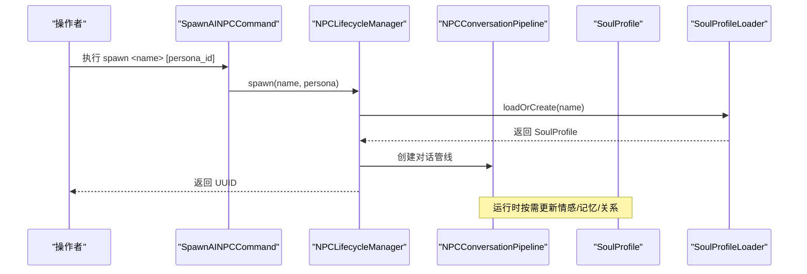
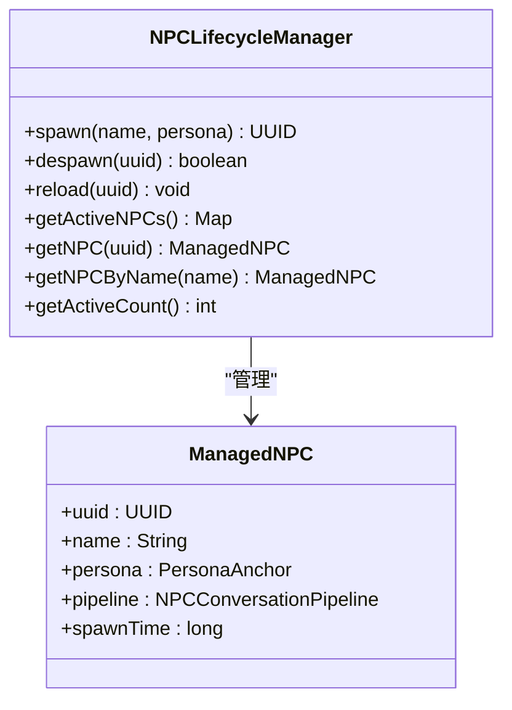
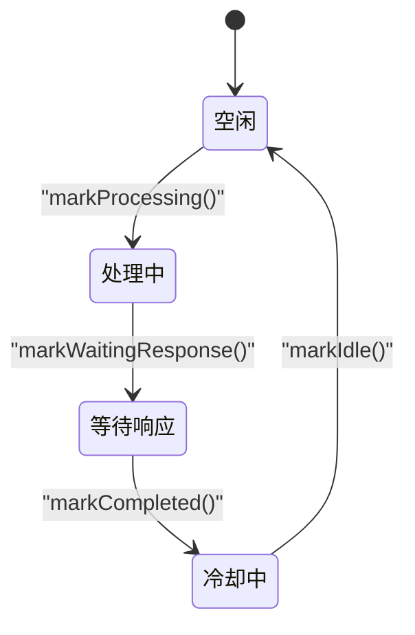
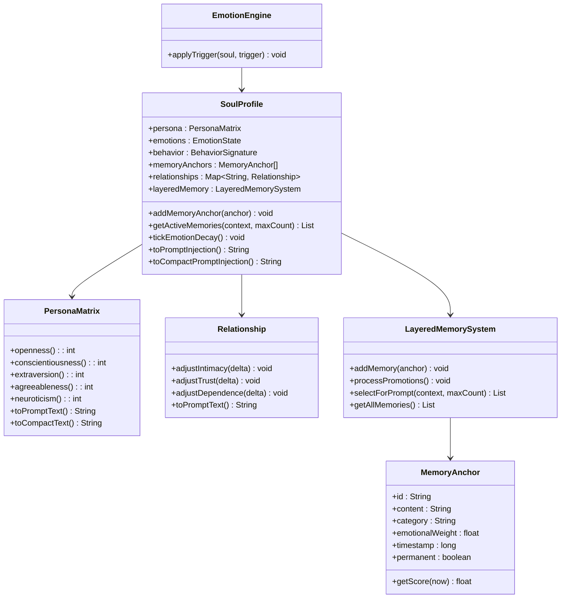
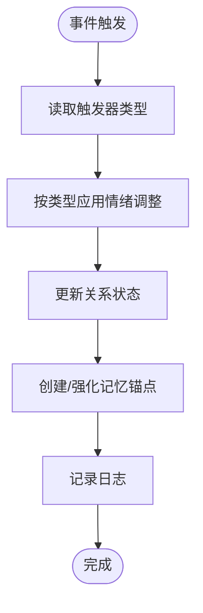
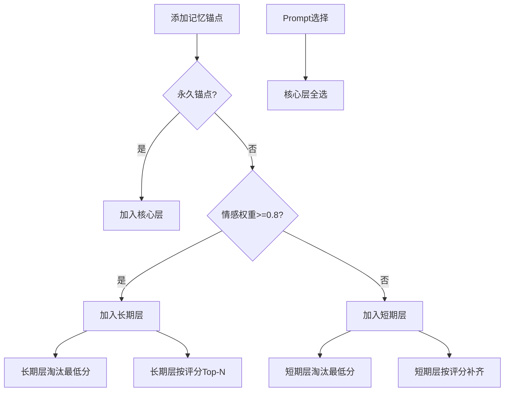
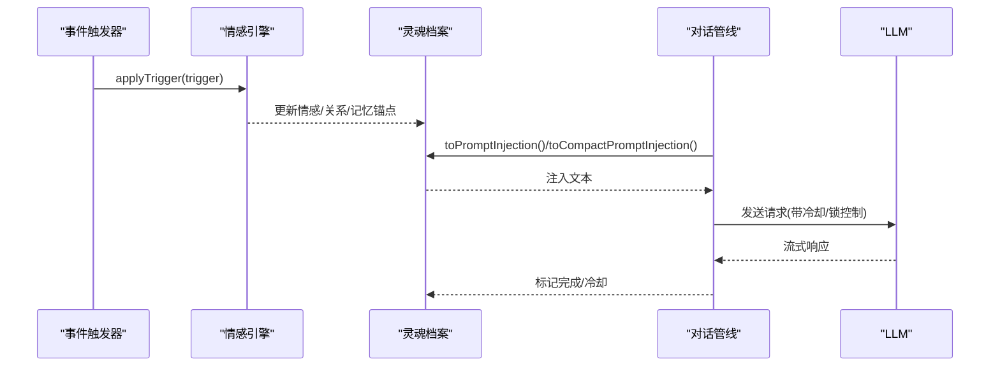
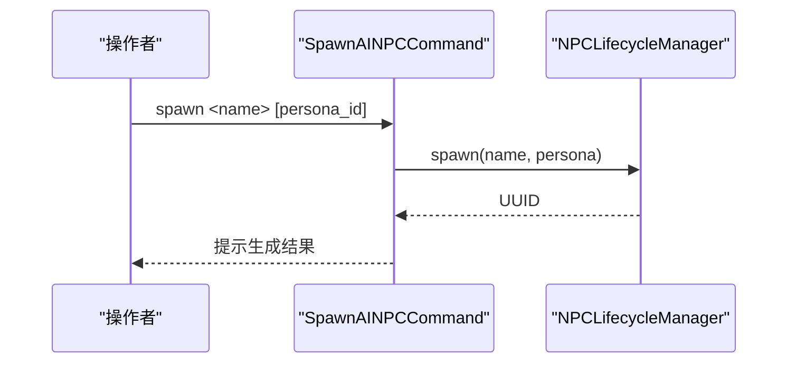
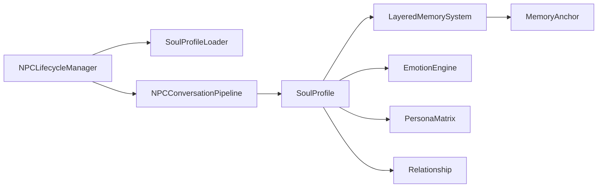
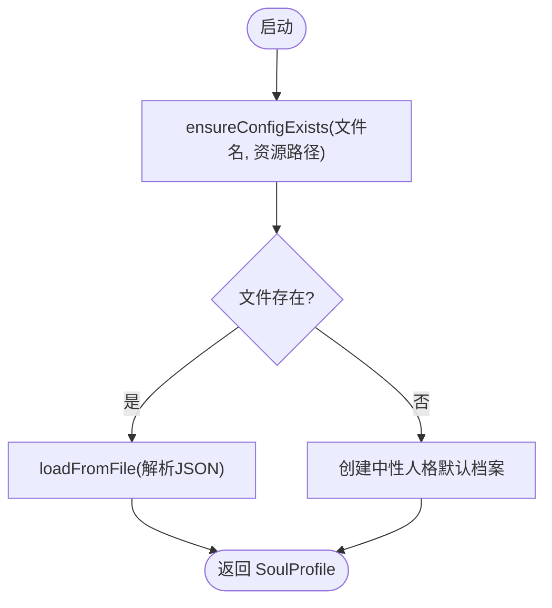

# AI NPC 系统

<cite>
**本文档引用的文件**
- [Player2NPC.java](file://src/main/java/com/goodbird/player2npc/Player2NPC.java)
- [Player2NPCClient.java](file://src/main/java/com/goodbird/player2npc/Player2NPCClient.java)
- [NPCLifecycleManager.java](file://src/main/java/adris/altoclef/player2api/NPCLifecycleManager.java)
- [NPCConversationPipeline.java](file://src/main/java/adris/altoclef/player2api/NPCConversationPipeline.java)
- [SoulProfile.java](file://src/main/java/adris/altoclef/player2api/soul/SoulProfile.java)
- [EmotionEngine.java](file://src/main/java/adris/altoclef/player2api/soul/EmotionEngine.java)
- [PersonaMatrix.java](file://src/main/java/adris/altoclef/player2api/soul/PersonaMatrix.java)
- [Relationship.java](file://src/main/java/adris/altoclef/player2api/soul/Relationship.java)
- [MemoryAnchor.java](file://src/main/java/adris/altoclef/player2api/soul/MemoryAnchor.java)
- [LayeredMemorySystem.java](file://src/main/java/adris/altoclef/player2api/memory/LayeredMemorySystem.java)
- [SoulProfileLoader.java](file://src/main/java/adris/altoclef/player2api/soul/SoulProfileLoader.java)
- [SpawnAINPCCommand.java](file://src/main/java/adris/altoclef/commands/SpawnAINPCCommand.java)
</cite>

## 目录
1. [简介](#简介)
2. [项目结构](#项目结构)
3. [核心组件](#核心组件)
4. [架构总览](#架构总览)
5. [详细组件分析](#详细组件分析)
6. [依赖分析](#依赖分析)
7. [性能考虑](#性能考虑)
8. [故障排查指南](#故障排查指南)
9. [结论](#结论)
10. [附录](#附录)

## 简介
本文件面向 AI NPC 系统的实现与扩展，围绕 NPC 实体生命周期管理、个性化系统（灵魂档案、情感引擎、记忆系统分层架构）以及行为控制机制进行深入解析。文档同时提供可视化架构图、流程图与序列图，帮助读者快速理解系统设计与关键实现路径。

## 项目结构
系统采用模块化分层组织：
- 客户端与网络层：负责麦克风录音、按键绑定、音频传输与实体渲染注册
- NPC 生命周期与对话管线：负责 NPC 的生成、运行时状态与销毁
- 个性化系统：灵魂档案（SoulProfile）承载人格、情感、行为签名、记忆锚点与关系；情感引擎根据事件触发更新情绪；记忆系统按层管理短期/长期/核心记忆
- 命令接口：提供创建/销毁/查询 NPC 的命令入口

```mermaid
graph TB
subgraph "客户端与网络"
P2N["Player2NPCClient<br/>按键/录音/网络接收"]
NET["网络包<br/>STT/Spawn/Despawn"]
end
subgraph "服务端核心"
P2S["Player2NPC<br/>实体类型注册/事件监听"]
LIFECYCLE["NPCLifecycleManager<br/>NPC生命周期"]
PIPE["NPCConversationPipeline<br/>对话管线"]
SOUL["SoulProfile<br/>灵魂档案"]
MEMSYS["LayeredMemorySystem<br/>分层记忆"]
EMOTION["EmotionEngine<br/>情感引擎"]
PERSONA["PersonaMatrix<br/>人格矩阵"]
REL["Relationship<br/>关系档案"]
ANCHOR["MemoryAnchor<br/>记忆锚点"]
LOADER["SoulProfileLoader<br/>加载/保存"]
end
subgraph "命令接口"
CMD["SpawnAINPCCommand<br/>spawn/despawn/npcls"]
end
P2N --> NET
P2S --> NET
NET --> LIFECYCLE
CMD --> LIFECYCLE
LIFECYCLE --> PIPE
PIPE --> SOUL
SOUL --> MEMSYS
SOUL --> EMOTION
SOUL --> PERSONA
SOUL --> REL
MEMSYS --> ANCHOR
LOADER <- --> SOUL
```

**图表来源**
- [Player2NPCClient.java:1-164](file://src/main/java/com/goodbird/player2npc/Player2NPCClient.java#L1-L164)
- [Player2NPC.java:1-67](file://src/main/java/com/goodbird/player2npc/Player2NPC.java#L1-L67)
- [NPCLifecycleManager.java:1-166](file://src/main/java/adris/altoclef/player2api/NPCLifecycleManager.java#L1-L166)
- [NPCConversationPipeline.java:1-194](file://src/main/java/adris/altoclef/player2api/NPCConversationPipeline.java#L1-L194)
- [SoulProfile.java:1-226](file://src/main/java/adris/altoclef/player2api/soul/SoulProfile.java#L1-L226)
- [LayeredMemorySystem.java:1-172](file://src/main/java/adris/altoclef/player2api/memory/LayeredMemorySystem.java#L1-L172)
- [EmotionEngine.java:1-184](file://src/main/java/adris/altoclef/player2api/soul/EmotionEngine.java#L1-L184)
- [PersonaMatrix.java:1-120](file://src/main/java/adris/altoclef/player2api/soul/PersonaMatrix.java#L1-L120)
- [Relationship.java:1-70](file://src/main/java/adris/altoclef/player2api/soul/Relationship.java#L1-L70)
- [MemoryAnchor.java:1-83](file://src/main/java/adris/altoclef/player2api/soul/MemoryAnchor.java#L1-L83)
- [SoulProfileLoader.java:1-226](file://src/main/java/adris/altoclef/player2api/soul/SoulProfileLoader.java#L1-L226)
- [SpawnAINPCCommand.java:1-106](file://src/main/java/adris/altoclef/commands/SpawnAINPCCommand.java#L1-L106)

**章节来源**
- [Player2NPC.java:1-67](file://src/main/java/com/goodbird/player2npc/Player2NPC.java#L1-L67)
- [Player2NPCClient.java:1-164](file://src/main/java/com/goodbird/player2npc/Player2NPCClient.java#L1-L164)
- [SpawnAINPCCommand.java:1-106](file://src/main/java/adris/altoclef/commands/SpawnAINPCCommand.java#L1-L106)

## 核心组件
- NPC 生命周期管理器：负责 NPC 的生成、销毁与重载，维护活跃 NPC 映射，协调灵魂档案的加载与持久化
- 对话管线：为每个 NPC 维护独立的状态机与锁，避免并发阻塞，控制 LLM 请求的节流与冷却
- 灵魂档案：聚合人格矩阵、情感状态、行为签名、记忆锚点与关系图谱，提供 Prompt 注入能力
- 情感引擎：根据游戏事件触发器调整情绪强度与关系状态
- 分层记忆系统：按核心/长期/短期三层管理记忆，支持晋升、淘汰与上下文相关选择
- 记忆锚点：独立于对话历史的永久性情感记忆单元
- 关系档案：记录 NPC 与玩家之间的亲密度、信任度与依赖度
- 人格矩阵：基于大五人格模型的数值化个性表示
- 加载器：从资源文件加载或生成默认配置，支持保存 JSON

**章节来源**
- [NPCLifecycleManager.java:1-166](file://src/main/java/adris/altoclef/player2api/NPCLifecycleManager.java#L1-L166)
- [NPCConversationPipeline.java:1-194](file://src/main/java/adris/altoclef/player2api/NPCConversationPipeline.java#L1-L194)
- [SoulProfile.java:1-226](file://src/main/java/adris/altoclef/player2api/soul/SoulProfile.java#L1-L226)
- [EmotionEngine.java:1-184](file://src/main/java/adris/altoclef/player2api/soul/EmotionEngine.java#L1-L184)
- [LayeredMemorySystem.java:1-172](file://src/main/java/adris/altoclef/player2api/memory/LayeredMemorySystem.java#L1-L172)
- [MemoryAnchor.java:1-83](file://src/main/java/adris/altoclef/player2api/soul/MemoryAnchor.java#L1-L83)
- [Relationship.java:1-70](file://src/main/java/adris/altoclef/player2api/soul/Relationship.java#L1-L70)
- [PersonaMatrix.java:1-120](file://src/main/java/adris/altoclef/player2api/soul/PersonaMatrix.java#L1-L120)
- [SoulProfileLoader.java:1-226](file://src/main/java/adris/altoclef/player2api/soul/SoulProfileLoader.java#L1-L226)

## 架构总览
系统以“命令 → 生命周期 → 对话管线 → 个性化系统”的链路为核心，结合网络层完成语音输入与实体渲染。



**图表来源**
- [SpawnAINPCCommand.java:1-106](file://src/main/java/adris/altoclef/commands/SpawnAINPCCommand.java#L1-L106)
- [NPCLifecycleManager.java:1-166](file://src/main/java/adris/altoclef/player2api/NPCLifecycleManager.java#L1-L166)
- [NPCConversationPipeline.java:1-194](file://src/main/java/adris/altoclef/player2api/NPCConversationPipeline.java#L1-L194)
- [SoulProfileLoader.java:1-226](file://src/main/java/adris/altoclef/player2api/soul/SoulProfileLoader.java#L1-L226)

## 详细组件分析

### NPC 生命周期管理
- 生成：分配 UUID，创建对话管线，加载或生成灵魂档案，加入活跃映射
- 销毁：移除活跃项，持久化灵魂档案
- 重载：重新加载指定 NPC 的灵魂档案
- 查询：按 UUID/名称获取活跃 NPC，统计活跃数量



**图表来源**
- [NPCLifecycleManager.java:1-166](file://src/main/java/adris/altoclef/player2api/NPCLifecycleManager.java#L1-L166)

**章节来源**
- [NPCLifecycleManager.java:65-121](file://src/main/java/adris/altoclef/player2api/NPCLifecycleManager.java#L65-L121)

### 对话管线与并发控制
- 状态机：IDLE → PROCESSING → WAITING_RESPONSE → COOLDOWN
- 锁机制：每 NPC 独立等待锁，超时自动释放
- 冷却期：最小响应间隔，避免频繁触发
- 调度判断：仅当状态为空闲且未锁定且冷却完毕时允许处理



**图表来源**
- [NPCConversationPipeline.java:41-194](file://src/main/java/adris/altoclef/player2api/NPCConversationPipeline.java#L41-L194)

**章节来源**
- [NPCConversationPipeline.java:18-151](file://src/main/java/adris/altoclef/player2api/NPCConversationPipeline.java#L18-L151)

### 灵魂档案与个性化系统
- 结构组成：人格矩阵、情感状态、行为签名、记忆锚点集合、关系图谱
- Prompt 注入：提供完整与紧凑两种注入格式，便于上下文压缩
- 情绪自然衰减：定时衰减，加速恢复
- 记忆锚点管理：添加、删除、清理旧锚点，按评分与时间衰减



**图表来源**
- [SoulProfile.java:1-226](file://src/main/java/adris/altoclef/player2api/soul/SoulProfile.java#L1-L226)
- [PersonaMatrix.java:1-120](file://src/main/java/adris/altoclef/player2api/soul/PersonaMatrix.java#L1-L120)
- [Relationship.java:1-70](file://src/main/java/adris/altoclef/player2api/soul/Relationship.java#L1-L70)
- [LayeredMemorySystem.java:1-172](file://src/main/java/adris/altoclef/player2api/memory/LayeredMemorySystem.java#L1-L172)
- [MemoryAnchor.java:1-83](file://src/main/java/adris/altoclef/player2api/soul/MemoryAnchor.java#L1-L83)
- [EmotionEngine.java:1-184](file://src/main/java/adris/altoclef/player2api/soul/EmotionEngine.java#L1-L184)

**章节来源**
- [SoulProfile.java:37-174](file://src/main/java/adris/altoclef/player2api/soul/SoulProfile.java#L37-L174)
- [PersonaMatrix.java:58-114](file://src/main/java/adris/altoclef/player2api/soul/PersonaMatrix.java#L58-L114)
- [Relationship.java:46-64](file://src/main/java/adris/altoclef/player2api/soul/Relationship.java#L46-L64)
- [LayeredMemorySystem.java:101-129](file://src/main/java/adris/altoclef/player2api/memory/LayeredMemorySystem.java#L101-L129)

### 情感引擎工作原理
- 触发器类型覆盖玩家互动、环境变化、任务状态、天气与危险等
- 根据人格矩阵微调情绪增量（如尽责者失败时更易愤怒）
- 更新关系状态（亲密度、信任度、依赖度），并记录记忆锚点



**图表来源**
- [EmotionEngine.java:17-171](file://src/main/java/adris/altoclef/player2api/soul/EmotionEngine.java#L17-L171)

**章节来源**
- [EmotionEngine.java:23-171](file://src/main/java/adris/altoclef/player2api/soul/EmotionEngine.java#L23-L171)

### 记忆系统分层架构
- 分层策略：永久锚点进核心层；高情感权重进长期层；其余进短期层
- 晋升机制：短期记忆被高频引用或高情感权重时晋升为长期
- 淘汰策略：按评分淘汰最低分的记忆（永久锚点不淘汰）
- 选择策略：核心全量注入；长期按评分 Top-N；短期按评分补齐



**图表来源**
- [LayeredMemorySystem.java:30-129](file://src/main/java/adris/altoclef/player2api/memory/LayeredMemorySystem.java#L30-L129)

**章节来源**
- [LayeredMemorySystem.java:14-171](file://src/main/java/adris/altoclef/player2api/memory/LayeredMemorySystem.java#L14-L171)

### 行为控制机制与智能决策
- 行为签名：从人格矩阵推导而来，反映主动性、风险容忍度、独立性、效率与忠诚度
- 决策依据：当前情绪主导状态、记忆锚点（上下文相关）、关系状态、环境触发器
- 输出约束：通过 Prompt 注入确保语言风格与情感一致



**图表来源**
- [EmotionEngine.java:17-171](file://src/main/java/adris/altoclef/player2api/soul/EmotionEngine.java#L17-L171)
- [SoulProfile.java:148-211](file://src/main/java/adris/altoclef/player2api/soul/SoulProfile.java#L148-L211)
- [NPCConversationPipeline.java:127-178](file://src/main/java/adris/altoclef/player2api/NPCConversationPipeline.java#L127-L178)

**章节来源**
- [SoulProfile.java:148-224](file://src/main/java/adris/altoclef/player2api/soul/SoulProfile.java#L148-L224)
- [NPCConversationPipeline.java:127-178](file://src/main/java/adris/altoclef/player2api/NPCConversationPipeline.java#L127-L178)

### NPC 实体创建与命令示例
- 命令入口：spawn/despawn/npcls
- 生成流程：解析参数 → 获取或生成人格锚点 → 生命周期管理器生成 → 返回 UUID
- 销毁流程：按名称查找 → 移除活跃项 → 持久化灵魂档案



**图表来源**
- [SpawnAINPCCommand.java:20-47](file://src/main/java/adris/altoclef/commands/SpawnAINPCCommand.java#L20-L47)

**章节来源**
- [SpawnAINPCCommand.java:20-98](file://src/main/java/adris/altoclef/commands/SpawnAINPCCommand.java#L20-L98)

## 依赖分析
- 组件耦合
  - 生命周期管理器与加载器：强耦合（加载/保存灵魂档案）
  - 对话管线与生命周期：弱耦合（通过 UUID/名称关联）
  - 灵魂档案与记忆系统：强内聚（记忆锚点直接注入）
  - 情感引擎与灵魂档案：单向依赖（读取人格与写入情感/关系/记忆）
- 外部依赖
  - 网络层：Fabric 网络 API（全局接收器）
  - 文件系统：配置目录与资源复制（加载默认模板）



**图表来源**
- [NPCLifecycleManager.java:72-101](file://src/main/java/adris/altoclef/player2api/NPCLifecycleManager.java#L72-L101)
- [SoulProfileLoader.java:62-132](file://src/main/java/adris/altoclef/player2api/soul/SoulProfileLoader.java#L62-L132)
- [NPCConversationPipeline.java:58-61](file://src/main/java/adris/altoclef/player2api/NPCConversationPipeline.java#L58-L61)
- [SoulProfile.java:37-63](file://src/main/java/adris/altoclef/player2api/soul/SoulProfile.java#L37-L63)
- [LayeredMemorySystem.java:30-38](file://src/main/java/adris/altoclef/player2api/memory/LayeredMemorySystem.java#L30-L38)
- [EmotionEngine.java:17-171](file://src/main/java/adris/altoclef/player2api/soul/EmotionEngine.java#L17-L171)
- [PersonaMatrix.java:19-25](file://src/main/java/adris/altoclef/player2api/soul/PersonaMatrix.java#L19-L25)
- [Relationship.java:17-21](file://src/main/java/adris/altoclef/player2api/soul/Relationship.java#L17-L21)
- [MemoryAnchor.java:19-28](file://src/main/java/adris/altoclef/player2api/soul/MemoryAnchor.java#L19-L28)

**章节来源**
- [NPCLifecycleManager.java:20-166](file://src/main/java/adris/altoclef/player2api/NPCLifecycleManager.java#L20-L166)
- [SoulProfileLoader.java:35-132](file://src/main/java/adris/altoclef/player2api/soul/SoulProfileLoader.java#L35-L132)

## 性能考虑
- 并发与锁：每个 NPC 独立锁与状态机，避免全局阻塞
- 冷却期：最小响应间隔减少重复触发带来的负载
- 记忆容量：三层容量上限与淘汰策略，防止无限增长
- Prompt 压缩：紧凑注入格式降低 token 消耗
- 文件 IO：加载默认模板与保存 JSON 在后台进行，避免主线程阻塞

## 故障排查指南
- 生成失败
  - 检查命令参数与人格锚点是否存在
  - 查看生命周期日志与加载器回退逻辑
- 销毁异常
  - 确认 UUID/名称对应活跃 NPC 是否存在
  - 检查保存日志是否成功
- 情绪不更新
  - 确认触发器类型与参数正确
  - 检查人格矩阵对情绪调整的影响
- 记忆不生效
  - 检查记忆锚点情感权重与类别
  - 确认分层选择策略与 Prompt 注入顺序

**章节来源**
- [SpawnAINPCCommand.java:32-47](file://src/main/java/adris/altoclef/commands/SpawnAINPCCommand.java#L32-L47)
- [NPCLifecycleManager.java:92-104](file://src/main/java/adris/altoclef/player2api/NPCLifecycleManager.java#L92-L104)
- [EmotionEngine.java:165-171](file://src/main/java/adris/altoclef/player2api/soul/EmotionEngine.java#L165-L171)
- [LayeredMemorySystem.java:101-129](file://src/main/java/adris/altoclef/player2api/memory/LayeredMemorySystem.java#L101-L129)

## 结论
AI NPC 系统通过“命令 → 生命周期 → 对话管线 → 个性化系统”的清晰分层，实现了可扩展的 NPC 生命周期管理与高度个性化的智能行为。情感引擎与分层记忆系统共同驱动 NPC 的情绪与记忆演进，Prompt 注入机制确保输出风格与情境一致。建议在扩展时遵循现有分层与职责边界，优先通过配置文件与加载器扩展个性化内容，再逐步引入新的触发器与行为模式。

## 附录

### 个性化配置加载流程
- 优先从运行时配置目录加载；不存在则从资源复制默认模板
- 解析 JSON 字段：人格矩阵、情感状态、行为签名、记忆锚点、关系
- 回退策略：若解析失败，使用中性人格创建默认档案



**图表来源**
- [SoulProfileLoader.java:35-57](file://src/main/java/adris/altoclef/player2api/soul/SoulProfileLoader.java#L35-L57)

**章节来源**
- [SoulProfileLoader.java:35-132](file://src/main/java/adris/altoclef/player2api/soul/SoulProfileLoader.java#L35-L132)

### 扩展指南
- 新增个性特征
  - 在人格矩阵中增加维度或调整 Prompt 文本
  - 在情感引擎中新增触发器类型并映射到情绪调整
- 新增行为模式
  - 在行为签名中增加维度或调整推导逻辑
  - 在对话管线中调整冷却与锁策略
- 新增记忆类型
  - 在记忆锚点类别中新增分类
  - 在分层系统中调整晋升/淘汰策略
- 新增触发器
  - 在情感引擎中新增触发器类型分支
  - 在 NPC 生命周期中接入事件源（如自定义事件总线）