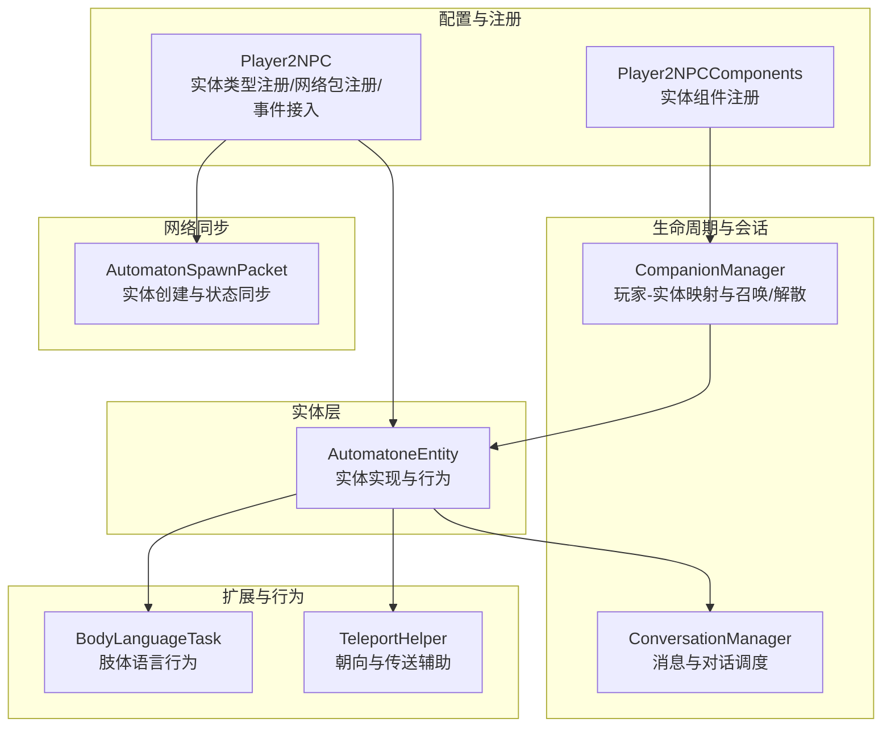
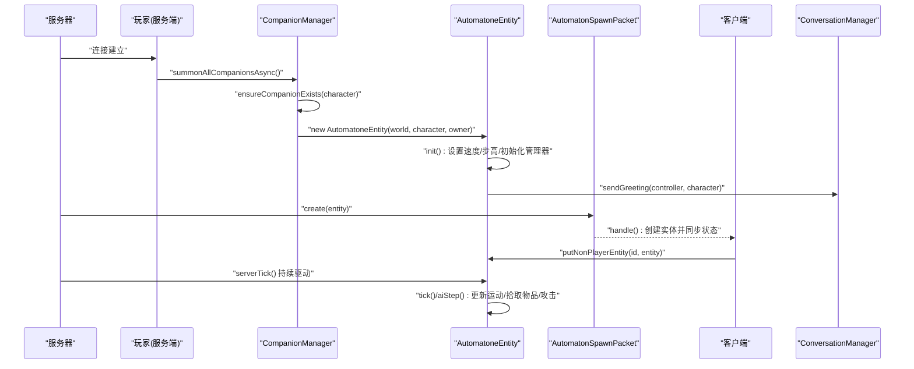
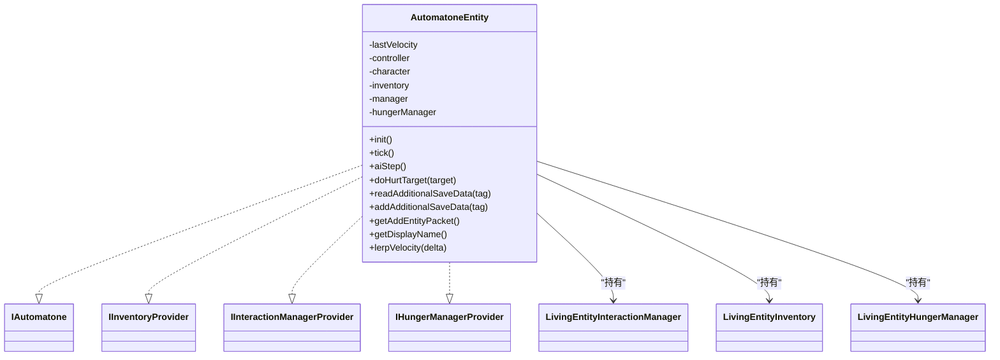
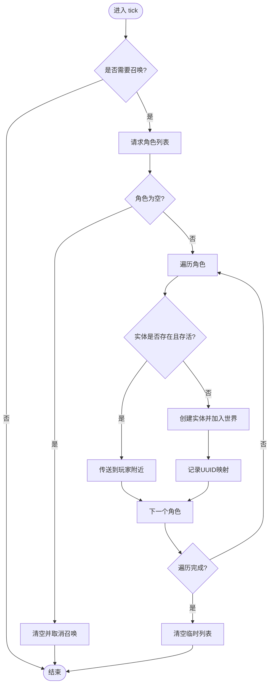
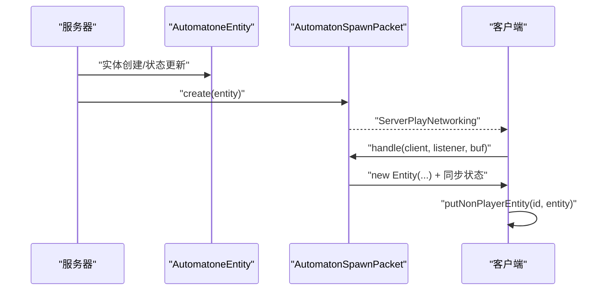
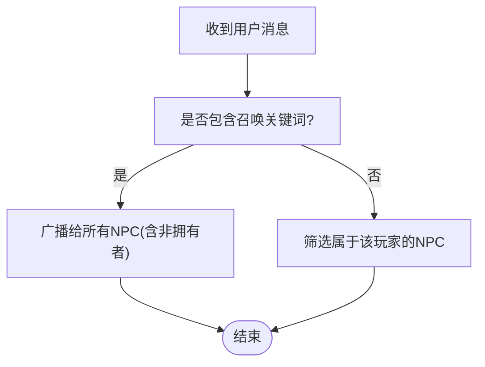
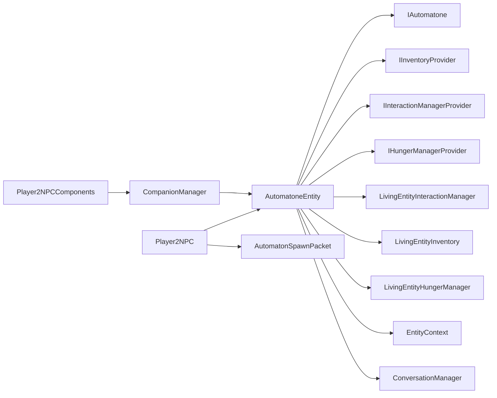

# NPC 实体管理

<cite>
**本文引用的文件**   
- [AutomatoneEntity.java](file://src/main/java/com/goodbird/player2npc/companion/AutomatoneEntity.java)
- [CompanionManager.java](file://src/main/java/com/goodbird/player2npc/companion/CompanionManager.java)
- [Player2NPC.java](file://src/main/java/com/goodbird/player2npc/Player2NPC.java)
- [AutomatonSpawnPacket.java](file://src/main/java/com/goodbird/player2npc/network/AutomatonSpawnPacket.java)
- [IAutomatone.java](file://src/main/java/baritone/api/entity/IAutomatone.java)
- [IInventoryProvider.java](file://src/main/java/baritone/api/entity/IInventoryProvider.java)
- [IInteractionManagerProvider.java](file://src/main/java/baritone/api/entity/IInteractionManagerProvider.java)
- [IHungerManagerProvider.java](file://src/main/java/baritone/api/entity/IHungerManagerProvider.java)
- [LivingEntityInteractionManager.java](file://src/main/java/baritone/api/entity/LivingEntityInteractionManager.java)
- [EntityContext.java](file://src/main/java/baritone/utils/player/EntityContext.java)
- [ConversationManager.java](file://src/main/java/adris/altoclef/player2api/manager/ConversationManager.java)
- [NPCLifecycleManager.java](file://src/main/java/adris/altoclef/player2api/NPCLifecycleManager.java)
- [Character.java](file://src/main/java/adris/altoclef/player2api/Character.java)
- [Player2NPCComponents.java](file://src/main/java/com/goodbird/player2npc/Player2NPCComponents.java)
- [BodyLanguageTask.java](file://src/main/java/adris/altoclef/tasks/movement/BodyLanguageTask.java)
- [TeleportHelper.java](file://src/main/java/adris/altoclef/util/TeleportHelper.java)
</cite>

## 目录
1. [简介](#简介)
2. [项目结构](#项目结构)
3. [核心组件](#核心组件)
4. [架构总览](#架构总览)
5. [详细组件分析](#详细组件分析)
6. [依赖关系分析](#依赖关系分析)
7. [性能考量](#性能考量)
8. [故障排查指南](#故障排查指南)
9. [结论](#结论)
10. [附录](#附录)

## 简介
本文件面向 NPC 实体管理功能，围绕 AutomatoneEntity 类展开，系统阐述其作为“自动人偶”实体的设计与实现，包括其实现的 IAutomatone、IInventoryProvider、IInteractionManagerProvider、IHungerManagerProvider 接口的作用与细节；梳理 NPC 生命周期管理（创建、初始化、运行时维护、销毁）；解释实体属性配置（移动速度、跳跃高度等）；给出 NBT 序列化与反序列化的实现要点；并提供扩展指南，帮助开发者为 NPC 添加新行为与外观定制。

## 项目结构
本模块围绕“自动人偶”实体在服务端与客户端协同工作，主要涉及以下层次：
- 实体定义层：AutomatoneEntity 作为 Minecraft 实体，实现 Baritone 提供的自动化接口。
- 生命周期与会话层：CompanionManager 负责玩家与实体的绑定、召唤与解散；ConversationManager 负责对话与消息分发。
- 网络同步层：AutomatonSpawnPacket 负责实体创建与状态同步。
- 配置与注册层：Player2NPC 完成实体类型注册、网络包注册与生命周期事件接入。
- 扩展与行为层：通过任务系统（如 BodyLanguageTask）与工具类（如 TeleportHelper）扩展 NPC 的行为与外观。

**图表来源**
- [Player2NPC.java:38-67](file://src/main/java/com/goodbird/player2npc/Player2NPC.java#L38-L67)
- [AutomatoneEntity.java:50-313](file://src/main/java/com/goodbird/player2npc/companion/AutomatoneEntity.java#L50-L313)
- [AutomatonSpawnPacket.java:26-120](file://src/main/java/com/goodbird/player2npc/network/AutomatonSpawnPacket.java#L26-L120)
- [CompanionManager.java:28-191](file://src/main/java/com/goodbird/player2npc/companion/CompanionManager.java#L28-L191)
- [ConversationManager.java:27-201](file://src/main/java/adris/altoclef/player2api/manager/ConversationManager.java#L27-L201)
- [Player2NPCComponents.java:10-16](file://src/main/java/com/goodbird/player2npc/Player2NPCComponents.java#L10-L16)
- [BodyLanguageTask.java:10-211](file://src/main/java/adris/altoclef/tasks/movement/BodyLanguageTask.java#L10-L211)
- [TeleportHelper.java:192-238](file://src/main/java/adris/altoclef/util/TeleportHelper.java#L192-L238)

**章节来源**
- [Player2NPC.java:25-67](file://src/main/java/com/goodbird/player2npc/Player2NPC.java#L25-L67)
- [AutomatoneEntity.java:50-313](file://src/main/java/com/goodbird/player2npc/companion/AutomatoneEntity.java#L50-L313)

## 核心组件
- AutomatoneEntity：继承 Minecraft LivingEntity，实现 IAutomatone、IInventoryProvider、IInteractionManagerProvider、IHungerManagerProvider，承载 NPC 的运行时状态、控制器与行为逻辑。
- CompanionManager：基于 CCA（Cardinal Components API）为 ServerPlayer 绑定实体映射，负责批量召唤、解散与持久化。
- AutomatonSpawnPacket：自定义网络包，用于服务端向客户端同步实体创建与状态。
- Player2NPC：Mod 初始化入口，完成实体类型注册、网络包注册与生命周期事件接入。
- ConversationManager：负责用户消息与 NPC 对话的调度与分发。
- Baritone 接口与实现：IAutomatone、IInventoryProvider、IInteractionManagerProvider、IHungerManagerProvider 及其具体实现 LivingEntityInteractionManager、EntityContext 等，为 NPC 提供自动化能力与上下文访问。

**章节来源**
- [AutomatoneEntity.java:50-117](file://src/main/java/com/goodbird/player2npc/companion/AutomatoneEntity.java#L50-L117)
- [CompanionManager.java:28-191](file://src/main/java/com/goodbird/player2npc/companion/CompanionManager.java#L28-L191)
- [AutomatonSpawnPacket.java:26-120](file://src/main/java/com/goodbird/player2npc/network/AutomatonSpawnPacket.java#L26-L120)
- [Player2NPC.java:25-67](file://src/main/java/com/goodbird/player2npc/Player2NPC.java#L25-L67)
- [ConversationManager.java:27-201](file://src/main/java/adris/altoclef/player2api/manager/ConversationManager.java#L27-L201)
- [IAutomatone.java:1-9](file://src/main/java/baritone/api/entity/IAutomatone.java#L1-L9)
- [IInventoryProvider.java:1-5](file://src/main/java/baritone/api/entity/IInventoryProvider.java#L1-L5)
- [IInteractionManagerProvider.java:1-5](file://src/main/java/baritone/api/entity/IInteractionManagerProvider.java#L1-L5)
- [IHungerManagerProvider.java:1-5](file://src/main/java/baritone/api/entity/IHungerManagerProvider.java#L1-L5)
- [LivingEntityInteractionManager.java:46-83](file://src/main/java/baritone/api/entity/LivingEntityInteractionManager.java#L46-L83)
- [EntityContext.java:38-82](file://src/main/java/baritone/utils/player/EntityContext.java#L38-L82)

## 架构总览
下面的时序图展示了 NPC 实体从创建到运行的关键流程，包括服务端初始化、网络同步、客户端渲染以及对话与控制流的接入。

**图表来源**
- [CompanionManager.java:100-129](file://src/main/java/com/goodbird/player2npc/companion/CompanionManager.java#L100-L129)
- [AutomatoneEntity.java:78-99](file://src/main/java/com/goodbird/player2npc/companion/AutomatoneEntity.java#L78-L99)
- [AutomatoneEntity.java:164-188](file://src/main/java/com/goodbird/player2npc/companion/AutomatoneEntity.java#L164-L188)
- [AutomatonSpawnPacket.java:70-120](file://src/main/java/com/goodbird/player2npc/network/AutomatonSpawnPacket.java#L70-L120)
- [ConversationManager.java:191-195](file://src/main/java/adris/altoclef/player2api/manager/ConversationManager.java#L191-L195)

## 详细组件分析

### AutomatoneEntity 类设计与实现
- 接口实现
  - IAutomatone：通过 getBaritone() 获取 Baritone 控制器，使 NPC 能参与路径规划与行为树。
  - IInventoryProvider：提供 LivingEntityInventory，使 NPC 拥有类似玩家的背包与装备槽位。
  - IInteractionManagerProvider：提供 LivingEntityInteractionManager，使 NPC 能进行交互（挖掘、放置、使用）。
  - IHungerManagerProvider：提供 LivingEntityHungerManager，可选启用饥饿机制。
- 属性与初始化
  - 步高与移动速度：setMaxUpStep 与 MOVEMENT_SPEED 基础值在 init() 中设定。
  - 控制器与角色：仅在服务端初始化 AltoClefController，并通过 ConversationManager 发送问候。
- 运行时维护
  - tick()：更新交互管理器、物品栏、noActionTime（用于攻击判定）、服务端控制器。
  - aiStep()：水下潜降微调、头部朝向同步、自动拾取附近物品。
  - 攻击逻辑：doHurtTarget() 计算伤害与击退，结合附魔效果。
- NBT 序列化
  - readAdditionalSaveData()/addAdditionalSaveData()：保存/恢复头部朝向、物品栏、当前选中槽位、角色信息与拥有者 UUID。
- 渲染与显示
  - getAddEntityPacket()：使用自定义包进行实体添加。
  - getDisplayName()：优先使用 Character.shortName() 作为显示名。
- 外观与动画
  - lerpVelocity()：平滑插值速度，改善渲染表现。

**图表来源**
- [AutomatoneEntity.java:50-117](file://src/main/java/com/goodbird/player2npc/companion/AutomatoneEntity.java#L50-L117)
- [IAutomatone.java:1-9](file://src/main/java/baritone/api/entity/IAutomatone.java#L1-L9)
- [IInventoryProvider.java:1-5](file://src/main/java/baritone/api/entity/IInventoryProvider.java#L1-L5)
- [IInteractionManagerProvider.java:1-5](file://src/main/java/baritone/api/entity/IInteractionManagerProvider.java#L1-L5)
- [IHungerManagerProvider.java:1-5](file://src/main/java/baritone/api/entity/IHungerManagerProvider.java#L1-L5)
- [LivingEntityInteractionManager.java:46-83](file://src/main/java/baritone/api/entity/LivingEntityInteractionManager.java#L46-L83)

**章节来源**
- [AutomatoneEntity.java:78-117](file://src/main/java/com/goodbird/player2npc/companion/AutomatoneEntity.java#L78-L117)
- [AutomatoneEntity.java:118-162](file://src/main/java/com/goodbird/player2npc/companion/AutomatoneEntity.java#L118-L162)
- [AutomatoneEntity.java:164-242](file://src/main/java/com/goodbird/player2npc/companion/AutomatoneEntity.java#L164-L242)
- [AutomatoneEntity.java:298-312](file://src/main/java/com/goodbird/player2npc/companion/AutomatoneEntity.java#L298-L312)

### CompanionManager 生命周期与实体管理
- 角色拉取与异步召唤
  - summonAllCompanionsAsync()：从 CharacterUtils 请求角色列表，完成后标记需要召唤。
  - serverTick()：触发 summonCompanions()，按分配的角色确保实体存在或传送至玩家附近。
- 实体生命周期
  - ensureCompanionExists()：若已有实体但已死亡则传送，否则创建新实体并加入映射。
  - dismissCompanion()/dismissAllCompanions()：根据名称或映射移除实体。
- 持久化
  - readFromNbt()/writeToNbt()：保存/读取实体 UUID 映射，便于重连后重建关系。

**图表来源**
- [CompanionManager.java:45-98](file://src/main/java/com/goodbird/player2npc/companion/CompanionManager.java#L45-L98)
- [CompanionManager.java:100-129](file://src/main/java/com/goodbird/player2npc/companion/CompanionManager.java#L100-L129)
- [CompanionManager.java:131-150](file://src/main/java/com/goodbird/player2npc/companion/CompanionManager.java#L131-L150)
- [CompanionManager.java:177-190](file://src/main/java/com/goodbird/player2npc/companion/CompanionManager.java#L177-L190)

**章节来源**
- [CompanionManager.java:28-191](file://src/main/java/com/goodbird/player2npc/companion/CompanionManager.java#L28-L191)

### 网络同步与实体创建
- 自定义包
  - AutomatonSpawnPacket：封装实体 ID、UUID、位置、速度、朝向、角色与物品栏，写入/读取缓冲区。
  - create()/handle()：服务端打包发送，客户端解包创建实体并注入状态。
- 实体添加包
  - getAddEntityPacket()：返回自定义包，确保客户端正确识别与渲染。

**图表来源**
- [AutomatonSpawnPacket.java:70-120](file://src/main/java/com/goodbird/player2npc/network/AutomatonSpawnPacket.java#L70-L120)
- [AutomatoneEntity.java:298-302](file://src/main/java/com/goodbird/player2npc/companion/AutomatoneEntity.java#L298-L302)

**章节来源**
- [AutomatonSpawnPacket.java:26-120](file://src/main/java/com/goodbird/player2npc/network/AutomatonSpawnPacket.java#L26-L120)

### 对话与消息分发
- ConversationManager
  - onUserChatMessage()：解析用户消息，区分“召唤/求救”关键词与普通指令，广播或定向发送。
  - injectOnTick()：调度并执行 AgentConversationData 队列，处理 AI 侧消息传播与副作用。
  - sendGreeting()：首次建立联系时发送问候，触发 NPC 初始化。

**图表来源**
- [ConversationManager.java:114-130](file://src/main/java/adris/altoclef/player2api/manager/ConversationManager.java#L114-L130)
- [ConversationManager.java:173-189](file://src/main/java/adris/altoclef/player2api/manager/ConversationManager.java#L173-L189)

**章节来源**
- [ConversationManager.java:27-201](file://src/main/java/adris/altoclef/player2api/manager/ConversationManager.java#L27-L201)

### NPC 生命周期管理（数据层）
- NPCLifecycleManager
  - spawn()/despawn()/reload()：管理 NPC 数据层生命周期，销毁时持久化灵魂档案。
  - ManagedNPC：封装 NPC 的 UUID、名称、人格锚点、对话管线等。

**章节来源**
- [NPCLifecycleManager.java:20-121](file://src/main/java/adris/altoclef/player2api/NPCLifecycleManager.java#L20-L121)

## 依赖关系分析
- 组件耦合
  - AutomatoneEntity 依赖 Baritone 接口与实现（IAutomatone、IInventoryProvider、IInteractionManagerProvider、IHungerManagerProvider），并通过 LivingEntityInteractionManager、LivingEntityInventory、LivingEntityHungerManager 提供具体能力。
  - CompanionManager 依赖 CCA 组件系统，与 Player2NPC 的注册与事件挂钩。
  - Player2NPC 负责实体类型注册、网络包注册与服务端 tick 驱动。
- 外部依赖
  - Fabric API：网络包、对象构建器、生命周期事件。
  - Cardinal Components API：实体组件注册与存取。
  - Baritone API：实体上下文、交互管理器、行为框架。

**图表来源**
- [Player2NPC.java:38-67](file://src/main/java/com/goodbird/player2npc/Player2NPC.java#L38-L67)
- [AutomatoneEntity.java:50-117](file://src/main/java/com/goodbird/player2npc/companion/AutomatoneEntity.java#L50-L117)
- [Player2NPCComponents.java:10-16](file://src/main/java/com/goodbird/player2npc/Player2NPCComponents.java#L10-L16)
- [EntityContext.java:38-82](file://src/main/java/baritone/utils/player/EntityContext.java#L38-L82)

**章节来源**
- [Player2NPC.java:25-67](file://src/main/java/com/goodbird/player2npc/Player2NPC.java#L25-L67)
- [AutomatoneEntity.java:50-117](file://src/main/java/com/goodbird/player2npc/companion/AutomatoneEntity.java#L50-L117)
- [Player2NPCComponents.java:10-16](file://src/main/java/com/goodbird/player2npc/Player2NPCComponents.java#L10-L16)
- [EntityContext.java:38-82](file://src/main/java/baritone/utils/player/EntityContext.java#L38-L82)

## 性能考量
- tick 开销控制
  - 在 tick() 中仅更新必要组件（交互管理器、物品栏、控制器），避免在客户端重复计算。
  - 将控制器的 serverTick() 限定在服务端，减少客户端负载。
- 物品拾取范围
  - aiStep() 中对 3 格范围内物品进行检测与拾取，建议在大世界中配合规则开关（如 mobGriefing）与频率控制，避免频繁实体扫描。
- 网络同步
  - AutomatonSpawnPacket 对速度进行压缩（short 编码）与裁剪，降低带宽占用。
- 路径与行为
  - 通过 Baritone 的 EntityContext 与 CalculationContext 获取实体尺寸与环境信息，有助于路径规划的准确性与效率。

[本节为通用指导，无需特定文件引用]

## 故障排查指南
- 实体未显示或无法交互
  - 检查 getAddEntityPacket() 是否返回自定义包，客户端 handle() 是否正确创建实体并 putNonPlayerEntity。
  - 确认网络包注册与服务端/客户端版本一致。
- 角色信息丢失
  - 检查 NBT 读写：确保 CharacterUtils 读写正常，且 addAdditionalSaveData/writeToNbt 包含 character 字段。
- 无法自动拾取物品
  - 检查 GameRules.RULE_MOBGRIEFING 是否开启，pickupItems() 的包围盒与延迟判断是否符合预期。
- 攻击无效
  - 确认 noActionTime 是否被正确重置，doHurtTarget() 的伤害与击退计算是否生效。
- 对话不响应
  - 检查 ConversationManager 的关键词匹配与广播逻辑，确认 sendGreeting() 已被调用。

**章节来源**
- [AutomatonSpawnPacket.java:100-120](file://src/main/java/com/goodbird/player2npc/network/AutomatonSpawnPacket.java#L100-L120)
- [AutomatoneEntity.java:118-162](file://src/main/java/com/goodbird/player2npc/companion/AutomatoneEntity.java#L118-L162)
- [AutomatoneEntity.java:190-210](file://src/main/java/com/goodbird/player2npc/companion/AutomatoneEntity.java#L190-L210)
- [AutomatoneEntity.java:212-242](file://src/main/java/com/goodbird/player2npc/companion/AutomatoneEntity.java#L212-L242)
- [ConversationManager.java:114-130](file://src/main/java/adris/altoclef/player2api/manager/ConversationManager.java#L114-L130)

## 结论
AutomatoneEntity 将 Minecraft 实体与 Baritone 的自动化能力、AltoClef 的对话与记忆系统有机结合，形成可扩展的 NPC 管理框架。通过 CompanionManager 的生命周期管理、AutomatonSpawnPacket 的网络同步、以及 ConversationManager 的消息分发，实现了从创建到运行的闭环。开发者可在保持现有接口契约的前提下，通过任务系统与工具类扩展 NPC 的行为与外观，同时注意性能与网络开销的平衡。

[本节为总结，无需特定文件引用]

## 附录

### 实体生命周期管理（从创建到销毁）
- 创建
  - 服务端：CompanionManager.ensureCompanionExists() 创建实体并加入世界。
  - 客户端：AutomatonSpawnPacket.handle() 解包并创建实体实例。
- 初始化
  - AutomatoneEntity.init() 设置步高与移动速度，初始化交互管理器、物品栏与饥饿管理器；服务端初始化控制器并发送问候。
- 运行时维护
  - tick()/aiStep()：更新状态、拾取物品、攻击、渲染插值。
- 销毁
  - 通过 CompanionManager.dismissCompanion()/dismissAllCompanions() 移除实体。
  - 数据层：NPCLifecycleManager.despawn() 持久化灵魂档案。

**章节来源**
- [CompanionManager.java:100-129](file://src/main/java/com/goodbird/player2npc/companion/CompanionManager.java#L100-L129)
- [AutomatonSpawnPacket.java:100-120](file://src/main/java/com/goodbird/player2npc/network/AutomatonSpawnPacket.java#L100-L120)
- [AutomatoneEntity.java:78-99](file://src/main/java/com/goodbird/player2npc/companion/AutomatoneEntity.java#L78-L99)
- [AutomatoneEntity.java:164-188](file://src/main/java/com/goodbird/player2npc/companion/AutomatoneEntity.java#L164-L188)
- [NPCLifecycleManager.java:86-105](file://src/main/java/adris/altoclef/player2api/NPCLifecycleManager.java#L86-L105)

### 属性配置示例（路径与参考）
- 移动速度与步高
  - 设置位置：[AutomatoneEntity.java:78-81](file://src/main/java/com/goodbird/player2npc/companion/AutomatoneEntity.java#L78-L81)
- 跳跃高度
  - 默认由实体类型属性决定，可通过自定义实体类型或修改属性基线实现（参考实体注册与默认属性）：[Player2NPC.java:38-46](file://src/main/java/com/goodbird/player2npc/Player2NPC.java#L38-L46)

**章节来源**
- [AutomatoneEntity.java:78-81](file://src/main/java/com/goodbird/player2npc/companion/AutomatoneEntity.java#L78-L81)
- [Player2NPC.java:38-46](file://src/main/java/com/goodbird/player2npc/Player2NPC.java#L38-L46)

### NBT 序列化与反序列化示例（路径）
- 保存字段：头部朝向、物品栏、当前槽位、角色信息、拥有者 UUID
  - 保存：[AutomatoneEntity.java:147-162](file://src/main/java/com/goodbird/player2npc/companion/AutomatoneEntity.java#L147-L162)
  - 加载：[AutomatoneEntity.java:118-145](file://src/main/java/com/goodbird/player2npc/companion/AutomatoneEntity.java#L118-L145)
- 组件持久化：CompanionManager 映射保存/读取
  - 保存：[CompanionManager.java:185-190](file://src/main/java/com/goodbird/player2npc/companion/CompanionManager.java#L185-L190)
  - 加载：[CompanionManager.java:177-183](file://src/main/java/com/goodbird/player2npc/companion/CompanionManager.java#L177-L183)

**章节来源**
- [AutomatoneEntity.java:118-162](file://src/main/java/com/goodbird/player2npc/companion/AutomatoneEntity.java#L118-L162)
- [CompanionManager.java:177-190](file://src/main/java/com/goodbird/player2npc/companion/CompanionManager.java#L177-L190)

### 扩展指南：新增行为与外观
- 新增肢体语言动作
  - 在 BodyLanguageTask 中扩展 Type 枚举与对应序列，参考现有动作构造方式：[BodyLanguageTask.java:12-211](file://src/main/java/adris/altoclef/tasks/movement/BodyLanguageTask.java#L12-L211)
- 外观与显示名
  - 使用 Character.skinURL 与 textureLocation（实体字段）进行渲染定制；显示名通过 getDisplayName() 返回 Character.shortName()：[AutomatoneEntity.java:304-312](file://src/main/java/com/goodbird/player2npc/companion/AutomatoneEntity.java#L304-L312)
- 朝向与传送
  - 使用 TeleportHelper.adjustFacing() 使 NPC 面向目标，参考实现：[TeleportHelper.java:215-237](file://src/main/java/adris/altoclef/util/TeleportHelper.java#L215-L237)
- 角色与对话
  - 通过 Character 对象与 ConversationManager 的问候与消息分发机制接入 NPC 的人格与记忆：[Character.java:5-21](file://src/main/java/adris/altoclef/player2api/Character.java#L5-L21), [ConversationManager.java:191-195](file://src/main/java/adris/altoclef/player2api/manager/ConversationManager.java#L191-L195)

**章节来源**
- [BodyLanguageTask.java:12-211](file://src/main/java/adris/altoclef/tasks/movement/BodyLanguageTask.java#L12-L211)
- [AutomatoneEntity.java:304-312](file://src/main/java/com/goodbird/player2npc/companion/AutomatoneEntity.java#L304-L312)
- [TeleportHelper.java:215-237](file://src/main/java/adris/altoclef/util/TeleportHelper.java#L215-L237)
- [Character.java:5-21](file://src/main/java/adris/altoclef/player2api/Character.java#L5-L21)
- [ConversationManager.java:191-195](file://src/main/java/adris/altoclef/player2api/manager/ConversationManager.java#L191-L195)