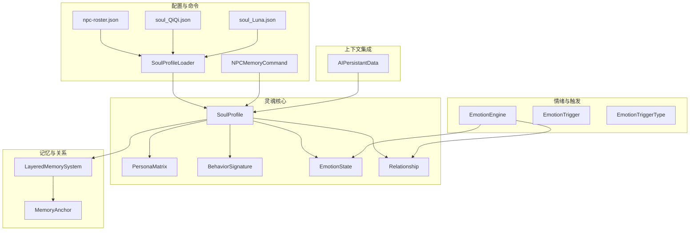
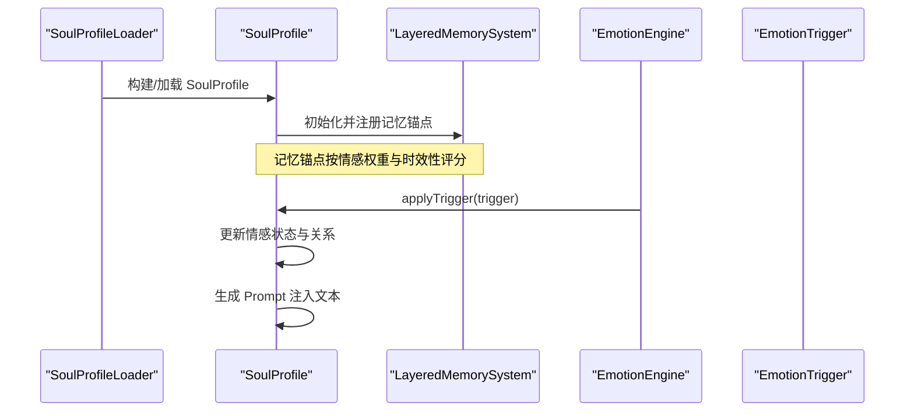
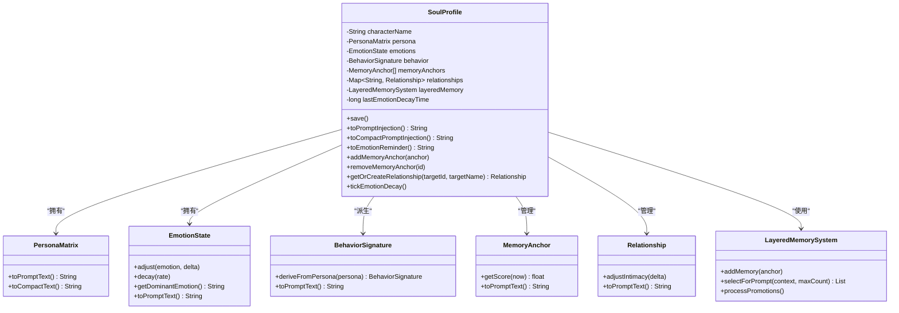
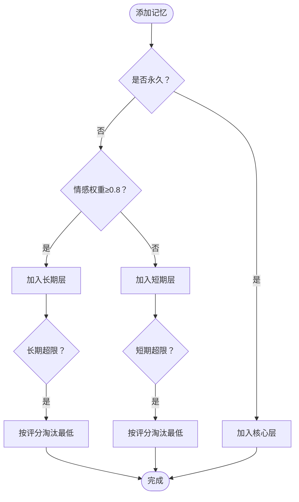
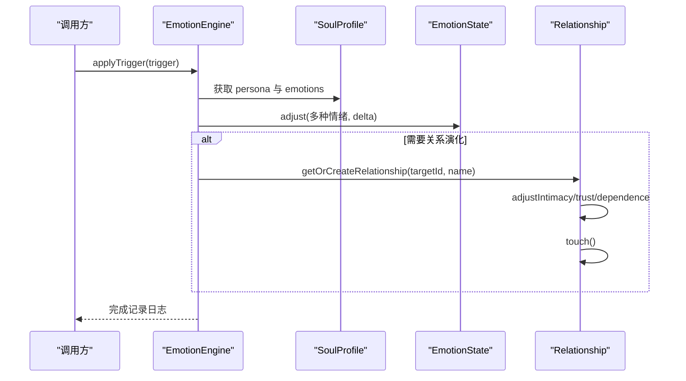
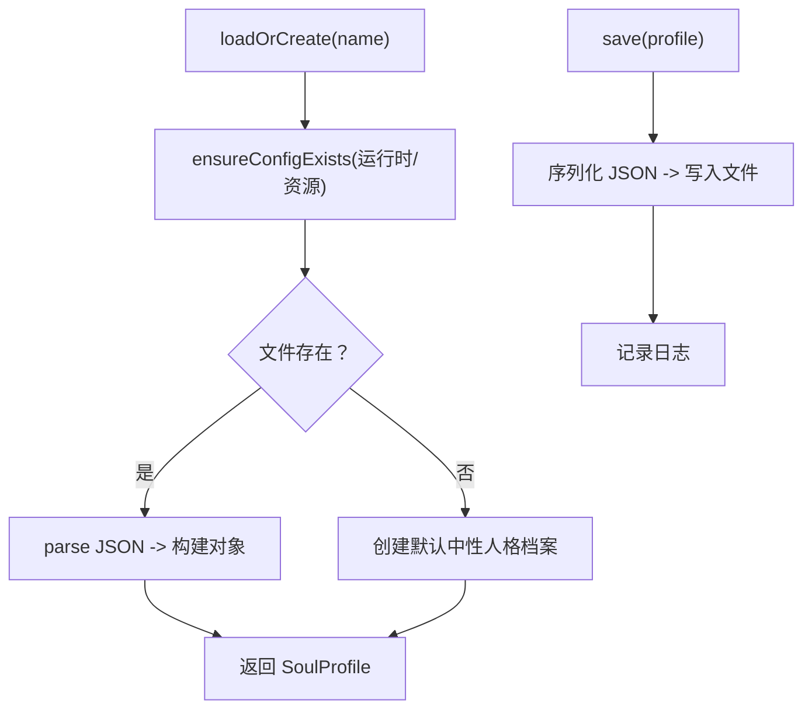
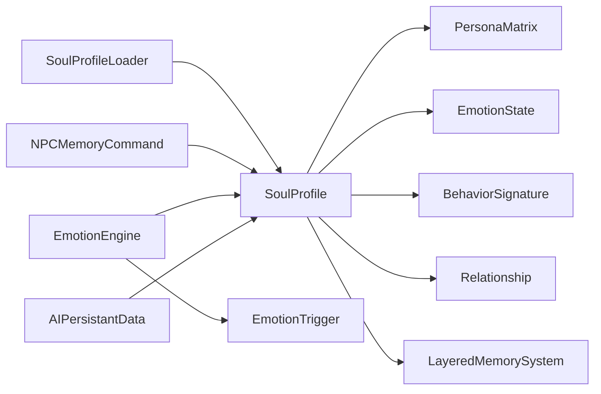

# 个性化系统

<cite>
**本文档引用的文件**
- [SoulProfile.java](file://src/main/java/adris/altoclef/player2api/soul/SoulProfile.java)
- [PersonaMatrix.java](file://src/main/java/adris/altoclef/player2api/soul/PersonaMatrix.java)
- [Relationship.java](file://src/main/java/adris/altoclef/player2api/soul/Relationship.java)
- [BehaviorSignature.java](file://src/main/java/adris/altoclef/player2api/soul/BehaviorSignature.java)
- [SoulProfileLoader.java](file://src/main/java/adris/altoclef/player2api/soul/SoulProfileLoader.java)
- [EmotionState.java](file://src/main/java/adris/altoclef/player2api/soul/EmotionState.java)
- [MemoryAnchor.java](file://src/main/java/adris/altoclef/player2api/soul/MemoryAnchor.java)
- [EmotionEngine.java](file://src/main/java/adris/altoclef/player2api/soul/EmotionEngine.java)
- [EmotionTrigger.java](file://src/main/java/adris/altoclef/player2api/soul/EmotionTrigger.java)
- [EmotionTriggerType.java](file://src/main/java/adris/altoclef/player2api/soul/EmotionTriggerType.java)
- [LayeredMemorySystem.java](file://src/main/java/adris/altoclef/player2api/memory/LayeredMemorySystem.java)
- [NPCMemoryCommand.java](file://src/main/java/adris/altoclef/commands/NPCMemoryCommand.java)
- [AIPersistantData.java](file://src/main/java/adris/altoclef/player2api/AIPersistantData.java)
- [npc-roster.json](file://src/main/resources/npc-roster.json)
- [soul_QiQi.json](file://src/main/resources/soul/soul_QiQi.json)
- [soul_Luna.json](file://src/main/resources/soul/soul_Luna.json)
</cite>

## 目录
1. [引言](#引言)
2. [项目结构](#项目结构)
3. [核心组件](#核心组件)
4. [架构总览](#架构总览)
5. [详细组件分析](#详细组件分析)
6. [依赖分析](#依赖分析)
7. [性能考量](#性能考量)
8. [故障排查指南](#故障排查指南)
9. [结论](#结论)
10. [附录](#附录)

## 引言
本文件面向“个性化系统”的设计与实现，聚焦 NPC 灵魂档案（SoulProfile）及其子系统：人格矩阵（PersonaMatrix）、关系系统（Relationship）、行为签名（BehaviorSignature）、情感状态（EmotionState）、记忆锚点（MemoryAnchor）与分层记忆系统（LayeredMemorySystem），以及情绪引擎（EmotionEngine）与触发器（EmotionTrigger）。文档同时覆盖个性化配置的加载与保存机制（JSON + NBT 序列化思路）、动态更新策略、情感状态对 NPC 行为的影响路径，以及扩展指南（新增个性特征与情感反应模式）。

## 项目结构
个性化系统位于 player2api 子模块中，围绕“灵魂”这一核心抽象展开，配合记忆与关系两大支撑子系统，形成可持久化、可扩展、可动态演化的 NPC 个性化框架。关键文件分布如下：
- 灵魂核心：SoulProfile、PersonaMatrix、BehaviorSignature、EmotionState、Relationship
- 记忆与关系：MemoryAnchor、LayeredMemorySystem、Relationship
- 情绪引擎：EmotionEngine、EmotionTrigger、EmotionTriggerType
- 配置与命令：SoulProfileLoader、NPCMemoryCommand、npc-roster.json、soul_*.json
- 上下文集成：AIPersistantData（将灵魂注入系统提示）

**图表来源**
- [SoulProfile.java:15-226](file://src/main/java/adris/altoclef/player2api/soul/SoulProfile.java#L15-L226)
- [PersonaMatrix.java:10-120](file://src/main/java/adris/altoclef/player2api/soul/PersonaMatrix.java#L10-L120)
- [BehaviorSignature.java:10-124](file://src/main/java/adris/altoclef/player2api/soul/BehaviorSignature.java#L10-L124)
- [EmotionState.java:9-128](file://src/main/java/adris/altoclef/player2api/soul/EmotionState.java#L9-L128)
- [Relationship.java:8-70](file://src/main/java/adris/altoclef/player2api/soul/Relationship.java#L8-L70)
- [MemoryAnchor.java:8-83](file://src/main/java/adris/altoclef/player2api/soul/MemoryAnchor.java#L8-L83)
- [LayeredMemorySystem.java:10-172](file://src/main/java/adris/altoclef/player2api/memory/LayeredMemorySystem.java#L10-L172)
- [EmotionEngine.java:11-184](file://src/main/java/adris/altoclef/player2api/soul/EmotionEngine.java#L11-L184)
- [EmotionTrigger.java:6-20](file://src/main/java/adris/altoclef/player2api/soul/EmotionTrigger.java#L6-L20)
- [EmotionTriggerType.java:6-40](file://src/main/java/adris/altoclef/player2api/soul/EmotionTriggerType.java#L6-L40)
- [SoulProfileLoader.java:25-226](file://src/main/java/adris/altoclef/player2api/soul/SoulProfileLoader.java#L25-L226)
- [NPCMemoryCommand.java:16-107](file://src/main/java/adris/altoclef/commands/NPCMemoryCommand.java#L16-L107)
- [AIPersistantData.java:24-149](file://src/main/java/adris/altoclef/player2api/AIPersistantData.java#L24-L149)
- [npc-roster.json:1-54](file://src/main/resources/npc-roster.json#L1-L54)
- [soul_QiQi.json:1-61](file://src/main/resources/soul/soul_QiQi.json#L1-L61)
- [soul_Luna.json:1-61](file://src/main/resources/soul/soul_Luna.json#L1-L61)

**章节来源**
- [SoulProfile.java:15-226](file://src/main/java/adris/altoclef/player2api/soul/SoulProfile.java#L15-L226)
- [SoulProfileLoader.java:25-226](file://src/main/java/adris/altoclef/player2api/soul/SoulProfileLoader.java#L25-L226)
- [AIPersistantData.java:24-149](file://src/main/java/adris/altoclef/player2api/AIPersistantData.java#L24-L149)

## 核心组件
- 灵魂档案（SoulProfile）：NPC 的核心个性化容器，聚合人格矩阵、情感状态、行为签名、记忆锚点与关系图谱，并提供 Prompt 注入与持久化能力。
- 人格矩阵（PersonaMatrix）：基于大五人格模型（OCEAN），提供紧凑与详细两种 Prompt 表达方式。
- 行为签名（BehaviorSignature）：从人格矩阵派生或手动覆盖，描述 NPC 的行动偏好。
- 情绪状态（EmotionState）：八种基础情绪（joy/sadness/anger/fear/surprise/disgust/trust/anticipation），支持自然衰减与主导情绪提取。
- 记忆锚点（MemoryAnchor）：带情感权重与时效性的永久/短期记忆单元，参与评分与 Prompt 注入。
- 分层记忆系统（LayeredMemorySystem）：按核心/长期/短期三层管理记忆，支持晋升、淘汰与按上下文选择。
- 关系系统（Relationship）：以亲密度/信任度/依赖度刻画 NPC 与玩家的关系，支持标题动态更新与 Prompt 注入。
- 情绪引擎（EmotionEngine）：根据触发器类型应用情绪调整与关系演化，驱动情感状态变化。
- 触发器（EmotionTrigger/EmotionTriggerType）：统一抽象各类可能改变 NPC 情绪的游戏事件。
- 配置加载器（SoulProfileLoader）：负责从资源模板复制到运行时配置目录，解析 JSON 并构建/保存 SoulProfile。
- 命令接口（NPCMemoryCommand）：提供添加/列出/删除/清空记忆锚点的运行时管理入口。
- 上下文集成（AIPersistantData）：将灵魂状态注入系统提示，参与对话历史压缩与截断。

**章节来源**
- [SoulProfile.java:15-226](file://src/main/java/adris/altoclef/player2api/soul/SoulProfile.java#L15-L226)
- [PersonaMatrix.java:10-120](file://src/main/java/adris/altoclef/player2api/soul/PersonaMatrix.java#L10-L120)
- [BehaviorSignature.java:10-124](file://src/main/java/adris/altoclef/player2api/soul/BehaviorSignature.java#L10-L124)
- [EmotionState.java:9-128](file://src/main/java/adris/altoclef/player2api/soul/EmotionState.java#L9-L128)
- [MemoryAnchor.java:8-83](file://src/main/java/adris/altoclef/player2api/soul/MemoryAnchor.java#L8-L83)
- [LayeredMemorySystem.java:10-172](file://src/main/java/adris/altoclef/player2api/memory/LayeredMemorySystem.java#L10-L172)
- [Relationship.java:8-70](file://src/main/java/adris/altoclef/player2api/soul/Relationship.java#L8-L70)
- [EmotionEngine.java:11-184](file://src/main/java/adris/altoclef/player2api/soul/EmotionEngine.java#L11-L184)
- [EmotionTrigger.java:6-20](file://src/main/java/adris/altoclef/player2api/soul/EmotionTrigger.java#L6-L20)
- [EmotionTriggerType.java:6-40](file://src/main/java/adris/altoclef/player2api/soul/EmotionTriggerType.java#L6-L40)
- [SoulProfileLoader.java:25-226](file://src/main/java/adris/altoclef/player2api/soul/SoulProfileLoader.java#L25-L226)
- [NPCMemoryCommand.java:16-107](file://src/main/java/adris/altoclef/commands/NPCMemoryCommand.java#L16-L107)
- [AIPersistantData.java:24-149](file://src/main/java/adris/altoclef/player2api/AIPersistantData.java#L24-L149)

## 架构总览
个性化系统采用“灵魂核心 + 记忆与关系 + 情绪引擎 + 配置加载”的分层架构。SoulProfile 作为中枢，承载人格、情感、行为与关系；LayeredMemorySystem 提供记忆生命周期管理；EmotionEngine 响应事件驱动情感变化；SoulProfileLoader 负责配置的加载与保存；NPCMemoryCommand 提供运行时交互入口；AIPersistantData 将灵魂状态注入系统提示，参与对话上下文的组织与压缩。

**图表来源**
- [SoulProfileLoader.java:35-57](file://src/main/java/adris/altoclef/player2api/soul/SoulProfileLoader.java#L35-L57)
- [SoulProfile.java:129-174](file://src/main/java/adris/altoclef/player2api/soul/SoulProfile.java#L129-L174)
- [LayeredMemorySystem.java:101-129](file://src/main/java/adris/altoclef/player2api/memory/LayeredMemorySystem.java#L101-L129)
- [EmotionEngine.java:17-171](file://src/main/java/adris/altoclef/player2api/soul/EmotionEngine.java#L17-L171)

## 详细组件分析

### 灵魂档案（SoulProfile）
- 设计理念：将 NPC 的“内在自我”抽象为可序列化、可 Prompt 注入的状态集合，便于与 LLM 对话系统无缝衔接。
- 关键职责：
  - 维护人格矩阵、情感状态、行为签名、记忆锚点与关系图谱。
  - 提供 Prompt 注入（完整与紧凑版），用于系统提示与用户消息提醒。
  - 管理记忆锚点的增删与清理策略，确保长期记忆质量。
  - 控制情感自然衰减节奏，避免情绪长期滞留。
  - 提供持久化入口（委托给加载器）。
- 数据结构与复杂度：
  - 记忆锚点列表：支持并发访问（CopyOnWriteArrayList），清理与评分涉及排序，时间复杂度 O(n log n)。
  - 关系映射：ConcurrentHashMap，提供线程安全的读写。
  - Prompt 注入：遍历记忆锚点与关系，时间复杂度 O(k)（k 为注入数量）。
- 错误处理与边界：
  - 空锚点忽略添加；锚点数量上限保护；非永久锚点在清理时优先淘汰。
  - 情绪衰减周期控制，避免频繁更新。

**图表来源**
- [SoulProfile.java:15-226](file://src/main/java/adris/altoclef/player2api/soul/SoulProfile.java#L15-L226)
- [PersonaMatrix.java:10-120](file://src/main/java/adris/altoclef/player2api/soul/PersonaMatrix.java#L10-L120)
- [EmotionState.java:9-128](file://src/main/java/adris/altoclef/player2api/soul/EmotionState.java#L9-L128)
- [BehaviorSignature.java:10-124](file://src/main/java/adris/altoclef/player2api/soul/BehaviorSignature.java#L10-L124)
- [MemoryAnchor.java:8-83](file://src/main/java/adris/altoclef/player2api/soul/MemoryAnchor.java#L8-L83)
- [LayeredMemorySystem.java:10-172](file://src/main/java/adris/altoclef/player2api/memory/LayeredMemorySystem.java#L10-L172)
- [Relationship.java:8-70](file://src/main/java/adris/altoclef/player2api/soul/Relationship.java#L8-L70)

**章节来源**
- [SoulProfile.java:15-226](file://src/main/java/adris/altoclef/player2api/soul/SoulProfile.java#L15-L226)

### 人格矩阵（PersonaMatrix）
- 基于大五人格模型（OCEAN），每个维度范围 [-100, 100]，0 为中性。
- 提供：
  - 详细 Prompt 文本：包含五维描述与基于维度的行为指导。
  - 紧凑文本：O/C/E/A/N 数值简写，适合 Context 压缩。
  - 映射序列化/反序列化：便于 JSON 配置与运行时转换。
- 复杂度：构造与转换均为 O(1)。

**章节来源**
- [PersonaMatrix.java:10-120](file://src/main/java/adris/altoclef/player2api/soul/PersonaMatrix.java#L10-L120)

### 行为签名（BehaviorSignature）
- 由人格矩阵派生而来，亦可手动覆盖，维度包括主动性、风险承受、独立性、效率倾向与忠诚度。
- 提供：
  - 从人格矩阵推导的静态工厂方法。
  - 详细与紧凑 Prompt 文本，用于系统提示与上下文注入。
  - 映射序列化/反序列化。
- 复杂度：构造与转换均为 O(1)。

**章节来源**
- [BehaviorSignature.java:10-124](file://src/main/java/adris/altoclef/player2api/soul/BehaviorSignature.java#L10-L124)

### 情绪状态（EmotionState）
- 八种基础情绪，强度范围 [0.0, 1.0]，支持：
  - 单次调整（限制幅度，避免瞬时爆表）。
  - 自然衰减（按速率衰减）。
  - 主导情绪提取与显著情绪判断。
  - 详细与紧凑 Prompt 文本，包含情绪指导。
- 复杂度：
  - 调整与衰减为 O(1)×8。
  - 主导情绪提取为 O(1)×8。

**章节来源**
- [EmotionState.java:9-128](file://src/main/java/adris/altoclef/player2api/soul/EmotionState.java#L9-L128)

### 记忆锚点与分层记忆系统（MemoryAnchor、LayeredMemorySystem）
- MemoryAnchor：
  - 带情感权重与时效性评分，支持永久/短期标记。
  - 引用计数与最后使用时间，用于晋升与淘汰。
  - Prompt 文本输出，支持关联玩家过滤。
- LayeredMemorySystem：
  - 三层容量限制：核心（5）、长期（30）、短期（50）。
  - 自动分层：永久 → 高情感权重 → 其他。
  - 晋升处理：短期中被多次引用或高情感权重晋升为长期。
  - 选择策略：核心全量注入，长期按评分 Top-N，短期按评分补足。
  - 查询与统计：按类别筛选、按玩家筛选、统计总数。
- 复杂度：
  - 晋升与淘汰涉及最小值比较，O(n)。
  - 选择策略按评分排序，O(n log n)。

**图表来源**
- [LayeredMemorySystem.java:30-88](file://src/main/java/adris/altoclef/player2api/memory/LayeredMemorySystem.java#L30-L88)
- [MemoryAnchor.java:72-76](file://src/main/java/adris/altoclef/player2api/soul/MemoryAnchor.java#L72-L76)

**章节来源**
- [MemoryAnchor.java:8-83](file://src/main/java/adris/altoclef/player2api/soul/MemoryAnchor.java#L8-L83)
- [LayeredMemorySystem.java:10-172](file://src/main/java/adris/altoclef/player2api/memory/LayeredMemorySystem.java#L10-L172)

### 关系系统（Relationship）
- 以亲密度/信任度/依赖度刻画 NPC 与玩家的关系，支持：
  - 动态标题更新（从陌生到敌人/挚友）。
  - 最近互动时间记录。
  - Prompt 文本输出，包含关系描述与情感指导。
- 复杂度：调整与标题更新为 O(1)。

**章节来源**
- [Relationship.java:8-70](file://src/main/java/adris/altoclef/player2api/soul/Relationship.java#L8-L70)

### 情绪引擎与触发器（EmotionEngine、EmotionTrigger、EmotionTriggerType）
- EmotionEngine：
  - 根据触发器类型应用情绪调整与关系演化。
  - 事件覆盖玩家互动、环境、游戏事件、任务与社交等。
  - 记录日志，输出主导情绪与强度。
- EmotionTrigger/EmotionTriggerType：
  - 统一抽象各类事件，携带玩家名、物品名与价值等上下文。
- 复杂度：事件分支为常数级，情绪调整为 O(1)×8。

**图表来源**
- [EmotionEngine.java:17-182](file://src/main/java/adris/altoclef/player2api/soul/EmotionEngine.java#L17-L182)
- [EmotionTrigger.java:6-20](file://src/main/java/adris/altoclef/player2api/soul/EmotionTrigger.java#L6-L20)
- [EmotionTriggerType.java:6-40](file://src/main/java/adris/altoclef/player2api/soul/EmotionTriggerType.java#L6-L40)

**章节来源**
- [EmotionEngine.java:11-184](file://src/main/java/adris/altoclef/player2api/soul/EmotionEngine.java#L11-L184)
- [EmotionTrigger.java:6-20](file://src/main/java/adris/altoclef/player2api/soul/EmotionTrigger.java#L6-L20)
- [EmotionTriggerType.java:6-40](file://src/main/java/adris/altoclef/player2api/soul/EmotionTriggerType.java#L6-L40)

### 配置加载与保存（SoulProfileLoader）
- 加载流程：
  - 优先从运行时配置目录加载；若不存在，从资源模板复制默认文件后再加载。
  - 解析 JSON，构建 PersonaMatrix、EmotionState、BehaviorSignature、MemoryAnchor 与 Relationship。
  - 回退策略：失败时创建中性人格的默认档案。
- 保存流程：
  - 将 SoulProfile 写入 JSON，包含 persona、emotions、behavior、memoryAnchors、relationships。
  - 使用 Gson PrettyPrint 格式化输出。
- 文件命名：soul_{sanitized_name}.json，支持中文与特殊字符清洗。

**图表来源**
- [SoulProfileLoader.java:35-132](file://src/main/java/adris/altoclef/player2api/soul/SoulProfileLoader.java#L35-L132)

**章节来源**
- [SoulProfileLoader.java:25-226](file://src/main/java/adris/altoclef/player2api/soul/SoulProfileLoader.java#L25-L226)

### 运行时命令与上下文集成（NPCMemoryCommand、AIPersistantData）
- NPCMemoryCommand：
  - 支持添加、列出、删除（前缀匹配）、清空（非永久）记忆锚点。
  - 修改后自动保存。
- AIPersistantData：
  - 在初始化时加载/创建 SoulProfile，并将其注入系统提示。
  - 提供对话历史压缩与截断，确保 Token 预算可控。
  - 支持动态更新系统提示（如命令引导）。

**章节来源**
- [NPCMemoryCommand.java:16-107](file://src/main/java/adris/altoclef/commands/NPCMemoryCommand.java#L16-L107)
- [AIPersistantData.java:24-149](file://src/main/java/adris/altoclef/player2api/AIPersistantData.java#L24-L149)

## 依赖分析
- 组件耦合：
  - SoulProfile 依赖 PersonaMatrix、EmotionState、BehaviorSignature、Relationship、LayeredMemorySystem。
  - EmotionEngine 依赖 SoulProfile 与 EmotionTrigger，间接影响 EmotionState 与 Relationship。
  - SoulProfileLoader 依赖资源与文件系统，负责持久化。
  - NPCMemoryCommand 依赖 SoulProfile，提供运行时交互。
  - AIPersistantData 依赖 SoulProfileLoader 与 Prompts，负责系统提示注入。
- 外部依赖：
  - Gson 用于 JSON 序列化/反序列化。
  - Log4j/slf4j 用于日志记录。
  - Fabric/Baritone 工具类（DirUtil 等）用于路径与配置管理。

**图表来源**
- [SoulProfileLoader.java:25-226](file://src/main/java/adris/altoclef/player2api/soul/SoulProfileLoader.java#L25-L226)
- [SoulProfile.java:15-226](file://src/main/java/adris/altoclef/player2api/soul/SoulProfile.java#L15-L226)
- [EmotionEngine.java:11-184](file://src/main/java/adris/altoclef/player2api/soul/EmotionEngine.java#L11-L184)
- [NPCMemoryCommand.java:16-107](file://src/main/java/adris/altoclef/commands/NPCMemoryCommand.java#L16-L107)
- [AIPersistantData.java:24-149](file://src/main/java/adris/altoclef/player2api/AIPersistantData.java#L24-L149)

**章节来源**
- [SoulProfileLoader.java:25-226](file://src/main/java/adris/altoclef/player2api/soul/SoulProfileLoader.java#L25-L226)
- [SoulProfile.java:15-226](file://src/main/java/adris/altoclef/player2api/soul/SoulProfile.java#L15-L226)
- [EmotionEngine.java:11-184](file://src/main/java/adris/altoclef/player2api/soul/EmotionEngine.java#L11-L184)
- [NPCMemoryCommand.java:16-107](file://src/main/java/adris/altoclef/commands/NPCMemoryCommand.java#L16-L107)
- [AIPersistantData.java:24-149](file://src/main/java/adris/altoclef/player2api/AIPersistantData.java#L24-L149)

## 性能考量
- 记忆管理：
  - 分层容量限制与评分淘汰，避免无限增长；晋升策略减少短期重复记忆。
  - 选择策略按评分排序，建议合理设置最大注入数量，避免 O(n log n) 排序开销过大。
- 情绪更新：
  - 单次调整限制幅度，衰减按固定速率进行，降低高频更新带来的抖动。
- Prompt 注入：
  - 提供紧凑版注入，Token 压缩至约原版的 1/3，适合高负载场景。
- 序列化：
  - 使用 Gson PrettyPrint，兼顾可读性与性能；建议在批量保存时合并写入。

[本节为通用性能讨论，不直接分析具体文件]

## 故障排查指南
- 加载失败：
  - 检查运行时配置目录是否存在对应 soul_{name}.json；若缺失，确认资源模板复制是否成功。
  - 若 JSON 字段缺失或类型错误，加载器会回退到默认中性人格档案。
- 情绪异常：
  - 检查事件触发是否正确传递（玩家名、物品价值等）；查看日志中情绪更新记录。
  - 确认情绪衰减周期是否正常（默认 30 秒一次）。
- 记忆未生效：
  - 确认记忆锚点情感权重与时效性评分；检查是否被晋升或淘汰。
  - 使用 /npc_memory list 查看当前记忆列表与 ID 前缀。
- 关系异常：
  - 检查关系调整是否按预期发生；确认标题更新逻辑与阈值。
- 保存失败：
  - 检查目标路径权限与磁盘空间；查看日志中的异常信息。

**章节来源**
- [SoulProfileLoader.java:42-56](file://src/main/java/adris/altoclef/player2api/soul/SoulProfileLoader.java#L42-L56)
- [EmotionEngine.java:165-171](file://src/main/java/adris/altoclef/player2api/soul/EmotionEngine.java#L165-L171)
- [NPCMemoryCommand.java:48-98](file://src/main/java/adris/altoclef/commands/NPCMemoryCommand.java#L48-L98)

## 结论
个性化系统通过“灵魂档案”将 NPC 的人格、情感、行为与关系统一建模，并借助分层记忆与情绪引擎实现动态演化。配置加载器与运行时命令提供了灵活的持久化与交互能力。该架构既满足可扩展性（新增触发器、记忆类别、关系维度），又兼顾性能与可维护性（紧凑 Prompt、分层记忆、衰减控制）。

[本节为总结性内容，不直接分析具体文件]

## 附录

### 配置文件格式与加载要点
- 配置文件位置：
  - 默认模板位于资源目录：src/main/resources/soul/soul_{name}.json。
  - 运行时配置位于运行时目录：run/config/soul_{sanitized_name}.json。
- 关键字段：
  - characterName：角色名称。
  - personaMatrix：大五人格五个维度。
  - emotions：八种基础情绪初始强度。
  - behaviorSignature：行为签名（可选，可由人格推导）。
  - memoryAnchors：运行时自动维护的记忆锚点列表。
  - relationships：运行时自动维护的关系列表。
- 加载策略：
  - 优先从运行时目录加载；不存在则复制资源模板；解析失败回退默认档案。

**章节来源**
- [soul_QiQi.json:1-61](file://src/main/resources/soul/soul_QiQi.json#L1-L61)
- [soul_Luna.json:1-61](file://src/main/resources/soul/soul_Luna.json#L1-L61)
- [SoulProfileLoader.java:35-57](file://src/main/java/adris/altoclef/player2api/soul/SoulProfileLoader.java#L35-L57)

### 个性化配置示例（路径指引）
- 创建 NPC 的个性化档案：
  - 在资源目录复制模板：soul_QiQi.json 或 soul_Luna.json。
  - 修改 personaMatrix、emotions 等字段。
  - 启动游戏后，系统将自动复制到运行时目录并加载。
- 运行时管理记忆：
  - 使用命令：/npc_memory add <content>、list、remove <id>、clear。
  - 修改后自动保存。
- 动态更新系统提示：
  - AIPersistantData 在初始化与更新时将灵魂状态注入系统提示。

**章节来源**
- [NPCMemoryCommand.java:16-107](file://src/main/java/adris/altoclef/commands/NPCMemoryCommand.java#L16-L107)
- [AIPersistantData.java:40-44](file://src/main/java/adris/altoclef/player2api/AIPersistantData.java#L40-L44)
- [AIPersistantData.java:140-148](file://src/main/java/adris/altoclef/player2api/AIPersistantData.java#L140-L148)

### 扩展指南
- 新增情感反应模式：
  - 在 EmotionTriggerType 中添加新事件类型。
  - 在 EmotionEngine.applyTrigger 中增加对应的调整逻辑。
  - 如需关系演化，使用 updateRelationshipByName 或直接操作 Relationship。
- 新增个性特征：
  - 在 PersonaMatrix/BehaviorSignature 中扩展维度或派生规则。
  - 更新 SoulProfile.toPromptInjection 以包含新维度描述。
- 新增记忆类别：
  - 在 MemoryAnchor 中扩展分类枚举与评分策略。
  - 在 LayeredMemorySystem 中完善分层与选择逻辑。
- 新增触发器上下文：
  - 在 EmotionTrigger 中扩展字段（如物品价值、目标实体等）。
  - 在调用方（事件监听器）中构造触发器并传递给 EmotionEngine。

**章节来源**
- [EmotionTriggerType.java:6-40](file://src/main/java/adris/altoclef/player2api/soul/EmotionTriggerType.java#L6-L40)
- [EmotionEngine.java:17-182](file://src/main/java/adris/altoclef/player2api/soul/EmotionEngine.java#L17-L182)
- [PersonaMatrix.java:58-94](file://src/main/java/adris/altoclef/player2api/soul/PersonaMatrix.java#L58-L94)
- [BehaviorSignature.java:73-108](file://src/main/java/adris/altoclef/player2api/soul/BehaviorSignature.java#L73-L108)
- [MemoryAnchor.java:72-76](file://src/main/java/adris/altoclef/player2api/soul/MemoryAnchor.java#L72-L76)
- [LayeredMemorySystem.java:101-129](file://src/main/java/adris/altoclef/player2api/memory/LayeredMemorySystem.java#L101-L129)