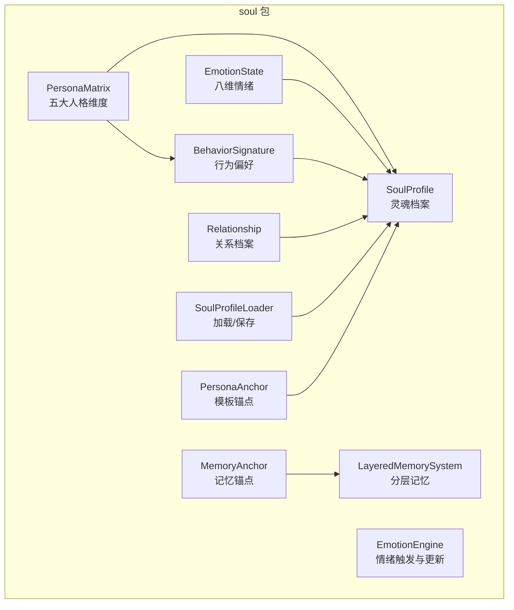
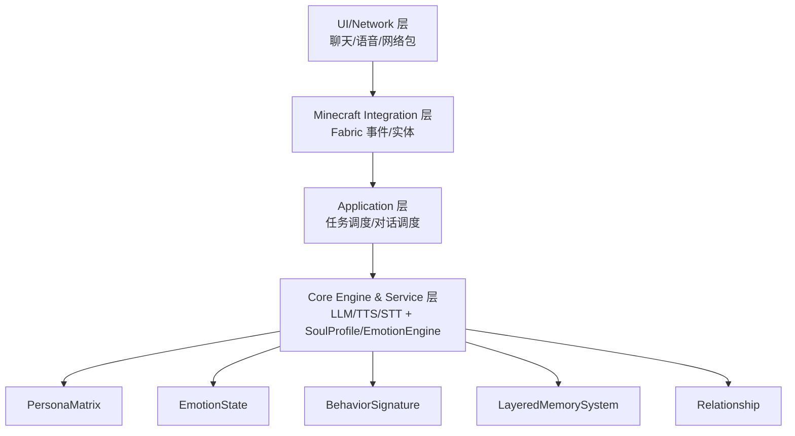
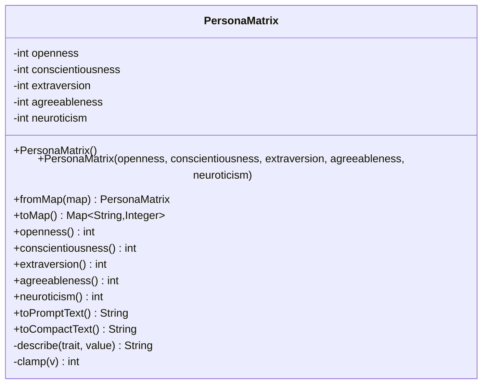
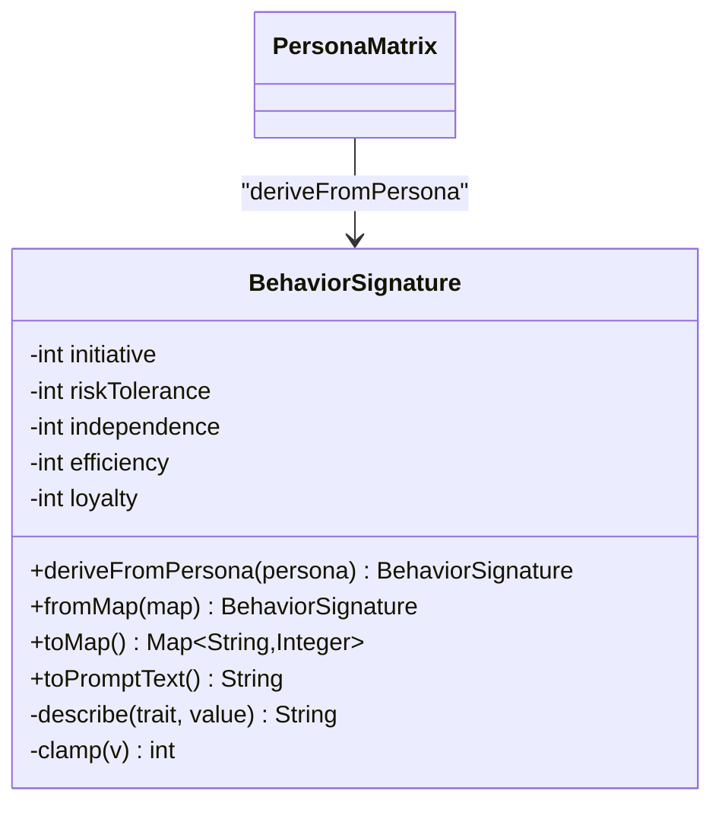
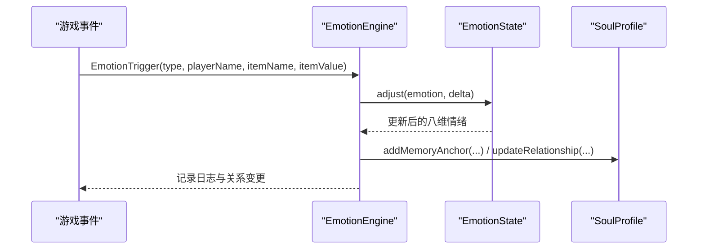
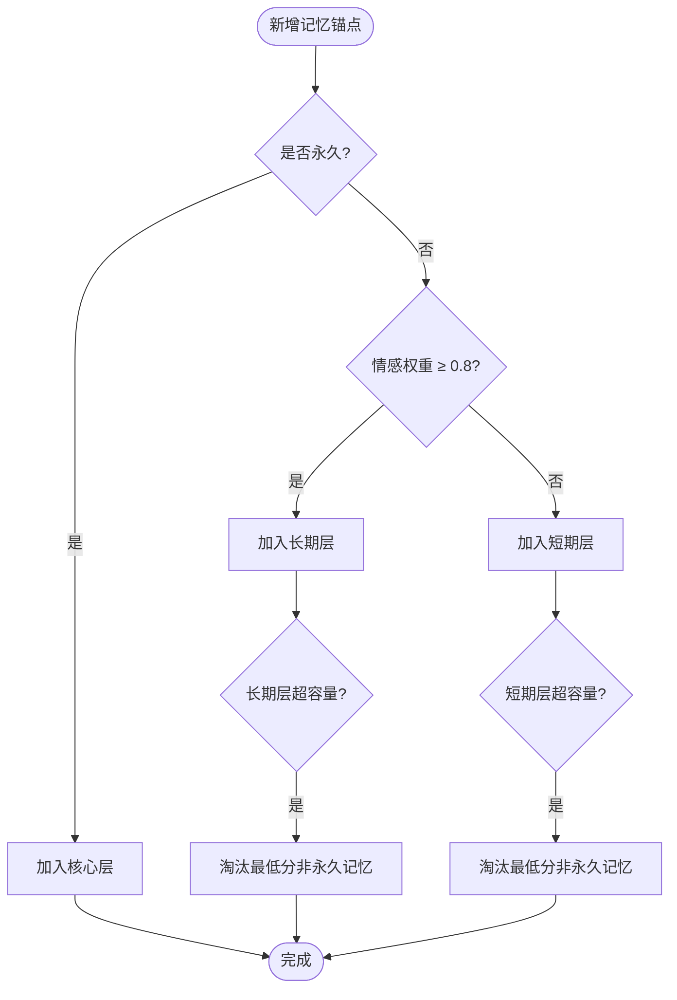
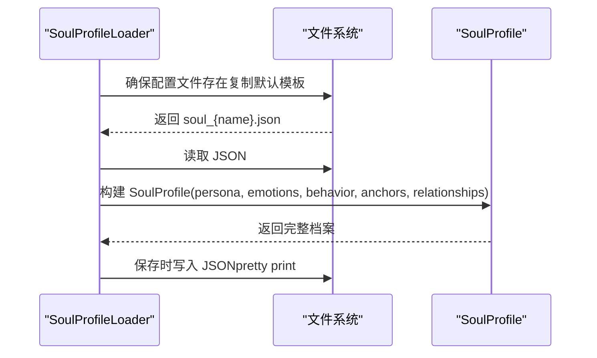
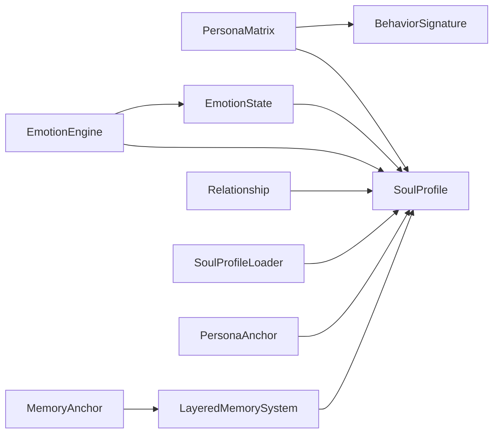

# 人格矩阵

<cite>
**本文档引用的文件**
- [PersonaMatrix.java](file://src/main/java/adris/altoclef/player2api/soul/PersonaMatrix.java)
- [BehaviorSignature.java](file://src/main/java/adris/altoclef/player2api/soul/BehaviorSignature.java)
- [EmotionState.java](file://src/main/java/adris/altoclef/player2api/soul/EmotionState.java)
- [EmotionEngine.java](file://src/main/java/adris/altoclef/player2api/soul/EmotionEngine.java)
- [EmotionTrigger.java](file://src/main/java/adris/altoclef/player2api/soul/EmotionTrigger.java)
- [EmotionTriggerType.java](file://src/main/java/adris/altoclef/player2api/soul/EmotionTriggerType.java)
- [MemoryAnchor.java](file://src/main/java/adris/altoclef/player2api/soul/MemoryAnchor.java)
- [LayeredMemorySystem.java](file://src/main/java/adris/altoclef/player2api/memory/LayeredMemorySystem.java)
- [Relationship.java](file://src/main/java/adris/altoclef/player2api/soul/Relationship.java)
- [SoulProfile.java](file://src/main/java/adris/altoclef/player2api/soul/SoulProfile.java)
- [SoulProfileLoader.java](file://src/main/java/adris/altoclef/player2api/soul/SoulProfileLoader.java)
- [PersonaAnchor.java](file://src/main/java/adris/altoclef/player2api/PersonaAnchor.java)
- [soul_Luna.json](file://src/main/resources/soul/soul_Luna.json)
- [soul_QiQi.json](file://src/main/resources/soul/soul_QiQi.json)
- [AI_NPC灵魂特质交互优化方案.md](file://docs/AI_NPC灵魂特质交互优化方案.md)
- [AI_NPC项目整体架构概览.md](file://docs/AI_NPC项目整体架构概览.md)
</cite>

## 目录
1. [简介](#简介)
2. [项目结构](#项目结构)
3. [核心组件](#核心组件)
4. [架构总览](#架构总览)
5. [详细组件分析](#详细组件分析)
6. [依赖关系分析](#依赖关系分析)
7. [性能考量](#性能考量)
8. [故障排查指南](#故障排查指南)
9. [结论](#结论)
10. [附录](#附录)

## 简介
本文件面向“人格矩阵系统”的技术文档，围绕五大人格维度（开放性、尽责性、外向性、宜人性、神经质）的设计理念与实现机制展开，解释数值范围、计算公式、权重分配与动态调整策略，并阐述其如何影响 NPC 的行为决策（任务选择、对话风格、社交行为）。同时提供可操作的代码示例路径、人格特征平衡与调优建议，帮助开发者在 Minecraft 生态中构建具备独特“灵魂特质”的 AI NPC。

## 项目结构
- 人格矩阵系统位于 player2api/soul 包中，核心类包括 PersonaMatrix、BehaviorSignature、EmotionState、EmotionEngine、MemoryAnchor、LayeredMemorySystem、Relationship、SoulProfile、SoulProfileLoader、PersonaAnchor。
- 配置文件位于 resources/soul 下，提供 Luna 与 QiQi 的默认角色模板，展示五大人格维度与初始情绪、行为签名、记忆锚点、关系图谱的持久化结构。
- 文档 docs 中包含“灵魂特质交互优化方案”和“项目整体架构概览”，为系统设计与集成提供高层说明。

**图表来源**
- [PersonaMatrix.java:1-119](file://src/main/java/adris/altoclef/player2api/soul/PersonaMatrix.java#L1-L119)
- [BehaviorSignature.java:1-124](file://src/main/java/adris/altoclef/player2api/soul/BehaviorSignature.java#L1-L124)
- [EmotionState.java:1-128](file://src/main/java/adris/altoclef/player2api/soul/EmotionState.java#L1-L128)
- [EmotionEngine.java:1-184](file://src/main/java/adris/altoclef/player2api/soul/EmotionEngine.java#L1-L184)
- [MemoryAnchor.java:1-83](file://src/main/java/adris/altoclef/player2api/soul/MemoryAnchor.java#L1-L83)
- [LayeredMemorySystem.java:1-172](file://src/main/java/adris/altoclef/player2api/memory/LayeredMemorySystem.java#L1-L172)
- [Relationship.java:1-70](file://src/main/java/adris/altoclef/player2api/soul/Relationship.java#L1-L70)
- [SoulProfile.java:1-225](file://src/main/java/adris/altoclef/player2api/soul/SoulProfile.java#L1-L225)
- [SoulProfileLoader.java:1-225](file://src/main/java/adris/altoclef/player2api/soul/SoulProfileLoader.java#L1-L225)
- [PersonaAnchor.java:1-113](file://src/main/java/adris/altoclef/player2api/PersonaAnchor.java#L1-L113)

**章节来源**
- [AI_NPC项目整体架构概览.md:61-1158](file://docs/AI_NPC项目整体架构概览.md#L61-L1158)

## 核心组件
- 五大人格维度（-100 ~ +100）：开放性（Openness）、尽责性（Conscientiousness）、外向性（Extraversion）、宜人性（Agreeableness）、神经质（Neuroticism）。
- 行为签名（-100 ~ +100）：由人格矩阵推导而来，包含主动性、风险承受、独立性、效率倾向、忠诚度。
- 情绪状态（0.0 ~ 1.0）：Joy、Sadness、Anger、Fear、Surprise、Disgust、Trust、Anticipation 八维基础情绪，支持自然衰减与显著情绪提示。
- 记忆锚点：独立于对话历史的情感记忆，按情感权重与时效性评分，分为核心、长期、短期三层。
- 关系档案：以亲密度、信任度、依赖度刻画 NPC 与玩家的关系演化。
- 灵魂档案：整合人格、情绪、行为、记忆、关系，提供 Prompt 注入与紧凑注入能力。

**章节来源**
- [PersonaMatrix.java:1-119](file://src/main/java/adris/altoclef/player2api/soul/PersonaMatrix.java#L1-L119)
- [BehaviorSignature.java:1-124](file://src/main/java/adris/altoclef/player2api/soul/BehaviorSignature.java#L1-L124)
- [EmotionState.java:1-128](file://src/main/java/adris/altoclef/player2api/soul/EmotionState.java#L1-L128)
- [LayeredMemorySystem.java:1-172](file://src/main/java/adris/altoclef/player2api/memory/LayeredMemorySystem.java#L1-L172)
- [Relationship.java:1-70](file://src/main/java/adris/altoclef/player2api/soul/Relationship.java#L1-L70)
- [SoulProfile.java:1-225](file://src/main/java/adris/altoclef/player2api/soul/SoulProfile.java#L1-L225)

## 架构总览
人格矩阵系统作为“核心引擎与服务层”的一部分，贯穿应用层的任务调度与对话管理，通过统一的 API 入口（Player2APIService）与 LLM、TTS、STT 等服务协同，将 NPC 的“灵魂状态”注入到对话与行为决策中。

**图表来源**
- [AI_NPC项目整体架构概览.md:61-1158](file://docs/AI_NPC项目整体架构概览.md#L61-L1158)

## 详细组件分析

### 人格矩阵（PersonaMatrix）
- 设计理念：基于心理学大五人格模型，将 NPC 的基础性格量化为五个维度，范围 -100 ~ +100。
- 数据结构：私有整型字段存储五个维度，提供构造函数、fromMap、toMap、Getter 方法与 clamp 边界控制。
- Prompt 文本生成：toPromptText 输出“维度(数值=等级)”与基于维度的行为指导；toCompactText 输出紧凑格式 O/C/E/A/N。
- 数值范围与等级映射：内部 describe 将数值映射为“非常低/低/中等/高/非常高”。

**图表来源**
- [PersonaMatrix.java:1-119](file://src/main/java/adris/altoclef/player2api/soul/PersonaMatrix.java#L1-L119)

**章节来源**
- [PersonaMatrix.java:1-119](file://src/main/java/adris/altoclef/player2api/soul/PersonaMatrix.java#L1-L119)
- [AI_NPC灵魂特质交互优化方案.md:33-62](file://docs/AI_NPC灵魂特质交互优化方案.md#L33-L62)

### 行为签名（BehaviorSignature）
- 推导公式：initiative=外向性；riskTolerance=开放性-神经质/2；independence=尽责性；efficiency=尽责性；loyalty=宜人性。
- Prompt 文本生成：输出维度与行为指导，帮助 NPC 在任务选择与社交行为中体现个性。
- 存储与转换：支持 fromMap、toMap 与 clamp。

**图表来源**
- [BehaviorSignature.java:1-124](file://src/main/java/adris/altoclef/player2api/soul/BehaviorSignature.java#L1-L124)
- [PersonaMatrix.java:1-119](file://src/main/java/adris/altoclef/player2api/soul/PersonaMatrix.java#L1-L119)

**章节来源**
- [BehaviorSignature.java:1-124](file://src/main/java/adris/altoclef/player2api/soul/BehaviorSignature.java#L1-L124)

### 情绪状态（EmotionState）与情绪引擎（EmotionEngine）
- 情绪维度：Joy、Sadness、Anger、Fear、Surprise、Disgust、Trust、Anticipation，范围 0.0 ~ 1.0。
- 调整策略：adjust 限制单次调整幅度（±0.25），set 直接设定，decay 按衰减率自然衰减。
- 触发器类型：涵盖玩家互动（称赞、责备、攻击、送礼、死亡、加入/离开）、环境事件（日出/日落、下雨、打雷）、游戏事件（发现钻石/稀有物品、进入洞穴/下界/末地、苦力怕靠近、低血量）、任务事件（完成/失败/取消）、社交事件（遇到新 NPC、被问候）。
- 引擎逻辑：根据触发器类型与人格矩阵参数更新情绪，并在必要时创建记忆锚点与更新关系。

**图表来源**
- [EmotionEngine.java:1-184](file://src/main/java/adris/altoclef/player2api/soul/EmotionEngine.java#L1-L184)
- [EmotionState.java:1-128](file://src/main/java/adris/altoclef/player2api/soul/EmotionState.java#L1-L128)
- [EmotionTrigger.java:1-20](file://src/main/java/adris/altoclef/player2api/soul/EmotionTrigger.java#L1-L20)
- [EmotionTriggerType.java:1-40](file://src/main/java/adris/altoclef/player2api/soul/EmotionTriggerType.java#L1-L40)

**章节来源**
- [EmotionState.java:1-128](file://src/main/java/adris/altoclef/player2api/soul/EmotionState.java#L1-L128)
- [EmotionEngine.java:1-184](file://src/main/java/adris/altoclef/player2api/soul/EmotionEngine.java#L1-L184)
- [EmotionTrigger.java:1-20](file://src/main/java/adris/altoclef/player2api/soul/EmotionTrigger.java#L1-L20)
- [EmotionTriggerType.java:1-40](file://src/main/java/adris/altoclef/player2api/soul/EmotionTriggerType.java#L1-L40)

### 记忆锚点与分层记忆系统
- 记忆锚点：包含内容、类别、情感权重、时间戳、是否永久、关联玩家、引用计数、最后使用时间；提供评分函数 getScore(now)=情感权重×0.6 + 时效性×0.4。
- 分层策略：核心层容量最小，优先永久锚点；长期层容量中等，短期层容量最大；支持晋升与淘汰机制。
- 选择策略：selectForPrompt 优先核心层，其次长期层 Top-N，最后短期层按评分挑选。

**图表来源**
- [MemoryAnchor.java:1-83](file://src/main/java/adris/altoclef/player2api/soul/MemoryAnchor.java#L1-L83)
- [LayeredMemorySystem.java:1-172](file://src/main/java/adris/altoclef/player2api/memory/LayeredMemorySystem.java#L1-L172)

**章节来源**
- [MemoryAnchor.java:1-83](file://src/main/java/adris/altoclef/player2api/soul/MemoryAnchor.java#L1-L83)
- [LayeredMemorySystem.java:1-172](file://src/main/java/adris/altoclef/player2api/memory/LayeredMemorySystem.java#L1-L172)

### 关系档案（Relationship）
- 字段：目标 UUID、名称、亲密度、信任度、依赖度、当前称谓、最后互动时间。
- 标题更新：依据亲密度区间映射为不同称谓（如 master/best_friend、close_friend、friend、acquaintance、distrusted、enemy）。
- Prompt 文本：输出关系状态与相应态度指导。

**章节来源**
- [Relationship.java:1-70](file://src/main/java/adris/altoclef/player2api/soul/Relationship.java#L1-L70)

### 灵魂档案（SoulProfile）与加载器（SoulProfileLoader）
- 灵魂档案：聚合人格、情绪、行为、记忆锚点、关系图谱；提供记忆锚点增删、关系获取与持久化保存；支持情绪自然衰减与 Prompt 注入（完整与紧凑版）。
- 加载器：从资源模板复制到运行时配置目录，解析 JSON 并重建对象；保存时写入 personaMatrix、emotions、behaviorSignature、memoryAnchors、relationships。

**图表来源**
- [SoulProfileLoader.java:1-225](file://src/main/java/adris/altoclef/player2api/soul/SoulProfileLoader.java#L1-L225)
- [SoulProfile.java:1-225](file://src/main/java/adris/altoclef/player2api/soul/SoulProfile.java#L1-L225)

**章节来源**
- [SoulProfile.java:1-225](file://src/main/java/adris/altoclef/player2api/soul/SoulProfile.java#L1-L225)
- [SoulProfileLoader.java:1-225](file://src/main/java/adris/altoclef/player2api/soul/SoulProfileLoader.java#L1-L225)

### 角色模板（PersonaAnchor）
- 用途：提供从 JSON 解析与随机生成合理人格值的能力；支持生成初始情绪集合；可转换为完整 SoulProfile。
- 随机生成：在 -100~100 范围内随机生成五大人格值，并随机选择 2-4 种基础情绪赋予 0.0~1.0 的强度。

**章节来源**
- [PersonaAnchor.java:1-113](file://src/main/java/adris/altoclef/player2api/PersonaAnchor.java#L1-L113)

## 依赖关系分析
- PersonaMatrix 是行为签名与灵魂档案的基础；EmotionEngine 依赖 PersonaMatrix 与 EmotionState 更新情绪；LayeredMemorySystem 管理 MemoryAnchor 生命周期；SoulProfile 聚合上述组件并提供 Prompt 注入。
- 配置文件（soul_Luna.json、soul_QiQi.json）定义初始状态，SoulProfileLoader 负责加载与保存。

**图表来源**
- [PersonaMatrix.java:1-119](file://src/main/java/adris/altoclef/player2api/soul/PersonaMatrix.java#L1-L119)
- [BehaviorSignature.java:1-124](file://src/main/java/adris/altoclef/player2api/soul/BehaviorSignature.java#L1-L124)
- [EmotionState.java:1-128](file://src/main/java/adris/altoclef/player2api/soul/EmotionState.java#L1-L128)
- [EmotionEngine.java:1-184](file://src/main/java/adris/altoclef/player2api/soul/EmotionEngine.java#L1-L184)
- [MemoryAnchor.java:1-83](file://src/main/java/adris/altoclef/player2api/soul/MemoryAnchor.java#L1-L83)
- [LayeredMemorySystem.java:1-172](file://src/main/java/adris/altoclef/player2api/memory/LayeredMemorySystem.java#L1-L172)
- [Relationship.java:1-70](file://src/main/java/adris/altoclef/player2api/soul/Relationship.java#L1-L70)
- [SoulProfile.java:1-225](file://src/main/java/adris/altoclef/player2api/soul/SoulProfile.java#L1-L225)
- [SoulProfileLoader.java:1-225](file://src/main/java/adris/altoclef/player2api/soul/SoulProfileLoader.java#L1-L225)
- [PersonaAnchor.java:1-113](file://src/main/java/adris/altoclef/player2api/PersonaAnchor.java#L1-L113)

## 性能考量
- 情绪调整限制：单次调整幅度上限（±0.25）避免瞬时情绪爆炸，降低 LLM 输入噪声。
- 记忆层容量与淘汰：短期/长期层容量限制与最低分淘汰，确保上下文可控；晋升策略鼓励高频/高情感权重的记忆升级。
- Prompt 注入压缩：提供紧凑版注入（~150 tokens），在上下文受限场景减少开销。
- 自然衰减：情绪按固定周期衰减，避免长期记忆过载。

[本节为通用性能讨论，无需具体文件分析]

## 故障排查指南
- 情绪未变化：检查触发器类型与参数是否正确传递至 EmotionEngine；确认 PersonaMatrix 参数是否导致情绪更新被抑制。
- 记忆未持久化：确认 SoulProfileLoader 的保存流程与文件权限；检查 JSON 字段是否完整写入。
- 关系异常：确认关系创建与更新逻辑中的 UUID 生成与玩家名称映射是否一致。
- Prompt 注入无效：核对 SoulProfile.toPromptInjection 与 toCompactPromptInjection 的调用时机与上下文长度限制。

**章节来源**
- [EmotionEngine.java:1-184](file://src/main/java/adris/altoclef/player2api/soul/EmotionEngine.java#L1-L184)
- [SoulProfileLoader.java:1-225](file://src/main/java/adris/altoclef/player2api/soul/SoulProfileLoader.java#L1-L225)
- [SoulProfile.java:1-225](file://src/main/java/adris/altoclef/player2api/soul/SoulProfile.java#L1-L225)

## 结论
人格矩阵系统通过“五大人格维度 + 行为签名 + 情绪状态 + 分层记忆 + 关系演化”的组合，为 NPC 提供了可感知、可演化的“灵魂”。它不仅影响对话风格与社交行为，还能通过记忆锚点与关系图谱形成稳定的叙事连贯性。配合 Prompt 注入与紧凑注入策略，可在保证上下文效率的同时提升 NPC 的个性化表现。

[本节为总结性内容，无需具体文件分析]

## 附录

### 五大人格维度与行为影响（摘自文档）
- 开放性：高=好奇创新/热衷探索；低=保守务实/循规蹈矩
- 尽责性：高=自律有条理/可靠；低=随性散漫/丢三落四
- 外向性：高=活泼健谈/喜欢社交；低=内向安静/独处
- 宜人性：高=友善体贴/乐于助人；低=多疑竞争/冷漠
- 神经质：高=敏感焦虑/情绪波动；低=冷静稳定/抗压

**章节来源**
- [AI_NPC灵魂特质交互优化方案.md:33-62](file://docs/AI_NPC灵魂特质交互优化方案.md#L33-L62)

### 配置文件示例（Luna 与 QiQi）
- 文件位置：resources/soul/soul_Luna.json、resources/soul/soul_QiQi.json
- 内容要点：包含 characterName、personaMatrix、emotions、behaviorSignature、runtime 维护字段（memoryAnchors、relationships）

**章节来源**
- [soul_Luna.json:1-61](file://src/main/resources/soul/soul_Luna.json#L1-L61)
- [soul_QiQi.json:1-61](file://src/main/resources/soul/soul_QiQi.json#L1-L61)

### 代码示例路径（不直接展示代码内容）
- 读取与修改人格特征值
  - [PersonaMatrix.toMap:39-47](file://src/main/java/adris/altoclef/player2api/soul/PersonaMatrix.java#L39-L47)
  - [PersonaMatrix.fromMap:27-37](file://src/main/java/adris/altoclef/player2api/soul/PersonaMatrix.java#L27-L37)
- 生成人格描述文本
  - [PersonaMatrix.toPromptText:58-94](file://src/main/java/adris/altoclef/player2api/soul/PersonaMatrix.java#L58-L94)
  - [PersonaMatrix.toCompactText:110-114](file://src/main/java/adris/altoclef/player2api/soul/PersonaMatrix.java#L110-L114)
- 行为签名推导
  - [BehaviorSignature.deriveFromPersona:30-43](file://src/main/java/adris/altoclef/player2api/soul/BehaviorSignature.java#L30-L43)
- 情绪更新与衰减
  - [EmotionEngine.applyTrigger:17-171](file://src/main/java/adris/altoclef/player2api/soul/EmotionEngine.java#L17-L171)
  - [EmotionState.decay:58-63](file://src/main/java/adris/altoclef/player2api/soul/EmotionState.java#L58-L63)
- 记忆锚点与分层选择
  - [MemoryAnchor.getScore:72-76](file://src/main/java/adris/altoclef/player2api/soul/MemoryAnchor.java#L72-L76)
  - [LayeredMemorySystem.selectForPrompt:101-129](file://src/main/java/adris/altoclef/player2api/memory/LayeredMemorySystem.java#L101-L129)
- 关系演化
  - [Relationship.adjustIntimacy:32-34](file://src/main/java/adris/altoclef/player2api/soul/Relationship.java#L32-L34)
  - [EmotionEngine.updateRelationshipByName:173-182](file://src/main/java/adris/altoclef/player2api/soul/EmotionEngine.java#L173-L182)
- 灵魂档案持久化
  - [SoulProfileLoader.save:62-132](file://src/main/java/adris/altoclef/player2api/soul/SoulProfileLoader.java#L62-L132)
  - [SoulProfileLoader.loadFromFile:134-220](file://src/main/java/adris/altoclef/player2api/soul/SoulProfileLoader.java#L134-L220)
- 角色模板与随机生成
  - [PersonaAnchor.fromJson:43-69](file://src/main/java/adris/altoclef/player2api/PersonaAnchor.java#L43-L69)
  - [PersonaAnchor.generateRandom:74-96](file://src/main/java/adris/altoclef/player2api/PersonaAnchor.java#L74-L96)