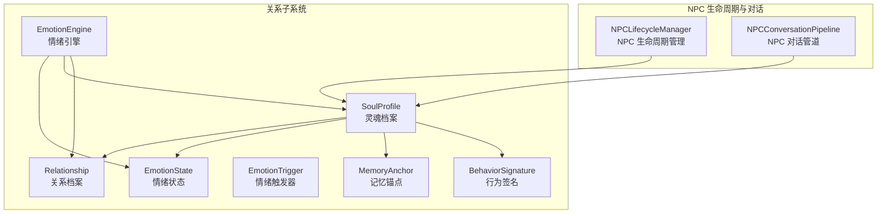
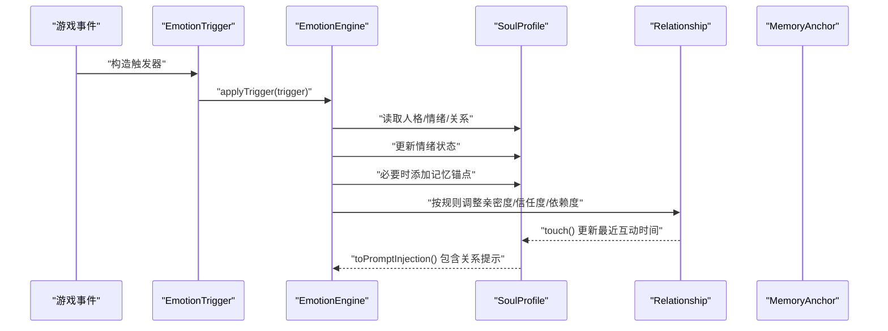
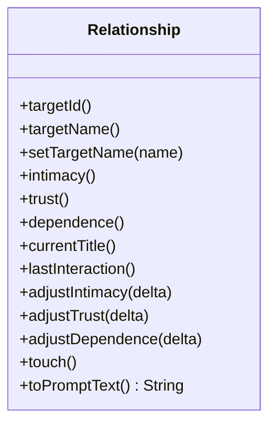
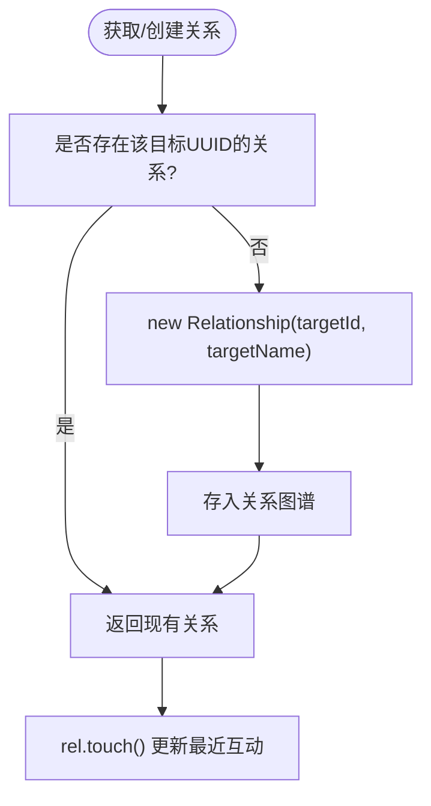
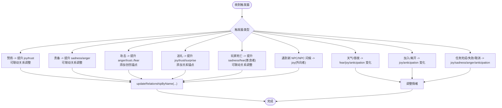
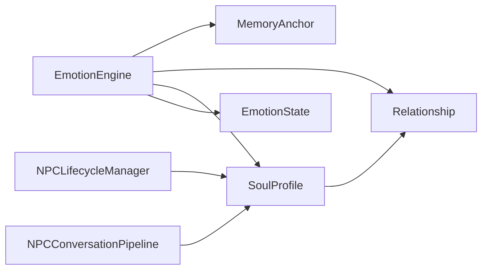

# 关系系统

<cite>
**本文档引用的文件**
- [Relationship.java](file://src/main/java/adris/altoclef/player2api/soul/Relationship.java)
- [SoulProfile.java](file://src/main/java/adris/altoclef/player2api/soul/SoulProfile.java)
- [EmotionEngine.java](file://src/main/java/adris/altoclef/player2api/soul/EmotionEngine.java)
- [EmotionState.java](file://src/main/java/adris/altoclef/player2api/soul/EmotionState.java)
- [EmotionTrigger.java](file://src/main/java/adris/altoclef/player2api/soul/EmotionTrigger.java)
- [MemoryAnchor.java](file://src/main/java/adris/altoclef/player2api/soul/MemoryAnchor.java)
- [BehaviorSignature.java](file://src/main/java/adris/altoclef/player2api/soul/BehaviorSignature.java)
- [EmotionalReinforcement.java](file://src/main/java/adris/altoclef/player2api/memory/EmotionalReinforcement.java)
- [AI_NPC灵魂特质交互优化方案.md](file://docs/AI_NPC灵魂特质交互优化方案.md)
- [NPCLifecycleManager.java](file://src/main/java/adris/altoclef/player2api/NPCLifecycleManager.java)
- [NPCConversationPipeline.java](file://src/main/java/adris/altoclef/player2api/NPCConversationPipeline.java)
</cite>

## 目录
1. [简介](#简介)
2. [项目结构](#项目结构)
3. [核心组件](#核心组件)
4. [架构总览](#架构总览)
5. [详细组件分析](#详细组件分析)
6. [依赖关系分析](#依赖关系分析)
7. [性能考量](#性能考量)
8. [故障排查指南](#故障排查指南)
9. [结论](#结论)
10. [附录](#附录)

## 简介
本文件面向关系系统的技术文档，聚焦 Relationship 类的关系建模机制，包括关系类型定义、亲密度计算、关系稳定性等核心概念；描述关系的建立过程（初次相遇、互动频率、重要事件等因素对关系发展的影响）；解释关系状态的动态变化机制（如何根据玩家行为和互动历史调整关系强度）；说明关系对 NPC 行为决策的影响（优先级调整、特殊行为触发、对话内容变化等）；并提供可直接定位到源码路径的示例，帮助开发者快速创建和管理玩家关系、查询关系状态、根据关系调整 NPC 行为。同时给出关系系统的设计原则与扩展指南。

## 项目结构
关系系统位于 player2api/soul 子模块中，围绕“灵魂档案”（SoulProfile）组织，包含关系图谱（Relationship）、情绪引擎（EmotionEngine）、情绪状态（EmotionState）、记忆锚点（MemoryAnchor）等核心构件，并与 NPC 生命周期管理（NPCLifecycleManager）和对话管道（NPCConversationPipeline）协同工作。

图表来源
- [SoulProfile.java:15-64](file://src/main/java/adris/altoclef/player2api/soul/SoulProfile.java#L15-L64)
- [Relationship.java:8-21](file://src/main/java/adris/altoclef/player2api/soul/Relationship.java#L8-L21)
- [EmotionEngine.java:11-22](file://src/main/java/adris/altoclef/player2api/soul/EmotionEngine.java#L11-L22)
- [EmotionState.java:9-20](file://src/main/java/adris/altoclef/player2api/soul/EmotionState.java#L9-L20)
- [MemoryAnchor.java:8-28](file://src/main/java/adris/altoclef/player2api/soul/MemoryAnchor.java#L8-L28)
- [BehaviorSignature.java:10-25](file://src/main/java/adris/altoclef/player2api/soul/BehaviorSignature.java#L10-L25)
- [NPCLifecycleManager.java:20-84](file://src/main/java/adris/altoclef/player2api/NPCLifecycleManager.java#L20-L84)
- [NPCConversationPipeline.java:14-61](file://src/main/java/adris/altoclef/player2api/NPCConversationPipeline.java#L14-L61)

章节来源
- [SoulProfile.java:15-64](file://src/main/java/adris/altoclef/player2api/soul/SoulProfile.java#L15-L64)
- [Relationship.java:8-21](file://src/main/java/adris/altoclef/player2api/soul/Relationship.java#L8-L21)
- [EmotionEngine.java:11-22](file://src/main/java/adris/altoclef/player2api/soul/EmotionEngine.java#L11-L22)
- [EmotionState.java:9-20](file://src/main/java/adris/altoclef/player2api/soul/EmotionState.java#L9-L20)
- [MemoryAnchor.java:8-28](file://src/main/java/adris/altoclef/player2api/soul/MemoryAnchor.java#L8-L28)
- [BehaviorSignature.java:10-25](file://src/main/java/adris/altoclef/player2api/soul/BehaviorSignature.java#L10-L25)
- [NPCLifecycleManager.java:20-84](file://src/main/java/adris/altoclef/player2api/NPCLifecycleManager.java#L20-L84)
- [NPCConversationPipeline.java:14-61](file://src/main/java/adris/altoclef/player2api/NPCConversationPipeline.java#L14-L61)

## 核心组件
- Relationship：单个目标玩家/实体的关系档案，包含亲密度、信任度、依赖度、当前称谓、最近互动时间等字段，提供增减调整与提示文本输出。
- SoulProfile：NPC 的灵魂核心容器，聚合人格矩阵、情绪状态、行为签名、记忆锚点与关系图谱，提供关系获取/创建、持久化、提示注入等功能。
- EmotionEngine：根据游戏事件触发器（EmotionTrigger）驱动情绪状态（EmotionState）变化，并联动关系档案的亲密度/信任度/依赖度调整。
- EmotionState：8 种基础情绪（joy, sadness, anger, fear, surprise, disgust, trust, anticipation），提供调整、衰减、主导情绪判定、提示文本生成等能力。
- MemoryAnchor：独立于对话历史的永久性情感记忆锚点，具备情感权重、分类、时效性评分、关联玩家等属性。
- BehaviorSignature：NPC 的行为偏好签名，用于影响 NPC 的行动倾向（主动性、风险容忍、独立性、效率、忠诚度）。
- NPCLifecycleManager 与 NPCConversationPipeline：负责 NPC 的生命周期与并发对话控制，间接影响关系与情绪的触发与反馈。

章节来源
- [Relationship.java:8-69](file://src/main/java/adris/altoclef/player2api/soul/Relationship.java#L8-L69)
- [SoulProfile.java:15-131](file://src/main/java/adris/altoclef/player2api/soul/SoulProfile.java#L15-L131)
- [EmotionEngine.java:11-183](file://src/main/java/adris/altoclef/player2api/soul/EmotionEngine.java#L11-L183)
- [EmotionState.java:9-127](file://src/main/java/adris/altoclef/player2api/soul/EmotionState.java#L9-L127)
- [MemoryAnchor.java:8-82](file://src/main/java/adris/altoclef/player2api/soul/MemoryAnchor.java#L8-L82)
- [BehaviorSignature.java:10-25](file://src/main/java/adris/altoclef/player2api/soul/BehaviorSignature.java#L10-L25)
- [NPCLifecycleManager.java:20-84](file://src/main/java/adris/altoclef/player2api/NPCLifecycleManager.java#L20-L84)
- [NPCConversationPipeline.java:14-193](file://src/main/java/adris/altoclef/player2api/NPCConversationPipeline.java#L14-L193)

## 架构总览
关系系统以“事件驱动 + 情绪驱动 + 记忆锚点”的方式运作：外部事件通过 EmotionTrigger 进入 EmotionEngine，驱动 EmotionState 的变化；同时根据预设规则调整 Relationship 的亲密度、信任度与依赖度；SoulProfile 负责统一管理关系图谱与记忆锚点，并将关系与情绪注入到对话提示中，从而影响 NPC 的对话与行为。

图表来源
- [EmotionEngine.java:17-171](file://src/main/java/adris/altoclef/player2api/soul/EmotionEngine.java#L17-L171)
- [SoulProfile.java:148-174](file://src/main/java/adris/altoclef/player2api/soul/SoulProfile.java#L148-L174)
- [Relationship.java:32-35](file://src/main/java/adris/altoclef/player2api/soul/Relationship.java#L32-L35)
- [MemoryAnchor.java:19-28](file://src/main/java/adris/altoclef/player2api/soul/MemoryAnchor.java#L19-L28)

## 详细组件分析

### Relationship 类：关系建模与动态更新
- 字段与职责
  - 目标标识与名称：targetId、targetName
  - 关系强度：intimacy（亲密度）、trust（信任度）、dependence（依赖度），均在 [-100, 100] 范围内
  - 当前称谓：currentTitle，依据亲密度自动映射
  - 最近互动时间：lastInteraction
- 关键方法
  - adjustIntimacy/adjustTrust/adjustDependence：对相应指标进行增量调整并钳制边界
  - updateTitle：根据亲密度阈值更新称谓
  - toPromptText：生成关系提示文本，供 LLM 注入
  - touch：刷新最近互动时间
- 设计要点
  - 亲密度决定称谓与对话语调倾向
  - 信任度影响信息共享程度
  - 依赖度影响自主决策意愿
  - clamp 边界保证数值稳定性

图表来源
- [Relationship.java:8-69](file://src/main/java/adris/altoclef/player2api/soul/Relationship.java#L8-L69)

章节来源
- [Relationship.java:8-69](file://src/main/java/adris/altoclef/player2api/soul/Relationship.java#L8-L69)

### SoulProfile：关系图谱与提示注入
- 职责
  - 维护关系图谱（Map<UUID字符串, Relationship>）
  - 提供 getOrCreateRelationship/getRelationship 查询与创建
  - 将关系与情绪、记忆锚点、行为签名注入到提示文本，供 LLM 使用
  - 持久化保存（save）
- 关系图谱管理
  - 使用 UUID 字符串作为键，确保多玩家隔离
  - 支持并发访问（ConcurrentHashMap）

图表来源
- [SoulProfile.java:117-124](file://src/main/java/adris/altoclef/player2api/soul/SoulProfile.java#L117-L124)
- [Relationship.java:35](file://src/main/java/adris/altoclef/player2api/soul/Relationship.java#L35)

章节来源
- [SoulProfile.java:115-131](file://src/main/java/adris/altoclef/player2api/soul/SoulProfile.java#L115-L131)

### EmotionEngine：事件驱动的情绪与关系更新
- 触发器类型（节选）
  - 玩家赞扬、责备、攻击、赠送物品、死亡、加入/离开、昼夜更替、天气变化、发现稀有物品、进入危险区域、健康状态、任务完成/失败/取消、遇到新 NPC、NPC 问候等
- 更新逻辑
  - 根据触发器类型调整情绪强度（Joy/Sadness/Anger/Fear/Surprise/Disgust/Trust/Anticipation）
  - 在特定事件下添加记忆锚点（如被攻击）
  - 通过 updateRelationshipByName 按规则调整 Relationship 的亲密度/信任度/依赖度，并 touch 更新时间
- 性能与稳定性
  - 情绪单次调整幅度限制，避免瞬时爆炸
  - 情绪自然衰减（约 30 秒一次）

图表来源
- [EmotionEngine.java:23-171](file://src/main/java/adris/altoclef/player2api/soul/EmotionEngine.java#L23-L171)
- [EmotionEngine.java:173-182](file://src/main/java/adris/altoclef/player2api/soul/EmotionEngine.java#L173-L182)

章节来源
- [EmotionEngine.java:17-183](file://src/main/java/adris/altoclef/player2api/soul/EmotionEngine.java#L17-L183)

### EmotionState：情绪状态与提示生成
- 情绪维度：joy, sadness, anger, fear, surprise, disgust, trust, anticipation
- 能力
  - adjust/set/get：调整/设置/获取情绪强度（0.0~1.0，单次调整幅度上限）
  - decay：自然衰减
  - getDominantEmotion/getDominantIntensity：主导情绪与强度
  - hasSignificantEmotion：是否存在显著情绪
  - toPromptText：生成情绪提示文本，包含“当前情绪 + 对话指导”

章节来源
- [EmotionState.java:9-127](file://src/main/java/adris/altoclef/player2api/soul/EmotionState.java#L9-L127)

### MemoryAnchor：记忆锚点与情感强化
- 属性
  - id/content/category/emotionalWeight/timestamp/permanent/relatedPlayer/referenceCount/lastUsedTimestamp
- 能力
  - reinforceEmotionalWeight：增强情感权重
  - getScore：综合情感权重与时效性评分（永久锚点得分最高）
  - refreshTimestamp：刷新使用时间（等效“复习”）
- 与关系系统协作
  - 情绪引擎在特定事件下创建记忆锚点，强化关系/创伤等关键记忆
  - EmotionalReinforcement 在高情绪事件时对相关记忆进行情感强化

章节来源
- [MemoryAnchor.java:8-82](file://src/main/java/adris/altoclef/player2api/soul/MemoryAnchor.java#L8-L82)
- [EmotionalReinforcement.java:11-39](file://src/main/java/adris/altoclef/player2api/memory/EmotionalReinforcement.java#L11-L39)

### NPC 生命周期与对话管道：关系的触发与反馈
- NPCLifecycleManager：负责 NPC 的生成、注册与生命周期管理，配合 SoulProfile 的加载/创建
- NPCConversationPipeline：为每个 NPC 提供独立的状态机与锁，避免全局阻塞，保障关系与情绪的连续反馈

章节来源
- [NPCLifecycleManager.java:20-84](file://src/main/java/adris/altoclef/player2api/NPCLifecycleManager.java#L20-L84)
- [NPCConversationPipeline.java:14-193](file://src/main/java/adris/altoclef/player2api/NPCConversationPipeline.java#L14-L193)

## 依赖关系分析
- Relationship 与 SoulProfile：SoulProfile 通过 getOrCreateRelationship 维护关系图谱，Relationship 仅持有目标标识与关系强度
- EmotionEngine 与 EmotionState/Relationship：EmotionEngine 调整 EmotionState 并联动 Relationship 的强度变化
- MemoryAnchor 与 EmotionEngine：EmotionEngine 在特定事件下创建 MemoryAnchor，用于强化关键记忆
- NPCConversationPipeline 与 SoulProfile：对话管道在生成提示时使用 SoulProfile 的 toPromptInjection，其中包含关系与情绪信息

图表来源
- [EmotionEngine.java:17-171](file://src/main/java/adris/altoclef/player2api/soul/EmotionEngine.java#L17-L171)
- [SoulProfile.java:117-174](file://src/main/java/adris/altoclef/player2api/soul/SoulProfile.java#L117-L174)
- [NPCConversationPipeline.java:14-61](file://src/main/java/adris/altoclef/player2api/NPCConversationPipeline.java#L14-L61)
- [NPCLifecycleManager.java:72-77](file://src/main/java/adris/altoclef/player2api/NPCLifecycleManager.java#L72-L77)

章节来源
- [EmotionEngine.java:17-171](file://src/main/java/adris/altoclef/player2api/soul/EmotionEngine.java#L17-L171)
- [SoulProfile.java:117-174](file://src/main/java/adris/altoclef/player2api/soul/SoulProfile.java#L117-L174)
- [NPCConversationPipeline.java:14-61](file://src/main/java/adris/altoclef/player2api/NPCConversationPipeline.java#L14-L61)
- [NPCLifecycleManager.java:72-77](file://src/main/java/adris/altoclef/player2api/NPCLifecycleManager.java#L72-L77)

## 性能考量
- 情绪自然衰减：约 30 秒一次，降低持续计算开销
- 关系与记忆的并发安全：使用 ConcurrentHashMap 与线程安全集合，避免锁竞争
- 提示注入压缩：提供紧凑版提示（toCompactPromptInjection），减少上下文长度与 token 消耗
- 记忆锚点数量控制：超过上限时按评分清理，避免无限增长

章节来源
- [SoulProfile.java:135-141](file://src/main/java/adris/altoclef/player2api/soul/SoulProfile.java#L135-L141)
- [SoulProfile.java:82-106](file://src/main/java/adris/altoclef/player2api/soul/SoulProfile.java#L82-L106)
- [SoulProfile.java:180-211](file://src/main/java/adris/altoclef/player2api/soul/SoulProfile.java#L180-L211)

## 故障排查指南
- 关系未更新
  - 检查是否正确构造并传递 EmotionTrigger
  - 确认 EmotionEngine.applyTrigger 是否被调用
  - 核对 updateRelationshipByName 的目标 UUID 生成与传入
  - 参考路径：[EmotionEngine.java:17-182](file://src/main/java/adris/altoclef/player2api/soul/EmotionEngine.java#L17-L182)
- 称谓不正确
  - 检查亲密度阈值映射逻辑是否被覆盖
  - 参考路径：[Relationship.java:37-44](file://src/main/java/adris/altoclef/player2api/soul/Relationship.java#L37-L44)
- 情绪异常波动
  - 检查单次调整幅度是否被限制（±0.25）
  - 参考路径：[EmotionState.java:36-42](file://src/main/java/adris/altoclef/player2api/soul/EmotionState.java#L36-L42)
- 记忆锚点未生效
  - 确认 MemoryAnchor 的情感权重与时效性评分计算
  - 参考路径：[MemoryAnchor.java:72-76](file://src/main/java/adris/altoclef/player2api/soul/MemoryAnchor.java#L72-L76)
- 提示文本过长
  - 使用紧凑版提示注入（toCompactPromptInjection）
  - 参考路径：[SoulProfile.java:180-211](file://src/main/java/adris/altoclef/player2api/soul/SoulProfile.java#L180-L211)

章节来源
- [EmotionEngine.java:17-182](file://src/main/java/adris/altoclef/player2api/soul/EmotionEngine.java#L17-L182)
- [Relationship.java:37-44](file://src/main/java/adris/altoclef/player2api/soul/Relationship.java#L37-L44)
- [EmotionState.java:36-42](file://src/main/java/adris/altoclef/player2api/soul/EmotionState.java#L36-L42)
- [MemoryAnchor.java:72-76](file://src/main/java/adris/altoclef/player2api/soul/MemoryAnchor.java#L72-L76)
- [SoulProfile.java:180-211](file://src/main/java/adris/altoclef/player2api/soul/SoulProfile.java#L180-L211)

## 结论
关系系统通过 Relationship 的亲密度/信任度/依赖度三元模型，结合 EmotionEngine 的事件驱动与 EmotionState 的情绪状态，形成闭环：事件→情绪→关系→提示→行为。SoulProfile 统一承载并注入这些状态，MemoryAnchor 提供长期情感记忆，NPCLifecycleManager 与 NPCConversationPipeline 保障 NPC 生命周期与并发对话的稳定性。该设计既满足可解释性与可控性，又便于扩展新的触发器与关系影响因子。

## 附录

### 关系演化规则与对对话的影响（参考）
- 关系演化规则（节选）
  - 首次见面：亲密度+10，信任+5
  - 赠送礼物（钻石）：亲密度+30，信任+20
  - 一起击败 Boss：亲密度+40，信任+30
  - 长期合作（>1小时）：亲密度+20，信任+15
  - 误伤 NPC：亲密度-30，信任-20
  - 辱骂/攻击 NPC：亲密度-50，信任-40
- 对对话的影响
  - 亲密度决定称谓与语气
  - 信任度决定信息共享程度
  - 依赖度决定自主决策意愿

章节来源
- [AI_NPC灵魂特质交互优化方案.md:186-220](file://docs/AI_NPC灵魂特质交互优化方案.md#L186-L220)

### 代码示例路径（无具体代码内容，仅提供定位）
- 创建并获取关系
  - [SoulProfile.java:117-124](file://src/main/java/adris/altoclef/player2api/soul/SoulProfile.java#L117-L124)
- 调整关系强度
  - [Relationship.java:32-34](file://src/main/java/adris/altoclef/player2api/soul/Relationship.java#L32-L34)
- 更新最近互动时间
  - [Relationship.java:35](file://src/main/java/adris/altoclef/player2api/soul/Relationship.java#L35)
- 生成关系提示文本
  - [Relationship.java:46-64](file://src/main/java/adris/altoclef/player2api/soul/Relationship.java#L46-L64)
- 触发情绪并联动关系
  - [EmotionEngine.java:23-68](file://src/main/java/adris/altoclef/player2api/soul/EmotionEngine.java#L23-L68)
- 添加记忆锚点
  - [EmotionEngine.java:48-49](file://src/main/java/adris/altoclef/player2api/soul/EmotionEngine.java#L48-L49)
- 生成提示注入（包含关系）
  - [SoulProfile.java:148-174](file://src/main/java/adris/altoclef/player2api/soul/SoulProfile.java#L148-L174)
- 情绪自然衰减
  - [SoulProfile.java:135-141](file://src/main/java/adris/altoclef/player2api/soul/SoulProfile.java#L135-L141)