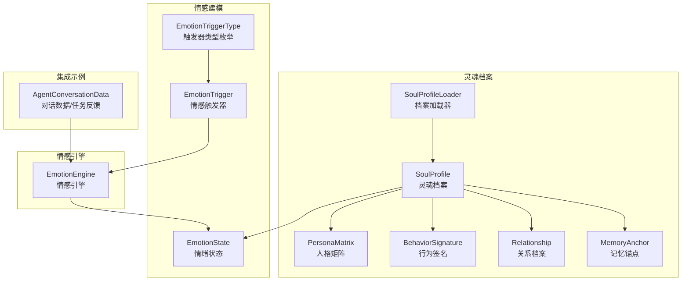
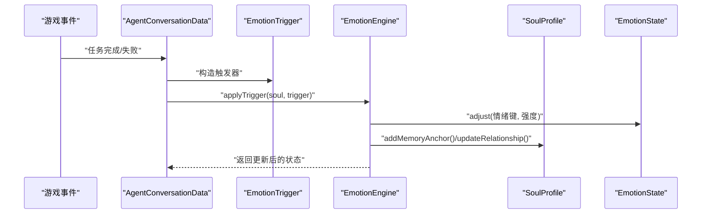
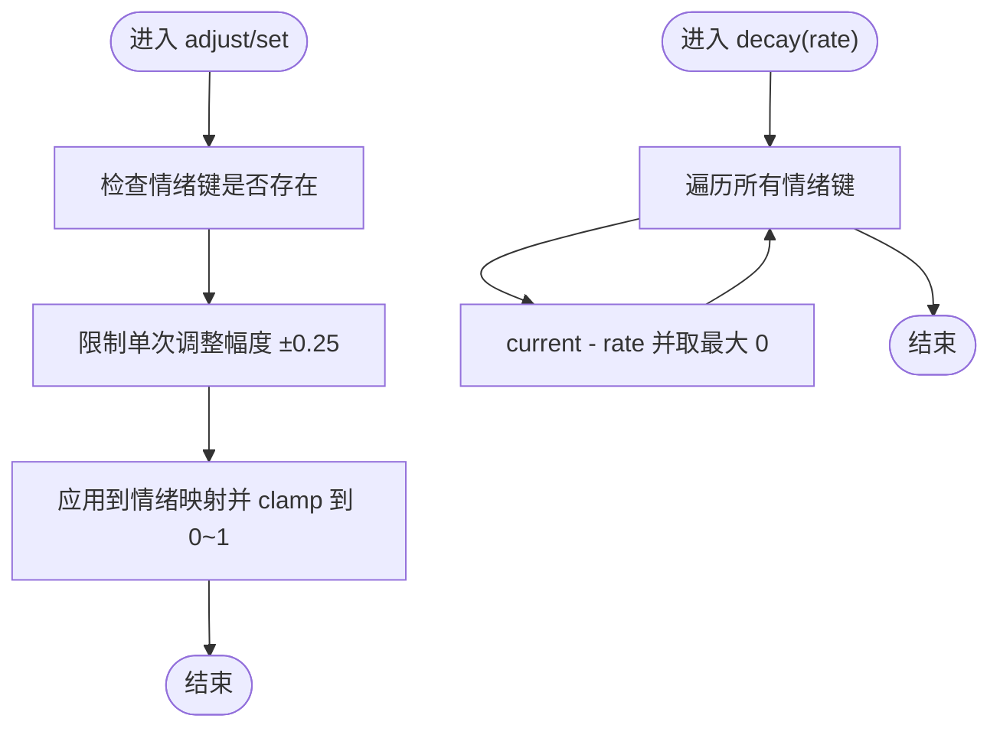
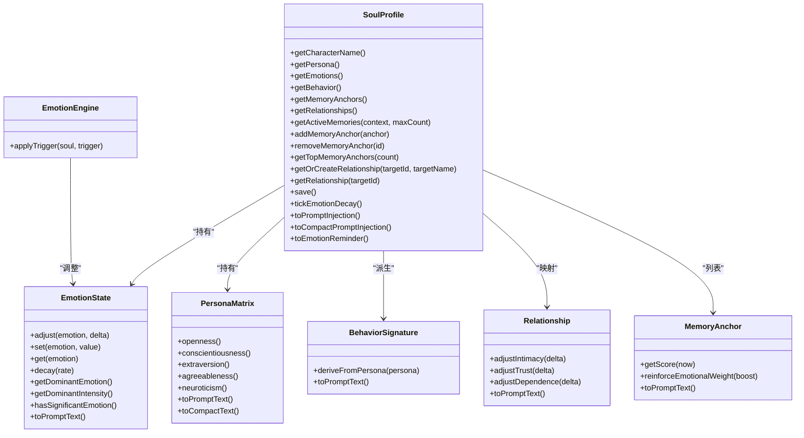
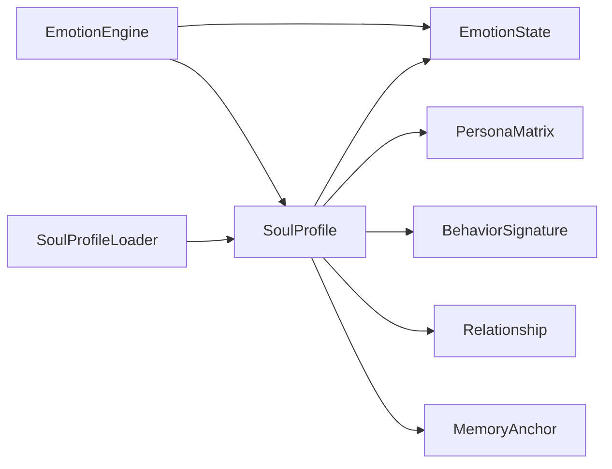

# 情感状态系统

<cite>
**本文引用的文件**
- [EmotionState.java](file://src/main/java/adris/altoclef/player2api/soul/EmotionState.java)
- [EmotionEngine.java](file://src/main/java/adris/altoclef/player2api/soul/EmotionEngine.java)
- [EmotionTrigger.java](file://src/main/java/adris/altoclef/player2api/soul/EmotionTrigger.java)
- [EmotionTriggerType.java](file://src/main/java/adris/altoclef/player2api/soul/EmotionTriggerType.java)
- [SoulProfile.java](file://src/main/java/adris/altoclef/player2api/soul/SoulProfile.java)
- [PersonaMatrix.java](file://src/main/java/adris/altoclef/player2api/soul/PersonaMatrix.java)
- [BehaviorSignature.java](file://src/main/java/adris/altoclef/player2api/soul/BehaviorSignature.java)
- [Relationship.java](file://src/main/java/adris/altoclef/player2api/soul/Relationship.java)
- [MemoryAnchor.java](file://src/main/java/adris/altoclef/player2api/soul/MemoryAnchor.java)
- [SoulProfileLoader.java](file://src/main/java/adris/altoclef/player2api/soul/SoulProfileLoader.java)
- [AgentConversationData.java](file://src/main/java/adris/altoclef/player2api/AgentConversationData.java)
- [soul_Luna.json](file://src/main/resources/soul/soul_Luna.json)
- [soul_QiQi.json](file://src/main/resources/soul/soul_QiQi.json)
</cite>

## 目录
1. [简介](#简介)
2. [项目结构](#项目结构)
3. [核心组件](#核心组件)
4. [架构总览](#架构总览)
5. [详细组件分析](#详细组件分析)
6. [依赖分析](#依赖分析)
7. [性能考量](#性能考量)
8. [故障排查指南](#故障排查指南)
9. [结论](#结论)
10. [附录](#附录)

## 简介
本技术文档围绕情感状态系统展开，系统以“8种基础情绪”为核心，结合“人格矩阵（大五人格）”与“行为签名”，构建 NPC 的情感建模与表达闭环。系统通过“情感引擎”根据游戏事件触发器对 NPC 的情绪状态进行即时调整，并在自然时间间隔内进行衰减；同时，系统还维护“记忆锚点”和“关系档案”，使 NPC 的情感与行为具备持久性与个性化特征。文档将深入解释情感类型定义、强度计算、持续时间管理、触发条件、衰减算法与组合规则，并给出从情感产生到行为表现的完整影响路径与实践建议。

## 项目结构
情感状态系统位于模块路径 com/goodbird/player2npc 的 soul 子包中，核心文件如下：
- 情感建模与状态：EmotionState、EmotionTrigger、EmotionTriggerType
- 情感引擎：EmotionEngine
- 灵魂档案与上下文：SoulProfile、PersonaMatrix、BehaviorSignature、Relationship、MemoryAnchor、SoulProfileLoader
- 集成示例：AgentConversationData（任务完成/失败触发情感）

图表来源
- [EmotionState.java:1-128](file://src/main/java/adris/altoclef/player2api/soul/EmotionState.java#L1-L128)
- [EmotionEngine.java:1-184](file://src/main/java/adris/altoclef/player2api/soul/EmotionEngine.java#L1-L184)
- [EmotionTrigger.java:1-20](file://src/main/java/adris/altoclef/player2api/soul/EmotionTrigger.java#L1-L20)
- [EmotionTriggerType.java:1-40](file://src/main/java/adris/altoclef/player2api/soul/EmotionTriggerType.java#L1-L40)
- [SoulProfile.java:1-226](file://src/main/java/adris/altoclef/player2api/soul/SoulProfile.java#L1-L226)
- [PersonaMatrix.java:1-120](file://src/main/java/adris/altoclef/player2api/soul/PersonaMatrix.java#L1-L120)
- [BehaviorSignature.java:1-124](file://src/main/java/adris/altoclef/player2api/soul/BehaviorSignature.java#L1-L124)
- [Relationship.java:1-70](file://src/main/java/adris/altoclef/player2api/soul/Relationship.java#L1-L70)
- [MemoryAnchor.java:1-83](file://src/main/java/adris/altoclef/player2api/soul/MemoryAnchor.java#L1-L83)
- [SoulProfileLoader.java:1-226](file://src/main/java/adris/altoclef/player2api/soul/SoulProfileLoader.java#L1-L226)
- [AgentConversationData.java:360-433](file://src/main/java/adris/altoclef/player2api/AgentConversationData.java#L360-L433)

章节来源
- [EmotionState.java:1-128](file://src/main/java/adris/altoclef/player2api/soul/EmotionState.java#L1-L128)
- [EmotionEngine.java:1-184](file://src/main/java/adris/altoclef/player2api/soul/EmotionEngine.java#L1-L184)
- [EmotionTrigger.java:1-20](file://src/main/java/adris/altoclef/player2api/soul/EmotionTrigger.java#L1-L20)
- [EmotionTriggerType.java:1-40](file://src/main/java/adris/altoclef/player2api/soul/EmotionTriggerType.java#L1-L40)
- [SoulProfile.java:1-226](file://src/main/java/adris/altoclef/player2api/soul/SoulProfile.java#L1-L226)
- [PersonaMatrix.java:1-120](file://src/main/java/adris/altoclef/player2api/soul/PersonaMatrix.java#L1-L120)
- [BehaviorSignature.java:1-124](file://src/main/java/adris/altoclef/player2api/soul/BehaviorSignature.java#L1-L124)
- [Relationship.java:1-70](file://src/main/java/adris/altoclef/player2api/soul/Relationship.java#L1-L70)
- [MemoryAnchor.java:1-83](file://src/main/java/adris/altoclef/player2api/soul/MemoryAnchor.java#L1-L83)
- [SoulProfileLoader.java:1-226](file://src/main/java/adris/altoclef/player2api/soul/SoulProfileLoader.java#L1-L226)
- [AgentConversationData.java:360-433](file://src/main/java/adris/altoclef/player2api/AgentConversationData.java#L360-L433)

## 核心组件
- 情绪状态（EmotionState）：定义 8 种基础情绪键值，提供设置、调整、自然衰减、主导情绪提取与提示文本生成能力。
- 情感触发器（EmotionTrigger）：封装触发类型、玩家名、物品名与物品价值，作为情感引擎的输入。
- 触发器类型（EmotionTriggerType）：枚举所有可导致情绪变化的游戏事件，涵盖玩家互动、环境事件、游戏事件、任务事件与社交事件。
- 情感引擎（EmotionEngine）：根据触发器类型与人格矩阵参数，对情绪状态进行增量调整，并更新关系与记忆锚点。
- 灵魂档案（SoulProfile）：聚合人格矩阵、情绪状态、行为签名、记忆锚点与关系图谱，负责情绪自然衰减、记忆清理与提示注入。
- 人格矩阵（PersonaMatrix）：基于大五人格模型的静态参数集，决定情绪反应的基线强度与倾向。
- 行为签名（BehaviorSignature）：从人格矩阵派生的行动偏好集合，用于指导 NPC 的行为倾向。
- 关系档案（Relationship）：记录 NPC 与玩家之间的亲密度、信任度、依赖度与称谓。
- 记忆锚点（MemoryAnchor）：持久化的情感记忆单元，带分类、情感权重与时效评分。
- 档案加载器（SoulProfileLoader）：负责从资源文件加载或保存灵魂档案，支持回退与容错。

章节来源
- [EmotionState.java:1-128](file://src/main/java/adris/altoclef/player2api/soul/EmotionState.java#L1-L128)
- [EmotionEngine.java:1-184](file://src/main/java/adris/altoclef/player2api/soul/EmotionEngine.java#L1-L184)
- [EmotionTrigger.java:1-20](file://src/main/java/adris/altoclef/player2api/soul/EmotionTrigger.java#L1-L20)
- [EmotionTriggerType.java:1-40](file://src/main/java/adris/altoclef/player2api/soul/EmotionTriggerType.java#L1-L40)
- [SoulProfile.java:1-226](file://src/main/java/adris/altoclef/player2api/soul/SoulProfile.java#L1-L226)
- [PersonaMatrix.java:1-120](file://src/main/java/adris/altoclef/player2api/soul/PersonaMatrix.java#L1-L120)
- [BehaviorSignature.java:1-124](file://src/main/java/adris/altoclef/player2api/soul/BehaviorSignature.java#L1-L124)
- [Relationship.java:1-70](file://src/main/java/adris/altoclef/player2api/soul/Relationship.java#L1-L70)
- [MemoryAnchor.java:1-83](file://src/main/java/adris/altoclef/player2api/soul/MemoryAnchor.java#L1-L83)
- [SoulProfileLoader.java:1-226](file://src/main/java/adris/altoclef/player2api/soul/SoulProfileLoader.java#L1-L226)

## 架构总览
情感状态系统采用“触发-计算-持久化”的三层架构：
- 触发层：由 AgentConversationData 等模块在任务完成/失败等事件发生时创建 EmotionTrigger 并提交给 EmotionEngine。
- 计算层：EmotionEngine 依据 EmotionTriggerType 与 PersonaMatrix 参数对 EmotionState 进行调整，同时更新 MemoryAnchor 与 Relationship。
- 持久化层：SoulProfile 统一管理情绪衰减、记忆锚点清理与提示注入；SoulProfileLoader 负责读写 JSON 档案。

图表来源
- [AgentConversationData.java:360-433](file://src/main/java/adris/altoclef/player2api/AgentConversationData.java#L360-L433)
- [EmotionEngine.java:17-171](file://src/main/java/adris/altoclef/player2api/soul/EmotionEngine.java#L17-L171)
- [SoulProfile.java:82-113](file://src/main/java/adris/altoclef/player2api/soul/SoulProfile.java#L82-L113)

章节来源
- [AgentConversationData.java:360-433](file://src/main/java/adris/altoclef/player2api/AgentConversationData.java#L360-L433)
- [EmotionEngine.java:1-184](file://src/main/java/adris/altoclef/player2api/soul/EmotionEngine.java#L1-L184)
- [SoulProfile.java:1-226](file://src/main/java/adris/altoclef/player2api/soul/SoulProfile.java#L1-L226)

## 详细组件分析

### 情绪状态（EmotionState）
- 情绪类型与范围：包含 joy、sadness、anger、fear、surprise、disgust、trust、anticipation 共 8 种基础情绪，强度范围 0.0~1.0。
- 强度调整与限制：提供 adjust/set/get 接口；单次调整幅度限制在 ±0.25，防止瞬时爆表；clamp 保证边界。
- 自然衰减：decay(rate) 对每种情绪按衰减率进行线性衰减，确保情绪随时间恢复。
- 主导情绪提取：getDominantEmotion()/getDominantIntensity() 返回当前最强情绪及其强度；hasSignificantEmotion() 提供显著情绪判断阈值。
- 提示文本生成：toPromptText() 输出结构化情绪描述与基于主导情绪的对话指导，便于注入 LLM 系统提示。

图表来源
- [EmotionState.java:36-63](file://src/main/java/adris/altoclef/player2api/soul/EmotionState.java#L36-L63)

章节来源
- [EmotionState.java:1-128](file://src/main/java/adris/altoclef/player2api/soul/EmotionState.java#L1-L128)

### 情感引擎（EmotionEngine）
- 触发器应用：applyTrigger(soul, trigger) 根据 EmotionTriggerType 分支处理，对 EmotionState 进行增量调整。
- 人格矩阵影响：不同触发对情绪的影响受 PersonaMatrix 的 extraversion、agreeableness、neuroticism、conscientiousness 等维度影响，体现个体差异。
- 关系与记忆：根据触发类型添加 MemoryAnchor，并更新 Relationship 的亲密度、信任度与依赖度；当涉及具体玩家时，使用 playerName 生成稳定 UUID 进行关系管理。
- 日志与可观测性：当主导情绪强度超过阈值时输出日志，便于调试与监控。

```mermaid
flowchart TD
S(["接收触发器"]) --> Switch{"匹配触发器类型"}
Switch --> Praise["PLAYER_PRAISE<br/>提升 joy/trust"]
Switch --> Blame["PLAYER_BLAME<br/>提升 sadness/anger低 agreeableness 时更易怒"]
Switch --> Attack["PLAYER_ATTACK<br/>提升 anger/fear，降低 trust，添加创伤锚点"]
Switch --> Gift["PLAYER_GIFT<br/>按物品价值提升 joy/trust/surprise，添加关系锚点"]
Switch --> Death["PLAYER_DEATH<br/>提升 sadness高 agreeableness 时更担心"]
Switch --> Join["PLAYER_JOIN<br/>提升 joy/anticipation"]
Switch --> Leave["PLAYER_LEAVE<br/>提升 sadness"]
Switch --> Day["DAY_BREAK<br/>提升 joy，降低 fear"]
Switch --> Night["NIGHT_FALL<br/>高 neuroticism 时提升 fear，提升 anticipation"]
Switch --> Rain["RAIN_START<br/>高 neuroticism 时提升 sadness"]
Switch --> Thunder["THUNDER<br/>提升 fear/surprise"]
Switch --> Diamond["FIND_DIAMOND<br/>提升 joy/surprise"]
Switch --> Rare["FIND_RARE_ITEM<br/>提升 joy/surprise"]
Switch --> Cave["ENTER_CAVE<br/>高 neuroticism 时提升 fear，提升 anticipation"]
Switch --> Nether["ENTER_NETHER<br/>提升 fear/anticipation"]
Switch --> End["ENTER_END<br/>提升 fear/anticipation"]
Switch --> Creeper["CREEPER_NEARBY<br/>提升 fear/surprise"]
Switch --> Health["LOW_HEALTH<br/>提升 fear高 neuroticism 时更易惊"]
Switch --> TaskC["TASK_COMPLETE<br/>提升 joy/anticipation"]
Switch --> TaskF["TASK_FAIL<br/>提升 sadness高 conscientiousness 时更自责"]
Switch --> TaskX["TASK_CANCELLED<br/>提升 sadness，降低 anticipation"]
Switch --> Meet["MEET_NEW_NPC<br/>提升 surprise高 extraversion 时更开心"]
Switch --> Greet["NPC_GREETING<br/>高 extraversion 时提升 joy"]
Praise --> Update["更新关系/记忆锚点"]
Blame --> Update
Attack --> Update
Gift --> Update
Death --> Update
Join --> Update
Leave --> Update
Day --> Update
Night --> Update
Rain --> Update
Thunder --> Update
Diamond --> Update
Rare --> Update
Cave --> Update
Nether --> Update
End --> Update
Creeper --> Update
Health --> Update
TaskC --> Update
TaskF --> Update
TaskX --> Update
Meet --> Update
Greet --> Update
Update --> Log["记录日志主导情绪强度>0.3"]
Log --> E(["结束"])
```

图表来源
- [EmotionEngine.java:17-171](file://src/main/java/adris/altoclef/player2api/soul/EmotionEngine.java#L17-L171)

章节来源
- [EmotionEngine.java:1-184](file://src/main/java/adris/altoclef/player2api/soul/EmotionEngine.java#L1-L184)

### 情感触发器（EmotionTrigger）与类型（EmotionTriggerType）
- 触发器结构：包含触发类型、玩家名、物品名与物品价值，提供便捷构造方法。
- 触发器类型：涵盖玩家互动（称赞/责备/攻击/送礼/玩家死亡/加入/离开）、环境事件（日出/日落/下雨/打雷）、游戏事件（发现钻石/稀有物品/进入洞穴/下界/末地/苦力怕/低血量）、任务事件（完成/失败/取消）与社交事件（遇到新 NPC/被 NPC 问候）。

章节来源
- [EmotionTrigger.java:1-20](file://src/main/java/adris/altoclef/player2api/soul/EmotionTrigger.java#L1-L20)
- [EmotionTriggerType.java:1-40](file://src/main/java/adris/altoclef/player2api/soul/EmotionTriggerType.java#L1-L40)

### 灵魂档案（SoulProfile）与周边组件
- 灵魂档案聚合：PersonaMatrix、EmotionState、BehaviorSignature、MemoryAnchor 列表、Relationship 映射与分层记忆系统。
- 情绪自然衰减：tickEmotionDecay() 每 30 秒衰减 0.1，加速情绪恢复。
- 记忆锚点管理：addMemoryAnchor()/removeMemoryAnchor()，按评分清理旧锚点，保留高分且非永久锚点。
- 提示注入：toPromptInjection()/toCompactPromptInjection() 将人格、情绪、记忆锚点、关系与行为倾向注入 LLM 提示；toEmotionReminder() 生成用户消息提醒。
- 关系管理：getOrCreateRelationship()/getRelationship()，并提供基于亲密度的称谓更新逻辑。

图表来源
- [SoulProfile.java:15-226](file://src/main/java/adris/altoclef/player2api/soul/SoulProfile.java#L15-L226)
- [EmotionState.java:9-128](file://src/main/java/adris/altoclef/player2api/soul/EmotionState.java#L9-L128)
- [PersonaMatrix.java:10-120](file://src/main/java/adris/altoclef/player2api/soul/PersonaMatrix.java#L10-L120)
- [BehaviorSignature.java:10-124](file://src/main/java/adris/altoclef/player2api/soul/BehaviorSignature.java#L10-L124)
- [Relationship.java:8-70](file://src/main/java/adris/altoclef/player2api/soul/Relationship.java#L8-L70)
- [MemoryAnchor.java:8-83](file://src/main/java/adris/altoclef/player2api/soul/MemoryAnchor.java#L8-L83)
- [EmotionEngine.java:11-184](file://src/main/java/adris/altoclef/player2api/soul/EmotionEngine.java#L11-L184)

章节来源
- [SoulProfile.java:1-226](file://src/main/java/adris/altoclef/player2api/soul/SoulProfile.java#L1-L226)
- [PersonaMatrix.java:1-120](file://src/main/java/adris/altoclef/player2api/soul/PersonaMatrix.java#L1-L120)
- [BehaviorSignature.java:1-124](file://src/main/java/adris/altoclef/player2api/soul/BehaviorSignature.java#L1-L124)
- [Relationship.java:1-70](file://src/main/java/adris/altoclef/player2api/soul/Relationship.java#L1-L70)
- [MemoryAnchor.java:1-83](file://src/main/java/adris/altoclef/player2api/soul/MemoryAnchor.java#L1-L83)
- [EmotionEngine.java:1-184](file://src/main/java/adris/altoclef/player2api/soul/EmotionEngine.java#L1-L184)

### 档案加载与默认配置
- 加载策略：优先从运行时配置目录加载；若不存在则从资源模板复制默认配置后再加载；失败时回退至中性人格。
- 保存策略：将 personaMatrix、emotions、behaviorSignature、memoryAnchors、relationships 写入 JSON 文件。
- 默认角色配置：提供 Luna 与 QiQi 的 JSON 模板，包含初始人格、情绪与行为签名注释，便于玩家理解与二次开发。

章节来源
- [SoulProfileLoader.java:25-226](file://src/main/java/adris/altoclef/player2api/soul/SoulProfileLoader.java#L25-L226)
- [soul_Luna.json:1-61](file://src/main/resources/soul/soul_Luna.json#L1-L61)
- [soul_QiQi.json:1-61](file://src/main/resources/soul/soul_QiQi.json#L1-L61)

### 情感触发器的使用示例与流程
- 示例路径：在任务完成/失败时由 AgentConversationData 创建 EmotionTrigger 并调用 EmotionEngine.applyTrigger(soul, trigger)。
- 流程要点：确保 soul 非空；根据触发类型选择合适的强度与情绪键；必要时传入玩家名以更新关系；观察日志确认主导情绪变化。

章节来源
- [AgentConversationData.java:360-433](file://src/main/java/adris/altoclef/player2api/AgentConversationData.java#L360-L433)
- [EmotionEngine.java:17-171](file://src/main/java/adris/altoclef/player2api/soul/EmotionEngine.java#L17-L171)

## 依赖分析
- 组件耦合：EmotionEngine 依赖 EmotionState 与 SoulProfile；SoulProfile 聚合 PersonaMatrix、EmotionState、BehaviorSignature、Relationship、MemoryAnchor；SoulProfileLoader 依赖 SoulProfile 进行读写。
- 外部依赖：日志框架（Log4j）用于情感引擎的日志输出；JSON 序列化（Gson）用于档案持久化。
- 潜在循环依赖：当前设计为单向依赖，未见循环；EmotionEngine 不直接依赖 SoulProfileLoader，避免运行时耦合。

图表来源
- [EmotionEngine.java:11-184](file://src/main/java/adris/altoclef/player2api/soul/EmotionEngine.java#L11-L184)
- [SoulProfile.java:15-226](file://src/main/java/adris/altoclef/player2api/soul/SoulProfile.java#L15-L226)
- [SoulProfileLoader.java:25-226](file://src/main/java/adris/altoclef/player2api/soul/SoulProfileLoader.java#L25-L226)

章节来源
- [EmotionEngine.java:1-184](file://src/main/java/adris/altoclef/player2api/soul/EmotionEngine.java#L1-L184)
- [SoulProfile.java:1-226](file://src/main/java/adris/altoclef/player2api/soul/SoulProfile.java#L1-L226)
- [SoulProfileLoader.java:1-226](file://src/main/java/adris/altoclef/player2api/soul/SoulProfileLoader.java#L1-L226)

## 性能考量
- 情绪衰减频率：每 30 秒衰减一次，衰减值 0.1，兼顾自然恢复与性能；可根据服务器负载调优周期与衰减值。
- 单次调整幅度限制：防止情绪突变带来的抖动与不自然表现。
- 记忆锚点清理：按评分排序并删除低分非永久锚点，避免内存膨胀；建议在批量操作时合并清理。
- 提示注入压缩：compact 注入减少 token 使用，适合上下文受限场景；注意平衡信息密度与表达力。
- 日志输出：仅在主导情绪强度超过阈值时记录，降低日志噪声。

## 故障排查指南
- 情绪未变化：检查触发器类型是否正确、EmotionEngine 是否被调用、PersonaMatrix 参数是否导致强度被抑制。
- 情绪异常升高：确认单次调整幅度限制是否生效、是否存在重复触发；检查触发器构造是否遗漏关键参数。
- 记忆锚点过多：检查清理逻辑是否正常执行、锚点是否被标记为永久；必要时手动清理。
- 关系未更新：确认 playerName 是否为空、UUID 生成是否稳定；检查 updateRelationshipByName 的调用链。
- 档案加载失败：检查资源模板是否存在、文件权限与路径；查看日志中的回退信息。

章节来源
- [EmotionEngine.java:17-171](file://src/main/java/adris/altoclef/player2api/soul/EmotionEngine.java#L17-L171)
- [SoulProfile.java:82-113](file://src/main/java/adris/altoclef/player2api/soul/SoulProfile.java#L82-L113)
- [SoulProfileLoader.java:35-57](file://src/main/java/adris/altoclef/player2api/soul/SoulProfileLoader.java#L35-L57)

## 结论
情感状态系统通过“8 种基础情绪 + 大五人格 + 行为签名”的组合，实现了 NPC 情感的个性化与动态演进。EmotionEngine 将游戏事件转化为可感知的情绪变化，并通过 MemoryAnchor 与 Relationship 实现长期记忆与关系演化。SoulProfile 统一管理情绪衰减与提示注入，SoulProfileLoader 提供稳健的持久化与回退机制。该系统既满足可扩展性，又兼顾性能与用户体验，适合在复杂交互场景中提供自然、连贯的 NPC 表现。

## 附录
- 代码示例路径（不含具体代码内容）：
  - 创建情感触发器：[EmotionTrigger.java:6-19](file://src/main/java/adris/altoclef/player2api/soul/EmotionTrigger.java#L6-L19)
  - 计算情感强度与衰减：[EmotionState.java:36-63](file://src/main/java/adris/altoclef/player2api/soul/EmotionState.java#L36-L63)
  - 应用情感状态到对话与行为：[SoulProfile.java:148-224](file://src/main/java/adris/altoclef/player2api/soul/SoulProfile.java#L148-L224)
  - 任务完成/失败触发情感：[AgentConversationData.java:369-417](file://src/main/java/adris/altoclef/player2api/AgentConversationData.java#L369-L417)
- 默认角色配置参考：
  - Luna 配置：[soul_Luna.json:1-61](file://src/main/resources/soul/soul_Luna.json#L1-L61)
  - QiQi 配置：[soul_QiQi.json:1-61](file://src/main/resources/soul/soul_QiQi.json#L1-L61)