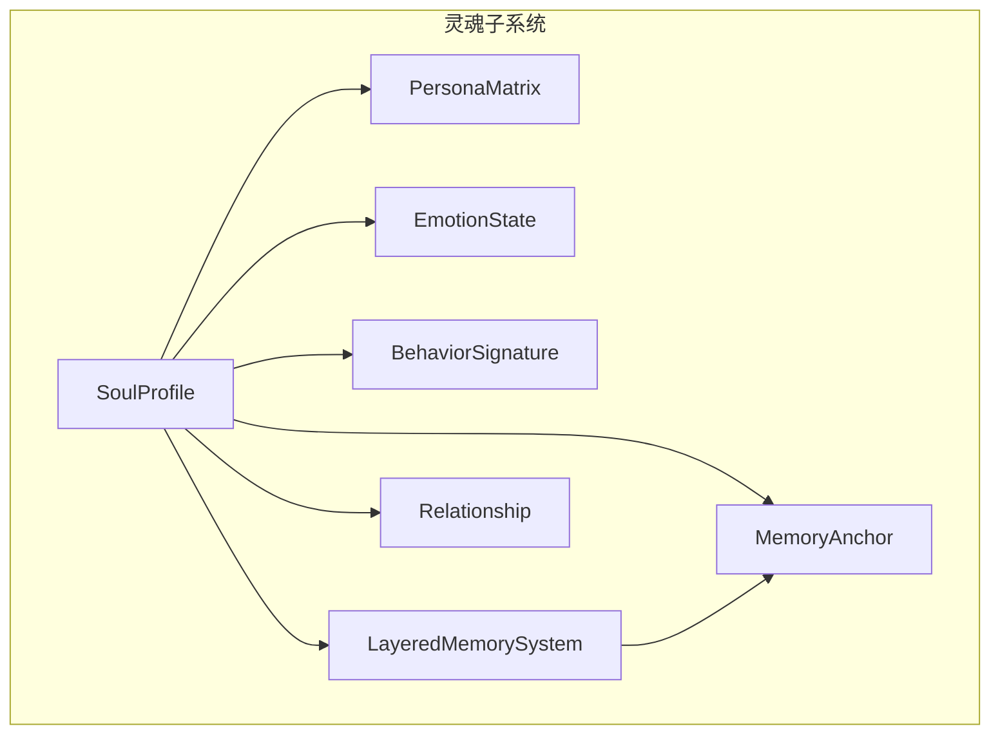
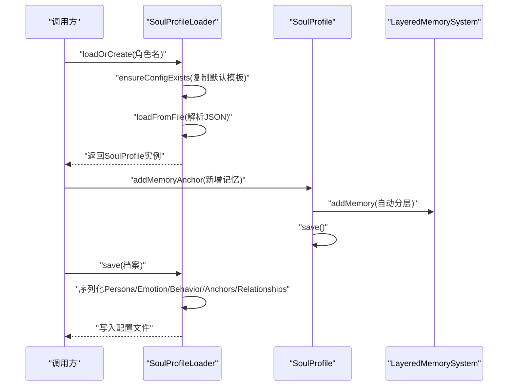
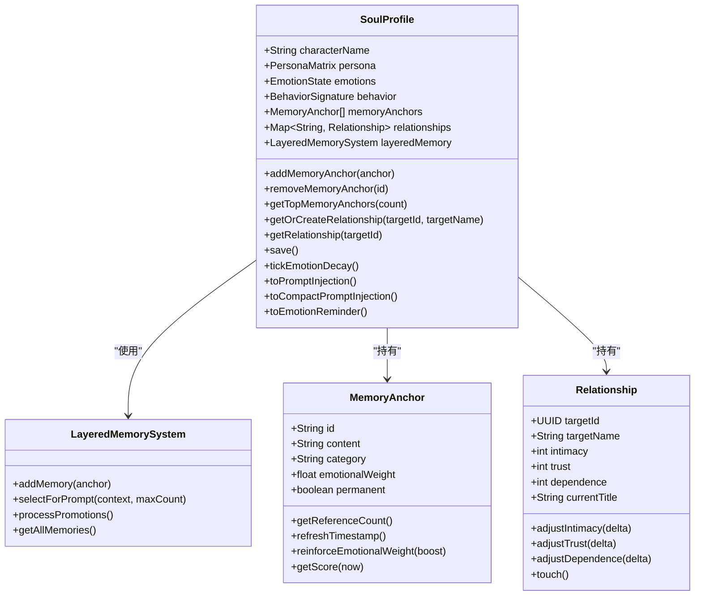
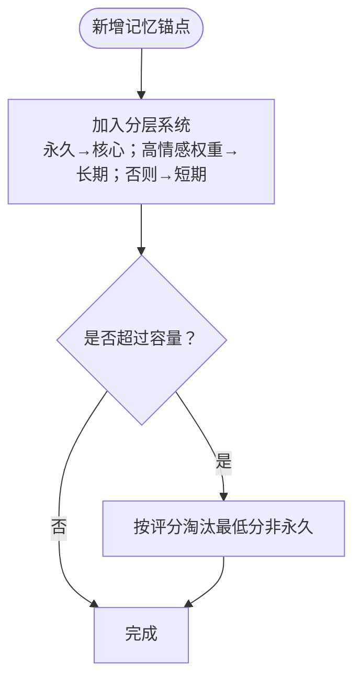
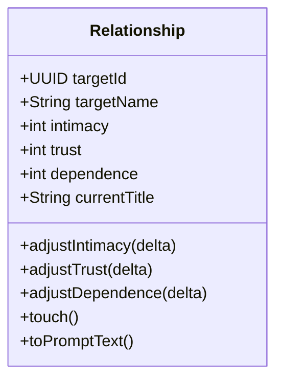
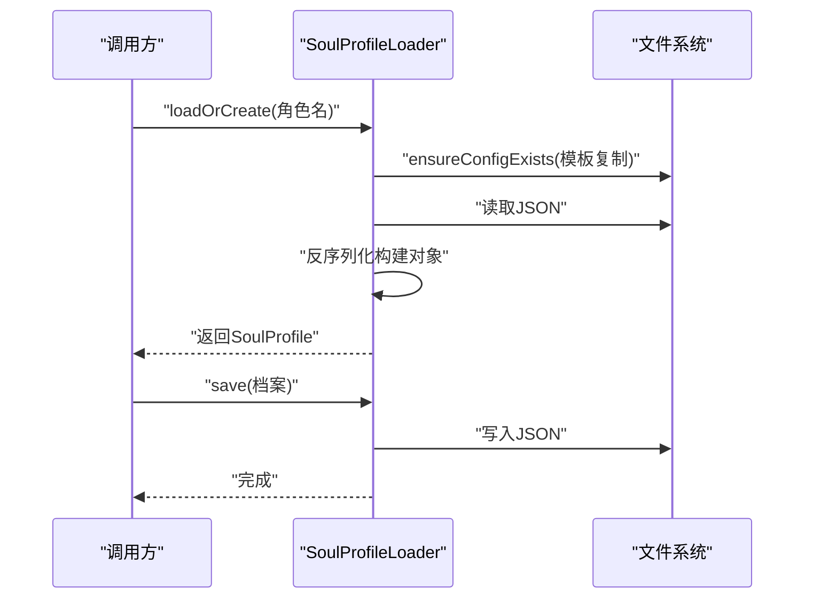
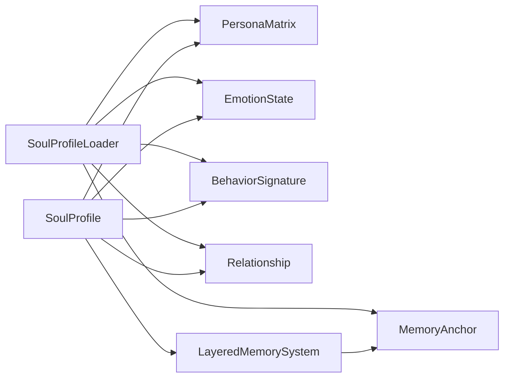

# 灵魂档案管理

<cite>
**本文档引用的文件**
- [SoulProfile.java](file://src/main/java/adris/altoclef/player2api/soul/SoulProfile.java)
- [MemoryAnchor.java](file://src/main/java/adris/altoclef/player2api/soul/MemoryAnchor.java)
- [Relationship.java](file://src/main/java/adris/altoclef/player2api/soul/Relationship.java)
- [SoulProfileLoader.java](file://src/main/java/adris/altoclef/player2api/soul/SoulProfileLoader.java)
- [PersonaMatrix.java](file://src/main/java/adris/altoclef/player2api/soul/PersonaMatrix.java)
- [EmotionState.java](file://src/main/java/adris/altoclef/player2api/soul/EmotionState.java)
- [BehaviorSignature.java](file://src/main/java/adris/altoclef/player2api/soul/BehaviorSignature.java)
- [LayeredMemorySystem.java](file://src/main/java/adris/altoclef/player2api/memory/LayeredMemorySystem.java)
</cite>

## 目录
1. [简介](#简介)
2. [项目结构](#项目结构)
3. [核心组件](#核心组件)
4. [架构总览](#架构总览)
5. [详细组件分析](#详细组件分析)
6. [依赖分析](#依赖分析)
7. [性能考虑](#性能考虑)
8. [故障排查指南](#故障排查指南)
9. [结论](#结论)
10. [附录](#附录)

## 简介
本文件面向“灵魂档案管理”功能，系统化阐述 SoulProfile 的设计理念、生命周期管理、内存锚点（MemoryAnchor）管理机制、关系图谱（Relationship）维护方式，并提供可直接定位到源码位置的示例路径，帮助开发者快速理解并正确使用该模块。

## 项目结构
围绕“灵魂档案”的核心代码位于以下包与类中：
- 灵魂档案核心：SoulProfile
- 记忆锚点：MemoryAnchor
- 关系图谱：Relationship
- 档案加载/保存：SoulProfileLoader
- 支撑模型：PersonaMatrix（大五人格）、EmotionState（八维情绪）、BehaviorSignature（行为倾向）
- 记忆分层系统：LayeredMemorySystem

图表来源
- [SoulProfile.java:15-64](file://src/main/java/adris/altoclef/player2api/soul/SoulProfile.java#L15-L64)
- [MemoryAnchor.java:8-48](file://src/main/java/adris/altoclef/player2api/soul/MemoryAnchor.java#L8-L48)
- [Relationship.java:8-21](file://src/main/java/adris/altoclef/player2api/soul/Relationship.java#L8-L21)
- [PersonaMatrix.java:10-25](file://src/main/java/adris/altoclef/player2api/soul/PersonaMatrix.java#L10-L25)
- [EmotionState.java:9-20](file://src/main/java/adris/altoclef/player2api/soul/EmotionState.java#L9-L20)
- [BehaviorSignature.java:10-25](file://src/main/java/adris/altoclef/player2api/soul/BehaviorSignature.java#L10-L25)
- [LayeredMemorySystem.java:10-26](file://src/main/java/adris/altoclef/player2api/memory/LayeredMemorySystem.java#L10-L26)

章节来源
- [SoulProfile.java:11-44](file://src/main/java/adris/altoclef/player2api/soul/SoulProfile.java#L11-L44)
- [SoulProfileLoader.java:25-57](file://src/main/java/adris/altoclef/player2api/soul/SoulProfileLoader.java#L25-L57)

## 核心组件
- 灵魂档案（SoulProfile）：聚合人格、情绪、行为、记忆锚点与关系图谱，负责对外暴露统一的 prompt 注入能力与持久化入口。
- 记忆锚点（MemoryAnchor）：独立于对话的历史记忆单元，具备情感权重、时效性评分、永久标记与引用计数。
- 关系图谱（Relationship）：记录 NPC 对特定目标（玩家/实体）的亲密度、信任度、依赖度与称谓。
- 记忆分层系统（LayeredMemorySystem）：按核心/长期/短期三层管理记忆，支持评分选择、晋升与淘汰。
- 模型支撑：PersonaMatrix（大五人格）、EmotionState（八维情绪）、BehaviorSignature（行为倾向）。

章节来源
- [SoulProfile.java:15-78](file://src/main/java/adris/altoclef/player2api/soul/SoulProfile.java#L15-L78)
- [MemoryAnchor.java:8-76](file://src/main/java/adris/altoclef/player2api/soul/MemoryAnchor.java#L8-L76)
- [Relationship.java:8-64](file://src/main/java/adris/altoclef/player2api/soul/Relationship.java#L8-L64)
- [LayeredMemorySystem.java:10-171](file://src/main/java/adris/altoclef/player2api/memory/LayeredMemorySystem.java#L10-L171)

## 架构总览
下图展示了“档案创建—加载—保存—销毁”的端到端流程，以及与分层记忆系统的交互。

图表来源
- [SoulProfileLoader.java:35-57](file://src/main/java/adris/altoclef/player2api/soul/SoulProfileLoader.java#L35-L57)
- [SoulProfileLoader.java:62-132](file://src/main/java/adris/altoclef/player2api/soul/SoulProfileLoader.java#L62-L132)
- [SoulProfile.java:82-90](file://src/main/java/adris/altoclef/player2api/soul/SoulProfile.java#L82-L90)
- [LayeredMemorySystem.java:30-38](file://src/main/java/adris/altoclef/player2api/memory/LayeredMemorySystem.java#L30-L38)

## 详细组件分析

### 灵魂档案（SoulProfile）设计与生命周期
- 设计理念
  - 聚合五大要素：PersonaMatrix、EmotionState、BehaviorSignature、MemoryAnchor 列表、Relationship 图谱。
  - 通过 LayeredMemorySystem 统一管理记忆的分层与选择。
  - 提供两类 prompt 注入：完整版（用于系统提示）与紧凑版（用于上下文压缩）。
- 构造函数与初始化
  - 重载构造函数支持从零构建或从外部参数构建；当未提供行为签名时，会依据人格矩阵推导默认值。
  - 初始化时记录最近一次情绪衰减时间，用于后续 tick 控制。
- 生命周期管理
  - 创建：通过 SoulProfileLoader.loadOrCreate 或直接构造。
  - 加载：SoulProfileLoader 从配置目录加载 JSON 并反序列化。
  - 保存：SoulProfile.save 调用 SoulProfileLoader.save 写入 JSON。
  - 销毁：Java GC 回收；若需主动清理，可调用 removeMemoryAnchor 清理锚点并触发分层淘汰。
- 数据结构与并发
  - 记忆锚点列表采用 CopyOnWriteArrayList，便于多线程遍历与安全写入。
  - 关系图谱采用 ConcurrentHashMap，保证高并发下的读写安全。
- 关键方法与职责
  - addMemoryAnchor/removeMemoryAnchor/getTopMemoryAnchors：锚点增删与评分排序。
  - getOrCreateRelationship/getRelationship：关系创建与查询。
  - save：持久化入口。
  - tickEmotionDecay：定时情绪衰减。
  - toPromptInjection/toCompactPromptInjection/toEmotionReminder：prompt 注入工具。

图表来源
- [SoulProfile.java:15-78](file://src/main/java/adris/altoclef/player2api/soul/SoulProfile.java#L15-L78)
- [LayeredMemorySystem.java:10-171](file://src/main/java/adris/altoclef/player2api/memory/LayeredMemorySystem.java#L10-L171)
- [MemoryAnchor.java:8-76](file://src/main/java/adris/altoclef/player2api/soul/MemoryAnchor.java#L8-L76)
- [Relationship.java:8-64](file://src/main/java/adris/altoclef/player2api/soul/Relationship.java#L8-L64)

章节来源
- [SoulProfile.java:37-64](file://src/main/java/adris/altoclef/player2api/soul/SoulProfile.java#L37-L64)
- [SoulProfile.java:82-141](file://src/main/java/adris/altoclef/player2api/soul/SoulProfile.java#L82-L141)
- [SoulProfile.java:148-224](file://src/main/java/adris/altoclef/player2api/soul/SoulProfile.java#L148-L224)

### 记忆锚点（MemoryAnchor）管理机制
- 结构与字段
  - 标识、内容、分类（事件/偏好/关系/创伤等）、情感权重、时间戳、是否永久、关联玩家、引用计数、最后使用时间。
- 评分与淘汰策略
  - 评分公式综合情感权重与时效性；永久锚点不受淘汰影响。
  - 分层系统在容量超限时按评分淘汰最低分的记忆。
- 引用晋升
  - 当引用计数达到阈值或情感权重足够高时，短期记忆晋升为长期记忆。
- 常用操作
  - 新增：addMemoryAnchor 自动分层。
  - 清理：removeMemoryAnchor 按 ID 移除；超过上限时自动清理旧锚点。
  - 查询：getTopMemoryAnchors 返回高分锚点；LayeredMemorySystem 支持按类别筛选与全量检索。

图表来源
- [LayeredMemorySystem.java:30-70](file://src/main/java/adris/altoclef/player2api/memory/LayeredMemorySystem.java#L30-L70)
- [MemoryAnchor.java:72-76](file://src/main/java/adris/altoclef/player2api/soul/MemoryAnchor.java#L72-L76)

章节来源
- [MemoryAnchor.java:19-48](file://src/main/java/adris/altoclef/player2api/soul/MemoryAnchor.java#L19-L48)
- [MemoryAnchor.java:72-76](file://src/main/java/adris/altoclef/player2api/soul/MemoryAnchor.java#L72-L76)
- [LayeredMemorySystem.java:75-96](file://src/main/java/adris/altoclef/player2api/memory/LayeredMemorySystem.java#L75-L96)

### 关系图谱（Relationship）维护方式
- 字段与范围
  - 目标 UUID、名称、亲密度/信任度/依赖度（-100~100）、当前称谓、最后互动时间。
- 动态调整
  - adjustIntimacy/adjustTrust/adjustDependence 变更对应维度并钳制范围。
  - touch 更新最后互动时间。
  - 根据亲密度动态更新称谓（如“挚友/好友/熟人/不信任/敌人”）。
- Prompt 输出
  - toPromptText 生成关系描述与行为指导，便于注入系统提示。

图表来源
- [Relationship.java:8-64](file://src/main/java/adris/altoclef/player2api/soul/Relationship.java#L8-L64)

章节来源
- [Relationship.java:17-44](file://src/main/java/adris/altoclef/player2api/soul/Relationship.java#L17-L44)
- [Relationship.java:46-68](file://src/main/java/adris/altoclef/player2api/soul/Relationship.java#L46-L68)

### 档案加载与保存（SoulProfileLoader）
- 加载流程
  - 确保配置文件存在（不存在则从资源模板复制）。
  - 解析 JSON，重建 PersonaMatrix、EmotionState、BehaviorSignature、MemoryAnchor 列表与 Relationship 映射。
  - 若失败则回退到默认中性人格。
- 保存流程
  - 序列化五大要素与全部锚点、关系，写入配置目录。
- 文件命名与安全
  - 使用 sanitizeFileName 过滤非法字符，确保跨平台兼容。

图表来源
- [SoulProfileLoader.java:35-57](file://src/main/java/adris/altoclef/player2api/soul/SoulProfileLoader.java#L35-L57)
- [SoulProfileLoader.java:134-220](file://src/main/java/adris/altoclef/player2api/soul/SoulProfileLoader.java#L134-L220)
- [SoulProfileLoader.java:62-132](file://src/main/java/adris/altoclef/player2api/soul/SoulProfileLoader.java#L62-L132)

章节来源
- [SoulProfileLoader.java:35-57](file://src/main/java/adris/altoclef/player2api/soul/SoulProfileLoader.java#L35-L57)
- [SoulProfileLoader.java:134-220](file://src/main/java/adris/altoclef/player2api/soul/SoulProfileLoader.java#L134-L220)
- [SoulProfileLoader.java:62-132](file://src/main/java/adris/altoclef/player2api/soul/SoulProfileLoader.java#L62-L132)

### 支撑模型（PersonaMatrix、EmotionState、BehaviorSignature）
- 人格矩阵（PersonaMatrix）
  - 五大人格维度（-100~+100），提供完整与紧凑两种 Prompt 文本输出。
- 情绪状态（EmotionState）
  - 八维基础情绪（joy、sadness、anger、fear、surprise、disgust、trust、anticipation），支持调整、衰减、主导情绪提取与 Prompt 输出。
- 行为签名（BehaviorSignature）
  - 由人格矩阵推导而来，包含主动性、风险承受、独立性、效率倾向与忠诚度。

章节来源
- [PersonaMatrix.java:19-47](file://src/main/java/adris/altoclef/player2api/soul/PersonaMatrix.java#L19-L47)
- [EmotionState.java:22-48](file://src/main/java/adris/altoclef/player2api/soul/EmotionState.java#L22-L48)
- [BehaviorSignature.java:30-43](file://src/main/java/adris/altoclef/player2api/soul/BehaviorSignature.java#L30-L43)

## 依赖分析
- 组件耦合
  - SoulProfile 依赖 PersonaMatrix、EmotionState、BehaviorSignature、LayeredMemorySystem、MemoryAnchor、Relationship。
  - LayeredMemorySystem 依赖 MemoryAnchor。
  - SoulProfileLoader 依赖 PersonaMatrix、EmotionState、BehaviorSignature、Relationship、MemoryAnchor。
- 并发与一致性
  - 多处使用 CopyOnWriteArrayList 与 ConcurrentHashMap，确保高并发场景下的读写安全。
- 循环依赖
  - 未发现循环依赖；SoulProfileLoader 作为 IO 层，不反向依赖业务对象。

图表来源
- [SoulProfileLoader.java:134-220](file://src/main/java/adris/altoclef/player2api/soul/SoulProfileLoader.java#L134-L220)
- [SoulProfile.java:15-78](file://src/main/java/adris/altoclef/player2api/soul/SoulProfile.java#L15-L78)
- [LayeredMemorySystem.java:10-26](file://src/main/java/adris/altoclef/player2api/memory/LayeredMemorySystem.java#L10-L26)

章节来源
- [SoulProfile.java:15-78](file://src/main/java/adris/altoclef/player2api/soul/SoulProfile.java#L15-L78)
- [SoulProfileLoader.java:134-220](file://src/main/java/adris/altoclef/player2api/soul/SoulProfileLoader.java#L134-L220)

## 性能考虑
- 记忆锚点评分与选择
  - 评分融合情感权重与时效性，避免过期低价值记忆占用空间。
  - 选择策略分层：核心全量、长期 Top-N、短期剩余，兼顾相关性与成本。
- 并发安全
  - 使用 CopyOnWriteArrayList 降低锁竞争；ConcurrentHashMap 提升关系查询吞吐。
- I/O 优化
  - 仅在必要时进行磁盘读写；批量序列化 JSON，避免频繁小文件写入。
- 建议
  - 控制记忆锚点总数与情感权重阈值，减少分层淘汰频率。
  - 在高频变更场景下，合并多次 adjust 操作后再持久化。
  - 使用紧凑版 prompt 注入以降低上下文开销。

## 故障排查指南
- 加载失败
  - 现象：无法从配置文件加载，回退到默认中性人格。
  - 排查：检查配置文件是否存在、JSON 格式是否正确、字段是否缺失。
  - 参考路径：[SoulProfileLoader.java:35-57](file://src/main/java/adris/altoclef/player2api/soul/SoulProfileLoader.java#L35-L57)
- 保存失败
  - 现象：保存日志报错。
  - 排查：确认配置目录可写、磁盘空间充足、文件未被其他进程占用。
  - 参考路径：[SoulProfileLoader.java:62-132](file://src/main/java/adris/altoclef/player2api/soul/SoulProfileLoader.java#L62-L132)
- 记忆未生效
  - 现象：新增锚点后未出现在 prompt 中。
  - 排查：确认 addMemoryAnchor 已调用且未超过上限；检查 LayeredMemorySystem 的 selectForPrompt 参数与最大数量。
  - 参考路径：[SoulProfile.java:82-90](file://src/main/java/adris/altoclef/player2api/soul/SoulProfile.java#L82-L90)、[LayeredMemorySystem.java:101-129](file://src/main/java/adris/altoclef/player2api/memory/LayeredMemorySystem.java#L101-L129)
- 情绪异常
  - 现象：情绪长时间不衰减或过度衰减。
  - 排查：确认 tickEmotionDecay 是否定期调用；检查衰减速率与时间间隔。
  - 参考路径：[SoulProfile.java:135-141](file://src/main/java/adris/altoclef/player2api/soul/SoulProfile.java#L135-L141)、[EmotionState.java:58-63](file://src/main/java/adris/altoclef/player2api/soul/EmotionState.java#L58-L63)

章节来源
- [SoulProfileLoader.java:35-57](file://src/main/java/adris/altoclef/player2api/soul/SoulProfileLoader.java#L35-L57)
- [SoulProfileLoader.java:62-132](file://src/main/java/adris/altoclef/player2api/soul/SoulProfileLoader.java#L62-L132)
- [SoulProfile.java:82-90](file://src/main/java/adris/altoclef/player2api/soul/SoulProfile.java#L82-L90)
- [LayeredMemorySystem.java:101-129](file://src/main/java/adris/altoclef/player2api/memory/LayeredMemorySystem.java#L101-L129)
- [EmotionState.java:58-63](file://src/main/java/adris/altoclef/player2api/soul/EmotionState.java#L58-L63)

## 结论
SoulProfile 通过“人格-情绪-行为-记忆-关系”的统一建模，实现了对 NPC 内在状态的可配置、可持久化表达。配合 LayeredMemorySystem 的分层与评分机制，既保证了 prompt 相关性，又控制了存储与计算成本。建议在实际使用中遵循“先查询/调整，再批量保存”的模式，并结合紧凑版 prompt 降低上下文压力。

## 附录

### 常见用法与示例（以源码路径代替具体代码）
- 创建新的灵魂档案
  - 从资源模板加载并创建：[SoulProfileLoader.java:35-57](file://src/main/java/adris/altoclef/player2api/soul/SoulProfileLoader.java#L35-L57)
  - 直接构造（指定人格矩阵）：[SoulProfile.java:37-44](file://src/main/java/adris/altoclef/player2api/soul/SoulProfile.java#L37-L44)
- 加载已存在的档案
  - 从配置目录加载 JSON 并反序列化：[SoulProfileLoader.java:134-220](file://src/main/java/adris/altoclef/player2api/soul/SoulProfileLoader.java#L134-L220)
- 修改档案属性
  - 调整情绪：[EmotionState.java:36-48](file://src/main/java/adris/altoclef/player2api/soul/EmotionState.java#L36-L48)
  - 增强记忆情感权重：[MemoryAnchor.java:64-66](file://src/main/java/adris/altoclef/player2api/soul/MemoryAnchor.java#L64-L66)
  - 调整关系亲密度/信任度/依赖度：[Relationship.java:32-35](file://src/main/java/adris/altoclef/player2api/soul/Relationship.java#L32-L35)
- 保存档案
  - 写入配置目录 JSON：[SoulProfileLoader.java:62-132](file://src/main/java/adris/altoclef/player2api/soul/SoulProfileLoader.java#L62-L132)