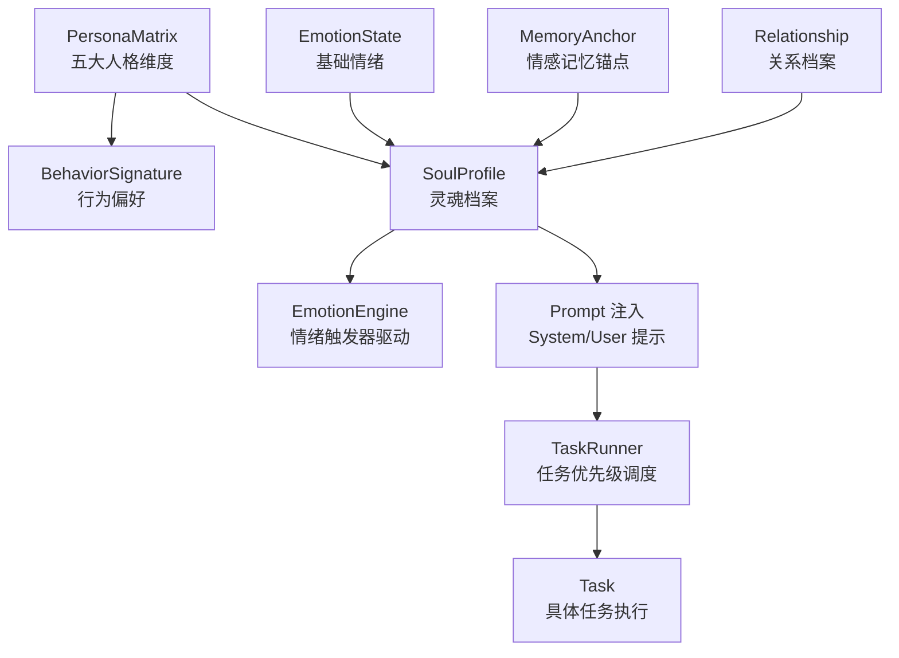
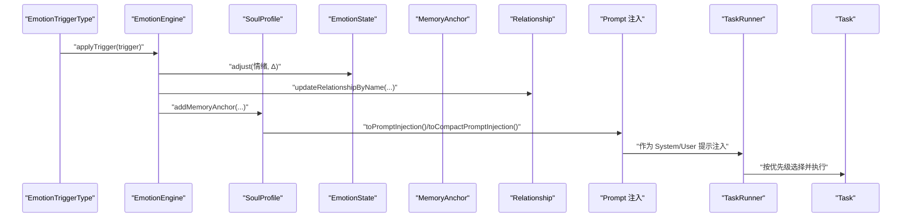
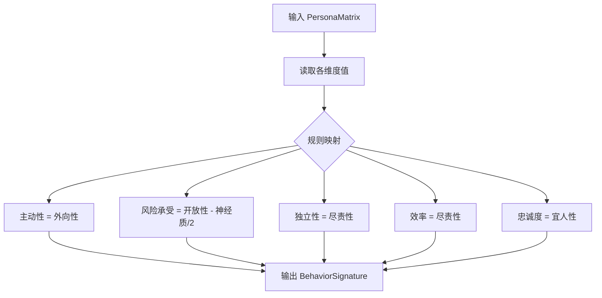
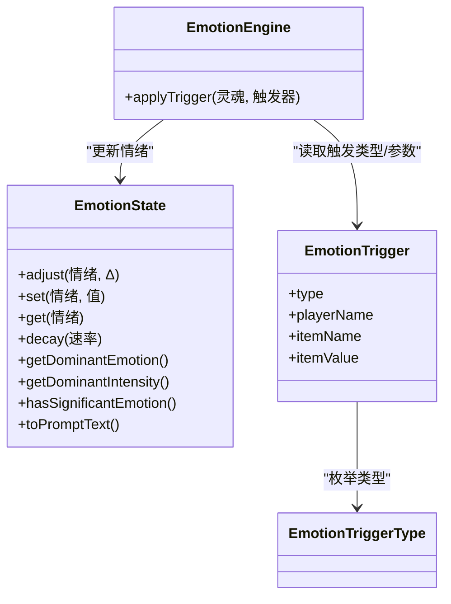
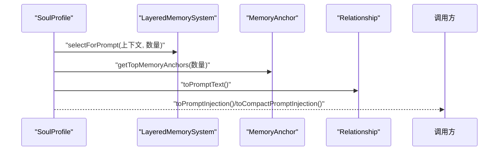
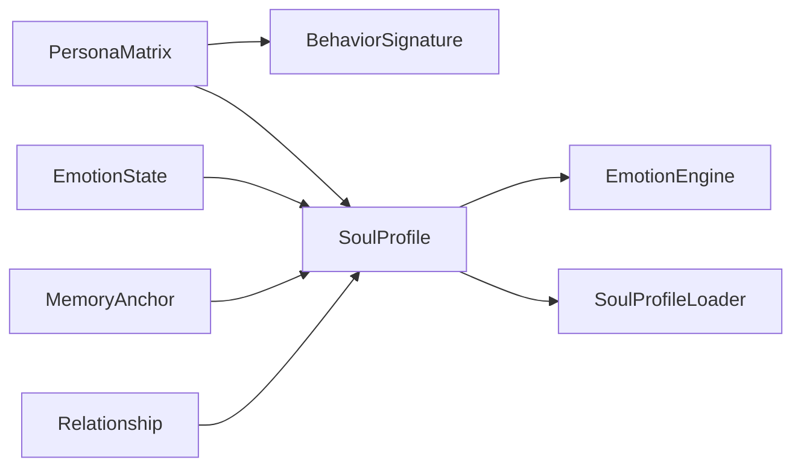

# 行为签名

<cite>
**本文引用的文件**
- [BehaviorSignature.java](file://src/main/java/adris/altoclef/player2api/soul/BehaviorSignature.java)
- [PersonaMatrix.java](file://src/main/java/adris/altoclef/player2api/soul/PersonaMatrix.java)
- [SoulProfile.java](file://src/main/java/adris/altoclef/player2api/soul/SoulProfile.java)
- [EmotionEngine.java](file://src/main/java/adris/altoclef/player2api/soul/EmotionEngine.java)
- [EmotionState.java](file://src/main/java/adris/altoclef/player2api/soul/EmotionState.java)
- [EmotionTrigger.java](file://src/main/java/adris/altoclef/player2api/soul/EmotionTrigger.java)
- [EmotionTriggerType.java](file://src/main/java/adris/altoclef/player2api/soul/EmotionTriggerType.java)
- [MemoryAnchor.java](file://src/main/java/adris/altoclef/player2api/soul/MemoryAnchor.java)
- [Relationship.java](file://src/main/java/adris/altoclef/player2api/soul/Relationship.java)
- [SoulProfileLoader.java](file://src/main/java/adris/altoclef/player2api/soul/SoulProfileLoader.java)
- [Task.java](file://src/main/java/adris/altoclef/tasksystem/Task.java)
- [TaskRunner.java](file://src/main/java/adris/altoclef/tasksystem/TaskRunner.java)
</cite>

## 目录
1. [引言](#引言)
2. [项目结构](#项目结构)
3. [核心组件](#核心组件)
4. [架构总览](#架构总览)
5. [详细组件分析](#详细组件分析)
6. [依赖分析](#依赖分析)
7. [性能考虑](#性能考虑)
8. [故障排查指南](#故障排查指南)
9. [结论](#结论)
10. [附录](#附录)

## 引言
本文件面向“行为签名系统”的技术文档，围绕 NPC 的行为偏好建模与应用展开，重点解释 BehaviorSignature 类的设计理念、从 PersonaMatrix 推导行为特征的规则、行为模式的分类与编码机制，以及行为签名在 NPC 行为控制中的作用。文档还涵盖行为签名的动态调整机制（基于情绪与记忆锚点）、在任务选择与行动优先级中的影响方式、以及优化与个性化定制的实践建议。

## 项目结构
行为签名系统位于 soul 子模块，围绕“人格矩阵（Big Five）→ 行为签名 → 情绪状态/记忆锚点/关系 → Prompt 注入 → 任务系统优先级”的闭环展开。核心文件如下：
- PersonaMatrix：五大人格维度的数值载体，范围 -100~+100
- BehaviorSignature：从 PersonaMatrix 推导出的 NPC 行为偏好，包含主动性、风险承受、独立性、效率、忠诚度五个维度
- EmotionState/EmotionEngine：基础情绪建模与触发器驱动的情绪变化
- MemoryAnchor：情感化的长期记忆锚点
- Relationship：与玩家/实体的关系档案
- SoulProfile：整合上述要素的灵魂核心容器，并负责 Prompt 注入
- SoulProfileLoader：持久化与加载
- Task/TaskRunner：任务系统与优先级调度，承载行为签名的应用落地

图表来源
- [PersonaMatrix.java:10-53](file://src/main/java/adris/altoclef/player2api/soul/PersonaMatrix.java#L10-L53)
- [BehaviorSignature.java:30-43](file://src/main/java/adris/altoclef/player2api/soul/BehaviorSignature.java#L30-L43)
- [SoulProfile.java:15-74](file://src/main/java/adris/altoclef/player2api/soul/SoulProfile.java#L15-L74)
- [EmotionEngine.java:17-171](file://src/main/java/adris/altoclef/player2api/soul/EmotionEngine.java#L17-L171)
- [TaskRunner.java:22-58](file://src/main/java/adris/altoclef/tasksystem/TaskRunner.java#L22-L58)
- [Task.java:17-50](file://src/main/java/adris/altoclef/tasksystem/Task.java#L17-L50)

章节来源
- [PersonaMatrix.java:10-118](file://src/main/java/adris/altoclef/player2api/soul/PersonaMatrix.java#L10-L118)
- [BehaviorSignature.java:10-123](file://src/main/java/adris/altoclef/player2api/soul/BehaviorSignature.java#L10-L123)
- [SoulProfile.java:15-225](file://src/main/java/adris/altoclef/player2api/soul/SoulProfile.java#L15-L225)
- [EmotionEngine.java:11-183](file://src/main/java/adris/altoclef/player2api/soul/EmotionEngine.java#L11-L183)
- [EmotionState.java:9-127](file://src/main/java/adris/altoclef/player2api/soul/EmotionState.java#L9-L127)
- [MemoryAnchor.java:8-82](file://src/main/java/adris/altoclef/player2api/soul/MemoryAnchor.java#L8-L82)
- [Relationship.java:8-69](file://src/main/java/adris/altoclef/player2api/soul/Relationship.java#L8-L69)
- [SoulProfileLoader.java:25-225](file://src/main/java/adris/altoclef/player2api/soul/SoulProfileLoader.java#L25-L225)
- [Task.java:8-180](file://src/main/java/adris/altoclef/tasksystem/Task.java#L8-L180)
- [TaskRunner.java:9-97](file://src/main/java/adris/altoclef/tasksystem/TaskRunner.java#L9-L97)

## 核心组件
- 人格矩阵（PersonaMatrix）
  - 五大人格维度：开放性、尽责性、外向性、宜人性、神经质
  - 数值范围：-100~+100；提供紧凑文本格式与提示文本生成
- 行为签名（BehaviorSignature）
  - 从 PersonaMatrix 推导而来：主动性=外向性；风险承受=开放性-神经质/2；独立性=尽责性；效率=尽责性；忠诚度=宜人性
  - 提供映射序列化、提示文本生成与取值访问
- 情绪状态（EmotionState）
  - 八种基础情绪：joy、sadness、anger、fear、surprise、disgust、trust、anticipation
  - 单次调整幅度限制，支持自然衰减与主导情绪提取
- 情绪引擎（EmotionEngine）
  - 基于 EmotionTriggerType 的事件驱动情绪更新，结合人格矩阵进行强度修正
- 记忆锚点（MemoryAnchor）
  - 情感权重×时效性评分，支持永久锚点与引用计数
- 关系档案（Relationship）
  - 亲密度、信任度、依赖度与称谓标题，随互动更新
- 灵魂档案（SoulProfile）
  - 组合上述要素，生成 Prompt 注入内容，支持紧凑注入与情绪提醒
- 加载器（SoulProfileLoader）
  - 支持从资源文件复制默认模板、JSON 持久化与加载

章节来源
- [PersonaMatrix.java:10-118](file://src/main/java/adris/altoclef/player2api/soul/PersonaMatrix.java#L10-L118)
- [BehaviorSignature.java:10-123](file://src/main/java/adris/altoclef/player2api/soul/BehaviorSignature.java#L10-L123)
- [EmotionState.java:9-127](file://src/main/java/adris/altoclef/player2api/soul/EmotionState.java#L9-L127)
- [EmotionEngine.java:11-183](file://src/main/java/adris/altoclef/player2api/soul/EmotionEngine.java#L11-L183)
- [MemoryAnchor.java:8-82](file://src/main/java/adris/altoclef/player2api/soul/MemoryAnchor.java#L8-L82)
- [Relationship.java:8-69](file://src/main/java/adris/altoclef/player2api/soul/Relationship.java#L8-L69)
- [SoulProfile.java:15-225](file://src/main/java/adris/altoclef/player2api/soul/SoulProfile.java#L15-L225)
- [SoulProfileLoader.java:25-225](file://src/main/java/adris/altoclef/player2api/soul/SoulProfileLoader.java#L25-L225)

## 架构总览
行为签名系统通过“人格矩阵”驱动“行为偏好”，并通过“情绪与记忆锚点”实现动态演化，最终以“Prompt 注入”的形式影响 LLM 的对话与决策，再由“任务系统优先级”将抽象偏好转化为具体行动。

图表来源
- [EmotionEngine.java:17-171](file://src/main/java/adris/altoclef/player2api/soul/EmotionEngine.java#L17-L171)
- [SoulProfile.java:148-211](file://src/main/java/adris/altoclef/player2api/soul/SoulProfile.java#L148-L211)
- [TaskRunner.java:22-58](file://src/main/java/adris/altoclef/tasksystem/TaskRunner.java#L22-L58)
- [Task.java:17-50](file://src/main/java/adris/altoclef/tasksystem/Task.java#L17-L50)

## 详细组件分析

### 行为签名（BehaviorSignature）设计与推导规则
- 设计理念
  - 以“五大人格维度”为输入，映射到“行为偏好维度”，形成可解释、可量化、可注入的 NPC 行为特征
  - 行为偏好范围统一为 -100~+100，便于与其他系统（如任务优先级）对接
- 推导规则（来自 PersonaMatrix）
  - 主动性 ← 外向性
  - 风险承受 ← 开放性 − 神经质/2
  - 独立性 ← 尽责性
  - 效率 ← 尽责性
  - 忠诚度 ← 宜人性
- 编码与序列化
  - 提供 fromMap/toMap，支持 JSON 持久化与加载
  - 提供 toPromptText，生成自然语言风格的行为倾向描述
- 取值与裁剪
  - clamp(-100..100)，保证数值稳定性

图表来源
- [BehaviorSignature.java:30-43](file://src/main/java/adris/altoclef/player2api/soul/BehaviorSignature.java#L30-L43)

章节来源
- [BehaviorSignature.java:10-123](file://src/main/java/adris/altoclef/player2api/soul/BehaviorSignature.java#L10-L123)
- [PersonaMatrix.java:10-53](file://src/main/java/adris/altoclef/player2api/soul/PersonaMatrix.java#L10-L53)

### 人格矩阵（PersonaMatrix）与 Prompt 文本
- 数据结构
  - 五大人格维度，范围 -100~+100
  - 提供紧凑文本格式（O/C/E/A/N）与完整提示文本
- Prompt 指导
  - 基于维度高低给出行为指导，便于注入 LLM

章节来源
- [PersonaMatrix.java:10-118](file://src/main/java/adris/altoclef/player2api/soul/PersonaMatrix.java#L10-L118)

### 情绪状态（EmotionState）与情绪引擎（EmotionEngine）
- 情绪状态
  - 八种基础情绪，初始均为 0.0，单次调整幅度限制 ±0.25，支持自然衰减
  - 提供主导情绪提取与显著情绪判断
- 情绪引擎
  - 基于 EmotionTriggerType 的事件驱动更新，结合人格矩阵进行强度修正
  - 更新关系档案（亲密度、信任度、依赖度），并记录创伤/关系类记忆锚点

图表来源
- [EmotionState.java:9-127](file://src/main/java/adris/altoclef/player2api/soul/EmotionState.java#L9-L127)
- [EmotionEngine.java:11-183](file://src/main/java/adris/altoclef/player2api/soul/EmotionEngine.java#L11-L183)
- [EmotionTrigger.java:6-19](file://src/main/java/adris/altoclef/player2api/soul/EmotionTrigger.java#L6-L19)
- [EmotionTriggerType.java:6-39](file://src/main/java/adris/altoclef/player2api/soul/EmotionTriggerType.java#L6-L39)

章节来源
- [EmotionState.java:9-127](file://src/main/java/adris/altoclef/player2api/soul/EmotionState.java#L9-L127)
- [EmotionEngine.java:11-183](file://src/main/java/adris/altoclef/player2api/soul/EmotionEngine.java#L11-L183)
- [EmotionTrigger.java:6-19](file://src/main/java/adris/altoclef/player2api/soul/EmotionTrigger.java#L6-L19)
- [EmotionTriggerType.java:6-39](file://src/main/java/adris/altoclef/player2api/soul/EmotionTriggerType.java#L6-L39)

### 记忆锚点（MemoryAnchor）与关系档案（Relationship）
- 记忆锚点
  - 情感权重 0.0~1.0，永久锚点与时效性（7 天）共同决定评分
  - 支持引用计数与最后使用时间，便于检索与清理
- 关系档案
  - 亲密度、信任度、依赖度三元组，动态更新并映射为称谓标题
  - 提供提示文本，指导对话与行为倾向

章节来源
- [MemoryAnchor.java:8-82](file://src/main/java/adris/altoclef/player2api/soul/MemoryAnchor.java#L8-L82)
- [Relationship.java:8-69](file://src/main/java/adris/altoclef/player2api/soul/Relationship.java#L8-L69)

### 灵魂档案（SoulProfile）与 Prompt 注入
- 组合能力
  - 聚合 PersonaMatrix、EmotionState、BehaviorSignature、MemoryAnchor、Relationship
  - 提供两类 Prompt 注入：完整版与紧凑版，用于不同上下文长度需求
- 记忆管理
  - 记忆锚点上限与清理策略，保留高分锚点
- 情绪衰减
  - 定时自然衰减，加速恢复

图表来源
- [SoulProfile.java:76-211](file://src/main/java/adris/altoclef/player2api/soul/SoulProfile.java#L76-L211)

章节来源
- [SoulProfile.java:15-225](file://src/main/java/adris/altoclef/player2api/soul/SoulProfile.java#L15-L225)

### 行为签名在 NPC 行为控制中的作用
- 任务选择与行动优先级
  - 行为偏好可作为任务优先级的权重因子：例如效率高的 NPC 更倾向于快速完成任务；忠诚度高的 NPC 更关注与玩家相关的任务
  - 主动性高的 NPC 更可能在空闲时发起探索或收集任务；风险承受低的 NPC 在危险区域任务上优先规避
- 社交策略
  - 独立性高的 NPC 更少请求确认；宜人性高的 NPC 更愿意合作与帮助
- Prompt 注入
  - 通过 toPromptInjection/toCompactPromptInjection 将行为倾向注入 LLM，影响对话语气与决策倾向

章节来源
- [BehaviorSignature.java:73-108](file://src/main/java/adris/altoclef/player2api/soul/BehaviorSignature.java#L73-L108)
- [SoulProfile.java:148-211](file://src/main/java/adris/altoclef/player2api/soul/SoulProfile.java#L148-L211)
- [TaskRunner.java:22-58](file://src/main/java/adris/altoclef/tasksystem/TaskRunner.java#L22-L58)
- [Task.java:17-50](file://src/main/java/adris/altoclef/tasksystem/Task.java#L17-L50)

### 行为签名的动态调整机制
- 情绪驱动
  - EmotionEngine 基于事件类型更新情绪，进而影响对话与行为倾向
- 记忆锚点强化
  - Trauma/Relationship 类锚点增强情感权重，提升后续 Prompt 中的影响力
- 关系演化
  - 互动事件改变亲密度、信任度与依赖度，间接影响行为偏好表达

章节来源
- [EmotionEngine.java:17-171](file://src/main/java/adris/altoclef/player2api/soul/EmotionEngine.java#L17-L171)
- [MemoryAnchor.java:64-76](file://src/main/java/adris/altoclef/player2api/soul/MemoryAnchor.java#L64-L76)
- [Relationship.java:32-44](file://src/main/java/adris/altoclef/player2api/soul/Relationship.java#L32-L44)

### 代码示例路径（不直接展示代码内容）
- 生成行为签名
  - [deriveFromPersona:30-43](file://src/main/java/adris/altoclef/player2api/soul/BehaviorSignature.java#L30-L43)
- 应用行为特征到任务执行
  - [toPromptInjection:148-174](file://src/main/java/adris/altoclef/player2api/soul/SoulProfile.java#L148-L174)
  - [toCompactPromptInjection:180-211](file://src/main/java/adris/altoclef/player2api/soul/SoulProfile.java#L180-L211)
  - [TaskRunner 优先级调度:22-58](file://src/main/java/adris/altoclef/tasksystem/TaskRunner.java#L22-L58)
- 评估行为一致性
  - [EmotionState.toPromptText:92-122](file://src/main/java/adris/altoclef/player2api/soul/EmotionState.java#L92-L122)
  - [SoulProfile.toEmotionReminder:216-224](file://src/main/java/adris/altoclef/player2api/soul/SoulProfile.java#L216-L224)

## 依赖分析
- 组件耦合
  - BehaviorSignature 仅依赖 PersonaMatrix，低耦合，易于扩展
  - EmotionEngine 依赖 EmotionState、Relationship、MemoryAnchor，形成情绪-记忆-关系闭环
  - SoulProfile 聚合多组件，承担“提示注入”职责，是系统的关键枢纽
- 外部依赖
  - JSON 序列化（Gson）用于持久化
  - 日志框架（Log4j）用于调试与监控

图表来源
- [SoulProfileLoader.java:62-132](file://src/main/java/adris/altoclef/player2api/soul/SoulProfileLoader.java#L62-L132)
- [SoulProfile.java:15-74](file://src/main/java/adris/altoclef/player2api/soul/SoulProfile.java#L15-L74)

章节来源
- [SoulProfileLoader.java:25-225](file://src/main/java/adris/altoclef/player2api/soul/SoulProfileLoader.java#L25-L225)
- [SoulProfile.java:15-225](file://src/main/java/adris/altoclef/player2api/soul/SoulProfile.java#L15-L225)

## 性能考虑
- 数值裁剪与幅度限制
  - clamp(-100..100) 与单次调整幅度限制 ±0.25，避免极端波动
- 记忆锚点清理
  - 限制最大锚点数量并按评分清理，降低检索与注入成本
- Prompt 压缩
  - 紧凑版注入（~150 tokens）与完整版（~350-700 tokens）双轨，按上下文长度选择
- 任务调度
  - TaskRunner 按优先级选择主链，减少无效切换开销

## 故障排查指南
- 行为签名异常
  - 检查 PersonaMatrix 是否越界或为空，默认回退至中性人格
  - 参考：[PersonaMatrix.clamp:116-118](file://src/main/java/adris/altoclef/player2api/soul/PersonaMatrix.java#L116-L118)
- 情绪持续高涨或低迷
  - 检查情绪衰减周期与强度，确认事件触发是否过度
  - 参考：[EmotionState.decay:58-63](file://src/main/java/adris/altoclef/player2api/soul/EmotionState.java#L58-L63)
- 记忆锚点过多或过旧
  - 检查清理逻辑与评分公式，确保高分锚点优先保留
  - 参考：[SoulProfile.cleanupOldAnchors:96-106](file://src/main/java/adris/altoclef/player2api/soul/SoulProfile.java#L96-L106)
- Prompt 注入缺失或过长
  - 切换紧凑版注入，或减少记忆锚点数量
  - 参考：[SoulProfile.toCompactPromptInjection:180-211](file://src/main/java/adris/altoclef/player2api/soul/SoulProfile.java#L180-L211)

章节来源
- [PersonaMatrix.java:116-118](file://src/main/java/adris/altoclef/player2api/soul/PersonaMatrix.java#L116-L118)
- [EmotionState.java:58-63](file://src/main/java/adris/altoclef/player2api/soul/EmotionState.java#L58-L63)
- [SoulProfile.java:96-106](file://src/main/java/adris/altoclef/player2api/soul/SoulProfile.java#L96-L106)
- [SoulProfile.java:180-211](file://src/main/java/adris/altoclef/player2api/soul/SoulProfile.java#L180-L211)

## 结论
行为签名系统以“五大人格维度”为根，通过可解释的推导规则生成 NPC 的行为偏好，并借助情绪、记忆与关系实现动态演化。通过 Prompt 注入与任务优先级调度，行为偏好得以在对话与行动层面落地。该体系具备良好的可扩展性与可维护性，适合进一步引入更复杂的社交与学习机制。

## 附录
- 个性化定制建议
  - 通过调整 PersonaMatrix 的五维取值，微调行为偏好
  - 使用 MemoryAnchor 记录关键事件，强化特定行为倾向
  - 结合 EmotionEngine 的事件类型，设计针对性的情绪触发策略
- 优化要点
  - 控制 Prompt 长度，必要时采用紧凑版注入
  - 合理设置记忆锚点上限与清理策略
  - 在任务系统中将行为偏好作为优先级权重因子，而非硬约束