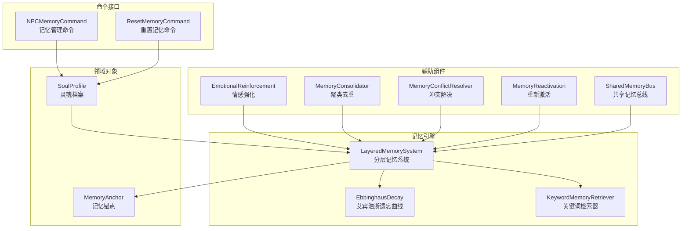
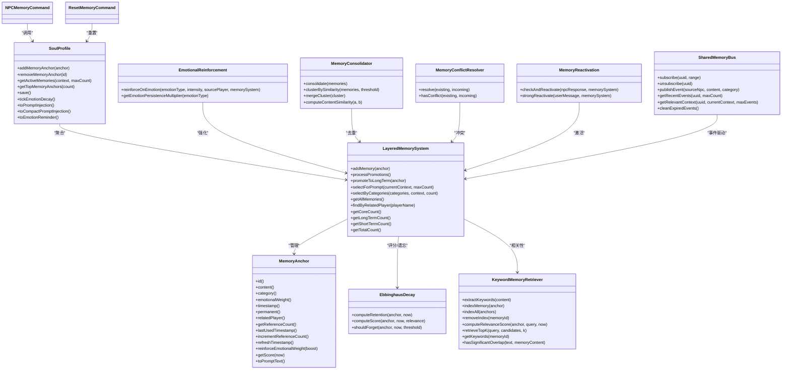
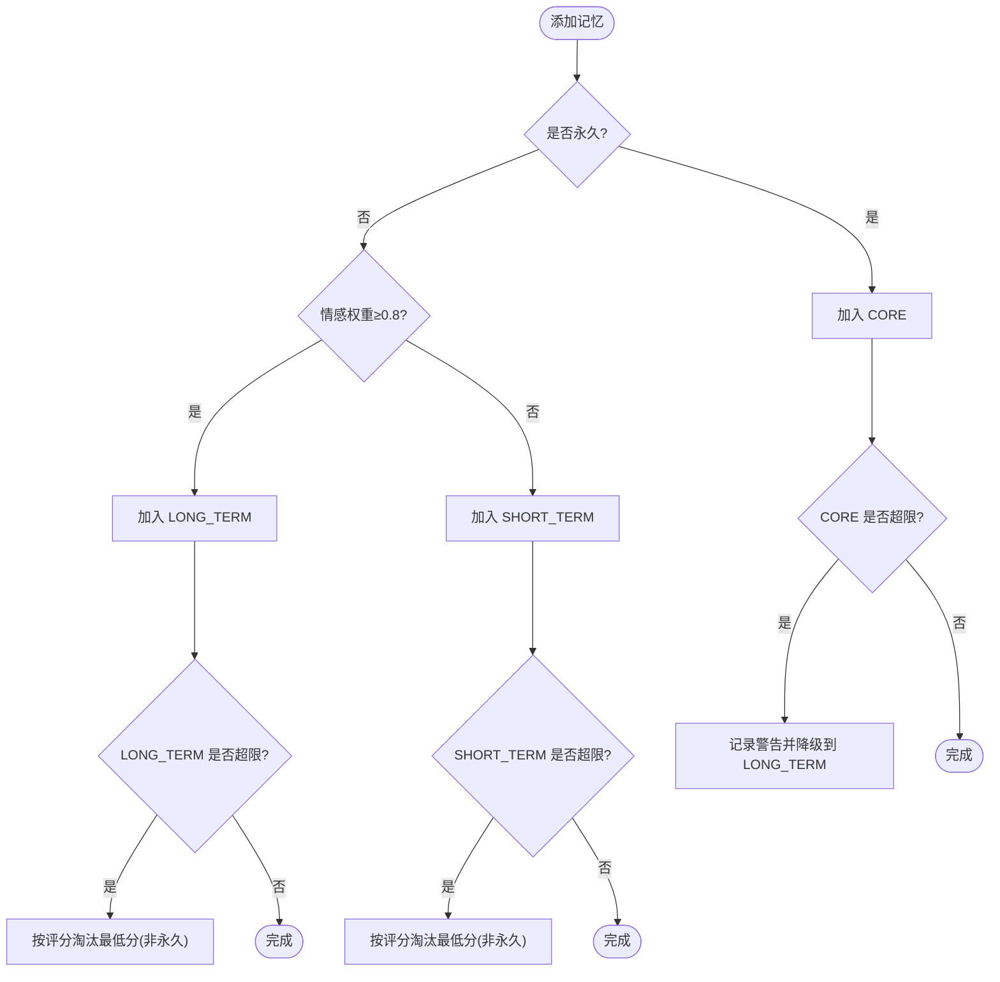
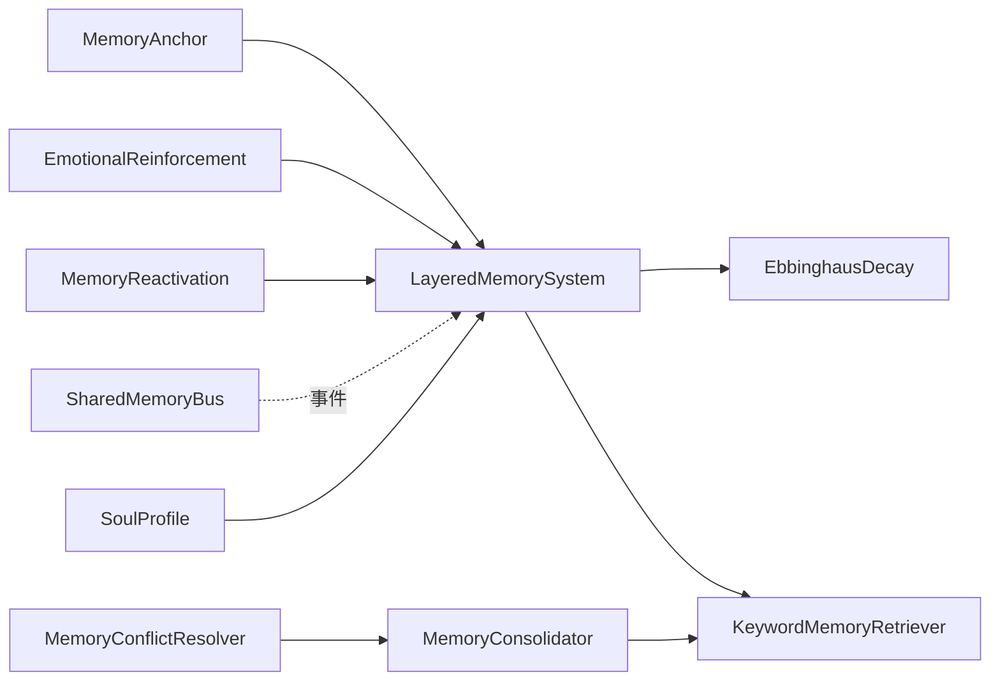

# 记忆锚点系统

<cite>
**本文档引用的文件**
- [MemoryAnchor.java](file://src/main/java/adris/altoclef/player2api/soul/MemoryAnchor.java)
- [LayeredMemorySystem.java](file://src/main/java/adris/altoclef/player2api/memory/LayeredMemorySystem.java)
- [EbbinghausDecay.java](file://src/main/java/adris/altoclef/player2api/memory/EbbinghausDecay.java)
- [EmotionalReinforcement.java](file://src/main/java/adris/altoclef/player2api/memory/EmotionalReinforcement.java)
- [KeywordMemoryRetriever.java](file://src/main/java/adris/altoclef/player2api/memory/KeywordMemoryRetriever.java)
- [MemoryConsolidator.java](file://src/main/java/adris/altoclef/player2api/memory/MemoryConsolidator.java)
- [MemoryConflictResolver.java](file://src/main/java/adris/altoclef/player2api/memory/MemoryConflictResolver.java)
- [MemoryReactivation.java](file://src/main/java/adris/altoclef/player2api/memory/MemoryReactivation.java)
- [SharedMemoryBus.java](file://src/main/java/adris/altoclef/player2api/memory/SharedMemoryBus.java)
- [SoulProfile.java](file://src/main/java/adris/altoclef/player2api/soul/SoulProfile.java)
- [AIPersistantData.java](file://src/main/java/adris/altoclef/player2api/AIPersistantData.java)
- [NPCMemoryCommand.java](file://src/main/java/adris/altoclef/commands/NPCMemoryCommand.java)
- [ResetMemoryCommand.java](file://src/main/java/adris/altoclef/commands/ResetMemoryCommand.java)
</cite>

## 目录
1. [简介](#简介)
2. [项目结构](#项目结构)
3. [核心组件](#核心组件)
4. [架构总览](#架构总览)
5. [详细组件分析](#详细组件分析)
6. [依赖关系分析](#依赖关系分析)
7. [性能考量](#性能考量)
8. [故障排查指南](#故障排查指南)
9. [结论](#结论)
10. [附录](#附录)

## 简介
本技术文档围绕记忆锚点系统展开，重点解释 MemoryAnchor 类的设计目的与实现机制，涵盖记忆内容存储、评分算法、时效性管理等；阐述分层记忆系统（LayeredMemorySystem）的架构设计，包括不同记忆层次的组织方式、记忆检索策略、上下文相关性计算；说明记忆锚点的生命周期管理（创建条件、评分更新、自动清理）；解析记忆锚点对 NPC 行为的影响及如何通过重要记忆引导决策与对话内容；提供可操作的代码示例路径，展示如何创建记忆锚点、查询相关记忆、优化检索效率；并总结记忆系统性能优化与容量管理的最佳实践。

## 项目结构
记忆锚点系统位于模块 player2api 下，采用“领域对象 + 记忆引擎 + 辅助组件”的分层组织方式：
- 领域对象：MemoryAnchor（记忆锚点）、SoulProfile（灵魂档案）
- 记忆引擎：LayeredMemorySystem（分层记忆系统）、EbbinghausDecay（艾宾浩斯遗忘曲线）、KeywordMemoryRetriever（关键词检索器）
- 辅助组件：EmotionalReinforcement（情感强化）、MemoryConsolidator（记忆聚类去重）、MemoryConflictResolver（冲突检测与解决）、MemoryReactivation（记忆重新激活）、SharedMemoryBus（NPC间共享记忆总线）
- 命令接口：NPCMemoryCommand（调试与管理记忆）、ResetMemoryCommand（重置记忆）

图表来源
- [SoulProfile.java:15-74](file://src/main/java/adris/altoclef/player2api/soul/SoulProfile.java#L15-L74)
- [LayeredMemorySystem.java:10-26](file://src/main/java/adris/altoclef/player2api/memory/LayeredMemorySystem.java#L10-L26)
- [EbbinghausDecay.java:9-42](file://src/main/java/adris/altoclef/player2api/memory/EbbinghausDecay.java#L9-L42)
- [KeywordMemoryRetriever.java:11-52](file://src/main/java/adris/altoclef/player2api/memory/KeywordMemoryRetriever.java#L11-L52)
- [EmotionalReinforcement.java:11-42](file://src/main/java/adris/altoclef/player2api/memory/EmotionalReinforcement.java#L11-L42)
- [MemoryConsolidator.java:12-44](file://src/main/java/adris/altoclef/player2api/memory/MemoryConsolidator.java#L12-L44)
- [MemoryConflictResolver.java:10-64](file://src/main/java/adris/altoclef/player2api/memory/MemoryConflictResolver.java#L10-L64)
- [MemoryReactivation.java:11-36](file://src/main/java/adris/altoclef/player2api/memory/MemoryReactivation.java#L11-L36)
- [SharedMemoryBus.java:17-33](file://src/main/java/adris/altoclef/player2api/memory/SharedMemoryBus.java#L17-L33)
- [NPCMemoryCommand.java:16-99](file://src/main/java/adris/altoclef/commands/NPCMemoryCommand.java#L16-L99)
- [ResetMemoryCommand.java:8-18](file://src/main/java/adris/altoclef/commands/ResetMemoryCommand.java#L8-L18)

章节来源
- [SoulProfile.java:15-74](file://src/main/java/adris/altoclef/player2api/soul/SoulProfile.java#L15-L74)
- [LayeredMemorySystem.java:10-26](file://src/main/java/adris/altoclef/player2api/memory/LayeredMemorySystem.java#L10-L26)

## 核心组件
- MemoryAnchor：独立于对话历史的永久性情感记忆单元，包含内容、类别、情感权重、时间戳、是否永久、关联玩家、引用计数、最后使用时间等字段，提供评分计算、情感强化、时间刷新等方法。
- LayeredMemorySystem：三层记忆管理（核心/长期/短期），负责自动分层、容量控制、晋升/淘汰、按上下文选择记忆、按类别筛选、按玩家关联查询等。
- EbbinghausDecay：实现艾宾浩斯遗忘曲线，提供记忆保持率计算、综合评分计算、遗忘阈值判断等。
- KeywordMemoryRetriever：基于关键词的轻量检索器，支持中文分词、英文停用词过滤、关键词重叠度计算、综合相关性评分、Top-K检索。
- EmotionalReinforcement：在强烈情绪事件下强化与触发玩家相关的记忆，提升情感权重并刷新时间戳。
- MemoryConsolidator：按类别分组，基于关键词重叠进行聚类合并，减少冗余。
- MemoryConflictResolver：检测相似但冲突的记忆，按策略（新者胜/高情感优先/合并/版本化）解决。
- MemoryReactivation：在 NPC 回复或用户主动提及中重新激活记忆，提升引用计数与情感权重，必要时晋升。
- SharedMemoryBus：NPC 间共享事件总线，支持订阅、发布、过期清理、最近事件查询与上下文格式化。
- SoulProfile：NPC 灵魂核心，聚合记忆锚点与分层记忆系统，提供持久化、Top-N 记忆注入、情绪自然衰减、紧凑提示注入等。
- 命令接口：NPCMemoryCommand 提供添加/列出/删除/清空记忆锚点的命令；ResetMemoryCommand 重置记忆。

章节来源
- [MemoryAnchor.java:8-83](file://src/main/java/adris/altoclef/player2api/soul/MemoryAnchor.java#L8-L83)
- [LayeredMemorySystem.java:10-172](file://src/main/java/adris/altoclef/player2api/memory/LayeredMemorySystem.java#L10-L172)
- [EbbinghausDecay.java:9-66](file://src/main/java/adris/altoclef/player2api/memory/EbbinghausDecay.java#L9-L66)
- [KeywordMemoryRetriever.java:11-142](file://src/main/java/adris/altoclef/player2api/memory/KeywordMemoryRetriever.java#L11-L142)
- [EmotionalReinforcement.java:11-59](file://src/main/java/adris/altoclef/player2api/memory/EmotionalReinforcement.java#L11-L59)
- [MemoryConsolidator.java:12-119](file://src/main/java/adris/altoclef/player2api/memory/MemoryConsolidator.java#L12-L119)
- [MemoryConflictResolver.java:10-78](file://src/main/java/adris/altoclef/player2api/memory/MemoryConflictResolver.java#L10-L78)
- [MemoryReactivation.java:11-62](file://src/main/java/adris/altoclef/player2api/memory/MemoryReactivation.java#L11-L62)
- [SharedMemoryBus.java:17-198](file://src/main/java/adris/altoclef/player2api/memory/SharedMemoryBus.java#L17-L198)
- [SoulProfile.java:15-226](file://src/main/java/adris/altoclef/player2api/soul/SoulProfile.java#L15-L226)
- [NPCMemoryCommand.java:16-107](file://src/main/java/adris/altoclef/commands/NPCMemoryCommand.java#L16-L107)
- [ResetMemoryCommand.java:8-19](file://src/main/java/adris/altoclef/commands/ResetMemoryCommand.java#L8-L19)

## 架构总览
记忆锚点系统以 MemoryAnchor 为核心数据实体，SoulProfile 作为 NPC 的灵魂容器聚合记忆与分层系统；LayeredMemorySystem 实现三层记忆的自动分层、容量控制与检索策略；EbbinghausDecay 提供真实遗忘模型；KeywordMemoryRetriever 提供快速关键词检索；EmotionalReinforcement/MemoryReactivation/MemoryConsolidator/MemoryConflictResolver 形成记忆的动态强化、重新激活、去重与冲突解决闭环；SharedMemoryBus 提供 NPC 间的事件共享与上下文注入；命令接口用于调试与管理。

图表来源
- [MemoryAnchor.java:8-83](file://src/main/java/adris/altoclef/player2api/soul/MemoryAnchor.java#L8-L83)
- [LayeredMemorySystem.java:10-172](file://src/main/java/adris/altoclef/player2api/memory/LayeredMemorySystem.java#L10-L172)
- [EbbinghausDecay.java:9-66](file://src/main/java/adris/altoclef/player2api/memory/EbbinghausDecay.java#L9-L66)
- [KeywordMemoryRetriever.java:11-142](file://src/main/java/adris/altoclef/player2api/memory/KeywordMemoryRetriever.java#L11-L142)
- [EmotionalReinforcement.java:11-59](file://src/main/java/adris/altoclef/player2api/memory/EmotionalReinforcement.java#L11-L59)
- [MemoryConsolidator.java:12-119](file://src/main/java/adris/altoclef/player2api/memory/MemoryConsolidator.java#L12-L119)
- [MemoryConflictResolver.java:10-78](file://src/main/java/adris/altoclef/player2api/memory/MemoryConflictResolver.java#L10-L78)
- [MemoryReactivation.java:11-62](file://src/main/java/adris/altoclef/player2api/memory/MemoryReactivation.java#L11-L62)
- [SharedMemoryBus.java:17-198](file://src/main/java/adris/altoclef/player2api/memory/SharedMemoryBus.java#L17-L198)
- [SoulProfile.java:15-226](file://src/main/java/adris/altoclef/player2api/soul/SoulProfile.java#L15-L226)
- [NPCMemoryCommand.java:16-107](file://src/main/java/adris/altoclef/commands/NPCMemoryCommand.java#L16-L107)
- [ResetMemoryCommand.java:8-19](file://src/main/java/adris/altoclef/commands/ResetMemoryCommand.java#L8-L19)

## 详细组件分析

### MemoryAnchor 设计与实现
- 设计目的：作为独立于对话历史的永久性情感记忆单元，承载事件、偏好、关系、创伤等类别信息，支持情感权重、时间戳、引用计数等属性，为 NPC 决策与对话提供稳定依据。
- 核心字段与方法：
  - 标识与内容：id、content、category、relatedPlayer
  - 情感与时间：emotionalWeight、timestamp、permanent、lastUsedTimestamp
  - 引用与使用：referenceCount、incrementReferenceCount、refreshTimestamp
  - 评分与输出：getScore(now)、toPromptText()
- 评分算法（旧版）：情感权重占比 0.6，时效性占比 0.4，7 天内线性衰减至 0。
- 生命周期：创建即初始化时间戳与引用计数；使用时刷新时间戳；晋升/强化时提升情感权重；永久记忆不受遗忘影响。

章节来源
- [MemoryAnchor.java:8-83](file://src/main/java/adris/altoclef/player2api/soul/MemoryAnchor.java#L8-L83)

### 分层记忆系统（LayeredMemorySystem）
- 层次定义：
  - CORE（核心）：容量上限 5，存放永久记忆，满载不替换，避免丢失关键锚点。
  - LONG_TERM（长期）：容量上限 30，存放高情感权重记忆，按评分淘汰低分项。
  - SHORT_TERM（短期）：容量上限 50，存放普通记忆，按评分淘汰低分项。
- 自动分层策略：permanent → CORE；情感权重 ≥ 0.8 → LONG_TERM；否则 → SHORT_TERM。
- 晋升机制：短期中被多次引用（≥3）或情感权重 ≥ 0.7 的记忆晋升为长期。
- 淘汰策略：按 getScore(now) 升序淘汰最低分的记忆（永久记忆不淘汰）。
- 检索策略：
  - selectForPrompt：先注入全部 CORE，再按评分取 LONG_TERM 上限 3 的 Top-N，最后按评分取 SHORT_TERM 剩余部分。
  - selectByCategories：按类别筛选并按评分排序取前 N。
  - findByRelatedPlayer：按关联玩家过滤。
- 统计接口：提供各层数量与总数统计。

图表来源
- [LayeredMemorySystem.java:30-70](file://src/main/java/adris/altoclef/player2api/memory/LayeredMemorySystem.java#L30-L70)

章节来源
- [LayeredMemorySystem.java:10-172](file://src/main/java/adris/altoclef/player2api/memory/LayeredMemorySystem.java#L10-L172)

### 艾宾浩斯遗忘曲线（EbbinghausDecay）
- 保持率模型：R = e^(-t/S)，其中 t 为天数，S 为基础强度 1.0 + 情感权重 × 3.0 + 引用次数 × 0.5。
- 综合评分：score = retention × 0.5 + emotionalWeight × 0.3 + relevance × 0.2。
- 遗忘阈值：默认 2%，低于阈值视为遗忘。
- 与 MemoryAnchor 的集成：提供 computeRetention/computeScore/shouldForget 等静态方法，供评分与淘汰逻辑使用。

章节来源
- [EbbinghausDecay.java:9-66](file://src/main/java/adris/altoclef/player2api/memory/EbbinghausDecay.java#L9-L66)

### 关键词检索器（KeywordMemoryRetriever）
- 关键词提取：
  - 中文：按中文标点分段，取长度 2-8 的片段。
  - 英文：转小写、去除非字母数字、剔除停用词，取长度 ≥ 3 的词。
- 相关性评分：semanticScore × 0.4 + emotionScore × 0.3 + recencyScore × 0.3。
- Top-K 检索：按综合评分降序取前 K。
- 索引维护：支持批量索引、移除索引、查询关键词集合。

章节来源
- [KeywordMemoryRetriever.java:11-142](file://src/main/java/adris/altoclef/player2api/memory/KeywordMemoryRetriever.java#L11-L142)

### 情感强化（EmotionalReinforcement）
- 强化条件：情绪强度 > 0.7 且情绪类型有效。
- 强化倍率：不同情绪类型对应不同持久化倍率（如 fear/surprise 2.0，joy/trust 1.5 等）。
- 强化范围：查找与触发玩家相关的记忆，提升情感权重并刷新时间戳。
- 日志记录：记录强化的条目数量与强度。

章节来源
- [EmotionalReinforcement.java:11-59](file://src/main/java/adris/altoclef/player2api/memory/EmotionalReinforcement.java#L11-L59)

### 记忆聚类与去重（MemoryConsolidator）
- 聚类策略：按类别分组，基于关键词重叠度（Jaccard）进行邻接聚类，阈值 0.7。
- 合并规则：选择最长内容作为代表，情感权重取最大值并叠加 boost，引用次数求和，永久性只要任一为真。
- 性能：适合周期性批量处理，降低冗余记忆数量。

章节来源
- [MemoryConsolidator.java:12-119](file://src/main/java/adris/altoclef/player2api/memory/MemoryConsolidator.java#L12-L119)

### 冲突检测与解决（MemoryConflictResolver）
- 冲突判定：相同类别且内容相似度 ≥ 0.5。
- 解决策略：
  - incoming 情感权重明显更高（> +0.2）：新者胜。
  - 否则：合并（新内容、最高情感权重、时间戳取新、永久性或运算、引用计数相加、关联玩家优先非空）。
- 日志记录：记录冲突检测与解决过程。

章节来源
- [MemoryConflictResolver.java:10-78](file://src/main/java/adris/altoclef/player2api/memory/MemoryConflictResolver.java#L10-L78)

### 记忆重新激活（MemoryReactivation）
- 间接激活：在 NPC 回复中若出现记忆关键词（≥2 个），提升引用计数与时间戳。
- 主动强激活：用户消息与记忆内容显著重叠时，额外提升情感权重（0.15），并考虑晋升到长期记忆。
- 日志记录：记录激活次数与晋升情况。

章节来源
- [MemoryReactivation.java:11-62](file://src/main/java/adris/altoclef/player2api/memory/MemoryReactivation.java#L11-L62)

### NPC 间共享记忆总线（SharedMemoryBus）
- 事件结构：包含来源 NPC、事件内容、时间戳、类别（dialogue/action/emotion）。
- 订阅管理：支持订阅与取消订阅，当前实现为广播给所有订阅者。
- 发布与清理：发布时清理过期事件，维持事件日志上限；最近事件查询排除自身发布。
- 上下文格式化：将最近事件格式化为字符串供 Prompt 使用。

章节来源
- [SharedMemoryBus.java:17-198](file://src/main/java/adris/altoclef/player2api/memory/SharedMemoryBus.java#L17-L198)

### 灵魂档案（SoulProfile）与记忆注入
- 记忆聚合：维护 MemoryAnchor 列表与 LayeredMemorySystem，提供添加、删除、Top-N 查询、持久化等。
- 容量控制：当记忆数量超过上限（20）时，按评分淘汰最低分的非永久记忆。
- Prompt 注入：生成用于 System Prompt 的完整注入文本，以及紧凑版注入文本（用于上下文压缩）。
- 情绪衰减：每 30 秒衰减 0.1，加速情绪恢复。

章节来源
- [SoulProfile.java:15-226](file://src/main/java/adris/altoclef/player2api/soul/SoulProfile.java#L15-L226)

### 命令接口与使用示例
- 创建记忆锚点：通过 NPCMemoryCommand 的 add 动作创建 MemoryAnchor 并保存到 SoulProfile。
- 查询与管理：list 列出全部锚点，remove 支持前缀匹配删除，clear 清理非永久锚点。
- 重置记忆：ResetMemoryCommand 调用 ConversationManager.resetMemory，重置记忆状态。

章节来源
- [NPCMemoryCommand.java:16-107](file://src/main/java/adris/altoclef/commands/NPCMemoryCommand.java#L16-L107)
- [ResetMemoryCommand.java:8-19](file://src/main/java/adris/altoclef/commands/ResetMemoryCommand.java#L8-L19)

## 依赖关系分析
- 组件耦合：
  - LayeredMemorySystem 依赖 MemoryAnchor 的评分与时间属性，依赖 EbbinghausDecay 进行保持率与综合评分计算。
  - KeywordMemoryRetriever 与 MemoryConsolidator 共享关键词提取与相似度计算。
  - EmotionalReinforcement/MemoryReactivation 与 LayeredMemorySystem 协作，改变 MemoryAnchor 的情感权重与时间戳。
  - MemoryConflictResolver 与 MemoryConsolidator 共用相似度计算方法。
  - SharedMemoryBus 与 LayeredMemorySystem 解耦，通过事件驱动间接影响记忆。
- 外部依赖：未发现外部第三方库依赖，内部模块自包含。

图表来源
- [LayeredMemorySystem.java:10-172](file://src/main/java/adris/altoclef/player2api/memory/LayeredMemorySystem.java#L10-L172)
- [EbbinghausDecay.java:9-66](file://src/main/java/adris/altoclef/player2api/memory/EbbinghausDecay.java#L9-L66)
- [KeywordMemoryRetriever.java:11-142](file://src/main/java/adris/altoclef/player2api/memory/KeywordMemoryRetriever.java#L11-L142)
- [EmotionalReinforcement.java:11-59](file://src/main/java/adris/altoclef/player2api/memory/EmotionalReinforcement.java#L11-L59)
- [MemoryReactivation.java:11-62](file://src/main/java/adris/altoclef/player2api/memory/MemoryReactivation.java#L11-L62)
- [MemoryConsolidator.java:12-119](file://src/main/java/adris/altoclef/player2api/memory/MemoryConsolidator.java#L12-L119)
- [MemoryConflictResolver.java:10-78](file://src/main/java/adris/altoclef/player2api/memory/MemoryConflictResolver.java#L10-L78)
- [SharedMemoryBus.java:17-198](file://src/main/java/adris/altoclef/player2api/memory/SharedMemoryBus.java#L17-L198)
- [SoulProfile.java:15-226](file://src/main/java/adris/altoclef/player2api/soul/SoulProfile.java#L15-L226)

## 性能考量
- 时间复杂度：
  - 分层添加：O(1)（追加），evict 淘汰 O(n)。
  - 晋升处理：O(n) 遍历短期记忆并过滤，随后 O(1) 追加长期。
  - selectForPrompt：O(n log n) 排序（按评分），n 为各层元素数。
  - Keyword 检索：O(k + m) 关键词提取 + O(k log m) 排序（k 为候选数，m 为关键词数）。
- 空间复杂度：MemoryAnchor 列表与关键词索引 Map，空间与记忆数量线性相关。
- 线程安全：使用 CopyOnWriteArrayList 保证并发读取安全；日志与清理逻辑在单线程调用中执行。
- 优化建议：
  - 将 KeywordMemoryRetriever 的索引缓存与失效策略结合，避免重复构建。
  - 对高频检索场景引入二级索引（如按类别/玩家）以降低排序成本。
  - 将淘汰与晋升逻辑批量化执行，减少频繁扩容与 GC 压力。
  - 对 SharedMemoryBus 的事件清理采用定时任务，避免每次发布都触发清理。

## 故障排查指南
- 记忆未被检索到：
  - 检查记忆是否被分层到短期且评分过低；可通过情感强化或重新激活提升评分。
  - 确认关键词提取是否合理，必要时调整关键词重叠阈值。
- 记忆晋升失败：
  - 确认短期记忆引用计数是否达到阈值（≥3）或情感权重是否足够高（≥0.7）。
- 情绪强化无效：
  - 检查情绪强度是否超过阈值（>0.7），以及情绪类型是否在倍率映射中。
- 记忆冲突误判：
  - 调整相似度阈值或检查内容相似度计算是否符合预期。
- 共享事件未生效：
  - 确认订阅是否成功，事件是否在过期窗口内，以及是否排除了自身发布。

章节来源
- [LayeredMemorySystem.java:75-88](file://src/main/java/adris/altoclef/player2api/memory/LayeredMemorySystem.java#L75-L88)
- [EmotionalReinforcement.java:22-42](file://src/main/java/adris/altoclef/player2api/memory/EmotionalReinforcement.java#L22-L42)
- [MemoryConflictResolver.java:27-64](file://src/main/java/adris/altoclef/player2api/memory/MemoryConflictResolver.java#L27-L64)
- [SharedMemoryBus.java:101-143](file://src/main/java/adris/altoclef/player2api/memory/SharedMemoryBus.java#L101-L143)

## 结论
记忆锚点系统通过 MemoryAnchor 提供稳定的记忆载体，结合 LayeredMemorySystem 的三层分层与评分淘汰机制，实现了高效的记忆组织与检索；EbbinghausDecay 提供更真实的遗忘模型；KeywordMemoryRetriever 保障快速相关性计算；EmotionalReinforcement、MemoryReactivation、MemoryConsolidator、MemoryConflictResolver 构建了记忆的动态强化、重新激活、去重与冲突解决闭环；SharedMemoryBus 为 NPC 间共享上下文提供通道；SoulProfile 将上述能力整合为 NPC 的灵魂核心。通过合理的容量管理与检索策略，系统能够在保证性能的同时，持续优化 NPC 的行为一致性与对话质量。

## 附录

### 代码示例路径（不含具体代码内容）
- 创建记忆锚点并添加到 NPC：
  - [NPCMemoryCommand.java:37-47](file://src/main/java/adris/altoclef/commands/NPCMemoryCommand.java#L37-L47)
  - [SoulProfile.java:82-90](file://src/main/java/adris/altoclef/player2api/soul/SoulProfile.java#L82-L90)
- 查询相关记忆（按上下文选择 Top-N）：
  - [LayeredMemorySystem.java:101-129](file://src/main/java/adris/altoclef/player2api/memory/LayeredMemorySystem.java#L101-L129)
  - [SoulProfile.java:76-78](file://src/main/java/adris/altoclef/player2api/soul/SoulProfile.java#L76-L78)
- 按类别筛选记忆：
  - [LayeredMemorySystem.java:134-142](file://src/main/java/adris/altoclef/player2api/memory/LayeredMemorySystem.java#L134-L142)
- 晋升短期记忆到长期：
  - [LayeredMemorySystem.java:75-88](file://src/main/java/adris/altoclef/player2api/memory/LayeredMemorySystem.java#L75-L88)
- 情感强化与重新激活：
  - [EmotionalReinforcement.java:22-42](file://src/main/java/adris/altoclef/player2api/memory/EmotionalReinforcement.java#L22-L42)
  - [MemoryReactivation.java:19-60](file://src/main/java/adris/altoclef/player2api/memory/MemoryReactivation.java#L19-L60)
- 记忆聚类与去重：
  - [MemoryConsolidator.java:19-44](file://src/main/java/adris/altoclef/player2api/memory/MemoryConsolidator.java#L19-L44)
- 冲突检测与解决：
  - [MemoryConflictResolver.java:27-64](file://src/main/java/adris/altoclef/player2api/memory/MemoryConflictResolver.java#L27-L64)
- 共享事件总线使用：
  - [SharedMemoryBus.java:101-162](file://src/main/java/adris/altoclef/player2api/memory/SharedMemoryBus.java#L101-L162)
- 重置记忆：
  - [ResetMemoryCommand.java:14-17](file://src/main/java/adris/altoclef/commands/ResetMemoryCommand.java#L14-L17)