# 情感状态管理

<cite>
**本文引用的文件**   
- [EmotionEngine.java](file://src/main/java/adris/altoclef/player2api/soul/EmotionEngine.java)
- [EmotionState.java](file://src/main/java/adris/altoclef/player2api/soul/EmotionState.java)
- [EmotionTrigger.java](file://src/main/java/adris/altoclef/player2api/soul/EmotionTrigger.java)
- [EmotionTriggerType.java](file://src/main/java/adris/altoclef/player2api/soul/EmotionTriggerType.java)
- [SoulProfile.java](file://src/main/java/adris/altoclef/player2api/soul/SoulProfile.java)
- [PersonaMatrix.java](file://src/main/java/adris/altoclef/player2api/soul/PersonaMatrix.java)
- [MemoryAnchor.java](file://src/main/java/adris/altoclef/player2api/soul/MemoryAnchor.java)
- [Relationship.java](file://src/main/java/adris/altoclef/player2api/soul/Relationship.java)
- [BehaviorSignature.java](file://src/main/java/adris/altoclef/player2api/soul/BehaviorSignature.java)
- [SoulProfileLoader.java](file://src/main/java/adris/altoclef/player2api/soul/SoulProfileLoader.java)
- [LayeredMemorySystem.java](file://src/main/java/adris/altoclef/player2api/memory/LayeredMemorySystem.java)
- [EmotionalReinforcement.java](file://src/main/java/adris/altoclef/player2api/memory/EmotionalReinforcement.java)
- [soul_Luna.json](file://src/main/resources/soul/soul_Luna.json)
- [soul_QiQi.json](file://src/main/resources/soul/soul_QiQi.json)
</cite>

## 目录
1. [简介](#简介)
2. [项目结构](#项目结构)
3. [核心组件](#核心组件)
4. [架构总览](#架构总览)
5. [详细组件分析](#详细组件分析)
6. [依赖分析](#依赖分析)
7. [性能考量](#性能考量)
8. [故障排查指南](#故障排查指南)
9. [结论](#结论)
10. [附录](#附录)

## 简介
本技术文档围绕情感状态管理功能展开，系统性阐述情感引擎（EmotionEngine）的架构设计与实现细节，包括情感状态的定义与数据结构、情感触发器（EmotionTrigger）的类型与机制、触发条件评估逻辑、情感状态的计算与更新机制（含衰减、强化、冲突处理），以及如何在 NPC 行为中应用情感状态。同时提供扩展指南，帮助开发者新增情感类型与触发条件。

## 项目结构
情感系统位于 player2api/soul 子包中，围绕“灵魂档案（SoulProfile）”为核心容器，整合“人格矩阵（PersonaMatrix）”、“情绪状态（EmotionState）”、“行为签名（BehaviorSignature）”、“记忆锚点（MemoryAnchor）”、“关系（Relationship）”，并通过“情感引擎（EmotionEngine）”对游戏事件进行响应，驱动情绪变化与记忆强化。

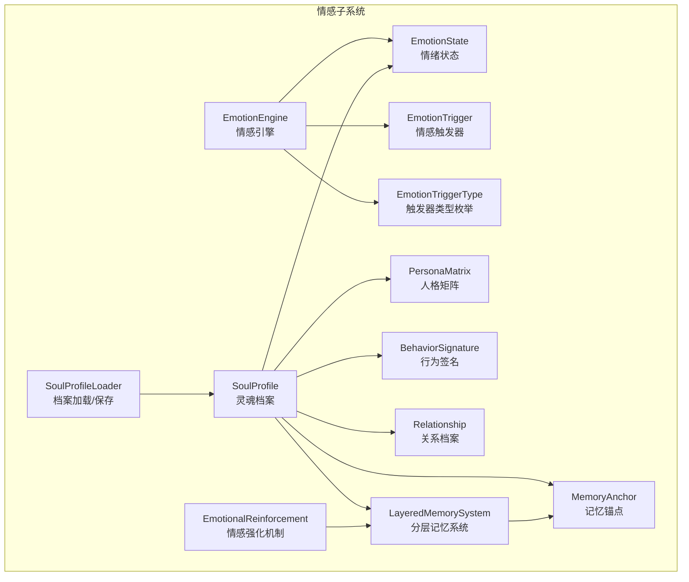

图表来源
- [EmotionEngine.java:11-184](file://src/main/java/adris/altoclef/player2api/soul/EmotionEngine.java#L11-L184)
- [EmotionState.java:9-128](file://src/main/java/adris/altoclef/player2api/soul/EmotionState.java#L9-L128)
- [EmotionTrigger.java:6-19](file://src/main/java/adris/altoclef/player2api/soul/EmotionTrigger.java#L6-L19)
- [EmotionTriggerType.java:6-39](file://src/main/java/adris/altoclef/player2api/soul/EmotionTriggerType.java#L6-L39)
- [SoulProfile.java:15-226](file://src/main/java/adris/altoclef/player2api/soul/SoulProfile.java#L15-L226)
- [PersonaMatrix.java:10-120](file://src/main/java/adris/altoclef/player2api/soul/PersonaMatrix.java#L10-L120)
- [BehaviorSignature.java:10-124](file://src/main/java/adris/altoclef/player2api/soul/BehaviorSignature.java#L10-L124)
- [MemoryAnchor.java:8-83](file://src/main/java/adris/altoclef/player2api/soul/MemoryAnchor.java#L8-L83)
- [Relationship.java:8-70](file://src/main/java/adris/altoclef/player2api/soul/Relationship.java#L8-L70)
- [LayeredMemorySystem.java:10-172](file://src/main/java/adris/altoclef/player2api/memory/LayeredMemorySystem.java#L10-L172)
- [EmotionalReinforcement.java:11-59](file://src/main/java/adris/altoclef/player2api/memory/EmotionalReinforcement.java#L11-L59)
- [SoulProfileLoader.java:25-226](file://src/main/java/adris/altoclef/player2api/soul/SoulProfileLoader.java#L25-L226)

章节来源
- [SoulProfile.java:15-226](file://src/main/java/adris/altoclef/player2api/soul/SoulProfile.java#L15-L226)
- [EmotionEngine.java:11-184](file://src/main/java/adris/altoclef/player2api/soul/EmotionEngine.java#L11-L184)

## 核心组件
- 情感引擎（EmotionEngine）：根据触发器类型与玩家/环境/任务事件，调整情绪状态并更新关系与记忆锚点。
- 情绪状态（EmotionState）：8 种基础情绪（joy、sadness、anger、fear、surprise、disgust、trust、anticipation），支持调整、衰减、主导情绪判定与提示文本生成。
- 情感触发器（EmotionTrigger）：封装触发器类型与上下文（玩家名、物品名、物品价值）。
- 触发器类型（EmotionTriggerType）：枚举定义所有可识别的触发事件（社交、环境、游戏、任务、社交事件）。
- 灵魂档案（SoulProfile）：聚合人格、情绪、行为、记忆与关系，负责情绪自然衰减、记忆锚点管理、关系维护与 Prompt 注入。
- 人格矩阵（PersonaMatrix）：大五人格模型（OCEAN），决定行为签名与情绪反应倾向。
- 行为签名（BehaviorSignature）：从人格矩阵派生的行动偏好，用于行为决策。
- 记忆锚点（MemoryAnchor）：独立于对话的历史情感记忆，具备情感权重、时效性评分与永久性标记。
- 关系（Relationship）：NPC 与玩家之间的亲密度、信任度、依赖度与称谓演进。
- 分层记忆系统（LayeredMemorySystem）：按核心/长期/短期三层管理记忆，支持晋升、淘汰与 Prompt 选择。
- 情感强化（EmotionalReinforcement）：高情绪事件对相关记忆进行权重增强与时间刷新。
- 档案加载器（SoulProfileLoader）：从资源文件加载或保存 JSON 档案。

章节来源
- [EmotionEngine.java:11-184](file://src/main/java/adris/altoclef/player2api/soul/EmotionEngine.java#L11-L184)
- [EmotionState.java:9-128](file://src/main/java/adris/altoclef/player2api/soul/EmotionState.java#L9-L128)
- [EmotionTrigger.java:6-19](file://src/main/java/adris/altoclef/player2api/soul/EmotionTrigger.java#L6-L19)
- [EmotionTriggerType.java:6-39](file://src/main/java/adris/altoclef/player2api/soul/EmotionTriggerType.java#L6-L39)
- [SoulProfile.java:15-226](file://src/main/java/adris/altoclef/player2api/soul/SoulProfile.java#L15-L226)
- [PersonaMatrix.java:10-120](file://src/main/java/adris/altoclef/player2api/soul/PersonaMatrix.java#L10-L120)
- [BehaviorSignature.java:10-124](file://src/main/java/adris/altoclef/player2api/soul/BehaviorSignature.java#L10-L124)
- [MemoryAnchor.java:8-83](file://src/main/java/adris/altoclef/player2api/soul/MemoryAnchor.java#L8-L83)
- [Relationship.java:8-70](file://src/main/java/adris/altoclef/player2api/soul/Relationship.java#L8-L70)
- [LayeredMemorySystem.java:10-172](file://src/main/java/adris/altoclef/player2api/memory/LayeredMemorySystem.java#L10-L172)
- [EmotionalReinforcement.java:11-59](file://src/main/java/adris/altoclef/player2api/memory/EmotionalReinforcement.java#L11-L59)
- [SoulProfileLoader.java:25-226](file://src/main/java/adris/altoclef/player2api/soul/SoulProfileLoader.java#L25-L226)

## 架构总览
情感系统以“事件驱动 + 状态机”的方式工作：外部事件（玩家互动、环境变化、任务结果、社交事件）通过触发器进入情感引擎，引擎依据 NPC 的人格矩阵与当前情绪状态进行加权调整，更新情绪、记忆与关系；同时周期性进行情绪衰减与记忆清理，确保情感体验的自然流动与可持续性。

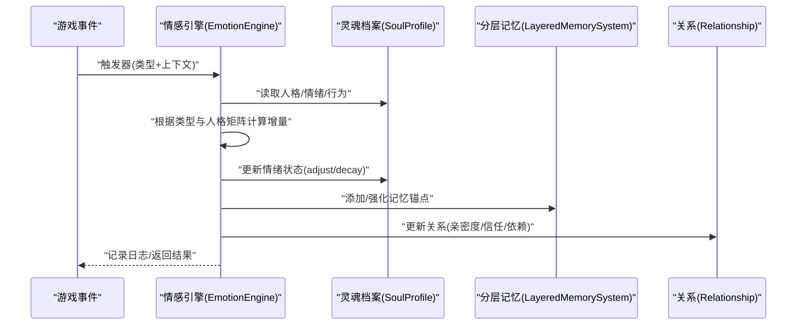

图表来源
- [EmotionEngine.java:17-171](file://src/main/java/adris/altoclef/player2api/soul/EmotionEngine.java#L17-L171)
- [SoulProfile.java:135-141](file://src/main/java/adris/altoclef/player2api/soul/SoulProfile.java#L135-L141)
- [LayeredMemorySystem.java:30-38](file://src/main/java/adris/altoclef/player2api/memory/LayeredMemorySystem.java#L30-L38)
- [Relationship.java:32-35](file://src/main/java/adris/altoclef/player2api/soul/Relationship.java#L32-L35)

## 详细组件分析

### 情感引擎（EmotionEngine）
- 职责：接收触发器，根据类型与人格矩阵对情绪状态进行调整，更新记忆锚点与关系。
- 关键流程：
  - 解析触发器类型与上下文（玩家名、物品名、物品价值）。
  - 依据类型分支，结合人格特征（外向性、宜人性、神经质、尽责性）计算情绪增量。
  - 更新情绪状态（clamp 单次调整幅度，防止瞬时爆炸）。
  - 对高情绪事件触发记忆锚点与关系更新。
  - 记录主导情绪与强度，便于调试与提示。

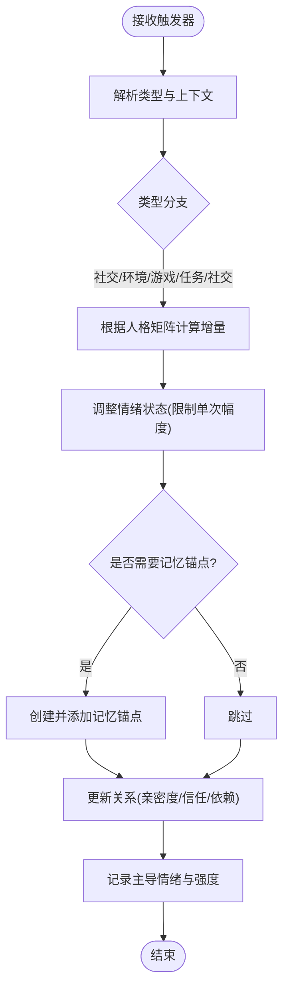

图表来源
- [EmotionEngine.java:17-171](file://src/main/java/adris/altoclef/player2api/soul/EmotionEngine.java#L17-L171)

章节来源
- [EmotionEngine.java:17-182](file://src/main/java/adris/altoclef/player2api/soul/EmotionEngine.java#L17-L182)

### 情绪状态（EmotionState）
- 数据结构：8 种基础情绪，键集合固定，值域 0.0~1.0。
- 核心能力：
  - adjust/delta：限制单次调整幅度（±0.25），防止情绪瞬时爆炸。
  - decay：按固定速率对所有情绪进行自然衰减（每 30 秒衰减 0.1）。
  - getDominantEmotion/getDominantIntensity：获取主导情绪及其强度。
  - hasSignificantEmotion：判断是否存在显著情绪。
  - toPromptText：生成对话提示文本，包含主导情绪与语气建议。

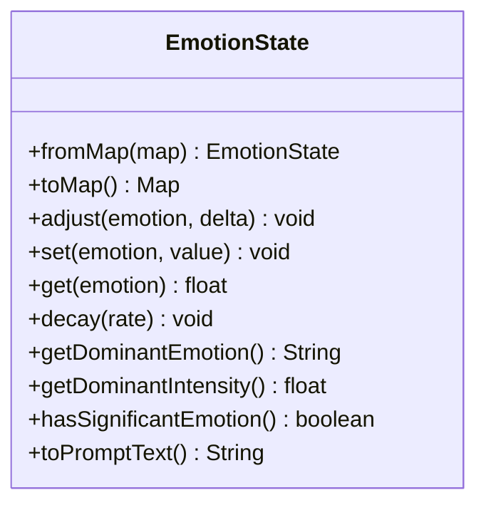

图表来源
- [EmotionState.java:9-128](file://src/main/java/adris/altoclef/player2api/soul/EmotionState.java#L9-L128)

章节来源
- [EmotionState.java:36-126](file://src/main/java/adris/altoclef/player2api/soul/EmotionState.java#L36-L126)

### 情感触发器（EmotionTrigger）与类型（EmotionTriggerType）
- 触发器：包含类型与上下文（玩家名、物品名、物品价值），提供多种构造重载。
- 类型枚举：涵盖玩家互动（称赞、责备、攻击、送礼、玩家死亡、加入/离开）、环境事件（日出/日落、下雨/打雷）、游戏事件（发现钻石/稀有物品、进入洞穴/下界/末地、苦力怕附近、低血量）、任务事件（完成/失败/取消）、社交事件（遇到新 NPC、被 NPC 问候）。

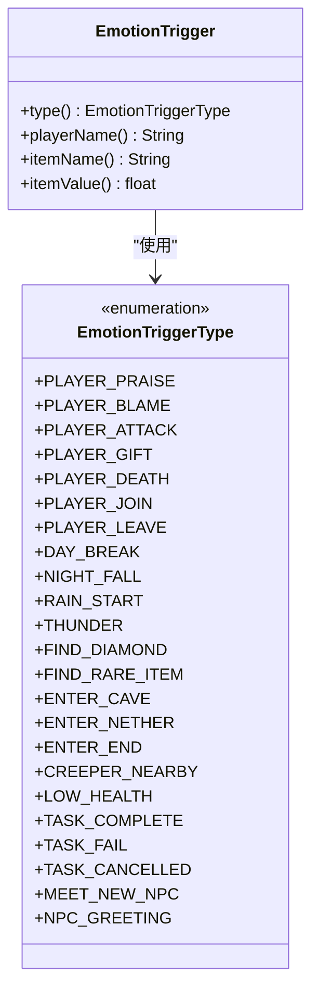

图表来源
- [EmotionTrigger.java:6-19](file://src/main/java/adris/altoclef/player2api/soul/EmotionTrigger.java#L6-L19)
- [EmotionTriggerType.java:6-39](file://src/main/java/adris/altoclef/player2api/soul/EmotionTriggerType.java#L6-L39)

章节来源
- [EmotionTrigger.java:6-19](file://src/main/java/adris/altoclef/player2api/soul/EmotionTrigger.java#L6-L19)
- [EmotionTriggerType.java:6-39](file://src/main/java/adris/altoclef/player2api/soul/EmotionTriggerType.java#L6-L39)

### 灵魂档案（SoulProfile）
- 聚合：人格矩阵、情绪状态、行为签名、记忆锚点、关系图谱、分层记忆系统。
- 能力：
  - add/remove/cleanup 记忆锚点，限制最大数量并按评分淘汰。
  - getOrCreateRelationship：按 UUID 创建或获取关系。
  - tickEmotionDecay：周期性触发情绪衰减。
  - toPromptInjection/toCompactPromptInjection：生成注入 LLM 的提示文本，包含人格、情绪、记忆锚点、关系与行为倾向。
  - toEmotionReminder：生成用户消息提醒，简洁表达当前主导情绪。

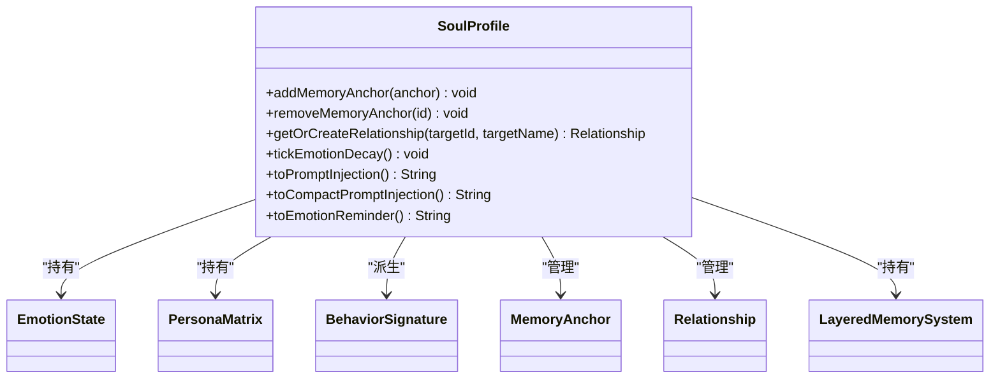

图表来源
- [SoulProfile.java:15-226](file://src/main/java/adris/altoclef/player2api/soul/SoulProfile.java#L15-L226)
- [MemoryAnchor.java:8-83](file://src/main/java/adris/altoclef/player2api/soul/MemoryAnchor.java#L8-L83)
- [Relationship.java:8-70](file://src/main/java/adris/altoclef/player2api/soul/Relationship.java#L8-L70)
- [LayeredMemorySystem.java:10-172](file://src/main/java/adris/altoclef/player2api/memory/LayeredMemorySystem.java#L10-L172)

章节来源
- [SoulProfile.java:82-141](file://src/main/java/adris/altoclef/player2api/soul/SoulProfile.java#L82-L141)

### 人格矩阵（PersonaMatrix）与行为签名（BehaviorSignature）
- 人格矩阵：大五人格（OCEAN），每个维度 -100~+100，提供 toPromptText 与紧凑文本表示。
- 行为签名：从人格矩阵派生而来，包含主动性、风险承受、独立性、效率倾向、忠诚度，用于行为决策与提示。

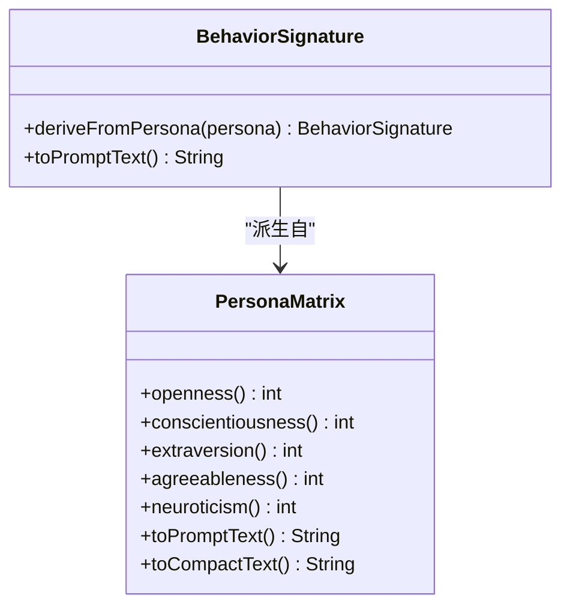

图表来源
- [PersonaMatrix.java:10-120](file://src/main/java/adris/altoclef/player2api/soul/PersonaMatrix.java#L10-L120)
- [BehaviorSignature.java:10-124](file://src/main/java/adris/altoclef/player2api/soul/BehaviorSignature.java#L10-L124)

章节来源
- [PersonaMatrix.java:58-118](file://src/main/java/adris/altoclef/player2api/soul/PersonaMatrix.java#L58-L118)
- [BehaviorSignature.java:30-108](file://src/main/java/adris/altoclef/player2api/soul/BehaviorSignature.java#L30-L108)

### 记忆锚点（MemoryAnchor）与分层记忆系统（LayeredMemorySystem）
- 记忆锚点：具备情感权重、永久性标记、时间戳、引用计数与最后使用时间，支持评分计算（情感权重×时效性）。
- 分层记忆系统：核心（5）、长期（30）、短期（50）三层容量控制，支持晋升、淘汰、按类别筛选与 Prompt 注入选取。

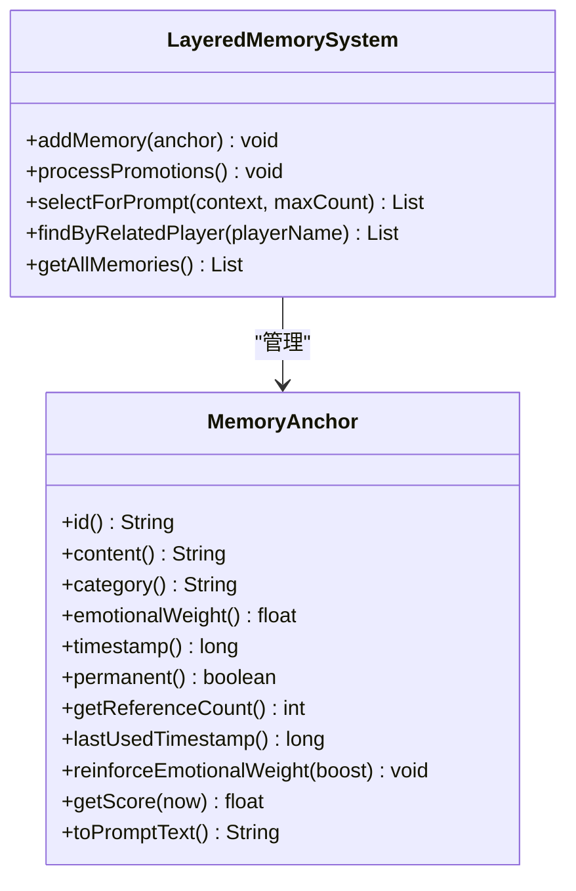

图表来源
- [MemoryAnchor.java:8-83](file://src/main/java/adris/altoclef/player2api/soul/MemoryAnchor.java#L8-L83)
- [LayeredMemorySystem.java:10-172](file://src/main/java/adris/altoclef/player2api/memory/LayeredMemorySystem.java#L10-L172)

章节来源
- [MemoryAnchor.java:72-76](file://src/main/java/adris/altoclef/player2api/soul/MemoryAnchor.java#L72-L76)
- [LayeredMemorySystem.java:30-129](file://src/main/java/adris/altoclef/player2api/memory/LayeredMemorySystem.java#L30-L129)

### 情感强化（EmotionalReinforcement）
- 高强度情绪（>0.7）触发对相关玩家的记忆进行强化，按情绪类型给予不同倍率，同时刷新时间戳以延缓遗忘。

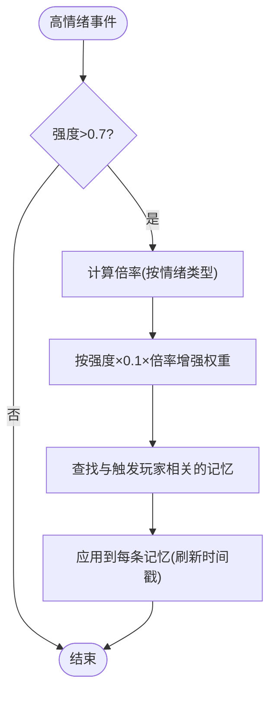

图表来源
- [EmotionalReinforcement.java:22-42](file://src/main/java/adris/altoclef/player2api/memory/EmotionalReinforcement.java#L22-L42)

章节来源
- [EmotionalReinforcement.java:11-59](file://src/main/java/adris/altoclef/player2api/memory/EmotionalReinforcement.java#L11-L59)

### 档案加载/保存（SoulProfileLoader）
- 支持从资源路径复制默认模板到运行时配置目录，再从文件加载；保存时序列化人格、情绪、行为、记忆锚点与关系。

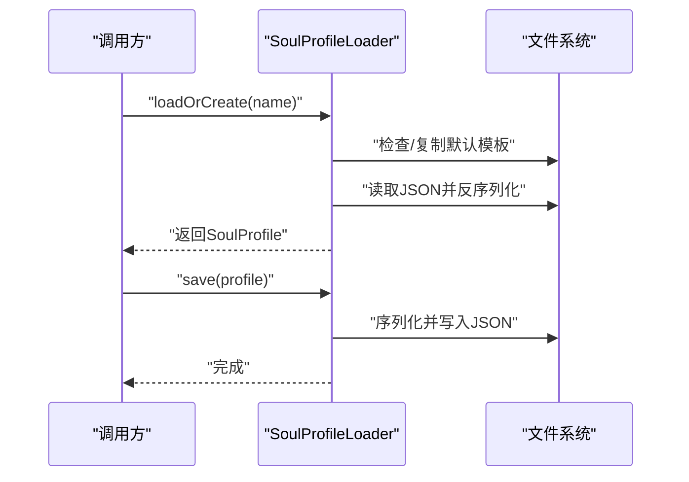

图表来源
- [SoulProfileLoader.java:35-132](file://src/main/java/adris/altoclef/player2api/soul/SoulProfileLoader.java#L35-L132)

章节来源
- [SoulProfileLoader.java:25-226](file://src/main/java/adris/altoclef/player2api/soul/SoulProfileLoader.java#L25-L226)

## 依赖分析
- 组件耦合：
  - EmotionEngine 依赖 SoulProfile 的情绪状态与关系管理，间接依赖 PersonalityMatrix 与 MemoryAnchor。
  - SoulProfile 聚合 EmotionState、PersonaMatrix、BehaviorSignature、Relationship、LayeredMemorySystem。
  - LayeredMemorySystem 管理 MemoryAnchor，支持按类别与评分检索。
  - EmotionalReinforcement 与 LayeredMemorySystem 协作，实现记忆强化。
- 外部依赖：
  - JSON 序列化（Gson）用于档案持久化。
  - 日志框架（Log4j/SLF4J）用于运行时记录。

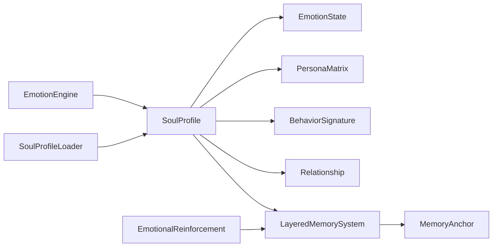

图表来源
- [EmotionEngine.java:17-171](file://src/main/java/adris/altoclef/player2api/soul/EmotionEngine.java#L17-L171)
- [SoulProfile.java:15-226](file://src/main/java/adris/altoclef/player2api/soul/SoulProfile.java#L15-L226)
- [LayeredMemorySystem.java:10-172](file://src/main/java/adris/altoclef/player2api/memory/LayeredMemorySystem.java#L10-L172)
- [EmotionalReinforcement.java:11-59](file://src/main/java/adris/altoclef/player2api/memory/EmotionalReinforcement.java#L11-L59)
- [SoulProfileLoader.java:25-226](file://src/main/java/adris/altoclef/player2api/soul/SoulProfileLoader.java#L25-L226)

## 性能考量
- 情绪衰减：每 30 秒一次，衰减 0.1，平衡情绪恢复速度与稳定性。
- 记忆管理：分层容量控制与评分淘汰，避免无限增长；晋升策略减少短期重复记忆。
- 线程安全：情绪状态与关系使用并发容器，保证多线程访问安全。
- I/O 优化：JSON 档案按需加载/保存，避免频繁磁盘操作。

## 故障排查指南
- 情绪异常高涨或不衰减：
  - 检查触发器是否误用高增量，确认情绪状态的单次调整上限。
  - 确认 tickEmotionDecay 是否按期执行。
- 记忆未晋升或被清理：
  - 检查情感权重与引用计数阈值，确认晋升策略是否满足。
  - 核对评分函数与时间衰减参数。
- 关系不更新：
  - 确认触发器携带正确玩家名，引擎是否调用关系更新逻辑。
- 档案加载失败：
  - 查看日志错误，确认资源模板复制与 JSON 字段完整性。

章节来源
- [EmotionState.java:58-63](file://src/main/java/adris/altoclef/player2api/soul/EmotionState.java#L58-L63)
- [SoulProfile.java:135-141](file://src/main/java/adris/altoclef/player2api/soul/SoulProfile.java#L135-L141)
- [LayeredMemorySystem.java:75-88](file://src/main/java/adris/altoclef/player2api/memory/LayeredMemorySystem.java#L75-L88)
- [SoulProfileLoader.java:42-57](file://src/main/java/adris/altoclef/player2api/soul/SoulProfileLoader.java#L42-L57)

## 结论
情感状态管理通过“事件驱动 + 人格引导 + 记忆强化”的闭环，实现了 NPC 情绪的自然演进与可持续记忆。系统在数据结构、更新算法与持久化方面均具备清晰边界与良好扩展性，适合进一步引入更复杂的情绪模型与社交网络。

## 附录

### 情感状态数据结构与属性
- 情绪类型：joy、sadness、anger、fear、surprise、disgust、trust、anticipation
- 属性：
  - 强度：0.0~1.0，clamp 限制与自然衰减
  - 主导情绪：强度最高者
  - 提示文本：包含当前情绪与语气建议
- 计算与更新：
  - adjust：限制单次调整幅度（±0.25）
  - decay：周期性衰减（每 30 秒 -0.1）
  - getDominantEmotion/getDominantIntensity：主导情绪判定
  - hasSignificantEmotion：显著情绪阈值（>0.3）

章节来源
- [EmotionState.java:10-126](file://src/main/java/adris/altoclef/player2api/soul/EmotionState.java#L10-L126)

### 情感触发器类型与处理方式
- 社交互动：称赞、责备、攻击、送礼、玩家死亡、加入/离开
- 环境事件：日出、日落、下雨、打雷
- 游戏事件：发现钻石、稀有物品、进入洞穴/下界/末地、苦力怕附近、低血量
- 任务事件：完成、失败、取消
- 社交事件：遇到新 NPC、被 NPC 问候
- 处理要点：
  - 结合人格特征（外向性、宜人性、神经质、尽责性）调整增量
  - 创建/强化记忆锚点，更新关系（亲密度/信任/依赖）
  - 记录日志，输出主导情绪与强度

章节来源
- [EmotionTriggerType.java:6-39](file://src/main/java/adris/altoclef/player2api/soul/EmotionTriggerType.java#L6-L39)
- [EmotionEngine.java:23-163](file://src/main/java/adris/altoclef/player2api/soul/EmotionEngine.java#L23-L163)

### 情感值的累积、衰减与冲突解决
- 累积：触发器按类型与人格矩阵计算增量，clamp 限制单次幅度
- 衰减：每 30 秒统一衰减 0.1，加速恢复
- 冲突解决：通过关系与记忆锚点的综合评分，决定 Prompt 注入与行为倾向
- 强化：高强度情绪对相关记忆进行权重增强与时间刷新

章节来源
- [EmotionEngine.java:58-63](file://src/main/java/adris/altoclef/player2api/soul/EmotionEngine.java#L58-L63)
- [EmotionalReinforcement.java:22-42](file://src/main/java/adris/altoclef/player2api/memory/EmotionalReinforcement.java#L22-L42)

### 如何定义新的情感类型与触发逻辑
- 新增触发器类型：
  - 在 EmotionTriggerType 中添加枚举项
  - 在 EmotionEngine.applyTrigger 中增加对应分支，计算增量与副作用（记忆锚点、关系更新）
- 新增情感类型（扩展性说明）：
  - 在 EmotionState 的键集合中加入新类型
  - 更新 adjust/set/get 与提示文本生成逻辑
  - 在触发器分支中使用新类型进行增量
- 新增触发条件：
  - 在事件监听处创建 EmotionTrigger 实例（携带类型与上下文）
  - 调用 EmotionEngine.applyTrigger(soul, trigger)

章节来源
- [EmotionTriggerType.java:6-39](file://src/main/java/adris/altoclef/player2api/soul/EmotionTriggerType.java#L6-L39)
- [EmotionEngine.java:17-171](file://src/main/java/adris/altoclef/player2api/soul/EmotionEngine.java#L17-L171)
- [EmotionState.java:10-48](file://src/main/java/adris/altoclef/player2api/soul/EmotionState.java#L10-L48)

### 如何根据情感状态调整 NPC 行为
- Prompt 注入：使用 SoulProfile.toPromptInjection 或 toCompactPromptInjection 将人格、情绪、记忆锚点、关系与行为倾向注入 LLM
- 情绪提醒：使用 toEmotionReminder 生成用户消息提醒，指导语气与措辞
- 行为签名：根据 BehaviorSignature 的派生规则，结合人格矩阵决定主动性、风险承受、独立性、效率与忠诚度

章节来源
- [SoulProfile.java:148-224](file://src/main/java/adris/altoclef/player2api/soul/SoulProfile.java#L148-L224)
- [BehaviorSignature.java:30-108](file://src/main/java/adris/altoclef/player2api/soul/BehaviorSignature.java#L30-L108)

### 示例：角色配置文件
- Luna 与 QiQi 的 JSON 模板展示了人格矩阵、初始情绪状态、行为签名与运行时字段的结构与注释，便于直接编辑与扩展。

章节来源
- [soul_Luna.json:1-61](file://src/main/resources/soul/soul_Luna.json#L1-L61)
- [soul_QiQi.json:1-61](file://src/main/resources/soul/soul_QiQi.json#L1-L61)