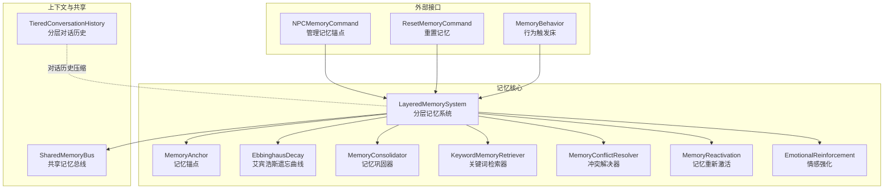
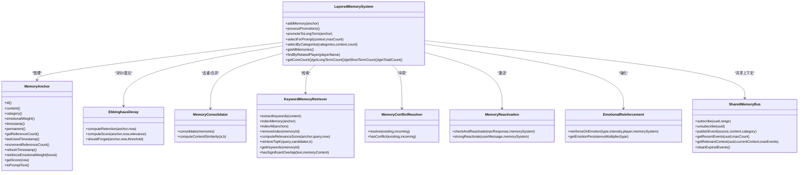
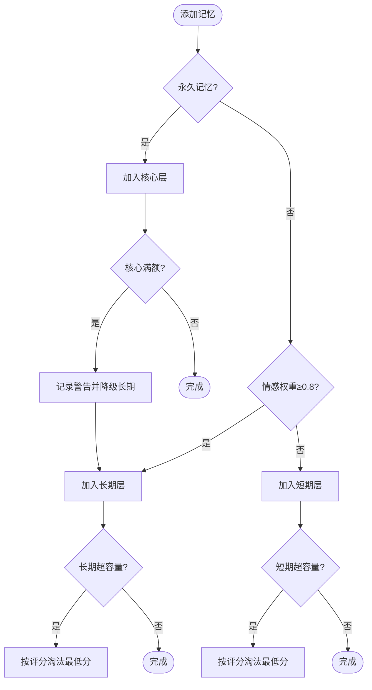
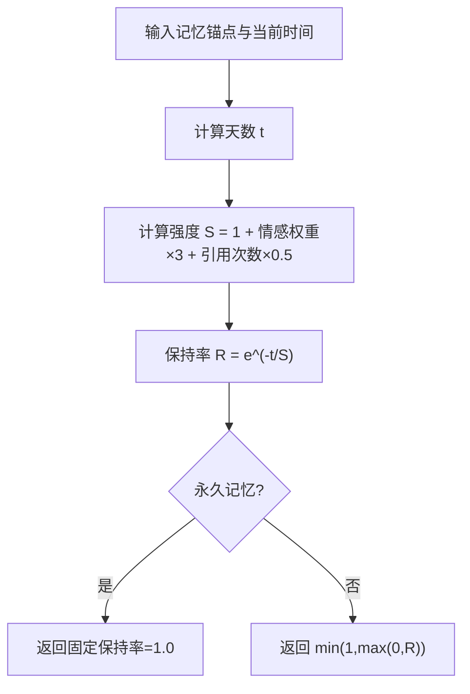
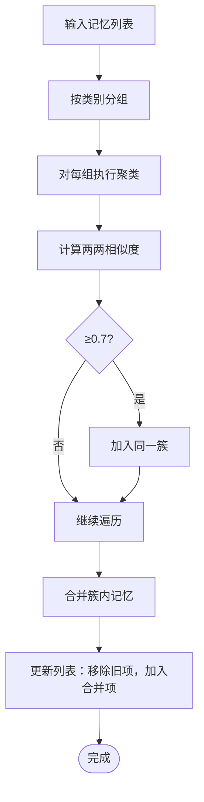
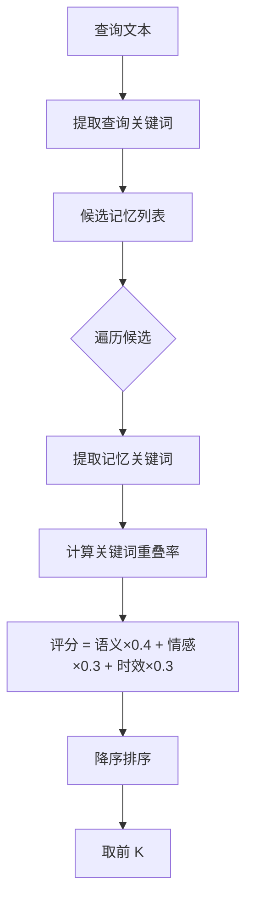
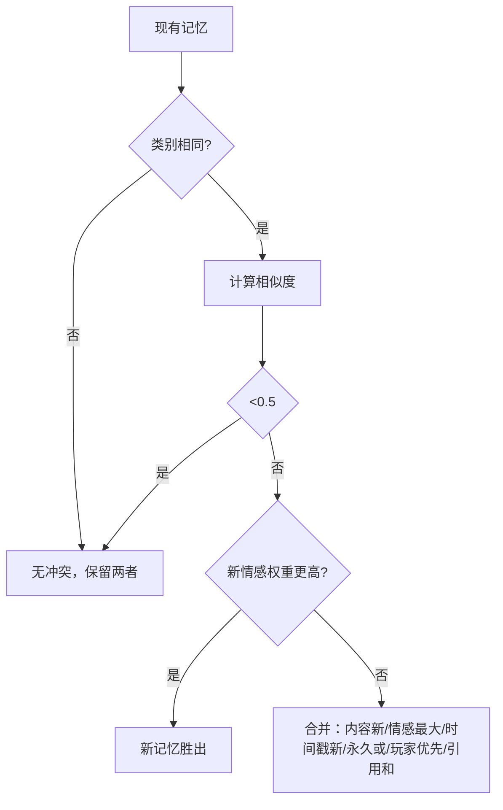
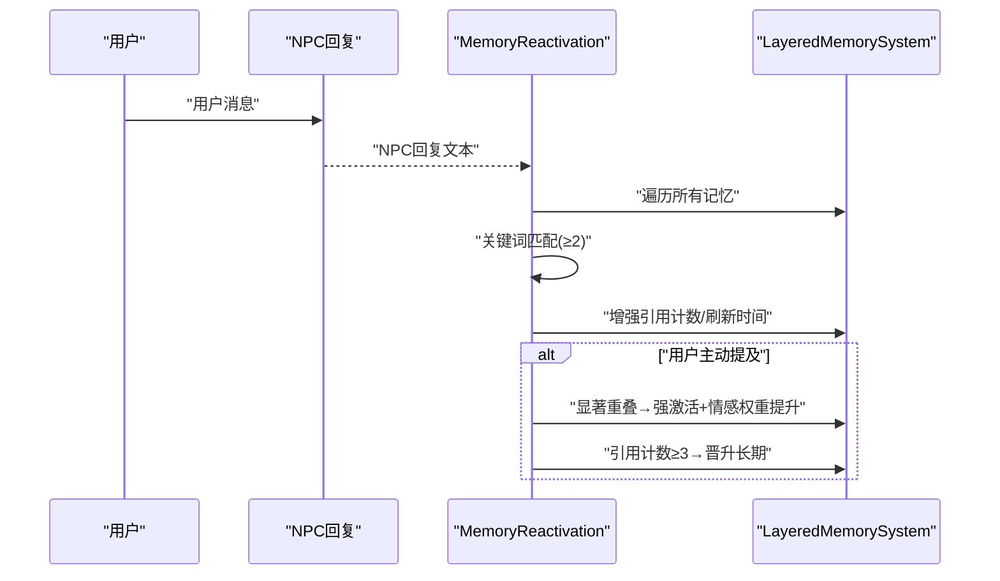
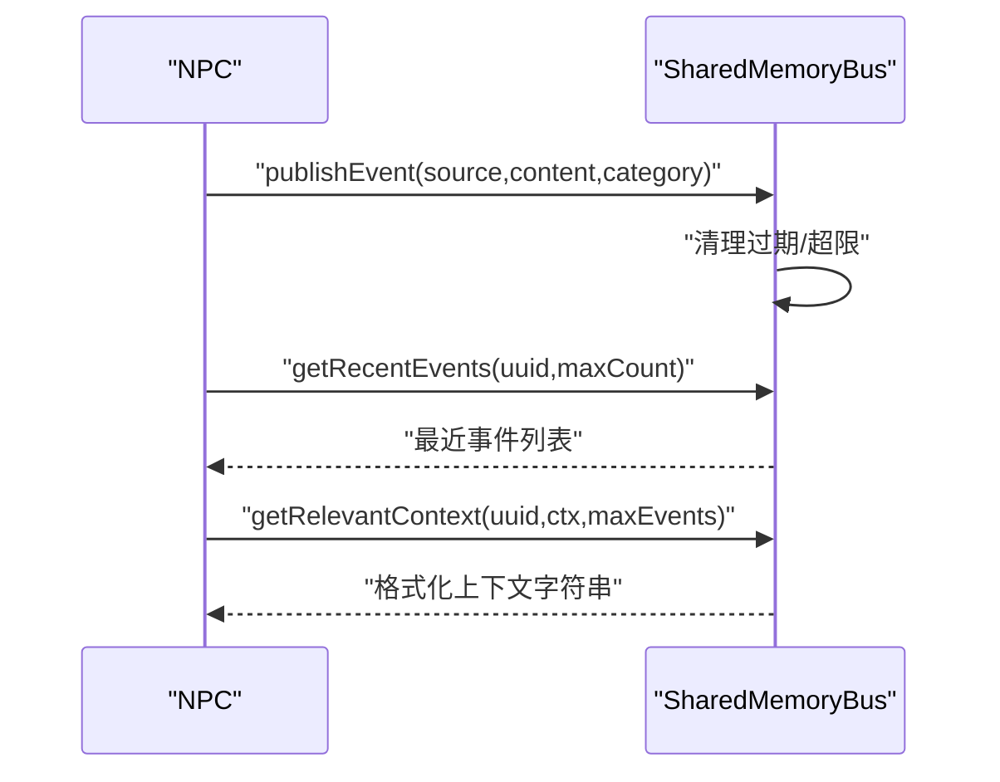
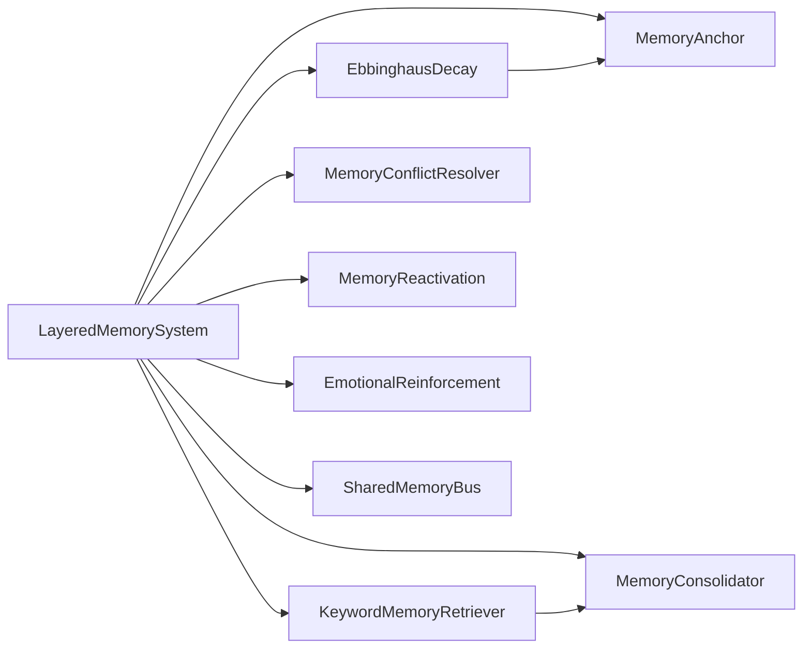

# 记忆系统

<cite>
**本文引用的文件**
- [LayeredMemorySystem.java](file://src/main/java/adris/altoclef/player2api/memory/LayeredMemorySystem.java)
- [EbbinghausDecay.java](file://src/main/java/adris/altoclef/player2api/memory/EbbinghausDecay.java)
- [MemoryConsolidator.java](file://src/main/java/adris/altoclef/player2api/memory/MemoryConsolidator.java)
- [KeywordMemoryRetriever.java](file://src/main/java/adris/altoclef/player2api/memory/KeywordMemoryRetriever.java)
- [MemoryConflictResolver.java](file://src/main/java/adris/altoclef/player2api/memory/MemoryConflictResolver.java)
- [MemoryReactivation.java](file://src/main/java/adris/altoclef/player2api/memory/MemoryReactivation.java)
- [SharedMemoryBus.java](file://src/main/java/adris/altoclef/player2api/memory/SharedMemoryBus.java)
- [MemoryAnchor.java](file://src/main/java/adris/altoclef/player2api/soul/MemoryAnchor.java)
- [EmotionalReinforcement.java](file://src/main/java/adris/altoclef/player2api/memory/EmotionalReinforcement.java)
- [NPCMemoryCommand.java](file://src/main/java/adris/altoclef/commands/NPCMemoryCommand.java)
- [ResetMemoryCommand.java](file://src/main/java/adris/altoclef/commands/ResetMemoryCommand.java)
- [MemoryBehavior.java](file://src/main/java/baritone/behavior/MemoryBehavior.java)
- [TieredConversationHistory.java](file://src/main/java/adris/altoclef/player2api/context/TieredConversationHistory.java)
</cite>

## 目录
1. [简介](#简介)
2. [项目结构](#项目结构)
3. [核心组件](#核心组件)
4. [架构总览](#架构总览)
5. [详细组件分析](#详细组件分析)
6. [依赖关系分析](#依赖关系分析)
7. [性能考量](#性能考量)
8. [故障排查指南](#故障排查指南)
9. [结论](#结论)
10. [附录：扩展指南](#附录扩展指南)

## 简介
本技术文档围绕记忆系统展开，重点解析分层记忆系统（LayeredMemorySystem）的设计与实现，涵盖短期记忆、长期记忆、情感记忆等层次的存储与调度；详述艾宾浩斯遗忘曲线（EbbinghausDecay）在记忆强度随时间衰减中的应用；解释记忆巩固器（MemoryConsolidator）如何通过关键词聚类与合并实现记忆去重与强化；阐述关键词记忆检索器（KeywordMemoryRetriever）的关键词提取、相似度计算与检索匹配流程；并给出记忆的动态更新、Prompt 注入、NPC 间共享上下文等关键能力。最后提供扩展指南，帮助开发者新增记忆类型与检索算法。

## 项目结构
记忆系统位于模块路径 player2api/memory 与 soul 下，配合命令系统与对话上下文管理，形成“输入事件 → 记忆锚点 → 分层存储 → 检索融合 → Prompt 注入”的闭环。

图示来源
- [LayeredMemorySystem.java:10-172](file://src/main/java/adris/altoclef/player2api/memory/LayeredMemorySystem.java#L10-L172)
- [MemoryAnchor.java:8-83](file://src/main/java/adris/altoclef/player2api/soul/MemoryAnchor.java#L8-L83)
- [EbbinghausDecay.java:9-66](file://src/main/java/adris/altoclef/player2api/memory/EbbinghausDecay.java#L9-L66)
- [MemoryConsolidator.java:12-119](file://src/main/java/adris/altoclef/player2api/memory/MemoryConsolidator.java#L12-L119)
- [KeywordMemoryRetriever.java:11-142](file://src/main/java/adris/altoclef/player2api/memory/KeywordMemoryRetriever.java#L11-L142)
- [MemoryConflictResolver.java:10-78](file://src/main/java/adris/altoclef/player2api/memory/MemoryConflictResolver.java#L10-L78)
- [MemoryReactivation.java:11-62](file://src/main/java/adris/altoclef/player2api/memory/MemoryReactivation.java#L11-L62)
- [EmotionalReinforcement.java:11-59](file://src/main/java/adris/altoclef/player2api/memory/EmotionalReinforcement.java#L11-L59)
- [SharedMemoryBus.java:17-198](file://src/main/java/adris/altoclef/player2api/memory/SharedMemoryBus.java#L17-L198)
- [TieredConversationHistory.java:9-178](file://src/main/java/adris/altoclef/player2api/context/TieredConversationHistory.java#L9-L178)
- [NPCMemoryCommand.java:16-107](file://src/main/java/adris/altoclef/commands/NPCMemoryCommand.java#L16-L107)
- [ResetMemoryCommand.java:8-19](file://src/main/java/adris/altoclef/commands/ResetMemoryCommand.java#L8-L19)
- [MemoryBehavior.java:11-27](file://src/main/java/baritone/behavior/MemoryBehavior.java#L11-L27)

章节来源
- [LayeredMemorySystem.java:10-172](file://src/main/java/adris/altoclef/player2api/memory/LayeredMemorySystem.java#L10-L172)
- [MemoryAnchor.java:8-83](file://src/main/java/adris/altoclef/player2api/soul/MemoryAnchor.java#L8-L83)
- [SharedMemoryBus.java:17-198](file://src/main/java/adris/altoclef/player2api/memory/SharedMemoryBus.java#L17-L198)

## 核心组件
- 分层记忆系统（LayeredMemorySystem）：负责记忆的分层存储、容量淘汰、晋升策略、类别筛选与 Prompt 注入。
- 记忆锚点（MemoryAnchor）：承载记忆内容、情感权重、时间戳、引用计数、永久性标记等元数据。
- 艾宾浩斯遗忘曲线（EbbinghausDecay）：提供记忆保持率与综合评分计算，替代线性衰减。
- 记忆巩固器（MemoryConsolidator）：基于关键词重叠的聚类与合并，减少冗余。
- 关键词记忆检索器（KeywordMemoryRetriever）：轻量关键词提取与相似度计算，支持 Top-K 检索。
- 冲突解决器（MemoryConflictResolver）：检测相似冲突并按策略合并或覆盖。
- 记忆重新激活（MemoryReactivation）：响应 NPC 回复与用户输入对记忆进行强化与晋升。
- 情感强化（EmotionalReinforcement）：高情感事件对相关记忆进行加权与复习。
- 共享记忆总线（SharedMemoryBus）：NPC 间事件发布订阅，提供最近上下文注入 Prompt。
- 命令接口：NPCMemoryCommand 与 ResetMemoryCommand 提供记忆增删查与重置。

章节来源
- [LayeredMemorySystem.java:10-172](file://src/main/java/adris/altoclef/player2api/memory/LayeredMemorySystem.java#L10-L172)
- [MemoryAnchor.java:8-83](file://src/main/java/adris/altoclef/player2api/soul/MemoryAnchor.java#L8-L83)
- [EbbinghausDecay.java:9-66](file://src/main/java/adris/altoclef/player2api/memory/EbbinghausDecay.java#L9-L66)
- [MemoryConsolidator.java:12-119](file://src/main/java/adris/altoclef/player2api/memory/MemoryConsolidator.java#L12-L119)
- [KeywordMemoryRetriever.java:11-142](file://src/main/java/adris/altoclef/player2api/memory/KeywordMemoryRetriever.java#L11-L142)
- [MemoryConflictResolver.java:10-78](file://src/main/java/adris/altoclef/player2api/memory/MemoryConflictResolver.java#L10-L78)
- [MemoryReactivation.java:11-62](file://src/main/java/adris/altoclef/player2api/memory/MemoryReactivation.java#L11-L62)
- [EmotionalReinforcement.java:11-59](file://src/main/java/adris/altoclef/player2api/memory/EmotionalReinforcement.java#L11-L59)
- [SharedMemoryBus.java:17-198](file://src/main/java/adris/altoclef/player2api/memory/SharedMemoryBus.java#L17-L198)
- [NPCMemoryCommand.java:16-107](file://src/main/java/adris/altoclef/commands/NPCMemoryCommand.java#L16-L107)
- [ResetMemoryCommand.java:8-19](file://src/main/java/adris/altoclef/commands/ResetMemoryCommand.java#L8-L19)

## 架构总览
记忆系统以 MemoryAnchor 为核心载体，通过 LayeredMemorySystem 进行分层管理；EbbinghausDecay 提供真实的时间衰减模型；MemoryConsolidator 与 MemoryConflictResolver 保证记忆质量；KeywordMemoryRetriever 与 MemoryReactivation 实现快速检索与动态强化；SharedMemoryBus 提供 NPC 间共享上下文；命令接口与行为触发器打通输入事件到记忆的入口。

图示来源
- [MemoryAnchor.java:8-83](file://src/main/java/adris/altoclef/player2api/soul/MemoryAnchor.java#L8-L83)
- [LayeredMemorySystem.java:10-172](file://src/main/java/adris/altoclef/player2api/memory/LayeredMemorySystem.java#L10-L172)
- [EbbinghausDecay.java:9-66](file://src/main/java/adris/altoclef/player2api/memory/EbbinghausDecay.java#L9-L66)
- [MemoryConsolidator.java:12-119](file://src/main/java/adris/altoclef/player2api/memory/MemoryConsolidator.java#L12-L119)
- [KeywordMemoryRetriever.java:11-142](file://src/main/java/adris/altoclef/player2api/memory/KeywordMemoryRetriever.java#L11-L142)
- [MemoryConflictResolver.java:10-78](file://src/main/java/adris/altoclef/player2api/memory/MemoryConflictResolver.java#L10-L78)
- [MemoryReactivation.java:11-62](file://src/main/java/adris/altoclef/player2api/memory/MemoryReactivation.java#L11-L62)
- [EmotionalReinforcement.java:11-59](file://src/main/java/adris/altoclef/player2api/memory/EmotionalReinforcement.java#L11-L59)
- [SharedMemoryBus.java:17-198](file://src/main/java/adris/altoclef/player2api/memory/SharedMemoryBus.java#L17-L198)

## 详细组件分析

### 分层记忆系统（LayeredMemorySystem）
- 层级定义：CORE（核心）、LONG_TERM（长期）、SHORT_TERM（短期），分别限制容量上限，确保核心记忆稳定与长期记忆可控。
- 自动分层：根据记忆是否永久、情感权重阈值自动分配至不同层级；否则默认进入短期。
- 淘汰策略：按评分（由遗忘曲线与情感权重决定）选择最低分记忆移除，避免短期溢出。
- 晋升机制：短期记忆若被高频引用或高情感权重，将晋升为长期记忆，提升稳定性。
- Prompt 注入：按层级优先级与评分排序，选择 Top-N 记忆注入提示词，兼顾全局与时效。
- 类别筛选与玩家关联：支持按类别与相关玩家筛选记忆，便于个性化与情境化检索。

图示来源
- [LayeredMemorySystem.java:30-88](file://src/main/java/adris/altoclef/player2api/memory/LayeredMemorySystem.java#L30-L88)

章节来源
- [LayeredMemorySystem.java:10-172](file://src/main/java/adris/altoclef/player2api/memory/LayeredMemorySystem.java#L10-L172)

### 艾宾浩斯遗忘曲线（EbbinghausDecay）
- 保持率计算：R = e^(-t/S)，其中 t 为天数，S 为基础强度（受情感权重与引用次数增强），提供更符合人类记忆的指数衰减。
- 综合评分：score = retention×0.5 + emotionalWeight×0.3 + relevance×0.2，平衡遗忘、情感与相关性。
- 遗忘判定：默认阈值 2%，低于阈值视为遗忘，适合用于清理与提示词权重。

图示来源
- [EbbinghausDecay.java:17-32](file://src/main/java/adris/altoclef/player2api/memory/EbbinghausDecay.java#L17-L32)

章节来源
- [EbbinghausDecay.java:9-66](file://src/main/java/adris/altoclef/player2api/memory/EbbinghausDecay.java#L9-L66)
- [MemoryAnchor.java:68-76](file://src/main/java/adris/altoclef/player2api/soul/MemoryAnchor.java#L68-L76)

### 记忆巩固器（MemoryConsolidator）
- 聚类策略：按类别分组，使用关键词重叠（Jaccard）进行相似度聚类，阈值 0.7。
- 合并规则：选择较长内容作为代表，情感权重取最大值并叠加 boost，引用次数求和，任一成员为永久则合并后永久。
- 相似度计算：依赖 KeywordMemoryRetriever 的关键词提取与重叠统计。

图示来源
- [MemoryConsolidator.java:19-44](file://src/main/java/adris/altoclef/player2api/memory/MemoryConsolidator.java#L19-L44)
- [MemoryConsolidator.java:49-74](file://src/main/java/adris/altoclef/player2api/memory/MemoryConsolidator.java#L49-L74)
- [MemoryConsolidator.java:79-102](file://src/main/java/adris/altoclef/player2api/memory/MemoryConsolidator.java#L79-L102)
- [KeywordMemoryRetriever.java:107-117](file://src/main/java/adris/altoclef/player2api/memory/KeywordMemoryRetriever.java#L107-L117)

章节来源
- [MemoryConsolidator.java:12-119](file://src/main/java/adris/altoclef/player2api/memory/MemoryConsolidator.java#L12-L119)
- [KeywordMemoryRetriever.java:11-142](file://src/main/java/adris/altoclef/player2api/memory/KeywordMemoryRetriever.java#L11-L142)

### 关键词记忆检索器（KeywordMemoryRetriever）
- 关键词提取：中文按标点切分取 2–8 字片段；英文去停用词与符号，取长度 ≥3 的词；统一小写。
- 索引维护：为每个记忆建立关键词集合，支持批量索引与删除。
- 相关性评分：semantic×0.4 + emotion×0.3 + recency×0.3，兼顾语义、情感与时效。
- Top-K 检索：按评分降序取前 K 条；提供显著重叠检测用于间接激活判断。

图示来源
- [KeywordMemoryRetriever.java:28-52](file://src/main/java/adris/altoclef/player2api/memory/KeywordMemoryRetriever.java#L28-L52)
- [KeywordMemoryRetriever.java:81-105](file://src/main/java/adris/altoclef/player2api/memory/KeywordMemoryRetriever.java#L81-L105)
- [KeywordMemoryRetriever.java:110-117](file://src/main/java/adris/altoclef/player2api/memory/KeywordMemoryRetriever.java#L110-L117)

章节来源
- [KeywordMemoryRetriever.java:11-142](file://src/main/java/adris/altoclef/player2api/memory/KeywordMemoryRetriever.java#L11-L142)

### 冲突解决器（MemoryConflictResolver）
- 冲突检测：同类别下内容相似度 ≥0.5 即视为冲突。
- 解决策略：若新记忆情感强度显著更高则覆盖，否则合并（内容取新，情感取最大，时间戳取新，永久性或运算，玩家名优先非空者，引用次数相加）。

图示来源
- [MemoryConflictResolver.java:27-64](file://src/main/java/adris/altoclef/player2api/memory/MemoryConflictResolver.java#L27-L64)

章节来源
- [MemoryConflictResolver.java:10-78](file://src/main/java/adris/altoclef/player2api/memory/MemoryConflictResolver.java#L10-L78)
- [MemoryConsolidator.java:107-117](file://src/main/java/adris/altoclef/player2api/memory/MemoryConsolidator.java#L107-L117)

### 记忆重新激活（MemoryReactivation）
- 间接激活：NPC 回复中出现记忆关键词（≥2 个）时，增加引用计数与刷新时间戳，强化记忆。
- 主动强激活：用户消息与记忆内容存在显著重叠时，额外提升情感权重，并考虑晋升到长期。

图示来源
- [MemoryReactivation.java:19-60](file://src/main/java/adris/altoclef/player2api/memory/MemoryReactivation.java#L19-L60)

章节来源
- [MemoryReactivation.java:11-62](file://src/main/java/adris/altoclef/player2api/memory/MemoryReactivation.java#L11-L62)

### 情感强化（EmotionalReinforcement）
- 强度阈值：仅当情绪强度 >0.7 时触发。
- 影响范围：对与触发玩家相关的记忆进行情感权重提升与时间刷新（等效复习）。
- 情绪倍率：不同情绪类型对持久度有不同倍率（如恐惧/惊讶 2.0，快乐/信任 1.5 等）。

章节来源
- [EmotionalReinforcement.java:11-59](file://src/main/java/adris/altoclef/player2api/memory/EmotionalReinforcement.java#L11-L59)

### 共享记忆总线（SharedMemoryBus）
- 事件模型：包含来源 NPC、事件内容、分类（对话/行动/情感）与时间戳。
- 订阅管理：记录 NPC 订阅范围（当前简化为全量可见），支持订阅/取消。
- 发布与清理：发布事件时清理过期与超限，提供最近事件查询与格式化上下文注入。

图示来源
- [SharedMemoryBus.java:101-162](file://src/main/java/adris/altoclef/player2api/memory/SharedMemoryBus.java#L101-L162)

章节来源
- [SharedMemoryBus.java:17-198](file://src/main/java/adris/altoclef/player2api/memory/SharedMemoryBus.java#L17-L198)

### 命令接口与行为触发
- NPCMemoryCommand：支持添加、列出、删除（前缀匹配）、清除非永久记忆锚点。
- ResetMemoryCommand：重置记忆（不终止代理）。
- MemoryBehavior：通过交互事件（如使用床）触发 Waypoint 记忆，间接参与记忆体系。

章节来源
- [NPCMemoryCommand.java:16-107](file://src/main/java/adris/altoclef/commands/NPCMemoryCommand.java#L16-L107)
- [ResetMemoryCommand.java:8-19](file://src/main/java/adris/altoclef/commands/ResetMemoryCommand.java#L8-L19)
- [MemoryBehavior.java:11-27](file://src/main/java/baritone/behavior/MemoryBehavior.java#L11-L27)

## 依赖关系分析
- 组件耦合：LayeredMemorySystem 是中枢，依赖 MemoryAnchor、EbbinghausDecay、MemoryConsolidator、KeywordMemoryRetriever、MemoryConflictResolver、MemoryReactivation、EmotionalReinforcement、SharedMemoryBus。
- 外部依赖：SharedMemoryBus 依赖 UUID 与时间戳；KeywordMemoryRetriever 依赖 MemoryConsolidator 的相似度计算；EbbinghausDecay 与 MemoryAnchor 的评分/遗忘逻辑紧密耦合。
- 线程安全：使用 CopyOnWriteArrayList 与并发 Map，保障多线程场景下的读写一致性。

图示来源
- [LayeredMemorySystem.java:10-172](file://src/main/java/adris/altoclef/player2api/memory/LayeredMemorySystem.java#L10-L172)
- [MemoryConsolidator.java:12-119](file://src/main/java/adris/altoclef/player2api/memory/MemoryConsolidator.java#L12-L119)
- [KeywordMemoryRetriever.java:11-142](file://src/main/java/adris/altoclef/player2api/memory/KeywordMemoryRetriever.java#L11-L142)
- [EbbinghausDecay.java:9-66](file://src/main/java/adris/altoclef/player2api/memory/EbbinghausDecay.java#L9-L66)
- [MemoryAnchor.java:8-83](file://src/main/java/adris/altoclef/player2api/soul/MemoryAnchor.java#L8-L83)
- [SharedMemoryBus.java:17-198](file://src/main/java/adris/altoclef/player2api/memory/SharedMemoryBus.java#L17-L198)

## 性能考量
- 关键词检索延迟：<1ms，适合实时检索；建议批量索引与按需删除，避免重复计算。
- 聚类复杂度：相似度两两比较，时间复杂度 O(n^2)，建议按类别分组与阈值剪枝。
- 淘汰与晋升：按评分排序与移除，注意大规模记忆时的排序成本，可引入堆或分页策略。
- 共享总线：事件清理与过滤为 O(n)，建议控制最大日志大小与过期时间。
- 对话历史：分层压缩减少冷区冗余，避免 Prompt 过长导致 Token 消耗过高。

## 故障排查指南
- 记忆未晋升：检查短期记忆的引用计数与情感权重是否达到晋升阈值。
- 检索命中率低：确认关键词提取规则与停用词设置；适当调整相似度阈值。
- 遗忘过快：提高情感权重或增加引用次数；或调低强度 S 的增长系数。
- 冲突误判：调整相似度阈值或合并策略；必要时引入更复杂的语义相似度。
- 共享上下文缺失：确认订阅范围与事件发布时间未过期；检查日志清理策略。

章节来源
- [LayeredMemorySystem.java:75-88](file://src/main/java/adris/altoclef/player2api/memory/LayeredMemorySystem.java#L75-L88)
- [KeywordMemoryRetriever.java:107-117](file://src/main/java/adris/altoclef/player2api/memory/KeywordMemoryRetriever.java#L107-L117)
- [MemoryConsolidator.java:29-44](file://src/main/java/adris/altoclef/player2api/memory/MemoryConsolidator.java#L29-L44)
- [SharedMemoryBus.java:107-143](file://src/main/java/adris/altoclef/player2api/memory/SharedMemoryBus.java#L107-L143)

## 结论
该记忆系统通过分层存储、艾宾浩斯遗忘曲线、关键词检索与情感强化等机制，实现了稳定、真实且可扩展的记忆管理。结合共享总线与命令接口，能够有效支撑 NPC 的长期互动与情境化表现。后续可在相似度算法、冲突策略与 Prompt 注入策略上进一步优化与扩展。

## 附录：扩展指南
- 新增记忆类型：在 MemoryAnchor 的 category 字段中扩展枚举值，并在 LayeredMemorySystem 的分层与筛选逻辑中纳入新类别。
- 新增检索算法：在 KeywordMemoryRetriever 中新增相似度计算方法，或引入向量相似度；在检索流程中接入新算法并保持评分聚合。
- 新增冲突策略：在 MemoryConflictResolver 中扩展策略枚举与解析逻辑，确保合并字段的正确性与一致性。
- 新增强化机制：在 EmotionalReinforcement 或 MemoryReactivation 中增加新的触发条件与权重提升方式。
- 新增共享事件：在 SharedMemoryBus 的事件结构中扩展字段，并在格式化与过滤逻辑中兼容新字段。

章节来源
- [MemoryAnchor.java:8-83](file://src/main/java/adris/altoclef/player2api/soul/MemoryAnchor.java#L8-L83)
- [LayeredMemorySystem.java:134-142](file://src/main/java/adris/altoclef/player2api/memory/LayeredMemorySystem.java#L134-L142)
- [MemoryConflictResolver.java:14-19](file://src/main/java/adris/altoclef/player2api/memory/MemoryConflictResolver.java#L14-L19)
- [KeywordMemoryRetriever.java:98-105](file://src/main/java/adris/altoclef/player2api/memory/KeywordMemoryRetriever.java#L98-L105)
- [SharedMemoryBus.java:39-72](file://src/main/java/adris/altoclef/player2api/memory/SharedMemoryBus.java#L39-L72)