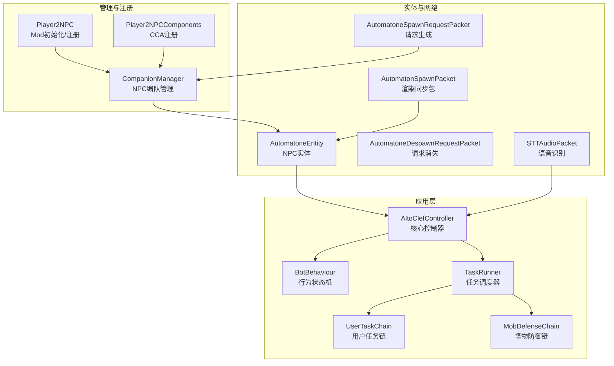
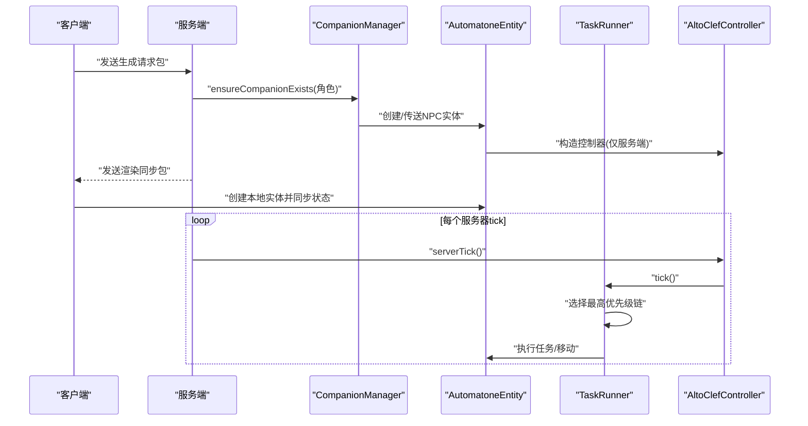
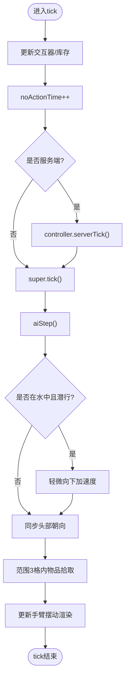
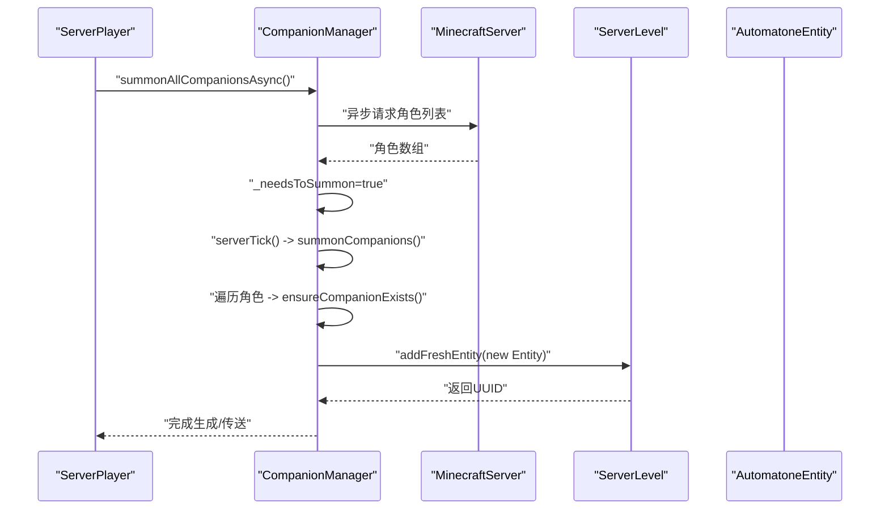
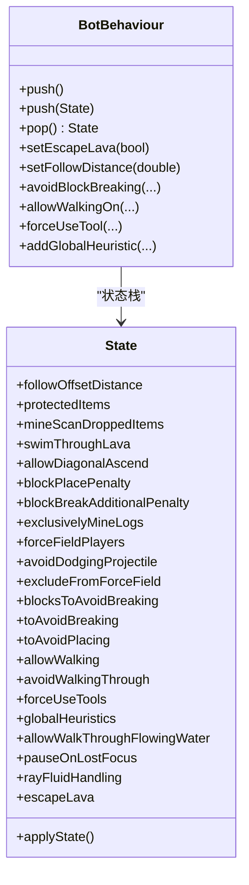
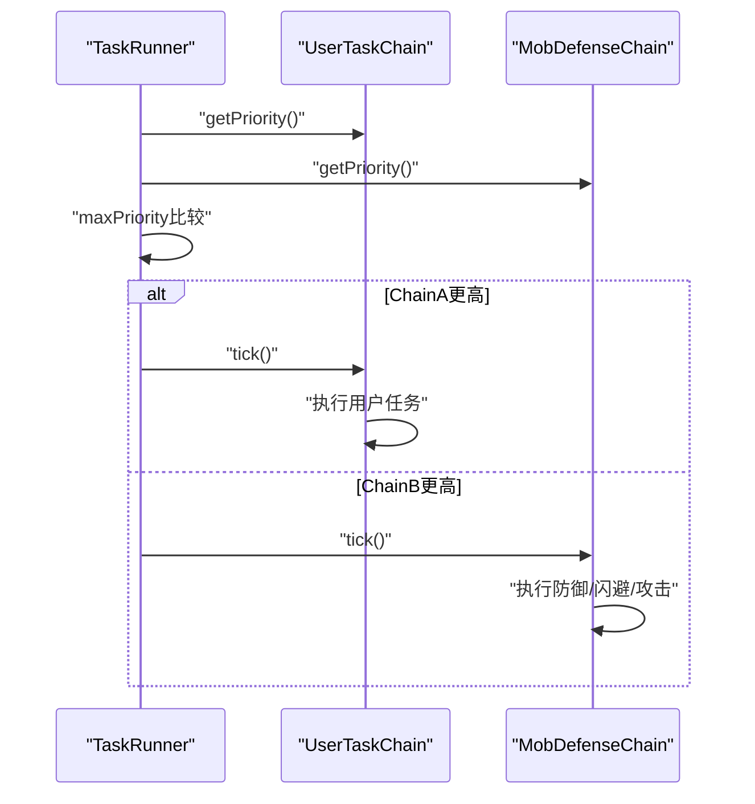
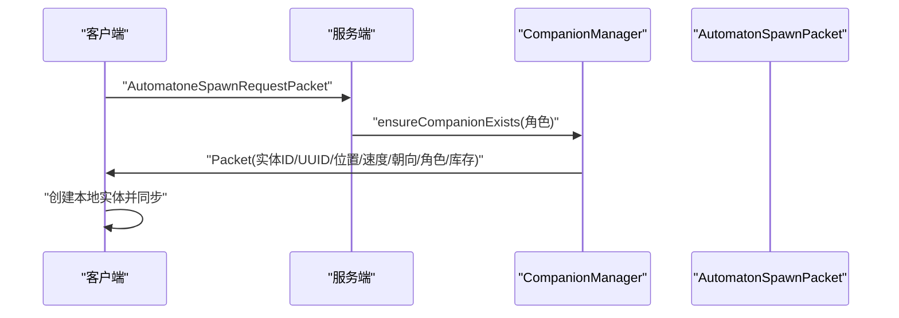
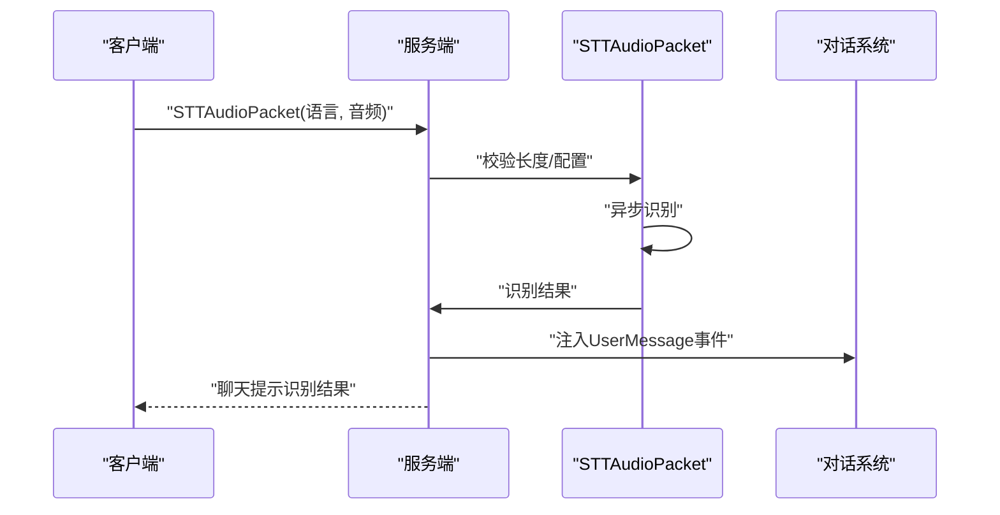
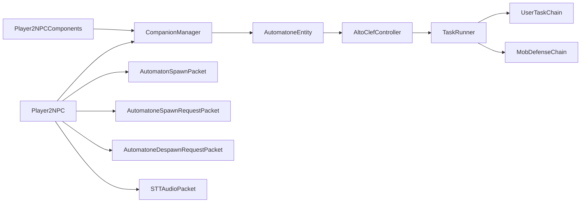

# AI NPC核心系统

<cite>
**本文引用的文件**
- [AutomatoneEntity.java](file://src/main/java/com/goodbird/player2npc/companion/AutomatoneEntity.java)
- [CompanionManager.java](file://src/main/java/com/goodbird/player2npc/companion/CompanionManager.java)
- [BotBehaviour.java](file://src/main/java/adris/altoclef/BotBehaviour.java)
- [AutomatonSpawnPacket.java](file://src/main/java/com/goodbird/player2npc/network/AutomatonSpawnPacket.java)
- [AutomatoneSpawnRequestPacket.java](file://src/main/java/com/goodbird/player2npc/network/AutomatoneSpawnRequestPacket.java)
- [AutomatoneDespawnRequestPacket.java](file://src/main/java/com/goodbird/player2npc/network/AutomatoneDespawnRequestPacket.java)
- [STTAudioPacket.java](file://src/main/java/com/goodbird/player2npc/network/STTAudioPacket.java)
- [Player2NPC.java](file://src/main/java/com/goodbird/player2npc/Player2NPC.java)
- [Player2NPCComponents.java](file://src/main/java/com/goodbird/player2npc/Player2NPCComponents.java)
- [AltoClefController.java](file://src/main/java/adris/altoclef/AltoClefController.java)
- [TaskRunner.java](file://src/main/java/adris/altoclef/tasksystem/TaskRunner.java)
- [TaskChain.java](file://src/main/java/adris/altoclef/tasksystem/TaskChain.java)
- [SingleTaskChain.java](file://src/main/java/adris/altoclef/chains/SingleTaskChain.java)
- [UserTaskChain.java](file://src/main/java/adris/altoclef/chains/UserTaskChain.java)
- [MobDefenseChain.java](file://src/main/java/adris/altoclef/chains/MobDefenseChain.java)
- [AI_NPC项目整体架构概览.md](file://docs/AI_NPC项目整体架构概览.md)
- [AI_NPC游戏指令系统重构.md](file://docs/AI_NPC游戏指令系统重构.md)
</cite>

## 目录
1. [简介](#简介)
2. [项目结构](#项目结构)
3. [核心组件](#核心组件)
4. [架构总览](#架构总览)
5. [详细组件分析](#详细组件分析)
6. [依赖关系分析](#依赖关系分析)
7. [性能考量](#性能考量)
8. [故障排查指南](#故障排查指南)
9. [结论](#结论)
10. [附录](#附录)

## 简介
本文件面向AI NPC核心系统，聚焦以下主题：
- NPC实体管理：AutomatoneEntity的创建、生命周期与渲染同步
- 行为状态机：BotBehaviour的状态栈与动态配置传播
- 任务调度机制：TaskRunner与TaskChain体系，以及行为链优先级
- 管理器与网络：CompanionManager的NPC编队管理、Spawn/Despawn请求与客户端渲染包
- 与其他组件的关系：与AltoClefController、Baritone、对话与情感系统集成

目标是帮助初学者快速理解系统如何工作，同时为资深开发者提供深入的技术细节与排错建议。

## 项目结构
系统采用多层分层架构，核心围绕“NPC实体”“行为状态机”“任务链”“网络同步”展开，并与AI API层（LLM/TTS/STT/Soul）紧密协作。

图表来源
- [Player2NPC.java:48-65](file://src/main/java/com/goodbird/player2npc/Player2NPC.java#L48-L65)
- [Player2NPCComponents.java:10-16](file://src/main/java/com/goodbird/player2npc/Player2NPCComponents.java#L10-L16)
- [CompanionManager.java:28-43](file://src/main/java/com/goodbird/player2npc/companion/CompanionManager.java#L28-L43)
- [AutomatoneEntity.java:50-91](file://src/main/java/com/goodbird/player2npc/companion/AutomatoneEntity.java#L50-L91)
- [AutomatonSpawnPacket.java:26-53](file://src/main/java/com/goodbird/player2npc/network/AutomatonSpawnPacket.java#L26-L53)
- [AutomatoneSpawnRequestPacket.java:24-45](file://src/main/java/com/goodbird/player2npc/network/AutomatoneSpawnRequestPacket.java#L24-L45)
- [AutomatoneDespawnRequestPacket.java:21-44](file://src/main/java/com/goodbird/player2npc/network/AutomatoneDespawnRequestPacket.java#L21-L44)
- [STTAudioPacket.java:28-40](file://src/main/java/com/goodbird/player2npc/network/STTAudioPacket.java#L28-L40)
- [AltoClefController.java:53-134](file://src/main/java/adris/altoclef/AltoClefController.java#L53-L134)
- [TaskRunner.java:9-58](file://src/main/java/adris/altoclef/tasksystem/TaskRunner.java#L9-L58)
- [UserTaskChain.java:14-38](file://src/main/java/adris/altoclef/chains/UserTaskChain.java#L14-L38)
- [MobDefenseChain.java:74-107](file://src/main/java/adris/altoclef/chains/MobDefenseChain.java#L74-L107)

章节来源
- [AI_NPC项目整体架构概览.md:61-83](file://docs/AI_NPC项目整体架构概览.md#L61-L83)

## 核心组件
- AutomatoneEntity：继承LivingEntity并实现IAutomatone/IInventoryProvider/IInteractionManagerProvider/IHungerManagerProvider，负责NPC实体的属性、行为与渲染同步。
- CompanionManager：基于Fabric CCA的ServerTickingComponent，维护每个ServerPlayer的NPC编队映射，支持异步拉取角色、生成/传送/解散NPC。
- BotBehaviour：以状态栈形式封装可变行为参数（如避障、工具使用、射线穿越流体策略等），并在push/pop时将状态应用到Baritone设置。
- TaskRunner/TaskChain/SingleTaskChain：任务调度与链式执行框架；UserTaskChain负责用户命令，MobDefenseChain负责生存与战斗。
- 网络包：AutomatonSpawnPacket用于客户端渲染同步；Spawn/Despawn请求包用于服务端生成/销毁NPC；STTAudioPacket用于语音识别并注入对话事件。

章节来源
- [AutomatoneEntity.java:50-312](file://src/main/java/com/goodbird/player2npc/companion/AutomatoneEntity.java#L50-L312)
- [CompanionManager.java:28-190](file://src/main/java/com/goodbird/player2npc/companion/CompanionManager.java#L28-L190)
- [BotBehaviour.java:22-342](file://src/main/java/adris/altoclef/BotBehaviour.java#L22-L342)
- [TaskRunner.java:9-97](file://src/main/java/adris/altoclef/tasksystem/TaskRunner.java#L9-L97)
- [TaskChain.java:7-49](file://src/main/java/adris/altoclef/tasksystem/TaskChain.java#L7-L49)
- [SingleTaskChain.java:11-51](file://src/main/java/adris/altoclef/chains/SingleTaskChain.java#L11-L51)
- [UserTaskChain.java:14-222](file://src/main/java/adris/altoclef/chains/UserTaskChain.java#L14-L222)
- [MobDefenseChain.java:74-683](file://src/main/java/adris/altoclef/chains/MobDefenseChain.java#L74-L683)
- [AutomatonSpawnPacket.java:26-119](file://src/main/java/com/goodbird/player2npc/network/AutomatonSpawnPacket.java#L26-L119)
- [AutomatoneSpawnRequestPacket.java:24-65](file://src/main/java/com/goodbird/player2npc/network/AutomatoneSpawnRequestPacket.java#L24-L65)
- [AutomatoneDespawnRequestPacket.java:21-63](file://src/main/java/com/goodbird/player2npc/network/AutomatoneDespawnRequestPacket.java#L21-L63)
- [STTAudioPacket.java:28-133](file://src/main/java/com/goodbird/player2npc/network/STTAudioPacket.java#L28-L133)

## 架构总览
系统围绕AltoClefController作为AI核心控制器，统一管理Baritone路径规划、行为状态机、任务链与追踪器。NPC实体由AutomatoneEntity承载，CompanionManager负责编队与生命周期，网络层负责跨客户端/服务端同步与语音输入。

图表来源
- [Player2NPC.java:52-64](file://src/main/java/com/goodbird/player2npc/Player2NPC.java#L52-L64)
- [AutomatoneSpawnRequestPacket.java:57-65](file://src/main/java/com/goodbird/player2npc/network/AutomatoneSpawnRequestPacket.java#L57-L65)
- [CompanionManager.java:100-129](file://src/main/java/com/goodbird/player2npc/companion/CompanionManager.java#L100-L129)
- [AutomatoneEntity.java:94-99](file://src/main/java/com/goodbird/player2npc/companion/AutomatoneEntity.java#L94-L99)
- [AltoClefController.java:136-150](file://src/main/java/adris/altoclef/AltoClefController.java#L136-L150)
- [TaskRunner.java:22-57](file://src/main/java/adris/altoclef/tasksystem/TaskRunner.java#L22-L57)
- [AutomatonSpawnPacket.java:100-119](file://src/main/java/com/goodbird/player2npc/network/AutomatonSpawnPacket.java#L100-L119)

## 详细组件分析

### AutomatoneEntity 实体与生命周期
- 身体属性与行为
  - 初始化速度、步高，设置交互/库存/饥饿管理器
  - 在服务端为实体绑定AltoClefController并发送问候
- 生命周期与Tick
  - tick中更新交互器、库存、noActionTime用于默认攻击判定
  - aiStep中处理水下下沉、头部朝向与物品拾取
- NBT持久化
  - 读写头Yaw、库存、选中槽位、角色信息、所有者UUID
- 渲染同步
  - 重写添加实体包为自定义渲染包，客户端接收后重建实体并同步位置/速度/朝向与库存

图表来源
- [AutomatoneEntity.java:164-188](file://src/main/java/com/goodbird/player2npc/companion/AutomatoneEntity.java#L164-L188)
- [AutomatoneEntity.java:190-210](file://src/main/java/com/goodbird/player2npc/companion/AutomatoneEntity.java#L190-L210)
- [AutomatoneEntity.java:212-242](file://src/main/java/com/goodbird/player2npc/companion/AutomatoneEntity.java#L212-L242)

章节来源
- [AutomatoneEntity.java:78-91](file://src/main/java/com/goodbird/player2npc/companion/AutomatoneEntity.java#L78-L91)
- [AutomatoneEntity.java:118-162](file://src/main/java/com/goodbird/player2npc/companion/AutomatoneEntity.java#L118-L162)
- [AutomatoneEntity.java:164-188](file://src/main/java/com/goodbird/player2npc/companion/AutomatoneEntity.java#L164-L188)
- [AutomatoneEntity.java:190-242](file://src/main/java/com/goodbird/player2npc/companion/AutomatoneEntity.java#L190-L242)
- [AutomatoneEntity.java:298-311](file://src/main/java/com/goodbird/player2npc/companion/AutomatoneEntity.java#L298-L311)

### CompanionManager 编队管理
- 角色拉取与异步生成
  - 登录时异步请求角色列表，标记需要生成
  - serverTick中批量生成/传送/清理不再分配的角色
- 实体生命周期
  - ensureCompanionExists：若存在且存活则传送，否则创建并加入映射
  - dismissCompanion/dismissAllCompanions：按名称或全部移除
- 持久化
  - NBT读写companions映射（角色名->UUID）

图表来源
- [CompanionManager.java:45-74](file://src/main/java/com/goodbird/player2npc/companion/CompanionManager.java#L45-L74)
- [CompanionManager.java:76-98](file://src/main/java/com/goodbird/player2npc/companion/CompanionManager.java#L76-L98)
- [CompanionManager.java:100-129](file://src/main/java/com/goodbird/player2npc/companion/CompanionManager.java#L100-L129)
- [CompanionManager.java:131-150](file://src/main/java/com/goodbird/player2npc/companion/CompanionManager.java#L131-L150)
- [CompanionManager.java:169-175](file://src/main/java/com/goodbird/player2npc/companion/CompanionManager.java#L169-L175)

章节来源
- [CompanionManager.java:28-43](file://src/main/java/com/goodbird/player2npc/companion/CompanionManager.java#L28-L43)
- [CompanionManager.java:45-74](file://src/main/java/com/goodbird/player2npc/companion/CompanionManager.java#L45-L74)
- [CompanionManager.java:76-98](file://src/main/java/com/goodbird/player2npc/companion/CompanionManager.java#L76-L98)
- [CompanionManager.java:100-129](file://src/main/java/com/goodbird/player2npc/companion/CompanionManager.java#L100-L129)
- [CompanionManager.java:131-150](file://src/main/java/com/goodbird/player2npc/companion/CompanionManager.java#L131-L150)
- [CompanionManager.java:169-190](file://src/main/java/com/goodbird/player2npc/companion/CompanionManager.java#L169-L190)

### BotBehaviour 行为状态机
- 状态栈模式
  - push：复制当前状态或新建空状态
  - pop：丢弃当前状态并回滚到上一个状态
  - applyState：将当前状态写入Baritone与扩展设置
- 可变行为参数
  - 追随距离、掉落物扫描、游泳穿越熔岩、对角上升、放置/破坏惩罚、仅挖原木、强制玩家力场、避免投射物、工具强制使用、全局启发式、流体射线处理、暂停失焦等
- 与TaskRunner协作
  - TaskRunner在启用时push状态，禁用时pop状态，确保行为参数正确恢复

图表来源
- [BotBehaviour.java:187-213](file://src/main/java/adris/altoclef/BotBehaviour.java#L187-L213)
- [BotBehaviour.java:224-341](file://src/main/java/adris/altoclef/BotBehaviour.java#L224-L341)

章节来源
- [BotBehaviour.java:22-342](file://src/main/java/adris/altoclef/BotBehaviour.java#L22-L342)
- [TaskRunner.java:64-76](file://src/main/java/adris/altoclef/tasksystem/TaskRunner.java#L64-L76)

### 任务调度机制：TaskRunner 与行为链
- TaskRunner
  - 遍历所有激活的TaskChain，选择优先级最高的链执行
  - 切换链时调用onInterrupt，记录状态报告
- TaskChain/SingleTaskChain
  - TaskChain缓存当前链的任务列表，支持优先级、活跃性与名称
  - SingleTaskChain管理单一主任务，支持重置、中断与完成回调
- 行为链
  - UserTaskChain：用户命令链，优先级50，支持距离监控与自动返回
  - MobDefenseChain：怪物防御链，动态计算优先级，支持盾牌、闪避、击杀等

图表来源
- [TaskRunner.java:22-57](file://src/main/java/adris/altoclef/tasksystem/TaskRunner.java#L22-L57)
- [UserTaskChain.java:124-126](file://src/main/java/adris/altoclef/chains/UserTaskChain.java#L124-L126)
- [MobDefenseChain.java:152-167](file://src/main/java/adris/altoclef/chains/MobDefenseChain.java#L152-L167)

章节来源
- [TaskRunner.java:9-97](file://src/main/java/adris/altoclef/tasksystem/TaskRunner.java#L9-L97)
- [TaskChain.java:7-49](file://src/main/java/adris/altoclef/tasksystem/TaskChain.java#L7-L49)
- [SingleTaskChain.java:11-51](file://src/main/java/adris/altoclef/chains/SingleTaskChain.java#L11-L51)
- [UserTaskChain.java:14-222](file://src/main/java/adris/altoclef/chains/UserTaskChain.java#L14-L222)
- [MobDefenseChain.java:74-683](file://src/main/java/adris/altoclef/chains/MobDefenseChain.java#L74-L683)
- [AI_NPC游戏指令系统重构.md:1475-1511](file://docs/AI_NPC游戏指令系统重构.md#L1475-L1511)

### 网络与渲染同步
- 生成请求
  - 客户端发送角色信息请求生成，服务端通过CompanionManager确保实体存在
- 消失请求
  - 客户端发送角色信息请求消失，服务端移除对应实体
- 渲染同步
  - 服务端在实体添加包中发送自定义包，包含实体ID、UUID、位置、速度、朝向、角色与库存
  - 客户端接收后创建本地实体并同步状态

图表来源
- [AutomatoneSpawnRequestPacket.java:57-65](file://src/main/java/com/goodbird/player2npc/network/AutomatoneSpawnRequestPacket.java#L57-L65)
- [AutomatonSpawnPacket.java:70-93](file://src/main/java/com/goodbird/player2npc/network/AutomatonSpawnPacket.java#L70-L93)
- [AutomatonSpawnPacket.java:100-119](file://src/main/java/com/goodbird/player2npc/network/AutomatonSpawnPacket.java#L100-L119)

章节来源
- [AutomatoneSpawnRequestPacket.java:24-65](file://src/main/java/com/goodbird/player2npc/network/AutomatoneSpawnRequestPacket.java#L24-L65)
- [AutomatoneDespawnRequestPacket.java:21-63](file://src/main/java/com/goodbird/player2npc/network/AutomatoneDespawnRequestPacket.java#L21-L63)
- [AutomatonSpawnPacket.java:26-119](file://src/main/java/com/goodbird/player2npc/network/AutomatonSpawnPacket.java#L26-L119)

### 语音输入与对话注入
- 客户端发送STT音频包（含语言、长度、音频数据）
- 服务端校验长度与配置，异步进行语音识别
- 将识别结果作为UserMessage注入对话系统，同时通知玩家

图表来源
- [STTAudioPacket.java:39-121](file://src/main/java/com/goodbird/player2npc/network/STTAudioPacket.java#L39-L121)
- [STTAudioPacket.java:126-132](file://src/main/java/com/goodbird/player2npc/network/STTAudioPacket.java#L126-L132)

章节来源
- [STTAudioPacket.java:28-133](file://src/main/java/com/goodbird/player2npc/network/STTAudioPacket.java#L28-L133)

## 依赖关系分析
- Player2NPC负责实体类型注册、全局网络接收器注册、连接/断开事件与服务器tick桥接
- Player2NPCComponents将CompanionManager注册为ServerPlayer的组件
- AutomatoneEntity依赖Baritone接口以实现自动化行为
- AltoClefController整合AI模块、任务链与Baritone设置

图表来源
- [Player2NPC.java:48-65](file://src/main/java/com/goodbird/player2npc/Player2NPC.java#L48-L65)
- [Player2NPCComponents.java:12-15](file://src/main/java/com/goodbird/player2npc/Player2NPCComponents.java#L12-L15)
- [CompanionManager.java:28-43](file://src/main/java/com/goodbird/player2npc/companion/CompanionManager.java#L28-L43)
- [AutomatoneEntity.java:50-91](file://src/main/java/com/goodbird/player2npc/companion/AutomatoneEntity.java#L50-L91)
- [AltoClefController.java:53-134](file://src/main/java/adris/altoclef/AltoClefController.java#L53-L134)
- [TaskRunner.java:9-58](file://src/main/java/adris/altoclef/tasksystem/TaskRunner.java#L9-L58)
- [UserTaskChain.java:14-38](file://src/main/java/adris/altoclef/chains/UserTaskChain.java#L14-L38)
- [MobDefenseChain.java:74-107](file://src/main/java/adris/altoclef/chains/MobDefenseChain.java#L74-L107)

章节来源
- [Player2NPC.java:25-65](file://src/main/java/com/goodbird/player2npc/Player2NPC.java#L25-L65)
- [Player2NPCComponents.java:10-16](file://src/main/java/com/goodbird/player2npc/Player2NPCComponents.java#L10-L16)
- [AltoClefController.java:53-134](file://src/main/java/adris/altoclef/AltoClefController.java#L53-L134)

## 性能考量
- 异步角色拉取：CompanionManager在登录时异步拉取角色列表，避免阻塞主线程
- 任务链优先级：UserTaskChain优先级50，MobDefenseChain在危险时可达70+，需注意打断用户任务
- 渲染包压缩：AutomatonSpawnPacket对速度进行量化压缩，减少带宽占用
- STT异步：服务端线程池异步识别，避免阻塞网络线程

章节来源
- [CompanionManager.java:45-74](file://src/main/java/com/goodbird/player2npc/companion/CompanionManager.java#L45-L74)
- [AI_NPC游戏指令系统重构.md:1475-1511](file://docs/AI_NPC游戏指令系统重构.md#L1475-L1511)
- [AutomatonSpawnPacket.java:77-93](file://src/main/java/com/goodbird/player2npc/network/AutomatonSpawnPacket.java#L77-L93)
- [STTAudioPacket.java:66-121](file://src/main/java/com/goodbird/player2npc/network/STTAudioPacket.java#L66-L121)

## 故障排查指南
- NPC不显示或渲染异常
  - 检查服务端是否发送渲染包，客户端是否成功创建本地实体
  - 确认实体ID/UUID/位置/速度/朝向同步是否完整
- 无法生成NPC
  - 检查Spawn请求包是否到达服务端，角色信息是否为空
  - 确认CompanionManager.ensureCompanionExists流程是否执行
- 任务被频繁打断
  - 检查MobDefenseChain优先级是否超过UserTaskChain
  - 调整BotBehaviour中的避障/工具使用/射线处理等参数
- 语音识别无效
  - 检查音频长度是否小于最小阈值
  - 确认STT配置已启用且API Key有效

章节来源
- [AutomatonSpawnPacket.java:100-119](file://src/main/java/com/goodbird/player2npc/network/AutomatonSpawnPacket.java#L100-L119)
- [AutomatoneSpawnRequestPacket.java:57-65](file://src/main/java/com/goodbird/player2npc/network/AutomatoneSpawnRequestPacket.java#L57-L65)
- [CompanionManager.java:100-129](file://src/main/java/com/goodbird/player2npc/companion/CompanionManager.java#L100-L129)
- [AI_NPC游戏指令系统重构.md:1475-1511](file://docs/AI_NPC游戏指令系统重构.md#L1475-L1511)
- [STTAudioPacket.java:56-81](file://src/main/java/com/goodbird/player2npc/network/STTAudioPacket.java#L56-L81)

## 结论
AI NPC核心系统通过“实体-管理器-状态机-任务链-网络”的清晰分层，实现了可扩展、可配置的NPC行为体系。BotBehaviour的状态栈让行为参数具备动态可调性；TaskRunner与行为链保证了任务的有序执行与优先级控制；CompanionManager与网络包确保了NPC的生命周期与渲染同步。结合AltoClefController与Baritone，系统在生存、移动、交互等方面提供了强大的自动化能力。

## 附录
- 配置与参数
  - BotBehaviour参数：遵循状态栈push/pop机制，运行时通过方法修改并applyState
  - TaskRunner：启用时push状态，禁用时pop状态，避免行为参数泄漏
  - UserTaskChain：优先级50，支持距离监控与自动返回
  - MobDefenseChain：动态优先级，受健康值、投射物、盾牌等因素影响
- 返回值与行为
  - ensureCompanionExists：若实体不存在则创建并返回UUID
  - serverTick：每tick推进控制器、任务链与Baritone
  - STTAudioPacket：识别成功后注入UserMessage事件并通知玩家

章节来源
- [BotBehaviour.java:265-340](file://src/main/java/adris/altoclef/BotBehaviour.java#L265-L340)
- [TaskRunner.java:64-84](file://src/main/java/adris/altoclef/tasksystem/TaskRunner.java#L64-L84)
- [UserTaskChain.java:124-126](file://src/main/java/adris/altoclef/chains/UserTaskChain.java#L124-L126)
- [MobDefenseChain.java:152-167](file://src/main/java/adris/altoclef/chains/MobDefenseChain.java#L152-L167)
- [CompanionManager.java:100-129](file://src/main/java/com/goodbird/player2npc/companion/CompanionManager.java#L100-L129)
- [AltoClefController.java:136-150](file://src/main/java/adris/altoclef/AltoClefController.java#L136-L150)
- [STTAudioPacket.java:104-111](file://src/main/java/com/goodbird/player2npc/network/STTAudioPacket.java#L104-L111)