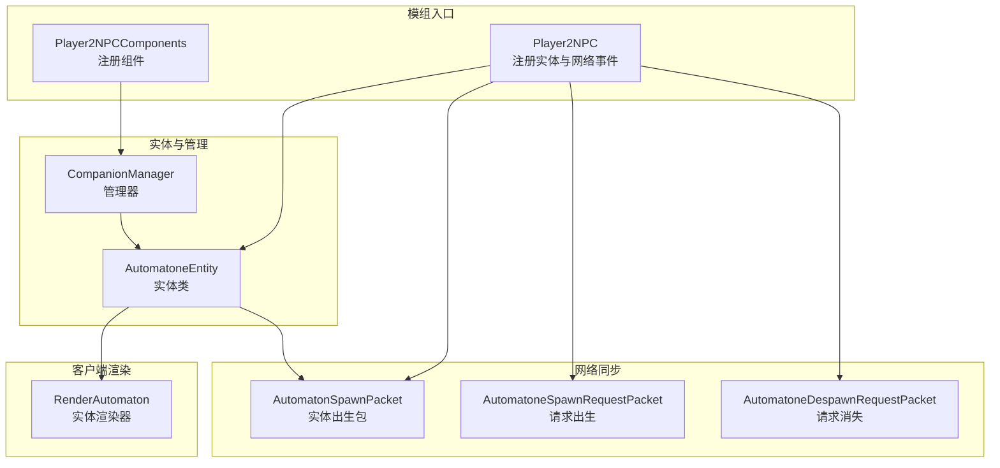
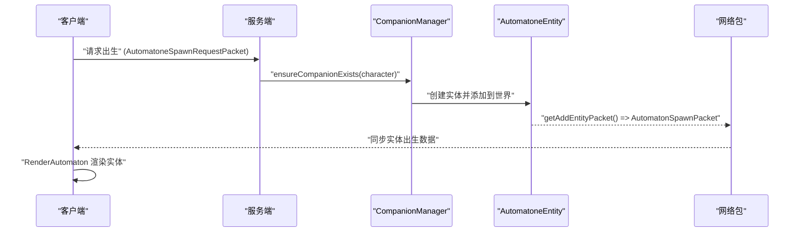
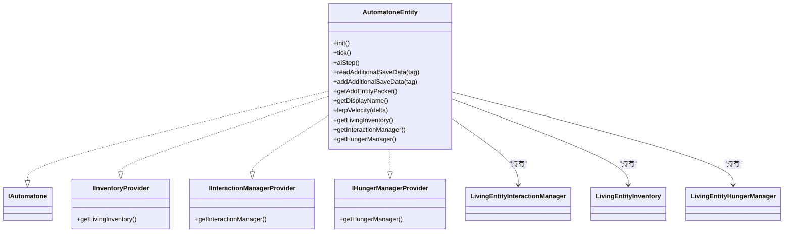
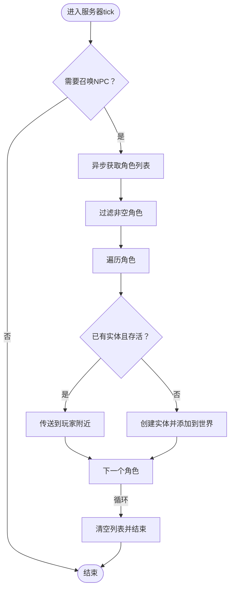
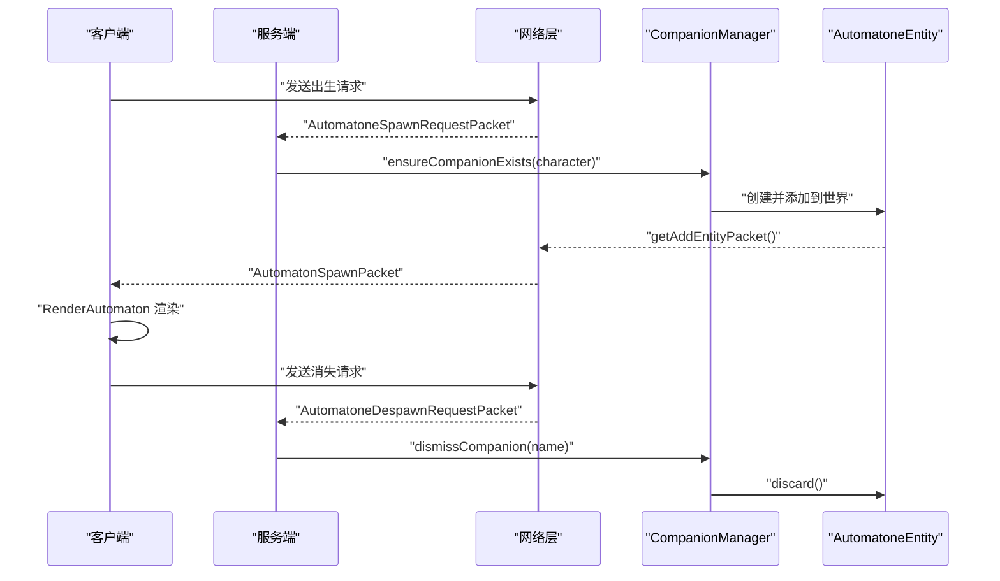
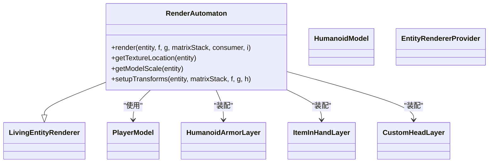
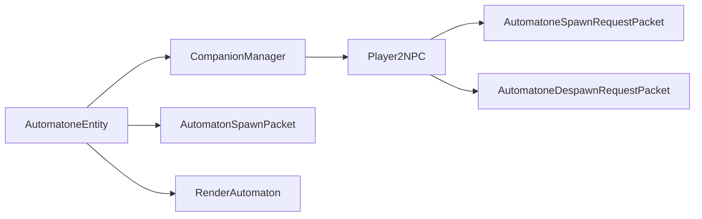

# NPC实体管理

<cite>
**本文引用的文件**
- [AutomatoneEntity.java](file://src/main/java/com/goodbird/player2npc/companion/AutomatoneEntity.java)
- [CompanionManager.java](file://src/main/java/com/goodbird/player2npc/companion/CompanionManager.java)
- [AutomatonSpawnPacket.java](file://src/main/java/com/goodbird/player2npc/network/AutomatonSpawnPacket.java)
- [AutomatoneSpawnRequestPacket.java](file://src/main/java/com/goodbird/player2npc/network/AutomatoneSpawnRequestPacket.java)
- [AutomatoneDespawnRequestPacket.java](file://src/main/java/com/goodbird/player2npc/network/AutomatoneDespawnRequestPacket.java)
- [Player2NPC.java](file://src/main/java/com/goodbird/player2npc/Player2NPC.java)
- [Player2NPCComponents.java](file://src/main/java/com/goodbird/player2npc/Player2NPCComponents.java)
- [RenderAutomaton.java](file://src/main/java/com/goodbird/player2npc/client/render/RenderAutomaton.java)
- [README.md](file://README.md)
</cite>

## 目录
1. [简介](#简介)
2. [项目结构](#项目结构)
3. [核心组件](#核心组件)
4. [架构总览](#架构总览)
5. [详细组件分析](#详细组件分析)
6. [依赖关系分析](#依赖关系分析)
7. [性能考量](#性能考量)
8. [故障排除指南](#故障排除指南)
9. [结论](#结论)
10. [附录](#附录)

## 简介
本技术文档聚焦于NPC实体管理系统，围绕AutomatoneEntity实体类与CompanionManager管理器展开，深入解析实体创建、生命周期管理、属性配置与接口实现；阐述CompanionManager如何协调多个NPC实体，包括实体注册、状态同步与资源管理；详解实体的NBT序列化机制、网络同步协议与渲染系统；并结合Baritone集成、库存系统与饥饿管理机制，提供常见问题解决方案与性能优化建议。文档同时给出实体创建流程、配置选项与参数说明的代码示例路径，帮助开发者快速上手与扩展。

## 项目结构
该模块位于com.goodbird.player2npc包下，核心文件包括：
- 实体与管理：AutomatoneEntity、CompanionManager
- 网络同步：AutomatonSpawnPacket、AutomatoneSpawnRequestPacket、AutomatoneDespawnRequestPacket
- 模组入口与注册：Player2NPC、Player2NPCComponents
- 客户端渲染：RenderAutomaton

图表来源
- [Player2NPC.java:1-67](file://src/main/java/com/goodbird/player2npc/Player2NPC.java#L1-L67)
- [Player2NPCComponents.java:1-17](file://src/main/java/com/goodbird/player2npc/Player2NPCComponents.java#L1-L17)
- [AutomatoneEntity.java:1-313](file://src/main/java/com/goodbird/player2npc/companion/AutomatoneEntity.java#L1-L313)
- [CompanionManager.java:1-191](file://src/main/java/com/goodbird/player2npc/companion/CompanionManager.java#L1-L191)
- [AutomatonSpawnPacket.java:1-120](file://src/main/java/com/goodbird/player2npc/network/AutomatonSpawnPacket.java#L1-L120)
- [AutomatoneSpawnRequestPacket.java:1-67](file://src/main/java/com/goodbird/player2npc/network/AutomatoneSpawnRequestPacket.java#L1-L67)
- [AutomatoneDespawnRequestPacket.java:1-65](file://src/main/java/com/goodbird/player2npc/network/AutomatoneDespawnRequestPacket.java#L1-L65)
- [RenderAutomaton.java:1-177](file://src/main/java/com/goodbird/player2npc/client/render/RenderAutomaton.java#L1-L177)

章节来源
- [Player2NPC.java:1-67](file://src/main/java/com/goodbird/player2npc/Player2NPC.java#L1-L67)
- [Player2NPCComponents.java:1-17](file://src/main/java/com/goodbird/player2npc/Player2NPCComponents.java#L1-L17)

## 核心组件
- AutomatoneEntity：继承LivingEntity，实现IAutomatone、IInventoryProvider、IInteractionManagerProvider、IHungerManagerProvider，负责实体初始化、NBT序列化、tick更新、交互与渲染。
- CompanionManager：作为服务器端组件，管理每个玩家的NPC实体集合，负责批量召唤、状态同步与资源清理。
- 网络包：AutomatonSpawnPacket用于客户端渲染同步；AutomatoneSpawnRequestPacket与AutomatoneDespawnRequestPacket用于服务端触发实体创建与销毁。
- 模组入口：Player2NPC注册实体类型、网络接收器与生命周期事件；Player2NPCComponents注册组件到ServerPlayer。

章节来源
- [AutomatoneEntity.java:41-116](file://src/main/java/com/goodbird/player2npc/companion/AutomatoneEntity.java#L41-L116)
- [CompanionManager.java:28-191](file://src/main/java/com/goodbird/player2npc/companion/CompanionManager.java#L28-L191)
- [AutomatonSpawnPacket.java:26-120](file://src/main/java/com/goodbird/player2npc/network/AutomatonSpawnPacket.java#L26-L120)
- [AutomatoneSpawnRequestPacket.java:24-67](file://src/main/java/com/goodbird/player2npc/network/AutomatoneSpawnRequestPacket.java#L24-L67)
- [AutomatoneDespawnRequestPacket.java:21-65](file://src/main/java/com/goodbird/player2npc/network/AutomatoneDespawnRequestPacket.java#L21-L65)
- [Player2NPC.java:25-67](file://src/main/java/com/goodbird/player2npc/Player2NPC.java#L25-L67)
- [Player2NPCComponents.java:9-17](file://src/main/java/com/goodbird/player2npc/Player2NPCComponents.java#L9-L17)

## 架构总览
系统围绕“实体—管理器—网络—渲染”的分层设计：
- 实体层：AutomatoneEntity承载AI行为、交互与状态。
- 管理层：CompanionManager在服务器端维护玩家与实体映射，负责批量操作。
- 网络层：通过Fabric网络API实现服务端与客户端之间的实体同步与控制。
- 渲染层：RenderAutomaton基于实体数据绘制模型与纹理。

图表来源
- [AutomatoneSpawnRequestPacket.java:57-65](file://src/main/java/com/goodbird/player2npc/network/AutomatoneSpawnRequestPacket.java#L57-L65)
- [CompanionManager.java:100-129](file://src/main/java/com/goodbird/player2npc/companion/CompanionManager.java#L100-L129)
- [AutomatoneEntity.java:298-302](file://src/main/java/com/goodbird/player2npc/companion/AutomatoneEntity.java#L298-L302)
- [AutomatonSpawnPacket.java:70-74](file://src/main/java/com/goodbird/player2npc/network/AutomatonSpawnPacket.java#L70-L74)

## 详细组件分析

### AutomatoneEntity 实体类
- 接口实现与职责
  - IAutomatone：标记实体为“自动机”，便于系统识别与追踪。
  - IInventoryProvider：提供LivingEntityInventory，模拟玩家式库存。
  - IInteractionManagerProvider：提供LivingEntityInteractionManager，模拟玩家式交互（破坏/放置/使用）。
  - IHungerManagerProvider：提供LivingEntityHungerManager，模拟饥饿系统。
- 初始化与属性
  - init()设置步高与移动速度；构造函数支持两种创建方式：注册创建与手动创建（带Character与Owner）。
  - getLivingInventory()/getInteractionManager()/getHungerManager()提供上述管理器的访问。
- 生命周期与Tick
  - tick()更新交互管理器、库存、noActionTime（用于攻击判定），并在服务端调用controller.serverTick()。
  - aiStep()调整水中的运动、同步头部朝向、拾取物品。
- NBT序列化
  - readAdditionalSaveData/addAdditionalSaveData：保存/恢复头部朝向、库存、当前选中槽位、Character信息与Owner UUID。
- 网络同步
  - getAddEntityPacket()重写为AutomatonSpawnPacket，确保客户端接收实体出生数据。
- 渲染与显示名
  - getDisplayName()返回Character.shortName()；lerpVelocity()用于平滑动画插值；RenderAutomaton根据Character.skinURL加载纹理。

图表来源
- [AutomatoneEntity.java:41-116](file://src/main/java/com/goodbird/player2npc/companion/AutomatoneEntity.java#L41-L116)
- [AutomatoneEntity.java:118-177](file://src/main/java/com/goodbird/player2npc/companion/AutomatoneEntity.java#L118-L177)
- [AutomatoneEntity.java:298-312](file://src/main/java/com/goodbird/player2npc/companion/AutomatoneEntity.java#L298-L312)

章节来源
- [AutomatoneEntity.java:41-116](file://src/main/java/com/goodbird/player2npc/companion/AutomatoneEntity.java#L41-L116)
- [AutomatoneEntity.java:118-177](file://src/main/java/com/goodbird/player2npc/companion/AutomatoneEntity.java#L118-L177)
- [AutomatoneEntity.java:179-210](file://src/main/java/com/goodbird/player2npc/companion/AutomatoneEntity.java#L179-L210)
- [AutomatoneEntity.java:212-250](file://src/main/java/com/goodbird/player2npc/companion/AutomatoneEntity.java#L212-L250)
- [AutomatoneEntity.java:251-283](file://src/main/java/com/goodbird/player2npc/companion/AutomatoneEntity.java#L251-L283)
- [AutomatoneEntity.java:284-297](file://src/main/java/com/goodbird/player2npc/companion/AutomatoneEntity.java#L284-L297)
- [AutomatoneEntity.java:298-312](file://src/main/java/com/goodbird/player2npc/companion/AutomatoneEntity.java#L298-L312)

### CompanionManager 管理器
- 组件注册与作用域
  - 通过Player2NPCComponents注册到ServerPlayer，每个玩家拥有独立的CompanionManager实例。
- 实体生命周期管理
  - ensureCompanionExists：若存在则传送，否则创建并添加到世界，记录UUID映射。
  - dismissCompanion/dismissAllCompanions：按名称或全部移除实体。
  - getActiveCompanions：遍历所有世界查找存活实体。
- 批量操作与状态同步
  - summonAllCompanionsAsync：异步拉取Character列表并标记_needsToSummon=true。
  - serverTick：在下一tick执行批量召唤，随后清零标志。
- NBT持久化
  - readFromNbt/writeToNbt：保存/恢复companion映射（name->uuid）。

图表来源
- [CompanionManager.java:45-74](file://src/main/java/com/goodbird/player2npc/companion/CompanionManager.java#L45-L74)
- [CompanionManager.java:76-98](file://src/main/java/com/goodbird/player2npc/companion/CompanionManager.java#L76-L98)
- [CompanionManager.java:100-129](file://src/main/java/com/goodbird/player2npc/companion/CompanionManager.java#L100-L129)
- [CompanionManager.java:169-175](file://src/main/java/com/goodbird/player2npc/companion/CompanionManager.java#L169-L175)

章节来源
- [CompanionManager.java:28-191](file://src/main/java/com/goodbird/player2npc/companion/CompanionManager.java#L28-L191)

### 网络同步协议
- 实体出生包
  - AutomatonSpawnPacket：封装实体ID、UUID、位置、速度、旋转角、Character与Inventory，客户端接收后创建本地实体并填充数据。
- 请求出生/消失
  - AutomatoneSpawnRequestPacket：客户端发送请求，服务端通过CompanionManager.ensureCompanionExists创建实体。
  - AutomatoneDespawnRequestPacket：客户端发送请求，服务端通过CompanionManager.dismissCompanion移除实体。
- 模组入口注册
  - Player2NPC注册实体类型与全局网络接收器，并在连接加入/断开时触发批量召唤/清理。

图表来源
- [AutomatoneSpawnRequestPacket.java:57-65](file://src/main/java/com/goodbird/player2npc/network/AutomatoneSpawnRequestPacket.java#L57-L65)
- [AutomatoneDespawnRequestPacket.java:56-63](file://src/main/java/com/goodbird/player2npc/network/AutomatoneDespawnRequestPacket.java#L56-L63)
- [AutomatonSpawnPacket.java:100-119](file://src/main/java/com/goodbird/player2npc/network/AutomatonSpawnPacket.java#L100-L119)
- [Player2NPC.java:48-65](file://src/main/java/com/goodbird/player2npc/Player2NPC.java#L48-L65)

章节来源
- [AutomatonSpawnPacket.java:26-120](file://src/main/java/com/goodbird/player2npc/network/AutomatonSpawnPacket.java#L26-L120)
- [AutomatoneSpawnRequestPacket.java:24-67](file://src/main/java/com/goodbird/player2npc/network/AutomatoneSpawnRequestPacket.java#L24-L67)
- [AutomatoneDespawnRequestPacket.java:21-65](file://src/main/java/com/goodbird/player2npc/network/AutomatoneDespawnRequestPacket.java#L21-L65)
- [Player2NPC.java:25-67](file://src/main/java/com/goodbird/player2npc/Player2NPC.java#L25-L67)

### 渲染系统
- RenderAutomaton
  - 继承LivingEntityRenderer，装配装甲、主手物品、箭矢、头颅、鞘翅、旋风攻击与蜂刺等层。
  - getTextureLocation：优先使用Character.skinURL加载皮肤，失败回退至默认Steve纹理。
  - render：捕获异常并记录日志，避免渲染崩溃影响游戏体验。
- 动画与姿态
  - 根据实体动作（使用、跨弩、游泳、飞行）设置HumanoidModel.ArmPose，保证动画一致性。

图表来源
- [RenderAutomaton.java:39-177](file://src/main/java/com/goodbird/player2npc/client/render/RenderAutomaton.java#L39-L177)

章节来源
- [RenderAutomaton.java:39-177](file://src/main/java/com/goodbird/player2npc/client/render/RenderAutomaton.java#L39-L177)

## 依赖关系分析
- 组件耦合与内聚
  - CompanionManager与AutomatoneEntity：通过UUID映射关联，管理实体生命周期；低耦合，职责清晰。
  - Player2NPC与网络包：集中注册实体类型与网络接收器，形成统一入口。
  - RenderAutomaton与AutomatoneEntity：通过Character.skinURL与实体数据进行渲染，解耦实体逻辑与视觉表现。
- 外部依赖
  - Baritone接口：IAutomatone、IInventoryProvider、IInteractionManagerProvider、IHungerManagerProvider。
  - Fabric网络API：用于包的序列化/反序列化与S2C/C2S通信。
  - CCA组件API：为ServerPlayer注册CompanionManager组件。

图表来源
- [AutomatoneEntity.java:41-116](file://src/main/java/com/goodbird/player2npc/companion/AutomatoneEntity.java#L41-L116)
- [CompanionManager.java:28-191](file://src/main/java/com/goodbird/player2npc/companion/CompanionManager.java#L28-L191)
- [AutomatonSpawnPacket.java:26-120](file://src/main/java/com/goodbird/player2npc/network/AutomatonSpawnPacket.java#L26-L120)
- [AutomatoneSpawnRequestPacket.java:24-67](file://src/main/java/com/goodbird/player2npc/network/AutomatoneSpawnRequestPacket.java#L24-L67)
- [AutomatoneDespawnRequestPacket.java:21-65](file://src/main/java/com/goodbird/player2npc/network/AutomatoneDespawnRequestPacket.java#L21-L65)
- [Player2NPC.java:25-67](file://src/main/java/com/goodbird/player2npc/Player2NPC.java#L25-L67)
- [RenderAutomaton.java:39-177](file://src/main/java/com/goodbird/player2npc/client/render/RenderAutomaton.java#L39-L177)

章节来源
- [Player2NPCComponents.java:9-17](file://src/main/java/com/goodbird/player2npc/Player2NPCComponents.java#L9-L17)

## 性能考量
- tick开销控制
  - AutomatoneEntity.tick()仅在服务端调用controller.serverTick()，客户端仅更新交互与库存，避免重复计算。
  - 自动拾取范围限制为3格，减少实体扫描成本。
- 网络带宽优化
  - AutomatonSpawnPacket对速度进行量化压缩（short范围），角度使用字节编码，降低包体积。
- 渲染稳定性
  - RenderAutomaton在渲染过程中捕获异常并记录日志，防止个别实体导致全局渲染中断。
- 批量操作异步化
  - CompanionManager.summonAllCompanionsAsync使用CompletableFuture异步获取角色列表，避免阻塞服务器线程。

章节来源
- [AutomatoneEntity.java:164-177](file://src/main/java/com/goodbird/player2npc/companion/AutomatoneEntity.java#L164-L177)
- [AutomatoneEntity.java:190-210](file://src/main/java/com/goodbird/player2npc/companion/AutomatoneEntity.java#L190-L210)
- [AutomatonSpawnPacket.java:77-93](file://src/main/java/com/goodbird/player2npc/network/AutomatonSpawnPacket.java#L77-L93)
- [RenderAutomaton.java:52-59](file://src/main/java/com/goodbird/player2npc/client/render/RenderAutomaton.java#L52-L59)
- [CompanionManager.java:45-74](file://src/main/java/com/goodbird/player2npc/companion/CompanionManager.java#L45-L74)

## 故障排除指南
- 实体无法生成
  - 检查服务端是否正确注册实体类型与网络接收器；确认请求包是否到达服务端。
  - 章节来源: [Player2NPC.java:48-65](file://src/main/java/com/goodbird/player2npc/Player2NPC.java#L48-L65)
- 实体生成但不渲染
  - 检查AutomatonSpawnPacket是否正确写入Character与Inventory；确认客户端handle逻辑是否执行。
  - 章节来源: [AutomatonSpawnPacket.java:100-119](file://src/main/java/com/goodbird/player2npc/network/AutomatonSpawnPacket.java#L100-L119)
- 皮肤加载失败
  - RenderAutomaton回退到默认Steve纹理；检查Character.skinURL有效性与网络可达性。
  - 章节来源: [RenderAutomaton.java:140-153](file://src/main/java/com/goodbird/player2npc/client/render/RenderAutomaton.java#L140-L153)
- NPC不执行动作
  - 确认noActionTime在doHurtTarget中被重置；检查Baritone控制器是否在服务端初始化。
  - 章节来源: [AutomatoneEntity.java:212-242](file://src/main/java/com/goodbird/player2npc/companion/AutomatoneEntity.java#L212-L242)
- 批量召唤未生效
  - 检查summonAllCompanionsAsync是否被调用；确认serverTick中_needsToSummon标志被处理。
  - 章节来源: [CompanionManager.java:45-74](file://src/main/java/com/goodbird/player2npc/companion/CompanionManager.java#L45-L74), [CompanionManager.java:169-175](file://src/main/java/com/goodbird/player2npc/companion/CompanionManager.java#L169-L175)

## 结论
NPC实体管理系统通过AutomatoneEntity与CompanionManager实现了从实体创建、生命周期管理到网络同步与渲染的完整闭环。系统采用接口化设计与Fabric网络API，确保了良好的扩展性与性能。Baritone集成提供了强大的交互与行为能力，而渲染层则保证了视觉表现的一致性与稳定性。通过合理的异步化与带宽优化，系统能够在复杂场景下保持流畅运行。

## 附录

### 实体创建流程与配置选项
- 实体创建流程
  - 客户端发送出生请求（AutomatoneSpawnRequestPacket）→ 服务端CompanionManager.ensureCompanionExists → 创建AutomatoneEntity并添加到世界 → 服务端返回AutomatonSpawnPacket → 客户端渲染。
  - 章节来源: [AutomatoneSpawnRequestPacket.java:57-65](file://src/main/java/com/goodbird/player2npc/network/AutomatoneSpawnRequestPacket.java#L57-L65), [CompanionManager.java:100-129](file://src/main/java/com/goodbird/player2npc/companion/CompanionManager.java#L100-L129), [AutomatonSpawnPacket.java:70-74](file://src/main/java/com/goodbird/player2npc/network/AutomatonSpawnPacket.java#L70-L74), [RenderAutomaton.java:100-119](file://src/main/java/com/goodbird/player2npc/client/render/RenderAutomaton.java#L100-L119)
- NBT序列化要点
  - 保存/恢复：head_yaw、Inventory、SelectedItemSlot、character、owner_uuid。
  - 章节来源: [AutomatoneEntity.java:118-162](file://src/main/java/com/goodbird/player2npc/companion/AutomatoneEntity.java#L118-L162)
- 配置与参数
  - README中提供了完整的配置文件说明与交互指南，包括LLM/TTS/STT配置、Bot行为配置与运行时状态文件位置。
  - 章节来源: [README.md:162-277](file://README.md#L162-L277), [README.md:397-491](file://README.md#L397-L491)