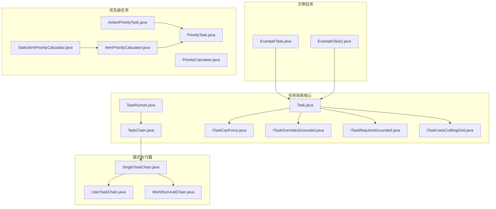
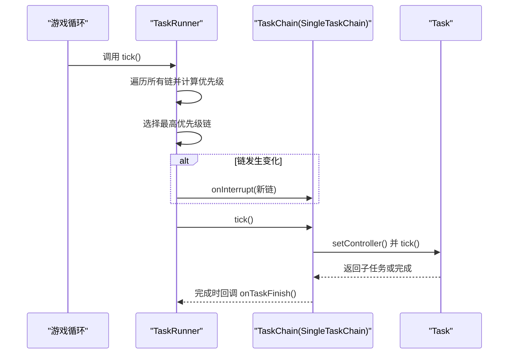
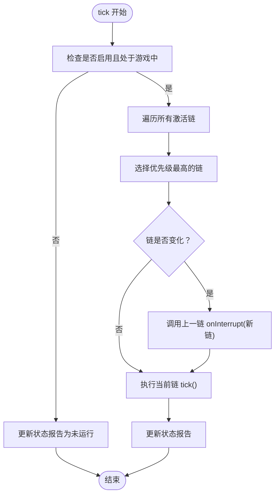
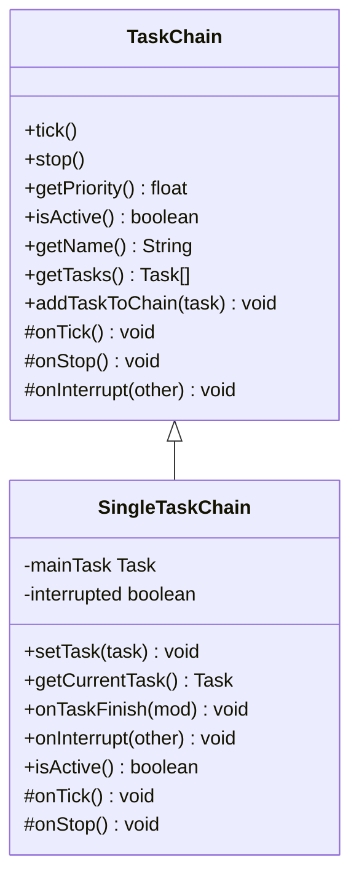
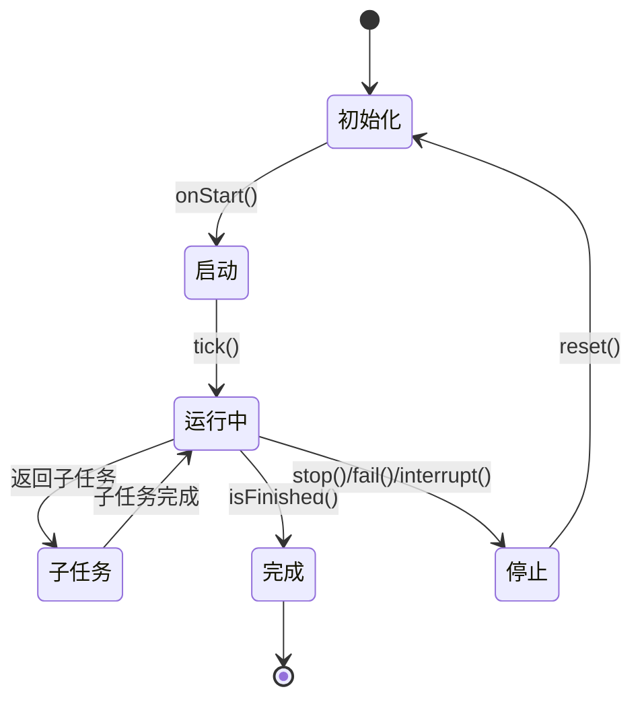
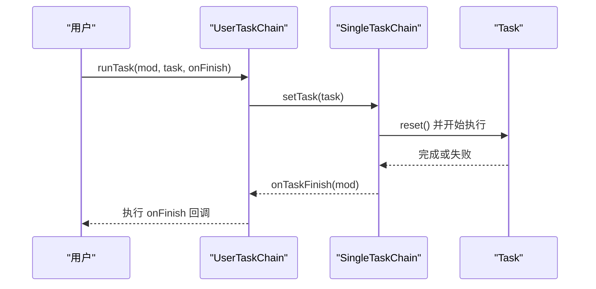
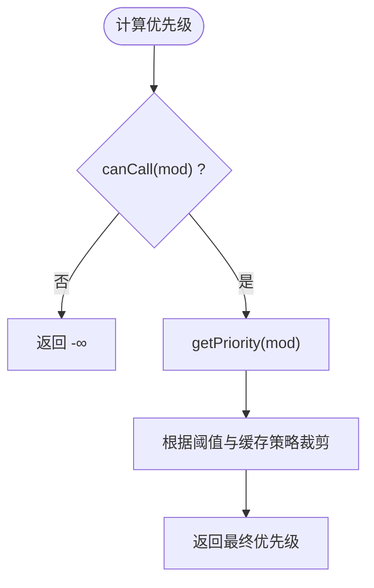
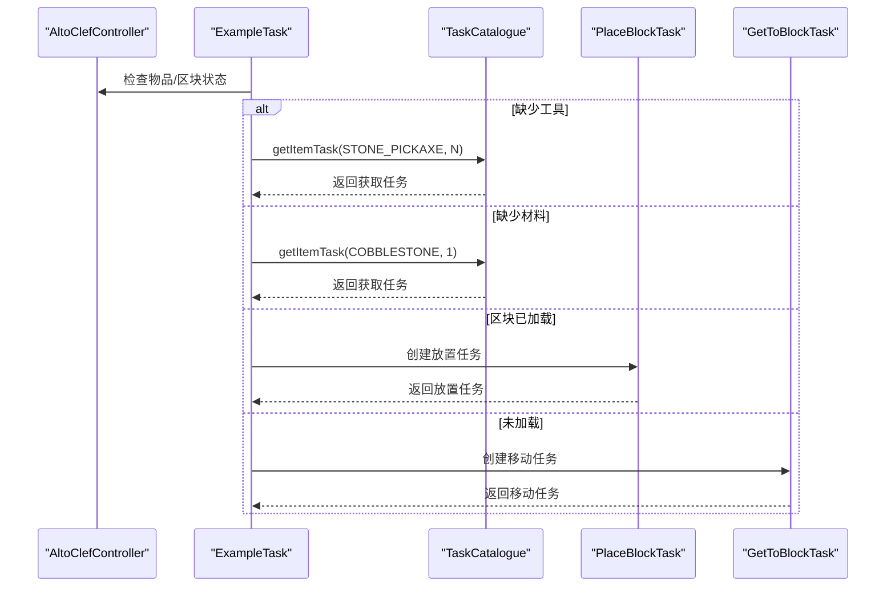
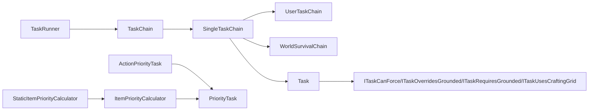

# 任务调度系统

<cite>
**本文引用的文件**
- [Task.java](file://src/main/java/adris/altoclef/tasksystem/Task.java)
- [TaskChain.java](file://src/main/java/adris/altoclef/tasksystem/TaskChain.java)
- [TaskRunner.java](file://src/main/java/adris/altoclef/tasksystem/TaskRunner.java)
- [ITaskCanForce.java](file://src/main/java/adris/altoclef/tasksystem/ITaskCanForce.java)
- [ITaskOverridesGrounded.java](file://src/main/java/adris/altoclef/tasksystem/ITaskOverridesGrounded.java)
- [ITaskRequiresGrounded.java](file://src/main/java/adris/altoclef/tasksystem/ITaskRequiresGrounded.java)
- [ITaskUsesCraftingGrid.java](file://src/main/java/adris/altoclef/tasksystem/ITaskUsesCraftingGrid.java)
- [SingleTaskChain.java](file://src/main/java/adris/altoclef/chains/SingleTaskChain.java)
- [UserTaskChain.java](file://src/main/java/adris/altoclef/chains/UserTaskChain.java)
- [WorldSurvivalChain.java](file://src/main/java/adris/altoclef/chains/WorldSurvivalChain.java)
- [ExampleTask.java](file://src/main/java/adris/altoclef/tasks/examples/ExampleTask.java)
- [ExampleTask2.java](file://src/main/java/adris/altoclef/tasks/examples/ExampleTask2.java)
- [PriorityTask.java](file://src/main/java/adris/altoclef/tasks/speedrun/beatgame/prioritytask/tasks/PriorityTask.java)
- [ActionPriorityTask.java](file://src/main/java/adris/altoclef/tasks/speedrun/beatgame/prioritytask/tasks/ActionPriorityTask.java)
- [PriorityCalculator.java](file://src/main/java/adris/altoclef/tasks/speedrun/beatgame/prioritytask/prioritycalculators/PriorityCalculator.java)
- [ItemPriorityCalculator.java](file://src/main/java/adris/altoclef/tasks/speedrun/beatgame/prioritytask/prioritycalculators/ItemPriorityCalculator.java)
- [StaticItemPriorityCalculator.java](file://src/main/java/adris/altoclef/tasks/speedrun/beatgame/prioritytask/prioritycalculators/StaticItemPriorityCalculator.java)
- [Debug.java](file://src/main/java/adris/altoclef/Debug.java)
</cite>

## 目录
1. [引言](#引言)
2. [项目结构](#项目结构)
3. [核心组件](#核心组件)
4. [架构总览](#架构总览)
5. [详细组件分析](#详细组件分析)
6. [依赖关系分析](#依赖关系分析)
7. [性能考虑](#性能考虑)
8. [故障排查指南](#故障排查指南)
9. [结论](#结论)
10. [附录：示例与最佳实践](#附录示例与最佳实践)

## 引言
本技术文档围绕任务调度系统展开，重点解析 TaskRunner 调度器、Task 基类设计、TaskChain 链式执行模型及其优先级与并发控制机制。文档同时覆盖任务生命周期、状态跟踪、异常与中断处理、依赖关系与资源冲突、性能优化与内存管理，并提供可直接参考的代码片段路径以帮助快速定位实现细节。

## 项目结构
任务调度系统位于模块路径 adris/altoclef/tasksystem 下，配合 chains 包中的具体链式执行器（如 SingleTaskChain、UserTaskChain、WorldSurvivalChain）以及若干示例任务（ExampleTask、ExampleTask2）共同构成完整的调度框架。此外，速度赛跑相关模块提供了 PriorityTask 及其优先级计算器，作为更高层的任务选择与优先级决策参考。

**图表来源**
- [TaskRunner.java:1-98](file://src/main/java/adris/altoclef/tasksystem/TaskRunner.java#L1-L98)
- [TaskChain.java:1-51](file://src/main/java/adris/altoclef/tasksystem/TaskChain.java#L1-L51)
- [Task.java:1-181](file://src/main/java/adris/altoclef/tasksystem/Task.java#L1-L181)
- [SingleTaskChain.java:1-96](file://src/main/java/adris/altoclef/chains/SingleTaskChain.java#L1-L96)
- [UserTaskChain.java:1-223](file://src/main/java/adris/altoclef/chains/UserTaskChain.java#L1-L223)
- [WorldSurvivalChain.java:1-167](file://src/main/java/adris/altoclef/chains/WorldSurvivalChain.java#L1-L167)
- [ExampleTask.java:1-68](file://src/main/java/adris/altoclef/tasks/examples/ExampleTask.java#L1-L68)
- [ExampleTask2.java:1-70](file://src/main/java/adris/altoclef/tasks/examples/ExampleTask2.java#L1-L70)
- [PriorityTask.java:1-46](file://src/main/java/adris/altoclef/tasks/speedrun/beatgame/prioritytask/tasks/PriorityTask.java#L1-L46)
- [ActionPriorityTask.java:1-88](file://src/main/java/adris/altoclef/tasks/speedrun/beatgame/prioritytask/tasks/ActionPriorityTask.java#L1-L88)
- [PriorityCalculator.java:1-5](file://src/main/java/adris/altoclef/tasks/speedrun/beatgame/prioritytask/prioritycalculators/PriorityCalculator.java#L1-L5)
- [ItemPriorityCalculator.java:1-31](file://src/main/java/adris/altoclef/tasks/speedrun/beatgame/prioritytask/prioritycalculators/ItemPriorityCalculator.java#L1-L31)
- [StaticItemPriorityCalculator.java:1-19](file://src/main/java/adris/altoclef/tasks/speedrun/beatgame/prioritytask/prioritycalculators/StaticItemPriorityCalculator.java#L1-L19)

**章节来源**
- [TaskRunner.java:1-98](file://src/main/java/adris/altoclef/tasksystem/TaskRunner.java#L1-L98)
- [TaskChain.java:1-51](file://src/main/java/adris/altoclef/tasksystem/TaskChain.java#L1-L51)
- [Task.java:1-181](file://src/main/java/adris/altoclef/tasksystem/Task.java#L1-L181)

## 核心组件
- TaskRunner：全局调度器，负责在每帧遍历所有 TaskChain，按优先级选择当前活跃链并驱动其执行；支持启用/禁用、状态报告与链切换中断。
- TaskChain：抽象链式执行器，维护当前任务列表缓存，封装链生命周期与优先级计算入口；派生出 SingleTaskChain 等具体实现。
- Task：抽象任务基类，定义生命周期（start/tick/onTick/stop）、状态跟踪（active/first/stopped）、子任务嵌套与中断、调试状态输出与树形打印。
- 接口族：ITaskCanForce、ITaskOverridesGrounded、ITaskRequiresGrounded、ITaskUsesCraftingGrid 提供任务间强制中断、地面状态要求等扩展点。

**章节来源**
- [TaskRunner.java:1-98](file://src/main/java/adris/altoclef/tasksystem/TaskRunner.java#L1-L98)
- [TaskChain.java:1-51](file://src/main/java/adris/altoclef/tasksystem/TaskChain.java#L1-L51)
- [Task.java:1-181](file://src/main/java/adris/altoclef/tasksystem/Task.java#L1-L181)
- [ITaskCanForce.java:1-6](file://src/main/java/adris/altoclef/tasksystem/ITaskCanForce.java#L1-L6)
- [ITaskOverridesGrounded.java:1-5](file://src/main/java/adris/altoclef/tasksystem/ITaskOverridesGrounded.java#L1-L5)
- [ITaskRequiresGrounded.java:1-16](file://src/main/java/adris/altoclef/tasksystem/ITaskRequiresGrounded.java#L1-L16)
- [ITaskUsesCraftingGrid.java:1-5](file://src/main/java/adris/altoclef/tasksystem/ITaskUsesCraftingGrid.java#L1-L5)

## 架构总览
调度主循环在 TaskRunner.tick 中进行，选择最高优先级的激活链并驱动其执行；链内部通过 SingleTaskChain 维护单一主任务的状态与生命周期，支持任务切换、中断与完成回调；Task 基类负责单个任务的 tick 流程、子任务嵌套与强制中断判定。

**图表来源**
- [TaskRunner.java:22-58](file://src/main/java/adris/altoclef/tasksystem/TaskRunner.java#L22-L58)
- [SingleTaskChain.java:22-44](file://src/main/java/adris/altoclef/chains/SingleTaskChain.java#L22-L44)
- [Task.java:17-50](file://src/main/java/adris/altoclef/tasksystem/Task.java#L17-L50)

## 详细组件分析

### TaskRunner 调度器
- 作用：维护任务链集合，按帧选择最高优先级链并驱动执行；支持启用/禁用、状态报告与链切换中断。
- 关键点：
  - 优先级选择：遍历所有激活链，取最大优先级链作为当前链。
  - 中断策略：当当前链与上一帧不同，触发 onInterrupt，允许链在被更高优先级抢占时清理自身状态。
  - 生命周期：enable/disable 时对行为栈进行 push/pop，确保输入与行为设置正确恢复。

**图表来源**
- [TaskRunner.java:22-58](file://src/main/java/adris/altoclef/tasksystem/TaskRunner.java#L22-L58)

**章节来源**
- [TaskRunner.java:1-98](file://src/main/java/adris/altoclef/tasksystem/TaskRunner.java#L1-L98)

### TaskChain 与 SingleTaskChain
- TaskChain：抽象链，提供链生命周期钩子（onTick/onStop）、优先级与激活状态查询、任务缓存列表、向链注册任务的能力。
- SingleTaskChain：单任务链实现，维护 mainTask，负责任务切换、重置、完成回调与中断；在 onTick 中根据 isActive 与 interrupted 控制主任务执行。

**图表来源**
- [TaskChain.java:1-51](file://src/main/java/adris/altoclef/tasksystem/TaskChain.java#L1-L51)
- [SingleTaskChain.java:1-96](file://src/main/java/adris/altoclef/chains/SingleTaskChain.java#L1-L96)

**章节来源**
- [TaskChain.java:1-51](file://src/main/java/adris/altoclef/tasksystem/TaskChain.java#L1-L51)
- [SingleTaskChain.java:1-96](file://src/main/java/adris/altoclef/chains/SingleTaskChain.java#L1-L96)

### Task 基类与生命周期
- 生命周期：start → tick → 子任务嵌套 → stop/fail/interrupt → reset。
- 状态跟踪：active/first/stopped 标志位；调试状态 debugState 用于日志输出；支持树形打印 getTaskTree。
- 子任务管理：onTick 返回子任务，若可中断则替换当前子任务；支持链式嵌套。
- 强制中断：基于 ITaskCanForce 与 ITaskOverridesGrounded 的 shouldForce 判定，避免在不安全状态下强制中断。

**图表来源**
- [Task.java:17-181](file://src/main/java/adris/altoclef/tasksystem/Task.java#L17-L181)

**章节来源**
- [Task.java:1-181](file://src/main/java/adris/altoclef/tasksystem/Task.java#L1-L181)

### 任务链实现：UserTaskChain 与 WorldSurvivalChain
- UserTaskChain：用户任务链，负责执行用户下发的任务，支持任务取消、完成回调、空闲态切换、语音进度反馈、距离监控与自动返回等特性；提供 runTask 设置任务并强制停止旧任务，确保不会因“相等”而跳过。
- WorldSurvivalChain：生存链，根据玩家状态（溺水、着火、岩浆、末地门卡住等）动态选择高优先级任务，具备短时冷却与优先级回退逻辑。

**图表来源**
- [UserTaskChain.java:133-201](file://src/main/java/adris/altoclef/chains/UserTaskChain.java#L133-L201)
- [SingleTaskChain.java:54-67](file://src/main/java/adris/altoclef/chains/SingleTaskChain.java#L54-L67)
- [Task.java:52-77](file://src/main/java/adris/altoclef/tasksystem/Task.java#L52-L77)

**章节来源**
- [UserTaskChain.java:1-223](file://src/main/java/adris/altoclef/chains/UserTaskChain.java#L1-L223)
- [WorldSurvivalChain.java:1-167](file://src/main/java/adris/altoclef/chains/WorldSurvivalChain.java#L1-L167)

### 优先级任务与调度算法
- PriorityTask：抽象优先级任务，提供 calculatePriority、shouldForce、canCache 等能力；结合外部函数式接口与计算器决定是否执行及优先级。
- ActionPriorityTask：基于提供器生成任务与优先级，支持条件函数过滤与缓存策略。
- ItemPriorityCalculator/StaticItemPriorityCalculator：基于物品数量与阈值动态计算优先级，超过上限返回负无穷，表示不再需要该任务。

**图表来源**
- [PriorityTask.java:20-22](file://src/main/java/adris/altoclef/tasks/speedrun/beatgame/prioritytask/tasks/PriorityTask.java#L20-L22)
- [ActionPriorityTask.java:73-76](file://src/main/java/adris/altoclef/tasks/speedrun/beatgame/prioritytask/tasks/ActionPriorityTask.java#L73-L76)
- [ItemPriorityCalculator.java:14-28](file://src/main/java/adris/altoclef/tasks/speedrun/beatgame/prioritytask/prioritycalculators/ItemPriorityCalculator.java#L14-L28)
- [StaticItemPriorityCalculator.java:10-18](file://src/main/java/adris/altoclef/tasks/speedrun/beatgame/prioritytask/prioritycalculators/StaticItemPriorityCalculator.java#L10-L18)

**章节来源**
- [PriorityTask.java:1-46](file://src/main/java/adris/altoclef/tasks/speedrun/beatgame/prioritytask/tasks/PriorityTask.java#L1-L46)
- [ActionPriorityTask.java:1-88](file://src/main/java/adris/altoclef/tasks/speedrun/beatgame/prioritytask/tasks/ActionPriorityTask.java#L1-L88)
- [PriorityCalculator.java:1-5](file://src/main/java/adris/altoclef/tasks/speedrun/beatgame/prioritytask/prioritycalculators/PriorityCalculator.java#L1-L5)
- [ItemPriorityCalculator.java:1-31](file://src/main/java/adris/altoclef/tasks/speedrun/beatgame/prioritytask/prioritycalculators/ItemPriorityCalculator.java#L1-L31)
- [StaticItemPriorityCalculator.java:1-19](file://src/main/java/adris/altoclef/tasks/speedrun/beatgame/prioritytask/prioritycalculators/StaticItemPriorityCalculator.java#L1-L19)

### 示例任务：自定义任务创建与参数配置
- ExampleTask：演示从仓库获取物品、移动到目标位置、放置方块的完整流程；通过 TaskCatalogue 获取通用任务并组合使用。
- ExampleTask2：演示基于扫描器寻找目标、超时漫游与目标点提升后到达目标的流程；展示超时任务与路径导航的协作。

**图表来源**
- [ExampleTask.java:21-42](file://src/main/java/adris/altoclef/tasks/examples/ExampleTask.java#L21-L42)

**章节来源**
- [ExampleTask.java:1-68](file://src/main/java/adris/altoclef/tasks/examples/ExampleTask.java#L1-L68)
- [ExampleTask2.java:1-70](file://src/main/java/adris/altoclef/tasks/examples/ExampleTask2.java#L1-L70)

## 依赖关系分析
- TaskRunner 依赖 TaskChain 列表；TaskChain 依赖 Task；Task 依赖若干接口（强制中断、地面状态、使用工作台等）。
- UserTaskChain/WorldSurvivalChain 继承 SingleTaskChain，复用任务切换与中断逻辑。
- 优先级任务模块独立于核心调度器，但可被上层链或控制器用于动态选择任务与优先级。

**图表来源**
- [TaskRunner.java:1-98](file://src/main/java/adris/altoclef/tasksystem/TaskRunner.java#L1-L98)
- [TaskChain.java:1-51](file://src/main/java/adris/altoclef/tasksystem/TaskChain.java#L1-L51)
- [SingleTaskChain.java:1-96](file://src/main/java/adris/altoclef/chains/SingleTaskChain.java#L1-L96)
- [UserTaskChain.java:1-223](file://src/main/java/adris/altoclef/chains/UserTaskChain.java#L1-L223)
- [WorldSurvivalChain.java:1-167](file://src/main/java/adris/altoclef/chains/WorldSurvivalChain.java#L1-L167)
- [Task.java:1-181](file://src/main/java/adris/altoclef/tasksystem/Task.java#L1-L181)
- [PriorityTask.java:1-46](file://src/main/java/adris/altoclef/tasks/speedrun/beatgame/prioritytask/tasks/PriorityTask.java#L1-L46)
- [ActionPriorityTask.java:1-88](file://src/main/java/adris/altoclef/tasks/speedrun/beatgame/prioritytask/tasks/ActionPriorityTask.java#L1-L88)
- [ItemPriorityCalculator.java:1-31](file://src/main/java/adris/altoclef/tasks/speedrun/beatgame/prioritytask/prioritycalculators/ItemPriorityCalculator.java#L1-L31)
- [StaticItemPriorityCalculator.java:1-19](file://src/main/java/adris/altoclef/tasks/speedrun/beatgame/prioritytask/prioritycalculators/StaticItemPriorityCalculator.java#L1-L19)

**章节来源**
- [TaskRunner.java:1-98](file://src/main/java/adris/altoclef/tasksystem/TaskRunner.java#L1-L98)
- [TaskChain.java:1-51](file://src/main/java/adris/altoclef/tasksystem/TaskChain.java#L1-L51)
- [Task.java:1-181](file://src/main/java/adris/altoclef/tasksystem/Task.java#L1-L181)

## 性能考虑
- 优先级选择：TaskRunner 在每帧遍历所有链，复杂度 O(N)；建议链数量可控，避免过多链导致 tick 开销上升。
- 子任务中断：Task 内部基于接口判定是否可强制中断，避免在危险状态（如空中/水中）强制打断，减少无效重开成本。
- 单任务链缓存：SingleTaskChain 使用 List 缓存当前链路任务，tick 结束清空，降低重复分配开销。
- 优先级裁剪：ItemPriorityCalculator/StaticItemPriorityCalculator 在达到上限后返回负无穷，避免无效任务进入调度器。
- 日志与调试：Debug 提供统一日志入口，建议在生产环境适当降低日志级别，避免 IO 影响。

[本节为通用性能讨论，无需列出具体文件来源]

## 故障排查指南
- 无法启动任务：检查 TaskRunner 是否处于启用状态，链是否 isActive，Task 是否被中断或停止。
- 任务被抢占：确认链的优先级设置与 TaskRunner 的选择逻辑；查看链 onInterrupt 是否正确清理状态。
- 任务卡死：利用 Task.getTaskTree 输出任务树，定位卡住的子任务；检查 isFinished 与 onTick 返回值。
- 强制中断失败：确认任务是否实现 ITaskCanForce/ITaskOverridesGrounded；检查 shouldForce 条件。
- 调试日志：使用 Debug.logMessage/logWarning/logError 输出关键信息与堆栈，定位异常。

**章节来源**
- [TaskRunner.java:22-58](file://src/main/java/adris/altoclef/tasksystem/TaskRunner.java#L22-L58)
- [Task.java:166-181](file://src/main/java/adris/altoclef/tasksystem/Task.java#L166-L181)
- [Debug.java:1-103](file://src/main/java/adris/altoclef/Debug.java#L1-L103)

## 结论
该任务调度系统以 TaskRunner 为核心，通过 TaskChain/SingleTaskChain 实现链式执行与优先级抢占，Task 基类提供清晰的生命周期与中断机制。配合接口扩展点与优先级任务模块，系统既能满足日常用户任务，也能在生存场景下动态响应危险状态。通过合理的优先级设计、中断策略与缓存机制，可在保证稳定性的同时获得良好的性能表现。

[本节为总结性内容，无需列出具体文件来源]

## 附录：示例与最佳实践

### 如何创建自定义任务
- 继承 Task，实现 onStart/onTick/onStop/isEqual/toDebugString。
- 在 onTick 中返回子任务或 null；必要时调用 controller 的服务接口（如库存、扫描器、行为栈）。
- 示例参考：
  - [ExampleTask.java:12-68](file://src/main/java/adris/altoclef/tasks/examples/ExampleTask.java#L12-L68)
  - [ExampleTask2.java:14-70](file://src/main/java/adris/altoclef/tasks/examples/ExampleTask2.java#L14-L70)

**章节来源**
- [ExampleTask.java:1-68](file://src/main/java/adris/altoclef/tasks/examples/ExampleTask.java#L1-L68)
- [ExampleTask2.java:1-70](file://src/main/java/adris/altoclef/tasks/examples/ExampleTask2.java#L1-L70)

### 如何配置任务参数与处理结果
- 使用 UserTaskChain.runTask 设置任务与完成回调；内部会强制停止旧任务并重置 isStopping，确保新任务生效。
- 参考：
  - [UserTaskChain.java:133-168](file://src/main/java/adris/altoclef/chains/UserTaskChain.java#L133-L168)

**章节来源**
- [UserTaskChain.java:133-168](file://src/main/java/adris/altoclef/chains/UserTaskChain.java#L133-L168)

### 任务间的依赖关系与冲突解决
- 依赖：TaskChain 通过 setTask 维护主任务依赖；Task 内部可返回子任务形成嵌套依赖。
- 冲突：通过 ITaskCanForce/ITaskOverridesGrounded 的 shouldForce 判定，避免在危险状态强制中断；SingleTaskChain 在切换任务时先 stop 旧任务再 reset 新任务。
- 参考：
  - [Task.java:152-164](file://src/main/java/adris/altoclef/tasksystem/Task.java#L152-L164)
  - [SingleTaskChain.java:54-67](file://src/main/java/adris/altoclef/chains/SingleTaskChain.java#L54-L67)

**章节来源**
- [Task.java:152-164](file://src/main/java/adris/altoclef/tasksystem/Task.java#L152-L164)
- [SingleTaskChain.java:54-67](file://src/main/java/adris/altoclef/chains/SingleTaskChain.java#L54-L67)

### 调试工具与性能监控
- 调试：使用 Debug.logMessage/logWarning/logError 输出日志；Task.getTaskTree 打印任务树；TaskRunner.statusReport 提供链与优先级状态。
- 性能：控制链数量、减少无效任务、合理使用优先级裁剪；在生产环境降低日志级别。
- 参考：
  - [Debug.java:1-103](file://src/main/java/adris/altoclef/Debug.java#L1-L103)
  - [TaskRunner.java:15-58](file://src/main/java/adris/altoclef/tasksystem/TaskRunner.java#L15-L58)
  - [Task.java:166-181](file://src/main/java/adris/altoclef/tasksystem/Task.java#L166-L181)

**章节来源**
- [Debug.java:1-103](file://src/main/java/adris/altoclef/Debug.java#L1-L103)
- [TaskRunner.java:15-58](file://src/main/java/adris/altoclef/tasksystem/TaskRunner.java#L15-L58)
- [Task.java:166-181](file://src/main/java/adris/altoclef/tasksystem/Task.java#L166-L181)