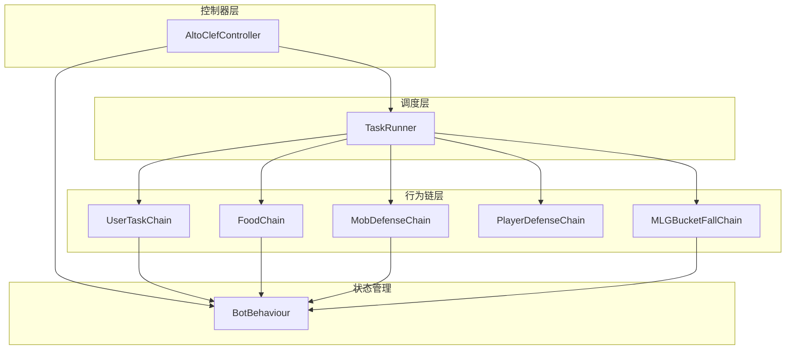
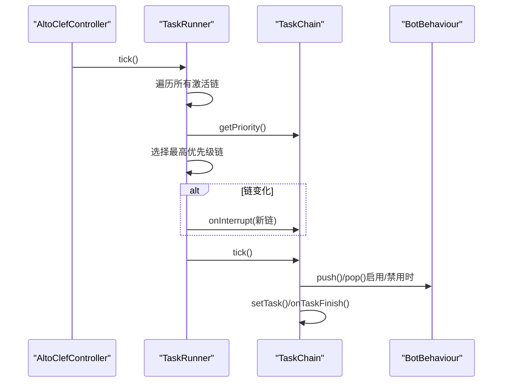
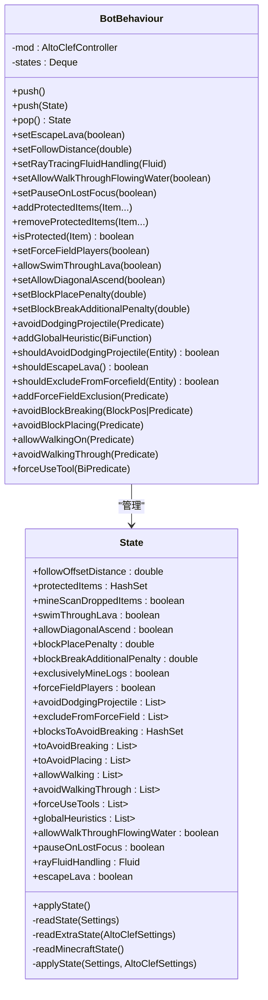
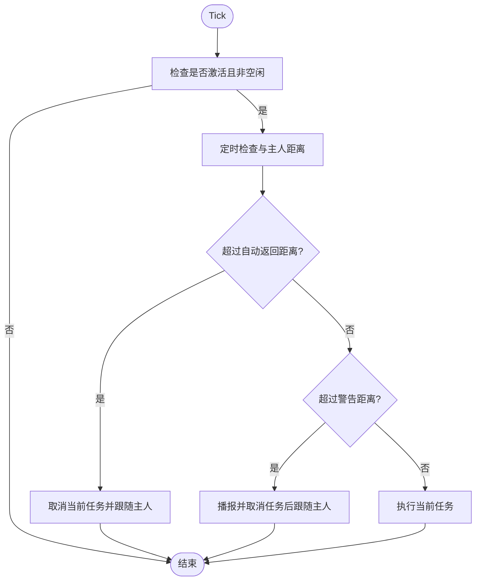
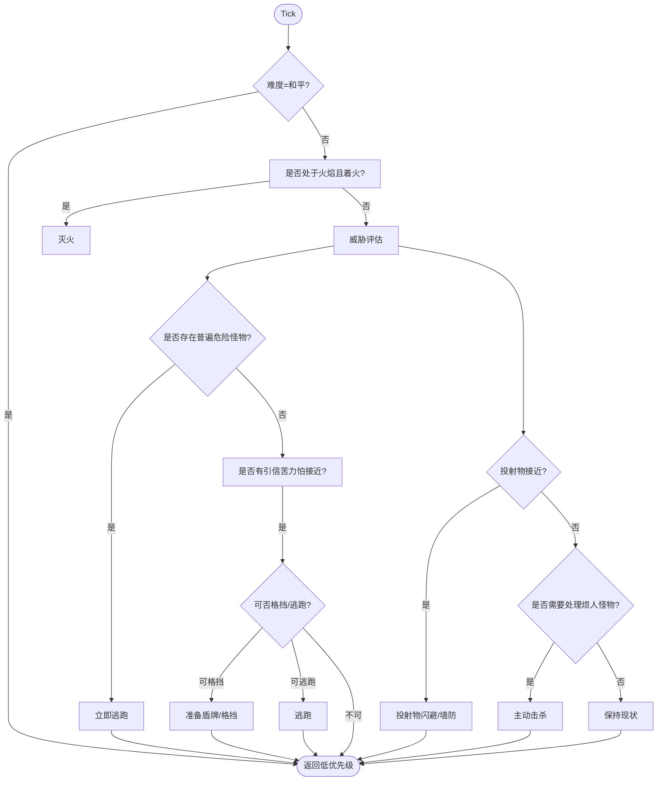
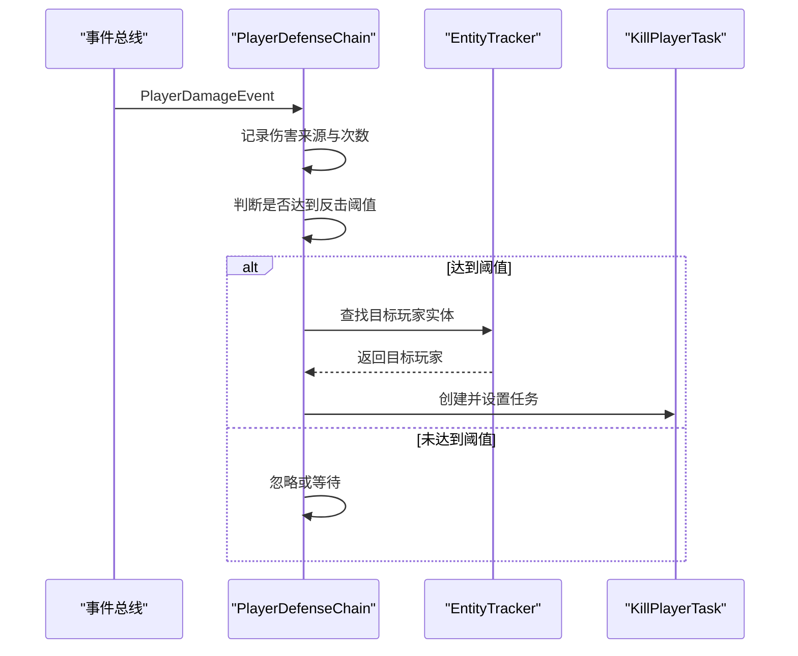
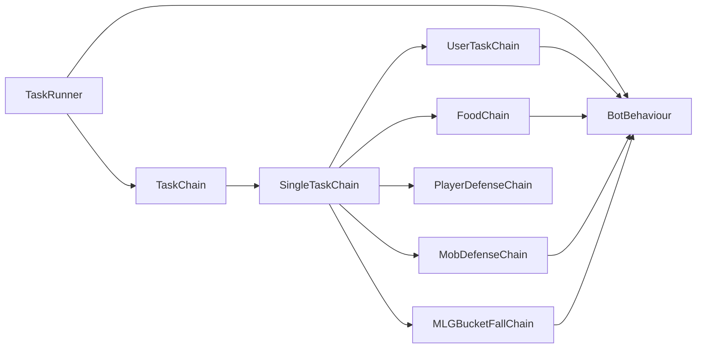

# 行为状态机

<cite>
**本文引用的文件**
- [BotBehaviour.java](file://src/main/java/adris/altoclef/BotBehaviour.java)
- [TaskChain.java](file://src/main/java/adris/altoclef/tasksystem/TaskChain.java)
- [SingleTaskChain.java](file://src/main/java/adris/altoclef/chains/SingleTaskChain.java)
- [TaskRunner.java](file://src/main/java/adris/altoclef/tasksystem/TaskRunner.java)
- [UserTaskChain.java](file://src/main/java/adris/altoclef/chains/UserTaskChain.java)
- [MobDefenseChain.java](file://src/main/java/adris/altoclef/chains/MobDefenseChain.java)
- [PlayerDefenseChain.java](file://src/main/java/adris/altoclef/chains/PlayerDefenseChain.java)
- [FoodChain.java](file://src/main/java/adris/altoclef/chains/FoodChain.java)
- [MLGBucketFallChain.java](file://src/main/java/adris/altoclef/chains/MLGBucketFallChain.java)
- [AltoClefController.java](file://src/main/java/adris/altoclef/AltoClefController.java)
</cite>

## 目录
1. [简介](#简介)
2. [项目结构](#项目结构)
3. [核心组件](#核心组件)
4. [架构总览](#架构总览)
5. [详细组件分析](#详细组件分析)
6. [依赖关系分析](#依赖关系分析)
7. [性能考量](#性能考量)
8. [故障排查指南](#故障排查指南)
9. [结论](#结论)
10. [附录：状态转换与优先级表](#附录状态转换与优先级表)

## 简介
本文件面向行为状态机系统，聚焦以下主题：
- BotBehaviour 的状态栈与状态应用机制（优先级调度与行为链执行的上下文）
- UserTaskChain 用户任务链的任务队列管理、优先级计算与执行顺序控制
- MobDefenseChain 与 PlayerDefenseChain 的防御链工作机制（威胁检测、反应策略、行为模式）
- 系统如何通过 TaskRunner 进行链间优先级调度与中断切换
- 如何扩展新的行为链、自定义状态转换规则与优化性能
- 调试技巧与常见问题解决方案

## 项目结构
该系统采用“控制器 + 多条行为链 + 任务运行器”的分层架构：
- 控制器负责初始化各链、注册事件、驱动 Tick
- TaskRunner 统一调度各链的优先级与中断
- 各 Chain 实现具体的行为逻辑与优先级判定
- BotBehaviour 提供可堆叠的状态上下文，用于在链之间切换时保存/恢复 Baritone 设置

图表来源
- [AltoClefController.java:83-134](file://src/main/java/adris/altoclef/AltoClefController.java#L83-L134)
- [TaskRunner.java:9-98](file://src/main/java/adris/altoclef/tasksystem/TaskRunner.java#L9-L98)
- [BotBehaviour.java:22-343](file://src/main/java/adris/altoclef/BotBehaviour.java#L22-L343)

章节来源
- [AltoClefController.java:83-134](file://src/main/java/adris/altoclef/AltoClefController.java#L83-L134)
- [TaskRunner.java:9-98](file://src/main/java/adris/altoclef/tasksystem/TaskRunner.java#L9-L98)
- [BotBehaviour.java:22-343](file://src/main/java/adris/altoclef/BotBehaviour.java#L22-L343)

## 核心组件
- BotBehaviour：以栈形式管理行为状态，支持 push/pop 保存/恢复 Baritone 设置与额外设置；在链切换时应用当前状态。
- TaskChain：抽象基类，定义优先级、激活态、Tick 与中断接口。
- SingleTaskChain：单任务链基类，封装任务切换、重置、完成回调与中断处理。
- TaskRunner：全局调度器，按优先级选择当前链并进行链间中断；在启用/禁用时调用 BotBehaviour 的状态栈。
- UserTaskChain：用户任务链，负责接收用户下发的任务、距离监控、自动返回与空闲命令执行。
- MobDefenseChain：怪物防御链，综合威胁评估、盾牌/闪避/强制力场、近战反击等策略。
- PlayerDefenseChain：玩家防御链，基于伤害事件与攻击意图记录，触发反击。
- FoodChain：食物链，饥饿/健康阈值判断、最优食物选择与自动进食。
- MLGBucketFallChain：MLG（水桶救生）链，检测高落速并自动放置水桶或拾取水桶，以及处理浮空效果。

章节来源
- [BotBehaviour.java:22-343](file://src/main/java/adris/altoclef/BotBehaviour.java#L22-L343)
- [TaskChain.java:7-51](file://src/main/java/adris/altoclef/tasksystem/TaskChain.java#L7-L51)
- [SingleTaskChain.java:11-96](file://src/main/java/adris/altoclef/chains/SingleTaskChain.java#L11-L96)
- [TaskRunner.java:9-98](file://src/main/java/adris/altoclef/tasksystem/TaskRunner.java#L9-L98)
- [UserTaskChain.java:14-223](file://src/main/java/adris/altoclef/chains/UserTaskChain.java#L14-L223)
- [MobDefenseChain.java:74-684](file://src/main/java/adris/altoclef/chains/MobDefenseChain.java#L74-L684)
- [PlayerDefenseChain.java:19-189](file://src/main/java/adris/altoclef/chains/PlayerDefenseChain.java#L19-L189)
- [FoodChain.java:23-229](file://src/main/java/adris/altoclef/chains/FoodChain.java#L23-L229)
- [MLGBucketFallChain.java:21-139](file://src/main/java/adris/altoclef/chains/MLGBucketFallChain.java#L21-L139)

## 架构总览
系统 Tick 流程如下：
- 控制器每 Tick 调用 TaskRunner.tick()
- TaskRunner 遍历所有已激活的链，计算优先级，选择最高优先级链
- 若链发生变化，触发旧链 onInterrupt 并切换到新链
- 新链 Tick 执行其内部逻辑与任务切换

图表来源
- [AltoClefController.java:136-150](file://src/main/java/adris/altoclef/AltoClefController.java#L136-L150)
- [TaskRunner.java:22-58](file://src/main/java/adris/altoclef/tasksystem/TaskRunner.java#L22-L58)
- [TaskChain.java:16-36](file://src/main/java/adris/altoclef/tasksystem/TaskChain.java#L16-L36)
- [BotBehaviour.java:187-213](file://src/main/java/adris/altoclef/BotBehaviour.java#L187-L213)

章节来源
- [AltoClefController.java:136-150](file://src/main/java/adris/altoclef/AltoClefController.java#L136-L150)
- [TaskRunner.java:22-58](file://src/main/java/adris/altoclef/tasksystem/TaskRunner.java#L22-L58)
- [TaskChain.java:16-36](file://src/main/java/adris/altoclef/tasksystem/TaskChain.java#L16-L36)
- [BotBehaviour.java:187-213](file://src/main/java/adris/altoclef/BotBehaviour.java#L187-L213)

## 详细组件分析

### BotBehaviour：状态栈与优先级调度上下文
- 状态栈：使用双端队列维护状态，支持 push/pop
- 状态内容：包含 Baritone 设置（如跟随距离、是否允许对流体射线追踪、是否允许游泳穿过熔岩等）与额外设置（如避免破坏/放置、保护物品、强制行走/避免穿越、全局启发式等）
- 应用机制：State.readState/readExtraState/readMinecraftState 将当前控制器状态读入，applyState 写回并同步到 Baritone 与额外设置
- 与 TaskRunner 的集成：TaskRunner.enable/disable 时调用 push/pop，确保链切换时行为上下文正确

图表来源
- [BotBehaviour.java:224-341](file://src/main/java/adris/altoclef/BotBehaviour.java#L224-L341)

章节来源
- [BotBehaviour.java:22-343](file://src/main/java/adris/altoclef/BotBehaviour.java#L22-L343)

### UserTaskChain：用户任务链与执行顺序控制
- 任务队列管理：SingleTaskChain.setTask 负责任务切换，若新旧任务不相等则停止旧任务并启动新任务
- 优先级：固定优先级，用于在用户主动下发任务时抢占其他链
- 执行顺序控制：强制停止当前任务再设置新任务，避免“相同任务类型”被跳过导致卡死
- 距离监控：超过阈值自动返回主人，必要时播报语音提示
- 空闲命令：任务完成后根据配置执行空闲命令或停止

图表来源
- [UserTaskChain.java:64-114](file://src/main/java/adris/altoclef/chains/UserTaskChain.java#L64-L114)
- [SingleTaskChain.java:54-67](file://src/main/java/adris/altoclef/chains/SingleTaskChain.java#L54-L67)

章节来源
- [UserTaskChain.java:14-223](file://src/main/java/adris/altoclef/chains/UserTaskChain.java#L14-L223)
- [SingleTaskChain.java:11-96](file://src/main/java/adris/altoclef/chains/SingleTaskChain.java#L11-L96)

### MobDefenseChain：怪物防御链
- 威胁检测：综合考虑玩家健康、药水状态、近身怪物、投射物接近度、龙息接触等
- 反应策略：
  - 立即逃跑（RunAwayFromHostiles/RunAwayFromCreepers）
  - 盾牌格挡（强制装备盾牌并暂停交互）
  - 强制力场（KillAura.applyAura 对近身敌对实体施加力场）
  - 投射物闪避（DodgeProjectiles/ProjectileProtectionWall）
  - 主动反击（KillEntitiesTask）
- 优先级：根据威胁程度动态调整，存在“玩家手动攻击覆盖”时降低优先级
- 特殊场景：处理熔岩火焰、龙息、苦力怕引信等

图表来源
- [MobDefenseChain.java:203-407](file://src/main/java/adris/altoclef/chains/MobDefenseChain.java#L203-L407)
- [MobDefenseChain.java:483-511](file://src/main/java/adris/altoclef/chains/MobDefenseChain.java#L483-L511)

章节来源
- [MobDefenseChain.java:74-684](file://src/main/java/adris/altoclef/chains/MobDefenseChain.java#L74-L684)

### PlayerDefenseChain：玩家防御链
- 威胁检测：订阅伤害事件与实体挥砍事件，记录玩家攻击意图
- 反应策略：当累计被攻击次数达到阈值（低血量时更敏感），锁定目标并发起反击（KillPlayerTask）
- 时效性：攻击意图与挑衅记忆有遗忘计时器，避免长期跟踪无效目标

图表来源
- [PlayerDefenseChain.java:33-39](file://src/main/java/adris/altoclef/chains/PlayerDefenseChain.java#L33-L39)
- [PlayerDefenseChain.java:75-127](file://src/main/java/adris/altoclef/chains/PlayerDefenseChain.java#L75-L127)
- [PlayerDefenseChain.java:129-161](file://src/main/java/adris/altoclef/chains/PlayerDefenseChain.java#L129-L161)

章节来源
- [PlayerDefenseChain.java:19-189](file://src/main/java/adris/altoclef/chains/PlayerDefenseChain.java#L19-L189)

### FoodChain：食物链与自动进食
- 自动进食：在满足条件（非地狱门、非防御状态、非龙息接触、MLG 完成）下，根据饥饿/饱和/完美食物匹配计算最优食物并执行
- 收集食物：当库存不足或低于阈值时，切换到收集食物任务
- 优先级：在需要进食或请求补满时提升优先级

章节来源
- [FoodChain.java:23-229](file://src/main/java/adris/altoclef/chains/FoodChain.java#L23-L229)

### MLGBucketFallChain：MLG（水桶救生）链
- 场景识别：检测高落速（自由落体速度小于阈值）触发 MLG
- 行为：放置水桶或拾取水桶，必要时使用瞬移道具处理浮空效果
- 优先级：极高优先级，确保生存安全

章节来源
- [MLGBucketFallChain.java:21-139](file://src/main/java/adris/altoclef/chains/MLGBucketFallChain.java#L21-L139)

## 依赖关系分析
- TaskRunner 依赖所有 TaskChain 的 getPriority()/isActive()，并在链切换时调用 onInterrupt
- 各 Chain 依赖控制器提供的实体追踪、存储、输入控制、Baritone 行为等能力
- BotBehaviour 作为状态上下文，被 TaskRunner.enable/disable 与各 Chain 共享

图表来源
- [TaskRunner.java:22-58](file://src/main/java/adris/altoclef/tasksystem/TaskRunner.java#L22-L58)
- [TaskChain.java:32-36](file://src/main/java/adris/altoclef/tasksystem/TaskChain.java#L32-L36)
- [SingleTaskChain.java:17-20](file://src/main/java/adris/altoclef/chains/SingleTaskChain.java#L17-L20)
- [BotBehaviour.java:187-213](file://src/main/java/adris/altoclef/BotBehaviour.java#L187-L213)

章节来源
- [TaskRunner.java:9-98](file://src/main/java/adris/altoclef/tasksystem/TaskRunner.java#L9-L98)
- [TaskChain.java:7-51](file://src/main/java/adris/altoclef/tasksystem/TaskChain.java#L7-L51)
- [SingleTaskChain.java:11-96](file://src/main/java/adris/altoclef/chains/SingleTaskChain.java#L11-L96)
- [BotBehaviour.java:22-343](file://src/main/java/adris/altoclef/BotBehaviour.java#L22-L343)

## 性能考量
- 优先级计算复杂度：各链的 getPriority() 应尽量避免重型计算（如实体扫描）在高频 Tick 中重复执行，可结合缓存与定时器
- 任务切换成本：SingleTaskChain 在任务变更时会停止旧任务并重置新任务，确保一致性但可能带来抖动；可通过任务相等性判断减少不必要的切换
- 状态栈操作：TaskRunner.enable/disable 时频繁 push/pop，建议在链数量较多时避免频繁切换
- 并发与异常：防御链中对实体列表的遍历使用了异常捕获与并发修改保护，建议在外部也做好数据一致性保证

[本节为通用指导，无需特定文件来源]

## 故障排查指南
- 任务无法切换或卡住
  - 检查是否因任务相等性导致跳过；SingleTaskChain 的 setTask 已强制停止旧任务再设置新任务，确认逻辑未被覆盖
  - 参考路径：[SingleTaskChain.java:54-67](file://src/main/java/adris/altoclef/chains/SingleTaskChain.java#L54-L67)
- 防御链优先级过低
  - 确认是否处于和平难度或被“玩家手动攻击覆盖”限制；必要时调整设置
  - 参考路径：[MobDefenseChain.java:208-212](file://src/main/java/adris/altoclef/chains/MobDefenseChain.java#L208-L212)，[MobDefenseChain.java:159-166](file://src/main/java/adris/altoclef/chains/MobDefenseChain.java#L159-L166)
- 自动返回频繁
  - 距离检查间隔与阈值配置不当；适当增大阈值或间隔
  - 参考路径：[UserTaskChain.java:72-114](file://src/main/java/adris/altoclef/chains/UserTaskChain.java#L72-L114)
- 食物链不进食
  - MLG 进行中或处于危险区域；确认 DragonBreathTracker 与 MLG 状态
  - 参考路径：[FoodChain.java:85-124](file://src/main/java/adris/altoclef/chains/FoodChain.java#L85-L124)
- 状态上下文异常
  - TaskRunner.enable/disable 与 BotBehaviour 的 push/pop 是否匹配；避免状态栈为空
  - 参考路径：[TaskRunner.java:64-84](file://src/main/java/adris/altoclef/tasksystem/TaskRunner.java#L64-L84)，[BotBehaviour.java:187-213](file://src/main/java/adris/altoclef/BotBehaviour.java#L187-L213)

章节来源
- [SingleTaskChain.java:54-67](file://src/main/java/adris/altoclef/chains/SingleTaskChain.java#L54-L67)
- [MobDefenseChain.java:159-166](file://src/main/java/adris/altoclef/chains/MobDefenseChain.java#L159-L166)
- [UserTaskChain.java:72-114](file://src/main/java/adris/altoclef/chains/UserTaskChain.java#L72-L114)
- [FoodChain.java:85-124](file://src/main/java/adris/altoclef/chains/FoodChain.java#L85-L124)
- [TaskRunner.java:64-84](file://src/main/java/adris/altoclef/tasksystem/TaskRunner.java#L64-L84)
- [BotBehaviour.java:187-213](file://src/main/java/adris/altoclef/BotBehaviour.java#L187-L213)

## 结论
该行为状态机系统通过“控制器 + 多链 + 调度器 + 状态栈”的设计，实现了灵活而稳定的优先级调度与行为链执行。BotBehaviour 提供了强大的上下文保存/恢复能力，TaskRunner 负责跨链的优先级与中断，各 Chain 各司其职地处理不同场景下的威胁与需求。通过合理扩展新的 Chain、定制优先级与状态转换规则，并注意性能与异常处理，可以进一步增强系统的鲁棒性与可维护性。

[本节为总结，无需特定文件来源]

## 附录：状态转换与优先级表

- 状态栈操作
  - 启用链：TaskRunner.enable -> BotBehaviour.push
  - 禁用链：TaskRunner.disable -> BotBehaviour.pop
  - 参考路径：[TaskRunner.java:64-84](file://src/main/java/adris/altoclef/tasksystem/TaskRunner.java#L64-L84)，[BotBehaviour.java:187-213](file://src/main/java/adris/altoclef/BotBehaviour.java#L187-L213)

- 优先级来源与范围
  - UserTaskChain：固定优先级，用于用户任务抢占
  - FoodChain：根据饥饿/健康/完美食物匹配计算
  - MobDefenseChain：动态威胁评估，最高可达极高优先级
  - PlayerDefenseChain：基于攻击意图与阈值
  - MLGBucketFallChain：极高优先级，保障生存
  - 参考路径：[UserTaskChain.java:124-126](file://src/main/java/adris/altoclef/chains/UserTaskChain.java#L124-L126)，[FoodChain.java:66-125](file://src/main/java/adris/altoclef/chains/FoodChain.java#L66-L125)，[MobDefenseChain.java:152-167](file://src/main/java/adris/altoclef/chains/MobDefenseChain.java#L152-L167)，[PlayerDefenseChain.java:129-161](file://src/main/java/adris/altoclef/chains/PlayerDefenseChain.java#L129-L161)，[MLGBucketFallChain.java:37-108](file://src/main/java/adris/altoclef/chains/MLGBucketFallChain.java#L37-L108)

- 任务切换与中断
  - setTask：若任务不相等则停止旧任务并重置新任务
  - onInterrupt：链切换时通知旧链中断
  - 参考路径：[SingleTaskChain.java:54-86](file://src/main/java/adris/altoclef/chains/SingleTaskChain.java#L54-L86)，[TaskChain.java:26-28](file://src/main/java/adris/altoclef/tasksystem/TaskChain.java#L26-L28)