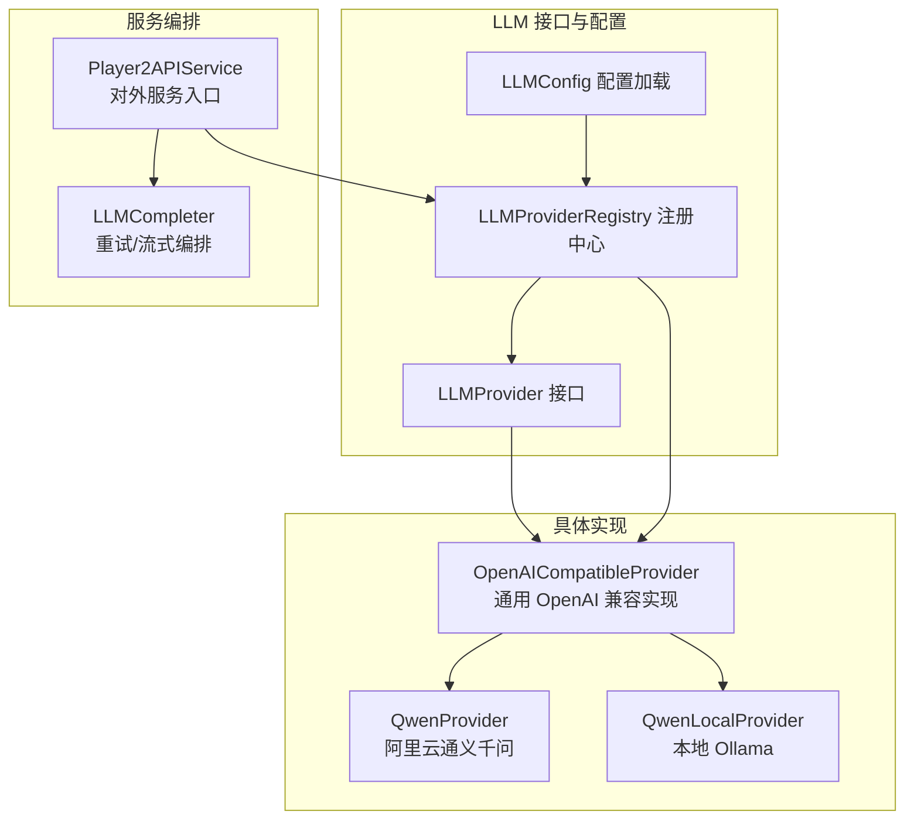
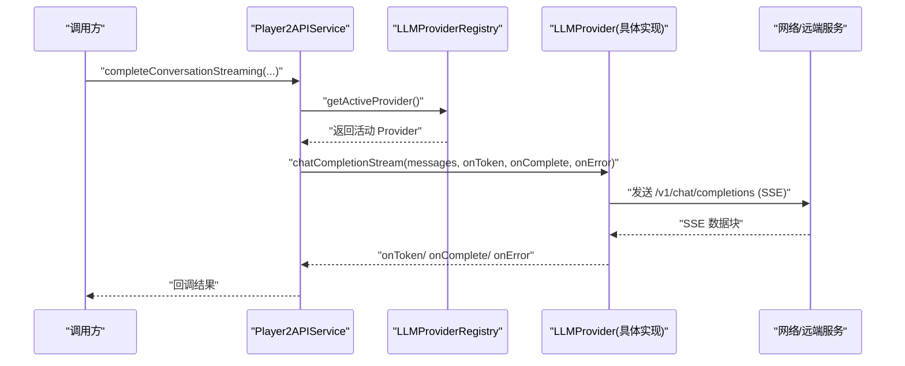
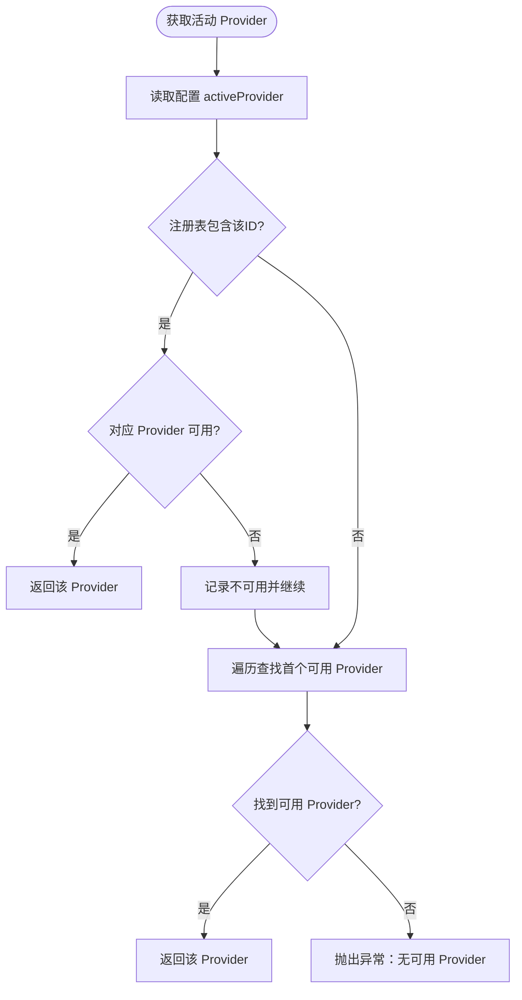
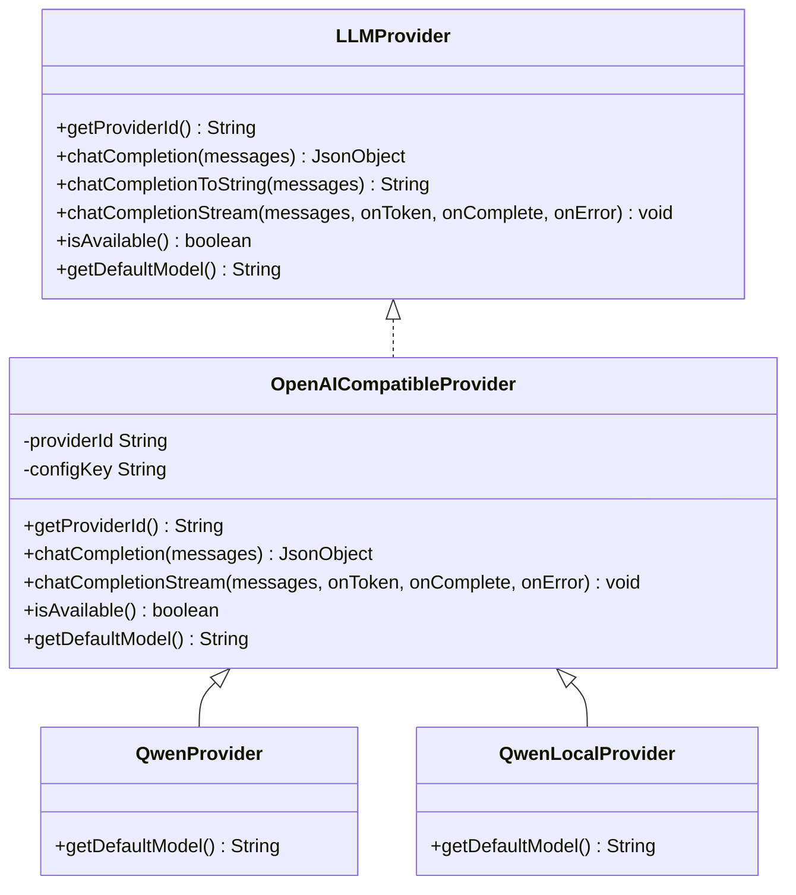
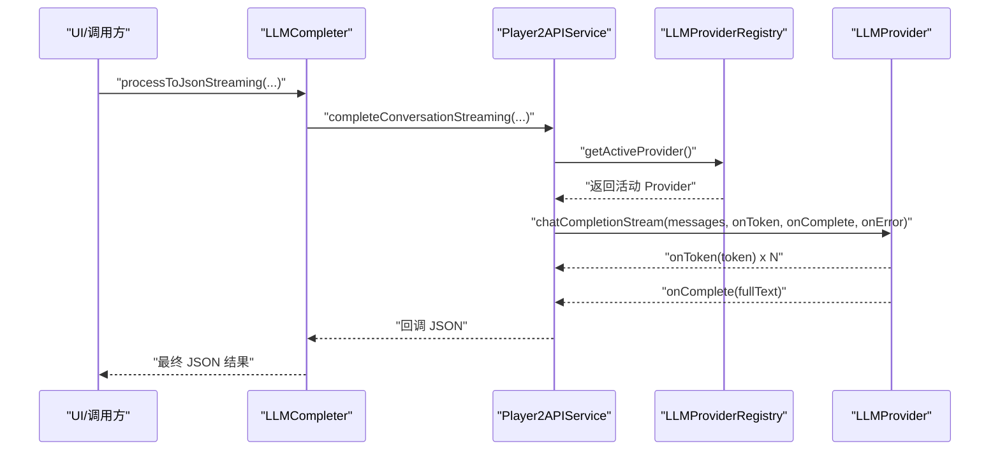
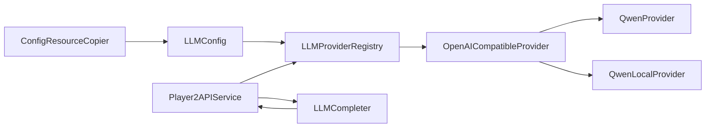

# LLM Provider 架构设计

<cite>
**本文引用的文件**
- [LLMProvider.java](file://src/main/java/adris/altoclef/player2api/llm/LLMProvider.java)
- [LLMProviderRegistry.java](file://src/main/java/adris/altoclef/player2api/llm/LLMProviderRegistry.java)
- [LLMConfig.java](file://src/main/java/adris/altoclef/player2api/llm/LLMConfig.java)
- [OpenAICompatibleProvider.java](file://src/main/java/adris/altoclef/player2api/llm/impl/OpenAICompatibleProvider.java)
- [QwenProvider.java](file://src/main/java/adris/altoclef/player2api/llm/impl/QwenProvider.java)
- [QwenLocalProvider.java](file://src/main/java/adris/altoclef/player2api/llm/impl/QwenLocalProvider.java)
- [Player2APIService.java](file://src/main/java/adris/altoclef/player2api/Player2APIService.java)
- [LLMCompleter.java](file://src/main/java/adris/altoclef/player2api/LLMCompleter.java)
- [ConfigResourceCopier.java](file://src/main/java/adris/altoclef/player2api/utils/ConfigResourceCopier.java)
- [playerengine-llm-default.json](file://src/main/resources/playerengine-llm-default.json)
</cite>

## 目录
1. [引言](#引言)
2. [项目结构](#项目结构)
3. [核心组件](#核心组件)
4. [架构总览](#架构总览)
5. [组件详解](#组件详解)
6. [依赖关系分析](#依赖关系分析)
7. [性能与可靠性考量](#性能与可靠性考量)
8. [故障排查指南](#故障排查指南)
9. [结论](#结论)
10. [附录](#附录)

## 引言
本文件面向 LLM Provider 架构设计，系统性阐述统一接口 LLMProvider 的设计理念、核心方法职责与扩展方式；解析 LLMProviderRegistry 的注册与选择机制；说明策略模式在多 LLM 服务无缝集成中的应用；并提供配置、调用与扩展的最佳实践与参考路径。

## 项目结构
围绕 LLM 的关键模块分布如下：
- 接口与注册中心：LLMProvider、LLMProviderRegistry、LLMConfig
- 具体实现：OpenAICompatibleProvider 及其子类 QwenProvider、QwenLocalProvider
- 服务入口与编排：Player2APIService、LLMCompleter
- 配置加载：ConfigResourceCopier、playerengine-llm-default.json

图表来源
- [LLMProvider.java:11-66](file://src/main/java/adris/altoclef/player2api/llm/LLMProvider.java#L11-L66)
- [LLMProviderRegistry.java:16-79](file://src/main/java/adris/altoclef/player2api/llm/LLMProviderRegistry.java#L16-L79)
- [LLMConfig.java:19-116](file://src/main/java/adris/altoclef/player2api/llm/LLMConfig.java#L19-L116)
- [OpenAICompatibleProvider.java:24-226](file://src/main/java/adris/altoclef/player2api/llm/impl/OpenAICompatibleProvider.java#L24-L226)
- [QwenProvider.java:11-22](file://src/main/java/adris/altoclef/player2api/llm/impl/QwenProvider.java#L11-L22)
- [QwenLocalProvider.java:12-23](file://src/main/java/adris/altoclef/player2api/llm/impl/QwenLocalProvider.java#L12-L23)
- [Player2APIService.java:35-118](file://src/main/java/adris/altoclef/player2api/Player2APIService.java#L35-L118)
- [LLMCompleter.java:17-318](file://src/main/java/adris/altoclef/player2api/LLMCompleter.java#L17-L318)

章节来源
- [LLMProvider.java:11-66](file://src/main/java/adris/altoclef/player2api/llm/LLMProvider.java#L11-L66)
- [LLMProviderRegistry.java:16-79](file://src/main/java/adris/altoclef/player2api/llm/LLMProviderRegistry.java#L16-L79)
- [LLMConfig.java:19-116](file://src/main/java/adris/altoclef/player2api/llm/LLMConfig.java#L19-L116)
- [OpenAICompatibleProvider.java:24-226](file://src/main/java/adris/altoclef/player2api/llm/impl/OpenAICompatibleProvider.java#L24-L226)
- [QwenProvider.java:11-22](file://src/main/java/adris/altoclef/player2api/llm/impl/QwenProvider.java#L11-L22)
- [QwenLocalProvider.java:12-23](file://src/main/java/adris/altoclef/player2api/llm/impl/QwenLocalProvider.java#L12-L23)
- [Player2APIService.java:35-118](file://src/main/java/adris/altoclef/player2api/Player2APIService.java#L35-L118)
- [LLMCompleter.java:17-318](file://src/main/java/adris/altoclef/player2api/LLMCompleter.java#L17-L318)
- [ConfigResourceCopier.java:18-59](file://src/main/java/adris/altoclef/player2api/utils/ConfigResourceCopier.java#L18-L59)
- [playerengine-llm-default.json:1-89](file://src/main/resources/playerengine-llm-default.json#L1-L89)

## 核心组件
- LLMProvider 接口：定义统一能力契约，包括唯一标识、同步与流式对话、可用性判断、默认模型等。
- LLMProviderRegistry：单例注册中心，负责内置 Provider 的自动注册、按配置选择活动 Provider，并提供回退逻辑。
- LLMConfig：负责加载配置文件、解析活动 Provider、代理与 TTS/STT 配置。
- OpenAICompatibleProvider：通用 OpenAI 兼容实现，封装请求构建、连接建立、非流式与流式响应处理。
- 具体 Provider：QwenProvider、QwenLocalProvider 在通用实现基础上覆写标识、配置键与默认模型。
- Player2APIService：对外服务入口，将对话历史转换为消息数组，委托注册中心的活动 Provider 执行请求。
- LLMCompleter：对调用进行线程化、重试、超时与回调编排，支持非流式与流式两种模式。
- ConfigResourceCopier：确保运行时配置文件存在，必要时从资源模板复制。

章节来源
- [LLMProvider.java:11-66](file://src/main/java/adris/altoclef/player2api/llm/LLMProvider.java#L11-L66)
- [LLMProviderRegistry.java:16-79](file://src/main/java/adris/altoclef/player2api/llm/LLMProviderRegistry.java#L16-L79)
- [LLMConfig.java:19-116](file://src/main/java/adris/altoclef/player2api/llm/LLMConfig.java#L19-L116)
- [OpenAICompatibleProvider.java:24-226](file://src/main/java/adris/altoclef/player2api/llm/impl/OpenAICompatibleProvider.java#L24-L226)
- [QwenProvider.java:11-22](file://src/main/java/adris/altoclef/player2api/llm/impl/QwenProvider.java#L11-L22)
- [QwenLocalProvider.java:12-23](file://src/main/java/adris/altoclef/player2api/llm/impl/QwenLocalProvider.java#L12-L23)
- [Player2APIService.java:35-118](file://src/main/java/adris/altoclef/player2api/Player2APIService.java#L35-L118)
- [LLMCompleter.java:17-318](file://src/main/java/adris/altoclef/player2api/LLMCompleter.java#L17-L318)
- [ConfigResourceCopier.java:18-59](file://src/main/java/adris/altoclef/player2api/utils/ConfigResourceCopier.java#L18-L59)

## 架构总览
该架构采用“策略模式 + 注册中心”的组合：
- 策略模式：以 LLMProvider 为策略接口，不同提供商（Qwen、OpenAI、本地 Ollama）作为具体策略，统一由注册中心选择与调度。
- 注册中心：集中管理 Provider，按配置优先、可用性回退的原则选择活动 Provider。
- 适配层：OpenAICompatibleProvider 将各提供商适配为 OpenAI 兼容协议，简化上层调用。
- 编排层：Player2APIService 与 LLMCompleter 负责请求编排、错误处理、重试与回调。

图表来源
- [Player2APIService.java:109-118](file://src/main/java/adris/altoclef/player2api/Player2APIService.java#L109-L118)
- [LLMProviderRegistry.java:49-70](file://src/main/java/adris/altoclef/player2api/llm/LLMProviderRegistry.java#L49-L70)
- [OpenAICompatibleProvider.java:143-209](file://src/main/java/adris/altoclef/player2api/llm/impl/OpenAICompatibleProvider.java#L143-L209)

## 组件详解

### LLMProvider 接口设计
- 唯一标识 getProviderId()：用于注册表索引与日志输出，保证每个 Provider 的可区分性。
- 同步对话 chatCompletion()：返回原始 JSON 响应，遵循 OpenAI 兼容格式，便于统一解析。
- 文本便捷方法 chatCompletionToString()：从 JSON 中提取助手回复文本，便于快速文本场景。
- 流式对话 chatCompletionStream()：基于回调逐块推送 token，首 token 触发“首次响应时间”记录；默认实现回退为一次性返回，具体 Provider 应覆盖以获得真实流式体验。
- 可用性 isAvailable()：根据配置判断 Provider 是否可用（如启用状态、API Key 等）。
- 默认模型 getDefaultModel()：提供默认模型名，可在未显式配置时使用。

章节来源
- [LLMProvider.java:11-66](file://src/main/java/adris/altoclef/player2api/llm/LLMProvider.java#L11-L66)

### LLMProviderRegistry 注册与选择
- 单例与自动注册：首次访问时注册内置 Provider（Qwen、OpenAI 兼容、本地 Qwen）。
- 动态注册 register()：允许外部扩展新 Provider 并加入注册表。
- 活动 Provider 获取 getActiveProvider()：
  - 优先尝试配置中指定的 Provider；
  - 若不可用则遍历注册表寻找第一个可用 Provider；
  - 若均不可用，抛出异常提示检查配置。
- 查询接口：按 ID 获取指定 Provider 或返回全部 Provider 映射。

图表来源
- [LLMProviderRegistry.java:49-70](file://src/main/java/adris/altoclef/player2api/llm/LLMProviderRegistry.java#L49-L70)

章节来源
- [LLMProviderRegistry.java:16-79](file://src/main/java/adris/altoclef/player2api/llm/LLMProviderRegistry.java#L16-L79)

### LLMConfig 配置加载与校验
- 文件定位：通过 ConfigResourceCopier 确保运行时配置存在，不存在则从资源模板复制。
- 解析与缓存：加载 activeProvider、providers、proxy、tts、stt 等配置段。
- 校验与告警：对各 Provider 的 maxTokens 进行下限校验，过小将发出警告。
- 代理支持：根据配置决定是否启用 HTTP 代理及代理地址端口。

章节来源
- [LLMConfig.java:19-116](file://src/main/java/adris/altoclef/player2api/llm/LLMConfig.java#L19-L116)
- [ConfigResourceCopier.java:18-59](file://src/main/java/adris/altoclef/player2api/utils/ConfigResourceCopier.java#L18-L59)
- [playerengine-llm-default.json:1-89](file://src/main/resources/playerengine-llm-default.json#L1-L89)

### OpenAICompatibleProvider 通用实现
- 请求构建：从 LLMConfig 读取 apiUrl、apiKey、model、maxTokens、temperature 等参数，构造 OpenAI 兼容请求体。
- 连接与代理：支持通过配置启用 HTTP 代理；设置超时与 Content-Type。
- 非流式 chatCompletion()：发送请求并读取完整响应，校验状态码，解析 JSON。
- 流式 chatCompletionStream()：基于 SSE 逐块解析 data 行，提取 delta.content，首块触发 TTFT 记录，结束后回调完整文本。
- 可用性 isAvailable()：要求 enabled 且 apiKey 非空且非占位符。
- 默认模型 getDefaultModel()：提供通用默认模型名。

图表来源
- [LLMProvider.java:11-66](file://src/main/java/adris/altoclef/player2api/llm/LLMProvider.java#L11-L66)
- [OpenAICompatibleProvider.java:24-226](file://src/main/java/adris/altoclef/player2api/llm/impl/OpenAICompatibleProvider.java#L24-L226)
- [QwenProvider.java:11-22](file://src/main/java/adris/altoclef/player2api/llm/impl/QwenProvider.java#L11-L22)
- [QwenLocalProvider.java:12-23](file://src/main/java/adris/altoclef/player2api/llm/impl/QwenLocalProvider.java#L12-L23)

章节来源
- [OpenAICompatibleProvider.java:24-226](file://src/main/java/adris/altoclef/player2api/llm/impl/OpenAICompatibleProvider.java#L24-L226)

### 具体 Provider 实现
- QwenProvider：继承 OpenAICompatibleProvider，覆盖 providerId 与 configKey 为 “qwen”，默认模型为 “qwen-plus”。
- QwenLocalProvider：继承 OpenAICompatibleProvider，覆盖 providerId 与 configKey 为 “qwen_local”，默认模型为 “qwen2.5:7b”。

章节来源
- [QwenProvider.java:11-22](file://src/main/java/adris/altoclef/player2api/llm/impl/QwenProvider.java#L11-L22)
- [QwenLocalProvider.java:12-23](file://src/main/java/adris/altoclef/player2api/llm/impl/QwenLocalProvider.java#L12-L23)

### 服务编排与调用链
- Player2APIService：
  - 将 ConversationHistory 转换为消息数组；
  - 非流式：调用 LLMProvider.chatCompletion，解析 choices.message.content 为 JSON；
  - 流式：调用 LLMProvider.chatCompletionStream，逐块回调 token，最终回调完整文本。
- LLMCompleter：
  - 线程化执行，带锁与超时保护；
  - 支持非流式与流式的重试与回退（返回预设 JSON）；
  - 流式解析时对 JSON 尾部分隔符进行清理，提升健壮性。

图表来源
- [Player2APIService.java:109-118](file://src/main/java/adris/altoclef/player2api/Player2APIService.java#L109-L118)
- [LLMCompleter.java:193-303](file://src/main/java/adris/altoclef/player2api/LLMCompleter.java#L193-L303)

章节来源
- [Player2APIService.java:35-118](file://src/main/java/adris/altoclef/player2api/Player2APIService.java#L35-L118)
- [LLMCompleter.java:17-318](file://src/main/java/adris/altoclef/player2api/LLMCompleter.java#L17-L318)

## 依赖关系分析
- LLMProviderRegistry 依赖 LLMConfig 获取活动 Provider，并依赖具体 Provider 实现（Qwen、OpenAI 兼容、本地 Qwen）。
- OpenAICompatibleProvider 依赖 LLMConfig 读取配置，依赖 Java 标准库进行 HTTP 连接与 SSE 解析。
- Player2APIService 依赖 LLMProviderRegistry 与 LLMCompleter，向上提供统一的对话完成接口。
- LLMCompleter 依赖 Player2APIService 的回调接口，内部进行重试与解析。
- ConfigResourceCopier 与 LLMConfig 协作，确保配置文件存在并正确加载。

图表来源
- [LLMProviderRegistry.java:16-79](file://src/main/java/adris/altoclef/player2api/llm/LLMProviderRegistry.java#L16-L79)
- [LLMConfig.java:19-116](file://src/main/java/adris/altoclef/player2api/llm/LLMConfig.java#L19-L116)
- [OpenAICompatibleProvider.java:24-226](file://src/main/java/adris/altoclef/player2api/llm/impl/OpenAICompatibleProvider.java#L24-L226)
- [QwenProvider.java:11-22](file://src/main/java/adris/altoclef/player2api/llm/impl/QwenProvider.java#L11-L22)
- [QwenLocalProvider.java:12-23](file://src/main/java/adris/altoclef/player2api/llm/impl/QwenLocalProvider.java#L12-L23)
- [Player2APIService.java:35-118](file://src/main/java/adris/altoclef/player2api/Player2APIService.java#L35-L118)
- [LLMCompleter.java:17-318](file://src/main/java/adris/altoclef/player2api/LLMCompleter.java#L17-L318)
- [ConfigResourceCopier.java:18-59](file://src/main/java/adris/altoclef/player2api/utils/ConfigResourceCopier.java#L18-L59)

章节来源
- [LLMProviderRegistry.java:16-79](file://src/main/java/adris/altoclef/player2api/llm/LLMProviderRegistry.java#L16-L79)
- [LLMConfig.java:19-116](file://src/main/java/adris/altoclef/player2api/llm/LLMConfig.java#L19-L116)
- [OpenAICompatibleProvider.java:24-226](file://src/main/java/adris/altoclef/player2api/llm/impl/OpenAICompatibleProvider.java#L24-L226)
- [Player2APIService.java:35-118](file://src/main/java/adris/altoclef/player2api/Player2APIService.java#L35-L118)
- [LLMCompleter.java:17-318](file://src/main/java/adris/altoclef/player2api/LLMCompleter.java#L17-L318)
- [ConfigResourceCopier.java:18-59](file://src/main/java/adris/altoclef/player2api/utils/ConfigResourceCopier.java#L18-L59)

## 性能与可靠性考量
- 流式传输：OpenAICompatibleProvider 的流式实现基于 SSE，逐块解析，首 token 记录 TTFT，有助于用户体验；建议 Provider 正确实现以获得真实流式效果。
- 超时与重试：LLMCompleter 对非流式与流式调用分别进行最多两次重试，带指数级延迟补偿；超时后强制释放锁，避免阻塞。
- 配置校验：LLMConfig 对 maxTokens 设置下限告警，防止因过小导致 JSON 截断或解析失败。
- 代理支持：在受限网络环境下可通过代理访问 OpenAI 等服务，减少网络波动带来的失败。
- 回退策略：LLMProviderRegistry 在配置 Provider 不可用时自动回退到首个可用 Provider，提高鲁棒性。

章节来源
- [OpenAICompatibleProvider.java:143-209](file://src/main/java/adris/altoclef/player2api/llm/impl/OpenAICompatibleProvider.java#L143-L209)
- [LLMCompleter.java:17-318](file://src/main/java/adris/altoclef/player2api/LLMCompleter.java#L17-L318)
- [LLMConfig.java:73-84](file://src/main/java/adris/altoclef/player2api/llm/LLMConfig.java#L73-L84)
- [LLMProviderRegistry.java:49-70](file://src/main/java/adris/altoclef/player2api/llm/LLMProviderRegistry.java#L49-L70)

## 故障排查指南
- 无可用 Provider：当所有 Provider 均不可用时，注册中心抛出异常，提示检查配置文件。请确认 activeProvider、enabled、apiKey 等字段。
- 配置文件缺失：若运行时配置不存在，系统会从资源模板复制默认配置；请检查运行目录下的配置文件是否存在并可读。
- 流式解析失败：流式回调中会对 JSON 尾部分隔符进行清理，若仍解析失败，将返回预设回退 JSON；请检查上游 Provider 的 SSE 输出格式。
- 代理问题：若启用代理但仍无法访问，请检查代理主机与端口配置，以及网络连通性。
- API Key 无效：isAvailable() 要求 apiKey 非空且非占位符；请在配置中填写有效密钥。

章节来源
- [LLMProviderRegistry.java:69-70](file://src/main/java/adris/altoclef/player2api/llm/LLMProviderRegistry.java#L69-L70)
- [ConfigResourceCopier.java:29-57](file://src/main/java/adris/altoclef/player2api/utils/ConfigResourceCopier.java#L29-L57)
- [LLMCompleter.java:240-303](file://src/main/java/adris/altoclef/player2api/LLMCompleter.java#L240-L303)
- [OpenAICompatibleProvider.java:211-219](file://src/main/java/adris/altoclef/player2api/llm/impl/OpenAICompatibleProvider.java#L211-L219)

## 结论
该架构通过统一接口与注册中心实现了多 LLM 服务的无缝集成，借助 OpenAI 兼容协议与策略模式，既保证了上层调用的一致性，又为扩展新的 Provider 提供了清晰路径。结合配置加载、流式传输、重试与回退机制，整体具备良好的可维护性与可靠性。

## 附录

### Provider 接口实现规范（参考路径）
- 唯一标识：实现 getProviderId() 返回稳定字符串，作为注册表键。
- 同步调用：实现 chatCompletion() 返回 OpenAI 兼容 JSON。
- 流式调用：实现 chatCompletionStream()，正确解析 SSE 数据块，首块触发 TTFT 记录。
- 可用性：实现 isAvailable()，依据配置判断启用与密钥有效性。
- 默认模型：实现 getDefaultModel()，提供合理默认值。

章节来源
- [LLMProvider.java:11-66](file://src/main/java/adris/altoclef/player2api/llm/LLMProvider.java#L11-L66)

### 注册流程与调用方式（参考路径）
- 注册：通过 LLMProviderRegistry.register() 注册自定义 Provider。
- 选择：LLMProviderRegistry.getActiveProvider() 优先配置后回退可用。
- 调用：Player2APIService.completeConversationStreaming(...) 委托活动 Provider 执行流式请求。

章节来源
- [LLMProviderRegistry.java:40-70](file://src/main/java/adris/altoclef/player2api/llm/LLMProviderRegistry.java#L40-L70)
- [Player2APIService.java:109-118](file://src/main/java/adris/altoclef/player2api/Player2APIService.java#L109-L118)

### 配置文件与默认模板（参考路径）
- 运行时配置文件：playerengine-llm.json（由 ConfigResourceCopier 确保存在）。
- 默认模板：playerengine-llm-default.json，包含 activeProvider、providers、proxy、tts、stt 等配置项。

章节来源
- [ConfigResourceCopier.java:29-57](file://src/main/java/adris/altoclef/player2api/utils/ConfigResourceCopier.java#L29-L57)
- [playerengine-llm-default.json:1-89](file://src/main/resources/playerengine-llm-default.json#L1-L89)