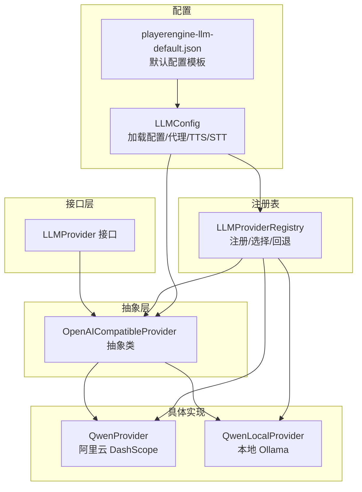
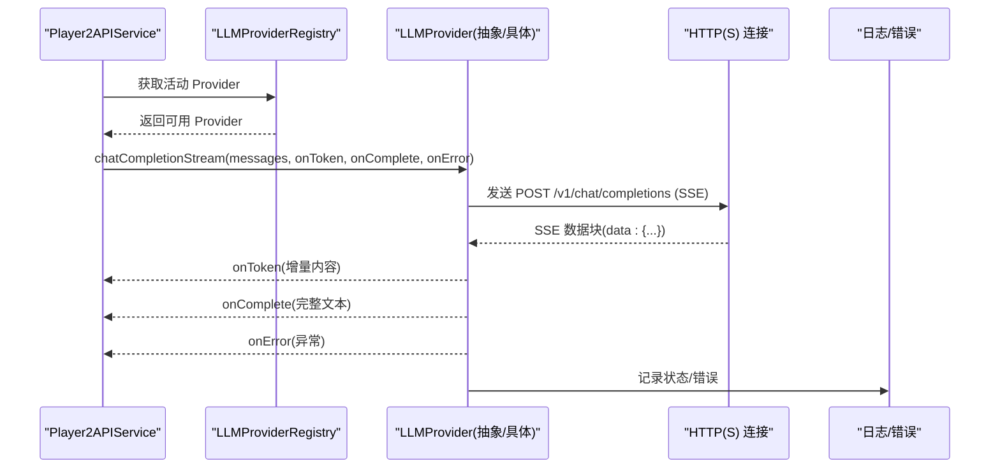
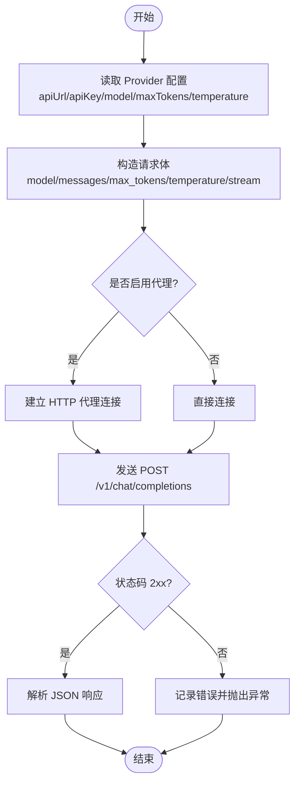
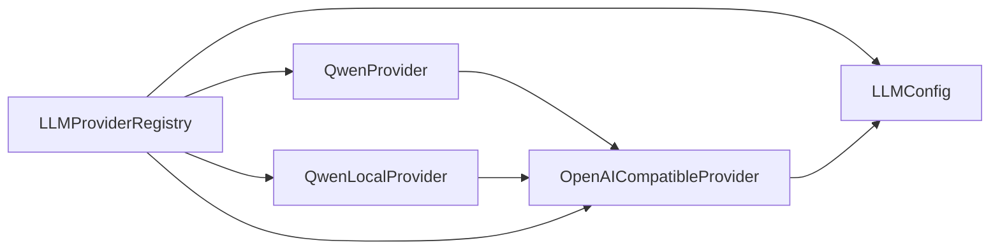

# LLM 实现提供商

<cite>
**本文引用的文件**
- [LLMProvider.java](file://src/main/java/adris/altoclef/player2api/llm/LLMProvider.java)
- [OpenAICompatibleProvider.java](file://src/main/java/adris/altoclef/player2api/llm/impl/OpenAICompatibleProvider.java)
- [QwenProvider.java](file://src/main/java/adris/altoclef/player2api/llm/impl/QwenProvider.java)
- [QwenLocalProvider.java](file://src/main/java/adris/altoclef/player2api/llm/impl/QwenLocalProvider.java)
- [LLMProviderRegistry.java](file://src/main/java/adris/altoclef/player2api/llm/LLMProviderRegistry.java)
- [LLMConfig.java](file://src/main/java/adris/altoclef/player2api/llm/LLMConfig.java)
- [playerengine-llm-default.json](file://src/main/resources/playerengine-llm-default.json)
- [Player2APIService.java](file://src/main/java/adris/altoclef/player2api/Player2APIService.java)
- [AI_NPC项目整体架构概览.md](file://docs/AI_NPC项目整体架构概览.md)
</cite>

## 目录
1. [简介](#简介)
2. [项目结构](#项目结构)
3. [核心组件](#核心组件)
4. [架构总览](#架构总览)
5. [详细组件分析](#详细组件分析)
6. [依赖分析](#依赖分析)
7. [性能考虑](#性能考虑)
8. [故障排查指南](#故障排查指南)
9. [结论](#结论)
10. [附录](#附录)

## 简介
本文件面向 LLM 实现提供商，系统性梳理并解释当前项目中已实现的 LLM 提供商：QwenProvider（阿里云 DashScope API）、OpenAICompatibleProvider（OpenAI 兼容接口抽象）、QwenLocalProvider（本地 Ollama/LM Studio 等）。文档涵盖统一接口设计、配置体系、请求/响应适配、流式处理、可用性判定、错误处理、性能特征与最佳实践，并给出新 Provider 开发的指导与模板路径，帮助开发者快速集成新的 LLM 服务。

## 项目结构
LLM 相关代码集中在 player2api 子模块下，采用“接口 + 抽象 + 具体实现 + 注册表 + 配置”的分层组织方式：
- 接口层：统一 LLMProvider 接口，定义通用能力（同步/流式对话、可用性检查、默认模型等）
- 抽象层：OpenAICompatibleProvider 实现 OpenAI 兼容协议的通用逻辑（请求构建、连接、SSE 流式解析）
- 具体实现层：QwenProvider、QwenLocalProvider 继承抽象层，仅覆盖 providerId、配置键与默认模型
- 注册表层：LLMProviderRegistry 负责注册内置 Provider、选择活动 Provider、回退策略
- 配置层：LLMConfig 读取 playerengine-llm.json，提供代理、TTS/STT 等跨模块配置

图表来源
- [LLMProvider.java:11-66](file://src/main/java/adris/altoclef/player2api/llm/LLMProvider.java#L11-L66)
- [OpenAICompatibleProvider.java:24-225](file://src/main/java/adris/altoclef/player2api/llm/impl/OpenAICompatibleProvider.java#L24-L225)
- [QwenProvider.java:11-21](file://src/main/java/adris/altoclef/player2api/llm/impl/QwenProvider.java#L11-L21)
- [QwenLocalProvider.java:12-22](file://src/main/java/adris/altoclef/player2api/llm/impl/QwenLocalProvider.java#L12-L22)
- [LLMProviderRegistry.java:16-79](file://src/main/java/adris/altoclef/player2api/llm/LLMProviderRegistry.java#L16-L79)
- [LLMConfig.java:19-115](file://src/main/java/adris/altoclef/player2api/llm/LLMConfig.java#L19-L115)
- [playerengine-llm-default.json:1-89](file://src/main/resources/playerengine-llm-default.json#L1-L89)

章节来源
- [LLMProvider.java:11-66](file://src/main/java/adris/altoclef/player2api/llm/LLMProvider.java#L11-L66)
- [OpenAICompatibleProvider.java:24-225](file://src/main/java/adris/altoclef/player2api/llm/impl/OpenAICompatibleProvider.java#L24-L225)
- [QwenProvider.java:11-21](file://src/main/java/adris/altoclef/player2api/llm/impl/QwenProvider.java#L11-L21)
- [QwenLocalProvider.java:12-22](file://src/main/java/adris/altoclef/player2api/llm/impl/QwenLocalProvider.java#L12-L22)
- [LLMProviderRegistry.java:16-79](file://src/main/java/adris/altoclef/player2api/llm/LLMProviderRegistry.java#L16-L79)
- [LLMConfig.java:19-115](file://src/main/java/adris/altoclef/player2api/llm/LLMConfig.java#L19-L115)
- [playerengine-llm-default.json:1-89](file://src/main/resources/playerengine-llm-default.json#L1-L89)

## 核心组件
- LLMProvider 接口：定义统一能力（对话、流式对话、可用性、默认模型）
- OpenAICompatibleProvider 抽象类：封装 OpenAI 兼容协议的通用实现（请求体构造、HTTP 连接、SSE 流式解析、代理支持）
- QwenProvider：阿里云 DashScope 通义千问，继承抽象类，覆盖 providerId、配置键、默认模型
- QwenLocalProvider：本地 Ollama/LM Studio 等，继承抽象类，覆盖 providerId、配置键、默认模型
- LLMProviderRegistry：内置注册（Qwen、OpenAI、QwenLocal），按配置选择活动 Provider，不可用时回退
- LLMConfig：加载 playerengine-llm.json，提供代理、TTS/STT 配置与 Provider 配置读取

章节来源
- [LLMProvider.java:11-66](file://src/main/java/adris/altoclef/player2api/llm/LLMProvider.java#L11-L66)
- [OpenAICompatibleProvider.java:24-225](file://src/main/java/adris/altoclef/player2api/llm/impl/OpenAICompatibleProvider.java#L24-L225)
- [QwenProvider.java:11-21](file://src/main/java/adris/altoclef/player2api/llm/impl/QwenProvider.java#L11-L21)
- [QwenLocalProvider.java:12-22](file://src/main/java/adris/altoclef/player2api/llm/impl/QwenLocalProvider.java#L12-L22)
- [LLMProviderRegistry.java:16-79](file://src/main/java/adris/altoclef/player2api/llm/LLMProviderRegistry.java#L16-L79)
- [LLMConfig.java:19-115](file://src/main/java/adris/altoclef/player2api/llm/LLMConfig.java#L19-L115)

## 架构总览
以下序列图展示了从服务端发起对话到 Provider 返回流式结果的关键调用链，以及注册表选择 Provider 的过程。

图表来源
- [Player2APIService.java:110-118](file://src/main/java/adris/altoclef/player2api/Player2APIService.java#L110-L118)
- [LLMProviderRegistry.java:49-70](file://src/main/java/adris/altoclef/player2api/llm/LLMProviderRegistry.java#L49-L70)
- [OpenAICompatibleProvider.java:144-209](file://src/main/java/adris/altoclef/player2api/llm/impl/OpenAICompatibleProvider.java#L144-L209)

章节来源
- [Player2APIService.java:110-118](file://src/main/java/adris/altoclef/player2api/Player2APIService.java#L110-L118)
- [LLMProviderRegistry.java:49-70](file://src/main/java/adris/altoclef/player2api/llm/LLMProviderRegistry.java#L49-L70)
- [OpenAICompatibleProvider.java:144-209](file://src/main/java/adris/altoclef/player2api/llm/impl/OpenAICompatibleProvider.java#L144-L209)

## 详细组件分析

### LLMProvider 接口
- 能力清单
  - getProviderId：唯一标识符（如 qwen、openai、qwen_local）
  - chatCompletion：发送对话请求，返回原始 JSON
  - chatCompletionToString：便捷方法，提取助手回复文本
  - chatCompletionStream：流式对话回调（首 token TTFT 记录、增量推送、完成回调、错误回调）
  - isAvailable：判断 Provider 是否可用（由具体实现决定）
  - getDefaultModel：默认模型名
- 设计要点
  - 统一 OpenAI 兼容格式的消息数组（role/content）
  - 流式接口默认回退到非流式，具体 Provider 可覆盖以实现真正的 SSE

章节来源
- [LLMProvider.java:11-66](file://src/main/java/adris/altoclef/player2api/llm/LLMProvider.java#L11-L66)

### OpenAICompatibleProvider 抽象类
- 请求构建
  - 从 LLMConfig 读取 apiUrl、apiKey、model、maxTokens、temperature
  - 构造 /v1/chat/completions 请求体，支持 stream=true
  - 支持代理（HTTP 代理配置）
- 连接与超时
  - POST 请求，Content-Type: application/json
  - Authorization: Bearer apiKey（若存在）
  - 连接/读取超时均为 30 秒
- 非流式对话
  - 读取响应流，校验状态码，解析 JSON
  - 非 2xx 抛出异常
- 流式对话（SSE）
  - 逐行读取 data: 块，解析 choices[0].delta.content
  - 首个 token 记录 TTFT
  - [DONE] 结束
  - 非 2xx 抛出异常
- 可用性判定
  - enabled=true 且 apiKey 非空且不为占位符
- 默认模型
  - gpt-4-turbo-preview

图表来源
- [OpenAICompatibleProvider.java:51-110](file://src/main/java/adris/altoclef/player2api/llm/impl/OpenAICompatibleProvider.java#L51-L110)
- [OpenAICompatibleProvider.java:112-141](file://src/main/java/adris/altoclef/player2api/llm/impl/OpenAICompatibleProvider.java#L112-L141)
- [OpenAICompatibleProvider.java:144-209](file://src/main/java/adris/altoclef/player2api/llm/impl/OpenAICompatibleProvider.java#L144-L209)

章节来源
- [OpenAICompatibleProvider.java:24-225](file://src/main/java/adris/altoclef/player2api/llm/impl/OpenAICompatibleProvider.java#L24-L225)

### QwenProvider（阿里云 DashScope）
- 继承 OpenAICompatibleProvider
- providerId = "qwen"
- 配置键 = "qwen"
- 默认模型 = "qwen-plus"
- 默认 API URL = https://dashscope.aliyuncs.com/compatible-mode/v1
- 适用场景
  - 国内网络环境，低延迟、成本较低
  - 需要稳定中文理解与生成能力
- 配置要点
  - 在 playerengine-llm.json 中启用 qwen，并填写 apiKey
  - 可调整 model、maxTokens、temperature

章节来源
- [QwenProvider.java:11-21](file://src/main/java/adris/altoclef/player2api/llm/impl/QwenProvider.java#L11-L21)
- [playerengine-llm-default.json:19-27](file://src/main/resources/playerengine-llm-default.json#L19-L27)

### QwenLocalProvider（本地 Ollama/LM Studio）
- 继承 OpenAICompatibleProvider
- providerId = "qwen_local"
- 配置键 = "qwen_local"
- 默认模型 = "qwen2.5:7b"
- 默认 API URL = http://localhost:11434/v1
- 适用场景
  - 无需网络或出于隐私考虑，本地推理
  - 需要先启动本地服务（如 Ollama run qwen2.5:7b）
- 配置要点
  - 在 playerengine-llm.json 中启用 qwen_local
  - 可调整 model、maxTokens、temperature

章节来源
- [QwenLocalProvider.java:12-22](file://src/main/java/adris/altoclef/player2api/llm/impl/QwenLocalProvider.java#L12-L22)
- [playerengine-llm-default.json:9-18](file://src/main/resources/playerengine-llm-default.json#L9-L18)

### LLMProviderRegistry（注册与选择）
- 内置注册
  - QwenProvider
  - OpenAICompatibleProvider
  - QwenLocalProvider
- 选择策略
  - 优先使用配置中的 activeProvider
  - 若不可用，则遍历查找第一个可用 Provider
  - 若均不可用，抛出异常提示检查配置
- 使用方式
  - 通过 LLMProviderRegistry.getInstance().getActiveProvider() 获取当前 Provider

章节来源
- [LLMProviderRegistry.java:32-38](file://src/main/java/adris/altoclef/player2api/llm/LLMProviderRegistry.java#L32-L38)
- [LLMProviderRegistry.java:49-70](file://src/main/java/adris/altoclef/player2api/llm/LLMProviderRegistry.java#L49-L70)

### LLMConfig（配置加载）
- 文件位置
  - 通过 ConfigResourceCopier 确保默认配置复制到正确目录
  - 读取 playerengine-llm.json
- 字段说明
  - activeProvider：当前活动 Provider 标识
  - providers：各 Provider 的配置对象
  - proxy：HTTP 代理开关与主机/端口
  - tts/stt：TTS/STT 配置（与 LLM 互补）
- 代理支持
  - isProxyEnabled/host/port 用于 OpenAICompatibleProvider 的代理连接
- Provider 配置读取
  - getProviderConfig(providerId) 返回对应 Provider 的配置对象

章节来源
- [LLMConfig.java:54-89](file://src/main/java/adris/altoclef/player2api/llm/LLMConfig.java#L54-L89)
- [LLMConfig.java:93-110](file://src/main/java/adris/altoclef/player2api/llm/LLMConfig.java#L93-L110)
- [playerengine-llm-default.json:6-43](file://src/main/resources/playerengine-llm-default.json#L6-L43)

## 依赖分析
- 组件耦合
  - LLMProviderRegistry 依赖 LLMConfig 读取 activeProvider 与各 Provider 配置
  - OpenAICompatibleProvider 依赖 LLMConfig 获取 apiUrl、apiKey、代理等
  - 具体 Provider（QwenProvider、QwenLocalProvider）仅覆盖 providerId、配置键与默认模型
- 外部依赖
  - HTTP(S) 连接（OpenAI 兼容端点）
  - Gson 解析 JSON
  - 日志框架记录请求/响应与错误
- 循环依赖
  - 未发现循环依赖；注册表与 Provider 之间为单向依赖

图表来源
- [LLMProviderRegistry.java:49-70](file://src/main/java/adris/altoclef/player2api/llm/LLMProviderRegistry.java#L49-L70)
- [LLMConfig.java:93-110](file://src/main/java/adris/altoclef/player2api/llm/LLMConfig.java#L93-L110)
- [OpenAICompatibleProvider.java:51-110](file://src/main/java/adris/altoclef/player2api/llm/impl/OpenAICompatibleProvider.java#L51-L110)

章节来源
- [LLMProviderRegistry.java:16-79](file://src/main/java/adris/altoclef/player2api/llm/LLMProviderRegistry.java#L16-L79)
- [LLMConfig.java:19-115](file://src/main/java/adris/altoclef/player2api/llm/LLMConfig.java#L19-L115)
- [OpenAICompatibleProvider.java:24-225](file://src/main/java/adris/altoclef/player2api/llm/impl/OpenAICompatibleProvider.java#L24-L225)

## 性能考虑
- 连接与超时
  - 连接/读取超时均为 30 秒，适合大多数 LLM 服务；若网络波动较大可适当放宽
- 流式处理
  - SSE 增量推送，首 token 记录 TTFT，有助于用户体验
- 参数范围
  - maxTokens 会在 1..65536 之间钳制，避免无效或过大值
- 代理
  - 在国内访问海外服务时建议开启代理，减少网络抖动
- 最佳实践
  - 本地推理（QwenLocalProvider）适合低延迟与隐私场景
  - 国内用户优先考虑 QwenProvider，成本与稳定性更优
  - 对于 OpenAI 等海外服务，合理设置 temperature 与 maxTokens，避免过长上下文导致超时

[本节为通用性能讨论，不直接分析特定文件]

## 故障排查指南
- 无可用 Provider
  - 现象：抛出异常，提示检查配置
  - 排查：确认 activeProvider 对应的 Provider 已启用且 apiKey 非空
- HTTP 错误
  - 现象：非 2xx 状态码，记录错误并抛出异常
  - 排查：检查 apiUrl、apiKey、网络连通性、代理配置
- SSE 流解析失败
  - 现象：部分数据块无法解析，记录警告
  - 排查：确认 Provider 端点支持标准 SSE 格式
- 配置文件问题
  - 现象：配置未生效或缺失
  - 排查：确认 playerengine-llm.json 已复制到正确目录，字段拼写正确

章节来源
- [LLMProviderRegistry.java:69-70](file://src/main/java/adris/altoclef/player2api/llm/LLMProviderRegistry.java#L69-L70)
- [OpenAICompatibleProvider.java:129-132](file://src/main/java/adris/altoclef/player2api/llm/impl/OpenAICompatibleProvider.java#L129-L132)
- [OpenAICompatibleProvider.java:162-164](file://src/main/java/adris/altoclef/player2api/llm/impl/OpenAICompatibleProvider.java#L162-L164)
- [LLMConfig.java:86-88](file://src/main/java/adris/altoclef/player2api/llm/LLMConfig.java#L86-L88)

## 结论
本项目通过统一接口与 OpenAI 兼容抽象，实现了对多种 LLM 提供商的无缝接入。QwenProvider 适合国内用户，QwenLocalProvider 适合本地推理，OpenAICompatibleProvider 则为扩展其他兼容服务提供了基础。结合 LLMProviderRegistry 的选择与回退机制、LLMConfig 的集中配置与代理支持，系统具备良好的可维护性与可扩展性。

[本节为总结性内容，不直接分析特定文件]

## 附录

### 使用示例（对话与流式响应）
- 同步对话（返回 JSON）
  - 通过 LLMProvider.chatCompletion(messages) 获取完整响应
  - 适用于需要直接处理 JSON 的场景
- 文本提取（便捷方法）
  - 通过 LLMProvider.chatCompletionToString(messages) 获取纯文本
- 流式对话（SSE）
  - 通过 LLMProvider.chatCompletionStream(messages, onToken, onComplete, onError)
  - onToken：增量 token 回调（首次 token 记录 TTFT）
  - onComplete：完整文本回调
  - onError：异常回调

章节来源
- [LLMProvider.java:21-59](file://src/main/java/adris/altoclef/player2api/llm/LLMProvider.java#L21-L59)
- [OpenAICompatibleProvider.java:144-209](file://src/main/java/adris/altoclef/player2api/llm/impl/OpenAICompatibleProvider.java#L144-L209)
- [Player2APIService.java:110-118](file://src/main/java/adris/altoclef/player2api/Player2APIService.java#L110-L118)

### 配置文件关键项
- activeProvider：当前活动 Provider（如 qwen_local、qwen、openai）
- providers.qwen_local/qwen/openai：各 Provider 的 apiUrl、apiKey、model、maxTokens、temperature
- proxy.enabled/host/port：HTTP 代理配置
- tts/stt：TTS/STT 配置（与 LLM 互补）

章节来源
- [playerengine-llm-default.json:6-43](file://src/main/resources/playerengine-llm-default.json#L6-L43)
- [LLMConfig.java:54-89](file://src/main/java/adris/altoclef/player2api/llm/LLMConfig.java#L54-L89)

### 新 Provider 开发指导与模板
- 设计原则
  - 实现 LLMProvider 接口，或继承 OpenAICompatibleProvider 以复用通用逻辑
  - 覆盖 getProviderId、getDefaultModel
  - 在 LLMProviderRegistry 中注册
- 实现步骤
  - 定义 Provider 类（如 MyProvider），继承 OpenAICompatibleProvider 或直接实现接口
  - 在构造函数中设置 providerId 与 configKey
  - 覆盖 getDefaultModel 返回默认模型名
  - 在 LLMProviderRegistry.register(new MyProvider()) 注册
- 模板参考
  - QwenProvider：[QwenProvider.java:11-21](file://src/main/java/adris/altoclef/player2api/llm/impl/QwenProvider.java#L11-L21)
  - QwenLocalProvider：[QwenLocalProvider.java:12-22](file://src/main/java/adris/altoclef/player2api/llm/impl/QwenLocalProvider.java#L12-22)
  - 注册表：[LLMProviderRegistry.java:32-38](file://src/main/java/adris/altoclef/player2api/llm/LLMProviderRegistry.java#L32-L38)

章节来源
- [QwenProvider.java:11-21](file://src/main/java/adris/altoclef/player2api/llm/impl/QwenProvider.java#L11-L21)
- [QwenLocalProvider.java:12-22](file://src/main/java/adris/altoclef/player2api/llm/impl/QwenLocalProvider.java#L12-L22)
- [LLMProviderRegistry.java:32-38](file://src/main/java/adris/altoclef/player2api/llm/LLMProviderRegistry.java#L32-L38)