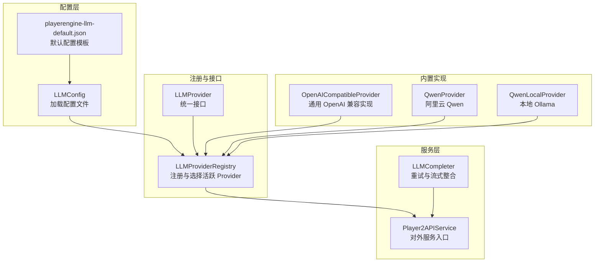
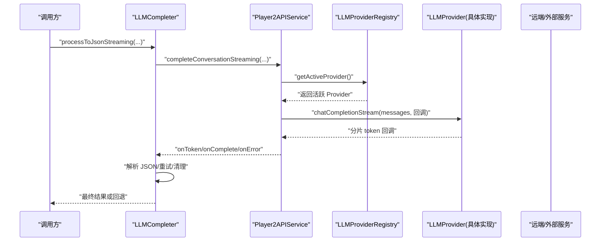
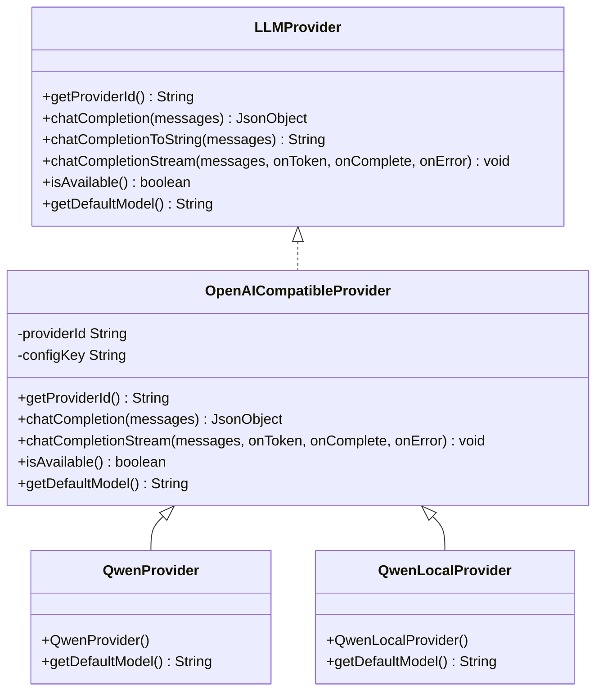
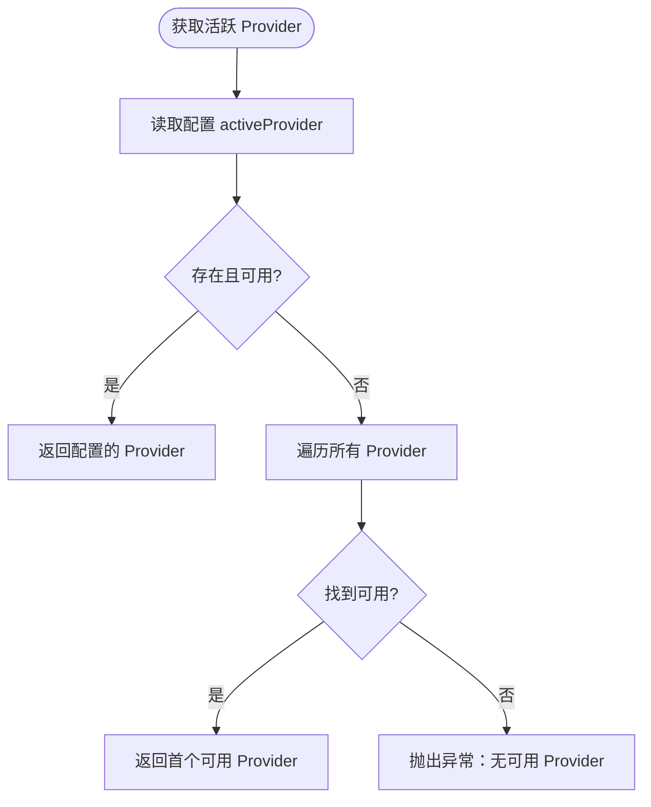
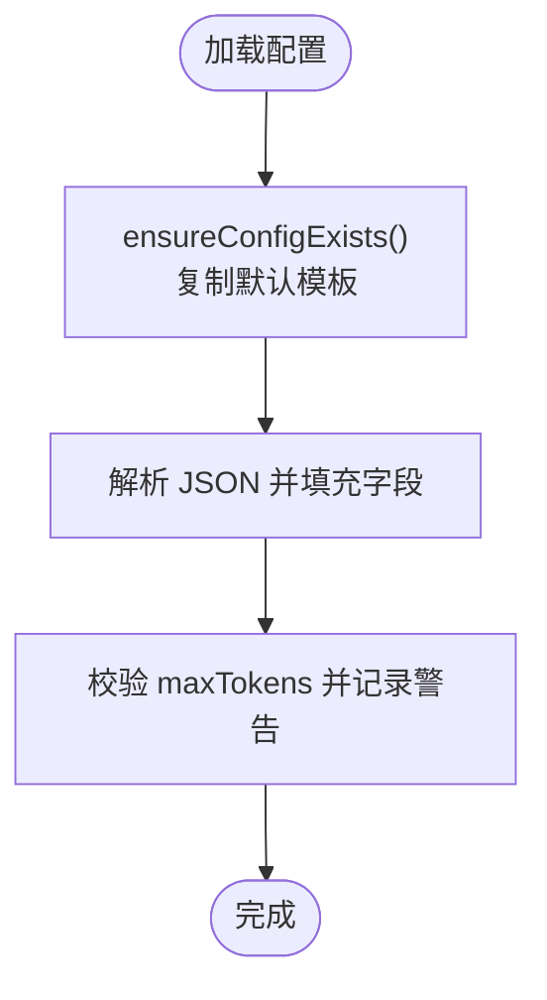
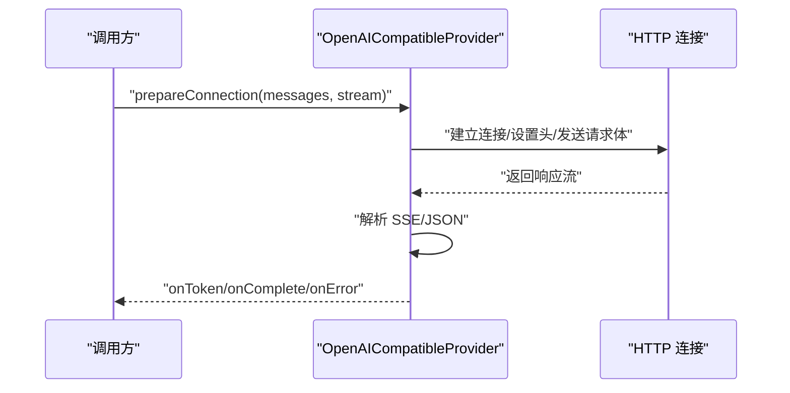
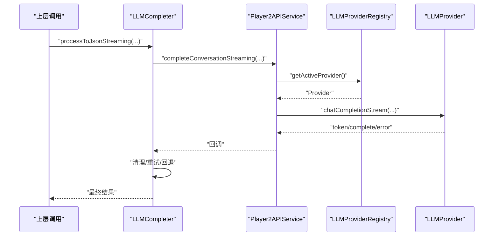
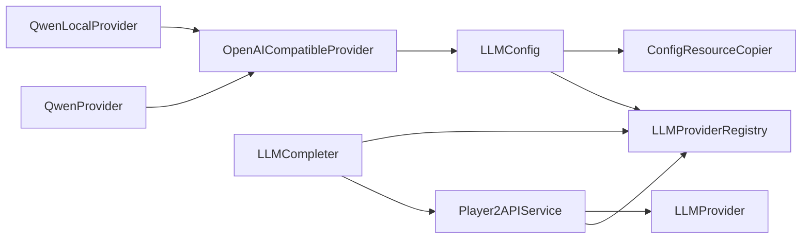

# LLM 扩展开发指南

<cite>
**本文引用的文件**
- [LLMProvider.java](file://src/main/java/adris/altoclef/player2api/llm/LLMProvider.java)
- [LLMProviderRegistry.java](file://src/main/java/adris/altoclef/player2api/llm/LLMProviderRegistry.java)
- [LLMConfig.java](file://src/main/java/adris/altoclef/player2api/llm/LLMConfig.java)
- [OpenAICompatibleProvider.java](file://src/main/java/adris/altoclef/player2api/llm/impl/OpenAICompatibleProvider.java)
- [QwenProvider.java](file://src/main/java/adris/altoclef/player2api/llm/impl/QwenProvider.java)
- [QwenLocalProvider.java](file://src/main/java/adris/altoclef/player2api/llm/impl/QwenLocalProvider.java)
- [playerengine-llm-default.json](file://src/main/resources/playerengine-llm-default.json)
- [Player2APIService.java](file://src/main/java/adris/altoclef/player2api/Player2APIService.java)
- [LLMCompleter.java](file://src/main/java/adris/altoclef/player2api/LLMCompleter.java)
- [ConfigResourceCopier.java](file://src/main/java/adris/altoclef/player2api/utils/ConfigResourceCopier.java)
- [HttpApiException.java](file://src/main/java/adris/altoclef/player2api/utils/HttpApiException.java)
</cite>

## 目录
1. [简介](#简介)
2. [项目结构](#项目结构)
3. [核心组件](#核心组件)
4. [架构总览](#架构总览)
5. [详细组件分析](#详细组件分析)
6. [依赖分析](#依赖分析)
7. [性能考虑](#性能考虑)
8. [故障排查指南](#故障排查指南)
9. [结论](#结论)
10. [附录](#附录)

## 简介
本指南面向希望为项目新增 LLM Provider 的开发者，提供从接口实现、注册到配置扩展的完整流程说明。内容涵盖：
- 实现 LLMProvider 接口的关键步骤与注意事项
- 将新 Provider 注册到 LLMProviderRegistry 的方法
- 配置文件 playerengine-llm.json 的扩展方式
- 异常处理、性能优化、测试验证与集成要点
- 流式处理支持、消息格式适配、错误恢复机制
- 最佳实践与常见问题解决方案

## 项目结构
LLM 扩展相关的核心代码集中在 player2api/llm 及其子包，配合配置加载与服务层协作，形成“配置 → 注册表 → Provider → 服务层”的调用链。

**图表来源**
- [LLMConfig.java:19-89](file://src/main/java/adris/altoclef/player2api/llm/LLMConfig.java#L19-L89)
- [playerengine-llm-default.json:1-89](file://src/main/resources/playerengine-llm-default.json#L1-L89)
- [LLMProviderRegistry.java:16-79](file://src/main/java/adris/altoclef/player2api/llm/LLMProviderRegistry.java#L16-L79)
- [LLMProvider.java:11-66](file://src/main/java/adris/altoclef/player2api/llm/LLMProvider.java#L11-L66)
- [OpenAICompatibleProvider.java:24-225](file://src/main/java/adris/altoclef/player2api/llm/impl/OpenAICompatibleProvider.java#L24-L225)
- [QwenProvider.java:11-21](file://src/main/java/adris/altoclef/player2api/llm/impl/QwenProvider.java#L11-L21)
- [QwenLocalProvider.java:12-22](file://src/main/java/adris/altoclef/player2api/llm/impl/QwenLocalProvider.java#L12-L22)
- [Player2APIService.java:109-118](file://src/main/java/adris/altoclef/player2api/Player2APIService.java#L109-L118)
- [LLMCompleter.java:17-318](file://src/main/java/adris/altoclef/player2api/LLMCompleter.java#L17-L318)

**章节来源**
- [LLMConfig.java:19-89](file://src/main/java/adris/altoclef/player2api/llm/LLMConfig.java#L19-L89)
- [playerengine-llm-default.json:1-89](file://src/main/resources/playerengine-llm-default.json#L1-L89)
- [LLMProviderRegistry.java:16-79](file://src/main/java/adris/altoclef/player2api/llm/LLMProviderRegistry.java#L16-L79)
- [LLMProvider.java:11-66](file://src/main/java/adris/altoclef/player2api/llm/LLMProvider.java#L11-L66)
- [OpenAICompatibleProvider.java:24-225](file://src/main/java/adris/altoclef/player2api/llm/impl/OpenAICompatibleProvider.java#L24-L225)
- [QwenProvider.java:11-21](file://src/main/java/adris/altoclef/player2api/llm/impl/QwenProvider.java#L11-L21)
- [QwenLocalProvider.java:12-22](file://src/main/java/adris/altoclef/player2api/llm/impl/QwenLocalProvider.java#L12-L22)
- [Player2APIService.java:109-118](file://src/main/java/adris/altoclef/player2api/Player2APIService.java#L109-L118)
- [LLMCompleter.java:17-318](file://src/main/java/adris/altoclef/player2api/LLMCompleter.java#L17-L318)

## 核心组件
- LLMProvider 接口：定义 Provider 的统一能力，包括唯一标识、非流式与流式聊天补全、可用性检查、默认模型等。
- LLMProviderRegistry：单例注册表，负责内置 Provider 的自动注册与活跃 Provider 的选择。
- LLMConfig：负责从运行时配置目录加载 playerengine-llm.json，并提供各 Provider 的配置读取。
- OpenAICompatibleProvider：通用 OpenAI 兼容实现，作为大多数 Provider 的基类，支持非流式与流式请求、代理、参数校验等。
- QwenProvider / QwenLocalProvider：基于 OpenAICompatibleProvider 的具体实现，分别对接阿里云 Qwen 与本地 Ollama。
- Player2APIService：对外服务入口，将对话历史转换为消息数组并调用活跃 Provider 或远端服务。
- LLMCompleter：对服务层调用进行线程化、重试与流式整合，保证稳定性与用户体验。

**章节来源**
- [LLMProvider.java:11-66](file://src/main/java/adris/altoclef/player2api/llm/LLMProvider.java#L11-L66)
- [LLMProviderRegistry.java:16-79](file://src/main/java/adris/altoclef/player2api/llm/LLMProviderRegistry.java#L16-L79)
- [LLMConfig.java:19-89](file://src/main/java/adris/altoclef/player2api/llm/LLMConfig.java#L19-L89)
- [OpenAICompatibleProvider.java:24-225](file://src/main/java/adris/altoclef/player2api/llm/impl/OpenAICompatibleProvider.java#L24-L225)
- [QwenProvider.java:11-21](file://src/main/java/adris/altoclef/player2api/llm/impl/QwenProvider.java#L11-L21)
- [QwenLocalProvider.java:12-22](file://src/main/java/adris/altoclef/player2api/llm/impl/QwenLocalProvider.java#L12-L22)
- [Player2APIService.java:109-118](file://src/main/java/adris/altoclef/player2api/Player2APIService.java#L109-L118)
- [LLMCompleter.java:17-318](file://src/main/java/adris/altoclef/player2api/LLMCompleter.java#L17-L318)

## 架构总览
下图展示了从配置加载到 Provider 选择再到服务层调用的完整链路，以及流式回调的传递路径。

**图表来源**
- [LLMCompleter.java:193-303](file://src/main/java/adris/altoclef/player2api/LLMCompleter.java#L193-L303)
- [Player2APIService.java:109-118](file://src/main/java/adris/altoclef/player2api/Player2APIService.java#L109-L118)
- [LLMProviderRegistry.java:49-70](file://src/main/java/adris/altoclef/player2api/llm/LLMProviderRegistry.java#L49-L70)
- [LLMProvider.java:50-59](file://src/main/java/adris/altoclef/player2api/llm/LLMProvider.java#L50-L59)

## 详细组件分析

### 组件 A：LLMProvider 接口与实现模式
- 必须实现的方法与职责
  - getProviderId：返回 Provider 唯一标识（如 "qwen"、"openai"、"player2-remote"）
  - chatCompletion：发送非流式请求并返回原始 JSON
  - chatCompletionToString：便捷方法，提取助手回复文本
  - chatCompletionStream：流式回调，逐片交付 token；默认回退到非流式
  - isAvailable：判断 Provider 是否已配置且可达
  - getDefaultModel：返回默认模型名
- 实现建议
  - 优先继承 OpenAICompatibleProvider，复用通用逻辑
  - 在构造函数中设置 providerId 与 configKey，确保配置键一致
  - 重写 getDefaultModel 返回推荐模型
  - 在 isAvailable 中校验必要配置项（如 apiKey）

**图表来源**
- [LLMProvider.java:11-66](file://src/main/java/adris/altoclef/player2api/llm/LLMProvider.java#L11-L66)
- [OpenAICompatibleProvider.java:24-225](file://src/main/java/adris/altoclef/player2api/llm/impl/OpenAICompatibleProvider.java#L24-L225)
- [QwenProvider.java:11-21](file://src/main/java/adris/altoclef/player2api/llm/impl/QwenProvider.java#L11-L21)
- [QwenLocalProvider.java:12-22](file://src/main/java/adris/altoclef/player2api/llm/impl/QwenLocalProvider.java#L12-L22)

**章节来源**
- [LLMProvider.java:11-66](file://src/main/java/adris/altoclef/player2api/llm/LLMProvider.java#L11-L66)
- [OpenAICompatibleProvider.java:24-225](file://src/main/java/adris/altoclef/player2api/llm/impl/OpenAICompatibleProvider.java#L24-L225)
- [QwenProvider.java:11-21](file://src/main/java/adris/altoclef/player2api/llm/impl/QwenProvider.java#L11-L21)
- [QwenLocalProvider.java:12-22](file://src/main/java/adris/altoclef/player2api/llm/impl/QwenLocalProvider.java#L12-L22)

### 组件 B：LLMProviderRegistry 注册与选择
- 自动注册内置 Provider（Qwen、OpenAI 兼容、本地 Qwen）
- 提供 register 方法扩展第三方 Provider
- getActiveProvider 逻辑
  - 优先尝试配置的 activeProvider
  - 若不可用则遍历可用 Provider 返回第一个
  - 若全部不可用抛出异常提示检查配置

**图表来源**
- [LLMProviderRegistry.java:49-70](file://src/main/java/adris/altoclef/player2api/llm/LLMProviderRegistry.java#L49-L70)

**章节来源**
- [LLMProviderRegistry.java:16-79](file://src/main/java/adris/altoclef/player2api/llm/LLMProviderRegistry.java#L16-L79)

### 组件 C：LLMConfig 配置加载与校验
- 默认配置文件 playerengine-llm-default.json 放置于 resources
- 运行时通过 ConfigResourceCopier 确保配置文件存在并复制默认模板
- 加载后解析 activeProvider、providers、proxy、tts、stt 等字段
- 对 maxTokens 进行边界校验并给出警告

**图表来源**
- [LLMConfig.java:37-89](file://src/main/java/adris/altoclef/player2api/llm/LLMConfig.java#L37-L89)
- [ConfigResourceCopier.java:29-57](file://src/main/java/adris/altoclef/player2api/utils/ConfigResourceCopier.java#L29-L57)
- [playerengine-llm-default.json:1-89](file://src/main/resources/playerengine-llm-default.json#L1-L89)

**章节来源**
- [LLMConfig.java:19-89](file://src/main/java/adris/altoclef/player2api/llm/LLMConfig.java#L19-L89)
- [ConfigResourceCopier.java:18-57](file://src/main/java/adris/altoclef/player2api/utils/ConfigResourceCopier.java#L18-L57)
- [playerengine-llm-default.json:1-89](file://src/main/resources/playerengine-llm-default.json#L1-L89)

### 组件 D：OpenAICompatibleProvider 通用实现
- 统一请求构建：从 LLMConfig 读取 apiUrl、apiKey、model、maxTokens、temperature
- 非流式 chatCompletion：发送请求并解析 JSON
- 流式 chatCompletionStream：解析 SSE 数据帧，逐片回调 token
- 代理支持：根据配置启用 HTTP 代理
- 可用性检查：校验 enabled 与 apiKey

**图表来源**
- [OpenAICompatibleProvider.java:51-209](file://src/main/java/adris/altoclef/player2api/llm/impl/OpenAICompatibleProvider.java#L51-L209)

**章节来源**
- [OpenAICompatibleProvider.java:24-225](file://src/main/java/adris/altoclef/player2api/llm/impl/OpenAICompatibleProvider.java#L24-L225)

### 组件 E：服务层与流式整合
- Player2APIService
  - completeConversation / completeConversationToString：将对话历史转换为消息数组并调用远端服务
  - completeConversationStreaming：委托活跃 Provider 执行流式回调
- LLMCompleter
  - 非流式与流式的重试策略
  - 流式 JSON 清理与解析
  - 超时保护与回退响应

**图表来源**
- [Player2APIService.java:109-118](file://src/main/java/adris/altoclef/player2api/Player2APIService.java#L109-L118)
- [LLMCompleter.java:193-303](file://src/main/java/adris/altoclef/player2api/LLMCompleter.java#L193-L303)
- [LLMProviderRegistry.java:49-70](file://src/main/java/adris/altoclef/player2api/llm/LLMProviderRegistry.java#L49-L70)

**章节来源**
- [Player2APIService.java:48-118](file://src/main/java/adris/altoclef/player2api/Player2APIService.java#L48-L118)
- [LLMCompleter.java:17-318](file://src/main/java/adris/altoclef/player2api/LLMCompleter.java#L17-L318)

## 依赖分析
- LLMProviderRegistry 依赖 LLMConfig 获取配置，并依赖内置 Provider 类进行注册
- OpenAICompatibleProvider 依赖 LLMConfig 读取配置，依赖 HttpURLConnection 发送请求
- Player2APIService 依赖 LLMProviderRegistry 获取活跃 Provider，并在流式场景下调用 Provider
- LLMCompleter 依赖 Player2APIService 与 LLMProviderRegistry，负责重试与流式整合
- ConfigResourceCopier 为 LLMConfig 提供默认配置复制能力

**图表来源**
- [LLMProviderRegistry.java:32-37](file://src/main/java/adris/altoclef/player2api/llm/LLMProviderRegistry.java#L32-L37)
- [OpenAICompatibleProvider.java:52-57](file://src/main/java/adris/altoclef/player2api/llm/impl/OpenAICompatibleProvider.java#L52-L57)
- [Player2APIService.java:116-117](file://src/main/java/adris/altoclef/player2api/Player2APIService.java#L116-L117)
- [LLMCompleter.java:147-148](file://src/main/java/adris/altoclef/player2api/LLMCompleter.java#L147-L148)
- [ConfigResourceCopier.java:29-36](file://src/main/java/adris/altoclef/player2api/utils/ConfigResourceCopier.java#L29-L36)

**章节来源**
- [LLMProviderRegistry.java:16-79](file://src/main/java/adris/altoclef/player2api/llm/LLMProviderRegistry.java#L16-L79)
- [OpenAICompatibleProvider.java:24-225](file://src/main/java/adris/altoclef/player2api/llm/impl/OpenAICompatibleProvider.java#L24-L225)
- [Player2APIService.java:109-118](file://src/main/java/adris/altoclef/player2api/Player2APIService.java#L109-L118)
- [LLMCompleter.java:17-318](file://src/main/java/adris/altoclef/player2api/LLMCompleter.java#L17-L318)
- [ConfigResourceCopier.java:18-57](file://src/main/java/adris/altoclef/player2api/utils/ConfigResourceCopier.java#L18-L57)

## 性能考虑
- 流式传输
  - 优先使用 Provider 的真实流式实现，减少首 token 延迟（TTFT）
  - 在 LLMCompleter 中对流式 JSON 进行清理与解析，避免因片段导致的解析失败
- 超时与重试
  - LLMCompleter 设置最大重试次数与延迟，防止雪崩
  - 超时后自动释放锁并回退，保障系统稳定性
- 参数校验
  - maxTokens 限制在有效范围内，避免过大导致响应体积膨胀
  - temperature 等参数按需配置，平衡创造性与稳定性
- 代理与网络
  - 启用代理仅在必要时开启，避免额外网络开销
  - 对 HTTP 连接设置合理的超时时间

[本节为通用指导，不直接分析具体文件]

## 故障排查指南
- 无可用 Provider
  - 检查 activeProvider 是否正确，对应配置项是否 enabled 且 apiKey 不为空
  - 查看日志中“无可用 Provider”提示并核对配置文件
- HTTP 错误
  - OpenAICompatibleProvider 在非 2xx 状态码时抛出异常，查看状态码与响应体
  - 使用 HttpApiException 获取状态码便于定位
- 流式解析失败
  - LLMCompleter 对流式 JSON 进行清理与回退，若持续失败，检查 Provider 的 SSE 输出格式
- 配置未生效
  - 确认运行时配置目录存在并已复制默认模板
  - 修改配置后需重启游戏以重新加载

**章节来源**
- [LLMProviderRegistry.java:69-70](file://src/main/java/adris/altoclef/player2api/llm/LLMProviderRegistry.java#L69-L70)
- [OpenAICompatibleProvider.java:129-132](file://src/main/java/adris/altoclef/player2api/llm/impl/OpenAICompatibleProvider.java#L129-L132)
- [HttpApiException.java:22-33](file://src/main/java/adris/altoclef/player2api/utils/HttpApiException.java#L22-L33)
- [LLMCompleter.java:256-268](file://src/main/java/adris/altoclef/player2api/LLMCompleter.java#L256-L268)
- [ConfigResourceCopier.java:33-36](file://src/main/java/adris/altoclef/player2api/utils/ConfigResourceCopier.java#L33-L36)

## 结论
通过遵循本指南，开发者可以快速实现新的 LLM Provider 并无缝接入现有系统。关键在于：
- 严格实现 LLMProvider 接口并继承 OpenAICompatibleProvider 以获得通用能力
- 在 LLMProviderRegistry 中注册 Provider，并在配置文件中添加对应键值
- 在 Player2APIService 与 LLMCompleter 的协作下，实现稳定、可重试、可流式的调用链
- 重视异常处理、性能优化与配置校验，确保生产环境的可靠性

[本节为总结，不直接分析具体文件]

## 附录

### 新 Provider 开发步骤清单
- 创建实现类
  - 继承 OpenAICompatibleProvider 或直接实现 LLMProvider
  - 在构造函数中设置 providerId 与 configKey
  - 重写 getDefaultModel
- 注册 Provider
  - 在 LLMProviderRegistry.registerBuiltins 中添加 new YourProvider()
  - 或在运行时调用 register 注册
- 扩展配置
  - 在 playerengine-llm-default.json 中添加 providers 下的键值段
  - 设置 apiUrl、apiKey、model、maxTokens、temperature 等
  - 更新 activeProvider 指向新 Provider
- 验证与测试
  - 启动游戏，确认配置文件被复制到运行时目录
  - 观察日志中“注册 Provider”与“活跃 Provider”选择
  - 进行非流式与流式调用测试，检查错误恢复与回退逻辑

**章节来源**
- [QwenProvider.java:11-21](file://src/main/java/adris/altoclef/player2api/llm/impl/QwenProvider.java#L11-L21)
- [QwenLocalProvider.java:12-22](file://src/main/java/adris/altoclef/player2api/llm/impl/QwenLocalProvider.java#L12-L22)
- [LLMProviderRegistry.java:32-37](file://src/main/java/adris/altoclef/player2api/llm/LLMProviderRegistry.java#L32-L37)
- [playerengine-llm-default.json:9-43](file://src/main/resources/playerengine-llm-default.json#L9-L43)

### 消息格式与流式处理要点
- 消息格式
  - 服务层将对话历史转换为 JSON 数组，元素为 {role, content}
  - Provider 应兼容 OpenAI 兼容格式
- 流式处理
  - Provider 需正确解析 SSE 数据帧，逐片提取 token
  - 首 token 到达时触发 onToken，完成后触发 onComplete
  - onError 用于传递异常，便于 LLMCompleter 重试与回退

**章节来源**
- [Player2APIService.java:111-117](file://src/main/java/adris/altoclef/player2api/Player2APIService.java#L111-L117)
- [OpenAICompatibleProvider.java:144-209](file://src/main/java/adris/altoclef/player2api/llm/impl/OpenAICompatibleProvider.java#L144-L209)
- [LLMCompleter.java:240-303](file://src/main/java/adris/altoclef/player2api/LLMCompleter.java#L240-L303)