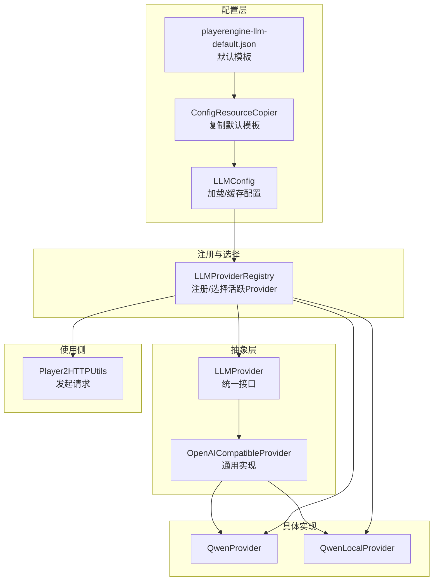
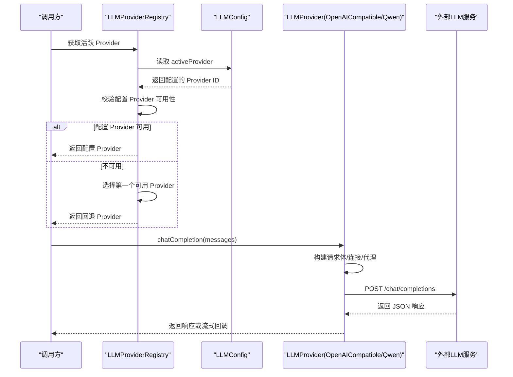
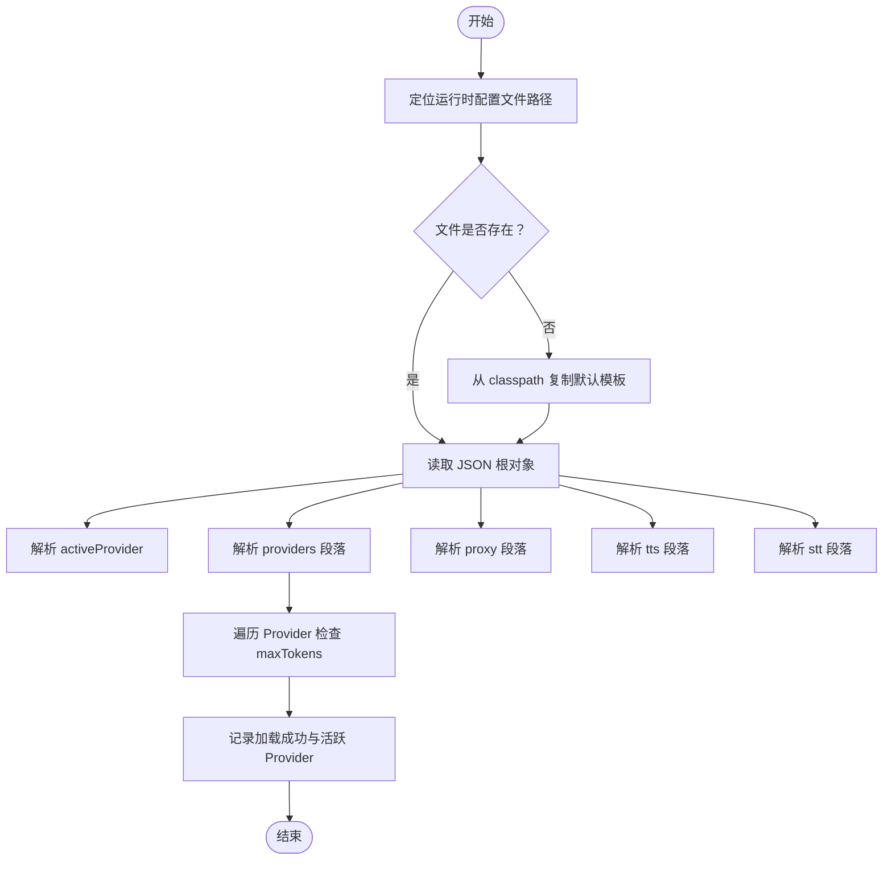
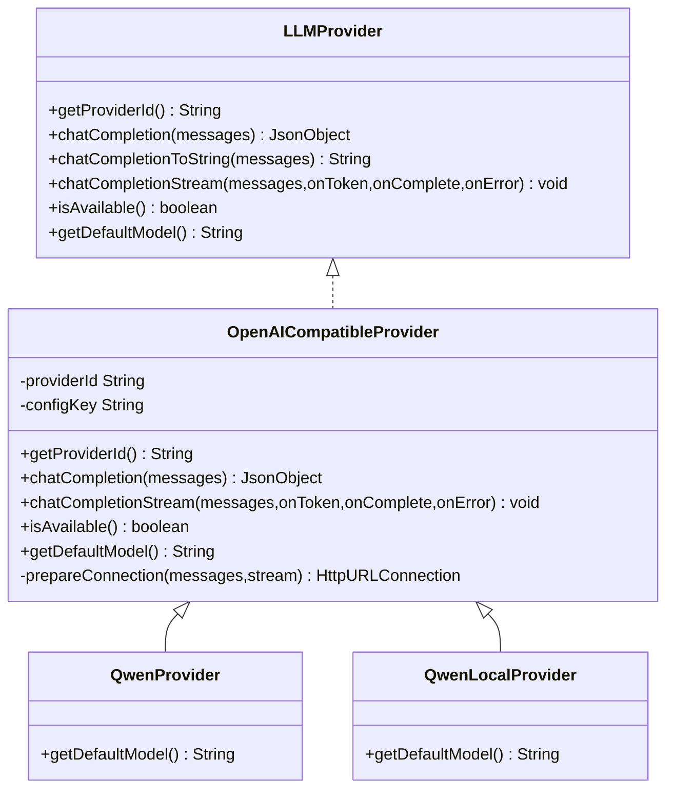
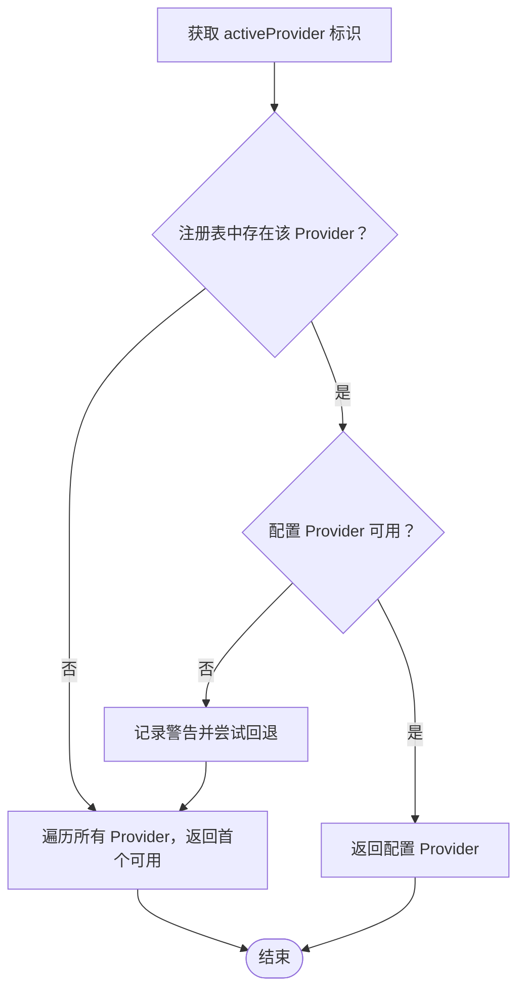
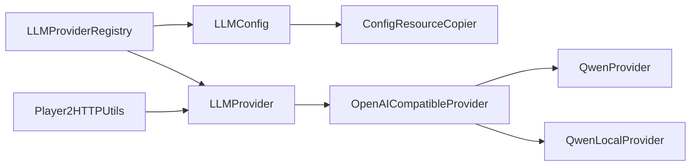

# LLM 配置管理

<cite>
**本文引用的文件**
- [LLMConfig.java](file://src/main/java/adris/altoclef/player2api/llm/LLMConfig.java)
- [LLMProvider.java](file://src/main/java/adris/altoclef/player2api/llm/LLMProvider.java)
- [LLMProviderRegistry.java](file://src/main/java/adris/altoclef/player2api/llm/LLMProviderRegistry.java)
- [OpenAICompatibleProvider.java](file://src/main/java/adris/altoclef/player2api/llm/impl/OpenAICompatibleProvider.java)
- [QwenProvider.java](file://src/main/java/adris/altoclef/player2api/llm/impl/QwenProvider.java)
- [QwenLocalProvider.java](file://src/main/java/adris/altoclef/player2api/llm/impl/QwenLocalProvider.java)
- [ConfigResourceCopier.java](file://src/main/java/adris/altoclef/player2api/utils/ConfigResourceCopier.java)
- [playerengine-llm-default.json](file://src/main/resources/playerengine-llm-default.json)
- [Player2HTTPUtils.java](file://src/main/java/adris/altoclef/player2api/utils/Player2HTTPUtils.java)
</cite>

## 目录
1. [简介](#简介)
2. [项目结构](#项目结构)
3. [核心组件](#核心组件)
4. [架构总览](#架构总览)
5. [组件详解](#组件详解)
6. [依赖关系分析](#依赖关系分析)
7. [性能与可靠性](#性能与可靠性)
8. [故障排查指南](#故障排查指南)
9. [结论](#结论)
10. [附录：配置示例与最佳实践](#附录配置示例与最佳实践)

## 简介
本文件面向“LLM 配置管理”的技术文档，围绕以下目标展开：
- 解释 LLM 配置文件结构与字段含义
- 描述默认配置模板加载机制与运行时热更新能力
- 分析多 Provider 的配置分离与选择策略
- 深入解析 LLMConfig 类的配置加载、校验、默认值与可用性判断
- 说明配置版本管理、迁移策略与向后兼容性保障
- 提供可操作的配置示例与故障排查建议

## 项目结构
与 LLM 配置管理直接相关的模块集中在 player2api 子包下，采用“接口 + 注册表 + 具体实现 + 默认配置 + 工具类”的分层设计：
- 配置层：LLMConfig 负责读取与缓存配置；默认模板由 ConfigResourceCopier 从 classpath 复制到运行时配置目录
- Provider 抽象层：LLMProvider 定义统一接口；OpenAICompatibleProvider 提供通用实现；具体提供商通过继承扩展
- 注册与选择：LLMProviderRegistry 维护 Provider 列表，并根据配置与可用性选择当前活跃 Provider
- 示例与集成：QwenProvider、QwenLocalProvider 展示不同提供商的差异化配置键与默认模型
- 使用侧：Player2HTTPUtils 等模块通过 Provider 发起实际的 LLM 请求

图表来源
- [LLMConfig.java:13-89](file://src/main/java/adris/altoclef/player2api/llm/LLMConfig.java#L13-L89)
- [ConfigResourceCopier.java:12-57](file://src/main/java/adris/altoclef/player2api/utils/ConfigResourceCopier.java#L12-L57)
- [playerengine-llm-default.json:1-89](file://src/main/resources/playerengine-llm-default.json#L1-L89)
- [LLMProvider.java:7-66](file://src/main/java/adris/altoclef/player2api/llm/LLMProvider.java#L7-L66)
- [OpenAICompatibleProvider.java:19-225](file://src/main/java/adris/altoclef/player2api/llm/impl/OpenAICompatibleProvider.java#L19-L225)
- [QwenProvider.java:3-21](file://src/main/java/adris/altoclef/player2api/llm/impl/QwenProvider.java#L3-L21)
- [QwenLocalProvider.java:3-22](file://src/main/java/adris/altoclef/player2api/llm/impl/QwenLocalProvider.java#L3-L22)
- [LLMProviderRegistry.java:12-79](file://src/main/java/adris/altoclef/player2api/llm/LLMProviderRegistry.java#L12-L79)
- [Player2HTTPUtils.java:94-112](file://src/main/java/adris/altoclef/player2api/utils/Player2HTTPUtils.java#L94-L112)

章节来源
- [LLMConfig.java:13-89](file://src/main/java/adris/altoclef/player2api/llm/LLMConfig.java#L13-L89)
- [ConfigResourceCopier.java:12-57](file://src/main/java/adris/altoclef/player2api/utils/ConfigResourceCopier.java#L12-L57)
- [playerengine-llm-default.json:1-89](file://src/main/resources/playerengine-llm-default.json#L1-L89)
- [LLMProvider.java:7-66](file://src/main/java/adris/altoclef/player2api/llm/LLMProvider.java#L7-L66)
- [OpenAICompatibleProvider.java:19-225](file://src/main/java/adris/altoclef/player2api/llm/impl/OpenAICompatibleProvider.java#L19-L225)
- [QwenProvider.java:3-21](file://src/main/java/adris/altoclef/player2api/llm/impl/QwenProvider.java#L3-L21)
- [QwenLocalProvider.java:3-22](file://src/main/java/adris/altoclef/player2api/llm/impl/QwenLocalProvider.java#L3-L22)
- [LLMProviderRegistry.java:12-79](file://src/main/java/adris/altoclef/player2api/llm/LLMProviderRegistry.java#L12-L79)
- [Player2HTTPUtils.java:94-112](file://src/main/java/adris/altoclef/player2api/utils/Player2HTTPUtils.java#L94-L112)

## 核心组件
- LLMConfig：单例配置加载器，负责定位并加载运行时配置文件，解析 activeProvider、providers、proxy、tts、stt 等段落，并对部分关键参数进行基础校验
- LLMProvider：统一接口，定义 chatCompletion、chatCompletionToString、chatCompletionStream、isAvailable、getDefaultModel 等方法
- OpenAICompatibleProvider：通用实现，封装了 OpenAI 兼容格式的请求构建、连接建立、代理支持、流式与非流式响应处理、可用性判断与默认模型
- LLMProviderRegistry：Provider 注册表，负责内置 Provider 的注册与活跃 Provider 的选择逻辑
- ConfigResourceCopier：默认配置复制工具，确保首次运行时从 classpath 将默认模板复制到运行时配置目录
- 具体 Provider：QwenProvider、QwenLocalProvider 通过继承 OpenAICompatibleProvider 并重写 providerId、configKey 与默认模型，实现多提供商配置分离

章节来源
- [LLMConfig.java:13-89](file://src/main/java/adris/altoclef/player2api/llm/LLMConfig.java#L13-L89)
- [LLMProvider.java:7-66](file://src/main/java/adris/altoclef/player2api/llm/LLMProvider.java#L7-L66)
- [OpenAICompatibleProvider.java:19-225](file://src/main/java/adris/altoclef/player2api/llm/impl/OpenAICompatibleProvider.java#L19-L225)
- [LLMProviderRegistry.java:12-79](file://src/main/java/adris/altoclef/player2api/llm/LLMProviderRegistry.java#L12-L79)
- [ConfigResourceCopier.java:12-57](file://src/main/java/adris/altoclef/player2api/utils/ConfigResourceCopier.java#L12-L57)
- [QwenProvider.java:3-21](file://src/main/java/adris/altoclef/player2api/llm/impl/QwenProvider.java#L3-L21)
- [QwenLocalProvider.java:3-22](file://src/main/java/adris/altoclef/player2api/llm/impl/QwenLocalProvider.java#L3-L22)

## 架构总览
下面的序列图展示了“获取活跃 Provider 并发起聊天补全”的端到端流程。

图表来源
- [LLMProviderRegistry.java:45-70](file://src/main/java/adris/altoclef/player2api/llm/LLMProviderRegistry.java#L45-L70)
- [LLMConfig.java:54-89](file://src/main/java/adris/altoclef/player2api/llm/LLMConfig.java#L54-L89)
- [OpenAICompatibleProvider.java:47-141](file://src/main/java/adris/altoclef/player2api/llm/impl/OpenAICompatibleProvider.java#L47-L141)
- [Player2HTTPUtils.java:94-112](file://src/main/java/adris/altoclef/player2api/utils/Player2HTTPUtils.java#L94-L112)

## 组件详解

### LLMConfig：配置加载与缓存
- 文件定位与默认模板复制
  - 通过 ConfigResourceCopier 确保运行时配置目录存在目标文件；若缺失则从 classpath 资源复制默认模板
  - 默认模板路径与运行时文件名在 LLMConfig 内部常量中声明
- 配置解析
  - 解析根对象中的 activeProvider、providers、proxy、tts、stt 等段落
  - 对每个 Provider 的 maxTokens 进行阈值告警，提示过小可能导致 JSON 响应不完整
- 热更新
  - 提供 reload 方法以重新从磁盘加载配置，实现运行时热更新
- 关键字段说明（来自默认模板）
  - activeProvider：当前活跃 Provider 标识
  - providers.*.enabled：是否启用该 Provider
  - providers.*.apiUrl：服务端点
  - providers.*.apiKey：访问密钥
  - providers.*.model：默认模型名称
  - providers.*.maxTokens：最大生成长度（范围约束在 1..65536）
  - providers.*.temperature：采样温度
  - proxy.enabled/host/port：HTTP 代理开关与地址
  - tts/stt：TTS/STT 子配置段落（模型、音色、语速、音高等）

图表来源
- [LLMConfig.java:33-89](file://src/main/java/adris/altoclef/player2api/llm/LLMConfig.java#L33-L89)
- [ConfigResourceCopier.java:29-57](file://src/main/java/adris/altoclef/player2api/utils/ConfigResourceCopier.java#L29-L57)
- [playerengine-llm-default.json:1-89](file://src/main/resources/playerengine-llm-default.json#L1-L89)

章节来源
- [LLMConfig.java:13-89](file://src/main/java/adris/altoclef/player2api/llm/LLMConfig.java#L13-L89)
- [ConfigResourceCopier.java:12-57](file://src/main/java/adris/altoclef/player2api/utils/ConfigResourceCopier.java#L12-L57)
- [playerengine-llm-default.json:1-89](file://src/main/resources/playerengine-llm-default.json#L1-L89)

### LLMProvider 与 OpenAICompatibleProvider：统一接口与通用实现
- LLMProvider 接口
  - 规范了 Provider 的标识、聊天补全、字符串便捷方法、流式补全、可用性判断与默认模型
- OpenAICompatibleProvider
  - 从 LLMConfig 读取对应 configKey 的配置（apiUrl、apiKey、model、maxTokens、temperature）
  - 支持代理（HTTP 代理）与超时设置
  - 统一构建 OpenAI 兼容格式的请求体（/v1/chat/completions）
  - 非流式与流式两种调用路径，流式解析 SSE 数据块
  - isAvailable 基于 enabled 与 apiKey 的有效性判断
  - 默认模型可在子类中覆盖

图表来源
- [LLMProvider.java:7-66](file://src/main/java/adris/altoclef/player2api/llm/LLMProvider.java#L7-L66)
- [OpenAICompatibleProvider.java:19-225](file://src/main/java/adris/altoclef/player2api/llm/impl/OpenAICompatibleProvider.java#L19-L225)
- [QwenProvider.java:3-21](file://src/main/java/adris/altoclef/player2api/llm/impl/QwenProvider.java#L3-L21)
- [QwenLocalProvider.java:3-22](file://src/main/java/adris/altoclef/player2api/llm/impl/QwenLocalProvider.java#L3-L22)

章节来源
- [LLMProvider.java:7-66](file://src/main/java/adris/altoclef/player2api/llm/LLMProvider.java#L7-L66)
- [OpenAICompatibleProvider.java:19-225](file://src/main/java/adris/altoclef/player2api/llm/impl/OpenAICompatibleProvider.java#L19-L225)
- [QwenProvider.java:3-21](file://src/main/java/adris/altoclef/player2api/llm/impl/QwenProvider.java#L3-L21)
- [QwenLocalProvider.java:3-22](file://src/main/java/adris/altoclef/player2api/llm/impl/QwenLocalProvider.java#L3-L22)

### LLMProviderRegistry：Provider 注册与选择
- 注册内置 Provider：在首次访问时注册 Qwen、OpenAI 兼容、本地 Qwen（Ollama）等
- 选择逻辑
  - 优先返回配置的 activeProvider 且 isAvailable() 为真
  - 若不可用，回退到第一个可用 Provider
  - 若全部不可用，抛出异常提示检查配置文件

图表来源
- [LLMProviderRegistry.java:45-70](file://src/main/java/adris/altoclef/player2api/llm/LLMProviderRegistry.java#L45-L70)

章节来源
- [LLMProviderRegistry.java:12-79](file://src/main/java/adris/altoclef/player2api/llm/LLMProviderRegistry.java#L12-L79)

### 默认配置模板与运行时配置
- 默认模板位于 src/main/resources/playerengine-llm-default.json，包含注释与示例字段
- ConfigResourceCopier 在首次运行时将默认模板复制到运行时配置目录（run/config/），避免每次手动维护
- 运行时可通过 LLMConfig.reload() 实现热更新，无需重启进程

章节来源
- [playerengine-llm-default.json:1-89](file://src/main/resources/playerengine-llm-default.json#L1-L89)
- [ConfigResourceCopier.java:12-57](file://src/main/java/adris/altoclef/player2api/utils/ConfigResourceCopier.java#L12-L57)
- [LLMConfig.java:49-52](file://src/main/java/adris/altoclef/player2api/llm/LLMConfig.java#L49-L52)

## 依赖关系分析
- LLMConfig 依赖 ConfigResourceCopier 完成默认模板复制与路径解析
- OpenAICompatibleProvider 依赖 LLMConfig 获取 Provider 配置，并通过 Java 原生 HttpURLConnection 访问外部服务
- LLMProviderRegistry 依赖 LLMConfig 读取 activeProvider，并依赖各 Provider 的 isAvailable 判断
- Player2HTTPUtils 通过 Provider 发起请求，形成“配置 -> Provider -> 网络”的调用链

图表来源
- [LLMConfig.java:33-39](file://src/main/java/adris/altoclef/player2api/llm/LLMConfig.java#L33-L39)
- [ConfigResourceCopier.java:29-37](file://src/main/java/adris/altoclef/player2api/utils/ConfigResourceCopier.java#L29-L37)
- [LLMProviderRegistry.java:49-70](file://src/main/java/adris/altoclef/player2api/llm/LLMProviderRegistry.java#L49-L70)
- [OpenAICompatibleProvider.java:51-109](file://src/main/java/adris/altoclef/player2api/llm/impl/OpenAICompatibleProvider.java#L51-L109)
- [Player2HTTPUtils.java:94-112](file://src/main/java/adris/altoclef/player2api/utils/Player2HTTPUtils.java#L94-L112)

章节来源
- [LLMConfig.java:33-39](file://src/main/java/adris/altoclef/player2api/llm/LLMConfig.java#L33-L39)
- [ConfigResourceCopier.java:29-37](file://src/main/java/adris/altoclef/player2api/utils/ConfigResourceCopier.java#L29-L37)
- [LLMProviderRegistry.java:49-70](file://src/main/java/adris/altoclef/player2api/llm/LLMProviderRegistry.java#L49-L70)
- [OpenAICompatibleProvider.java:51-109](file://src/main/java/adris/altoclef/player2api/llm/impl/OpenAICompatibleProvider.java#L51-L109)
- [Player2HTTPUtils.java:94-112](file://src/main/java/adris/altoclef/player2api/utils/Player2HTTPUtils.java#L94-L112)

## 性能与可靠性
- 连接与超时
  - 设置连接与读取超时，避免阻塞
- 流式响应
  - SSE 流式解析，首 token（TTFT）日志提示，提升用户体验
- 参数范围控制
  - maxTokens 被限制在 1..65536，防止无效或过大请求
- 代理支持
  - 支持 HTTP 代理，便于跨网络环境访问
- 可用性判断
  - 通过 enabled 与 apiKey 校验，避免无效请求

章节来源
- [OpenAICompatibleProvider.java:59-61](file://src/main/java/adris/altoclef/player2api/llm/impl/OpenAICompatibleProvider.java#L59-L61)
- [OpenAICompatibleProvider.java:101-102](file://src/main/java/adris/altoclef/player2api/llm/impl/OpenAICompatibleProvider.java#L101-L102)
- [OpenAICompatibleProvider.java:166-204](file://src/main/java/adris/altoclef/player2api/llm/impl/OpenAICompatibleProvider.java#L166-L204)
- [OpenAICompatibleProvider.java:212-219](file://src/main/java/adris/altoclef/player2api/llm/impl/OpenAICompatibleProvider.java#L212-L219)

## 故障排查指南
- 配置文件未生成或未生效
  - 检查运行时配置目录是否存在 playerengine-llm.json；首次启动应由默认模板复制生成
  - 如需强制重载，调用 LLMConfig.reload() 或重启进程
- Provider 不可用
  - 查看对应 providers.*.enabled 与 apiKey 是否正确填写
  - 若配置 Provider 不可用，系统会回退到第一个可用 Provider；若全部不可用，将抛出异常
- 网络/代理问题
  - 若访问 OpenAI 等海外服务，请启用 proxy 并确认 host/port 正确
- 响应异常
  - 非 2xx 状态码会记录错误日志；检查 apiUrl、apiKey、模型名与网络连通性
- 参数过小导致响应不完整
  - LLMConfig 对 providers.*.maxTokens 进行阈值告警；适当提高以满足预期输出

章节来源
- [ConfigResourceCopier.java:33-57](file://src/main/java/adris/altoclef/player2api/utils/ConfigResourceCopier.java#L33-L57)
- [LLMConfig.java:73-84](file://src/main/java/adris/altoclef/player2api/llm/LLMConfig.java#L73-L84)
- [LLMProviderRegistry.java:49-70](file://src/main/java/adris/altoclef/player2api/llm/LLMProviderRegistry.java#L49-L70)
- [OpenAICompatibleProvider.java:129-132](file://src/main/java/adris/altoclef/player2api/llm/impl/OpenAICompatibleProvider.java#L129-L132)
- [OpenAICompatibleProvider.java:154-164](file://src/main/java/adris/altoclef/player2api/llm/impl/OpenAICompatibleProvider.java#L154-L164)

## 结论
本配置体系通过“默认模板 + 运行时复制 + 单例缓存 + 注册表选择”的方式，实现了多 Provider 的灵活配置与热更新能力。OpenAI 兼容实现提供了统一的请求构建、代理与流式处理能力，结合可用性判断与参数范围控制，提升了稳定性与可维护性。配合完善的日志与告警，能够快速定位配置与网络问题。

## 附录：配置示例与最佳实践

### 配置文件结构与字段说明（节选）
- activeProvider：当前活跃 Provider 标识
- providers.*.enabled：启用该 Provider
- providers.*.apiUrl：服务端点
- providers.*.apiKey：访问密钥
- providers.*.model：默认模型
- providers.*.maxTokens：最大生成长度（建议 ≥ 256 以容纳完整 JSON）
- providers.*.temperature：采样温度
- proxy.enabled/host/port：HTTP 代理
- tts/stt：TTS/STT 子配置（模型、音色、语速、音高等）

章节来源
- [playerengine-llm-default.json:1-89](file://src/main/resources/playerengine-llm-default.json#L1-L89)
- [LLMConfig.java:54-84](file://src/main/java/adris/altoclef/player2api/llm/LLMConfig.java#L54-L84)

### 多 Provider 配置分离示例
- 阿里云通义（DashScope）：providers.qwen
- OpenAI：providers.openai
- 本地 Ollama：providers.qwen_local
- 官方远程模式：providers.player2-remote

章节来源
- [playerengine-llm-default.json:9-43](file://src/main/resources/playerengine-llm-default.json#L9-L43)
- [QwenProvider.java:3-21](file://src/main/java/adris/altoclef/player2api/llm/impl/QwenProvider.java#L3-L21)
- [QwenLocalProvider.java:3-22](file://src/main/java/adris/altoclef/player2api/llm/impl/QwenLocalProvider.java#L3-L22)

### 热更新策略
- 运行时调用 LLMConfig.reload() 重新加载配置
- 修改配置后建议重启进程以确保全局一致性

章节来源
- [LLMConfig.java:49-52](file://src/main/java/adris/altoclef/player2api/llm/LLMConfig.java#L49-L52)

### 版本管理与迁移
- 默认模板位于 src/main/resources/playerengine-llm-default.json，作为新版本基线
- 运行时配置文件由 ConfigResourceCopier 从 classpath 复制而来，升级时保留用户自定义项
- 建议在升级前备份运行时配置文件，以便回滚

章节来源
- [ConfigResourceCopier.java:29-57](file://src/main/java/adris/altoclef/player2api/utils/ConfigResourceCopier.java#L29-L57)
- [playerengine-llm-default.json:1-89](file://src/main/resources/playerengine-llm-default.json#L1-L89)

### 最佳实践
- 为不同 Provider 设置独立的 apiKey，避免混用
- 为生产环境开启代理（如需）并测试连通性
- 合理设置 maxTokens，避免过小导致响应截断
- 使用 activeProvider 指定首选 Provider，并确保其 isAvailable
- 定期检查日志中的告警信息，及时调整参数