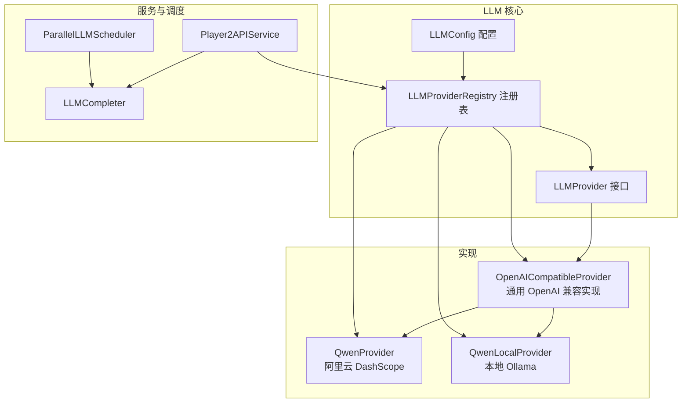
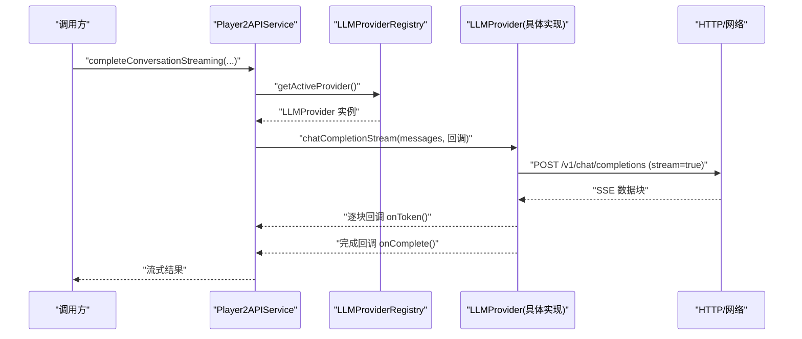
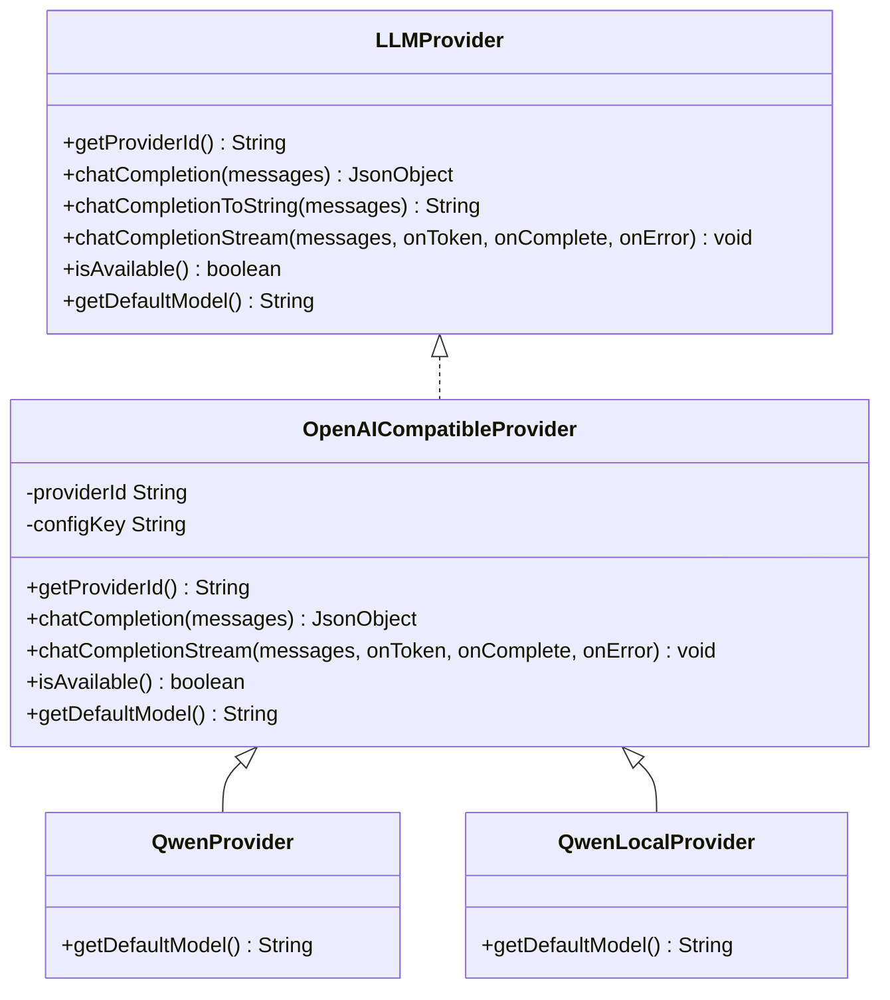
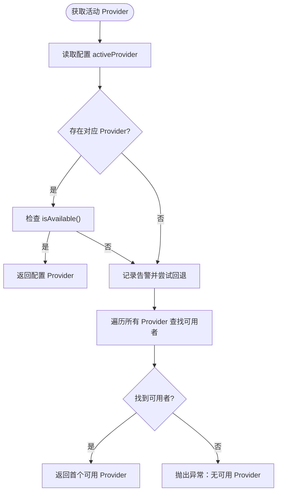
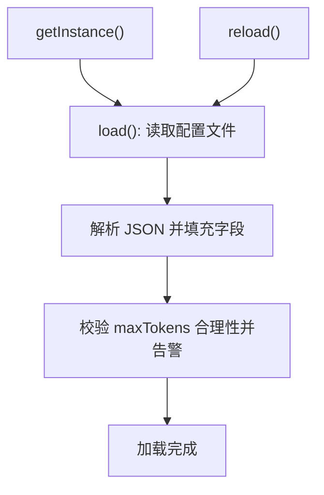
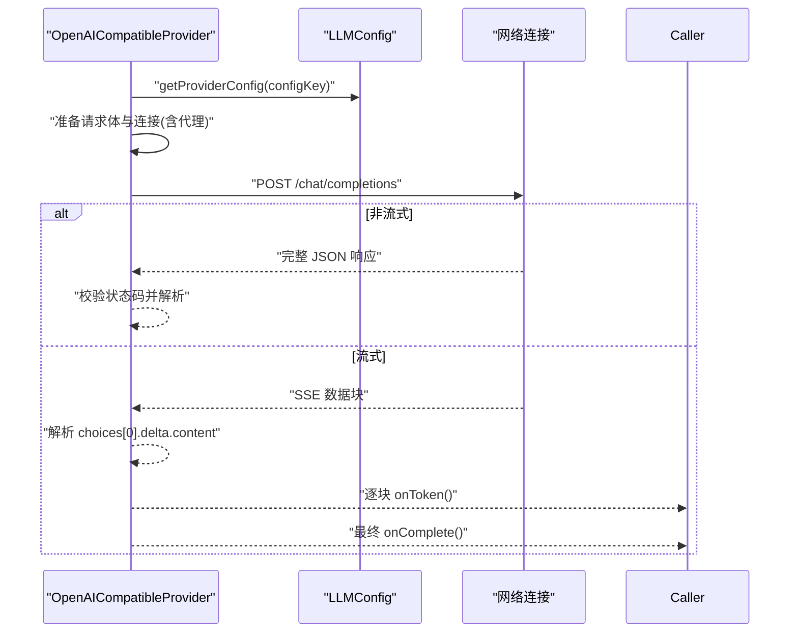
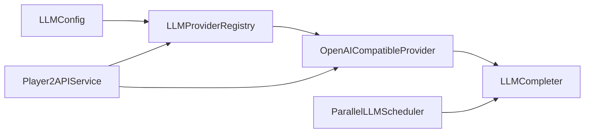

# LLM 集成系统

<cite>
**本文引用的文件**
- [LLMProvider.java](file://src/main/java/adris/altoclef/player2api/llm/LLMProvider.java)
- [LLMProviderRegistry.java](file://src/main/java/adris/altoclef/player2api/llm/LLMProviderRegistry.java)
- [LLMConfig.java](file://src/main/java/adris/altoclef/player2api/llm/LLMConfig.java)
- [OpenAICompatibleProvider.java](file://src/main/java/adris/altoclef/player2api/llm/impl/OpenAICompatibleProvider.java)
- [QwenProvider.java](file://src/main/java/adris/altoclef/player2api/llm/impl/QwenProvider.java)
- [QwenLocalProvider.java](file://src/main/java/adris/altoclef/player2api/llm/impl/QwenLocalProvider.java)
- [ConfigResourceCopier.java](file://src/main/java/adris/altoclef/player2api/utils/ConfigResourceCopier.java)
- [playerengine-llm-default.json](file://src/main/resources/playerengine-llm-default.json)
- [Player2APIService.java](file://src/main/java/adris/altoclef/player2api/Player2APIService.java)
- [LLMCompleter.java](file://src/main/java/adris/altoclef/player2api/LLMCompleter.java)
- [ParallelLLMScheduler.java](file://src/main/java/adris/altoclef/player2api/ParallelLLMScheduler.java)
</cite>

## 目录
1. [简介](#简介)
2. [项目结构](#项目结构)
3. [核心组件](#核心组件)
4. [架构总览](#架构总览)
5. [详细组件分析](#详细组件分析)
6. [依赖分析](#依赖分析)
7. [性能考虑](#性能考虑)
8. [故障排查指南](#故障排查指南)
9. [结论](#结论)
10. [附录](#附录)

## 简介
本技术文档面向 LLM 集成系统，系统采用策略模式与注册表管理机制，结合配置驱动的插件化架构，实现对多种大语言模型提供商的统一接入与无缝切换。文档重点阐述以下方面：
- Provider 接口与策略模式应用
- Provider 注册表的管理与回退策略
- 配置驱动的插件化架构与热更新
- 已实现的提供商：QwenProvider（阿里云 DashScope）、OpenAICompatibleProvider（兼容 OpenAI 协议）
- 错误处理与重试机制
- 扩展指南：如何新增第三方 LLM Provider

## 项目结构
LLM 集成相关代码主要集中在 player2api/llm 及其子包，配合配置加载与调度模块协同工作。

图表来源
- [LLMProvider.java:11-66](file://src/main/java/adris/altoclef/player2api/llm/LLMProvider.java#L11-L66)
- [LLMProviderRegistry.java:16-79](file://src/main/java/adris/altoclef/player2api/llm/LLMProviderRegistry.java#L16-L79)
- [LLMConfig.java:19-89](file://src/main/java/adris/altoclef/player2api/llm/LLMConfig.java#L19-L89)
- [OpenAICompatibleProvider.java:24-225](file://src/main/java/adris/altoclef/player2api/llm/impl/OpenAICompatibleProvider.java#L24-L225)
- [QwenProvider.java:11-21](file://src/main/java/adris/altoclef/player2api/llm/impl/QwenProvider.java#L11-L21)
- [QwenLocalProvider.java:12-22](file://src/main/java/adris/altoclef/player2api/llm/impl/QwenLocalProvider.java#L12-L22)
- [Player2APIService.java:109-118](file://src/main/java/adris/altoclef/player2api/Player2APIService.java#L109-L118)
- [LLMCompleter.java:17-318](file://src/main/java/adris/altoclef/player2api/LLMCompleter.java#L17-L318)
- [ParallelLLMScheduler.java:17-187](file://src/main/java/adris/altoclef/player2api/ParallelLLMScheduler.java#L17-L187)

章节来源
- [LLMProvider.java:1-67](file://src/main/java/adris/altoclef/player2api/llm/LLMProvider.java#L1-L67)
- [LLMProviderRegistry.java:1-80](file://src/main/java/adris/altoclef/player2api/llm/LLMProviderRegistry.java#L1-L80)
- [LLMConfig.java:1-116](file://src/main/java/adris/altoclef/player2api/llm/LLMConfig.java#L1-L116)
- [OpenAICompatibleProvider.java:1-226](file://src/main/java/adris/altoclef/player2api/llm/impl/OpenAICompatibleProvider.java#L1-L226)
- [QwenProvider.java:1-22](file://src/main/java/adris/altoclef/player2api/llm/impl/QwenProvider.java#L1-L22)
- [QwenLocalProvider.java:1-23](file://src/main/java/adris/altoclef/player2api/llm/impl/QwenLocalProvider.java#L1-L23)
- [Player2APIService.java:1-200](file://src/main/java/adris/altoclef/player2api/Player2APIService.java#L1-L200)
- [LLMCompleter.java:1-318](file://src/main/java/adris/altoclef/player2api/LLMCompleter.java#L1-L318)
- [ParallelLLMScheduler.java:1-188](file://src/main/java/adris/altoclef/player2api/ParallelLLMScheduler.java#L1-L188)

## 核心组件
- LLMProvider 接口：统一抽象，定义提供商标识、聊天补全、流式补全、可用性判断与默认模型等能力。
- LLMProviderRegistry 注册表：单例，负责内置 Provider 的自动注册与按配置选择活动 Provider，并在配置 Provider 不可用时进行回退。
- LLMConfig 配置：负责从运行时配置目录加载 JSON 配置，支持代理、TTS/STT 等附加配置，并提供热加载能力。
- OpenAICompatibleProvider：通用 OpenAI 兼容实现，封装 HTTP 请求、SSE 流式解析、代理支持、可用性校验与默认模型。
- QwenProvider：基于 OpenAI 兼容层的阿里云 DashScope 实现，覆盖提供商 ID、配置键与默认模型。
- QwenLocalProvider：本地 Ollama 实现，覆盖提供商 ID、配置键与默认模型。
- Player2APIService：对外服务入口，负责将对话历史转换为请求并调用 Provider 或远端服务。
- LLMCompleter：非流式与流式的调用编排器，内置重试与超时保护，以及 JSON 清洗与回退响应。
- ParallelLLMScheduler：多实例调度器，内置令牌桶限流，支持多 NPC 并发对话。

章节来源
- [LLMProvider.java:11-66](file://src/main/java/adris/altoclef/player2api/llm/LLMProvider.java#L11-L66)
- [LLMProviderRegistry.java:16-79](file://src/main/java/adris/altoclef/player2api/llm/LLMProviderRegistry.java#L16-L79)
- [LLMConfig.java:19-116](file://src/main/java/adris/altoclef/player2api/llm/LLMConfig.java#L19-L116)
- [OpenAICompatibleProvider.java:24-225](file://src/main/java/adris/altoclef/player2api/llm/impl/OpenAICompatibleProvider.java#L24-L225)
- [QwenProvider.java:11-21](file://src/main/java/adris/altoclef/player2api/llm/impl/QwenProvider.java#L11-L21)
- [QwenLocalProvider.java:12-22](file://src/main/java/adris/altoclef/player2api/llm/impl/QwenLocalProvider.java#L12-L22)
- [Player2APIService.java:48-118](file://src/main/java/adris/altoclef/player2api/Player2APIService.java#L48-L118)
- [LLMCompleter.java:17-318](file://src/main/java/adris/altoclef/player2api/LLMCompleter.java#L17-L318)
- [ParallelLLMScheduler.java:17-187](file://src/main/java/adris/altoclef/player2api/ParallelLLMScheduler.java#L17-L187)

## 架构总览
系统采用“接口 + 策略 + 注册表”的分层设计，通过统一接口屏蔽不同提供商差异，通过注册表集中管理与选择，通过配置驱动实现插件化扩展与热切换。

图表来源
- [Player2APIService.java:109-118](file://src/main/java/adris/altoclef/player2api/Player2APIService.java#L109-L118)
- [LLMProviderRegistry.java:49-70](file://src/main/java/adris/altoclef/player2api/llm/LLMProviderRegistry.java#L49-L70)
- [OpenAICompatibleProvider.java:144-209](file://src/main/java/adris/altoclef/player2api/llm/impl/OpenAICompatibleProvider.java#L144-L209)

## 详细组件分析

### LLMProvider 接口与策略模式
- 设计要点
  - 统一方法：提供者 ID、聊天补全（JSON）、聊天补全（字符串）、流式补全、可用性、默认模型。
  - 默认实现：非流式回退到流式实现，便于具体提供商只实现必要部分。
- 策略模式体现
  - 不同提供商通过实现同一接口，实现“算法族”替换，注册表按配置选择具体策略。

图表来源
- [LLMProvider.java:11-66](file://src/main/java/adris/altoclef/player2api/llm/LLMProvider.java#L11-L66)
- [OpenAICompatibleProvider.java:24-225](file://src/main/java/adris/altoclef/player2api/llm/impl/OpenAICompatibleProvider.java#L24-L225)
- [QwenProvider.java:11-21](file://src/main/java/adris/altoclef/player2api/llm/impl/QwenProvider.java#L11-L21)
- [QwenLocalProvider.java:12-22](file://src/main/java/adris/altoclef/player2api/llm/impl/QwenLocalProvider.java#L12-L22)

章节来源
- [LLMProvider.java:11-66](file://src/main/java/adris/altoclef/player2api/llm/LLMProvider.java#L11-L66)

### LLMProviderRegistry 注册表与回退策略
- 自动注册内置 Provider：首次访问时注册 QwenProvider、OpenAICompatibleProvider、QwenLocalProvider。
- 活动 Provider 选择：
  - 优先使用配置中的 activeProvider 对应的 Provider；
  - 若不可用则遍历查找首个可用 Provider；
  - 若均不可用抛出异常提示检查配置。
- 查询与导出：支持按 ID 获取、导出全部 Provider。

图表来源
- [LLMProviderRegistry.java:49-70](file://src/main/java/adris/altoclef/player2api/llm/LLMProviderRegistry.java#L49-L70)

章节来源
- [LLMProviderRegistry.java:16-79](file://src/main/java/adris/altoclef/player2api/llm/LLMProviderRegistry.java#L16-L79)

### LLMConfig 配置管理与热更新
- 配置文件定位与复制：通过 ConfigResourceCopier 确保运行时配置目录存在默认模板，避免开发与生产环境差异。
- 加载内容：activeProvider、providers（各提供商配置）、proxy、tts、stt 等。
- 热更新：提供 reload 方法重新加载配置；在配置中对 maxTokens 做边界提示。
- 代理支持：根据配置决定是否启用 HTTP 代理及代理地址端口。

图表来源
- [LLMConfig.java:54-89](file://src/main/java/adris/altoclef/player2api/llm/LLMConfig.java#L54-L89)
- [ConfigResourceCopier.java:29-57](file://src/main/java/adris/altoclef/player2api/utils/ConfigResourceCopier.java#L29-L57)

章节来源
- [LLMConfig.java:19-116](file://src/main/java/adris/altoclef/player2api/llm/LLMConfig.java#L19-L116)
- [ConfigResourceCopier.java:18-59](file://src/main/java/adris/altoclef/player2api/utils/ConfigResourceCopier.java#L18-L59)
- [playerengine-llm-default.json:1-89](file://src/main/resources/playerengine-llm-default.json#L1-L89)

### OpenAICompatibleProvider：兼容性设计与流式实现
- 请求构建：从 LLMConfig 读取 apiUrl、apiKey、model、maxTokens、temperature；限制 maxTokens 范围；可选开启 stream。
- 连接与代理：支持通过 LLMConfig 的 proxy 配置启用 HTTP 代理。
- 非流式：发送请求，读取响应，校验状态码，解析 JSON。
- 流式：解析 SSE 数据块，提取 delta.content，首 token 触发 TTFT 记录，完成后回调完整文本。
- 可用性：要求 enabled 为真且 apiKey 非空且非占位符。

图表来源
- [OpenAICompatibleProvider.java:51-209](file://src/main/java/adris/altoclef/player2api/llm/impl/OpenAICompatibleProvider.java#L51-L209)
- [LLMConfig.java:93-98](file://src/main/java/adris/altoclef/player2api/llm/LLMConfig.java#L93-L98)

章节来源
- [OpenAICompatibleProvider.java:24-225](file://src/main/java/adris/altoclef/player2api/llm/impl/OpenAICompatibleProvider.java#L24-L225)

### QwenProvider 与 QwenLocalProvider：阿里云 DashScope 与本地 Ollama
- QwenProvider
  - 继承 OpenAICompatibleProvider，覆盖提供商 ID 与配置键为 "qwen"。
  - 默认模型：qwen-plus。
- QwenLocalProvider
  - 继承 OpenAICompatibleProvider，覆盖提供商 ID 与配置键为 "qwen_local"。
  - 默认模型：qwen2.5:7b。
- 两者均通过 OpenAI 兼容层实现统一行为，仅在配置键与默认模型上差异化。

章节来源
- [QwenProvider.java:11-21](file://src/main/java/adris/altoclef/player2api/llm/impl/QwenProvider.java#L11-L21)
- [QwenLocalProvider.java:12-22](file://src/main/java/adris/altoclef/player2api/llm/impl/QwenLocalProvider.java#L12-L22)
- [OpenAICompatibleProvider.java:24-225](file://src/main/java/adris/altoclef/player2api/llm/impl/OpenAICompatibleProvider.java#L24-L225)

### Player2APIService：统一服务入口与 Provider 调用
- completeConversation / completeConversationToString：将对话历史转换为请求体，调用远端服务并解析 JSON。
- completeConversationStreaming：直接委托 LLMProvider 的流式实现，实现与远端服务一致的流式体验。
- TTS：在本地模式下根据情绪动态调整语速与音调，合成音频并通过网络包发送至客户端。

章节来源
- [Player2APIService.java:48-118](file://src/main/java/adris/altoclef/player2api/Player2APIService.java#L48-L118)
- [Player2APIService.java:120-200](file://src/main/java/adris/altoclef/player2api/Player2APIService.java#L120-L200)

### LLMCompleter：调用编排、重试与回退
- 非流式：最多重试 N 次，指数级延迟补偿，失败时返回预设回退响应。
- 流式：接收逐块 token，首 token 触发回调，完成后解析 JSON，失败同样重试并回退。
- 超时保护：超过阈值强制释放锁并恢复可用状态。
- 与调度器协作：由 ParallelLLMScheduler 分配空闲实例，令牌桶限流控制并发。

章节来源
- [LLMCompleter.java:17-318](file://src/main/java/adris/altoclef/player2api/LLMCompleter.java#L17-L318)

### ParallelLLMScheduler：多实例与令牌桶限流
- 管理固定数量的 LLMCompleter 实例，支持多 NPC 并发对话。
- 令牌桶：按秒补充令牌，未达阈值拒绝提交，避免突发流量冲击。
- 可视化：提供活跃实例统计与速率设置接口。

章节来源
- [ParallelLLMScheduler.java:17-187](file://src/main/java/adris/altoclef/player2api/ParallelLLMScheduler.java#L17-L187)

## 依赖分析
- 组件耦合
  - LLMProviderRegistry 依赖 LLMConfig 读取活动 Provider 与可用性判断。
  - OpenAICompatibleProvider 依赖 LLMConfig 读取各提供商配置与代理设置。
  - Player2APIService 依赖 LLMProviderRegistry 获取 Provider，并在本地模式下与 TTS 集成。
  - LLMCompleter 与 ParallelLLMScheduler 作为上层调度与执行单元，解耦业务与调用细节。
- 外部依赖
  - HTTP 连接与 SSE 解析（OpenAI 兼容层）。
  - 配置文件系统（Fabric 配置目录）。

图表来源
- [LLMConfig.java:19-116](file://src/main/java/adris/altoclef/player2api/llm/LLMConfig.java#L19-L116)
- [LLMProviderRegistry.java:16-79](file://src/main/java/adris/altoclef/player2api/llm/LLMProviderRegistry.java#L16-L79)
- [OpenAICompatibleProvider.java:24-225](file://src/main/java/adris/altoclef/player2api/llm/impl/OpenAICompatibleProvider.java#L24-L225)
- [Player2APIService.java:109-118](file://src/main/java/adris/altoclef/player2api/Player2APIService.java#L109-L118)
- [LLMCompleter.java:17-318](file://src/main/java/adris/altoclef/player2api/LLMCompleter.java#L17-L318)
- [ParallelLLMScheduler.java:17-187](file://src/main/java/adris/altoclef/player2api/ParallelLLMScheduler.java#L17-L187)

## 性能考虑
- 限流与并发
  - 令牌桶限流避免突发请求导致下游过载，速率可调。
  - 多实例 LLMCompleter 并发处理，提升吞吐。
- 网络与解析
  - 流式响应减少首字节延迟，提升交互体验。
  - 对 SSE 数据块进行健壮解析，忽略无效片段。
- 配置与可用性
  - 在注册阶段与调用前进行可用性检查，避免无效请求。
  - 对极端配置（如 maxTokens 过小）给出告警，确保稳定性。

## 故障排查指南
- 无可用 Provider
  - 现象：抛出异常，提示检查配置目录中的 playerengine-llm.json。
  - 排查：确认 activeProvider 对应的提供商 enabled 为 true，apiKey 非空且非占位符。
- 流式解析失败或 JSON 不完整
  - 现象：流式完成回调解析异常，触发回退响应。
  - 排查：检查上游 Provider 的 SSE 输出格式，确认网络稳定与代理配置正确。
- 超时或阻塞
  - 现象：isAvailible 返回 false，或长时间卡顿。
  - 排查：检查 PROCESSING_TIMEOUT 阈值与线程池状态；确认外部服务响应时间。
- 代理问题
  - 现象：访问海外服务失败。
  - 排查：确认 proxy.enabled、host、port 正确；测试代理连通性。

章节来源
- [LLMProviderRegistry.java:69-70](file://src/main/java/adris/altoclef/player2api/llm/LLMProviderRegistry.java#L69-L70)
- [OpenAICompatibleProvider.java:212-219](file://src/main/java/adris/altoclef/player2api/llm/impl/OpenAICompatibleProvider.java#L212-L219)
- [LLMCompleter.java:305-318](file://src/main/java/adris/altoclef/player2api/LLMCompleter.java#L305-L318)
- [LLMCompleter.java:240-303](file://src/main/java/adris/altoclef/player2api/LLMCompleter.java#L240-L303)

## 结论
该 LLM 集成系统通过统一接口与注册表实现了策略模式的灵活替换，借助配置驱动与热更新达成插件化扩展，结合流式与重试机制保障了用户体验与稳定性。现有实现覆盖阿里云 DashScope 与本地 Ollama，同时保留了对其他 OpenAI 兼容服务的开放性。建议在扩展新 Provider 时遵循现有接口与兼容层约定，确保一致性与可维护性。

## 附录

### 如何创建新的 LLM Provider
- 步骤
  - 新建类实现 LLMProvider 接口，或继承 OpenAICompatibleProvider 以复用通用逻辑。
  - 在构造函数中设置 providerId 与 configKey，确保与配置文件中的键一致。
  - 如需默认模型，请覆写 getDefaultModel。
  - 在 LLMProviderRegistry 中注册该 Provider（若希望自动注册，可在 registerBuiltins 中加入）。
- 示例参考
  - [QwenProvider.java:11-21](file://src/main/java/adris/altoclef/player2api/llm/impl/QwenProvider.java#L11-L21)
  - [QwenLocalProvider.java:12-22](file://src/main/java/adris/altoclef/player2api/llm/impl/QwenLocalProvider.java#L12-L22)
  - [OpenAICompatibleProvider.java:24-225](file://src/main/java/adris/altoclef/player2api/llm/impl/OpenAICompatibleProvider.java#L24-L225)

章节来源
- [LLMProvider.java:11-66](file://src/main/java/adris/altoclef/player2api/llm/LLMProvider.java#L11-L66)
- [LLMProviderRegistry.java:32-43](file://src/main/java/adris/altoclef/player2api/llm/LLMProviderRegistry.java#L32-L43)

### 如何注册和配置不同的模型
- 注册
  - 在 LLMProviderRegistry.registerBuiltins 中添加新 Provider 实例，或在运行时调用 register。
- 配置
  - 在配置文件中为新 Provider 添加独立段落，包含 enabled、apiUrl、apiKey、model、maxTokens、temperature 等。
  - 将 activeProvider 指向新 Provider 的配置键以启用。
- 示例参考
  - [playerengine-llm-default.json:9-43](file://src/main/resources/playerengine-llm-default.json#L9-L43)
  - [LLMProviderRegistry.java:32-43](file://src/main/java/adris/altoclef/player2api/llm/LLMProviderRegistry.java#L32-L43)

章节来源
- [LLMProviderRegistry.java:32-43](file://src/main/java/adris/altoclef/player2api/llm/LLMProviderRegistry.java#L32-L43)
- [playerengine-llm-default.json:6-43](file://src/main/resources/playerengine-llm-default.json#L6-L43)

### 如何处理 LLM 调用的错误与重试
- 非流式重试
  - 最多重试 N 次，每次延迟递增；失败返回预设回退响应。
- 流式重试
  - 在流式回调 onError 中进行重试；完成后解析 JSON，失败同样回退。
- 可用性检查
  - Provider.isAvailable 用于注册与选择阶段过滤不可用 Provider。
- 示例参考
  - [LLMCompleter.java:151-176](file://src/main/java/adris/altoclef/player2api/LLMCompleter.java#L151-L176)
  - [LLMCompleter.java:240-303](file://src/main/java/adris/altoclef/player2api/LLMCompleter.java#L240-L303)
  - [OpenAICompatibleProvider.java:212-219](file://src/main/java/adris/altoclef/player2api/llm/impl/OpenAICompatibleProvider.java#L212-L219)

章节来源
- [LLMCompleter.java:151-176](file://src/main/java/adris/altoclef/player2api/LLMCompleter.java#L151-L176)
- [LLMCompleter.java:240-303](file://src/main/java/adris/altoclef/player2api/LLMCompleter.java#L240-L303)
- [OpenAICompatibleProvider.java:212-219](file://src/main/java/adris/altoclef/player2api/llm/impl/OpenAICompatibleProvider.java#L212-L219)

### 扩展指南：集成第三方大语言模型服务
- 建议步骤
  - 若第三方服务遵循 OpenAI /v1/chat/completions 协议，优先继承 OpenAICompatibleProvider，仅覆写 providerId、configKey 与默认模型。
  - 若协议不兼容，实现 LLMProvider 接口，自行处理请求构建、网络与解析。
  - 在 LLMProviderRegistry 中注册 Provider，并在配置文件中添加对应段落。
  - 使用 LLMCompleter 与 ParallelLLMScheduler 保证调用稳定性与并发控制。
- 注意事项
  - 严格校验 apiKey 与可用性，避免无效请求。
  - 对于流式服务，确保 SSE 输出格式与解析逻辑一致。
  - 关注 maxTokens 与温度等参数对输出质量的影响。

章节来源
- [OpenAICompatibleProvider.java:24-225](file://src/main/java/adris/altoclef/player2api/llm/impl/OpenAICompatibleProvider.java#L24-L225)
- [LLMProvider.java:11-66](file://src/main/java/adris/altoclef/player2api/llm/LLMProvider.java#L11-L66)
- [LLMProviderRegistry.java:32-43](file://src/main/java/adris/altoclef/player2api/llm/LLMProviderRegistry.java#L32-L43)
- [playerengine-llm-default.json:6-43](file://src/main/resources/playerengine-llm-default.json#L6-L43)