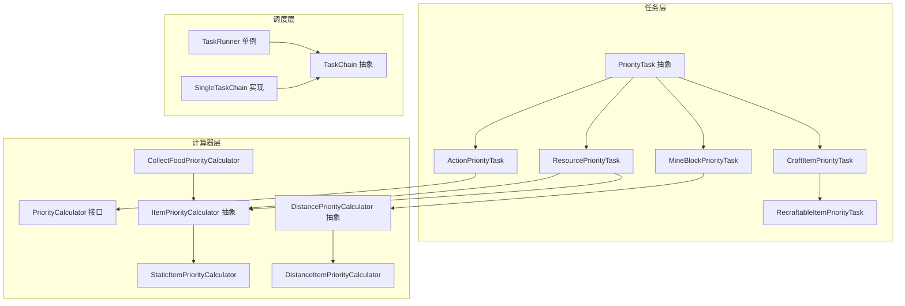
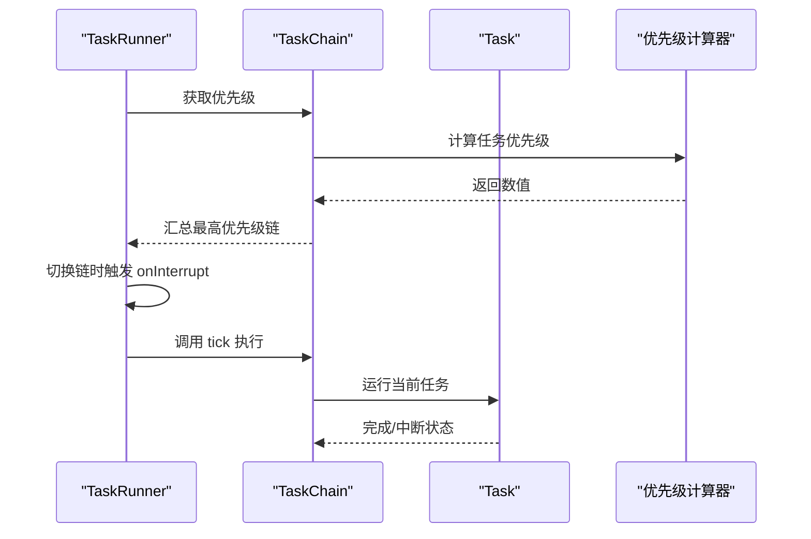
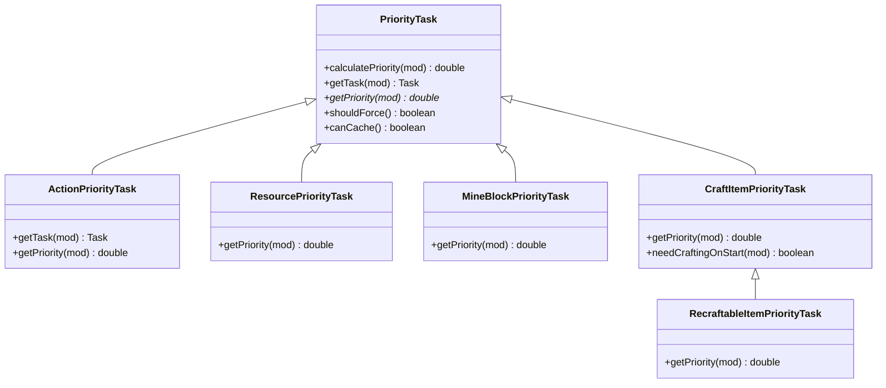
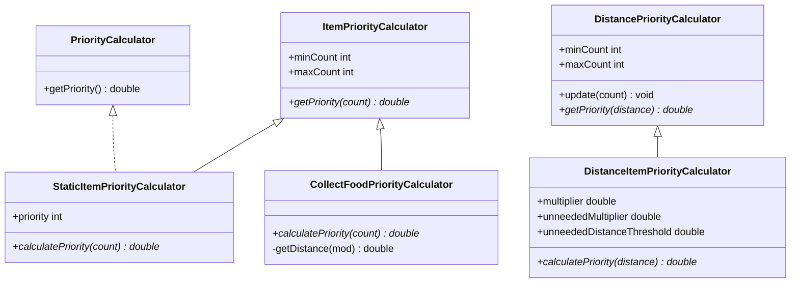
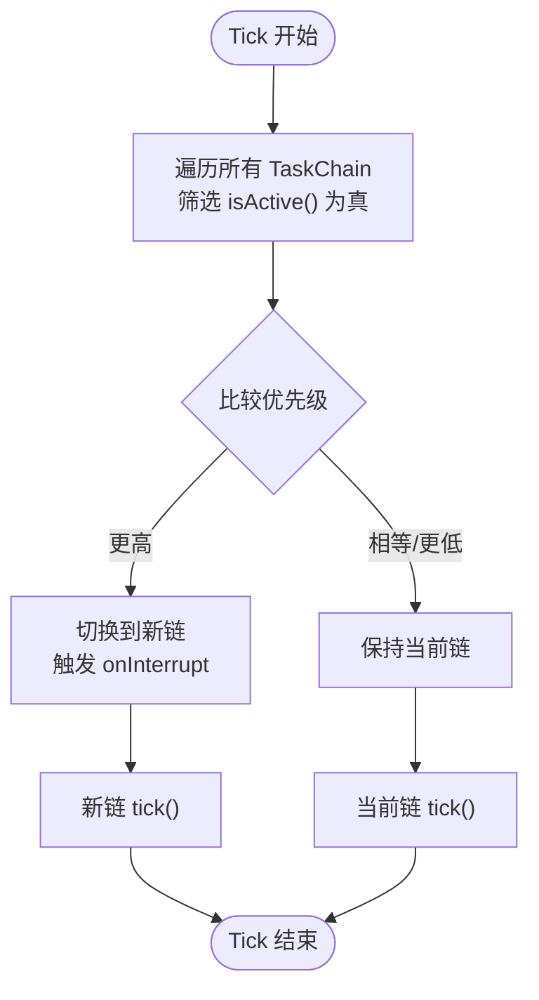
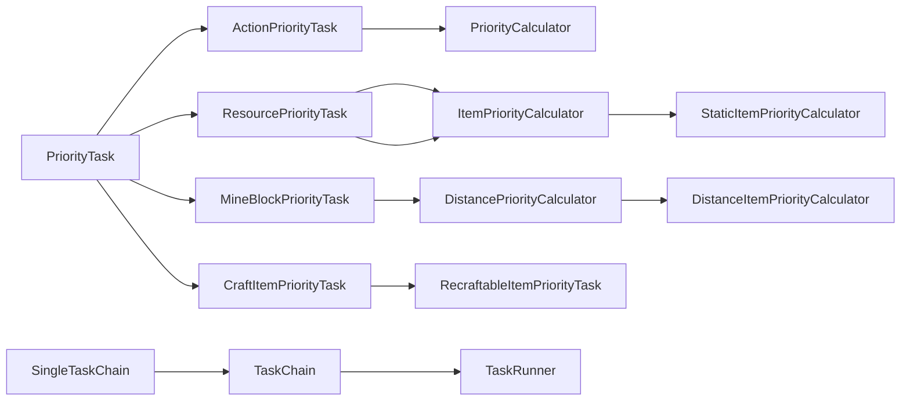

# 任务优先级管理

<cite>
**本文引用的文件**
- [PriorityTask.java](file://src/main/java/adris/altoclef/tasks/speedrun/beatgame/prioritytask/tasks/PriorityTask.java)
- [ActionPriorityTask.java](file://src/main/java/adris/altoclef/tasks/speedrun/beatgame/prioritytask/tasks/ActionPriorityTask.java)
- [ResourcePriorityTask.java](file://src/main/java/adris/altoclef/tasks/speedrun/beatgame/prioritytask/tasks/ResourcePriorityTask.java)
- [MineBlockPriorityTask.java](file://src/main/java/adris/altoclef/tasks/speedrun/beatgame/prioritytask/tasks/MineBlockPriorityTask.java)
- [CraftItemPriorityTask.java](file://src/main/java/adris/altoclef/tasks/speedrun/beatgame/prioritytask/tasks/CraftItemPriorityTask.java)
- [RecraftableItemPriorityTask.java](file://src/main/java/adris/altoclef/tasks/speedrun/beatgame/prioritytask/tasks/RecraftableItemPriorityTask.java)
- [PriorityCalculator.java](file://src/main/java/adris/altoclef/tasks/speedrun/beatgame/prioritytask/prioritycalculators/PriorityCalculator.java)
- [ItemPriorityCalculator.java](file://src/main/java/adris/altoclef/tasks/speedrun/beatgame/prioritytask/prioritycalculators/ItemPriorityCalculator.java)
- [StaticItemPriorityCalculator.java](file://src/main/java/adris/altoclef/tasks/speedrun/beatgame/prioritytask/prioritycalculators/StaticItemPriorityCalculator.java)
- [DistancePriorityCalculator.java](file://src/main/java/adris/altoclef/tasks/speedrun/beatgame/prioritytask/prioritycalculators/DistancePriorityCalculator.java)
- [DistanceItemPriorityCalculator.java](file://src/main/java/adris/altoclef/tasks/speedrun/beatgame/prioritytask/prioritycalculators/DistanceItemPriorityCalculator.java)
- [CollectFoodPriorityCalculator.java](file://src/main/java/adris/altoclef/tasks/speedrun/beatgame/prioritytask/prioritycalculators/CollectFoodPriorityCalculator.java)
- [TaskChain.java](file://src/main/java/adris/altoclef/tasksystem/TaskChain.java)
- [TaskRunner.java](file://src/main/java/adris/altoclef/tasksystem/TaskRunner.java)
- [SingleTaskChain.java](file://src/main/java/adris/altoclef/chains/SingleTaskChain.java)
</cite>

## 目录
1. [简介](#简介)
2. [项目结构](#项目结构)
3. [核心组件](#核心组件)
4. [架构总览](#架构总览)
5. [详细组件分析](#详细组件分析)
6. [依赖关系分析](#依赖关系分析)
7. [性能考量](#性能考量)
8. [故障排查指南](#故障排查指南)
9. [结论](#结论)
10. [附录：调优与监控实践](#附录调优与监控实践)

## 简介
本技术文档围绕“任务优先级管理系统”展开，聚焦于速度赛跑（BeatGame）场景下的优先级计算与任务链调度机制。系统通过统一的优先级接口与多种优先级计算器，结合任务链的激活与抢占策略，实现对资源收集、合成、挖掘等任务的动态优先级评估与切换。文档将深入解析以下主题：
- PriorityCalculator 接口设计与实现
- 优先级计算器家族：静态优先级、基于数量的优先级、基于距离的优先级
- 优先级计算因子：距离权重、物品数量阈值、紧急程度、可复用性
- 任务链的激活条件、优先级冲突解决、任务抢占机制
- 自定义优先级计算逻辑的实现路径
- 性能优化与监控建议

## 项目结构
该系统位于 speedrun.beatgame.prioritytask 子模块中，采用“任务 + 计算器 + 任务链”的分层组织方式：
- 任务层：以 PriorityTask 及其子类封装具体动作与优先级计算入口
- 计算器层：提供可插拔的优先级计算策略（数量型、距离型、静态）
- 调度层：TaskChain 与 TaskRunner 负责周期性评估与抢占切换

图示来源
- [PriorityTask.java:1-46](file://src/main/java/adris/altoclef/tasks/speedrun/beatgame/prioritytask/tasks/PriorityTask.java#L1-L46)
- [ActionPriorityTask.java:1-89](file://src/main/java/adris/altoclef/tasks/speedrun/beatgame/prioritytask/tasks/ActionPriorityTask.java#L1-L89)
- [ResourcePriorityTask.java:1-72](file://src/main/java/adris/altoclef/tasks/speedrun/beatgame/prioritytask/tasks/ResourcePriorityTask.java#L1-L72)
- [MineBlockPriorityTask.java:1-100](file://src/main/java/adris/altoclef/tasks/speedrun/beatgame/prioritytask/tasks/MineBlockPriorityTask.java#L1-L100)
- [CraftItemPriorityTask.java:1-68](file://src/main/java/adris/altoclef/tasks/speedrun/beatgame/prioritytask/tasks/CraftItemPriorityTask.java#L1-L68)
- [RecraftableItemPriorityTask.java:1-20](file://src/main/java/adris/altoclef/tasks/speedrun/beatgame/prioritytask/tasks/RecraftableItemPriorityTask.java#L1-L20)
- [PriorityCalculator.java:1-5](file://src/main/java/adris/altoclef/tasks/speedrun/beatgame/prioritytask/prioritycalculators/PriorityCalculator.java#L1-L5)
- [ItemPriorityCalculator.java:1-31](file://src/main/java/adris/altoclef/tasks/speedrun/beatgame/prioritytask/prioritycalculators/ItemPriorityCalculator.java#L1-L31)
- [StaticItemPriorityCalculator.java:1-19](file://src/main/java/adris/altoclef/tasks/speedrun/beatgame/prioritytask/prioritycalculators/StaticItemPriorityCalculator.java#L1-L19)
- [DistancePriorityCalculator.java:1-29](file://src/main/java/adris/altoclef/tasks/speedrun/beatgame/prioritytask/prioritycalculators/DistancePriorityCalculator.java#L1-L29)
- [DistanceItemPriorityCalculator.java:1-24](file://src/main/java/adris/altoclef/tasks/speedrun/beatgame/prioritytask/prioritycalculators/DistanceItemPriorityCalculator.java#L1-L24)
- [CollectFoodPriorityCalculator.java:1-210](file://src/main/java/adris/altoclef/tasks/speedrun/beatgame/prioritytask/prioritycalculators/CollectFoodPriorityCalculator.java#L1-L210)
- [TaskChain.java:1-51](file://src/main/java/adris/altoclef/tasksystem/TaskChain.java#L1-L51)
- [TaskRunner.java:1-98](file://src/main/java/adris/altoclef/tasksystem/TaskRunner.java#L1-L98)
- [SingleTaskChain.java:54-95](file://src/main/java/adris/altoclef/chains/SingleTaskChain.java#L54-L95)

章节来源
- [TaskRunner.java:1-98](file://src/main/java/adris/altoclef/tasksystem/TaskRunner.java#L1-L98)
- [TaskChain.java:1-51](file://src/main/java/adris/altoclef/tasksystem/TaskChain.java#L1-L51)

## 核心组件
- PriorityTask 抽象类：统一的任务优先级入口，负责根据前置条件决定是否参与竞争，并委托子类计算优先级。
- 任务类型：
  - ActionPriorityTask：从提供者获取“任务+优先级”对，适合动态优先级场景
  - ResourcePriorityTask：基于物品数量阈值的优先级，支持采集/搬运等资源类任务
  - MineBlockPriorityTask：基于距离的优先级，结合挖掘需求与最近目标距离
  - CraftItemPriorityTask / RecraftableItemPriorityTask：面向合成任务，支持“已拥有即降权或转为回收优先级”
- 优先级计算器：
  - PriorityCalculator 接口：最简策略接口
  - ItemPriorityCalculator 抽象：基于“当前持有数量”的优先级曲线，含最小/最大阈值与饱和降权
  - StaticItemPriorityCalculator：固定优先级，常用于高优且不随数量变化的任务
  - DistancePriorityCalculator 抽象：基于“距离”的优先级曲线，含最小/最大阈值与饱和降权
  - DistanceItemPriorityCalculator：典型实现，优先级与距离成反比，区分“已满足最小值”与“未满足最小值”的不同权重
  - CollectFoodPriorityCalculator：复杂实现，综合拾取、烹饪、作物成熟度、近邻资源（如干草捆）等多因素

章节来源
- [PriorityTask.java:1-46](file://src/main/java/adris/altoclef/tasks/speedrun/beatgame/prioritytask/tasks/PriorityTask.java#L1-L46)
- [ActionPriorityTask.java:1-89](file://src/main/java/adris/altoclef/tasks/speedrun/beatgame/prioritytask/tasks/ActionPriorityTask.java#L1-L89)
- [ResourcePriorityTask.java:1-72](file://src/main/java/adris/altoclef/tasks/speedrun/beatgame/prioritytask/tasks/ResourcePriorityTask.java#L1-L72)
- [MineBlockPriorityTask.java:1-100](file://src/main/java/adris/altoclef/tasks/speedrun/beatgame/prioritytask/tasks/MineBlockPriorityTask.java#L1-L100)
- [CraftItemPriorityTask.java:1-68](file://src/main/java/adris/altoclef/tasks/speedrun/beatgame/prioritytask/tasks/CraftItemPriorityTask.java#L1-L68)
- [RecraftableItemPriorityTask.java:1-20](file://src/main/java/adris/altoclef/tasks/speedrun/beatgame/prioritytask/tasks/RecraftableItemPriorityTask.java#L1-L20)
- [PriorityCalculator.java:1-5](file://src/main/java/adris/altoclef/tasks/speedrun/beatgame/prioritytask/prioritycalculators/PriorityCalculator.java#L1-L5)
- [ItemPriorityCalculator.java:1-31](file://src/main/java/adris/altoclef/tasks/speedrun/beatgame/prioritytask/prioritycalculators/ItemPriorityCalculator.java#L1-L31)
- [StaticItemPriorityCalculator.java:1-19](file://src/main/java/adris/altoclef/tasks/speedrun/beatgame/prioritytask/prioritycalculators/StaticItemPriorityCalculator.java#L1-L19)
- [DistancePriorityCalculator.java:1-29](file://src/main/java/adris/altoclef/tasks/speedrun/beatgame/prioritytask/prioritycalculators/DistancePriorityCalculator.java#L1-L29)
- [DistanceItemPriorityCalculator.java:1-24](file://src/main/java/adris/altoclef/tasks/speedrun/beatgame/prioritytask/prioritycalculators/DistanceItemPriorityCalculator.java#L1-L24)
- [CollectFoodPriorityCalculator.java:1-210](file://src/main/java/adris/altoclef/tasks/speedrun/beatgame/prioritytask/prioritycalculators/CollectFoodPriorityCalculator.java#L1-L210)

## 架构总览
系统采用“任务-计算器-调度器”三层协作：
- 任务层：每个任务暴露 getPriority() 与 getTask()，前者由计算器提供，后者在满足前置条件时返回实际执行任务
- 计算器层：按“数量/距离/静态”分类，支持阈值饱和降权与权重调节
- 调度层：TaskRunner 周期扫描所有 TaskChain，选择最高优先级链并进行抢占切换；SingleTaskChain 提供单任务链的中断与重置能力

图示来源
- [TaskRunner.java:22-58](file://src/main/java/adris/altoclef/tasksystem/TaskRunner.java#L22-L58)
- [TaskChain.java:16-34](file://src/main/java/adris/altoclef/tasksystem/TaskChain.java#L16-L34)
- [SingleTaskChain.java:77-86](file://src/main/java/adris/altoclef/chains/SingleTaskChain.java#L77-L86)

章节来源
- [TaskRunner.java:1-98](file://src/main/java/adris/altoclef/tasksystem/TaskRunner.java#L1-L98)
- [TaskChain.java:1-51](file://src/main/java/adris/altoclef/tasksystem/TaskChain.java#L1-L51)
- [SingleTaskChain.java:54-95](file://src/main/java/adris/altoclef/chains/SingleTaskChain.java#L54-L95)

## 详细组件分析

### PriorityTask 与派生任务
- 设计要点
  - 通过 canCall 决定是否参与优先级竞争
  - calculatePriority 将前置条件与内部 getPriority 结果合并
  - shouldForce/canCache/bypassForceCooldown 控制强制执行与缓存策略
- 典型派生
  - ActionPriorityTask：从提供者获取“任务+优先级”，适合动态策略
  - ResourcePriorityTask：基于 ItemPriorityCalculator 的数量阈值曲线
  - MineBlockPriorityTask：结合 MiningRequirement 与 DistancePriorityCalculator
  - CraftItemPriorityTask / RecraftableItemPriorityTask：面向合成，支持“已拥有即降权或转为回收优先级”

图示来源
- [PriorityTask.java:1-46](file://src/main/java/adris/altoclef/tasks/speedrun/beatgame/prioritytask/tasks/PriorityTask.java#L1-L46)
- [ActionPriorityTask.java:1-89](file://src/main/java/adris/altoclef/tasks/speedrun/beatgame/prioritytask/tasks/ActionPriorityTask.java#L1-L89)
- [ResourcePriorityTask.java:1-72](file://src/main/java/adris/altoclef/tasks/speedrun/beatgame/prioritytask/tasks/ResourcePriorityTask.java#L1-L72)
- [MineBlockPriorityTask.java:1-100](file://src/main/java/adris/altoclef/tasks/speedrun/beatgame/prioritytask/tasks/MineBlockPriorityTask.java#L1-L100)
- [CraftItemPriorityTask.java:1-68](file://src/main/java/adris/altoclef/tasks/speedrun/beatgame/prioritytask/tasks/CraftItemPriorityTask.java#L1-L68)
- [RecraftableItemPriorityTask.java:1-20](file://src/main/java/adris/altoclef/tasks/speedrun/beatgame/prioritytask/tasks/RecraftableItemPriorityTask.java#L1-L20)

章节来源
- [PriorityTask.java:1-46](file://src/main/java/adris/altoclef/tasks/speedrun/beatgame/prioritytask/tasks/PriorityTask.java#L1-L46)
- [ActionPriorityTask.java:1-89](file://src/main/java/adris/altoclef/tasks/speedrun/beatgame/prioritytask/tasks/ActionPriorityTask.java#L1-L89)
- [ResourcePriorityTask.java:1-72](file://src/main/java/adris/altoclef/tasks/speedrun/beatgame/prioritytask/tasks/ResourcePriorityTask.java#L1-L72)
- [MineBlockPriorityTask.java:1-100](file://src/main/java/adris/altoclef/tasks/speedrun/beatgame/prioritytask/tasks/MineBlockPriorityTask.java#L1-L100)
- [CraftItemPriorityTask.java:1-68](file://src/main/java/adris/altoclef/tasks/speedrun/beatgame/prioritytask/tasks/CraftItemPriorityTask.java#L1-L68)
- [RecraftableItemPriorityTask.java:1-20](file://src/main/java/adris/altoclef/tasks/speedrun/beatgame/prioritytask/tasks/RecraftableItemPriorityTask.java#L1-L20)

### 优先级计算器家族
- ItemPriorityCalculator
  - 通过 minCount/maxCount 定义阈值，minCountSatisfied 后使用 max(minCount, count) 作为输入，maxCountSatisfied 后返回负无穷
  - 适合“先满足再降权”的策略
- StaticItemPriorityCalculator
  - 固定优先级，常用于高优且不随数量变化的任务
- DistancePriorityCalculator
  - 输入为距离，minCountSatisfied 后区分“未达阈值”和“超过阈值”的不同权重
  - 适合“越近越优先”的策略
- DistanceItemPriorityCalculator
  - 典型实现：优先级与距离成反比，未满足最小值时使用 multiplier，已满足最小值且距离过远时使用 unneededMultiplier 或直接降权
- CollectFoodPriorityCalculator
  - 综合拾取、烹饪、作物成熟度、近邻资源（如干草捆）等多因素，动态调整权重与阈值，体现“紧急程度”和“成功率”影响

图示来源
- [PriorityCalculator.java:1-5](file://src/main/java/adris/altoclef/tasks/speedrun/beatgame/prioritytask/prioritycalculators/PriorityCalculator.java#L1-L5)
- [ItemPriorityCalculator.java:1-31](file://src/main/java/adris/altoclef/tasks/speedrun/beatgame/prioritytask/prioritycalculators/ItemPriorityCalculator.java#L1-L31)
- [StaticItemPriorityCalculator.java:1-19](file://src/main/java/adris/altoclef/tasks/speedrun/beatgame/prioritytask/prioritycalculators/StaticItemPriorityCalculator.java#L1-L19)
- [DistancePriorityCalculator.java:1-29](file://src/main/java/adris/altoclef/tasks/speedrun/beatgame/prioritytask/prioritycalculators/DistancePriorityCalculator.java#L1-L29)
- [DistanceItemPriorityCalculator.java:1-24](file://src/main/java/adris/altoclef/tasks/speedrun/beatgame/prioritytask/prioritycalculators/DistanceItemPriorityCalculator.java#L1-L24)
- [CollectFoodPriorityCalculator.java:1-210](file://src/main/java/adris/altoclef/tasks/speedrun/beatgame/prioritytask/prioritycalculators/CollectFoodPriorityCalculator.java#L1-L210)

章节来源
- [ItemPriorityCalculator.java:1-31](file://src/main/java/adris/altoclef/tasks/speedrun/beatgame/prioritytask/prioritycalculators/ItemPriorityCalculator.java#L1-L31)
- [StaticItemPriorityCalculator.java:1-19](file://src/main/java/adris/altoclef/tasks/speedrun/beatgame/prioritytask/prioritycalculators/StaticItemPriorityCalculator.java#L1-L19)
- [DistancePriorityCalculator.java:1-29](file://src/main/java/adris/altoclef/tasks/speedrun/beatgame/prioritytask/prioritycalculators/DistancePriorityCalculator.java#L1-L29)
- [DistanceItemPriorityCalculator.java:1-24](file://src/main/java/adris/altoclef/tasks/speedrun/beatgame/prioritytask/prioritycalculators/DistanceItemPriorityCalculator.java#L1-L24)
- [CollectFoodPriorityCalculator.java:1-210](file://src/main/java/adris/altoclef/tasks/speedrun/beatgame/prioritytask/prioritycalculators/CollectFoodPriorityCalculator.java#L1-L210)

### 优先级计算因子与影响机制
- 距离权重
  - DistanceItemPriorityCalculator 使用 1/distance 权重，未满足最小值时使用 multiplier，已满足最小值且距离超过阈值时使用 unneededMultiplier 或直接降权
- 物品数量
  - ItemPriorityCalculator 在 minCountSatisfied 后以 max(minCount, count) 作为输入，maxCountSatisfied 后返回负无穷，形成“先满足再降权”的曲线
- 紧急程度
  - CollectFoodPriorityCalculator 在食物缺口较大时提高权重，在接近饱和时显著降权；当存在近邻高价值资源（如干草捆）时提升权重
- 成功率
  - CollectFoodPriorityCalculator 会考虑作物成熟度、实体掉落、近邻资源等，避免无效路径；在无法拾取或库存成本更高的情况下直接降权

章节来源
- [DistanceItemPriorityCalculator.java:1-24](file://src/main/java/adris/altoclef/tasks/speedrun/beatgame/prioritytask/prioritycalculators/DistanceItemPriorityCalculator.java#L1-L24)
- [ItemPriorityCalculator.java:1-31](file://src/main/java/adris/altoclef/tasks/speedrun/beatgame/prioritytask/prioritycalculators/ItemPriorityCalculator.java#L1-L31)
- [CollectFoodPriorityCalculator.java:1-210](file://src/main/java/adris/altoclef/tasks/speedrun/beatgame/prioritytask/prioritycalculators/CollectFoodPriorityCalculator.java#L1-L210)

### 任务链激活条件、冲突解决与抢占机制
- 激活条件
  - TaskChain.isActive() 决定是否参与竞争；TaskRunner 仅对活跃链进行优先级评估
- 冲突解决
  - TaskRunner 遍历所有活跃链，选择最高优先级链；若当前链与最高链不同，则触发 onInterrupt
  - SingleTaskChain 在被中断时会调用当前任务的 interrupt，确保安全切换
- 抢占机制
  - 当新链优先级更高时，旧链被中断，新链接管执行；同时更新状态报告便于调试

图示来源
- [TaskRunner.java:22-58](file://src/main/java/adris/altoclef/tasksystem/TaskRunner.java#L22-L58)
- [TaskChain.java:26-34](file://src/main/java/adris/altoclef/tasksystem/TaskChain.java#L26-L34)
- [SingleTaskChain.java:77-86](file://src/main/java/adris/altoclef/chains/SingleTaskChain.java#L77-L86)

章节来源
- [TaskRunner.java:1-98](file://src/main/java/adris/altoclef/tasksystem/TaskRunner.java#L1-L98)
- [TaskChain.java:1-51](file://src/main/java/adris/altoclef/tasksystem/TaskChain.java#L1-L51)
- [SingleTaskChain.java:54-95](file://src/main/java/adris/altoclef/chains/SingleTaskChain.java#L54-L95)

### 自定义优先级计算逻辑实现指南
- 动态优先级（ActionPriorityTask）
  - 使用 TaskAndPriorityProvider 提供“任务+优先级”对，适合需要实时评估外部状态的场景
  - 参考路径：[ActionPriorityTask.java:40-79](file://src/main/java/adris/altoclef/tasks/speedrun/beatgame/prioritytask/tasks/ActionPriorityTask.java#L40-L79)
- 数量型优先级（ResourcePriorityTask + ItemPriorityCalculator）
  - 通过 minCount/maxCount 控制阈值，结合 StaticItemPriorityCalculator 实现固定权重
  - 参考路径：[ResourcePriorityTask.java:49-66](file://src/main/java/adris/altoclef/tasks/speedrun/beatgame/prioritytask/tasks/ResourcePriorityTask.java#L49-L66)，[ItemPriorityCalculator.java:14-28](file://src/main/java/adris/altoclef/tasks/speedrun/beatgame/prioritytask/prioritycalculators/ItemPriorityCalculator.java#L14-L28)
- 距离型优先级（MineBlockPriorityTask + DistancePriorityCalculator）
  - 通过 getClosestDist 获取最近目标距离，结合 DistanceItemPriorityCalculator 实现“越近越优”
  - 参考路径：[MineBlockPriorityTask.java:82-98](file://src/main/java/adris/altoclef/tasks/speedrun/beatgame/prioritytask/tasks/MineBlockPriorityTask.java#L82-L98)，[DistanceItemPriorityCalculator.java:15-23](file://src/main/java/adris/altoclef/tasks/speedrun/beatgame/prioritytask/prioritycalculators/DistanceItemPriorityCalculator.java#L15-L23)
- 复合优先级（CollectFoodPriorityCalculator）
  - 综合拾取、烹饪、作物成熟度、近邻资源等，体现“紧急程度”和“成功率”
  - 参考路径：[CollectFoodPriorityCalculator.java:36-64](file://src/main/java/adris/altoclef/tasks/speedrun/beatgame/prioritytask/prioritycalculators/CollectFoodPriorityCalculator.java#L36-L64)

章节来源
- [ActionPriorityTask.java:1-89](file://src/main/java/adris/altoclef/tasks/speedrun/beatgame/prioritytask/tasks/ActionPriorityTask.java#L1-L89)
- [ResourcePriorityTask.java:1-72](file://src/main/java/adris/altoclef/tasks/speedrun/beatgame/prioritytask/tasks/ResourcePriorityTask.java#L1-L72)
- [MineBlockPriorityTask.java:1-100](file://src/main/java/adris/altoclef/tasks/speedrun/beatgame/prioritytask/tasks/MineBlockPriorityTask.java#L1-L100)
- [CollectFoodPriorityCalculator.java:1-210](file://src/main/java/adris/altoclef/tasks/speedrun/beatgame/prioritytask/prioritycalculators/CollectFoodPriorityCalculator.java#L1-L210)

## 依赖关系分析
- 低耦合高内聚
  - 任务层仅依赖计算器接口，不关心具体实现细节
  - 调度层与任务层解耦，通过抽象接口交互
- 关键依赖链
  - PriorityTask → 任务类型（Action/Resource/Mine/Craft）
  - 任务类型 → 计算器（PriorityCalculator/ItemPriorityCalculator/DistancePriorityCalculator）
  - TaskChain → TaskRunner（调度与抢占）

图示来源
- [PriorityTask.java:1-46](file://src/main/java/adris/altoclef/tasks/speedrun/beatgame/prioritytask/tasks/PriorityTask.java#L1-L46)
- [ActionPriorityTask.java:1-89](file://src/main/java/adris/altoclef/tasks/speedrun/beatgame/prioritytask/tasks/ActionPriorityTask.java#L1-L89)
- [ResourcePriorityTask.java:1-72](file://src/main/java/adris/altoclef/tasks/speedrun/beatgame/prioritytask/tasks/ResourcePriorityTask.java#L1-L72)
- [MineBlockPriorityTask.java:1-100](file://src/main/java/adris/altoclef/tasks/speedrun/beatgame/prioritytask/tasks/MineBlockPriorityTask.java#L1-L100)
- [CraftItemPriorityTask.java:1-68](file://src/main/java/adris/altoclef/tasks/speedrun/beatgame/prioritytask/tasks/CraftItemPriorityTask.java#L1-L68)
- [RecraftableItemPriorityTask.java:1-20](file://src/main/java/adris/altoclef/tasks/speedrun/beatgame/prioritytask/tasks/RecraftableItemPriorityTask.java#L1-L20)
- [PriorityCalculator.java:1-5](file://src/main/java/adris/altoclef/tasks/speedrun/beatgame/prioritytask/prioritycalculators/PriorityCalculator.java#L1-L5)
- [ItemPriorityCalculator.java:1-31](file://src/main/java/adris/altoclef/tasks/speedrun/beatgame/prioritytask/prioritycalculators/ItemPriorityCalculator.java#L1-L31)
- [StaticItemPriorityCalculator.java:1-19](file://src/main/java/adris/altoclef/tasks/speedrun/beatgame/prioritytask/prioritycalculators/StaticItemPriorityCalculator.java#L1-L19)
- [DistancePriorityCalculator.java:1-29](file://src/main/java/adris/altoclef/tasks/speedrun/beatgame/prioritytask/prioritycalculators/DistancePriorityCalculator.java#L1-L29)
- [DistanceItemPriorityCalculator.java:1-24](file://src/main/java/adris/altoclef/tasks/speedrun/beatgame/prioritytask/prioritycalculators/DistanceItemPriorityCalculator.java#L1-L24)
- [TaskChain.java:1-51](file://src/main/java/adris/altoclef/tasksystem/TaskChain.java#L1-L51)
- [TaskRunner.java:1-98](file://src/main/java/adris/altoclef/tasksystem/TaskRunner.java#L1-L98)
- [SingleTaskChain.java:54-95](file://src/main/java/adris/altoclef/chains/SingleTaskChain.java#L54-L95)

章节来源
- [TaskRunner.java:1-98](file://src/main/java/adris/altoclef/tasksystem/TaskRunner.java#L1-L98)
- [TaskChain.java:1-51](file://src/main/java/adris/altoclef/tasksystem/TaskChain.java#L1-L51)

## 性能考量
- 优先级计算复杂度
  - ItemPriorityCalculator/DistancePriorityCalculator 为 O(1)，计算开销极低
  - CollectFoodPriorityCalculator 包含多源扫描与条件判断，建议在高频 tick 中缓存中间结果或降低扫描范围
- 调度开销
  - TaskRunner 对所有活跃链进行一次线性扫描，链路数量应控制在合理范围
  - 抢占切换会触发 onInterrupt，需确保任务实现快速中断与资源释放
- I/O 与世界查询
  - 任务链中的距离与目标查找可能涉及世界查询，建议限制扫描半径与频率，避免频繁大范围扫描

## 故障排查指南
- 优先级异常
  - 检查 canCall 是否正确返回 true/false，避免任务被错误排除
  - 对于 ResourcePriorityTask，确认 minCount/maxCount 设置是否导致提前饱和降权
- 抢占频繁
  - 检查 TaskChain.getPriority() 是否波动过大，必要时引入平滑或阈值滞回
  - 确认 TaskRunner 的日志输出，关注链切换频率与原因
- 任务卡死
  - SingleTaskChain 在中断时会调用任务 interrupt，检查任务实现是否正确处理中断信号
- 调试信息
  - TaskRunner 会在切换链时记录日志，结合状态报告定位问题

章节来源
- [TaskRunner.java:41-47](file://src/main/java/adris/altoclef/tasksystem/TaskRunner.java#L41-L47)
- [SingleTaskChain.java:77-86](file://src/main/java/adris/altoclef/chains/SingleTaskChain.java#L77-L86)

## 结论
本系统通过“任务-计算器-调度器”三层协作，实现了灵活、可扩展的优先级管理机制。数量型与距离型优先级计算器覆盖了大多数场景，而复合型计算器（如 CollectFoodPriorityCalculator）则体现了“紧急程度”和“成功率”的综合考量。通过合理的阈值设置与抢占策略，系统能够在复杂环境中高效地平衡不同任务的重要性并优化整体执行效率。

## 附录：调优与监控实践
- 优先级调优
  - 数量型：增大 minCount 提前启动降权；合理设置 maxCount 防止过度饱和
  - 距离型：调整 multiplier/unneededMultiplier 与 unneededDistanceThreshold，平衡“近处优先”与“过度追求近处”的风险
  - 动态型：通过 ActionPriorityTask 的 Provider 实时评估外部状态，减少硬编码权重
- 性能监控
  - 使用 TaskRunner 的状态报告与日志，观察链切换频率与优先级峰值
  - 对高频计算（如 CollectFoodPriorityCalculator）增加缓存与范围限制，避免每 tick 全量扫描
- 最佳实践
  - 将高优但不随数量变化的任务使用 StaticItemPriorityCalculator 固定权重
  - 对合成类任务使用 RecraftableItemPriorityTask，实现“已拥有即降权或转为回收优先级”的策略
  - 在任务链中引入平滑与滞回机制，避免优先级抖动导致的频繁抢占