# 任务执行引擎

<cite>
**本文引用的文件**
- [TaskRunner.java](file://src/main/java/adris/altoclef/tasksystem/TaskRunner.java)
- [TaskChain.java](file://src/main/java/adris/altoclef/tasksystem/TaskChain.java)
- [Task.java](file://src/main/java/adris/altoclef/tasksystem/Task.java)
- [SingleTaskChain.java](file://src/main/java/adris/altoclef/chains/SingleTaskChain.java)
- [UserTaskChain.java](file://src/main/java/adris/altoclef/chains/UserTaskChain.java)
- [FastTravelTask.java](file://src/main/java/adris/altoclef/tasks/movement/FastTravelTask.java)
- [CollectFoodTask.java](file://src/main/java/adris/altoclef/tasks/resources/CollectFoodTask.java)
- [LootContainerTask.java](file://src/main/java/adris/altoclef/tasks/container/LootContainerTask.java)
- [KillEntityTask.java](file://src/main/java/adris/altoclef/tasks/entity/KillEntityTask.java)
- [ITaskCanForce.java](file://src/main/java/adris/altoclef/tasksystem/ITaskCanForce.java)
- [ITaskOverridesGrounded.java](file://src/main/java/adris/altoclef/tasksystem/ITaskOverridesGrounded.java)
- [README.md](file://README.md)
</cite>

## 目录
1. [简介](#简介)
2. [项目结构](#项目结构)
3. [核心组件](#核心组件)
4. [架构总览](#架构总览)
5. [详细组件分析](#详细组件分析)
6. [依赖分析](#依赖分析)
7. [性能考虑](#性能考虑)
8. [故障排查指南](#故障排查指南)
9. [结论](#结论)
10. [附录](#附录)

## 简介
本技术文档围绕任务执行引擎展开，系统性阐述责任链模式在任务调度中的应用，重点解析 TaskRunner 的工作原理、TaskChain 的优先级管理机制、任务执行的并发控制与中断策略，并深入分析移动任务、资源采集任务、容器操作任务、实体交互任务等类型任务的实现细节与调用关系。同时给出任务优先级计算方法、失败重试机制、任务取消与中断处理等高级特性的实现要点与最佳实践，辅以图示与代码片段路径，帮助读者快速掌握如何创建自定义任务、组合复杂行为序列以及处理执行过程中的异常情况。

## 项目结构
任务执行引擎位于模块内的 tasksystem 包与 chains 包中，配合各类具体任务（movement、resources、container、entity 等）共同构成完整的任务体系。其核心职责是将高层意图转化为一系列可执行、可中断、可优先级调度的原子任务。

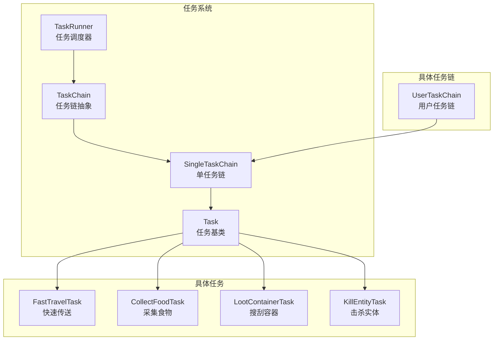

**图表来源**
- [TaskRunner.java:1-98](file://src/main/java/adris/altoclef/tasksystem/TaskRunner.java#L1-L98)
- [TaskChain.java:1-51](file://src/main/java/adris/altoclef/tasksystem/TaskChain.java#L1-L51)
- [SingleTaskChain.java:1-96](file://src/main/java/adris/altoclef/chains/SingleTaskChain.java#L1-L96)
- [UserTaskChain.java:1-236](file://src/main/java/adris/altoclef/chains/UserTaskChain.java#L1-L236)
- [Task.java:1-181](file://src/main/java/adris/altoclef/tasksystem/Task.java#L1-L181)
- [FastTravelTask.java:1-152](file://src/main/java/adris/altoclef/tasks/movement/FastTravelTask.java#L1-L152)
- [CollectFoodTask.java:1-200](file://src/main/java/adris/altoclef/tasks/resources/CollectFoodTask.java#L1-L200)
- [LootContainerTask.java:1-118](file://src/main/java/adris/altoclef/tasks/container/LootContainerTask.java#L1-L118)
- [KillEntityTask.java:1-35](file://src/main/java/adris/altoclef/tasks/entity/KillEntityTask.java#L1-L35)

**章节来源**
- [TaskRunner.java:1-98](file://src/main/java/adris/altoclef/tasksystem/TaskRunner.java#L1-L98)
- [TaskChain.java:1-51](file://src/main/java/adris/altoclef/tasksystem/TaskChain.java#L1-L51)
- [SingleTaskChain.java:1-96](file://src/main/java/adris/altoclef/chains/SingleTaskChain.java#L1-L96)
- [UserTaskChain.java:1-236](file://src/main/java/adris/altoclef/chains/UserTaskChain.java#L1-L236)
- [Task.java:1-181](file://src/main/java/adris/altoclef/tasksystem/Task.java#L1-L181)

## 核心组件
- TaskRunner：全局任务调度器，负责在每帧遍历所有激活的任务链，根据优先级选择当前链并驱动其执行，同时处理链间切换与中断。
- TaskChain：任务链抽象，封装单条任务链的生命周期（tick/stop/onInterrupt），并维护当前链的任务序列。
- SingleTaskChain：单任务链实现，负责单一主任务的执行与切换，支持任务中断与完成回调。
- Task：任务基类，定义任务的启动、执行、停止、中断、调试状态与子任务嵌套机制，提供可被强制打断的策略接口。
- UserTaskChain：用户任务链，承载用户下发的具体任务，具备优先级提升、距离监控、空闲态切换等功能。

**章节来源**
- [TaskRunner.java:22-58](file://src/main/java/adris/altoclef/tasksystem/TaskRunner.java#L22-L58)
- [TaskChain.java:16-44](file://src/main/java/adris/altoclef/tasksystem/TaskChain.java#L16-L44)
- [SingleTaskChain.java:22-90](file://src/main/java/adris/altoclef/chains/SingleTaskChain.java#L22-L90)
- [Task.java:17-96](file://src/main/java/adris/altoclef/tasksystem/Task.java#L17-L96)
- [UserTaskChain.java:125-139](file://src/main/java/adris/altoclef/chains/UserTaskChain.java#L125-L139)

## 架构总览
任务执行引擎采用“责任链 + 单任务链 + 任务”的分层架构。TaskRunner 作为顶层调度器，按帧扫描所有 TaskChain，依据 getPriority() 选择最高优先级链，驱动其 onTick() 生成/切换/执行具体 Task。SingleTaskChain 将复杂行为拆解为单一主任务，支持子任务嵌套与中断。Task 基类提供统一的生命周期与可打断策略，结合 ITaskCanForce 接口实现细粒度的打断控制。

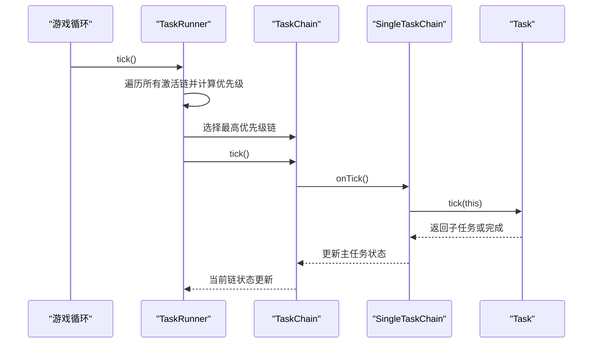

**图表来源**
- [TaskRunner.java:22-58](file://src/main/java/adris/altoclef/tasksystem/TaskRunner.java#L22-L58)
- [TaskChain.java:16-30](file://src/main/java/adris/altoclef/tasksystem/TaskChain.java#L16-L30)
- [SingleTaskChain.java:22-44](file://src/main/java/adris/altoclef/chains/SingleTaskChain.java#L22-L44)
- [Task.java:17-50](file://src/main/java/adris/altoclef/tasksystem/Task.java#L17-L50)

## 详细组件分析

### TaskRunner：优先级选择与链切换
- 每帧遍历所有激活的 TaskChain，计算 getPriority()，选择最大优先级链作为当前执行链。
- 若当前链发生变化，触发 onInterrupt() 通知旧链进行中断清理。
- 维护 statusReport 便于外部观察当前链与优先级。
- 提供 enable/disable 生命周期，进入/退出时对底层行为栈进行 push/pop 以接管输入。

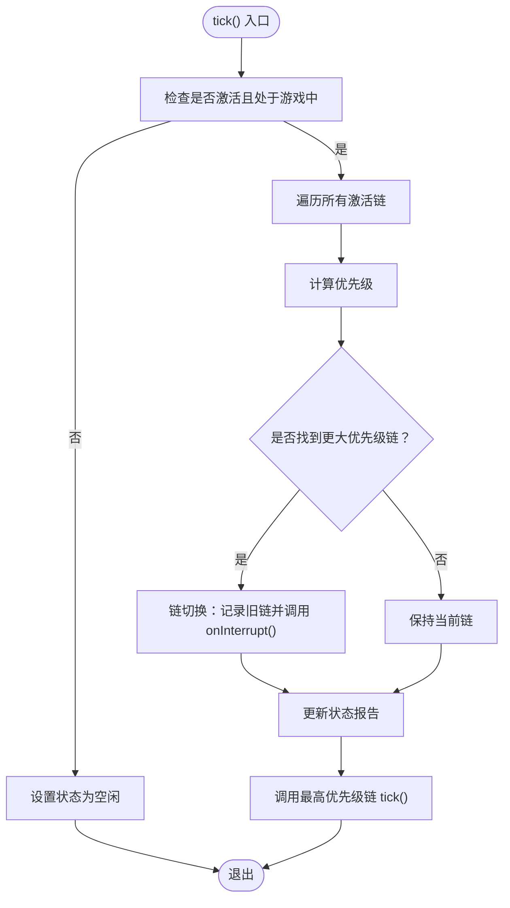

**图表来源**
- [TaskRunner.java:22-58](file://src/main/java/adris/altoclef/tasksystem/TaskRunner.java#L22-L58)

**章节来源**
- [TaskRunner.java:22-84](file://src/main/java/adris/altoclef/tasksystem/TaskRunner.java#L22-L84)

### TaskChain 与 SingleTaskChain：单任务链执行
- TaskChain：抽象出链的生命周期方法（onTick/onStop/onInterrupt），并提供 getTasks() 缓存当前链的任务序列。
- SingleTaskChain：在 TaskChain 基础上，维护 mainTask，负责：
  - 每帧 tick 时若未被打断且主任务未完成，则调用其 tick()。
  - 支持 setTask() 切换任务，必要时先 stop() 旧任务并 reset() 新任务。
  - onInterrupt() 时标记 interrupted 并中断当前主任务，以便在下一帧 reset()。

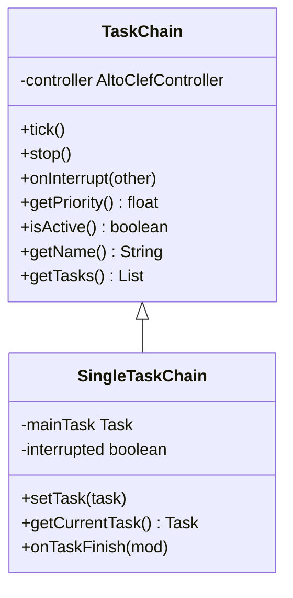

**图表来源**
- [TaskChain.java:16-44](file://src/main/java/adris/altoclef/tasksystem/TaskChain.java#L16-L44)
- [SingleTaskChain.java:22-90](file://src/main/java/adris/altoclef/chains/SingleTaskChain.java#L22-L90)

**章节来源**
- [TaskChain.java:16-44](file://src/main/java/adris/altoclef/tasksystem/TaskChain.java#L16-L44)
- [SingleTaskChain.java:22-90](file://src/main/java/adris/altoclef/chains/SingleTaskChain.java#L22-L90)

### Task：生命周期与可打断策略
- 生命周期：start → tick → stop/interrupt → reset。
- 子任务嵌套：onTick() 可返回子任务，Task 内部自动接管并递归 tick。
- 可打断策略：通过 canBeInterrupted() 检查 ITaskCanForce.shouldForce()，允许某些任务强制打断其他任务。
- 超时与树形追踪：提供 thisOrChildSatisfies() 与 thisOrChildAreTimedOut() 辅助超时控制。

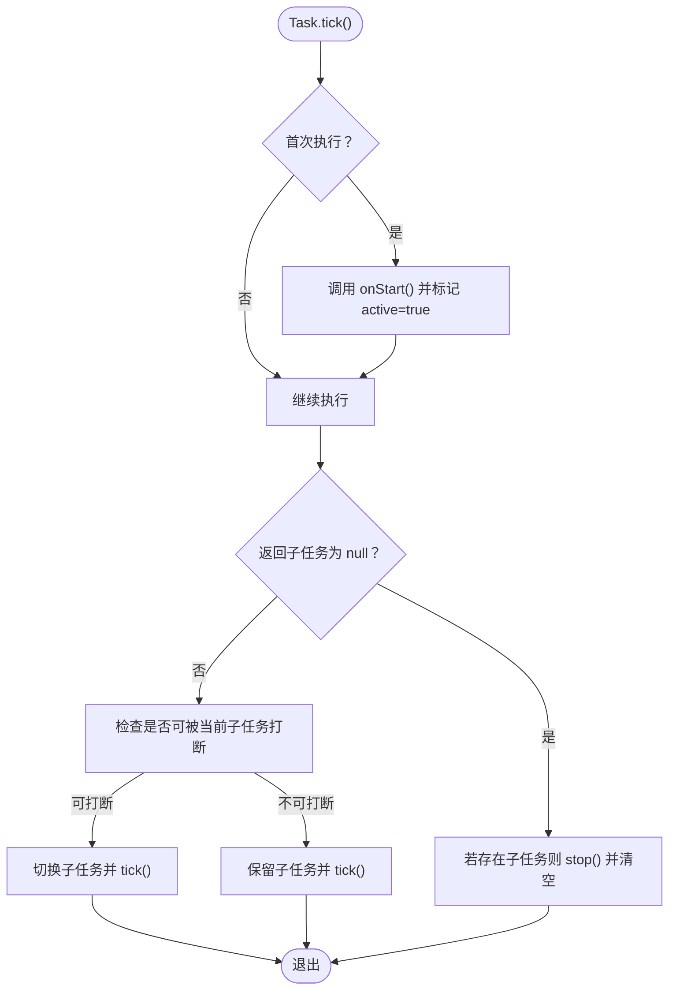

**图表来源**
- [Task.java:17-96](file://src/main/java/adris/altoclef/tasksystem/Task.java#L17-L96)
- [ITaskCanForce.java:1-6](file://src/main/java/adris/altoclef/tasksystem/ITaskCanForce.java#L1-L6)

**章节来源**
- [Task.java:17-164](file://src/main/java/adris/altoclef/tasksystem/Task.java#L17-L164)
- [ITaskCanForce.java:1-6](file://src/main/java/adris/altoclef/tasksystem/ITaskCanForce.java#L1-L6)

### UserTaskChain：用户任务优先级与距离监控
- 优先级：当用户命令活跃时优先级显著提升，以抵抗其他链（如 mob 防御链）抢占。
- 距离监控：定期检查 NPC 与拥有者距离，超过阈值时自动取消当前任务并返回拥有者。
- 空闲态：任务完成后可执行空闲命令，或直接停止，支持平滑过渡。

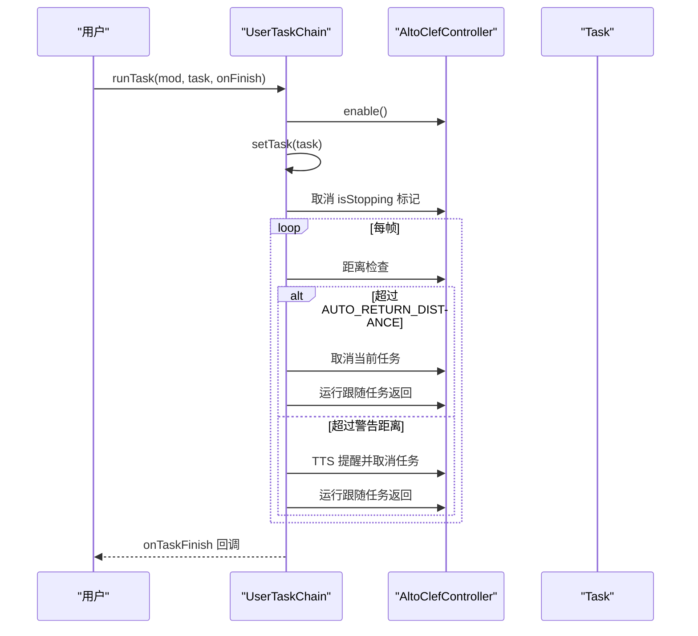

**图表来源**
- [UserTaskChain.java:66-115](file://src/main/java/adris/altoclef/chains/UserTaskChain.java#L66-L115)
- [UserTaskChain.java:144-214](file://src/main/java/adris/altoclef/chains/UserTaskChain.java#L144-L214)

**章节来源**
- [UserTaskChain.java:125-139](file://src/main/java/adris/altoclef/chains/UserTaskChain.java#L125-L139)
- [UserTaskChain.java:144-214](file://src/main/java/adris/altoclef/chains/UserTaskChain.java#L144-L214)

### 具体任务类型与调用关系

#### 移动任务：FastTravelTask
- 功能：跨维度快速旅行，自动判断是否需要收集传送材料、寻找传送门、在地獄坐标附近安全落地后再返回主世界。
- 调用关系：在不同维度下根据条件返回子任务（DefaultGoToDimensionTask、EnterNetherPortalTask、GetToXZTask 等），形成复杂行为序列。

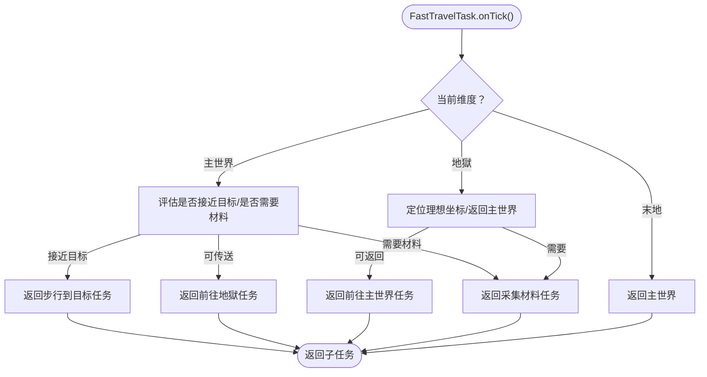

**图表来源**
- [FastTravelTask.java:47-120](file://src/main/java/adris/altoclef/tasks/movement/FastTravelTask.java#L47-L120)

**章节来源**
- [FastTravelTask.java:19-152](file://src/main/java/adris/altoclef/tasks/movement/FastTravelTask.java#L19-L152)

#### 资源采集任务：CollectFoodTask
- 功能：优先从容器中拾取食物，其次熔炼生肉，再考虑制作面包/小麦，最后通过击杀动物、采集作物或拾取掉落物满足食物需求。
- 调用关系：根据实时状态返回 PickupFromContainerTask、SmeltInSmokerTask、CraftInTableTask、KillAndLootTask、MineAndCollectTask、TimeoutWanderTask 等。

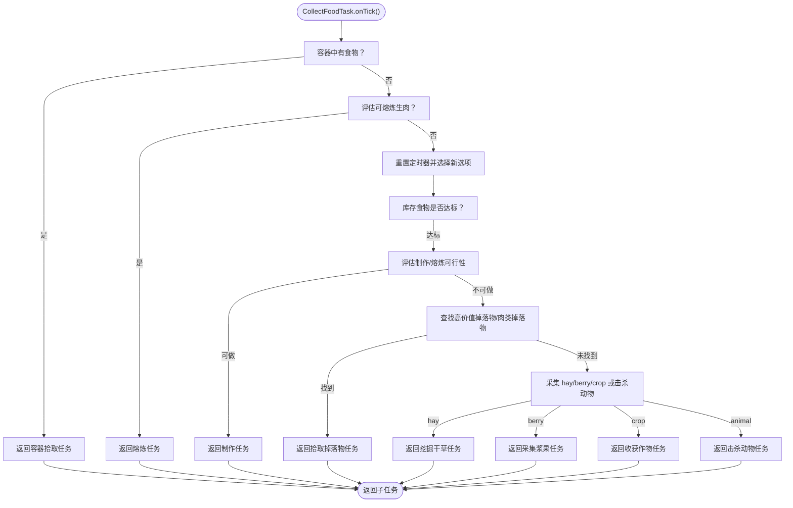

**图表来源**
- [CollectFoodTask.java:72-173](file://src/main/java/adris/altoclef/tasks/resources/CollectFoodTask.java#L72-L173)

**章节来源**
- [CollectFoodTask.java:41-200](file://src/main/java/adris/altoclef/tasks/resources/CollectFoodTask.java#L41-L200)

#### 容器操作任务：LootContainerTask
- 功能：前往容器、检测物品、将目标物品转移至玩家背包，若背包已满则先确保空位。
- 调用关系：GetToBlockTask → EnsureFreeInventorySlotTask → 读写容器并更新缓存。

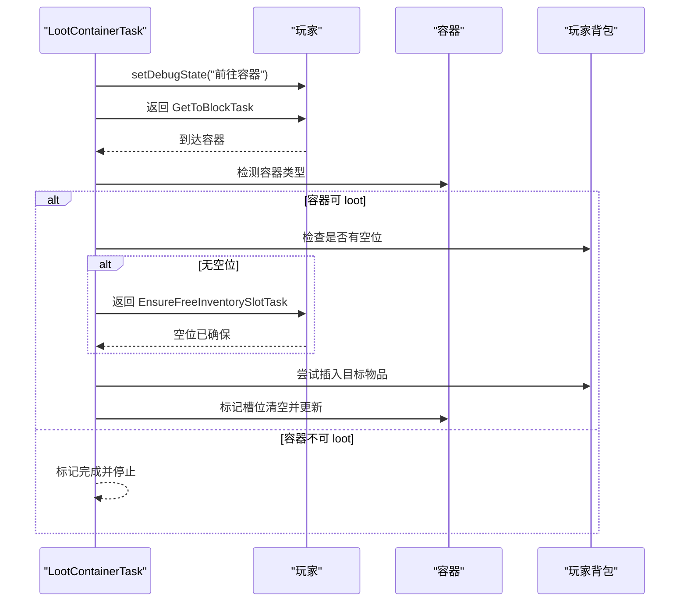

**图表来源**
- [LootContainerTask.java:42-92](file://src/main/java/adris/altoclef/tasks/container/LootContainerTask.java#L42-L92)

**章节来源**
- [LootContainerTask.java:19-118](file://src/main/java/adris/altoclef/tasks/container/LootContainerTask.java#L19-L118)

#### 实体交互任务：KillEntityTask
- 功能：针对指定实体发起击杀与战备行为，继承自 AbstractKillEntityTask，提供目标实体与距离/范围参数。
- 调用关系：通过实体追踪与战斗模块协作，返回近身/远程/移动等子任务。

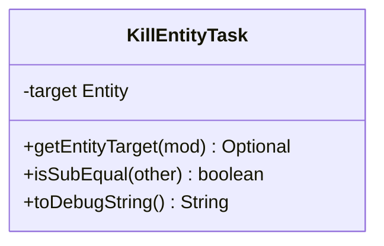

**图表来源**
- [KillEntityTask.java:8-35](file://src/main/java/adris/altoclef/tasks/entity/KillEntityTask.java#L8-L35)

**章节来源**
- [KillEntityTask.java:1-35](file://src/main/java/adris/altoclef/tasks/entity/KillEntityTask.java#L1-L35)

## 依赖分析
- TaskRunner 依赖 TaskChain 列表，通过优先级选择驱动执行。
- TaskChain 依赖 TaskRunner 注册自身，并通过 SingleTaskChain 管理主任务。
- Task 依赖 ITaskCanForce 接口实现可打断策略，支持子任务树形结构。
- UserTaskChain 依赖 SingleTaskChain，扩展用户命令优先级与距离监控。
- 具体任务（FastTravelTask、CollectFoodTask、LootContainerTask、KillEntityTask）均继承 Task，按需组合子任务。

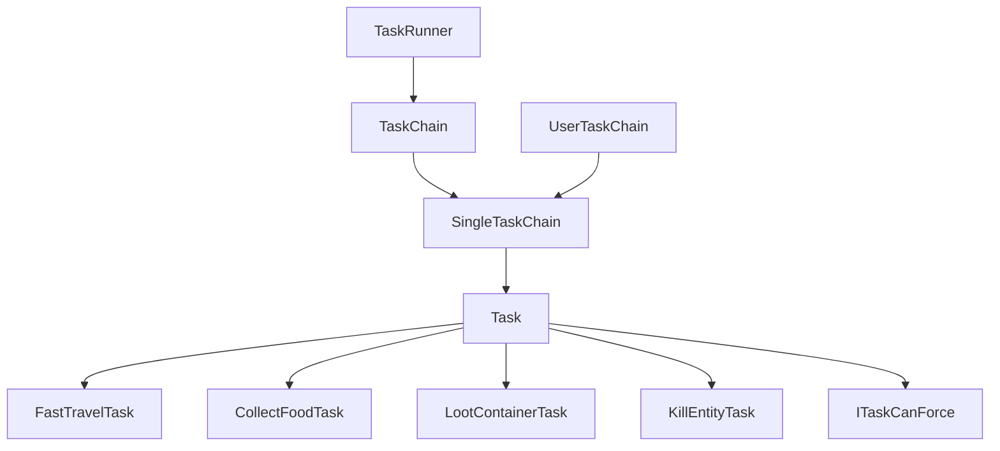

**图表来源**
- [TaskRunner.java:17-62](file://src/main/java/adris/altoclef/tasksystem/TaskRunner.java#L17-L62)
- [TaskChain.java:11-14](file://src/main/java/adris/altoclef/tasksystem/TaskChain.java#L11-L14)
- [SingleTaskChain.java:17-20](file://src/main/java/adris/altoclef/chains/SingleTaskChain.java#L17-L20)
- [UserTaskChain.java:37-39](file://src/main/java/adris/altoclef/chains/UserTaskChain.java#L37-L39)
- [Task.java:17-26](file://src/main/java/adris/altoclef/tasksystem/Task.java#L17-L26)
- [ITaskCanForce.java:3-5](file://src/main/java/adris/altoclef/tasksystem/ITaskCanForce.java#L3-L5)

**章节来源**
- [TaskRunner.java:17-62](file://src/main/java/adris/altoclef/tasksystem/TaskRunner.java#L17-L62)
- [TaskChain.java:11-14](file://src/main/java/adris/altoclef/tasksystem/TaskChain.java#L11-L14)
- [SingleTaskChain.java:17-20](file://src/main/java/adris/altoclef/chains/SingleTaskChain.java#L17-L20)
- [UserTaskChain.java:37-39](file://src/main/java/adris/altoclef/chains/UserTaskChain.java#L37-L39)
- [Task.java:17-26](file://src/main/java/adris/altoclef/tasksystem/Task.java#L17-L26)
- [ITaskCanForce.java:3-5](file://src/main/java/adris/altoclef/tasksystem/ITaskCanForce.java#L3-L5)

## 性能考虑
- 优先级计算与链切换：TaskRunner 每帧遍历所有激活链，建议合理划分链数量与优先级计算复杂度，避免在 getPriority() 中进行重型 IO 或复杂计算。
- 子任务嵌套：Task 的子任务树形结构可能导致深层嵌套，建议在 onTick() 中尽早返回稳定子任务，减少重复计算与状态抖动。
- 距离监控与 TTS：UserTaskChain 的距离检查与语音播报需注意频率控制，避免频繁 I/O 与网络请求。
- 任务重置与强制切换：SingleTaskChain 的 setTask() 会在任务相等时仍强制 stop() 并 reset()，有助于避免状态污染，但频繁切换会带来额外开销，建议在业务层合并相似任务。

[本节为通用性能建议，不直接分析具体文件，故无“章节来源”]

## 故障排查指南
- 任务无法启动或立即结束：检查 Task 的 isFinished() 与 onStop() 是否提前返回，确认 onStart() 是否正确初始化。
- 任务被意外打断：检查 ITaskCanForce.shouldForce() 的实现，确认是否存在更高优先级链或强制打断策略。
- 任务链切换异常：查看 TaskRunner 的 onInterrupt() 调用链，确认旧链是否正确 stop() 与清理状态。
- 用户任务长时间无响应：检查 UserTaskChain 的距离监控逻辑与自动返回机制，确认是否因超出阈值而被强制取消。
- 容器任务失败：确认容器类型与目标物品匹配，检查 EnsureFreeInventorySlotTask 是否有效释放空间。

**章节来源**
- [Task.java:79-96](file://src/main/java/adris/altoclef/tasksystem/Task.java#L79-L96)
- [TaskRunner.java:37-48](file://src/main/java/adris/altoclef/tasksystem/TaskRunner.java#L37-L48)
- [UserTaskChain.java:87-114](file://src/main/java/adris/altoclef/chains/UserTaskChain.java#L87-L114)
- [LootContainerTask.java:94-104](file://src/main/java/adris/altoclef/tasks/container/LootContainerTask.java#L94-L104)

## 结论
该任务执行引擎以责任链为核心，通过 TaskRunner 的优先级选择与 TaskChain 的生命周期管理，实现了可扩展、可中断、可组合的任务体系。SingleTaskChain 将复杂行为拆解为单一主任务，Task 基类提供统一的生命周期与可打断策略，UserTaskChain 则在用户交互层面提供了优先级与距离监控等高级能力。结合移动、资源、容器、实体等任务类型，可构建从简单到复杂的多样化行为序列。建议在实际使用中遵循最小优先级计算、避免频繁任务切换、合理利用强制打断策略与空闲态过渡，以获得更稳定的执行体验。

[本节为总结性内容，不直接分析具体文件，故无“章节来源”]

## 附录

### 任务优先级计算方法
- TaskChain.getPriority()：由具体链实现，例如 UserTaskChain 在用户命令活跃时返回较高优先级，以抵御其他链抢占。
- TaskRunner：每帧比较所有激活链的优先级，选择最大者作为当前执行链。

**章节来源**
- [UserTaskChain.java:125-129](file://src/main/java/adris/altoclef/chains/UserTaskChain.java#L125-L129)
- [TaskRunner.java:24-35](file://src/main/java/adris/altoclef/tasksystem/TaskRunner.java#L24-L35)

### 失败重试机制
- Task.fail()：统一失败处理，停止当前任务并记录日志。
- 建议在具体任务中结合定时器与状态回退，实现有限次数的重试或降级策略（例如切换到备用路径/目标）。

**章节来源**
- [Task.java:79-82](file://src/main/java/adris/altoclef/tasksystem/Task.java#L79-L82)

### 任务取消与中断处理
- Task.stop()/interrupt()：支持带中断原因的停止与子任务级联停止。
- TaskRunner.onInterrupt()：链切换时触发旧链中断。
- SingleTaskChain.onInterrupt()：标记 interrupted 并中断主任务，下一帧 reset()。

**章节来源**
- [Task.java:58-96](file://src/main/java/adris/altoclef/tasksystem/Task.java#L58-L96)
- [TaskRunner.java:37-39](file://src/main/java/adris/altoclef/tasksystem/TaskRunner.java#L37-L39)
- [SingleTaskChain.java:77-90](file://src/main/java/adris/altoclef/chains/SingleTaskChain.java#L77-L90)

### 如何创建自定义任务
- 继承 Task，实现 onStart/onTick/onStop/isEqual/toDebugString。
- 在 onTick() 中根据控制器状态返回子任务，形成行为序列。
- 如需强制打断，请实现 ITaskCanForce 接口并在 canBeInterrupted() 中判断。

**章节来源**
- [Task.java:118-127](file://src/main/java/adris/altoclef/tasksystem/Task.java#L118-L127)
- [ITaskCanForce.java:3-5](file://src/main/java/adris/altoclef/tasksystem/ITaskCanForce.java#L3-L5)

### 如何组合多个任务形成复杂行为序列
- 在父任务的 onTick() 中根据条件返回子任务，子任务可再次返回孙任务，形成树形序列。
- 使用 SingleTaskChain.setTask() 切换主任务，确保在任务相等时仍强制 reset() 以避免状态污染。

**章节来源**
- [SingleTaskChain.java:54-67](file://src/main/java/adris/altoclef/chains/SingleTaskChain.java#L54-L67)
- [Task.java:28-49](file://src/main/java/adris/altoclef/tasksystem/Task.java#L28-L49)

### 代码示例路径
- 快速传送任务：[FastTravelTask.java:47-120](file://src/main/java/adris/altoclef/tasks/movement/FastTravelTask.java#L47-L120)
- 采集食物任务：[CollectFoodTask.java:72-173](file://src/main/java/adris/altoclef/tasks/resources/CollectFoodTask.java#L72-L173)
- 搜刮容器任务：[LootContainerTask.java:42-92](file://src/main/java/adris/altoclef/tasks/container/LootContainerTask.java#L42-L92)
- 击杀实体任务：[KillEntityTask.java:20-33](file://src/main/java/adris/altoclef/tasks/entity/KillEntityTask.java#L20-L33)
- 用户任务链优先级：[UserTaskChain.java:125-129](file://src/main/java/adris/altoclef/chains/UserTaskChain.java#L125-L129)
- 任务可打断接口：[ITaskCanForce.java:3-5](file://src/main/java/adris/altoclef/tasksystem/ITaskCanForce.java#L3-L5)

**章节来源**
- [FastTravelTask.java:47-120](file://src/main/java/adris/altoclef/tasks/movement/FastTravelTask.java#L47-L120)
- [CollectFoodTask.java:72-173](file://src/main/java/adris/altoclef/tasks/resources/CollectFoodTask.java#L72-L173)
- [LootContainerTask.java:42-92](file://src/main/java/adris/altoclef/tasks/container/LootContainerTask.java#L42-L92)
- [KillEntityTask.java:20-33](file://src/main/java/adris/altoclef/tasks/entity/KillEntityTask.java#L20-L33)
- [UserTaskChain.java:125-129](file://src/main/java/adris/altoclef/chains/UserTaskChain.java#L125-L129)
- [ITaskCanForce.java:3-5](file://src/main/java/adris/altoclef/tasksystem/ITaskCanForce.java#L3-L5)