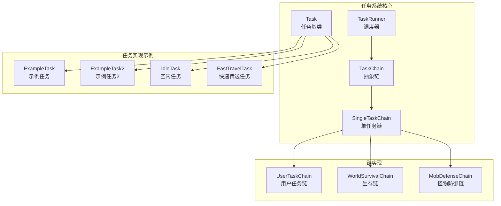
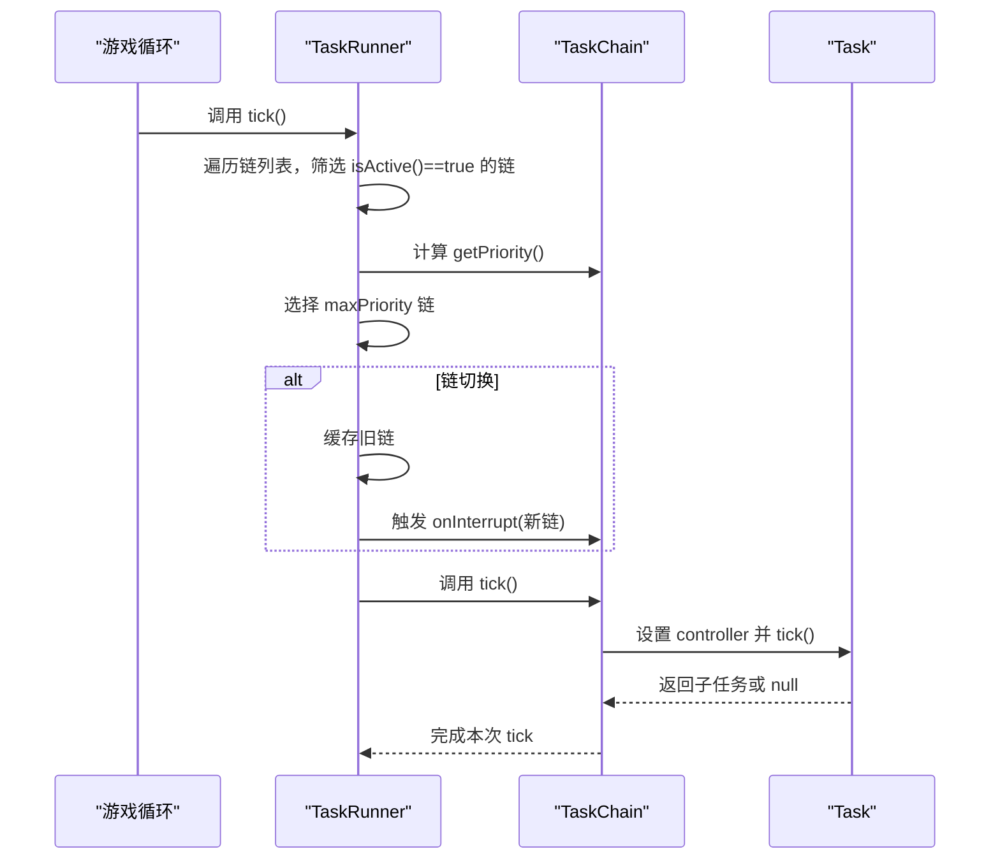
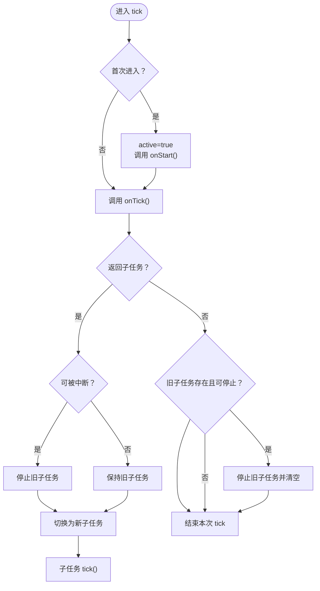
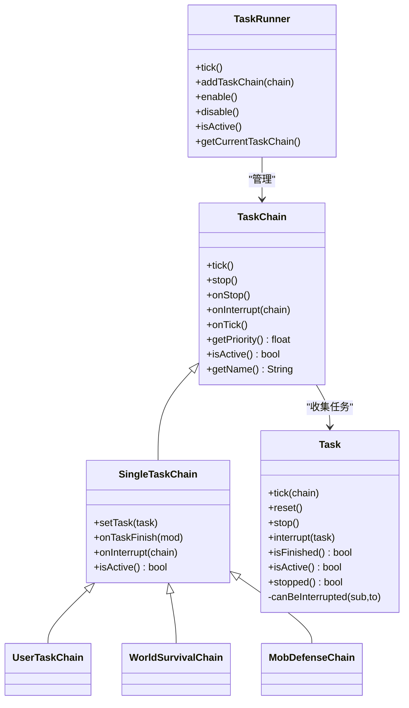

# 任务系统架构

<cite>
**本文引用的文件**
- [Task.java](file://src/main/java/adris/altoclef/tasksystem/Task.java)
- [TaskChain.java](file://src/main/java/adris/altoclef/tasksystem/TaskChain.java)
- [TaskRunner.java](file://src/main/java/adris/altoclef/tasksystem/TaskRunner.java)
- [ITaskCanForce.java](file://src/main/java/adris/altoclef/tasksystem/ITaskCanForce.java)
- [ITaskOverridesGrounded.java](file://src/main/java/adris/altoclef/tasksystem/ITaskOverridesGrounded.java)
- [ITaskRequiresGrounded.java](file://src/main/java/adris/altoclef/tasksystem/ITaskRequiresGrounded.java)
- [SingleTaskChain.java](file://src/main/java/adris/altoclef/chains/SingleTaskChain.java)
- [UserTaskChain.java](file://src/main/java/adris/altoclef/chains/UserTaskChain.java)
- [WorldSurvivalChain.java](file://src/main/java/adris/altoclef/chains/WorldSurvivalChain.java)
- [MobDefenseChain.java](file://src/main/java/adris/altoclef/chains/MobDefenseChain.java)
- [ExampleTask.java](file://src/main/java/adris/altoclef/tasks/examples/ExampleTask.java)
- [ExampleTask2.java](file://src/main/java/adris/altoclef/tasks/examples/ExampleTask2.java)
- [IdleTask.java](file://src/main/java/adris/altoclef/tasks/movement/IdleTask.java)
- [FastTravelTask.java](file://src/main/java/adris/altoclef/tasks/movement/FastTravelTask.java)
- [AltoClefController.java](file://src/main/java/adris/altoclef/AltoClefController.java)
</cite>

## 目录
1. [引言](#引言)
2. [项目结构](#项目结构)
3. [核心组件](#核心组件)
4. [架构总览](#架构总览)
5. [详细组件分析](#详细组件分析)
6. [依赖分析](#依赖分析)
7. [性能考量](#性能考量)
8. [故障排查指南](#故障排查指南)
9. [结论](#结论)
10. [附录](#附录)

## 引言
本技术文档面向任务系统架构，围绕任务执行引擎进行深入解析，重点覆盖以下方面：
- TaskRunner 的核心调度机制与链路切换策略
- TaskChain 的优先级管理算法与激活条件
- Task 接口的设计原则与生命周期管理
- 责任链模式在任务调度中的具体实现（链的激活、优先级计算、任务切换）
- 任务系统从创建、激活、执行到完成的完整生命周期
- 自定义任务接口的实现方法、任务间依赖关系处理与性能优化建议
- 错误处理策略与调试技巧

## 项目结构
任务系统位于模块路径 adris/altoclef/tasksystem 下，配合 chains 包下的各类链式任务实现，以及 tasks 包下的具体任务类型，形成“链式调度 + 任务树”的责任链架构。

图示来源
- [TaskRunner.java:1-98](file://src/main/java/adris/altoclef/tasksystem/TaskRunner.java#L1-L98)
- [TaskChain.java:1-51](file://src/main/java/adris/altoclef/tasksystem/TaskChain.java#L1-L51)
- [SingleTaskChain.java:1-96](file://src/main/java/adris/altoclef/chains/SingleTaskChain.java#L1-L96)
- [UserTaskChain.java:1-236](file://src/main/java/adris/altoclef/chains/UserTaskChain.java#L1-L236)
- [WorldSurvivalChain.java:1-167](file://src/main/java/adris/altoclef/chains/WorldSurvivalChain.java#L1-L167)
- [MobDefenseChain.java:1-706](file://src/main/java/adris/altoclef/chains/MobDefenseChain.java#L1-L706)
- [Task.java:1-181](file://src/main/java/adris/altoclef/tasksystem/Task.java#L1-L181)
- [ExampleTask.java:1-68](file://src/main/java/adris/altoclef/tasks/examples/ExampleTask.java#L1-L68)
- [ExampleTask2.java:1-70](file://src/main/java/adris/altoclef/tasks/examples/ExampleTask2.java#L1-L70)
- [IdleTask.java:1-37](file://src/main/java/adris/altoclef/tasks/movement/IdleTask.java#L1-L37)
- [FastTravelTask.java:1-152](file://src/main/java/adris/altoclef/tasks/movement/FastTravelTask.java#L1-L152)

章节来源
- [TaskRunner.java:1-98](file://src/main/java/adris/altoclef/tasksystem/TaskRunner.java#L1-L98)
- [TaskChain.java:1-51](file://src/main/java/adris/altoclef/tasksystem/TaskChain.java#L1-L51)
- [SingleTaskChain.java:1-96](file://src/main/java/adris/altoclef/chains/SingleTaskChain.java#L1-L96)
- [UserTaskChain.java:1-236](file://src/main/java/adris/altoclef/chains/UserTaskChain.java#L1-L236)
- [WorldSurvivalChain.java:1-167](file://src/main/java/adris/altoclef/chains/WorldSurvivalChain.java#L1-L167)
- [MobDefenseChain.java:1-706](file://src/main/java/adris/altoclef/chains/MobDefenseChain.java#L1-L706)
- [Task.java:1-181](file://src/main/java/adris/altoclef/tasksystem/Task.java#L1-L181)
- [ExampleTask.java:1-68](file://src/main/java/adris/altoclef/tasks/examples/ExampleTask.java#L1-L68)
- [ExampleTask2.java:1-70](file://src/main/java/adris/altoclef/tasks/examples/ExampleTask2.java#L1-L70)
- [IdleTask.java:1-37](file://src/main/java/adris/altoclef/tasks/movement/IdleTask.java#L1-L37)
- [FastTravelTask.java:1-152](file://src/main/java/adris/altoclef/tasks/movement/FastTravelTask.java#L1-L152)

## 核心组件
- Task：任务抽象基类，定义任务生命周期、中断与切换、调试状态与树形结构打印等。
- TaskChain：任务链抽象，负责优先级评估、激活状态、链内任务收集与中断回调。
- SingleTaskChain：单任务链实现，封装主任务的设置、重置、完成回调与打断。
- TaskRunner：全局调度器，按优先级选择当前链并驱动其 tick。
- ITaskCanForce / ITaskOverridesGrounded / ITaskRequiresGrounded：任务强制中断与地面约束接口。

章节来源
- [Task.java:1-181](file://src/main/java/adris/altoclef/tasksystem/Task.java#L1-L181)
- [TaskChain.java:1-51](file://src/main/java/adris/altoclef/tasksystem/TaskChain.java#L1-L51)
- [SingleTaskChain.java:1-96](file://src/main/java/adris/altoclef/chains/SingleTaskChain.java#L1-L96)
- [TaskRunner.java:1-98](file://src/main/java/adris/altoclef/tasksystem/TaskRunner.java#L1-L98)
- [ITaskCanForce.java:1-6](file://src/main/java/adris/altoclef/tasksystem/ITaskCanForce.java#L1-L6)
- [ITaskOverridesGrounded.java:1-5](file://src/main/java/adris/altoclef/tasksystem/ITaskOverridesGrounded.java#L1-L5)
- [ITaskRequiresGrounded.java:1-16](file://src/main/java/adris/altoclef/tasksystem/ITaskRequiresGrounded.java#L1-L16)

## 架构总览
任务系统采用“链式调度 + 任务树”的责任链模式：
- TaskRunner 周期性遍历所有 TaskChain，根据 isActive() 与 getPriority() 选择最高优先级链作为当前链。
- 当链切换时触发 onInterrupt() 回调，用于优雅中断旧链。
- 单任务链 SingleTaskChain 内部持有 mainTask，若 mainTask 未完成则持续 tick；完成后触发 onTaskFinish()。
- Task 在 tick 中可返回子任务（sub-task），支持任务树嵌套与动态切换。

图示来源
- [TaskRunner.java:22-58](file://src/main/java/adris/altoclef/tasksystem/TaskRunner.java#L22-L58)
- [TaskChain.java:16-30](file://src/main/java/adris/altoclef/tasksystem/TaskChain.java#L16-L30)
- [SingleTaskChain.java:22-44](file://src/main/java/adris/altoclef/chains/SingleTaskChain.java#L22-L44)
- [Task.java:17-50](file://src/main/java/adris/altoclef/tasksystem/Task.java#L17-L50)

## 详细组件分析

### TaskRunner：调度器与链切换
- 调度策略
  - 仅在模组处于运行态且玩家在游戏内时执行调度。
  - 遍历所有已注册链，过滤 isActive()==true 的链，计算 getPriority()，取最大者作为当前链。
  - 若当前链发生变化，先对旧链调用 onInterrupt()，再记录新链并更新状态报告。
- 生命周期
  - enable()/disable() 控制整体开关与行为栈 push/pop。
  - getCurrentTaskChain() 提供外部查询当前链。
- 性能与日志
  - 使用日志记录链切换与无链状态，便于调试。

章节来源
- [TaskRunner.java:22-84](file://src/main/java/adris/altoclef/tasksystem/TaskRunner.java#L22-L84)

### TaskChain：链抽象与优先级
- 职责
  - 维护 controller 与链内任务缓存（cachedTaskChain）。
  - 提供 onStop()/onTick()/onInterrupt()/getPriority()/isActive()/getName() 等抽象钩子。
- 任务收集
  - addTaskToChain() 在链 tick 过程中收集当前 tick 的任务，便于调试与统计。

章节来源
- [TaskChain.java:16-44](file://src/main/java/adris/altoclef/tasksystem/TaskChain.java#L16-L44)

### SingleTaskChain：单任务链实现
- 主任务管理
  - setTask() 支持任务替换与强制停止（stop(task)），确保相同类型任务也能重启。
  - onTick() 中若 mainTask 已完成则触发 onTaskFinish()。
- 打断与重置
  - onInterrupt() 将 interrupted 标记为 true，并对 mainTask 调用 interrupt()。
  - isActive() 基于 mainTask 是否存在与完成状态判断。
- 与 TaskRunner 的协作
  - 通过 runner.addTaskChain(this) 注册，由 TaskRunner 统一调度。

章节来源
- [SingleTaskChain.java:22-94](file://src/main/java/adris/altoclef/chains/SingleTaskChain.java#L22-L94)

### Task：任务生命周期与中断机制
- 生命周期
  - tick()：首次进入时标记 active=true 并调用 onStart()；随后调用 onTick()，根据返回值决定是否切换子任务；结束时调用 onStop()。
  - reset()/stop()/interrupt()：重置状态、停止当前任务及其子树、中断但不销毁。
  - isFinished()/isActive()/stopped()：状态查询。
- 子任务切换与强制中断
  - onTick() 可返回新的子任务；若可被中断（参见 canBeInterrupted），则停止旧子任务并切换。
  - canBeInterrupted() 基于 ITaskCanForce.shouldForce() 判断，若子树中存在 ITaskOverridesGrounded，则对地面约束类任务有特殊豁免。
- 调试与树形结构
  - setDebugState()/toString() 输出调试信息。
  - getTaskTree() 打印主任务与其子任务链的树形结构。

图示来源
- [Task.java:17-164](file://src/main/java/adris/altoclef/tasksystem/Task.java#L17-L164)

章节来源
- [Task.java:17-181](file://src/main/java/adris/altoclef/tasksystem/Task.java#L17-L181)

### 接口契约：ITaskCanForce / ITaskOverridesGrounded / ITaskRequiresGrounded
- ITaskCanForce：定义 shouldForce(Task) 以控制是否允许强制中断。
- ITaskOverridesGrounded：标记“可覆盖地面约束”，在地面约束类任务的强制中断判定中返回 false。
- ITaskRequiresGrounded：默认实现基于玩家是否在地面上/游泳/攀爬等状态决定是否应强制中断。

章节来源
- [ITaskCanForce.java:1-6](file://src/main/java/adris/altoclef/tasksystem/ITaskCanForce.java#L1-L6)
- [ITaskOverridesGrounded.java:1-5](file://src/main/java/adris/altoclef/tasksystem/ITaskOverridesGrounded.java#L1-L5)
- [ITaskRequiresGrounded.java:1-16](file://src/main/java/adris/altoclef/tasksystem/ITaskRequiresGrounded.java#L1-L16)

### 具体链实现：UserTaskChain、WorldSurvivalChain、MobDefenseChain
- UserTaskChain
  - 用户主动命令优先级高于普通任务，getPriority() 在用户命令活跃时提升。
  - runTask() 中强制停止当前任务后再设置新任务，避免“相等”任务被跳过。
  - onTaskFinish() 处理完成后的收尾与空闲任务信号。
- WorldSurvivalChain
  - 实时检测溺水、着火、岩浆等危险，按优先级切换相应任务（如灭火、逃跑、安全抖动）。
  - getPriority() 动态评估，结合设置项与环境状态。
- MobDefenseChain
  - 综合考虑近战/远程威胁、投射物接近、盾牌可用性、玩家健康状况等因素，计算优先级并选择应对策略（逃跑、格挡、击杀）。
  - 对用户主动攻击进行优先级上限控制，避免干扰用户命令。

章节来源
- [UserTaskChain.java:125-214](file://src/main/java/adris/altoclef/chains/UserTaskChain.java#L125-L214)
- [WorldSurvivalChain.java:42-106](file://src/main/java/adris/altoclef/chains/WorldSurvivalChain.java#L42-L106)
- [MobDefenseChain.java:154-185](file://src/main/java/adris/altoclef/chains/MobDefenseChain.java#L154-L185)

### 示例任务：ExampleTask、ExampleTask2、IdleTask、FastTravelTask
- ExampleTask：演示任务内部组合多个子任务（取物品、移动到目标区域、放置方块），并在 onTick() 中根据条件切换。
- ExampleTask2：展示超时漫游与目标锁定逻辑。
- IdleTask：空闲任务，持续返回 null，保持长期运行。
- FastTravelTask：跨维度快速旅行，依据阈值与材料可用性动态选择路径与策略。

章节来源
- [ExampleTask.java:21-54](file://src/main/java/adris/altoclef/tasks/examples/ExampleTask.java#L21-L54)
- [ExampleTask2.java:27-48](file://src/main/java/adris/altoclef/tasks/examples/ExampleTask2.java#L27-L48)
- [IdleTask.java:7-35](file://src/main/java/adris/altoclef/tasks/movement/IdleTask.java#L7-L35)
- [FastTravelTask.java:47-120](file://src/main/java/adris/altoclef/tasks/movement/FastTravelTask.java#L47-L120)

## 依赖分析
- TaskRunner 依赖 TaskChain 列表，按优先级选择当前链。
- TaskChain 依赖 Task，通过 addTaskToChain 收集链内任务。
- Task 依赖 ITaskCanForce/ITaskOverridesGrounded/ITaskRequiresGrounded 决定中断策略。
- 各链实现（User/World/Mob）继承 SingleTaskChain，统一管理 mainTask。
- AltoClefController 在构造时初始化各链并注入 TaskRunner，每 tick 驱动调度。

图示来源
- [TaskRunner.java:1-98](file://src/main/java/adris/altoclef/tasksystem/TaskRunner.java#L1-L98)
- [TaskChain.java:1-51](file://src/main/java/adris/altoclef/tasksystem/TaskChain.java#L1-L51)
- [SingleTaskChain.java:1-96](file://src/main/java/adris/altoclef/chains/SingleTaskChain.java#L1-L96)
- [UserTaskChain.java:1-236](file://src/main/java/adris/altoclef/chains/UserTaskChain.java#L1-L236)
- [WorldSurvivalChain.java:1-167](file://src/main/java/adris/altoclef/chains/WorldSurvivalChain.java#L1-L167)
- [MobDefenseChain.java:1-706](file://src/main/java/adris/altoclef/chains/MobDefenseChain.java#L1-L706)
- [Task.java:1-181](file://src/main/java/adris/altoclef/tasksystem/Task.java#L1-L181)

章节来源
- [AltoClefController.java:101-152](file://src/main/java/adris/altoclef/AltoClefController.java#L101-L152)
- [TaskRunner.java:60-84](file://src/main/java/adris/altoclef/tasksystem/TaskRunner.java#L60-L84)
- [TaskChain.java:11-14](file://src/main/java/adris/altoclef/tasksystem/TaskChain.java#L11-L14)

## 性能考量
- 优先级计算与链切换
  - 仅在链状态变化时触发 onInterrupt()，减少不必要的中断开销。
  - 通过 isActive() 与 getPriority() 的组合，避免对非活动链进行无效计算。
- 任务树与中断
  - canBeInterrupted() 通过子树遍历判断是否允许强制中断，避免频繁打断。
  - 子任务切换时仅在必要时停止旧子任务，降低重复初始化成本。
- 日志与调试
  - 使用状态报告与日志输出链切换信息，便于定位性能瓶颈。
- 建议
  - 将高频率链（如 WorldSurvivalChain）的优先级评估逻辑尽量轻量化。
  - 对复杂链（如 MobDefenseChain）的实体扫描与投影计算进行必要的短路与缓存。

## 故障排查指南
- 任务无法启动或反复重启
  - 检查 setTask() 是否被调用，确认是否因“相等”任务被跳过；必要时在调用前显式 stop(task)。
  - 参考路径：[UserTaskChain.java:157-176](file://src/main/java/adris/altoclef/chains/UserTaskChain.java#L157-L176)
- 任务被意外中断
  - 检查 ITaskCanForce.shouldForce() 与 ITaskOverridesGrounded 的实现，确认是否不应被强制中断。
  - 参考路径：[Task.java:152-164](file://src/main/java/adris/altoclef/tasksystem/Task.java#L152-L164)
- 链切换异常
  - 确认 TaskRunner.tick() 中的 isActive()/getPriority() 返回值是否符合预期。
  - 参考路径：[TaskRunner.java:22-58](file://src/main/java/adris/altoclef/tasksystem/TaskRunner.java#L22-L58)
- 调试与日志
  - 使用 Task.toString() 与 getTaskTree() 输出任务树，定位卡住的任务节点。
  - 参考路径：[Task.java:128-179](file://src/main/java/adris/altoclef/tasksystem/Task.java#L128-L179)

章节来源
- [UserTaskChain.java:157-176](file://src/main/java/adris/altoclef/chains/UserTaskChain.java#L157-L176)
- [Task.java:152-179](file://src/main/java/adris/altoclef/tasksystem/Task.java#L152-L179)
- [TaskRunner.java:22-58](file://src/main/java/adris/altoclef/tasksystem/TaskRunner.java#L22-L58)

## 结论
该任务系统以 TaskRunner 为核心，通过 TaskChain 的优先级与激活机制，结合 SingleTaskChain 的单任务管理与 Task 的子任务树，实现了灵活、可扩展的责任链调度。接口契约（ITaskCanForce 等）提供了对中断策略的细粒度控制，使系统既能响应紧急事件（如生存链、防御链），又能尊重用户命令的优先级。通过合理的优先级设计、任务树管理与调试手段，可在保证稳定性的同时获得良好的性能表现。

## 附录

### 如何正确实现自定义任务接口
- 继承 Task，实现 onStart()/onTick()/onStop()/isFinished()/isEqual()/toDebugString()。
- 在 onTick() 中根据条件返回子任务或 null，以构建任务树。
- 使用 setDebugState() 输出调试状态，便于追踪。
- 参考路径：
  - [Task.java:118-126](file://src/main/java/adris/altoclef/tasksystem/Task.java#L118-L126)
  - [ExampleTask.java:21-54](file://src/main/java/adris/altoclef/tasks/examples/ExampleTask.java#L21-L54)

### 如何处理任务间的依赖关系
- 通过 onTick() 返回另一个任务来表达“先做 A 再做 B”的顺序依赖。
- 对于需要“等待”条件满足的情况，可返回自身或超时任务（如 TimeoutWanderTask）。
- 参考路径：
  - [ExampleTask2.java:27-48](file://src/main/java/adris/altoclef/tasks/examples/ExampleTask2.java#L27-L48)

### 优化任务执行性能的实践
- 减少不必要的链切换：合理设置链的 isActive() 与 getPriority()，避免频繁波动。
- 轻量化优先级计算：将昂贵的扫描与判断逻辑缓存或延迟执行。
- 控制任务树深度：避免过深的子任务嵌套导致 tick 开销增大。
- 参考路径：
  - [WorldSurvivalChain.java:42-106](file://src/main/java/adris/altoclef/chains/WorldSurvivalChain.java#L42-L106)
  - [MobDefenseChain.java:154-185](file://src/main/java/adris/altoclef/chains/MobDefenseChain.java#L154-L185)