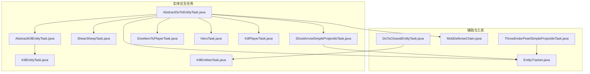
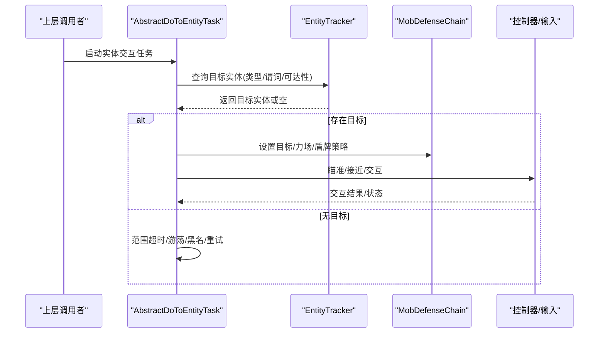
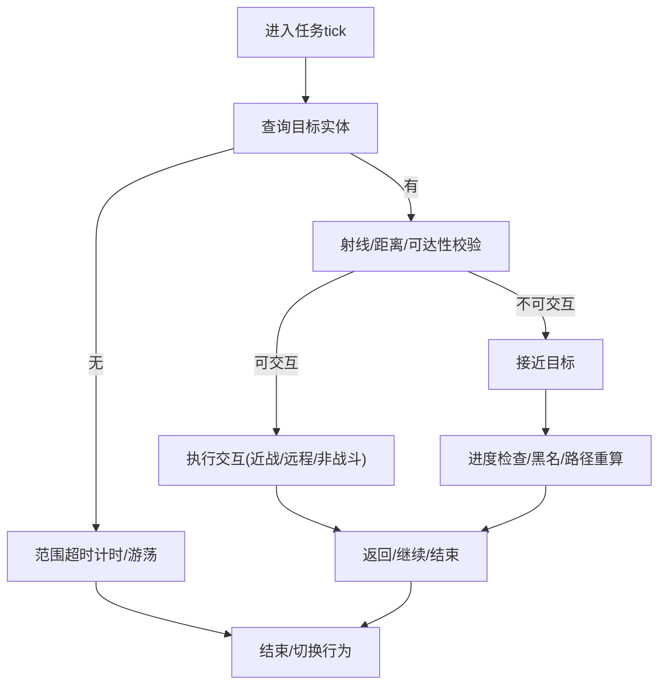
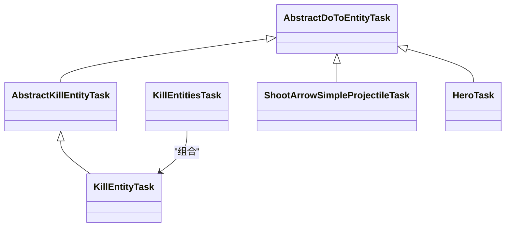
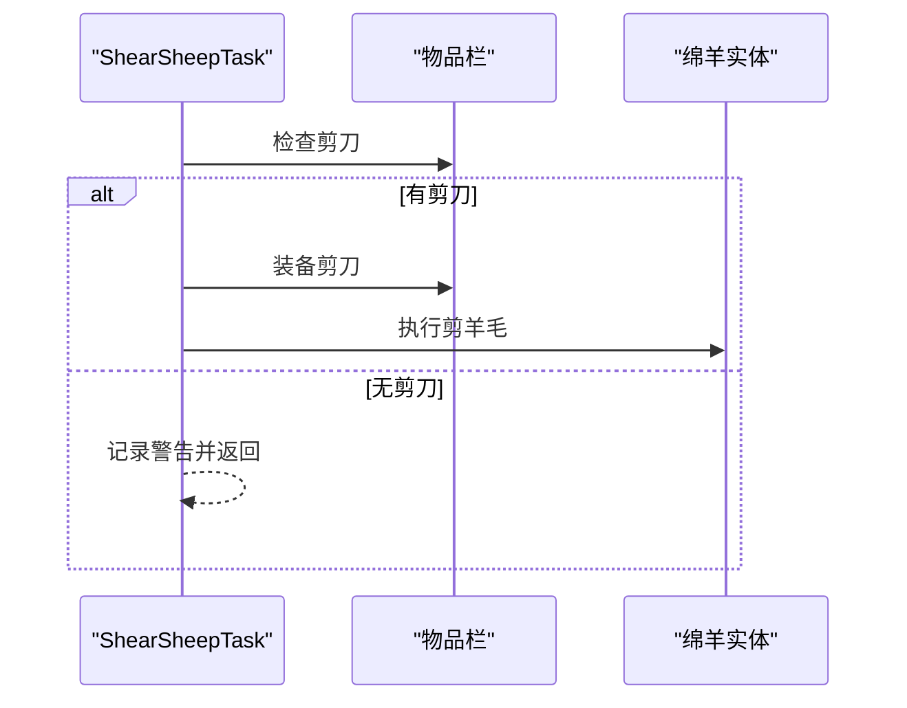
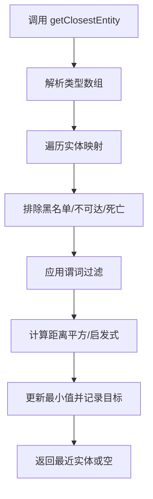
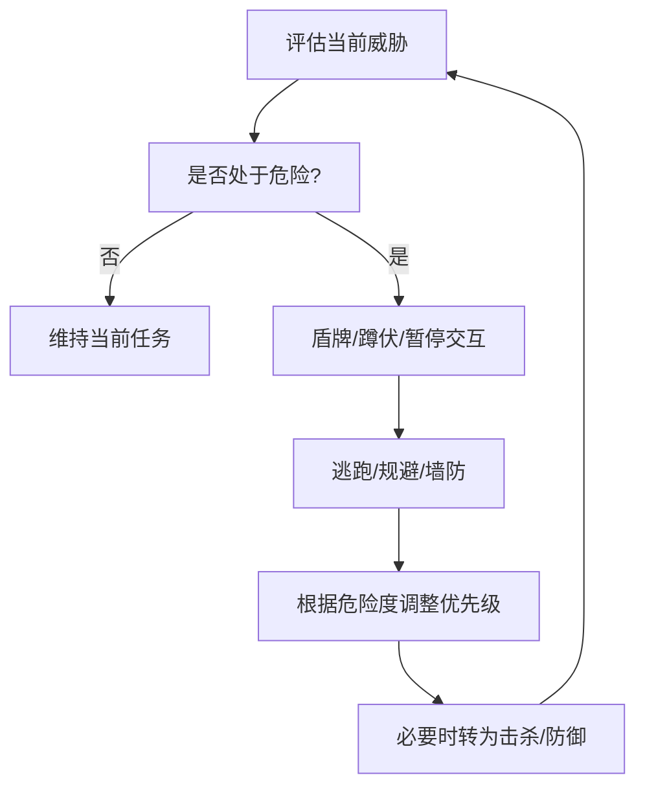
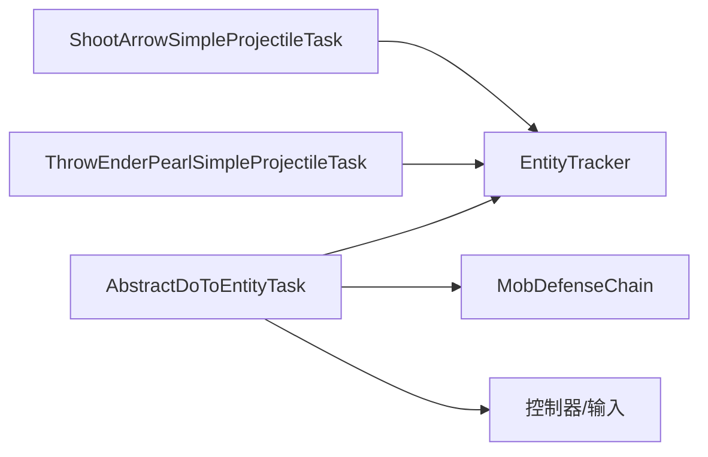

# 实体交互任务

<cite>
**本文引用的文件**
- [KillEntityTask.java](file://src/main/java/adris/altoclef/tasks/entity/KillEntityTask.java)
- [AbstractKillEntityTask.java](file://src/main/java/adris/altoclef/tasks/entity/AbstractKillEntityTask.java)
- [DoToClosestEntityTask.java](file://src/main/java/adris/altoclef/tasks/entity/DoToClosestEntityTask.java)
- [AbstractDoToEntityTask.java](file://src/main/java/adris/altoclef/tasks/entity/AbstractDoToEntityTask.java)
- [ShearSheepTask.java](file://src/main/java/adris/altoclef/tasks/entity/ShearSheepTask.java)
- [KillEntitiesTask.java](file://src/main/java/adris/altoclef/tasks/entity/KillEntitiesTask.java)
- [ShootArrowSimpleProjectileTask.java](file://src/main/java/adris/altoclef/tasks/entity/ShootArrowSimpleProjectileTask.java)
- [GiveItemToPlayerTask.java](file://src/main/java/adris/altoclef/tasks/entity/GiveItemToPlayerTask.java)
- [HeroTask.java](file://src/main/java/adris/altoclef/tasks/entity/HeroTask.java)
- [ThrowEnderPearlSimpleProjectileTask.java](file://src/main/java/adris/altoclef/tasks/movement/ThrowEnderPearlSimpleProjectileTask.java)
- [KillPlayerTask.java](file://src/main/java/adris/altoclef/tasks/entity/KillPlayerTask.java)
- [EntityTracker.java](file://src/main/java/adris/altoclef/trackers/EntityTracker.java)
- [MobDefenseChain.java](file://src/main/java/adris/altoclef/chains/MobDefenseChain.java)
- [README.md](file://README.md)
</cite>

## 目录
1. [引言](#引言)
2. [项目结构](#项目结构)
3. [核心组件](#核心组件)
4. [架构总览](#架构总览)
5. [详细组件分析](#详细组件分析)
6. [依赖分析](#依赖分析)
7. [性能考量](#性能考量)
8. [故障排查指南](#故障排查指南)
9. [结论](#结论)
10. [附录](#附录)

## 引言
本技术文档聚焦于实体交互任务系统，围绕战斗、交易、驯服、投掷等核心功能，系统阐述实体识别算法、目标选择策略、攻击判定机制、安全与距离管理、伤害计算要点，并给出配置与优化建议。读者将获得从高层架构到代码级细节的全景理解，便于在实际项目中安全、高效地扩展与维护实体交互任务。

## 项目结构
实体交互任务主要位于 tasks/entity 与 tasks/movement 包中，配合 trackers 与 chains 提供实体追踪、防御链与路径行为控制。核心关系如下：

图表来源
- [AbstractDoToEntityTask.java](file://src/main/java/adris/altoclef/tasks/entity/AbstractDoToEntityTask.java)
- [AbstractKillEntityTask.java](file://src/main/java/adris/altoclef/tasks/entity/AbstractKillEntityTask.java)
- [KillEntityTask.java](file://src/main/java/adris/altoclef/tasks/entity/KillEntityTask.java)
- [KillEntitiesTask.java](file://src/main/java/adris/altoclef/tasks/entity/KillEntitiesTask.java)
- [ShearSheepTask.java](file://src/main/java/adris/altoclef/tasks/entity/ShearSheepTask.java)
- [ShootArrowSimpleProjectileTask.java](file://src/main/java/adris/altoclef/tasks/entity/ShootArrowSimpleProjectileTask.java)
- [GiveItemToPlayerTask.java](file://src/main/java/adris/altoclef/tasks/entity/GiveItemToPlayerTask.java)
- [HeroTask.java](file://src/main/java/adris/altoclef/tasks/entity/HeroTask.java)
- [KillPlayerTask.java](file://src/main/java/adris/altoclef/tasks/entity/KillPlayerTask.java)
- [DoToClosestEntityTask.java](file://src/main/java/adris/altoclef/tasks/entity/DoToClosestEntityTask.java)
- [EntityTracker.java](file://src/main/java/adris/altoclef/trackers/EntityTracker.java)
- [MobDefenseChain.java](file://src/main/java/adris/altoclef/chains/MobDefenseChain.java)
- [ThrowEnderPearlSimpleProjectileTask.java](file://src/main/java/adris/altoclef/tasks/movement/ThrowEnderPearlSimpleProjectileTask.java)

章节来源
- [README.md](file://README.md)

## 核心组件
- 实体交互抽象层：统一处理接近、瞄准、交互、距离与安全策略。
- 战斗任务族：基于统一抽象的近战击杀、远程射击、英雄任务等。
- 非战斗交互：剪羊毛、投掷末影珍珠、给玩家递物等。
- 目标选择与实体追踪：基于实体类型、可达性、距离与谓词组合。
- 防御链：综合弹射物规避、盾牌、强制力场与逃跑策略。

章节来源
- [AbstractDoToEntityTask.java](file://src/main/java/adris/altoclef/tasks/entity/AbstractDoToEntityTask.java)
- [AbstractKillEntityTask.java](file://src/main/java/adris/altoclef/tasks/entity/AbstractKillEntityTask.java)
- [EntityTracker.java](file://src/main/java/adris/altoclef/trackers/EntityTracker.java)
- [MobDefenseChain.java](file://src/main/java/adris/altoclef/chains/MobDefenseChain.java)

## 架构总览
实体交互任务通过“任务抽象层 → 具体任务 → 工具链/追踪器”的分层组织，实现可插拔、可组合的交互行为。

图表来源
- [AbstractDoToEntityTask.java](file://src/main/java/adris/altoclef/tasks/entity/AbstractDoToEntityTask.java)
- [EntityTracker.java](file://src/main/java/adris/altoclef/trackers/EntityTracker.java)
- [MobDefenseChain.java](file://src/main/java/adris/altoclef/chains/MobDefenseChain.java)

## 详细组件分析

### 概念与通用流程
- 实体识别与目标选择：基于实体类型数组、谓词过滤、距离平方最小化、可达性检查与黑名单。
- 接近与安全：维持距离阈值、强制力场半径、过近时逃跑、视线射线校验。
- 交互执行：近战武器选择与装备、远程瞄准与射击、非战斗交互（剪羊毛、投掷、递物）。
- 超时与活动范围：持续未找到目标时的超时与提示，活动半径限制。

图表来源
- [AbstractDoToEntityTask.java](file://src/main/java/adris/altoclef/tasks/entity/AbstractDoToEntityTask.java)
- [DoToClosestEntityTask.java](file://src/main/java/adris/altoclef/tasks/entity/DoToClosestEntityTask.java)

章节来源
- [AbstractDoToEntityTask.java](file://src/main/java/adris/altoclef/tasks/entity/AbstractDoToEntityTask.java)
- [DoToClosestEntityTask.java](file://src/main/java/adris/altoclef/tasks/entity/DoToClosestEntityTask.java)

### 战斗任务族
- 近战：自动选择最优武器、冷却控制、瞄准与攻击。
- 远程：弓箭瞄准、蓄力计算、射击时机判断。
- 英雄任务：自动寻敌、拾取经验、击杀与拾取掉落。

图表来源
- [AbstractDoToEntityTask.java](file://src/main/java/adris/altoclef/tasks/entity/AbstractDoToEntityTask.java)
- [AbstractKillEntityTask.java](file://src/main/java/adris/altoclef/tasks/entity/AbstractKillEntityTask.java)
- [KillEntityTask.java](file://src/main/java/adris/altoclef/tasks/entity/KillEntityTask.java)
- [KillEntitiesTask.java](file://src/main/java/adris/altoclef/tasks/entity/KillEntitiesTask.java)
- [ShootArrowSimpleProjectileTask.java](file://src/main/java/adris/altoclef/tasks/entity/ShootArrowSimpleProjectileTask.java)
- [HeroTask.java](file://src/main/java/adris/altoclef/tasks/entity/HeroTask.java)

章节来源
- [AbstractKillEntityTask.java](file://src/main/java/adris/altoclef/tasks/entity/AbstractKillEntityTask.java)
- [KillEntityTask.java](file://src/main/java/adris/altoclef/tasks/entity/KillEntityTask.java)
- [KillEntitiesTask.java](file://src/main/java/adris/altoclef/tasks/entity/KillEntitiesTask.java)
- [ShootArrowSimpleProjectileTask.java](file://src/main/java/adris/altoclef/tasks/entity/ShootArrowSimpleProjectileTask.java)
- [HeroTask.java](file://src/main/java/adris/altoclef/tasks/entity/HeroTask.java)

### 非战斗交互任务
- 剪羊毛：检测剪刀、装备剪刀、执行剪羊毛、耐久消耗。
- 给玩家递物：收集资源、跟随玩家、投掷物品、安全距离与超时。
- 投掷末影珍珠：抛物线计算、瞄准、抛投时机与状态跟踪。

图表来源
- [ShearSheepTask.java](file://src/main/java/adris/altoclef/tasks/entity/ShearSheepTask.java)

章节来源
- [ShearSheepTask.java](file://src/main/java/adris/altoclef/tasks/entity/ShearSheepTask.java)
- [GiveItemToPlayerTask.java](file://src/main/java/adris/altoclef/tasks/entity/GiveItemToPlayerTask.java)
- [ThrowEnderPearlSimpleProjectileTask.java](file://src/main/java/adris/altoclef/tasks/movement/ThrowEnderPearlSimpleProjectileTask.java)

### 实体识别与目标选择
- 实体追踪器负责聚合世界实体、掉落物、弹射物、玩家坐标与仇恨列表，并提供“最近实体”查询、可达性与黑名单管理。
- 目标选择策略：类型过滤、谓词组合、距离平方最小化、活动半径限制、范围超时与提示。

图表来源
- [EntityTracker.java](file://src/main/java/adris/altoclef/trackers/EntityTracker.java)
- [DoToClosestEntityTask.java](file://src/main/java/adris/altoclef/tasks/entity/DoToClosestEntityTask.java)

章节来源
- [EntityTracker.java](file://src/main/java/adris/altoclef/trackers/EntityTracker.java)
- [DoToClosestEntityTask.java](file://src/main/java/adris/altoclef/tasks/entity/DoToClosestEntityTask.java)

### 防御链与安全策略
- 综合评估：隐身/爆炸/弹射物/毒药/虚弱等危险因素，动态调整优先级与行为。
- 力场与盾牌：强制力场驱散非敌对实体，盾牌格挡与蹲伏，必要时建造临时墙。
- 逃跑与规避：针对苦力怕、箭矢、火球、恶魂火球等的特定策略。

图表来源
- [MobDefenseChain.java](file://src/main/java/adris/altoclef/chains/MobDefenseChain.java)

章节来源
- [MobDefenseChain.java](file://src/main/java/adris/altoclef/chains/MobDefenseChain.java)

## 依赖分析
- 低耦合：实体交互任务通过抽象基类统一接口，具体任务彼此独立。
- 关键依赖：
  - EntityTracker：提供实体查询、黑名单、弹射物与玩家坐标。
  - MobDefenseChain：提供防御优先级、盾牌、力场与逃跑策略。
  - 控制器/输入：提供瞄准、移动、交互与冷却控制。
- 潜在循环依赖：任务与追踪器/防御链为单向依赖，未见循环。

图表来源
- [AbstractDoToEntityTask.java](file://src/main/java/adris/altoclef/tasks/entity/AbstractDoToEntityTask.java)
- [EntityTracker.java](file://src/main/java/adris/altoclef/trackers/EntityTracker.java)
- [MobDefenseChain.java](file://src/main/java/adris/altoclef/chains/MobDefenseChain.java)
- [ShootArrowSimpleProjectileTask.java](file://src/main/java/adris/altoclef/tasks/entity/ShootArrowSimpleProjectileTask.java)
- [ThrowEnderPearlSimpleProjectileTask.java](file://src/main/java/adris/altoclef/tasks/movement/ThrowEnderPearlSimpleProjectileTask.java)

章节来源
- [AbstractDoToEntityTask.java](file://src/main/java/adris/altoclef/tasks/entity/AbstractDoToEntityTask.java)
- [EntityTracker.java](file://src/main/java/adris/altoclef/trackers/EntityTracker.java)
- [MobDefenseChain.java](file://src/main/java/adris/altoclef/chains/MobDefenseChain.java)
- [ShootArrowSimpleProjectileTask.java](file://src/main/java/adris/altoclef/tasks/entity/ShootArrowSimpleProjectileTask.java)
- [ThrowEnderPearlSimpleProjectileTask.java](file://src/main/java/adris/altoclef/tasks/movement/ThrowEnderPearlSimpleProjectileTask.java)

## 性能考量
- 实体扫描与排序：实体查询采用距离平方最小化与同步锁，建议在高频任务中限制查询范围与类型集合。
- 黑名单与可达性：合理使用黑名单减少无效路径尝试，避免重复接近失败导致的路径重算。
- 冷却与节奏：近战攻击冷却与远程蓄力节奏应与 tick 周期匹配，避免过度交互导致的卡顿。
- 防御链优先级：在高威胁场景下，防御链会抢占优先级，建议在任务中适时让位以保证生存。

## 故障排查指南
- 无法找到目标
  - 检查实体类型与谓词是否正确，确认活动半径与范围超时设置。
  - 参考：范围超时计时与提示逻辑。
- 无法交互
  - 校验射线/距离/可达性，确认强制力场与盾牌策略未阻断交互。
  - 参考：射线校验与接近逻辑。
- 近战不攻击
  - 检查冷却时间与武器选择/装备流程，确认控制器额外攻击接口可用。
  - 参考：近战攻击冷却与武器选择。
- 远程不射击
  - 检查弓箭与蓄力状态，确认瞄准角度与释放时机。
  - 参考：箭矢瞄准与射击时机。
- 防御链干扰
  - 在高威胁场景下，防御链会抢占优先级，必要时降低任务优先级或暂停交互。
  - 参考：防御链优先级与盾牌策略。

章节来源
- [DoToClosestEntityTask.java](file://src/main/java/adris/altoclef/tasks/entity/DoToClosestEntityTask.java)
- [AbstractDoToEntityTask.java](file://src/main/java/adris/altoclef/tasks/entity/AbstractDoToEntityTask.java)
- [AbstractKillEntityTask.java](file://src/main/java/adris/altoclef/tasks/entity/AbstractKillEntityTask.java)
- [ShootArrowSimpleProjectileTask.java](file://src/main/java/adris/altoclef/tasks/entity/ShootArrowSimpleProjectileTask.java)
- [MobDefenseChain.java](file://src/main/java/adris/altoclef/chains/MobDefenseChain.java)

## 结论
实体交互任务系统以统一抽象为核心，结合实体追踪与防御链，实现了可扩展、可组合且安全的交互能力。通过合理的距离管理、冷却控制与优先级调度，系统能够在复杂环境中稳定执行战斗、交易、驯服与投掷等任务。建议在实际部署中遵循本文的配置与优化建议，确保任务的可靠性与性能。

## 附录

### 实现示例与最佳实践
- 配置战斗任务
  - 近战：使用近战抽象任务，自动选择武器并按冷却节奏攻击。
  - 远程：使用箭矢射击任务，自动瞄准与释放。
  - 英雄：使用英雄任务，自动寻敌、拾取经验与掉落。
- 配置非战斗任务
  - 剪羊毛：确保拥有剪刀并装备，执行剪羊毛。
  - 给玩家递物：先收集资源，再跟随玩家并在安全距离投掷。
  - 投掷末影珍珠：计算抛物线与瞄准，按时机抛投。
- 安全与距离管理
  - 使用强制力场与盾牌策略，避免弹射物伤害。
  - 设置维持距离与过近距离逃跑，确保交互安全。
- 伤害计算与判定
  - 近战：依据武器等级与攻击伤害基准。
  - 远程：依据蓄力与抛物线轨迹，命中判定基于朝向与速度。
- 实体管理最佳实践
  - 使用实体追踪器进行类型过滤与谓词组合。
  - 合理设置活动半径与范围超时，避免无效搜索。
  - 使用黑名单减少重复接近失败，优化路径性能。

章节来源
- [AbstractDoToEntityTask.java](file://src/main/java/adris/altoclef/tasks/entity/AbstractDoToEntityTask.java)
- [AbstractKillEntityTask.java](file://src/main/java/adris/altoclef/tasks/entity/AbstractKillEntityTask.java)
- [EntityTracker.java](file://src/main/java/adris/altoclef/trackers/EntityTracker.java)
- [MobDefenseChain.java](file://src/main/java/adris/altoclef/chains/MobDefenseChain.java)
- [ShootArrowSimpleProjectileTask.java](file://src/main/java/adris/altoclef/tasks/entity/ShootArrowSimpleProjectileTask.java)
- [ThrowEnderPearlSimpleProjectileTask.java](file://src/main/java/adris/altoclef/tasks/movement/ThrowEnderPearlSimpleProjectileTask.java)
- [GiveItemToPlayerTask.java](file://src/main/java/adris/altoclef/tasks/entity/GiveItemToPlayerTask.java)
- [HeroTask.java](file://src/main/java/adris/altoclef/tasks/entity/HeroTask.java)