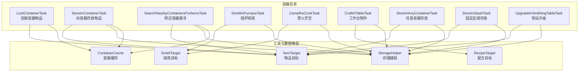
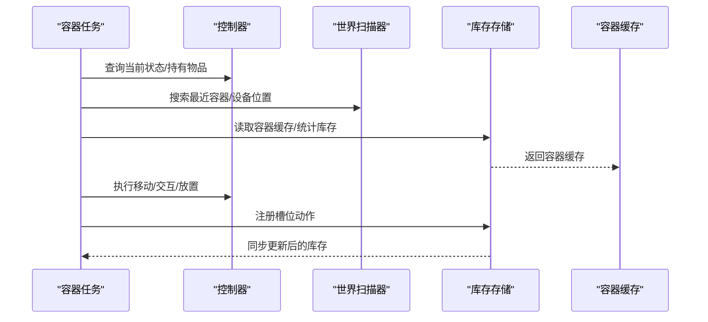
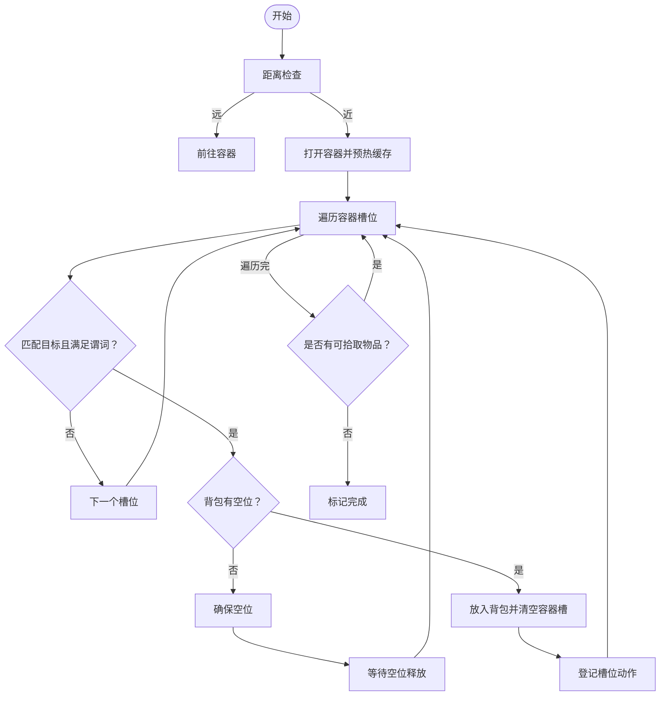
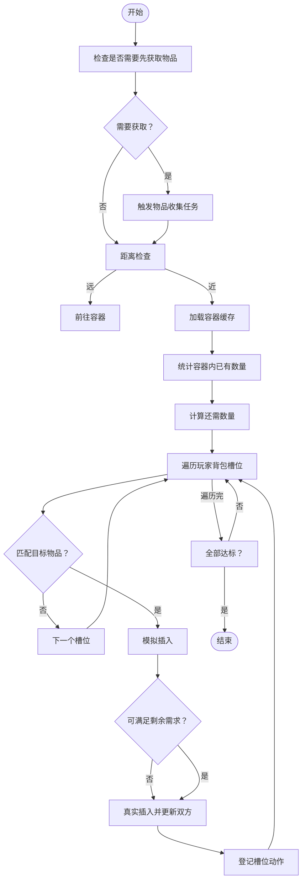
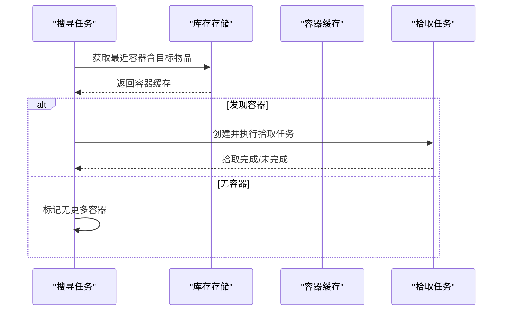
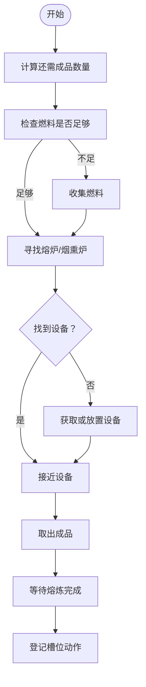
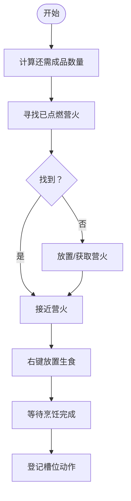
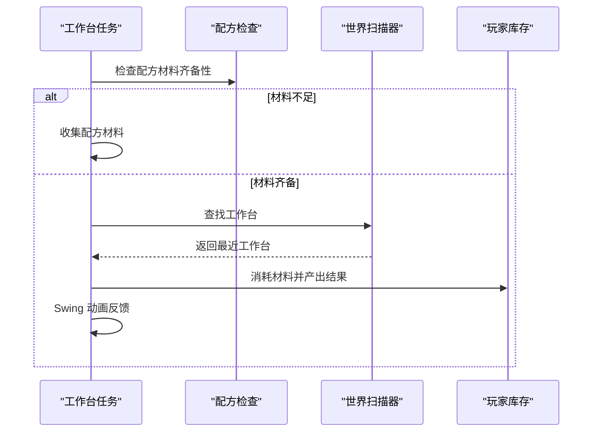
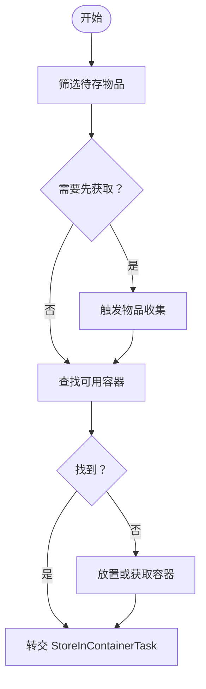
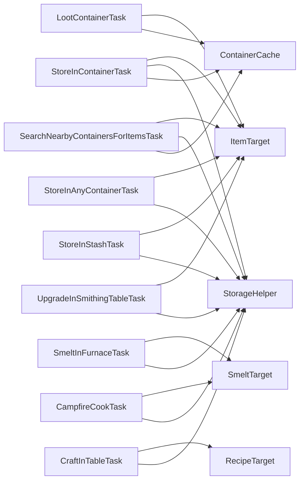

# 容器操作任务

<cite>
**本文引用的文件**
- [LootContainerTask.java](file://src/main/java/adris/altoclef/tasks/container/LootContainerTask.java)
- [StoreInContainerTask.java](file://src/main/java/adris/altoclef/tasks/container/StoreInContainerTask.java)
- [SearchNearbyContainersForItemsTask.java](file://src/main/java/adris/altoclef/tasks/container/SearchNearbyContainersForItemsTask.java)
- [SmeltInFurnaceTask.java](file://src/main/java/adris/altoclef/tasks/container/SmeltInFurnaceTask.java)
- [CampfireCookTask.java](file://src/main/java/adris/altoclef/tasks/container/CampfireCookTask.java)
- [CraftInTableTask.java](file://src/main/java/adris/altoclef/tasks/container/CraftInTableTask.java)
- [StoreInAnyContainerTask.java](file://src/main/java/adris/altoclef/tasks/container/StoreInAnyContainerTask.java)
- [StoreInStashTask.java](file://src/main/java/adris/altoclef/tasks/container/StoreInStashTask.java)
- [UpgradeInSmithingTableTask.java](file://src/main/java/adris/altoclef/tasks/container/UpgradeInSmithingTableTask.java)
- [StorageHelper.java](file://src/main/java/adris/altoclef/util/helpers/StorageHelper.java)
- [ItemTarget.java](file://src/main/java/adris/altoclef/util/ItemTarget.java)
- [SmeltTarget.java](file://src/main/java/adris/altoclef/util/SmeltTarget.java)
- [RecipeTarget.java](file://src/main/java/adris/altoclef/util/RecipeTarget.java)
- [ContainerCache.java](file://src/main/java/adris/altoclef/trackers/storage/ContainerCache.java)
</cite>

## 目录
1. [简介](#简介)
2. [项目结构](#项目结构)
3. [核心组件](#核心组件)
4. [架构总览](#架构总览)
5. [详细组件分析](#详细组件分析)
6. [依赖关系分析](#依赖关系分析)
7. [性能与资源优化](#性能与资源优化)
8. [使用指南与示例路径](#使用指南与示例路径)
9. [故障排除](#故障排除)
10. [结论](#结论)

## 简介
本文件面向“容器操作任务系统”，系统性梳理并解释各类容器相关任务的实现原理与工作机制，包括箱子搜寻、物品存储、熔炼加工、工作台制作、营火烹饪、铁砧升级等。重点覆盖容器识别机制、物品匹配算法、配方管理、自动化流程、批量操作策略与资源优化配置，并提供可直接定位到源码的示例路径，帮助读者快速上手与深度定制。

## 项目结构
容器任务集中于 tasks/container 包中，围绕“容器”这一核心对象，通过控制器（AltoClefController）与世界扫描器（BlockScanner）、库存存储（ItemStorage）、行为保护（Behaviour）等模块协作完成自动化流程。辅助工具位于 util 与 util/helpers 包，用于匹配、统计与配方解析；追踪器位于 trackers/storage，负责缓存容器状态。

**图表来源**
- [LootContainerTask.java:1-118](file://src/main/java/adris/altoclef/tasks/container/LootContainerTask.java#L1-L118)
- [StoreInContainerTask.java:1-180](file://src/main/java/adris/altoclef/tasks/container/StoreInContainerTask.java#L1-L180)
- [SearchNearbyContainersForItemsTask.java:1-124](file://src/main/java/adris/altoclef/tasks/container/SearchNearbyContainersForItemsTask.java#L1-L124)
- [SmeltInFurnaceTask.java:1-238](file://src/main/java/adris/altoclef/tasks/container/SmeltInFurnaceTask.java#L1-L238)
- [CampfireCookTask.java:1-215](file://src/main/java/adris/altoclef/tasks/container/CampfireCookTask.java#L1-L215)
- [CraftInTableTask.java:1-162](file://src/main/java/adris/altoclef/tasks/container/CraftInTableTask.java#L1-L162)
- [StoreInAnyContainerTask.java:1-121](file://src/main/java/adris/altoclef/tasks/container/StoreInAnyContainerTask.java#L1-L121)
- [StoreInStashTask.java:1-94](file://src/main/java/adris/altoclef/tasks/container/StoreInStashTask.java#L1-L94)
- [UpgradeInSmithingTableTask.java:1-131](file://src/main/java/adris/altoclef/tasks/container/UpgradeInSmithingTableTask.java#L1-L131)
- [StorageHelper.java:1-313](file://src/main/java/adris/altoclef/util/helpers/StorageHelper.java#L1-L313)
- [ItemTarget.java:1-185](file://src/main/java/adris/altoclef/util/ItemTarget.java#L1-L185)
- [SmeltTarget.java:1-47](file://src/main/java/adris/altoclef/util/SmeltTarget.java#L1-L47)
- [RecipeTarget.java:1-51](file://src/main/java/adris/altoclef/util/RecipeTarget.java#L1-L51)
- [ContainerCache.java:1-87](file://src/main/java/adris/altoclef/trackers/storage/ContainerCache.java#L1-L87)

**章节来源**
- [LootContainerTask.java:1-118](file://src/main/java/adris/altoclef/tasks/container/LootContainerTask.java#L1-L118)
- [StoreInContainerTask.java:1-180](file://src/main/java/adris/altoclef/tasks/container/StoreInContainerTask.java#L1-L180)
- [SearchNearbyContainersForItemsTask.java:1-124](file://src/main/java/adris/altoclef/tasks/container/SearchNearbyContainersForItemsTask.java#L1-L124)
- [SmeltInFurnaceTask.java:1-238](file://src/main/java/adris/altoclef/tasks/container/SmeltInFurnaceTask.java#L1-L238)
- [CampfireCookTask.java:1-215](file://src/main/java/adris/altoclef/tasks/container/CampfireCookTask.java#L1-L215)
- [CraftInTableTask.java:1-162](file://src/main/java/adris/altoclef/tasks/container/CraftInTableTask.java#L1-L162)
- [StoreInAnyContainerTask.java:1-121](file://src/main/java/adris/altoclef/tasks/container/StoreInAnyContainerTask.java#L1-L121)
- [StoreInStashTask.java:1-94](file://src/main/java/adris/altoclef/tasks/container/StoreInStashTask.java#L1-L94)
- [UpgradeInSmithingTableTask.java:1-131](file://src/main/java/adris/altoclef/tasks/container/UpgradeInSmithingTableTask.java#L1-L131)
- [StorageHelper.java:1-313](file://src/main/java/adris/altoclef/util/helpers/StorageHelper.java#L1-L313)
- [ItemTarget.java:1-185](file://src/main/java/adris/altoclef/util/ItemTarget.java#L1-L185)
- [SmeltTarget.java:1-47](file://src/main/java/adris/altoclef/util/SmeltTarget.java#L1-L47)
- [RecipeTarget.java:1-51](file://src/main/java/adris/altoclef/util/RecipeTarget.java#L1-L51)
- [ContainerCache.java:1-87](file://src/main/java/adris/altoclef/trackers/storage/ContainerCache.java#L1-L87)

## 核心组件
- 容器识别与缓存：通过 ContainerCache 维护容器内物品计数与空位，支持快速判断是否可存放或可拾取。
- 物品匹配与目标：ItemTarget 抽象“需要的物品集合与数量”，支持目录化名称与无限目标标记。
- 熔炼与烹饪目标：SmeltTarget 将“成品目标”与“材料目标”绑定，便于动态计算所需材料数量。
- 配方目标：RecipeTarget 将“输出物+配方+目标数量”封装，配合 StorageHelper 的配方检查逻辑。
- 存储辅助：StorageHelper 提供库存统计、燃料/食物评分、配方材料齐备性检查、装备状态判断等通用能力。

**章节来源**
- [ContainerCache.java:1-87](file://src/main/java/adris/altoclef/trackers/storage/ContainerCache.java#L1-L87)
- [ItemTarget.java:1-185](file://src/main/java/adris/altoclef/util/ItemTarget.java#L1-L185)
- [SmeltTarget.java:1-47](file://src/main/java/adris/altoclef/util/SmeltTarget.java#L1-L47)
- [RecipeTarget.java:1-51](file://src/main/java/adris/altoclef/util/RecipeTarget.java#L1-L51)
- [StorageHelper.java:1-313](file://src/main/java/adris/altoclef/util/helpers/StorageHelper.java#L1-L313)

## 架构总览
容器任务系统以“任务-控制器-世界扫描-存储缓存”的分层架构运行。任务在 onTick 中根据控制器提供的状态推进，必要时调用移动、交互、放置等子任务，最终通过注册槽位动作（registerSlotAction）同步存储状态。

**图表来源**
- [StoreInContainerTask.java:70-105](file://src/main/java/adris/altoclef/tasks/container/StoreInContainerTask.java#L70-L105)
- [SearchNearbyContainersForItemsTask.java:50-62](file://src/main/java/adris/altoclef/tasks/container/SearchNearbyContainersForItemsTask.java#L50-L62)
- [ContainerCache.java:25-45](file://src/main/java/adris/altoclef/trackers/storage/ContainerCache.java#L25-L45)

## 详细组件分析

### 箱子搜寻与拾取（LootContainerTask）
- 功能要点
  - 判断与容器距离，接近后打开容器界面。
  - 遍历容器槽位，匹配目标物品与自定义谓词，尝试放入玩家背包并清空容器槽位。
  - 若无可用物品或容器不可用，标记完成。
- 关键点
  - 使用受保护物品列表避免误破坏目标物品。
  - 通过 WritableCache 预热容器缓存，减少重复扫描。
  - 当背包已满时，先执行确保空位的任务再继续拾取。

**图表来源**
- [LootContainerTask.java:42-92](file://src/main/java/adris/altoclef/tasks/container/LootContainerTask.java#L42-L92)

**章节来源**
- [LootContainerTask.java:1-118](file://src/main/java/adris/altoclef/tasks/container/LootContainerTask.java#L1-L118)

### 向容器存放（StoreInContainerTask）
- 功能要点
  - 可选“若不足则先获取”策略，自动触发对应物品收集任务。
  - 接近容器后，统计容器内已有数量，按最大堆叠规则插入剩余部分。
  - 支持多种容器类型（箱子、桶、箱子等）。
- 关键点
  - insertStack 模拟插入与真实插入两阶段，保证事务性。
  - countItem 聚合统计容器内目标物品总数，避免遗漏。

**图表来源**
- [StoreInContainerTask.java:76-105](file://src/main/java/adris/altoclef/tasks/container/StoreInContainerTask.java#L76-L105)
- [StoreInContainerTask.java:147-178](file://src/main/java/adris/altoclef/tasks/container/StoreInContainerTask.java#L147-L178)

**章节来源**
- [StoreInContainerTask.java:1-180](file://src/main/java/adris/altoclef/tasks/container/StoreInContainerTask.java#L1-L180)

### 附近容器搜寻（SearchNearbyContainersForItemsTask）
- 功能要点
  - 基于容器缓存与范围阈值，寻找最近且包含目标物品的容器。
  - 逐个执行 PickupFromContainerTask，直到所有目标满足或无可用容器。
- 关键点
  - hasNearbyContainersWithItems 可用于前置判断。
  - 使用 ContainerCache 快速筛选非满容器。

**图表来源**
- [SearchNearbyContainersForItemsTask.java:50-62](file://src/main/java/adris/altoclef/tasks/container/SearchNearbyContainersForItemsTask.java#L50-L62)
- [ContainerCache.java:47-65](file://src/main/java/adris/altoclef/trackers/storage/ContainerCache.java#L47-L65)

**章节来源**
- [SearchNearbyContainersForItemsTask.java:1-124](file://src/main/java/adris/altoclef/tasks/container/SearchNearbyContainersForItemsTask.java#L1-L124)

### 熔炼加工（SmeltInFurnaceTask）
- 功能要点
  - 自动选择熔炉或烟熏炉（食物优先），动态计算燃料与材料需求。
  - 处理输出槽取出、燃料补充、生材料放入、等待计时等步骤。
  - 若无设备，优先就地放置，否则获取设备或材料。
- 关键点
  - 依据剩余目标数量动态调整等待时间，提高吞吐效率。
  - 使用 Mixin 访问属性委托以判断燃料状态。

**图表来源**
- [SmeltInFurnaceTask.java:111-153](file://src/main/java/adris/altoclef/tasks/container/SmeltInFurnaceTask.java#L111-L153)
- [SmeltInFurnaceTask.java:161-213](file://src/main/java/adris/altoclef/tasks/container/SmeltInFurnaceTask.java#L161-L213)

**章节来源**
- [SmeltInFurnaceTask.java:1-238](file://src/main/java/adris/altoclef/tasks/container/SmeltInFurnaceTask.java#L1-L238)

### 营火烹饪（CampfireCookTask）
- 功能要点
  - 寻找已点燃的营火，若不存在则引导放置或获取。
  - 通过右键交互将生食放置到营火上，利用计时器等待烹饪完成。
  - 支持跟随主人并在其附近放置营火。
- 关键点
  - isCampfire 严格校验方块类型与状态。
  - placeAttempt 与计数对比确认放置成功。

**图表来源**
- [CampfireCookTask.java:114-137](file://src/main/java/adris/altoclef/tasks/container/CampfireCookTask.java#L114-L137)
- [CampfireCookTask.java:164-190](file://src/main/java/adris/altoclef/tasks/container/CampfireCookTask.java#L164-L190)

**章节来源**
- [CampfireCookTask.java:1-215](file://src/main/java/adris/altoclef/tasks/container/CampfireCookTask.java#L1-L215)

### 工作台制作（CraftInTableTask）
- 功能要点
  - 检查配方材料是否齐备，不齐备则先收集。
  - 寻找工作台，接近后进行多次合成，每次消耗相应材料并产出结果。
  - 使用 Swing 动画反馈制作进度。
- 关键点
  - extractItemTargets 将 RecipeTarget 转换为 ItemTarget，统一目标管理。
  - hasRecipeMaterialsOrTarget 估算所需材料总量，避免反复中断。

**图表来源**
- [CraftInTableTask.java:69-72](file://src/main/java/adris/altoclef/tasks/container/CraftInTableTask.java#L69-L72)
- [CraftInTableTask.java:98-140](file://src/main/java/adris/altoclef/tasks/container/CraftInTableTask.java#L98-L140)

**章节来源**
- [CraftInTableTask.java:1-162](file://src/main/java/adris/altoclef/tasks/container/CraftInTableTask.java#L1-L162)

### 任意容器存放（StoreInAnyContainerTask）
- 功能要点
  - 在范围内寻找可用容器（排除被占用或满载容器），若无则放置或获取容器。
  - 支持过滤地牢箱等特定容器。
- 关键点
  - isValidContainer 过滤条件综合考虑上方阻挡、容器状态与配置偏好。
  - isDungeonChest 通过扫描周围刷怪笼判定地牢箱。

**图表来源**
- [StoreInAnyContainerTask.java:46-61](file://src/main/java/adris/altoclef/tasks/container/StoreInAnyContainerTask.java#L46-L61)
- [StoreInAnyContainerTask.java:91-103](file://src/main/java/adris/altoclef/tasks/container/StoreInAnyContainerTask.java#L91-L103)

**章节来源**
- [StoreInAnyContainerTask.java:1-121](file://src/main/java/adris/altoclef/tasks/container/StoreInAnyContainerTask.java#L1-L121)

### 固定区域存放（StoreInStashTask）
- 功能要点
  - 限定在 BlockRange 内寻找非满容器，若不在区域内则先移动至中心。
- 关键点
  - stashRange.contains 限制搜索范围，避免无效移动。
  - getNearestBlock 结合容器缓存判断是否非满。

**章节来源**
- [StoreInStashTask.java:1-94](file://src/main/java/adris/altoclef/tasks/container/StoreInStashTask.java#L1-L94)

### 铁砧升级（UpgradeInSmithingTableTask）
- 功能要点
  - 检查模板、工具与材料数量，不足则统一收集。
  - 升级前卸下可能冲突的护甲，确保升级槽位可用。
  - 寻找铁砧并执行一次升级，产出目标物品。
- 关键点
  - 通过 ItemTarget 封装模板、工具、材料与输出，统一计数。
  - isArmorEquipped 与 EquipArmorTask 协作保证安全升级。

**章节来源**
- [UpgradeInSmithingTableTask.java:1-131](file://src/main/java/adris/altoclef/tasks/container/UpgradeInSmithingTableTask.java#L1-L131)

## 依赖关系分析
- 任务对控制器的依赖：所有任务均通过 controller 获取行为保护、世界扫描、库存存储、输入控制等能力。
- 任务间耦合：SearchNearbyContainersForItemsTask 与 StoreInContainerTask、LootContainerTask 存在组合关系；CraftInTableTask、SmeltInFurnaceTask、CampfireCookTask、UpgradeInSmithingTableTask 与资源收集任务存在依赖。
- 数据模型依赖：ItemTarget、SmeltTarget、RecipeTarget 作为跨任务的统一目标描述，贯穿匹配、统计与配方检查。

**图表来源**
- [LootContainerTask.java:1-118](file://src/main/java/adris/altoclef/tasks/container/LootContainerTask.java#L1-L118)
- [StoreInContainerTask.java:1-180](file://src/main/java/adris/altoclef/tasks/container/StoreInContainerTask.java#L1-L180)
- [SearchNearbyContainersForItemsTask.java:1-124](file://src/main/java/adris/altoclef/tasks/container/SearchNearbyContainersForItemsTask.java#L1-L124)
- [SmeltInFurnaceTask.java:1-238](file://src/main/java/adris/altoclef/tasks/container/SmeltInFurnaceTask.java#L1-L238)
- [CampfireCookTask.java:1-215](file://src/main/java/adris/altoclef/tasks/container/CampfireCookTask.java#L1-L215)
- [CraftInTableTask.java:1-162](file://src/main/java/adris/altoclef/tasks/container/CraftInTableTask.java#L1-L162)
- [StoreInAnyContainerTask.java:1-121](file://src/main/java/adris/altoclef/tasks/container/StoreInAnyContainerTask.java#L1-L121)
- [StoreInStashTask.java:1-94](file://src/main/java/adris/altoclef/tasks/container/StoreInStashTask.java#L1-L94)
- [UpgradeInSmithingTableTask.java:1-131](file://src/main/java/adris/altoclef/tasks/container/UpgradeInSmithingTableTask.java#L1-L131)
- [StorageHelper.java:1-313](file://src/main/java/adris/altoclef/util/helpers/StorageHelper.java#L1-L313)
- [ItemTarget.java:1-185](file://src/main/java/adris/altoclef/util/ItemTarget.java#L1-L185)
- [SmeltTarget.java:1-47](file://src/main/java/adris/altoclef/util/SmeltTarget.java#L1-L47)
- [RecipeTarget.java:1-51](file://src/main/java/adris/altoclef/util/RecipeTarget.java#L1-L51)
- [ContainerCache.java:1-87](file://src/main/java/adris/altoclef/trackers/storage/ContainerCache.java#L1-L87)

**章节来源**
- [StorageHelper.java:177-205](file://src/main/java/adris/altoclef/util/helpers/StorageHelper.java#L177-L205)
- [ItemTarget.java:88-98](file://src/main/java/adris/altoclef/util/ItemTarget.java#L88-L98)
- [SmeltTarget.java:11-24](file://src/main/java/adris/altoclef/util/SmeltTarget.java#L11-L24)
- [RecipeTarget.java:11-27](file://src/main/java/adris/altoclef/util/RecipeTarget.java#L11-L27)

## 性能与资源优化
- 容器缓存复用：通过 WritableCache 预热容器缓存，减少重复扫描与网络开销。
- 动态等待与批量合成：熔炼与工作台任务根据剩余目标数量动态设置等待间隔，降低无效轮询。
- 材料齐备性检查：hasRecipeMaterialsOrTarget 与 calculateInventoryFuelCount 预估需求，避免频繁中断。
- 路径与范围限制：SearchNearbyContainersForItemsTask 与 StoreInStashTask 使用范围阈值，减少无效移动。
- 装备与占用规避：isArmorEquipped 与保护物品列表避免误操作关键物品。

[本节为通用指导，无需列出具体文件来源]

## 使用指南与示例路径
以下示例路径展示了如何配置与调用不同类型的容器任务，请根据实际需求替换参数与目标：

- 箱子搜寻与拾取
  - [构造函数与启动流程:25-39](file://src/main/java/adris/altoclef/tasks/container/LootContainerTask.java#L25-L39)
  - [拾取主循环与背包空间检查:42-92](file://src/main/java/adris/altoclef/tasks/container/LootContainerTask.java#L42-L92)

- 向容器存放
  - [构造函数与保护物品添加:30-41](file://src/main/java/adris/altoclef/tasks/container/StoreInContainerTask.java#L30-L41)
  - [插入逻辑与模拟/真实插入:147-178](file://src/main/java/adris/altoclef/tasks/container/StoreInContainerTask.java#L147-L178)

- 附近容器搜寻
  - [寻找最近容器与执行拾取:50-62](file://src/main/java/adris/altoclef/tasks/container/SearchNearbyContainersForItemsTask.java#L50-L62)
  - [前置判断是否存在目标物品:95-104](file://src/main/java/adris/altoclef/tasks/container/SearchNearbyContainersForItemsTask.java#L95-L104)

- 熔炼加工
  - [动态计算燃料与材料需求:96-109](file://src/main/java/adris/altoclef/tasks/container/SmeltInFurnaceTask.java#L96-L109)
  - [设备选择与交互流程:111-213](file://src/main/java/adris/altoclef/tasks/container/SmeltInFurnaceTask.java#L111-L213)

- 营火烹饪
  - [寻找与放置营火:114-137](file://src/main/java/adris/altoclef/tasks/container/CampfireCookTask.java#L114-L137)
  - [右键放置与计时等待:164-190](file://src/main/java/adris/altoclef/tasks/container/CampfireCookTask.java#L164-L190)

- 工作台制作
  - [配方齐备性检查与收集:69-72](file://src/main/java/adris/altoclef/tasks/container/CraftInTableTask.java#L69-L72)
  - [多次合成与产出登记:108-138](file://src/main/java/adris/altoclef/tasks/container/CraftInTableTask.java#L108-L138)

- 任意容器存放
  - [可用容器过滤与放置策略:46-78](file://src/main/java/adris/altoclef/tasks/container/StoreInAnyContainerTask.java#L46-L78)

- 固定区域存放
  - [范围限制与就近容器查找:45-64](file://src/main/java/adris/altoclef/tasks/container/StoreInStashTask.java#L45-L64)

- 铁砧升级
  - [模板/材料/工具齐备性检查:57-62](file://src/main/java/adris/altoclef/tasks/container/UpgradeInSmithingTableTask.java#L57-L62)
  - [卸下护甲与执行升级:63-98](file://src/main/java/adris/altoclef/tasks/container/UpgradeInSmithingTableTask.java#L63-L98)

- 数据模型与匹配
  - [物品目标匹配与目录化名称:88-102](file://src/main/java/adris/altoclef/util/ItemTarget.java#L88-L102)
  - [熔炼目标与材料绑定:11-24](file://src/main/java/adris/altoclef/util/SmeltTarget.java#L11-L24)
  - [配方目标与配方封装:11-27](file://src/main/java/adris/altoclef/util/RecipeTarget.java#L11-L27)

- 容器缓存
  - [容器状态更新与空位统计:25-45](file://src/main/java/adris/altoclef/trackers/storage/ContainerCache.java#L25-L45)

**章节来源**
- [LootContainerTask.java:25-92](file://src/main/java/adris/altoclef/tasks/container/LootContainerTask.java#L25-L92)
- [StoreInContainerTask.java:30-178](file://src/main/java/adris/altoclef/tasks/container/StoreInContainerTask.java#L30-L178)
- [SearchNearbyContainersForItemsTask.java:50-104](file://src/main/java/adris/altoclef/tasks/container/SearchNearbyContainersForItemsTask.java#L50-L104)
- [SmeltInFurnaceTask.java:96-213](file://src/main/java/adris/altoclef/tasks/container/SmeltInFurnaceTask.java#L96-L213)
- [CampfireCookTask.java:114-190](file://src/main/java/adris/altoclef/tasks/container/CampfireCookTask.java#L114-L190)
- [CraftInTableTask.java:69-138](file://src/main/java/adris/altoclef/tasks/container/CraftInTableTask.java#L69-L138)
- [StoreInAnyContainerTask.java:46-78](file://src/main/java/adris/altoclef/tasks/container/StoreInAnyContainerTask.java#L46-L78)
- [StoreInStashTask.java:45-64](file://src/main/java/adris/altoclef/tasks/container/StoreInStashTask.java#L45-L64)
- [UpgradeInSmithingTableTask.java:57-98](file://src/main/java/adris/altoclef/tasks/container/UpgradeInSmithingTableTask.java#L57-L98)
- [ItemTarget.java:88-102](file://src/main/java/adris/altoclef/util/ItemTarget.java#L88-L102)
- [SmeltTarget.java:11-24](file://src/main/java/adris/altoclef/util/SmeltTarget.java#L11-L24)
- [RecipeTarget.java:11-27](file://src/main/java/adris/altoclef/util/RecipeTarget.java#L11-L27)
- [ContainerCache.java:25-45](file://src/main/java/adris/altoclef/trackers/storage/ContainerCache.java#L25-L45)

## 故障排除
- 容器不可用或被占用
  - 现象：任务提示容器不可用或为空。
  - 排查：确认容器类型与状态，检查 ContainerCache 是否正确更新。
  - 参考路径：[容器状态检查与完成条件:94-99](file://src/main/java/adris/altoclef/tasks/container/LootContainerTask.java#L94-L99)
- 背包已满导致无法拾取/存放
  - 现象：任务卡在“确保空位”或返回空。
  - 排查：确认 EnsureFreeInventorySlotTask 是否被正确调度，检查物品堆叠上限。
  - 参考路径：[拾取中的背包空间检查:65-70](file://src/main/java/adris/altoclef/tasks/container/LootContainerTask.java#L65-L70)
- 设备缺失或不可交互
  - 现象：找不到熔炉/烟熏炉/工作台/铁砧。
  - 排查：确认设备是否放置在范围内，或先执行获取/放置任务。
  - 参考路径：[设备查找与放置:111-153](file://src/main/java/adris/altoclef/tasks/container/SmeltInFurnaceTask.java#L111-L153)
- 熔炼/烹饪等待异常
  - 现象：计时器不前进或状态停滞。
  - 排查：检查燃料槽状态与属性委托访问，确认等待间隔与计时器重置逻辑。
  - 参考路径：[熔炼等待与计时:175-182](file://src/main/java/adris/altoclef/tasks/container/SmeltInFurnaceTask.java#L175-L182)
- 配方材料不足
  - 现象：制作任务反复切换到收集材料。
  - 排查：核对 hasRecipeMaterialsOrTarget 的估算逻辑与实际库存差异。
  - 参考路径：[配方齐备性检查:177-205](file://src/main/java/adris/altoclef/util/helpers/StorageHelper.java#L177-L205)
- 地牢箱误判
  - 现象：StoreInAnyContainerTask 误避地牢箱。
  - 排查：确认 isDungeonChest 的刷怪笼检测范围与条件。
  - 参考路径：[地牢箱判定:91-103](file://src/main/java/adris/altoclef/tasks/container/StoreInAnyContainerTask.java#L91-L103)

**章节来源**
- [LootContainerTask.java:87-99](file://src/main/java/adris/altoclef/tasks/container/LootContainerTask.java#L87-L99)
- [SmeltInFurnaceTask.java:175-182](file://src/main/java/adris/altoclef/tasks/container/SmeltInFurnaceTask.java#L175-L182)
- [StorageHelper.java:177-205](file://src/main/java/adris/altoclef/util/helpers/StorageHelper.java#L177-L205)
- [StoreInAnyContainerTask.java:91-103](file://src/main/java/adris/altoclef/tasks/container/StoreInAnyContainerTask.java#L91-L103)

## 结论
容器操作任务系统通过“任务-控制器-存储缓存-工具类”的协同，实现了从容器识别、物品匹配、配方管理到自动化执行的完整闭环。借助容器缓存与动态等待策略，系统在复杂场景下仍能保持高效与稳定。建议在实际部署中结合范围限制、设备优先级与批量合成策略，进一步提升吞吐量与鲁棒性。