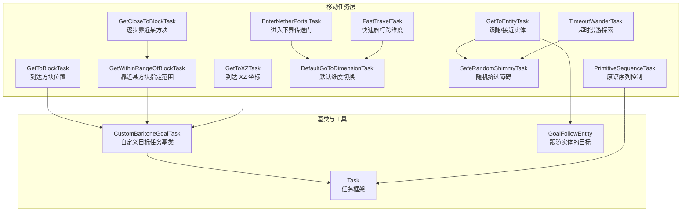
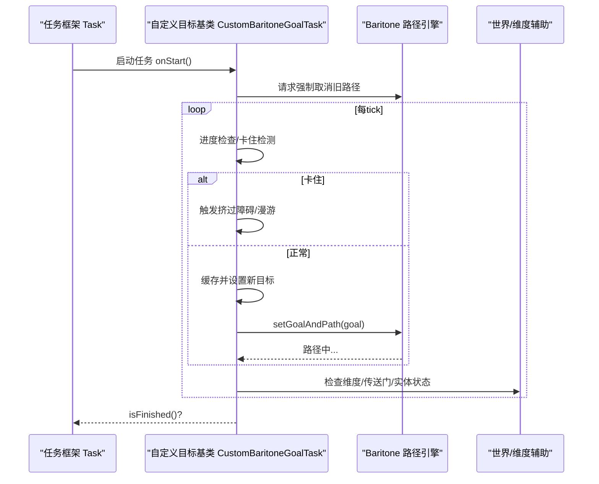
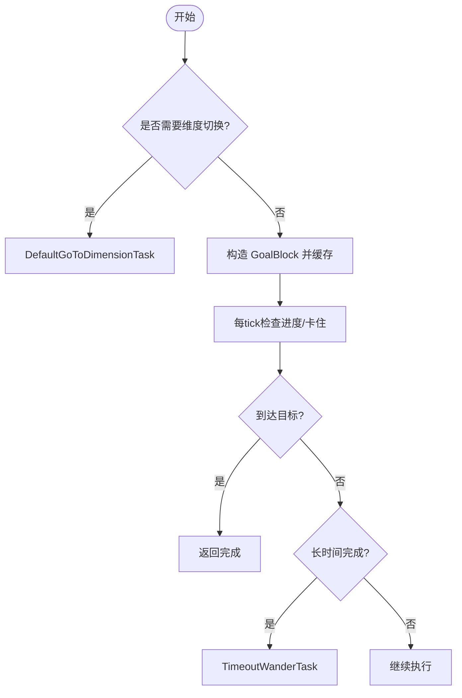
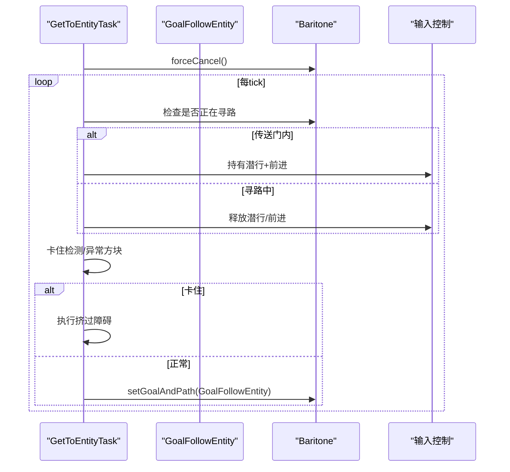
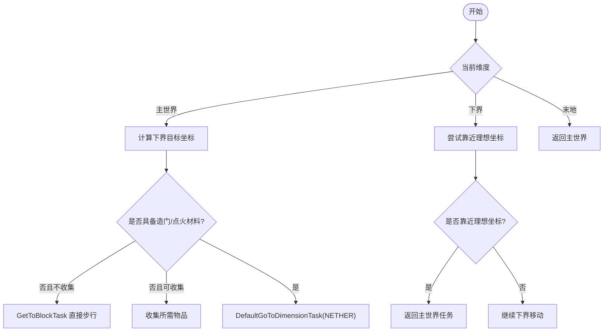
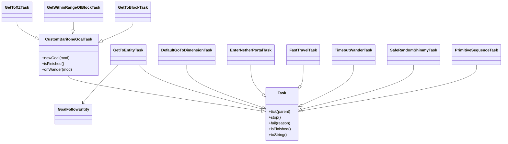

# 移动任务

<cite>
**本文引用的文件**
- [GetToBlockTask.java](file://src/main/java/adris/altoclef/tasks/movement/GetToBlockTask.java)
- [GetToEntityTask.java](file://src/main/java/adris/altoclef/tasks/movement/GetToEntityTask.java)
- [EnterNetherPortalTask.java](file://src/main/java/adris/altoclef/tasks/movement/EnterNetherPortalTask.java)
- [FastTravelTask.java](file://src/main/java/adris/altoclef/tasks/movement/FastTravelTask.java)
- [CustomBaritoneGoalTask.java](file://src/main/java/adris/altoclef/tasks/movement/CustomBaritoneGoalTask.java)
- [DefaultGoToDimensionTask.java](file://src/main/java/adris/altoclef/tasks/movement/DefaultGoToDimensionTask.java)
- [GetCloseToBlockTask.java](file://src/main/java/adris/altoclef/tasks/movement/GetCloseToBlockTask.java)
- [GetWithinRangeOfBlockTask.java](file://src/main/java/adris/altoclef/tasks/movement/GetWithinRangeOfBlockTask.java)
- [GetToXZTask.java](file://src/main/java/adris/altoclef/tasks/movement/GetToXZTask.java)
- [GoalFollowEntity.java](file://src/main/java/adris/altoclef/util/baritone/GoalFollowEntity.java)
- [SafeRandomShimmyTask.java](file://src/main/java/adris/altoclef/tasks/movement/SafeRandomShimmyTask.java)
- [TimeoutWanderTask.java](file://src/main/java/adris/altoclef/tasks/movement/TimeoutWanderTask.java)
- [PrimitiveSequenceTask.java](file://src/main/java/adris/altoclef/tasks/movement/PrimitiveSequenceTask.java)
- [Task.java](file://src/main/java/adris/altoclef/tasksystem/Task.java)
</cite>

## 目录
1. [简介](#简介)
2. [项目结构](#项目结构)
3. [核心组件](#核心组件)
4. [架构总览](#架构总览)
5. [详细组件分析](#详细组件分析)
6. [依赖关系分析](#依赖关系分析)
7. [性能考量](#性能考量)
8. [故障排查指南](#故障排查指南)
9. [结论](#结论)
10. [附录：使用示例与最佳实践](#附录使用示例与最佳实践)

## 简介
本文件面向移动任务系统，系统性梳理基础与高级移动任务的实现原理与使用方法，重点覆盖以下主题：
- 基础移动任务：GetToBlockTask、GetToEntityTask、GetWithinRangeOfBlockTask、GetToXZTask、GetCloseToBlockTask
- 高级移动任务：EnterNetherPortalTask、FastTravelTask
- 路径规划机制、目标定位算法、障碍物规避策略
- 参数配置选项、边界条件处理、异常情况应对
- 组合多个移动任务形成复杂导航序列的方法
- 性能优化建议与常见问题解决方案

## 项目结构
移动任务位于模块“tasks/movement”，围绕“自定义目标任务”基类展开，通过Baritone路径引擎完成寻路与执行，并在必要时切换维度或构建传送门。

图示来源
- [GetToBlockTask.java:1-106](file://src/main/java/adris/altoclef/tasks/movement/GetToBlockTask.java#L1-L106)
- [GetToEntityTask.java:1-203](file://src/main/java/adris/altoclef/tasks/movement/GetToEntityTask.java#L1-L203)
- [GetWithinRangeOfBlockTask.java:1-33](file://src/main/java/adris/altoclef/tasks/movement/GetWithinRangeOfBlockTask.java#L1-L33)
- [GetToXZTask.java:1-54](file://src/main/java/adris/altoclef/tasks/movement/GetToXZTask.java#L1-L54)
- [GetCloseToBlockTask.java:1-50](file://src/main/java/adris/altoclef/tasks/movement/GetCloseToBlockTask.java#L1-L50)
- [EnterNetherPortalTask.java:1-128](file://src/main/java/adris/altoclef/tasks/movement/EnterNetherPortalTask.java#L1-L128)
- [FastTravelTask.java:1-152](file://src/main/java/adris/altoclef/tasks/movement/FastTravelTask.java#L1-L152)
- [DefaultGoToDimensionTask.java:1-138](file://src/main/java/adris/altoclef/tasks/movement/DefaultGoToDimensionTask.java#L1-L138)
- [SafeRandomShimmyTask.java:1-59](file://src/main/java/adris/altoclef/tasks/movement/SafeRandomShimmyTask.java#L1-L59)
- [TimeoutWanderTask.java:1-291](file://src/main/java/adris/altoclef/tasks/movement/TimeoutWanderTask.java#L1-L291)
- [PrimitiveSequenceTask.java:1-321](file://src/main/java/adris/altoclef/tasks/movement/PrimitiveSequenceTask.java#L1-L321)
- [CustomBaritoneGoalTask.java:1-215](file://src/main/java/adris/altoclef/tasks/movement/CustomBaritoneGoalTask.java#L1-L215)
- [GoalFollowEntity.java:1-31](file://src/main/java/adris/altoclef/util/baritone/GoalFollowEntity.java#L1-L31)
- [Task.java:1-181](file://src/main/java/adris/altoclef/tasksystem/Task.java#L1-L181)

章节来源
- [GetToBlockTask.java:1-106](file://src/main/java/adris/altoclef/tasks/movement/GetToBlockTask.java#L1-L106)
- [CustomBaritoneGoalTask.java:1-215](file://src/main/java/adris/altoclef/tasks/movement/CustomBaritoneGoalTask.java#L1-L215)
- [Task.java:1-181](file://src/main/java/adris/altoclef/tasksystem/Task.java#L1-L181)

## 核心组件
- 自定义目标任务基类 CustomBaritoneGoalTask：封装通用的路径目标设置、进度检查、卡住检测与“挤过障碍”逻辑，统一由Baritone执行路径。
- 目标跟随实体 GoalFollowEntity：为GetToEntityTask提供“接近实体”的目标与启发式评估。
- 任务框架 Task：统一的任务生命周期（启动/循环/停止）、调试状态输出、子任务嵌套与中断策略。
- 具体移动任务：
  - 到达方块/坐标/范围：GetToBlockTask、GetToXZTask、GetWithinRangeOfBlockTask、GetCloseToBlockTask
  - 跟随/接近实体：GetToEntityTask
  - 维度/传送门：EnterNetherPortalTask、DefaultGoToDimensionTask、FastTravelTask
  - 异常处理与探索：TimeoutWanderTask、SafeRandomShimmyTask
  - 原语序列控制：PrimitiveSequenceTask（用于精确输入/视角序列）

章节来源
- [CustomBaritoneGoalTask.java:1-215](file://src/main/java/adris/altoclef/tasks/movement/CustomBaritoneGoalTask.java#L1-L215)
- [GoalFollowEntity.java:1-31](file://src/main/java/adris/altoclef/util/baritone/GoalFollowEntity.java#L1-L31)
- [Task.java:1-181](file://src/main/java/adris/altoclef/tasksystem/Task.java#L1-L181)
- [GetToBlockTask.java:1-106](file://src/main/java/adris/altoclef/tasks/movement/GetToBlockTask.java#L1-L106)
- [GetToXZTask.java:1-54](file://src/main/java/adris/altoclef/tasks/movement/GetToXZTask.java#L1-L54)
- [GetWithinRangeOfBlockTask.java:1-33](file://src/main/java/adris/altoclef/tasks/movement/GetWithinRangeOfBlockTask.java#L1-L33)
- [GetCloseToBlockTask.java:1-50](file://src/main/java/adris/altoclef/tasks/movement/GetCloseToBlockTask.java#L1-L50)
- [GetToEntityTask.java:1-203](file://src/main/java/adris/altoclef/tasks/movement/GetToEntityTask.java#L1-L203)
- [EnterNetherPortalTask.java:1-128](file://src/main/java/adris/altoclef/tasks/movement/EnterNetherPortalTask.java#L1-L128)
- [DefaultGoToDimensionTask.java:1-138](file://src/main/java/adris/altoclef/tasks/movement/DefaultGoToDimensionTask.java#L1-L138)
- [FastTravelTask.java:1-152](file://src/main/java/adris/altoclef/tasks/movement/FastTravelTask.java#L1-L152)
- [TimeoutWanderTask.java:1-291](file://src/main/java/adris/altoclef/tasks/movement/TimeoutWanderTask.java#L1-L291)
- [SafeRandomShimmyTask.java:1-59](file://src/main/java/adris/altoclef/tasks/movement/SafeRandomShimmyTask.java#L1-L59)
- [PrimitiveSequenceTask.java:1-321](file://src/main/java/adris/altoclef/tasks/movement/PrimitiveSequenceTask.java#L1-L321)

## 架构总览
移动任务以“任务框架 + 目标基类 + 具体任务”的分层方式组织，具体流程如下：
- 任务启动后，按需设置目标（方块、坐标、实体），交由Baritone执行路径。
- 在执行过程中持续进行“进度检查/卡住检测/异常处理”，必要时切换到探索、漫游或挤过障碍。
- 维度切换通过DefaultGoToDimensionTask协调，必要时构建传送门。
- 快速旅行通过FastTravelTask在主世界与下界之间高效跳转。

图示来源
- [Task.java:1-181](file://src/main/java/adris/altoclef/tasksystem/Task.java#L1-L181)
- [CustomBaritoneGoalTask.java:1-215](file://src/main/java/adris/altoclef/tasks/movement/CustomBaritoneGoalTask.java#L1-L215)

## 详细组件分析

### 基础移动任务

#### GetToBlockTask：到达指定方块
- 功能要点
  - 将目标封装为“到达方块”的Baritone目标。
  - 支持可选维度切换；若已处于目标维度且长时间完成，触发超时漫游以防卡死。
  - 可选“优先使用楼梯”行为栈管理。
- 关键点
  - 目标类型：GoalBlock
  - 完成判定：目标方块且维度匹配
  - 异常处理：长时间完成仍被调用时，自动漫游规避

图示来源
- [GetToBlockTask.java:1-106](file://src/main/java/adris/altoclef/tasks/movement/GetToBlockTask.java#L1-L106)
- [DefaultGoToDimensionTask.java:1-138](file://src/main/java/adris/altoclef/tasks/movement/DefaultGoToDimensionTask.java#L1-L138)
- [TimeoutWanderTask.java:1-291](file://src/main/java/adris/altoclef/tasks/movement/TimeoutWanderTask.java#L1-L291)

章节来源
- [GetToBlockTask.java:1-106](file://src/main/java/adris/altoclef/tasks/movement/GetToBlockTask.java#L1-L106)

#### GetWithinRangeOfBlockTask：靠近某方块指定范围
- 功能要点
  - 目标为“距离方块不超过半径”的GoalNear。
  - 继承自CustomBaritoneGoalTask，复用进度/卡住/挤过逻辑。
- 关键点
  - 目标类型：GoalNear
  - 适合“在附近等待/收集资源”等场景

章节来源
- [GetWithinRangeOfBlockTask.java:1-33](file://src/main/java/adris/altoclef/tasks/movement/GetWithinRangeOfBlockTask.java#L1-L33)

#### GetToXZTask：到达 XZ 坐标
- 功能要点
  - 目标为“固定 XZ 坐标”的GoalXZ。
  - 若目标维度不同，自动委托DefaultGoToDimensionTask。
- 关键点
  - 目标类型：GoalXZ
  - 完成判定：X/Z均相等且维度一致

章节来源
- [GetToXZTask.java:1-54](file://src/main/java/adris/altoclef/tasks/movement/GetToXZTask.java#L1-L54)

#### GetCloseToBlockTask：逐步靠近某方块
- 功能要点
  - 通过递减目标半径的方式，逐步逼近目标方块。
  - 内部委派GetWithinRangeOfBlockTask实现实际路径。
- 关键点
  - 动态半径：每次成功靠近则缩小半径

章节来源
- [GetCloseToBlockTask.java:1-50](file://src/main/java/adris/altoclef/tasks/movement/GetCloseToBlockTask.java#L1-L50)

#### GetToEntityTask：跟随/接近实体
- 功能要点
  - 使用GoalFollowEntity作为目标，支持“接近到指定距离”。
  - 对“藤蔓/栅栏/门/花丛/梯子”等易卡地形进行检测，必要时执行挤过障碍。
  - 在传送门内时释放按键，避免卡死。
- 关键点
  - 目标类型：GoalFollowEntity
  - 异常处理：卡住检测+挤过障碍+超时漫游

图示来源
- [GetToEntityTask.java:1-203](file://src/main/java/adris/altoclef/tasks/movement/GetToEntityTask.java#L1-L203)
- [GoalFollowEntity.java:1-31](file://src/main/java/adris/altoclef/util/baritone/GoalFollowEntity.java#L1-L31)

章节来源
- [GetToEntityTask.java:1-203](file://src/main/java/adris/altoclef/tasks/movement/GetToEntityTask.java#L1-L203)
- [GoalFollowEntity.java:1-31](file://src/main/java/adris/altoclef/util/baritone/GoalFollowEntity.java#L1-L31)

### 高级移动任务

#### EnterNetherPortalTask：进入下界传送门
- 功能要点
  - 若当前在传送门内，等待一段时间后退出。
  - 若找到可用传送门，前往最近的传送门入口。
  - 若无传送门，根据当前维度选择建造策略（桶/黑曜石）。
  - 可传入外部“获取传送门”任务，优先执行。
- 关键点
  - 传送门可用性判断：方块存在、下方为实心且非传送门
  - 维度切换：目标维度必须为下界

章节来源
- [EnterNetherPortalTask.java:1-128](file://src/main/java/adris/altoclef/tasks/movement/EnterNetherPortalTask.java#L1-L128)

#### FastTravelTask：快速旅行（跨维度）
- 功能要点
  - 主世界到下界的快速旅行：将目标坐标除以8得到下界坐标，优先收集材料（钻石镐/黑曜石/打火石/火焰弹）。
  - 下界中尽量靠近理想坐标（阈值15格），必要时回程到主世界。
  - 若主世界距离目标较近，则直接步行。
- 关键点
  - 材料需求：钻石镐（挖掘黑曜石）、黑曜石（造门）、打火石/火焰弹（点火）
  - 下界阈值：IN_NETHER_CLOSE_ENOUGH_THRESHOLD=15.0
  - 主世界阈值：受设置影响，最小阈值限制

图示来源
- [FastTravelTask.java:1-152](file://src/main/java/adris/altoclef/tasks/movement/FastTravelTask.java#L1-L152)
- [DefaultGoToDimensionTask.java:1-138](file://src/main/java/adris/altoclef/tasks/movement/DefaultGoToDimensionTask.java#L1-L138)

章节来源
- [FastTravelTask.java:1-152](file://src/main/java/adris/altoclef/tasks/movement/FastTravelTask.java#L1-L152)

#### DefaultGoToDimensionTask：默认维度切换
- 功能要点
  - 主世界↔下界↔末地之间的切换逻辑。
  - 下界→主世界：若传送门近则直接进入传送门，否则寻找上次使用的传送门或建造传送门。
  - 主世界→下界：依据设置选择“原版建造”或“回到基地”。
- 关键点
  - 传送门距离阈值：2000格
  - 未实现的路线会输出提示

章节来源
- [DefaultGoToDimensionTask.java:1-138](file://src/main/java/adris/altoclef/tasks/movement/DefaultGoToDimensionTask.java#L1-L138)

### 辅助与异常处理

#### CustomBaritoneGoalTask：自定义目标任务基类
- 功能要点
  - 统一的进度检查、卡住检测、异常方块识别与挤过障碍。
  - 目标缓存：首次计算后缓存，避免重复构造。
  - 传送门内按键释放策略。
- 关键点
  - 目标类型：抽象方法 newGoal(...)
  - 完成判定：目标.isInGoal(playerPos)

章节来源
- [CustomBaritoneGoalTask.java:1-215](file://src/main/java/adris/altoclef/tasks/movement/CustomBaritoneGoalTask.java#L1-L215)

#### TimeoutWanderTask：超时漫游探索
- 功能要点
  - 在一定时间内无法前进时，进入探索模式，必要时清理光标物品并尝试击杀附近实体。
  - 支持失败计数与范围扩展。
- 关键点
  - 失败阈值：超过10次失败即完成
  - 距离判定：基于起点距离平方

章节来源
- [TimeoutWanderTask.java:1-291](file://src/main/java/adris/altoclef/tasks/movement/TimeoutWanderTask.java#L1-L291)

#### SafeRandomShimmyTask：随机挤过障碍
- 功能要点
  - 定期随机改变朝向，同时强制潜行、前进与攻击，帮助突破栅栏/藤蔓等障碍。
- 关键点
  - 输入覆盖：SNEAK/MOVE_FORWARD/CLICK_LEFT

章节来源
- [SafeRandomShimmyTask.java:1-59](file://src/main/java/adris/altoclef/tasks/movement/SafeRandomShimmyTask.java#L1-L59)

#### PrimitiveSequenceTask：原语序列控制
- 功能要点
  - 提供“输入保持/释放/等待/跳跃/视角插值”等原语，按顺序执行。
  - 适用于精细动作（如短距离穿越、对准/跳跃序列）。
- 关键点
  - 视角插值：支持绝对/相对旋转插值

章节来源
- [PrimitiveSequenceTask.java:1-321](file://src/main/java/adris/altoclef/tasks/movement/PrimitiveSequenceTask.java#L1-L321)

## 依赖关系分析

图示来源
- [Task.java:1-181](file://src/main/java/adris/altoclef/tasksystem/Task.java#L1-L181)
- [CustomBaritoneGoalTask.java:1-215](file://src/main/java/adris/altoclef/tasks/movement/CustomBaritoneGoalTask.java#L1-L215)
- [GetToBlockTask.java:1-106](file://src/main/java/adris/altoclef/tasks/movement/GetToBlockTask.java#L1-L106)
- [GetWithinRangeOfBlockTask.java:1-33](file://src/main/java/adris/altoclef/tasks/movement/GetWithinRangeOfBlockTask.java#L1-L33)
- [GetToXZTask.java:1-54](file://src/main/java/adris/altoclef/tasks/movement/GetToXZTask.java#L1-L54)
- [GetToEntityTask.java:1-203](file://src/main/java/adris/altoclef/tasks/movement/GetToEntityTask.java#L1-L203)
- [GoalFollowEntity.java:1-31](file://src/main/java/adris/altoclef/util/baritone/GoalFollowEntity.java#L1-L31)
- [DefaultGoToDimensionTask.java:1-138](file://src/main/java/adris/altoclef/tasks/movement/DefaultGoToDimensionTask.java#L1-L138)
- [EnterNetherPortalTask.java:1-128](file://src/main/java/adris/altoclef/tasks/movement/EnterNetherPortalTask.java#L1-L128)
- [FastTravelTask.java:1-152](file://src/main/java/adris/altoclef/tasks/movement/FastTravelTask.java#L1-L152)
- [TimeoutWanderTask.java:1-291](file://src/main/java/adris/altoclef/tasks/movement/TimeoutWanderTask.java#L1-L291)
- [SafeRandomShimmyTask.java:1-59](file://src/main/java/adris/altoclef/tasks/movement/SafeRandomShimmyTask.java#L1-L59)
- [PrimitiveSequenceTask.java:1-321](file://src/main/java/adris/altoclef/tasks/movement/PrimitiveSequenceTask.java#L1-L321)

## 性能考量
- 目标缓存与安全取消
  - 基类在启动时强制取消旧路径，避免冗余计算；目标仅在首次计算后缓存，减少重复构造开销。
- 进度检查与卡住检测
  - 使用MovementProgressChecker定期重置，防止无效路径导致的CPU占用。
- 传送门内按键释放
  - 在传送门内释放前进/潜行，避免无效输入导致卡顿。
- 材料前置收集
  - 快速旅行前先检查材料，避免反复往返浪费时间。
- 维度切换策略
  - 下界靠近理想坐标后再回程，减少无效移动距离。

[本节为通用指导，无需列出章节来源]

## 故障排查指南
- 任务长时间完成但仍被调用
  - 现象：任务标记完成但仍在被频繁调用。
  - 处理：GetToBlockTask内置超时漫游保护，自动触发TimeoutWanderTask。
  - 参考：[GetToBlockTask.java:40-60](file://src/main/java/adris/altoclef/tasks/movement/GetToBlockTask.java#L40-L60)
- 实体跟随卡住
  - 现象：靠近实体时被藤蔓/栅栏等阻挡。
  - 处理：自动检测异常方块并执行挤过障碍；必要时击杀附近实体。
  - 参考：[GetToEntityTask.java:146-183](file://src/main/java/adris/altoclef/tasks/movement/GetToEntityTask.java#L146-L183)
- 传送门内卡死
  - 现象：在传送门内无法正常移动。
  - 处理：在传送门内自动持有潜行+前进，确保离开传送门。
  - 参考：[GetToEntityTask.java:129-144](file://src/main/java/adris/altoclef/tasks/movement/GetToEntityTask.java#L129-L144)
- 下界坐标不准确
  - 现象：下界移动偏离理想坐标。
  - 处理：FastTravelTask在下界使用阈值15格靠近理想坐标，必要时回程。
  - 参考：[FastTravelTask.java:103-113](file://src/main/java/adris/altoclef/tasks/movement/FastTravelTask.java#L103-L113)
- 维度切换失败
  - 现象：无法找到或到达目标维度传送门。
  - 处理：DefaultGoToDimensionTask会尝试寻找上次使用的传送门或建造传送门。
  - 参考：[DefaultGoToDimensionTask.java:84-98](file://src/main/java/adris/altoclef/tasks/movement/DefaultGoToDimensionTask.java#L84-L98)

章节来源
- [GetToBlockTask.java:40-60](file://src/main/java/adris/altoclef/tasks/movement/GetToBlockTask.java#L40-L60)
- [GetToEntityTask.java:129-183](file://src/main/java/adris/altoclef/tasks/movement/GetToEntityTask.java#L129-L183)
- [FastTravelTask.java:103-113](file://src/main/java/adris/altoclef/tasks/movement/FastTravelTask.java#L103-L113)
- [DefaultGoToDimensionTask.java:84-98](file://src/main/java/adris/altoclef/tasks/movement/DefaultGoToDimensionTask.java#L84-L98)

## 结论
移动任务系统通过“任务框架 + 自定义目标基类 + 具体任务”的分层设计，结合Baritone路径引擎与异常处理机制，实现了从基础寻路到跨维度快速旅行的完整能力。通过合理组合基础任务与异常处理任务，可以构建稳定高效的导航序列；通过参数化与阈值控制，能够平衡性能与鲁棒性。

[本节为总结性内容，无需列出章节来源]

## 附录：使用示例与最佳实践

- 基础寻路
  - 到达方块：使用GetToBlockTask，必要时开启“优先楼梯”。
  - 靠近范围：使用GetWithinRangeOfBlockTask，设定合适半径。
  - 到达坐标：使用GetToXZTask，跨维度时自动切换。
  - 逐步靠近：使用GetCloseToBlockTask，内部自动缩小半径。
  - 参考文件：
    - [GetToBlockTask.java:1-106](file://src/main/java/adris/altoclef/tasks/movement/GetToBlockTask.java#L1-L106)
    - [GetWithinRangeOfBlockTask.java:1-33](file://src/main/java/adris/altoclef/tasks/movement/GetWithinRangeOfBlockTask.java#L1-L33)
    - [GetToXZTask.java:1-54](file://src/main/java/adris/altoclef/tasks/movement/GetToXZTask.java#L1-L54)
    - [GetCloseToBlockTask.java:1-50](file://src/main/java/adris/altoclef/tasks/movement/GetCloseToBlockTask.java#L1-L50)

- 跟随/接近实体
  - 使用GetToEntityTask，设置接近距离；遇到异常方块自动挤过障碍。
  - 参考文件：
    - [GetToEntityTask.java:1-203](file://src/main/java/adris/altoclef/tasks/movement/GetToEntityTask.java#L1-L203)
    - [GoalFollowEntity.java:1-31](file://src/main/java/adris/altoclef/util/baritone/GoalFollowEntity.java#L1-L31)

- 维度/传送门
  - 进入下界：EnterNetherPortalTask，自动寻找/建造传送门。
  - 默认切换：DefaultGoToDimensionTask，处理主世界↔下界↔末地。
  - 参考文件：
    - [EnterNetherPortalTask.java:1-128](file://src/main/java/adris/altoclef/tasks/movement/EnterNetherPortalTask.java#L1-L128)
    - [DefaultGoToDimensionTask.java:1-138](file://src/main/java/adris/altoclef/tasks/movement/DefaultGoToDimensionTask.java#L1-L138)

- 快速旅行
  - 主世界→下界：FastTravelTask，自动收集材料并靠近理想坐标。
  - 参考文件：
    - [FastTravelTask.java:1-152](file://src/main/java/adris/altoclef/tasks/movement/FastTravelTask.java#L1-L152)

- 异常处理与探索
  - 超时漫游：TimeoutWanderTask，失败计数与范围扩展。
  - 挤过障碍：SafeRandomShimmyTask，随机朝向+强制输入。
  - 参考文件：
    - [TimeoutWanderTask.java:1-291](file://src/main/java/adris/altoclef/tasks/movement/TimeoutWanderTask.java#L1-L291)
    - [SafeRandomShimmyTask.java:1-59](file://src/main/java/adris/altoclef/tasks/movement/SafeRandomShimmyTask.java#L1-L59)

- 原语序列控制
  - 精细动作：PrimitiveSequenceTask，支持输入/等待/跳跃/视角插值。
  - 参考文件：
    - [PrimitiveSequenceTask.java:1-321](file://src/main/java/adris/altoclef/tasks/movement/PrimitiveSequenceTask.java#L1-L321)

- 最佳实践
  - 优先使用目标基类（CustomBaritoneGoalTask）以获得统一的异常处理。
  - 在复杂场景中组合多个任务：如“收集材料 → 切换维度 → 快速旅行 → 回程”。
  - 设置合理的阈值与超时，避免无限循环与无效计算。
  - 在传送门/异常地形区域启用异常处理任务，提升鲁棒性。

[本节为实践指导，无需列出章节来源]