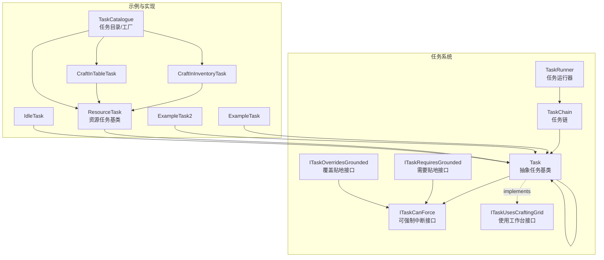
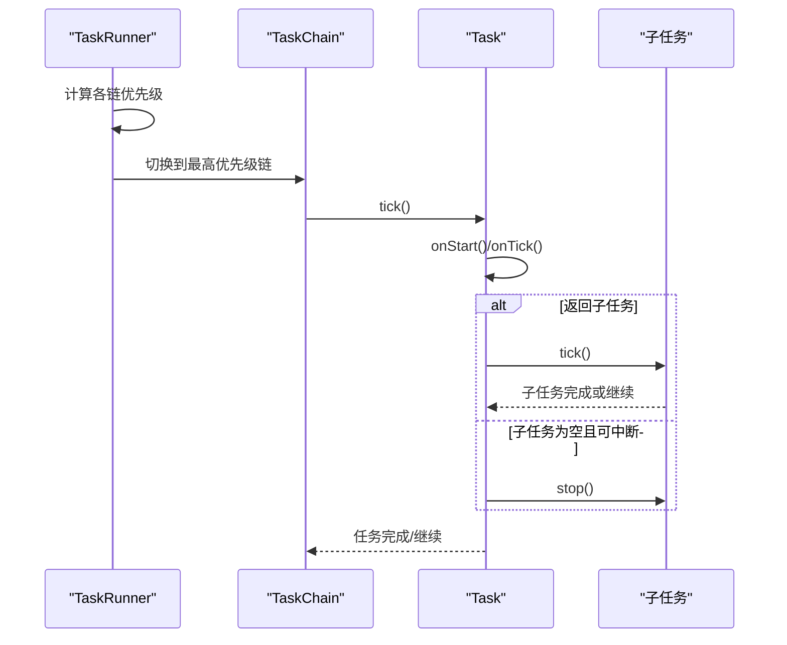
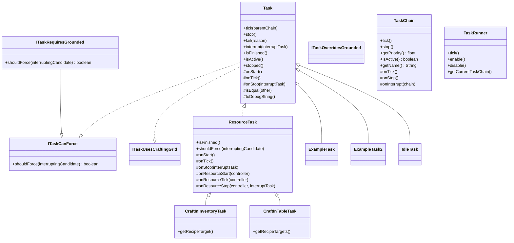
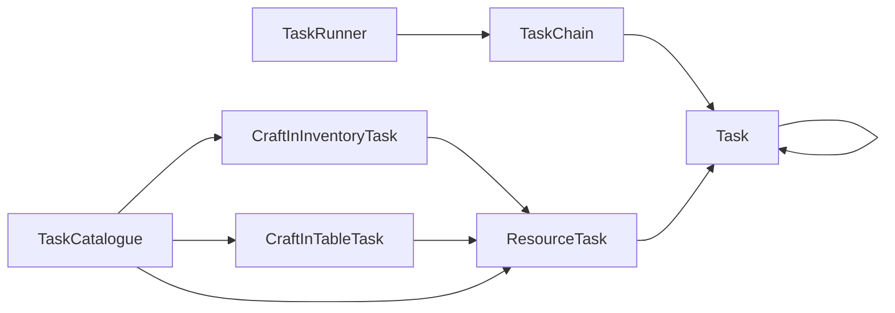

# 自定义任务开发

<cite>
**本文引用的文件**
- [Task.java](file://src/main/java/adris/altoclef/tasksystem/Task.java)
- [ITaskCanForce.java](file://src/main/java/adris/altoclef/tasksystem/ITaskCanForce.java)
- [ITaskRequiresGrounded.java](file://src/main/java/adris/altoclef/tasksystem/ITaskRequiresGrounded.java)
- [ITaskOverridesGrounded.java](file://src/main/java/adris/altoclef/tasksystem/ITaskOverridesGrounded.java)
- [ITaskUsesCraftingGrid.java](file://src/main/java/adris/altoclef/tasksystem/ITaskUsesCraftingGrid.java)
- [TaskChain.java](file://src/main/java/adris/altoclef/tasksystem/TaskChain.java)
- [TaskRunner.java](file://src/main/java/adris/altoclef/tasksystem/TaskRunner.java)
- [ExampleTask.java](file://src/main/java/adris/altoclef/tasks/examples/ExampleTask.java)
- [ExampleTask2.java](file://src/main/java/adris/altoclef/tasks/examples/ExampleTask2.java)
- [ResourceTask.java](file://src/main/java/adris/altoclef/tasks/ResourceTask.java)
- [CraftInInventoryTask.java](file://src/main/java/adris/altoclef/tasks/CraftInInventoryTask.java)
- [CraftInTableTask.java](file://src/main/java/adris/altoclef/tasks/container/CraftInTableTask.java)
- [IdleTask.java](file://src/main/java/adris/altoclef/tasks/movement/IdleTask.java)
- [TaskCatalogue.java](file://src/main/java/adris/altoclef/TaskCatalogue.java)
</cite>

## 目录
1. [简介](#简介)
2. [项目结构](#项目结构)
3. [核心组件](#核心组件)
4. [架构总览](#架构总览)
5. [详细组件分析](#详细组件分析)
6. [依赖分析](#依赖分析)
7. [性能考虑](#性能考虑)
8. [故障排查指南](#故障排查指南)
9. [结论](#结论)
10. [附录：开发示例与最佳实践清单](#附录开发示例与最佳实践清单)

## 简介
本指南面向希望在 Minecraft AI 玩家项目中开发“自定义任务”的开发者，系统讲解如何实现任务类、遵循任务生命周期、正确使用特殊接口（如 ITaskRequiresGrounded、ITaskUsesCraftingGrid 等）、完成参数校验与状态管理，并提供测试、调试与性能优化建议。文档以仓库中的任务系统为核心，结合多个示例任务与资源任务实现，帮助你从零开始构建从简单到复杂的任务。

## 项目结构
任务系统位于 tasksystem 包中，围绕 Task 抽象类展开，配合 TaskChain 与 TaskRunner 实现任务链调度与优先级切换；tasks 包内提供了大量具体任务实现，如资源收集、合成、移动等，可作为自定义任务的参考模板。

图表来源
- [Task.java:1-181](file://src/main/java/adris/altoclef/tasksystem/Task.java#L1-L181)
- [ITaskCanForce.java:1-6](file://src/main/java/adris/altoclef/tasksystem/ITaskCanForce.java#L1-L6)
- [ITaskRequiresGrounded.java:1-16](file://src/main/java/adris/altoclef/tasksystem/ITaskRequiresGrounded.java#L1-L16)
- [ITaskOverridesGrounded.java:1-5](file://src/main/java/adris/altoclef/tasksystem/ITaskOverridesGrounded.java#L1-L5)
- [ITaskUsesCraftingGrid.java:1-5](file://src/main/java/adris/altoclef/tasksystem/ITaskUsesCraftingGrid.java#L1-L5)
- [TaskChain.java:1-51](file://src/main/java/adris/altoclef/tasksystem/TaskChain.java#L1-L51)
- [TaskRunner.java:1-98](file://src/main/java/adris/altoclef/tasksystem/TaskRunner.java#L1-L98)
- [ExampleTask.java:1-68](file://src/main/java/adris/altoclef/tasks/examples/ExampleTask.java#L1-L68)
- [ExampleTask2.java:1-70](file://src/main/java/adris/altoclef/tasks/examples/ExampleTask2.java#L1-L70)
- [ResourceTask.java:1-242](file://src/main/java/adris/altoclef/tasks/ResourceTask.java#L1-L242)
- [CraftInInventoryTask.java:1-120](file://src/main/java/adris/altoclef/tasks/CraftInInventoryTask.java#L1-L120)
- [CraftInTableTask.java:1-162](file://src/main/java/adris/altoclef/tasks/container/CraftInTableTask.java#L1-L162)
- [IdleTask.java:1-37](file://src/main/java/adris/altoclef/tasks/movement/IdleTask.java#L1-L37)
- [TaskCatalogue.java:1-800](file://src/main/java/adris/altoclef/TaskCatalogue.java#L1-L800)

章节来源
- [Task.java:1-181](file://src/main/java/adris/altoclef/tasksystem/Task.java#L1-L181)
- [TaskChain.java:1-51](file://src/main/java/adris/altoclef/tasksystem/TaskChain.java#L1-L51)
- [TaskRunner.java:1-98](file://src/main/java/adris/altoclef/tasksystem/TaskRunner.java#L1-L98)

## 核心组件
- 任务抽象基类 Task：定义任务生命周期（启动、tick、停止、失败、中断）、子任务嵌套与调试状态、相等性判断与树形调试输出。
- 特殊接口：
  - ITaskCanForce：声明 shouldForce 中断策略，用于控制是否允许更高优先级任务打断当前任务。
  - ITaskRequiresGrounded：在未覆盖时，若角色未贴地/游泳/在水中/攀爬，则阻止打断，确保安全。
  - ITaskOverridesGrounded：显式允许打断，覆盖上述限制。
  - ITaskUsesCraftingGrid：标记任务需要使用工作台（3x3 合成）。
- 任务链 TaskChain：封装一组任务，负责优先级计算、活跃状态与 tick/stop 流程。
- 任务运行器 TaskRunner：统一调度多个任务链，按优先级切换，记录状态报告。

章节来源
- [Task.java:1-181](file://src/main/java/adris/altoclef/tasksystem/Task.java#L1-L181)
- [ITaskCanForce.java:1-6](file://src/main/java/adris/altoclef/tasksystem/ITaskCanForce.java#L1-L6)
- [ITaskRequiresGrounded.java:1-16](file://src/main/java/adris/altoclef/tasksystem/ITaskRequiresGrounded.java#L1-L16)
- [ITaskOverridesGrounded.java:1-5](file://src/main/java/adris/altoclef/tasksystem/ITaskOverridesGrounded.java#L1-L5)
- [ITaskUsesCraftingGrid.java:1-5](file://src/main/java/adris/altoclef/tasksystem/ITaskUsesCraftingGrid.java#L1-L5)
- [TaskChain.java:1-51](file://src/main/java/adris/altoclef/tasksystem/TaskChain.java#L1-L51)
- [TaskRunner.java:1-98](file://src/main/java/adris/altoclef/tasksystem/TaskRunner.java#L1-L98)

## 架构总览
下图展示了任务系统的核心交互：TaskRunner 负责选择最高优先级的 TaskChain，TaskChain 在每帧调用其内部任务序列；每个 Task 内部可返回子任务并进行嵌套执行；特殊接口决定打断策略与行为约束。

图表来源
- [TaskRunner.java:22-58](file://src/main/java/adris/altoclef/tasksystem/TaskRunner.java#L22-L58)
- [TaskChain.java:16-24](file://src/main/java/adris/altoclef/tasksystem/TaskChain.java#L16-L24)
- [Task.java:17-50](file://src/main/java/adris/altoclef/tasksystem/Task.java#L17-L50)

## 详细组件分析

### Task 生命周期与实现要点
- 生命周期钩子
  - onStart：首次进入时执行，通常压入行为栈、保护物品、初始化状态。
  - onTick：每帧执行，返回子任务或 null；根据条件更新调试状态 setDebugState。
  - onStop：被中断或停止时清理，通常弹出行为栈、释放资源。
  - isFinished：判定任务是否完成。
  - isEqual：用于去重与树形比较，避免重复执行相同任务。
  - toDebugString：调试字符串，TaskRunner 会输出任务树。
- 子任务管理
  - 支持嵌套子任务，自动接管/停止子任务；支持 canBeInterrupted 控制打断策略。
- 错误处理
  - fail(reason)：主动失败并记录日志。
- 调试与可观测性
  - setDebugState：设置当前阶段描述；toString 输出带调试状态的任务信息。
  - getTaskTree：打印主任务与其子任务树，便于排障。

章节来源
- [Task.java:17-181](file://src/main/java/adris/altoclef/tasksystem/Task.java#L17-L181)

### 特殊接口设计与使用场景
- ITaskCanForce.shouldForce
  - 用于决定当前任务是否允许被更高优先级任务打断；ResourceTask 示例展示了基于库存目标达成与否的策略。
- ITaskRequiresGrounded
  - 若未实现 ITaskOverridesGrounded，则在角色未贴地/游泳/在水中/攀爬时阻止打断，保证动作安全性。
- ITaskOverridesGrounded
  - 显式允许打断，常用于飞行/传送/瞬移等高风险但可控的任务。
- ITaskUsesCraftingGrid
  - 标记任务需要使用工作台（3x3 合成），与 CraftInTableTask 等实现配合。

章节来源
- [ITaskCanForce.java:1-6](file://src/main/java/adris/altoclef/tasksystem/ITaskCanForce.java#L1-L6)
- [ITaskRequiresGrounded.java:1-16](file://src/main/java/adris/altoclef/tasksystem/ITaskRequiresGrounded.java#L1-L16)
- [ITaskOverridesGrounded.java:1-5](file://src/main/java/adris/altoclef/tasksystem/ITaskOverridesGrounded.java#L1-L5)
- [ITaskUsesCraftingGrid.java:1-5](file://src/main/java/adris/altoclef/tasksystem/ITaskUsesCraftingGrid.java#L1-L5)
- [ResourceTask.java:56-63](file://src/main/java/adris/altoclef/tasks/ResourceTask.java#L56-L63)

### 示例任务：从简单到复杂
- ExampleTask（简单）
  - 功能：收集指定数量的石镐与放置圆石。
  - 关键点：在 onStart 压入行为栈并保护圆石；onTick 按顺序检查库存、拾取、移动到目标位置、放置方块；isFinished 组合多个条件；isEqual 对比构造参数。
- ExampleTask2（中等）
  - 功能：寻找并站到一棵树顶附近的安全位置。
  - 关键点：通过 BlockScanner 查找原木，TimeoutWanderTask 随机探索，到达后 isFinished 判断当前位置是否为目标。
- IdleTask（极简）
  - 功能：空闲任务，每帧回调 Playground 的测试函数，永不完成。
- ResourceTask 及其子类
  - ResourceTask 是资源收集的抽象基类，实现了“优先拾取掉落物、再从容器取、再挖矿、最后旅行到正确维度”的通用流程，并提供 shouldForce、mineIfPresent、forceDimension 等能力。
  - CraftInInventoryTask：在背包中进行 2x2 合成，检测材料与目标数量，循环执行直到满足目标。
  - CraftInTableTask：在工作台上进行 3x3 合成，自动寻路到工作台或放置/获取工作台，循环执行直到满足目标。

章节来源
- [ExampleTask.java:1-68](file://src/main/java/adris/altoclef/tasks/examples/ExampleTask.java#L1-L68)
- [ExampleTask2.java:1-70](file://src/main/java/adris/altoclef/tasks/examples/ExampleTask2.java#L1-L70)
- [IdleTask.java:1-37](file://src/main/java/adris/altoclef/tasks/movement/IdleTask.java#L1-L37)
- [ResourceTask.java:1-242](file://src/main/java/adris/altoclef/tasks/ResourceTask.java#L1-L242)
- [CraftInInventoryTask.java:1-120](file://src/main/java/adris/altoclef/tasks/CraftInInventoryTask.java#L1-L120)
- [CraftInTableTask.java:1-162](file://src/main/java/adris/altoclef/tasks/container/CraftInTableTask.java#L1-L162)

### 类关系图（代码级）

图表来源
- [Task.java:1-181](file://src/main/java/adris/altoclef/tasksystem/Task.java#L1-L181)
- [ITaskCanForce.java:1-6](file://src/main/java/adris/altoclef/tasksystem/ITaskCanForce.java#L1-L6)
- [ITaskRequiresGrounded.java:1-16](file://src/main/java/adris/altoclef/tasksystem/ITaskRequiresGrounded.java#L1-L16)
- [ITaskOverridesGrounded.java:1-5](file://src/main/java/adris/altoclef/tasksystem/ITaskOverridesGrounded.java#L1-L5)
- [ITaskUsesCraftingGrid.java:1-5](file://src/main/java/adris/altoclef/tasksystem/ITaskUsesCraftingGrid.java#L1-L5)
- [TaskChain.java:1-51](file://src/main/java/adris/altoclef/tasksystem/TaskChain.java#L1-L51)
- [TaskRunner.java:1-98](file://src/main/java/adris/altoclef/tasksystem/TaskRunner.java#L1-L98)
- [ResourceTask.java:1-242](file://src/main/java/adris/altoclef/tasks/ResourceTask.java#L1-L242)
- [CraftInInventoryTask.java:1-120](file://src/main/java/adris/altoclef/tasks/CraftInInventoryTask.java#L1-L120)
- [CraftInTableTask.java:1-162](file://src/main/java/adris/altoclef/tasks/container/CraftInTableTask.java#L1-L162)
- [ExampleTask.java:1-68](file://src/main/java/adris/altoclef/tasks/examples/ExampleTask.java#L1-L68)
- [ExampleTask2.java:1-70](file://src/main/java/adris/altoclef/tasks/examples/ExampleTask2.java#L1-L70)
- [IdleTask.java:1-37](file://src/main/java/adris/altoclef/tasks/movement/IdleTask.java#L1-L37)

## 依赖分析
- TaskRunner 依赖 TaskChain 列表，按优先级选择当前链并驱动其 tick。
- TaskChain 依赖 Task，维护任务缓存列表并在 tick 时清空并重新填充。
- Task 依赖控制器 controller（AltoClefController）与子任务 Sub，支持打断与强制策略。
- ResourceTask 依赖存储、行为、扫描器、容器缓存等模块，形成资源收集闭环。
- TaskCatalogue 提供资源/配方/熔炼/升级等任务的工厂方法，简化外部调用。

图表来源
- [TaskRunner.java:1-98](file://src/main/java/adris/altoclef/tasksystem/TaskRunner.java#L1-L98)
- [TaskChain.java:1-51](file://src/main/java/adris/altoclef/tasksystem/TaskChain.java#L1-L51)
- [Task.java:1-181](file://src/main/java/adris/altoclef/tasksystem/Task.java#L1-L181)
- [ResourceTask.java:1-242](file://src/main/java/adris/altoclef/tasks/ResourceTask.java#L1-L242)
- [CraftInInventoryTask.java:1-120](file://src/main/java/adris/altoclef/tasks/CraftInInventoryTask.java#L1-L120)
- [CraftInTableTask.java:1-162](file://src/main/java/adris/altoclef/tasks/container/CraftInTableTask.java#L1-L162)
- [TaskCatalogue.java:1-800](file://src/main/java/adris/altoclef/TaskCatalogue.java#L1-L800)

章节来源
- [TaskRunner.java:22-58](file://src/main/java/adris/altoclef/tasksystem/TaskRunner.java#L22-L58)
- [TaskChain.java:16-24](file://src/main/java/adris/altoclef/tasksystem/TaskChain.java#L16-L24)
- [TaskCatalogue.java:150-176](file://src/main/java/adris/altoclef/TaskCatalogue.java#L150-L176)

## 性能考虑
- 优先级与链切换
  - TaskRunner 仅在链优先级变化时触发 onInterrupt，减少不必要的状态切换开销。
- 任务树与子任务
  - 使用 Task.thisOrChildSatisfies 快速判断是否包含超时/特定类型任务，避免深层遍历。
- 资源收集路径
  - ResourceTask 先尝试拾取掉落物，再容器取货，最后挖矿，减少无效寻路与破坏。
- 合成效率
  - CraftInInventoryTask/CraftInTableTask 使用计时器节流，避免频繁交互；批量计算所需合成次数，一次性完成多轮合成。
- 调试日志
  - setDebugState 仅在状态变更时输出日志，降低 IO 压力。

[本节为通用性能建议，不直接分析具体文件，故无章节来源]

## 故障排查指南
- 任务无法完成
  - 检查 isFinished 条件是否与目标一致；确认 ResourceTask 的 itemTargets 是否已满足。
  - 使用 getTaskTree 打印任务树，定位卡住的子任务。
- 任务被打断异常
  - 若任务实现 ITaskRequiresGrounded 且角色处于非贴地状态，可能被阻止打断；必要时实现 ITaskOverridesGrounded 或先落地。
  - 使用 TaskRunner.statusReport 观察当前链与优先级。
- 合成失败
  - CraftInInventoryTask/CraftInTableTask 在材料不足时会记录警告并回退；检查 TaskCatalogue 中对应配方是否存在。
- 调试技巧
  - 在 onStart/onTick 中调用 setDebugState 描述当前阶段；在 onStop 清理行为栈。
  - 使用 fail(reason) 主动失败并记录原因，便于定位。

章节来源
- [Task.java:166-181](file://src/main/java/adris/altoclef/tasksystem/Task.java#L166-L181)
- [TaskRunner.java:42-56](file://src/main/java/adris/altoclef/tasksystem/TaskRunner.java#L42-L56)
- [CraftInInventoryTask.java:78-82](file://src/main/java/adris/altoclef/tasks/CraftInInventoryTask.java#L78-L82)
- [CraftInTableTask.java:117-119](file://src/main/java/adris/altoclef/tasks/container/CraftInTableTask.java#L117-L119)

## 结论
通过遵循 Task 抽象类的生命周期与接口约定，结合 TaskChain/TaskRunner 的调度机制，你可以快速构建从简单到复杂的自定义任务。利用 ResourceTask 的通用流程与 TaskCatalogue 的工厂方法，可以大幅降低重复开发成本。在实现过程中重视参数校验、状态管理、错误处理与调试输出，将显著提升任务的稳定性与可维护性。

[本节为总结性内容，不直接分析具体文件，故无章节来源]

## 附录：开发示例与最佳实践清单

### 开发步骤（从零到一）
- 定义任务类
  - 继承 Task 或更合适的基类（如 ResourceTask）。
  - 实现 onStart/onTick/onStop/isFinished/isEqual/toDebugString。
- 参数与前置条件
  - 在构造函数中接收必要参数；在 onStart 中保护关键物品、压入行为栈。
- 逻辑分层
  - 将复杂逻辑拆分为多个子任务，返回子任务而非一次性完成。
- 中断与优先级
  - 如需打断控制，实现 ITaskCanForce/ITaskRequiresGrounded/ITaskOverridesGrounded。
- 资源与合成
  - 使用 TaskCatalogue 获取标准资源任务；需要工作台时实现 ITaskUsesCraftingGrid 并使用 CraftInTableTask。
- 测试与调试
  - 使用 setDebugState 输出阶段信息；在关键分支 fail(reason) 记录失败原因；打印 getTaskTree 定位问题。
- 性能优化
  - 减少无效寻路与破坏；批量合成；避免高频 IO 日志。

### 最佳实践清单
- 生命周期
  - 每次进入任务时压入行为栈，退出时弹出；确保资源释放与状态复位。
- 相等性判断
  - isEqual 应严格对比构造参数，避免重复执行相同任务。
- 子任务管理
  - 子任务完成即置空；返回新子任务时先检查 canBeInterrupted。
- 安全性
  - 需要贴地的动作应实现 ITaskRequiresGrounded，必要时提供 ITaskOverridesGrounded。
- 可观测性
  - 在关键节点设置调试状态；保持 toDebugString 简洁明确。
- 工具化
  - 优先使用 TaskCatalogue 的工厂方法；资源收集尽量走 ResourceTask 流程。

### 参考实现路径
- 简单任务模板：[ExampleTask.java:1-68](file://src/main/java/adris/altoclef/tasks/examples/ExampleTask.java#L1-L68)
- 中等复杂度任务模板：[ExampleTask2.java:1-70](file://src/main/java/adris/altoclef/tasks/examples/ExampleTask2.java#L1-L70)
- 资源收集基类：[ResourceTask.java:1-242](file://src/main/java/adris/altoclef/tasks/ResourceTask.java#L1-L242)
- 背包合成任务：[CraftInInventoryTask.java:1-120](file://src/main/java/adris/altoclef/tasks/CraftInInventoryTask.java#L1-L120)
- 工作台合成任务：[CraftInTableTask.java:1-162](file://src/main/java/adris/altoclef/tasks/container/CraftInTableTask.java#L1-L162)
- 空闲占位任务：[IdleTask.java:1-37](file://src/main/java/adris/altoclef/tasks/movement/IdleTask.java#L1-L37)
- 任务工厂与目录：[TaskCatalogue.java:1-800](file://src/main/java/adris/altoclef/TaskCatalogue.java#L1-L800)