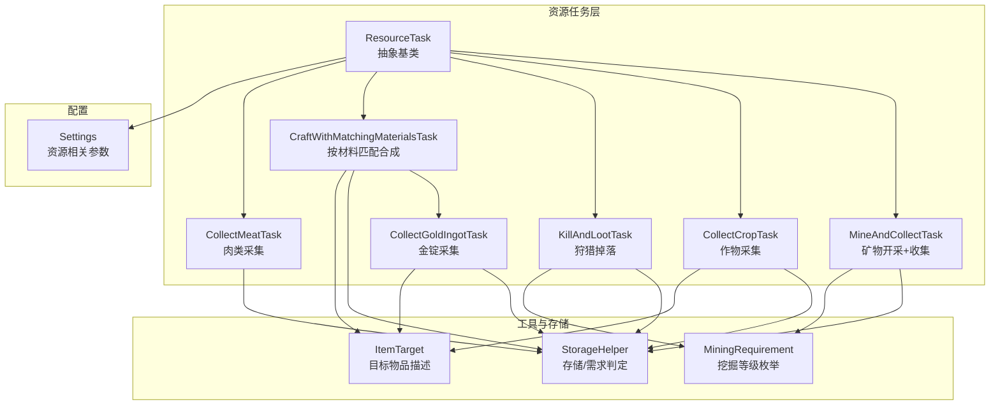
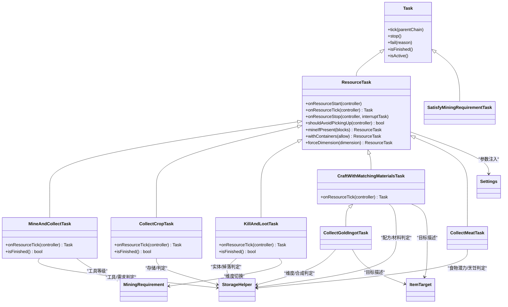
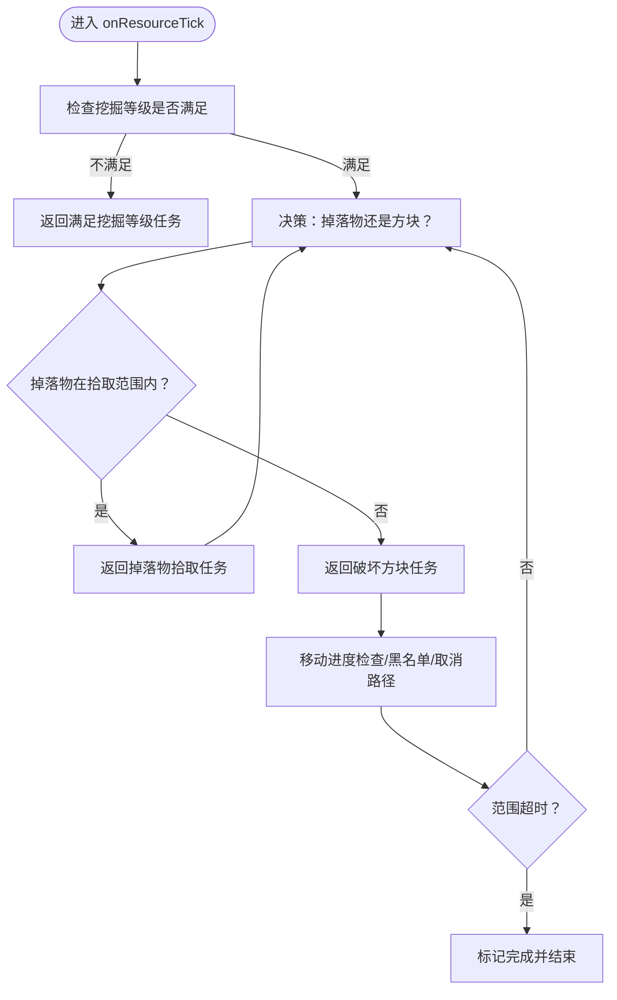
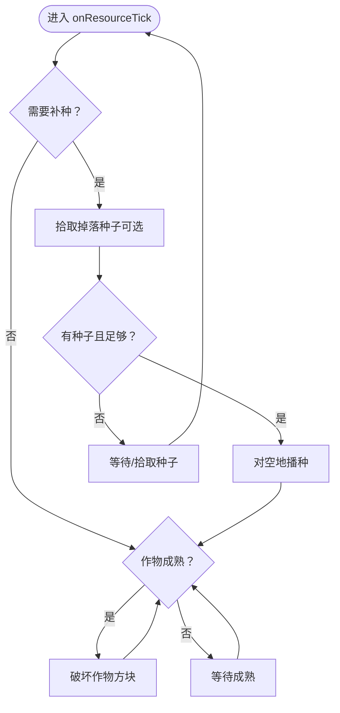
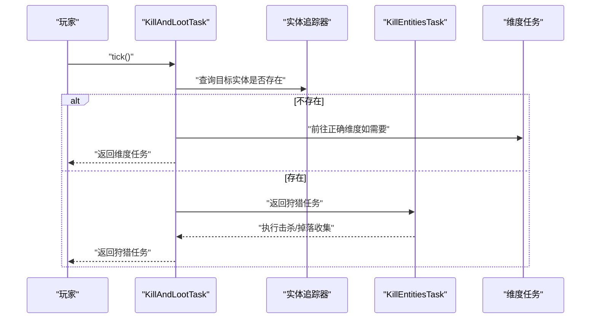
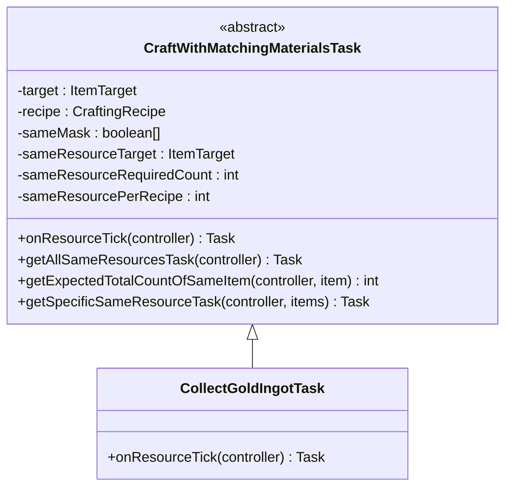
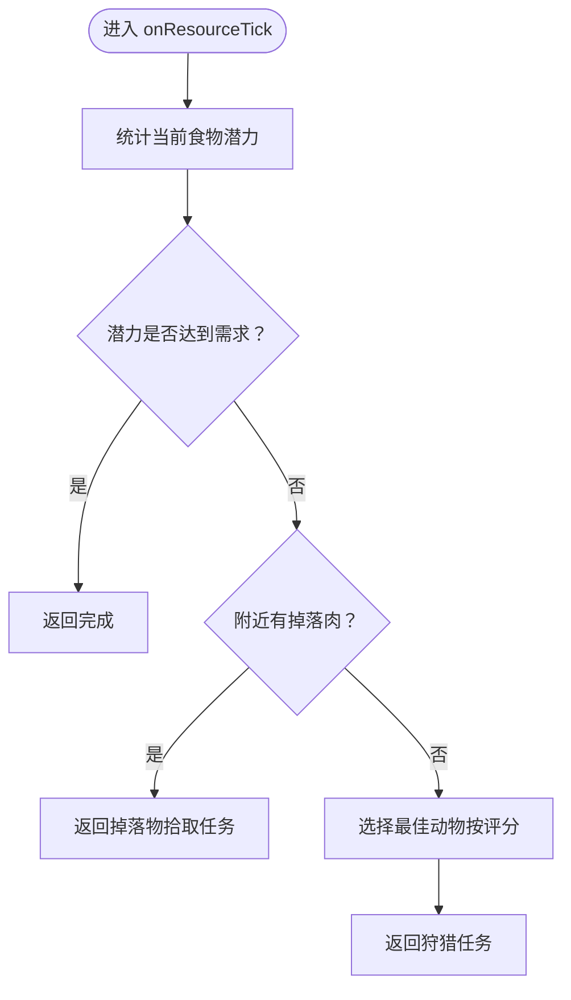
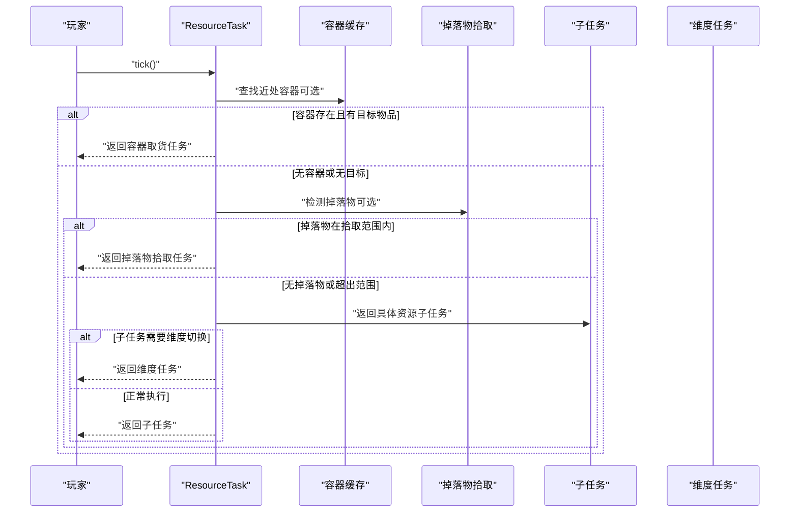
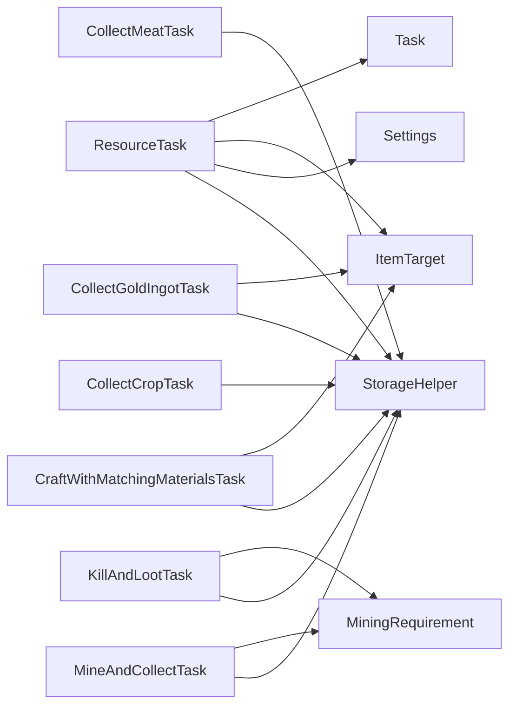

# 资源采集任务

<cite>
**本文引用的文件**
- [ResourceTask.java](file://src/main/java/adris/altoclef/tasks/ResourceTask.java)
- [MineAndCollectTask.java](file://src/main/java/adris/altoclef/tasks/resources/MineAndCollectTask.java)
- [CollectCropTask.java](file://src/main/java/adris/altoclef/tasks/resources/CollectCropTask.java)
- [KillAndLootTask.java](file://src/main/java/adris/altoclef/tasks/resources/KillAndLootTask.java)
- [CraftWithMatchingMaterialsTask.java](file://src/main/java/adris/altoclef/tasks/resources/CraftWithMatchingMaterialsTask.java)
- [CollectGoldIngotTask.java](file://src/main/java/adris/altoclef/tasks/resources/CollectGoldIngotTask.java)
- [CollectMeatTask.java](file://src/main/java/adris/altoclef/tasks/resources/CollectMeatTask.java)
- [SatisfyMiningRequirementTask.java](file://src/main/java/adris/altoclef/tasks/resources/SatisfyMiningRequirementTask.java)
- [StorageHelper.java](file://src/main/java/adris/altoclef/util/helpers/StorageHelper.java)
- [Settings.java](file://src/main/java/adris/altoclef/Settings.java)
- [ItemTarget.java](file://src/main/java/adris/altoclef/util/ItemTarget.java)
- [MiningRequirement.java](file://src/main/java/adris/altoclef/util/MiningRequirement.java)
- [Task.java](file://src/main/java/adris/altoclef/tasksystem/Task.java)
</cite>

## 目录
1. [简介](#简介)
2. [项目结构](#项目结构)
3. [核心组件](#核心组件)
4. [架构总览](#架构总览)
5. [详细组件分析](#详细组件分析)
6. [依赖分析](#依赖分析)
7. [性能考量](#性能考量)
8. [故障排查指南](#故障排查指南)
9. [结论](#结论)
10. [附录](#附录)

## 简介
本技术文档围绕“资源采集任务系统”展开，系统覆盖矿物开采、植物采集、动物狩猎、物品合成等核心功能。文档深入解析资源识别算法、最优路径计算、工具选择策略、优先级判断与批量采集机制、存储管理策略，并提供配置示例与性能优化建议，帮助开发者与使用者高效构建与调优资源采集流程。

## 项目结构
资源采集任务位于模块的 tasks/resources 子包中，采用面向任务的分层设计：
- 抽象基类 ResourceTask：统一资源任务的生命周期、容器优先策略、掉落物拾取、维度切换与子任务调度。
- 具体任务：
  - 矿物开采：MineAndCollectTask（含内部子任务 MineOrCollectTask）
  - 植物采集：CollectCropTask
  - 动物狩猎：KillAndLootTask
  - 合成任务：CraftWithMatchingMaterialsTask 及其派生（如 CollectGoldIngotTask）
  - 食物/肉类：CollectMeatTask（结合烹饪与狩猎）
- 工具与存储辅助：StorageHelper、MiningRequirement、ItemTarget
- 配置入口：Settings（资源拾取范围、容器查找范围、矿石挖掘范围等）

图表来源
- [ResourceTask.java:31-242](file://src/main/java/adris/altoclef/tasks/ResourceTask.java#L31-L242)
- [MineAndCollectTask.java:39-361](file://src/main/java/adris/altoclef/tasks/resources/MineAndCollectTask.java#L39-L361)
- [CollectCropTask.java:28-178](file://src/main/java/adris/altoclef/tasks/resources/CollectCropTask.java#L28-L178)
- [KillAndLootTask.java:16-103](file://src/main/java/adris/altoclef/tasks/resources/KillAndLootTask.java#L16-L103)
- [CraftWithMatchingMaterialsTask.java:15-127](file://src/main/java/adris/altoclef/tasks/resources/CraftWithMatchingMaterialsTask.java#L15-L127)
- [CollectGoldIngotTask.java:20-72](file://src/main/java/adris/altoclef/tasks/resources/CollectGoldIngotTask.java#L20-L72)
- [CollectMeatTask.java:30-220](file://src/main/java/adris/altoclef/tasks/resources/CollectMeatTask.java#L30-L220)
- [StorageHelper.java:32-313](file://src/main/java/adris/altoclef/util/helpers/StorageHelper.java#L32-L313)
- [MiningRequirement.java:8-45](file://src/main/java/adris/altoclef/util/MiningRequirement.java#L8-L45)
- [ItemTarget.java:10-185](file://src/main/java/adris/altoclef/util/ItemTarget.java#L10-L185)
- [Settings.java:32-200](file://src/main/java/adris/altoclef/Settings.java#L32-L200)

章节来源
- [ResourceTask.java:31-242](file://src/main/java/adris/altoclef/tasks/ResourceTask.java#L31-L242)
- [Settings.java:32-200](file://src/main/java/adris/altoclef/Settings.java#L32-L200)

## 核心组件
- ResourceTask 抽象基类
  - 统一完成条件：基于 ItemTarget 列表的目标达成判定。
  - 容器优先策略：优先从近处容器取货，避免重复寻路。
  - 掉落物拾取：自动检测并拾取指定目标物品，支持“先拾斧头再采矿”的前置策略。
  - 维度切换：当目标资源位于错误维度时，自动前往正确维度。
  - 子任务调度：将具体资源行为委托给 onResourceTick 实现。
- MineAndCollectTask
  - 内部子任务 MineOrCollectTask：在“可到达范围”内优先寻找最近的掉落物或可破坏方块，支持活动半径限制与超时退出。
  - 工具选择：根据当前挖掘目标自动评估并装备更高等级的工具。
  - 超时控制：连续无目标时触发范围超时，避免无限漂移。
- CollectCropTask
  - 成熟作物判定：通过区块加载与可达性检查，维护成熟作物集合。
  - 自动补种：当允许重种且种子充足时，自动对空地进行播种。
- KillAndLootTask
  - 实体搜索：在世界中搜索目标实体类型，支持维度切换。
  - 超时退出：无实体存在时触发超时，避免无效漫游。
- CraftWithMatchingMaterialsTask
  - 材料匹配：统计同质材料数量，选择最大产出组合，优先使用大配方（工作台）或小配方（背包）。
  - 递归获取：若材料不足，委派到通用资源任务以补齐所需材料。
- CollectGoldIngotTask
  - 维度适配：根据所在维度选择熔炼或挖取金粒合成金锭。
- CollectMeatTask
  - 多目标整合：同时考虑生肉与熟肉的潜在价值，优先烹饪后结算。
  - 最佳目标选择：按“食物单位/距离平方”评分，选择最优动物。
- StorageHelper
  - 目标达成判定：批量检查 ItemTarget 是否满足。
  - 挖掘等级判定：判断当前是否满足最低工具等级要求。
  - 垃圾槽位选择：综合丢弃策略与堆叠上限，选择最优丢弃槽位。
- Settings
  - 资源拾取范围、容器查找范围、矿石挖掘范围等参数化配置。
- ItemTarget 与 MiningRequirement
  - ItemTarget：目标物品集合与数量描述，支持目录名映射与无限目标。
  - MiningRequirement：工具等级枚举及最小需求推断。

章节来源
- [ResourceTask.java:31-242](file://src/main/java/adris/altoclef/tasks/ResourceTask.java#L31-L242)
- [MineAndCollectTask.java:39-361](file://src/main/java/adris/altoclef/tasks/resources/MineAndCollectTask.java#L39-L361)
- [CollectCropTask.java:28-178](file://src/main/java/adris/altoclef/tasks/resources/CollectCropTask.java#L28-L178)
- [KillAndLootTask.java:16-103](file://src/main/java/adris/altoclef/tasks/resources/KillAndLootTask.java#L16-L103)
- [CraftWithMatchingMaterialsTask.java:15-127](file://src/main/java/adris/altoclef/tasks/resources/CraftWithMatchingMaterialsTask.java#L15-L127)
- [CollectGoldIngotTask.java:20-72](file://src/main/java/adris/altoclef/tasks/resources/CollectGoldIngotTask.java#L20-L72)
- [CollectMeatTask.java:30-220](file://src/main/java/adris/altoclef/tasks/resources/CollectMeatTask.java#L30-L220)
- [StorageHelper.java:32-313](file://src/main/java/adris/altoclef/util/helpers/StorageHelper.java#L32-L313)
- [Settings.java:32-200](file://src/main/java/adris/altoclef/Settings.java#L32-L200)
- [ItemTarget.java:10-185](file://src/main/java/adris/altoclef/util/ItemTarget.java#L10-L185)
- [MiningRequirement.java:8-45](file://src/main/java/adris/altoclef/util/MiningRequirement.java#L8-L45)

## 架构总览
资源采集系统采用“抽象任务 + 具体任务 + 辅助工具 + 配置参数”的分层架构。ResourceTask 提供统一的生命周期与通用策略；具体任务聚焦特定资源类型；StorageHelper 与 MiningRequirement 提供底层判定能力；Settings 将运行期参数注入任务行为。

图表来源
- [Task.java:8-181](file://src/main/java/adris/altoclef/tasksystem/Task.java#L8-L181)
- [ResourceTask.java:31-242](file://src/main/java/adris/altoclef/tasks/ResourceTask.java#L31-L242)
- [MineAndCollectTask.java:39-361](file://src/main/java/adris/altoclef/tasks/resources/MineAndCollectTask.java#L39-L361)
- [CollectCropTask.java:28-178](file://src/main/java/adris/altoclef/tasks/resources/CollectCropTask.java#L28-L178)
- [KillAndLootTask.java:16-103](file://src/main/java/adris/altoclef/tasks/resources/KillAndLootTask.java#L16-L103)
- [CraftWithMatchingMaterialsTask.java:15-127](file://src/main/java/adris/altoclef/tasks/resources/CraftWithMatchingMaterialsTask.java#L15-L127)
- [CollectGoldIngotTask.java:20-72](file://src/main/java/adris/altoclef/tasks/resources/CollectGoldIngotTask.java#L20-L72)
- [CollectMeatTask.java:30-220](file://src/main/java/adris/altoclef/tasks/resources/CollectMeatTask.java#L30-L220)
- [SatisfyMiningRequirementTask.java:9-56](file://src/main/java/adris/altoclef/tasks/resources/SatisfyMiningRequirementTask.java#L9-L56)
- [StorageHelper.java:32-313](file://src/main/java/adris/altoclef/util/helpers/StorageHelper.java#L32-L313)
- [MiningRequirement.java:8-45](file://src/main/java/adris/altoclef/util/MiningRequirement.java#L8-L45)
- [ItemTarget.java:10-185](file://src/main/java/adris/altoclef/util/ItemTarget.java#L10-L185)
- [Settings.java:32-200](file://src/main/java/adris/altoclef/Settings.java#L32-L200)

## 详细组件分析

### 矿物开采与收集（MineAndCollectTask）
- 关键点
  - 活动半径限制：仅在以玩家为中心半径约 50 格范围内选择目标，避免过度漂移。
  - 掉落物优先：若掉落物在拾取范围内，优先拾取。
  - 工具选择：周期性检查当前光标工具是否为最佳，必要时强制装备更高等级工具。
  - 超时退出：持续无目标超过 15 秒，记录日志并提示，任务视为完成以释放控制权。
  - 维度切换：若处于错误维度且无法发现目标，自动前往正确维度。
- 流程图

图表来源
- [MineAndCollectTask.java:93-105](file://src/main/java/adris/altoclef/tasks/resources/MineAndCollectTask.java#L93-L105)
- [MineAndCollectTask.java:247-281](file://src/main/java/adris/altoclef/tasks/resources/MineAndCollectTask.java#L247-L281)
- [MineAndCollectTask.java:157-361](file://src/main/java/adris/altoclef/tasks/resources/MineAndCollectTask.java#L157-L361)

章节来源
- [MineAndCollectTask.java:39-361](file://src/main/java/adris/altoclef/tasks/resources/MineAndCollectTask.java#L39-L361)
- [SatisfyMiningRequirementTask.java:9-56](file://src/main/java/adris/altoclef/tasks/resources/SatisfyMiningRequirementTask.java#L9-L56)
- [StorageHelper.java:114-120](file://src/main/java/adris/altoclef/util/helpers/StorageHelper.java#L114-L120)

### 植物采集（CollectCropTask）
- 关键点
  - 成熟判定：通过区块加载状态与可达性检查，维护“已完全成熟”的坐标集合，避免重复收割。
  - 补种逻辑：当允许重种且种子充足时，对空地进行播种。
  - 维度切换：若当前维度无目标作物，尝试前往正确维度。
- 流程图

图表来源
- [CollectCropTask.java:68-113](file://src/main/java/adris/altoclef/tasks/resources/CollectCropTask.java#L68-L113)
- [CollectCropTask.java:156-177](file://src/main/java/adris/altoclef/tasks/resources/CollectCropTask.java#L156-L177)

章节来源
- [CollectCropTask.java:28-178](file://src/main/java/adris/altoclef/tasks/resources/CollectCropTask.java#L28-L178)

### 动物狩猎（KillAndLootTask）
- 关键点
  - 实体搜索：在世界中搜索目标实体类型，若无实体则超时漫游。
  - 维度切换：若处于错误维度且无目标，自动前往正确维度。
  - 超时退出：无实体存在超过 15 秒，任务视为完成。
- 序列图

图表来源
- [KillAndLootTask.java:51-75](file://src/main/java/adris/altoclef/tasks/resources/KillAndLootTask.java#L51-L75)
- [KillAndLootTask.java:16-103](file://src/main/java/adris/altoclef/tasks/resources/KillAndLootTask.java#L16-L103)

章节来源
- [KillAndLootTask.java:16-103](file://src/main/java/adris/altoclef/tasks/resources/KillAndLootTask.java#L16-L103)

### 合成任务（CraftWithMatchingMaterialsTask）
- 关键点
  - 材料匹配：遍历同质材料集合，统计可合成总数，选择“多数材料”作为主材料。
  - 大/小配方：若配方为大型（工作台），优先使用工作台；否则使用背包合成。
  - 递归获取：若材料不足，委派到通用资源任务以补齐所需材料。
- 类图

图表来源
- [CraftWithMatchingMaterialsTask.java:15-127](file://src/main/java/adris/altoclef/tasks/resources/CraftWithMatchingMaterialsTask.java#L15-L127)
- [CollectGoldIngotTask.java:20-72](file://src/main/java/adris/altoclef/tasks/resources/CollectGoldIngotTask.java#L20-L72)

章节来源
- [CraftWithMatchingMaterialsTask.java:15-127](file://src/main/java/adris/altoclef/tasks/resources/CraftWithMatchingMaterialsTask.java#L15-L127)
- [CollectGoldIngotTask.java:20-72](file://src/main/java/adris/altoclef/tasks/resources/CollectGoldIngotTask.java#L20-L72)

### 肉类采集（CollectMeatTask）
- 关键点
  - 多目标整合：同时考虑生肉与熟肉的“食物单位”，按“食物单位/距离平方”评分选择最佳动物。
  - 烹饪优先：若已有足够生肉，优先返回熔炉任务进行烹饪。
  - 掉落物拾取：若附近有掉落肉，优先拾取。
- 流程图

图表来源
- [CollectMeatTask.java:68-120](file://src/main/java/adris/altoclef/tasks/resources/CollectMeatTask.java#L68-L120)
- [CollectMeatTask.java:166-188](file://src/main/java/adris/altoclef/tasks/resources/CollectMeatTask.java#L166-L188)

章节来源
- [CollectMeatTask.java:30-220](file://src/main/java/adris/altoclef/tasks/resources/CollectMeatTask.java#L30-L220)

### 抽象基类（ResourceTask）与生命周期
- 生命周期
  - onStart：保护重要物品、压栈行为。
  - onTick：容器优先、掉落物拾取、子任务调度、维度切换。
  - onStop：弹出行为、清理状态。
- 优先级与批量
  - 容器优先：在设定范围内优先从容器取货，减少重复寻路。
  - 批量采集：通过 ItemTarget 的目标计数与 StorageHelper 的批量判定，实现批量目标达成。
- 维度切换
  - 当目标资源位于错误维度时，自动返回维度切换任务。

图表来源
- [ResourceTask.java:74-168](file://src/main/java/adris/altoclef/tasks/ResourceTask.java#L74-L168)

章节来源
- [ResourceTask.java:31-242](file://src/main/java/adris/altoclef/tasks/ResourceTask.java#L31-L242)

## 依赖分析
- 组件耦合
  - ResourceTask 与具体任务之间为“委托/继承”关系，耦合度低，职责清晰。
  - 具体任务依赖 StorageHelper 进行存储/需求判定，依赖 Settings 注入参数，依赖 MiningRequirement/ItemTarget 描述目标与工具等级。
- 外部依赖
  - 任务系统基类 Task 提供统一的 tick/中断/调试输出机制。
  - Baritone 路径与行为接口用于寻路与移动（在具体任务中体现）。

图表来源
- [Task.java:8-181](file://src/main/java/adris/altoclef/tasksystem/Task.java#L8-L181)
- [ResourceTask.java:31-242](file://src/main/java/adris/altoclef/tasks/ResourceTask.java#L31-L242)
- [StorageHelper.java:32-313](file://src/main/java/adris/altoclef/util/helpers/StorageHelper.java#L32-L313)
- [MiningRequirement.java:8-45](file://src/main/java/adris/altoclef/util/MiningRequirement.java#L8-L45)
- [ItemTarget.java:10-185](file://src/main/java/adris/altoclef/util/ItemTarget.java#L10-L185)
- [Settings.java:32-200](file://src/main/java/adris/altoclef/Settings.java#L32-L200)

章节来源
- [Task.java:8-181](file://src/main/java/adris/altoclef/tasksystem/Task.java#L8-L181)
- [ResourceTask.java:31-242](file://src/main/java/adris/altoclef/tasks/ResourceTask.java#L31-L242)

## 性能考量
- 范围与超时
  - 设置合理的资源拾取范围、容器查找范围与矿石挖掘范围，避免不必要的寻路开销。
  - 使用范围超时与无实体超时，防止长时间无效搜索。
- 工具选择
  - 定期检查并装备更高等级工具，减少破坏失败与重复尝试。
- 存储与丢弃
  - 利用垃圾槽位选择策略，及时丢弃非必需物品，保持库存空间与燃料效率。
- 合成策略
  - 优先使用“多数材料”与“最大产出”策略，减少多次合成往返。

[本节为通用指导，无需列出章节来源]

## 故障排查指南
- 任务未完成
  - 检查 ItemTarget 是否正确配置，确认 StorageHelper 的批量判定逻辑。
  - 查看 ResourceTask 的完成条件与容器优先策略是否生效。
- 无法找到目标
  - 检查 Settings 中的资源拾取范围、容器查找范围与矿石挖掘范围。
  - 对于 KillAndLootTask，确认实体类型与维度是否正确。
- 工具问题
  - 使用 SatisfyMiningRequirementTask 确认当前工具等级满足需求。
  - 在 MineAndCollectTask 中确认工具选择逻辑是否正常执行。
- 维度错误
  - 确认 ResourceTask 的维度切换逻辑与 forceDimension 配置。
- 合成不足
  - 检查 CraftWithMatchingMaterialsTask 的材料统计与“多数材料”选择逻辑。

章节来源
- [StorageHelper.java:168-175](file://src/main/java/adris/altoclef/util/helpers/StorageHelper.java#L168-L175)
- [SatisfyMiningRequirementTask.java:9-56](file://src/main/java/adris/altoclef/tasks/resources/SatisfyMiningRequirementTask.java#L9-L56)
- [ResourceTask.java:210-214](file://src/main/java/adris/altoclef/tasks/ResourceTask.java#L210-L214)
- [CraftWithMatchingMaterialsTask.java:66-105](file://src/main/java/adris/altoclef/tasks/resources/CraftWithMatchingMaterialsTask.java#L66-L105)

## 结论
资源采集任务系统通过抽象基类与具体任务的分层设计，实现了对矿物、植物、动物与合成资源的统一管理。借助 StorageHelper 的判定能力、MiningRequirement 的工具等级推断、Settings 的参数化配置，系统在保证灵活性的同时具备良好的扩展性与可维护性。通过合理配置范围与超时、优化工具选择与存储策略，可显著提升采集效率与稳定性。

[本节为总结性内容，无需列出章节来源]

## 附录
- 配置项参考（来自 Settings）
  - 资源拾取范围：resourcePickupDropRange
  - 容器查找范围：resourceChestLocateRange
  - 矿石挖掘范围：resourceMineRange
  - 优先容器资源：prioritizeContainerResources
  - 作物重种开关：replantCrops
- 示例路径（用于定位实现）
  - [ResourceTask.java:31-242](file://src/main/java/adris/altoclef/tasks/ResourceTask.java#L31-L242)
  - [MineAndCollectTask.java:39-361](file://src/main/java/adris/altoclef/tasks/resources/MineAndCollectTask.java#L39-L361)
  - [CollectCropTask.java:28-178](file://src/main/java/adris/altoclef/tasks/resources/CollectCropTask.java#L28-L178)
  - [KillAndLootTask.java:16-103](file://src/main/java/adris/altoclef/tasks/resources/KillAndLootTask.java#L16-L103)
  - [CraftWithMatchingMaterialsTask.java:15-127](file://src/main/java/adris/altoclef/tasks/resources/CraftWithMatchingMaterialsTask.java#L15-L127)
  - [CollectGoldIngotTask.java:20-72](file://src/main/java/adris/altoclef/tasks/resources/CollectGoldIngotTask.java#L20-L72)
  - [CollectMeatTask.java:30-220](file://src/main/java/adris/altoclef/tasks/resources/CollectMeatTask.java#L30-L220)
  - [StorageHelper.java:32-313](file://src/main/java/adris/altoclef/util/helpers/StorageHelper.java#L32-L313)
  - [Settings.java:32-200](file://src/main/java/adris/altoclef/Settings.java#L32-L200)
  - [ItemTarget.java:10-185](file://src/main/java/adris/altoclef/util/ItemTarget.java#L10-L185)
  - [MiningRequirement.java:8-45](file://src/main/java/adris/altoclef/util/MiningRequirement.java#L8-L45)
  - [Task.java:8-181](file://src/main/java/adris/altoclef/tasksystem/Task.java#L8-L181)