# 任务执行系统

<cite>
**本文引用的文件**   
- [Task.java](file://src/main/java/adris/altoclef/tasksystem/Task.java)
- [TaskRunner.java](file://src/main/java/adris/altoclef/tasksystem/TaskRunner.java)
- [TaskChain.java](file://src/main/java/adris/altoclef/tasksystem/TaskChain.java)
- [ITaskCanForce.java](file://src/main/java/adris/altoclef/tasksystem/ITaskCanForce.java)
- [ITaskRequiresGrounded.java](file://src/main/java/adris/altoclef/tasksystem/ITaskRequiresGrounded.java)
- [ITaskOverridesGrounded.java](file://src/main/java/adris/altoclef/tasksystem/ITaskOverridesGrounded.java)
- [ITaskUsesCraftingGrid.java](file://src/main/java/adris/altoclef/tasksystem/ITaskUsesCraftingGrid.java)
- [UserTaskChain.java](file://src/main/java/adris/altoclef/chains/UserTaskChain.java)
- [ExampleTask.java](file://src/main/java/adris/altoclef/tasks/examples/ExampleTask.java)
- [GetToBlockTask.java](file://src/main/java/adris/altoclef/tasks/movement/GetToBlockTask.java)
- [CollectBlockByOneTask.java](file://src/main/java/adris/altoclef/tasks/resources/CollectBlockByOneTask.java)
- [PlaceBlockTask.java](file://src/main/java/adris/altoclef/tasks/construction/PlaceBlockTask.java)
- [KillEntityTask.java](file://src/main/java/adris/altoclef/tasks/entity/KillEntityTask.java)
- [README.md](file://README.md)
</cite>

## 目录
1. [简介](#简介)
2. [项目结构](#项目结构)
3. [核心组件](#核心组件)
4. [架构总览](#架构总览)
5. [详细组件分析](#详细组件分析)
6. [依赖关系分析](#依赖关系分析)
7. [性能考量](#性能考量)
8. [故障排查指南](#故障排查指南)
9. [结论](#结论)
10. [附录](#附录)

## 简介
本技术文档围绕任务执行系统展开，系统以 Task 基类为核心，配合 TaskChain 优先级调度与 TaskRunner 调度器，形成可扩展、可组合、可中断的任务执行框架。文档覆盖以下主题：
- Task 基类设计与生命周期管理
- TaskRunner 调度器的优先级选择与中断机制
- TaskChain 优先级调度机制与链式任务组织
- 不同类型任务的实现模式：移动、资源收集、建造、实体交互等
- 任务参数配置、执行状态管理与异常处理
- 任务间依赖关系、并发控制与扩展开发指南
- 性能优化建议与常见问题排查

## 项目结构
任务系统位于模块的 tasksystem 包中，并与 chains、tasks、commands 等模块协同工作。核心文件包括：
- 任务基类与接口：Task、TaskChain、TaskRunner、ITask* 接口族
- 任务链示例：UserTaskChain
- 典型任务示例：ExampleTask、GetToBlockTask、CollectBlockByOneTask、PlaceBlockTask、KillEntityTask
- 系统总体介绍与配置说明：README.md

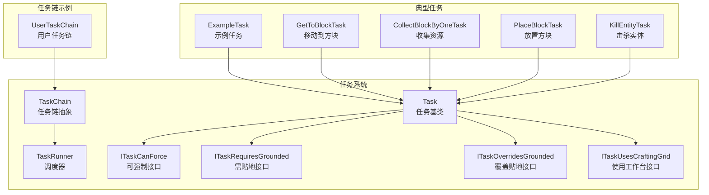

**图表来源**
- [Task.java:1-181](file://src/main/java/adris/altoclef/tasksystem/Task.java#L1-L181)
- [TaskChain.java:1-51](file://src/main/java/adris/altoclef/tasksystem/TaskChain.java#L1-L51)
- [TaskRunner.java:1-98](file://src/main/java/adris/altoclef/tasksystem/TaskRunner.java#L1-L98)
- [ITaskCanForce.java:1-6](file://src/main/java/adris/altoclef/tasksystem/ITaskCanForce.java#L1-L6)
- [ITaskRequiresGrounded.java:1-16](file://src/main/java/adris/altoclef/tasksystem/ITaskRequiresGrounded.java#L1-L16)
- [ITaskOverridesGrounded.java:1-5](file://src/main/java/adris/altoclef/tasksystem/ITaskOverridesGrounded.java#L1-L5)
- [ITaskUsesCraftingGrid.java:1-5](file://src/main/java/adris/altoclef/tasksystem/ITaskUsesCraftingGrid.java#L1-L5)
- [UserTaskChain.java:1-223](file://src/main/java/adris/altoclef/chains/UserTaskChain.java#L1-L223)
- [ExampleTask.java:1-68](file://src/main/java/adris/altoclef/tasks/examples/ExampleTask.java#L1-L68)
- [GetToBlockTask.java:1-106](file://src/main/java/adris/altoclef/tasks/movement/GetToBlockTask.java#L1-L106)
- [CollectBlockByOneTask.java:1-77](file://src/main/java/adris/altoclef/tasks/resources/CollectBlockByOneTask.java#L1-L77)
- [PlaceBlockTask.java:1-208](file://src/main/java/adris/altoclef/tasks/construction/PlaceBlockTask.java#L1-L208)
- [KillEntityTask.java:1-35](file://src/main/java/adris/altoclef/tasks/entity/KillEntityTask.java#L1-L35)

**章节来源**
- [Task.java:1-181](file://src/main/java/adris/altoclef/tasksystem/Task.java#L1-L181)
- [TaskChain.java:1-51](file://src/main/java/adris/altoclef/tasksystem/TaskChain.java#L1-L51)
- [TaskRunner.java:1-98](file://src/main/java/adris/altoclef/tasksystem/TaskRunner.java#L1-L98)
- [UserTaskChain.java:1-223](file://src/main/java/adris/altoclef/chains/UserTaskChain.java#L1-L223)
- [README.md:1-686](file://README.md#L1-L686)

## 核心组件
- Task 基类：定义任务生命周期（启动、tick、停止、失败）、调试状态、子任务嵌套与中断策略、超时检测与树形展示。
- TaskChain 抽象：封装链式任务集合，暴露优先级、活跃状态、名称、tick/stop 回调与任务缓存。
- TaskRunner：全局调度器，按优先级选择当前链，处理链间中断与状态报告。
- ITask* 接口族：定义任务的可强制性、贴地性、覆盖贴地性、使用工作台等约束，用于中断决策与行为调整。

关键职责与交互要点：
- TaskRunner 通过遍历所有 TaskChain，选择最高优先级链并驱动其 tick。
- Task 在 tick 中根据控制器状态返回子任务，支持子任务的嵌套与中断。
- ITaskRequiresGrounded 与 ITaskOverridesGrounded 协同决定是否允许打断处于空中/游泳/攀爬状态的任务。
- TaskChain 通过缓存当前链的任务序列，便于调试与状态展示。

**章节来源**
- [Task.java:17-181](file://src/main/java/adris/altoclef/tasksystem/Task.java#L17-L181)
- [TaskChain.java:16-51](file://src/main/java/adris/altoclef/tasksystem/TaskChain.java#L16-L51)
- [TaskRunner.java:22-98](file://src/main/java/adris/altoclef/tasksystem/TaskRunner.java#L22-L98)
- [ITaskRequiresGrounded.java:5-16](file://src/main/java/adris/altoclef/tasksystem/ITaskRequiresGrounded.java#L5-L16)
- [ITaskOverridesGrounded.java:1-5](file://src/main/java/adris/altoclef/tasksystem/ITaskOverridesGrounded.java#L1-L5)
- [ITaskCanForce.java:1-6](file://src/main/java/adris/altoclef/tasksystem/ITaskCanForce.java#L1-L6)
- [ITaskUsesCraftingGrid.java:1-5](file://src/main/java/adris/altoclef/tasksystem/ITaskUsesCraftingGrid.java#L1-L5)

## 架构总览
任务系统采用“链式任务 + 优先级调度”的双层结构：
- TaskChain：负责组织一组任务，维护优先级与活跃状态，暴露 onTick/onStop/onInterrupt 等钩子。
- TaskRunner：扫描所有 TaskChain，选择优先级最高的活跃链，驱动其执行；当链切换时触发中断回调。
- Task：单个任务单元，支持子任务嵌套、调试状态、超时检测与失败处理。

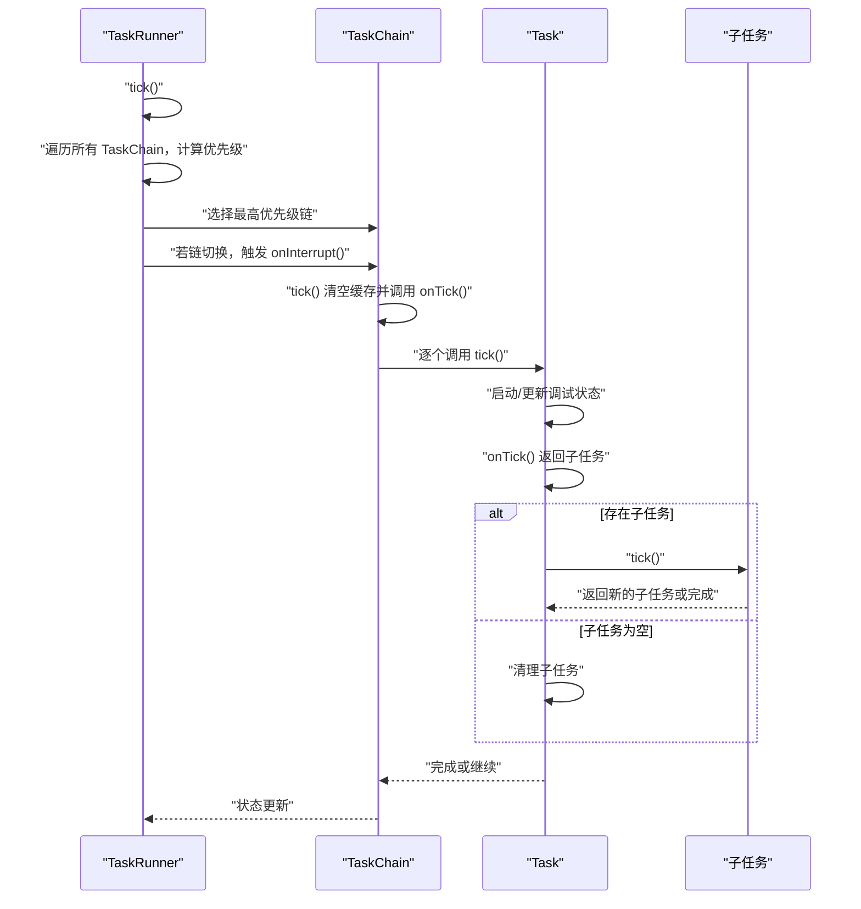

**图表来源**
- [TaskRunner.java:22-58](file://src/main/java/adris/altoclef/tasksystem/TaskRunner.java#L22-L58)
- [TaskChain.java:16-31](file://src/main/java/adris/altoclef/tasksystem/TaskChain.java#L16-L31)
- [Task.java:17-50](file://src/main/java/adris/altoclef/tasksystem/Task.java#L17-L50)

## 详细组件分析

### Task 基类设计与生命周期
- 生命周期方法
  - onStart/onTick/onStop/isEqual/toDebugString：由子类实现，定义任务行为与比较逻辑。
  - tick：统一入口，负责初始化、调试日志、子任务嵌套与中断、状态标记。
  - stop/interrupt/fail/reset：控制任务终止、中断与失败上报。
- 子任务管理
  - 通过内部子任务字段持有当前子任务，支持嵌套与动态替换。
  - canBeInterrupted：结合 ITaskCanForce 与 ITaskOverridesGrounded 决定是否允许打断。
- 超时与树形展示
  - thisOrChildAreTimedOut：检测是否包含超时任务。
  - getTaskTree：输出当前任务树，便于调试。

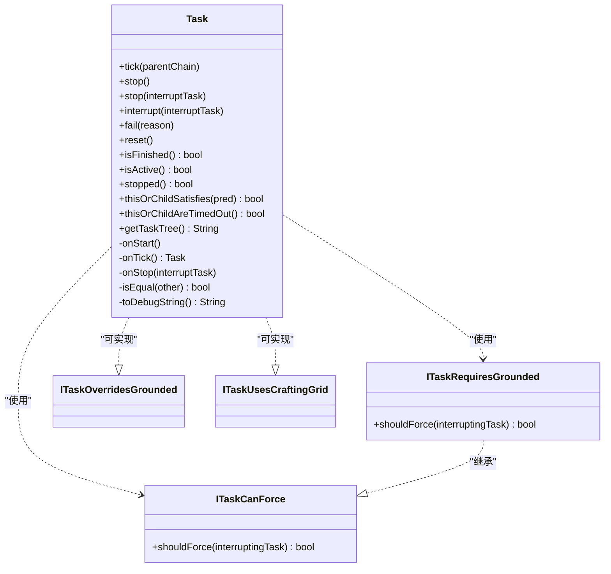

**图表来源**
- [Task.java:8-181](file://src/main/java/adris/altoclef/tasksystem/Task.java#L8-L181)
- [ITaskCanForce.java:1-6](file://src/main/java/adris/altoclef/tasksystem/ITaskCanForce.java#L1-L6)
- [ITaskRequiresGrounded.java:1-16](file://src/main/java/adris/altoclef/tasksystem/ITaskRequiresGrounded.java#L1-L16)
- [ITaskOverridesGrounded.java:1-5](file://src/main/java/adris/altoclef/tasksystem/ITaskOverridesGrounded.java#L1-L5)
- [ITaskUsesCraftingGrid.java:1-5](file://src/main/java/adris/altoclef/tasksystem/ITaskUsesCraftingGrid.java#L1-L5)

**章节来源**
- [Task.java:17-181](file://src/main/java/adris/altoclef/tasksystem/Task.java#L17-L181)

### TaskRunner 调度器工作原理
- 优先级选择
  - 遍历所有 TaskChain，取 isActive() 且优先级最高的链作为当前链。
  - 若链切换，调用旧链的 onInterrupt(newChain)。
- 状态报告
  - 维护 statusReport，记录当前链名称与优先级，便于监控。
- 启停控制
  - enable/disable：挂起/恢复行为栈，确保任务执行期间行为一致性。
  - stop：停止所有链并清空状态。

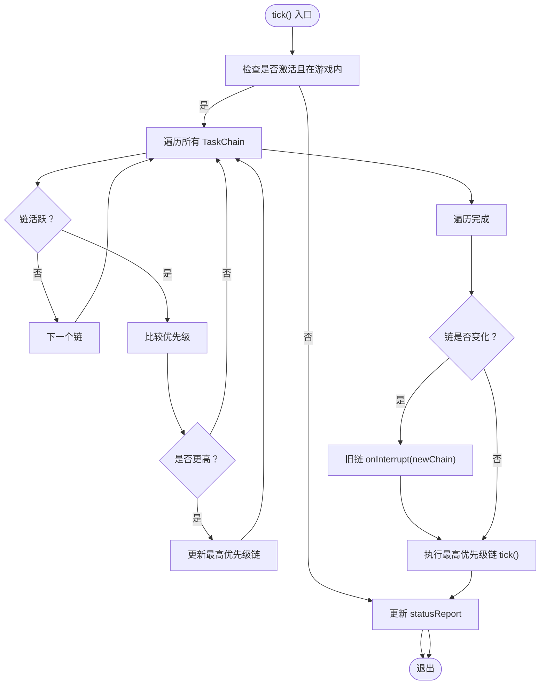

**图表来源**
- [TaskRunner.java:22-58](file://src/main/java/adris/altoclef/tasksystem/TaskRunner.java#L22-L58)

**章节来源**
- [TaskRunner.java:22-98](file://src/main/java/adris/altoclef/tasksystem/TaskRunner.java#L22-L98)

### TaskChain 优先级调度机制
- 任务缓存
  - 每次 tick 前清空缓存，onTick() 将当前链的任务序列写入缓存，便于调试与可视化。
- 链间中断
  - 当 TaskRunner 切换链时，调用 onInterrupt(newChain)，子类可在此处释放资源或保存状态。
- 抽象钩子
  - isActive/getPriority/getName/onTick/onStop：由子类实现具体行为。

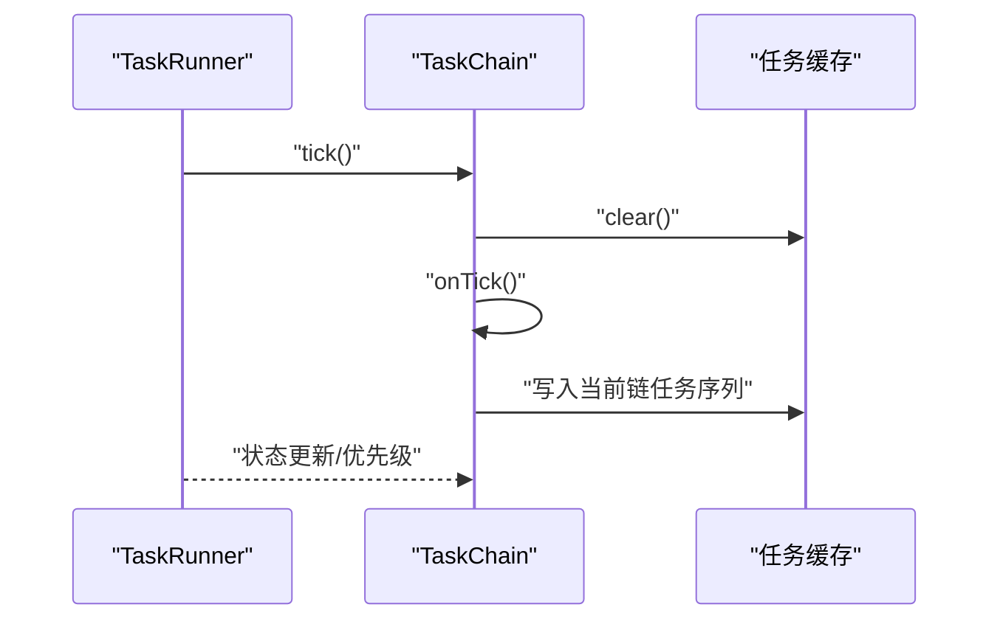

**图表来源**
- [TaskChain.java:16-44](file://src/main/java/adris/altoclef/tasksystem/TaskChain.java#L16-L44)

**章节来源**
- [TaskChain.java:16-51](file://src/main/java/adris/altoclef/tasksystem/TaskChain.java#L16-L51)

### 典型任务实现模式

#### 移动任务：GetToBlockTask
- 功能：导航至指定坐标，必要时切换维度；到达后可进入“长时间完成但仍在被调用”的保护性漫步。
- 关键点：
  - 通过行为栈 push/pop 管理偏好（如楼梯偏好）。
  - isFinished 与维度判断，防止“已完成却仍被调用”的僵局。
  - onWander 中请求不可达标记，辅助路径规划。

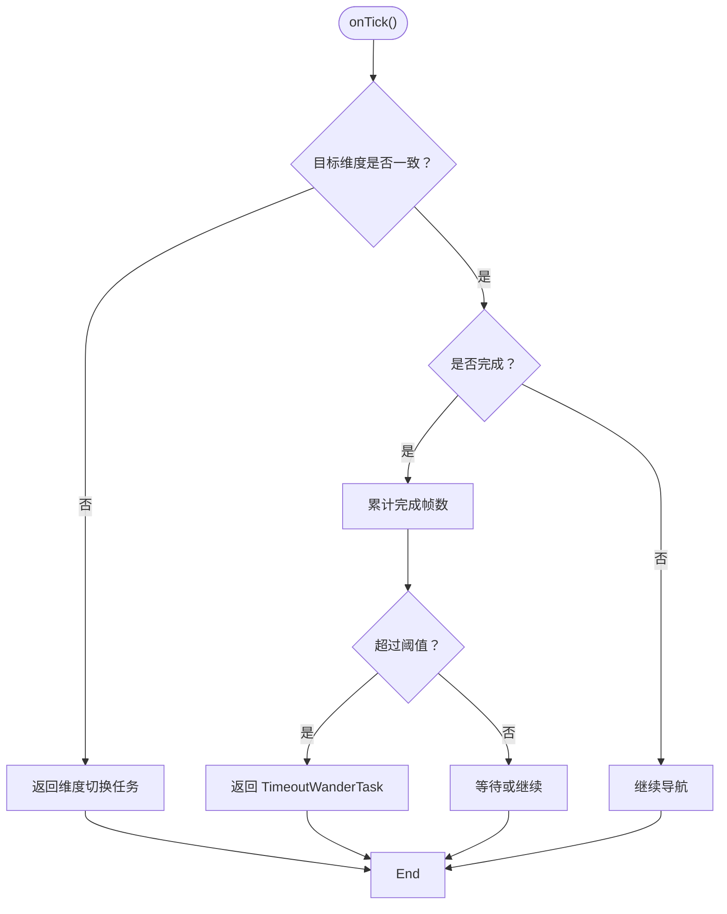

**图表来源**
- [GetToBlockTask.java:40-59](file://src/main/java/adris/altoclef/tasks/movement/GetToBlockTask.java#L40-L59)

**章节来源**
- [GetToBlockTask.java:14-106](file://src/main/java/adris/altoclef/tasks/movement/GetToBlockTask.java#L14-L106)

#### 资源收集任务：CollectBlockByOneTask
- 功能：按目标物品与方块集合进行收集，自动选择合适的工具需求。
- 关键点：
  - onResourceTick 返回 MineAndCollectTask，形成“收集”任务链。
  - isEqualResource 保证相同参数的任务不会重复执行。

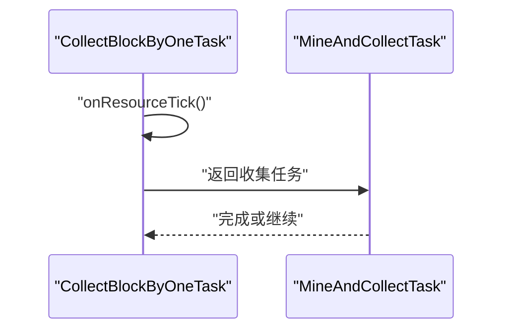

**图表来源**
- [CollectBlockByOneTask.java:37-43](file://src/main/java/adris/altoclef/tasks/resources/CollectBlockByOneTask.java#L37-L43)

**章节来源**
- [CollectBlockByOneTask.java:13-77](file://src/main/java/adris/altoclef/tasks/resources/CollectBlockByOneTask.java#L13-L77)

#### 建造任务：PlaceBlockTask
- 功能：在目标位置放置指定方块，自动补给材料，处理失败与替代路径。
- 关键点：
  - getMaterialCount：统计可用材料数量（含可丢弃物品）。
  - isFinished：根据 useThrowaways 决定判定条件。
  - PlaceStructureSchematic：基于 Baritone 的 AbstractSchematic 实现，按优先级选择合适方块。

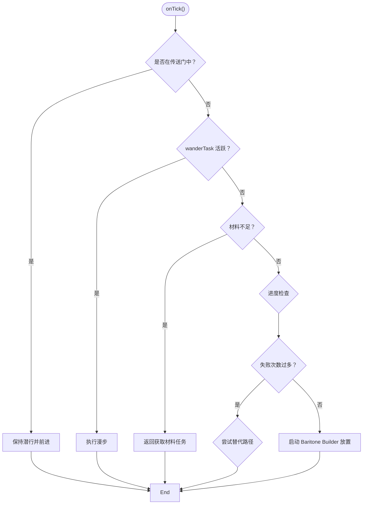

**图表来源**
- [PlaceBlockTask.java:74-139](file://src/main/java/adris/altoclef/tasks/construction/PlaceBlockTask.java#L74-L139)

**章节来源**
- [PlaceBlockTask.java:27-208](file://src/main/java/adris/altoclef/tasks/construction/PlaceBlockTask.java#L27-L208)

#### 实体交互任务：KillEntityTask
- 功能：对指定实体发起击杀，支持距离与范围参数。
- 关键点：
  - getEntityTarget 返回固定目标，isSubEqual 比较目标实体是否相同。

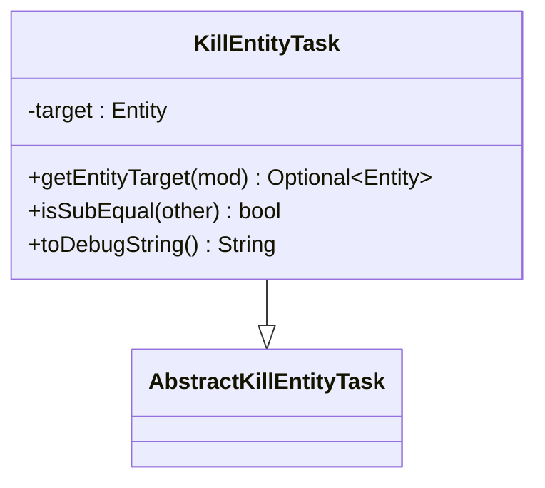

**图表来源**
- [KillEntityTask.java:8-35](file://src/main/java/adris/altoclef/tasks/entity/KillEntityTask.java#L8-L35)

**章节来源**
- [KillEntityTask.java:1-35](file://src/main/java/adris/altoclef/tasks/entity/KillEntityTask.java#L1-L35)

### 任务链示例：UserTaskChain
- 功能：用户任务链，负责接收外部任务、执行、完成回调与空闲态处理；同时具备距离监控与自动返回能力。
- 关键点：
  - runTask：强制停止当前任务后再设置新任务，避免“相等”导致的静默跳过。
  - onTaskFinish：完成时可执行空闲命令或停止行为。
  - 距离监控：超过阈值自动取消任务并返回至拥有者。

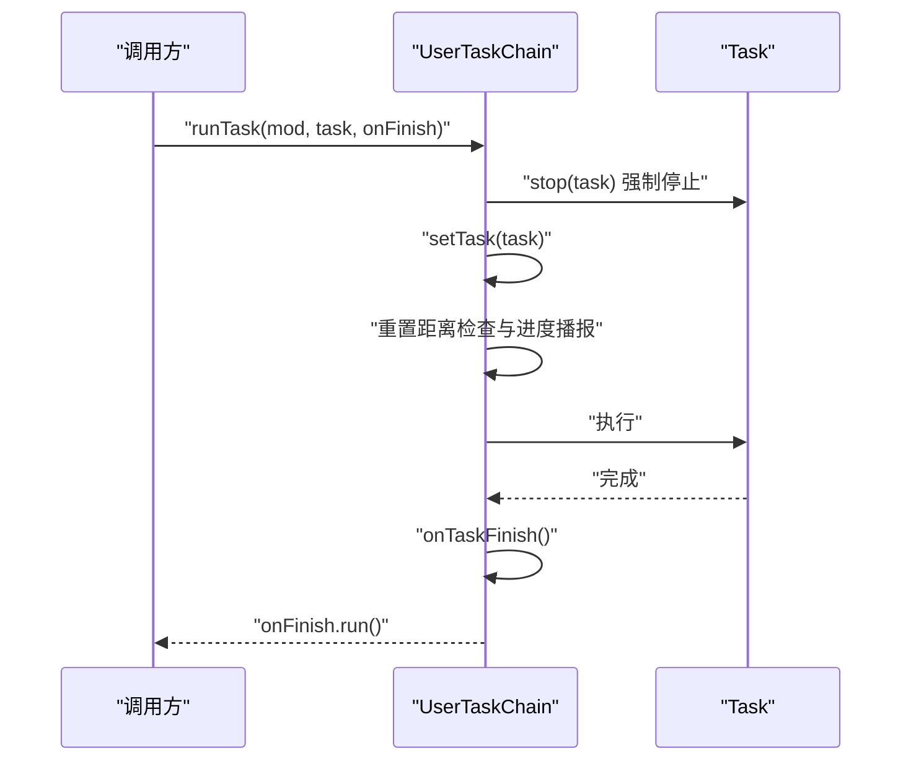

**图表来源**
- [UserTaskChain.java:133-201](file://src/main/java/adris/altoclef/chains/UserTaskChain.java#L133-L201)

**章节来源**
- [UserTaskChain.java:14-223](file://src/main/java/adris/altoclef/chains/UserTaskChain.java#L14-L223)

### 示例任务：ExampleTask
- 功能：示例性任务，演示如何组合多个子任务（获取工具、获取材料、移动到目标、放置方块）。
- 关键点：
  - onStart：保护特定物品。
  - onTick：按顺序返回子任务，最终完成条件为工具与方块满足要求。
  - isFinished：综合判断完成状态。

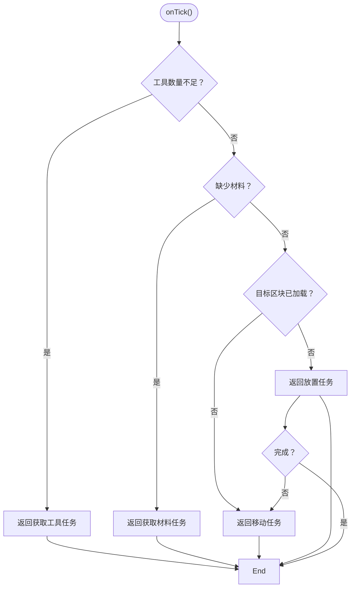

**图表来源**
- [ExampleTask.java:29-42](file://src/main/java/adris/altoclef/tasks/examples/ExampleTask.java#L29-L42)

**章节来源**
- [ExampleTask.java:12-68](file://src/main/java/adris/altoclef/tasks/examples/ExampleTask.java#L12-L68)

## 依赖关系分析
- Task 与 ITask* 接口族：Task 通过 canBeInterrupted 与接口族协作，决定是否允许打断。
- TaskChain 与 TaskRunner：TaskChain 由 TaskRunner 管理，TaskRunner 选择最高优先级链并驱动其执行。
- UserTaskChain：继承自 SingleTaskChain（未在本文列出），作为用户任务的承载链。
- 典型任务：GetToBlockTask/PlaceBlockTask/CollectBlockByOneTask/KillEntityTask 均继承 Task，部分实现 ITaskRequiresGrounded 等接口。

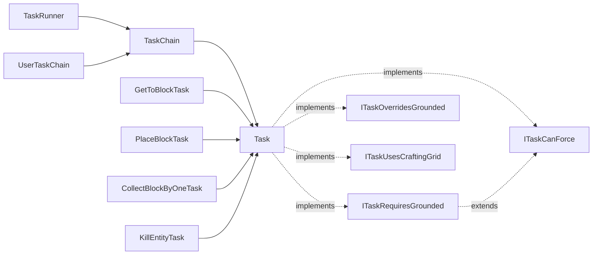

**图表来源**
- [TaskRunner.java:60-62](file://src/main/java/adris/altoclef/tasksystem/TaskRunner.java#L60-L62)
- [TaskChain.java:11-14](file://src/main/java/adris/altoclef/tasksystem/TaskChain.java#L11-L14)
- [Task.java:152-164](file://src/main/java/adris/altoclef/tasksystem/Task.java#L152-L164)
- [ITaskRequiresGrounded.java:5-16](file://src/main/java/adris/altoclef/tasksystem/ITaskRequiresGrounded.java#L5-L16)
- [UserTaskChain.java:36-38](file://src/main/java/adris/altoclef/chains/UserTaskChain.java#L36-L38)
- [GetToBlockTask.java:14](file://src/main/java/adris/altoclef/tasks/movement/GetToBlockTask.java#L14)
- [PlaceBlockTask.java:27](file://src/main/java/adris/altoclef/tasks/construction/PlaceBlockTask.java#L27)
- [CollectBlockByOneTask.java:13](file://src/main/java/adris/altoclef/tasks/resources/CollectBlockByOneTask.java#L13)
- [KillEntityTask.java:8](file://src/main/java/adris/altoclef/tasks/entity/KillEntityTask.java#L8)

**章节来源**
- [TaskRunner.java:60-98](file://src/main/java/adris/altoclef/tasksystem/TaskRunner.java#L60-L98)
- [TaskChain.java:11-51](file://src/main/java/adris/altoclef/tasksystem/TaskChain.java#L11-L51)
- [Task.java:152-181](file://src/main/java/adris/altoclef/tasksystem/Task.java#L152-L181)

## 性能考量
- 优先级选择复杂度：TaskRunner 遍历链列表，时间复杂度 O(N)；N 为链数量。
- 子任务嵌套：Task.tick 中对子任务的递归 tick，深度受限于任务树；建议避免过深嵌套。
- 调试日志：Task 在状态变更时输出日志，频繁状态切换会产生额外开销；建议在非调试模式降低日志频率。
- 材料统计与进度检查：PlaceBlockTask 中的 getMaterialCount 与 MovementProgressChecker 为常量/轻量操作，但应避免在高频 tick 中重复昂贵计算。
- 行为栈管理：GetToBlockTask/PlaceBlockTask 等通过行为栈 push/pop 控制行为，注意在停止时及时 pop，避免行为污染。

[本节为通用指导，无需特定文件来源]

## 故障排查指南
- 任务无法停止或重复执行
  - 现象：新任务与旧任务“相等”，导致新任务未真正重启。
  - 处理：UserTaskChain.runTask 中强制 stop 当前任务再 setTask，确保重启。
  - 参考：[UserTaskChain.java:147-160](file://src/main/java/adris/altoclef/chains/UserTaskChain.java#L147-L160)
- 任务被打断后状态异常
  - 现象：打断后子任务未正确清理或行为栈未恢复。
  - 处理：Task.stop/interrupt 会清理子任务并恢复行为栈；确保 onStop 正确 pop。
  - 参考：[Task.java:62-96](file://src/main/java/adris/altoclef/tasksystem/Task.java#L62-L96)
- 贴地性打断策略导致任务无法打断
  - 现象：空中/游泳/攀爬状态下被贴地性任务打断。
  - 处理：实现 ITaskOverridesGrounded 可覆盖贴地性策略；或在打断任务中实现 ITaskCanForce 控制打断意愿。
  - 参考：[ITaskRequiresGrounded.java:7-14](file://src/main/java/adris/altoclef/tasksystem/ITaskRequiresGrounded.java#L7-L14)、[ITaskOverridesGrounded.java:1-5](file://src/main/java/adris/altoclef/tasksystem/ITaskOverridesGrounded.java#L1-L5)
- 建造任务反复失败
  - 现象：放置失败后进入漫步或替代路径循环。
  - 处理：检查材料数量与可用性；必要时增加材料任务；确认目标位置可达。
  - 参考：[PlaceBlockTask.java:115-139](file://src/main/java/adris/altoclef/tasks/construction/PlaceBlockTask.java#L115-L139)
- 移动任务“已完成却仍在被调用”
  - 现象：长时间完成但仍在被 tick，触发漫步保护。
  - 处理：GetToBlockTask 中对完成帧数进行阈值判断，避免僵局。
  - 参考：[GetToBlockTask.java:50-58](file://src/main/java/adris/altoclef/tasks/movement/GetToBlockTask.java#L50-L58)

**章节来源**
- [UserTaskChain.java:147-160](file://src/main/java/adris/altoclef/chains/UserTaskChain.java#L147-L160)
- [Task.java:62-96](file://src/main/java/adris/altoclef/tasksystem/Task.java#L62-L96)
- [ITaskRequiresGrounded.java:7-14](file://src/main/java/adris/altoclef/tasksystem/ITaskRequiresGrounded.java#L7-L14)
- [PlaceBlockTask.java:115-139](file://src/main/java/adris/altoclef/tasks/construction/PlaceBlockTask.java#L115-L139)
- [GetToBlockTask.java:50-58](file://src/main/java/adris/altoclef/tasks/movement/GetToBlockTask.java#L50-L58)

## 结论
任务执行系统通过 Task 基类、TaskChain 与 TaskRunner 的协同，提供了清晰的生命周期管理、灵活的优先级调度与强大的中断控制。典型任务展示了移动、资源收集、建造与实体交互的实现范式；UserTaskChain 则体现了用户任务的组织与距离监控等高级特性。遵循本文的扩展指南与最佳实践，可高效构建复杂任务流并稳定运行。

[本节为总结，无需特定文件来源]

## 附录

### 任务扩展开发指南
- 新建任务步骤
  - 继承 Task，实现 onStart/onTick/onStop/isEqual/toDebugString。
  - 如需贴地性/覆盖贴地性/使用工作台等约束，实现相应 ITask* 接口。
  - 在 onTick 中返回子任务，形成任务链。
- 任务参数配置
  - 通过构造函数传入参数，确保 isEqual 正确比较关键参数。
  - 参考示例：[ExampleTask.java:16-19](file://src/main/java/adris/altoclef/tasks/examples/ExampleTask.java#L16-L19)
- 并发与异常处理
  - 使用 Task.stop/interrupt/fail 管理异常与中断。
  - 避免在高频 tick 中执行昂贵操作；必要时缓存中间结果。
- 性能优化建议
  - 控制任务树深度，减少不必要的子任务嵌套。
  - 合理使用行为栈 push/pop，避免状态污染。
  - 在非调试模式降低日志输出频率。

**章节来源**
- [Task.java:118-126](file://src/main/java/adris/altoclef/tasksystem/Task.java#L118-L126)
- [ExampleTask.java:16-19](file://src/main/java/adris/altoclef/tasks/examples/ExampleTask.java#L16-L19)

### 任务参数与状态管理示例
- 参数示例
  - GetToBlockTask：目标坐标、是否偏好楼梯、维度。
    - [GetToBlockTask.java:21-37](file://src/main/java/adris/altoclef/tasks/movement/GetToBlockTask.java#L21-L37)
  - PlaceBlockTask：目标坐标、方块类型、是否使用可丢弃材料、是否自动收集结构方块。
    - [PlaceBlockTask.java:39-48](file://src/main/java/adris/altoclef/tasks/construction/PlaceBlockTask.java#L39-L48)
  - CollectBlockByOneTask：目标物品、方块集合、工具需求、目标数量。
    - [CollectBlockByOneTask.java:19-25](file://src/main/java/adris/altoclef/tasks/resources/CollectBlockByOneTask.java#L19-L25)
  - KillEntityTask：目标实体、维持距离、守卫范围等。
    - [KillEntityTask.java:11-18](file://src/main/java/adris/altoclef/tasks/entity/KillEntityTask.java#L11-L18)

**章节来源**
- [GetToBlockTask.java:21-37](file://src/main/java/adris/altoclef/tasks/movement/GetToBlockTask.java#L21-L37)
- [PlaceBlockTask.java:39-48](file://src/main/java/adris/altoclef/tasks/construction/PlaceBlockTask.java#L39-L48)
- [CollectBlockByOneTask.java:19-25](file://src/main/java/adris/altoclef/tasks/resources/CollectBlockByOneTask.java#L19-L25)
- [KillEntityTask.java:11-18](file://src/main/java/adris/altoclef/tasks/entity/KillEntityTask.java#L11-L18)

### 任务间依赖关系与并发控制
- 依赖关系
  - ExampleTask：按顺序依赖“获取工具”→“获取材料”→“移动到目标”→“放置方块”。
    - [ExampleTask.java:31-41](file://src/main/java/adris/altoclef/tasks/examples/ExampleTask.java#L31-L41)
- 并发控制
  - TaskRunner 仅激活一个最高优先级链；链间通过 onInterrupt 通知切换。
    - [TaskRunner.java:37-48](file://src/main/java/adris/altoclef/tasksystem/TaskRunner.java#L37-L48)
  - Task 的 canBeInterrupted 与 ITaskCanForce/ITaskOverridesGrounded 协作，决定打断策略。
    - [Task.java:152-164](file://src/main/java/adris/altoclef/tasksystem/Task.java#L152-L164)

**章节来源**
- [ExampleTask.java:31-41](file://src/main/java/adris/altoclef/tasks/examples/ExampleTask.java#L31-L41)
- [TaskRunner.java:37-48](file://src/main/java/adris/altoclef/tasksystem/TaskRunner.java#L37-L48)
- [Task.java:152-164](file://src/main/java/adris/altoclef/tasksystem/Task.java#L152-L164)