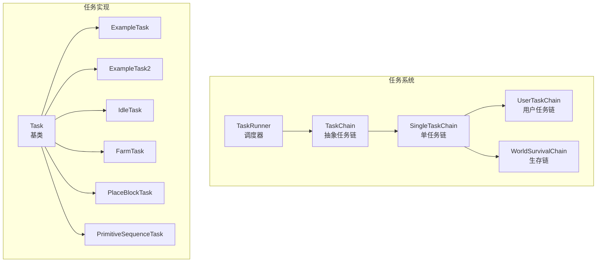
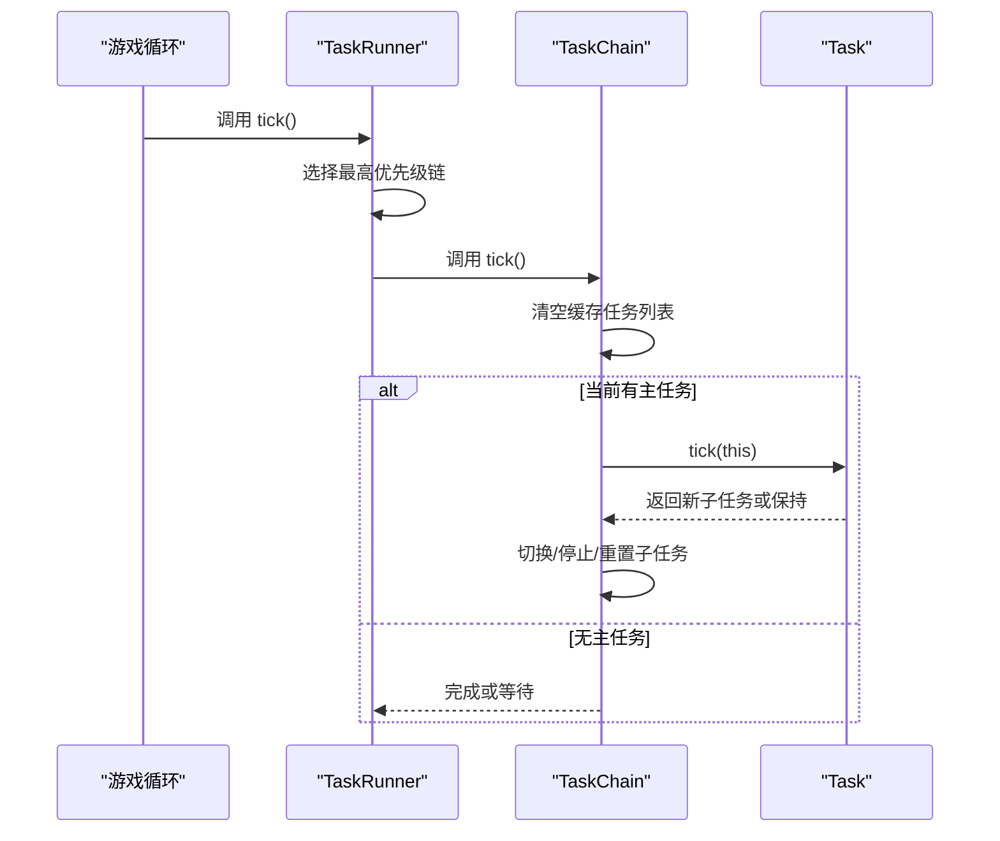
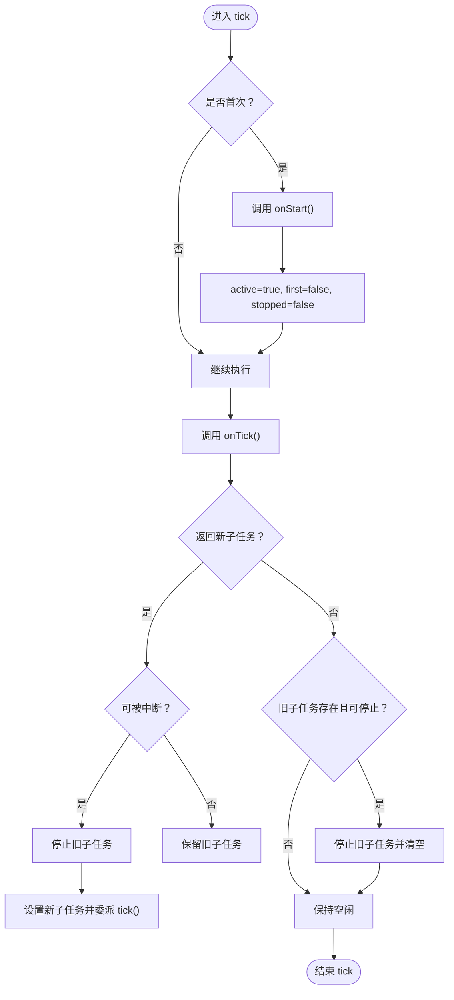
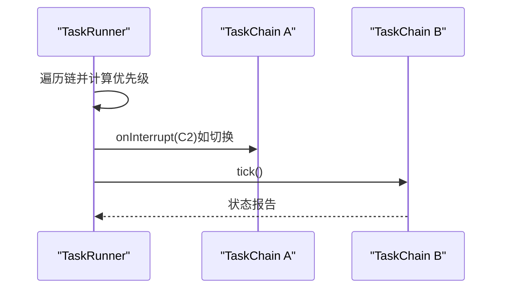
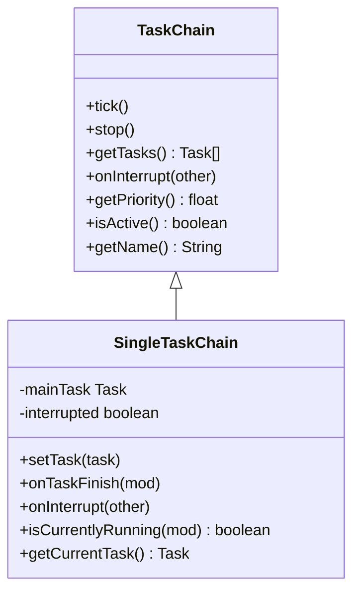
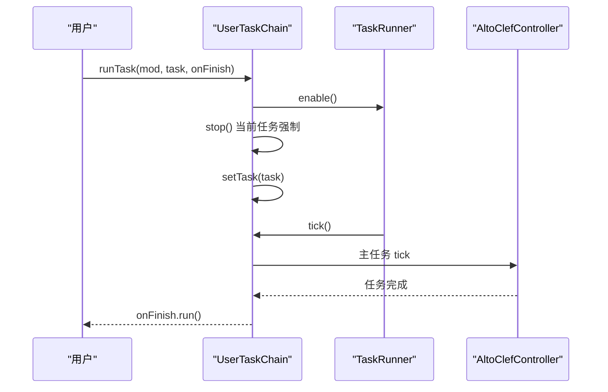
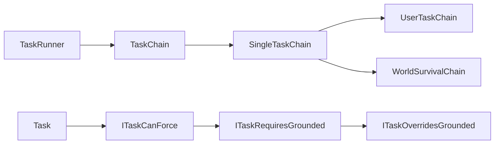

# 任务框架

<cite>
**本文引用的文件**
- [Task.java](file://src/main/java/adris/altoclef/tasksystem/Task.java)
- [TaskRunner.java](file://src/main/java/adris/altoclef/tasksystem/TaskRunner.java)
- [TaskChain.java](file://src/main/java/adris/altoclef/tasksystem/TaskChain.java)
- [ITaskCanForce.java](file://src/main/java/adris/altoclef/tasksystem/ITaskCanForce.java)
- [ITaskRequiresGrounded.java](file://src/main/java/adris/altoclef/tasksystem/ITaskRequiresGrounded.java)
- [ITaskOverridesGrounded.java](file://src/main/java/adris/altoclef/tasksystem/ITaskOverridesGrounded.java)
- [SingleTaskChain.java](file://src/main/java/adris/altoclef/chains/SingleTaskChain.java)
- [UserTaskChain.java](file://src/main/java/adris/altoclef/chains/UserTaskChain.java)
- [WorldSurvivalChain.java](file://src/main/java/adris/altoclef/chains/WorldSurvivalChain.java)
- [ExampleTask.java](file://src/main/java/adris/altoclef/tasks/examples/ExampleTask.java)
- [ExampleTask2.java](file://src/main/java/adris/altoclef/tasks/examples/ExampleTask2.java)
- [IdleTask.java](file://src/main/java/adris/altoclef/tasks/movement/IdleTask.java)
- [FarmTask.java](file://src/main/java/adris/altoclef/tasks/misc/FarmTask.java)
- [PlaceBlockTask.java](file://src/main/java/adris/altoclef/tasks/construction/PlaceBlockTask.java)
- [PrimitiveSequenceTask.java](file://src/main/java/adris/altoclef/tasks/movement/PrimitiveSequenceTask.java)
</cite>

## 目录
1. [简介](#简介)
2. [项目结构](#项目结构)
3. [核心组件](#核心组件)
4. [架构总览](#架构总览)
5. [详细组件分析](#详细组件分析)
6. [依赖分析](#依赖分析)
7. [性能考虑](#性能考虑)
8. [故障排查指南](#故障排查指南)
9. [结论](#结论)
10. [附录：扩展开发指南与最佳实践](#附录扩展开发指南与最佳实践)

## 简介
本技术文档围绕任务框架进行系统化梳理，重点阐释以下方面：
- Task 基类的设计理念与生命周期管理（onStart、onTick、onStop 等）及其调用时机与实现模式
- TaskRunner 调度器的工作原理（任务链管理、优先级处理、中断与并发控制）
- TaskChain 优先级调度系统（任务链构建、中断机制、状态传播）
- 接口 ITaskCanForce、ITaskRequiresGrounded 的作用与实现要求
- 扩展开发指南（自定义任务实现、接口适配、最佳实践），并提供具体代码示例路径与调试技巧

## 项目结构
任务框架位于模块“tasksystem”下，配合多条任务链（chains）组织不同场景下的任务执行；典型任务位于“tasks”子包中，示例任务用于演示基本用法。

图表来源
- [TaskRunner.java:1-98](file://src/main/java/adris/altoclef/tasksystem/TaskRunner.java#L1-L98)
- [TaskChain.java:1-51](file://src/main/java/adris/altoclef/tasksystem/TaskChain.java#L1-L51)
- [SingleTaskChain.java:1-96](file://src/main/java/adris/altoclef/chains/SingleTaskChain.java#L1-L96)
- [UserTaskChain.java:1-223](file://src/main/java/adris/altoclef/chains/UserTaskChain.java#L1-L223)
- [WorldSurvivalChain.java:1-167](file://src/main/java/adris/altoclef/chains/WorldSurvivalChain.java#L1-L167)
- [Task.java:1-181](file://src/main/java/adris/altoclef/tasksystem/Task.java#L1-L181)
- [ExampleTask.java:1-68](file://src/main/java/adris/altoclef/tasks/examples/ExampleTask.java#L1-L68)
- [ExampleTask2.java:1-70](file://src/main/java/adris/altoclef/tasks/examples/ExampleTask2.java#L1-L70)
- [IdleTask.java:1-37](file://src/main/java/adris/altoclef/tasks/movement/IdleTask.java#L1-L37)
- [FarmTask.java:1-67](file://src/main/java/adris/altoclef/tasks/misc/FarmTask.java#L1-L67)
- [PlaceBlockTask.java:1-208](file://src/main/java/adris/altoclef/tasks/construction/PlaceBlockTask.java#L1-L208)
- [PrimitiveSequenceTask.java:1-292](file://src/main/java/adris/altoclef/tasks/movement/PrimitiveSequenceTask.java#L1-L292)

章节来源
- [TaskRunner.java:1-98](file://src/main/java/adris/altoclef/tasksystem/TaskRunner.java#L1-L98)
- [TaskChain.java:1-51](file://src/main/java/adris/altoclef/tasksystem/TaskChain.java#L1-L51)
- [SingleTaskChain.java:1-96](file://src/main/java/adris/altoclef/chains/SingleTaskChain.java#L1-L96)
- [UserTaskChain.java:1-223](file://src/main/java/adris/altoclef/chains/UserTaskChain.java#L1-L223)
- [WorldSurvivalChain.java:1-167](file://src/main/java/adris/altoclef/chains/WorldSurvivalChain.java#L1-L167)
- [Task.java:1-181](file://src/main/java/adris/altoclef/tasksystem/Task.java#L1-L181)

## 核心组件
- Task：所有任务的抽象基类，负责生命周期管理、子任务委派、中断策略、调试状态输出与树形任务展示。
- TaskChain：任务链抽象，封装优先级计算、活跃性判断、任务收集与中断回调。
- SingleTaskChain：单任务链实现，维护当前主任务、切换逻辑、中断与完成回调。
- TaskRunner：全局调度器，按优先级选择活动链并驱动其 tick，支持启用/禁用、状态报告与链间中断。
- 接口族：ITaskCanForce、ITaskRequiresGrounded、ITaskOverridesGrounded 定义强制中断与地面状态约束。

章节来源
- [Task.java:1-181](file://src/main/java/adris/altoclef/tasksystem/Task.java#L1-L181)
- [TaskChain.java:1-51](file://src/main/java/adris/altoclef/tasksystem/TaskChain.java#L1-L51)
- [SingleTaskChain.java:1-96](file://src/main/java/adris/altoclef/chains/SingleTaskChain.java#L1-L96)
- [TaskRunner.java:1-98](file://src/main/java/adris/altoclef/tasksystem/TaskRunner.java#L1-L98)
- [ITaskCanForce.java:1-6](file://src/main/java/adris/altoclef/tasksystem/ITaskCanForce.java#L1-L6)
- [ITaskRequiresGrounded.java:1-16](file://src/main/java/adris/altoclef/tasksystem/ITaskRequiresGrounded.java#L1-L16)
- [ITaskOverridesGrounded.java:1-5](file://src/main/java/adris/altoclef/tasksystem/ITaskOverridesGrounded.java#L1-L5)

## 架构总览
任务框架采用“链式优先级调度 + 子任务委派”的双层结构：
- TaskRunner 遍历所有 TaskChain，依据 getPriority() 选择最高优先级链，触发其 tick()。
- TaskChain 内部通过 setTask()/mainTask.tick() 驱动当前任务，支持任务切换、重置与完成回调。
- Task 在 tick() 中首次进入时调用 onStart()，随后循环调用 onTick() 返回新的子任务或继续执行，必要时停止/中断子任务。

图表来源
- [TaskRunner.java:22-58](file://src/main/java/adris/altoclef/tasksystem/TaskRunner.java#L22-L58)
- [TaskChain.java:16-19](file://src/main/java/adris/altoclef/tasksystem/TaskChain.java#L16-L19)
- [SingleTaskChain.java:23-44](file://src/main/java/adris/altoclef/chains/SingleTaskChain.java#L23-L44)
- [Task.java:17-50](file://src/main/java/adris/altoclef/tasksystem/Task.java#L17-L50)

## 详细组件分析

### Task 生命周期与中断策略
- 生命周期关键点
  - 首次 tick：标记 active=true，调用 onStart()，first=false，stopped=false
  - 每次 tick：调用 onTick() 获取新子任务；若返回非空且可被中断，则停止旧子任务并委派给新子任务
  - 结束：stop()/interrupt() 将 active=false、stopped=true，并递归停止子任务
  - 失败：fail(reason) 触发 stop() 并记录日志
- 中断判定
  - canBeInterrupted() 会遍历子任务树，遇到 ITaskCanForce 的任务时，若被中断候选满足 shouldForce()，则不可中断
  - ITaskRequiresGrounded 默认在角色未着地/游泳/水中/攀爬时拒绝中断，除非中断候选实现 ITaskOverridesGrounded
- 调试与可视化
  - setDebugState() 与 toDebugString() 组合用于输出调试信息
  - getTaskTree() 可打印主任务与其子任务链路

图表来源
- [Task.java:17-50](file://src/main/java/adris/altoclef/tasksystem/Task.java#L17-L50)
- [Task.java:152-164](file://src/main/java/adris/altoclef/tasksystem/Task.java#L152-L164)

章节来源
- [Task.java:17-181](file://src/main/java/adris/altoclef/tasksystem/Task.java#L17-L181)
- [ITaskRequiresGrounded.java:7-14](file://src/main/java/adris/altoclef/tasksystem/ITaskRequiresGrounded.java#L7-L14)
- [ITaskOverridesGrounded.java:1-5](file://src/main/java/adris/altoclef/tasksystem/ITaskOverridesGrounded.java#L1-L5)

### TaskRunner 调度器
- 功能要点
  - 遍历所有已注册链，筛选 isActive() 为真者，取最大优先级链
  - 若链发生切换，调用原链 onInterrupt(other) 进行中断处理
  - 对最高优先级链调用 tick()，更新状态报告
  - enable()/disable() 控制行为栈与全局激活状态
- 并发与控制
  - 单线程 tick 驱动，避免链间竞争
  - 通过链的优先级与活跃性实现“抢占式”调度

图表来源
- [TaskRunner.java:22-58](file://src/main/java/adris/altoclef/tasksystem/TaskRunner.java#L22-L58)

章节来源
- [TaskRunner.java:1-98](file://src/main/java/adris/altoclef/tasksystem/TaskRunner.java#L1-L98)

### TaskChain 与 SingleTaskChain
- TaskChain
  - 提供 getTasks() 缓存当前链的任务序列，便于调试与观察
  - 抽象方法：onTick()、onStop()、onInterrupt()、getPriority()、isActive()、getName()
- SingleTaskChain
  - 维护 mainTask，提供 setTask() 切换逻辑与 onTaskFinish() 完成回调
  - onInterrupt() 标记 interrupted 并中断当前主任务
  - isCurrentlyRunning() 用于外部条件判断

图表来源
- [TaskChain.java:16-50](file://src/main/java/adris/altoclef/tasksystem/TaskChain.java#L16-L50)
- [SingleTaskChain.java:11-96](file://src/main/java/adris/altoclef/chains/SingleTaskChain.java#L11-L96)

章节来源
- [TaskChain.java:1-51](file://src/main/java/adris/altoclef/tasksystem/TaskChain.java#L1-L51)
- [SingleTaskChain.java:1-96](file://src/main/java/adris/altoclef/chains/SingleTaskChain.java#L1-L96)

### 具体链实现：UserTaskChain 与 WorldSurvivalChain
- UserTaskChain
  - 固定优先级（getPriority=50），运行用户下发的任务
  - 支持任务完成回调、闲置态切换、距离监控与自动返回
  - runTask() 强制停止当前任务以确保新任务总是重启
- WorldSurvivalChain
  - 动态优先级：根据玩家状态（溺水、着火、岩浆、末地门卡住）即时提升优先级
  - 自动执行逃生/灭火/安全抖动等动作，优先级低于生存需求

图表来源
- [UserTaskChain.java:133-168](file://src/main/java/adris/altoclef/chains/UserTaskChain.java#L133-L168)
- [TaskRunner.java:64-71](file://src/main/java/adris/altoclef/tasksystem/TaskRunner.java#L64-L71)

章节来源
- [UserTaskChain.java:1-223](file://src/main/java/adris/altoclef/chains/UserTaskChain.java#L1-L223)
- [WorldSurvivalChain.java:1-167](file://src/main/java/adris/altoclef/chains/WorldSurvivalChain.java#L1-L167)

### 示例任务与典型实现
- ExampleTask / ExampleTask2：演示如何在 onStart/onTick/onStop 中使用控制器、条件分支与任务组合
- IdleTask：空闲任务，持续返回 null 表示无限期运行
- FarmTask：委托 Baritone 的农场进程，周期性启动/恢复
- PlaceBlockTask：实现 ITaskRequiresGrounded，强调地面状态约束；动态材料收集与替代放置策略
- PrimitiveSequenceTask：顺序执行输入步骤（如跳跃、等待、释放），适合短序列动作

章节来源
- [ExampleTask.java:1-68](file://src/main/java/adris/altoclef/tasks/examples/ExampleTask.java#L1-L68)
- [ExampleTask2.java:1-70](file://src/main/java/adris/altoclef/tasks/examples/ExampleTask2.java#L1-L70)
- [IdleTask.java:1-37](file://src/main/java/adris/altoclef/tasks/movement/IdleTask.java#L1-L37)
- [FarmTask.java:1-67](file://src/main/java/adris/altoclef/tasks/misc/FarmTask.java#L1-L67)
- [PlaceBlockTask.java:1-208](file://src/main/java/adris/altoclef/tasks/construction/PlaceBlockTask.java#L1-L208)
- [PrimitiveSequenceTask.java:1-292](file://src/main/java/adris/altoclef/tasks/movement/PrimitiveSequenceTask.java#L1-L292)

## 依赖分析
- Task 依赖接口 ITaskCanForce 以决定是否允许强制中断
- ITaskRequiresGrounded 通过默认实现与 ITaskOverridesGrounded 协作，限制在空中/水中等状态下的中断
- TaskRunner 仅依赖 TaskChain 抽象，不关心具体链类型，具备良好扩展性
- SingleTaskChain 依赖 TaskRunner 注入控制器与行为栈，负责主任务生命周期

图表来源
- [TaskRunner.java:1-98](file://src/main/java/adris/altoclef/tasksystem/TaskRunner.java#L1-L98)
- [TaskChain.java:1-51](file://src/main/java/adris/altoclef/tasksystem/TaskChain.java#L1-L51)
- [SingleTaskChain.java:1-96](file://src/main/java/adris/altoclef/chains/SingleTaskChain.java#L1-L96)
- [UserTaskChain.java:1-223](file://src/main/java/adris/altoclef/chains/UserTaskChain.java#L1-L223)
- [WorldSurvivalChain.java:1-167](file://src/main/java/adris/altoclef/chains/WorldSurvivalChain.java#L1-L167)
- [Task.java:152-164](file://src/main/java/adris/altoclef/tasksystem/Task.java#L152-L164)
- [ITaskRequiresGrounded.java:7-14](file://src/main/java/adris/altoclef/tasksystem/ITaskRequiresGrounded.java#L7-L14)
- [ITaskOverridesGrounded.java:1-5](file://src/main/java/adris/altoclef/tasksystem/ITaskOverridesGrounded.java#L1-L5)

章节来源
- [Task.java:152-164](file://src/main/java/adris/altoclef/tasksystem/Task.java#L152-L164)
- [ITaskRequiresGrounded.java:1-16](file://src/main/java/adris/altoclef/tasksystem/ITaskRequiresGrounded.java#L1-L16)
- [ITaskOverridesGrounded.java:1-5](file://src/main/java/adris/altoclef/tasksystem/ITaskOverridesGrounded.java#L1-L5)

## 性能考虑
- 优先级选择为 O(N) 遍历，建议控制链数量或在链上做轻量级 isActive() 判定
- TaskChain 缓存任务列表仅用于调试，避免在热路径中做重型操作
- 子任务委派与中断判定涉及树遍历，应尽量减少深层嵌套与频繁切换
- 使用 setDebugState 与 toDebugString 输出日志时注意频率，避免影响帧率

## 故障排查指南
- 任务无法停止/中断
  - 检查任务是否实现 ITaskCanForce 且 shouldForce() 返回 true
  - 若任务实现 ITaskRequiresGrounded，确认角色状态满足着地/游泳/水中/攀爬之一
  - 参考路径：[Task.java:152-164](file://src/main/java/adris/altoclef/tasksystem/Task.java#L152-L164)、[ITaskRequiresGrounded.java:7-14](file://src/main/java/adris/altoclef/tasksystem/ITaskRequiresGrounded.java#L7-L14)
- 任务链切换无效
  - 确认链的 isActive() 与 getPriority() 返回合理值
  - 检查 TaskRunner.enable() 是否被调用
  - 参考路径：[TaskRunner.java:22-58](file://src/main/java/adris/altoclef/tasksystem/TaskRunner.java#L22-L58)、[UserTaskChain.java:133-168](file://src/main/java/adris/altoclef/chains/UserTaskChain.java#L133-L168)
- 任务重复/卡死
  - 使用 Task.getTaskTree() 查看主任务与子任务链路
  - 确保在切换任务时调用 stop(task) 或在 runTask() 中强制停止
  - 参考路径：[Task.java:166-179](file://src/main/java/adris/altoclef/tasksystem/Task.java#L166-L179)、[SingleTaskChain.java:54-67](file://src/main/java/adris/altoclef/chains/SingleTaskChain.java#L54-L67)
- 调试技巧
  - 在 onStart/onTick/onStop 中使用 setDebugState 输出状态
  - 使用 Debug.logMessage/Debug.logInternal 记录关键事件
  - 参考路径：[Task.java:98-104](file://src/main/java/adris/altoclef/tasksystem/Task.java#L98-L104)、[Task.java:79-82](file://src/main/java/adris/altoclef/tasksystem/Task.java#L79-L82)

章节来源
- [Task.java:79-104](file://src/main/java/adris/altoclef/tasksystem/Task.java#L79-L104)
- [Task.java:152-179](file://src/main/java/adris/altoclef/tasksystem/Task.java#L152-L179)
- [SingleTaskChain.java:54-67](file://src/main/java/adris/altoclef/chains/SingleTaskChain.java#L54-L67)
- [TaskRunner.java:22-58](file://src/main/java/adris/altoclef/tasksystem/TaskRunner.java#L22-L58)

## 结论
该任务框架通过清晰的生命周期与优先级调度，实现了高内聚、低耦合的任务执行体系。Task 基类提供了统一的中断与子任务委派机制，TaskChain/SingleTaskChain 实现了灵活的任务链管理，TaskRunner 则承担全局调度职责。接口族（ITaskCanForce、ITaskRequiresGrounded 等）为任务的强制中断与状态约束提供了可插拔的扩展点。结合示例任务与链实现，开发者可以快速构建复杂而稳定的自动化行为。

## 附录：扩展开发指南与最佳实践
- 自定义任务实现
  - 继承 Task，覆盖 onStart/onTick/onStop/isFinished/equals/toDebugString
  - 在 onTick() 中返回子任务以实现任务组合；必要时调用 setDebugState 输出状态
  - 参考路径：[Task.java:18-126](file://src/main/java/adris/altoclef/tasksystem/Task.java#L18-L126)、[ExampleTask.java:21-47](file://src/main/java/adris/altoclef/tasks/examples/ExampleTask.java#L21-L47)
- 适配接口
  - 若需要阻止强制中断，实现 ITaskCanForce 并在 shouldForce() 返回 true
  - 若任务需要地面状态约束，实现 ITaskRequiresGrounded；如需允许中断，同时实现 ITaskOverridesGrounded
  - 参考路径：[ITaskCanForce.java:1-6](file://src/main/java/adris/altoclef/tasksystem/ITaskCanForce.java#L1-L6)、[ITaskRequiresGrounded.java:1-16](file://src/main/java/adris/altoclef/tasksystem/ITaskRequiresGrounded.java#L1-L16)、[ITaskOverridesGrounded.java:1-5](file://src/main/java/adris/altoclef/tasksystem/ITaskOverridesGrounded.java#L1-L5)
- 任务链开发
  - 继承 SingleTaskChain，实现 setTask() 与 onTaskFinish()；在 onTick() 中根据 isActive() 与 mainTask 状态驱动
  - 如需动态优先级，实现 TaskChain 的 getPriority()/isActive()；参考 UserTaskChain 的固定优先级与 WorldSurvivalChain 的动态优先级
  - 参考路径：[SingleTaskChain.java:23-74](file://src/main/java/adris/altoclef/chains/SingleTaskChain.java#L23-L74)、[UserTaskChain.java:124-131](file://src/main/java/adris/altoclef/chains/UserTaskChain.java#L124-L131)、[WorldSurvivalChain.java:42-106](file://src/main/java/adris/altoclef/chains/WorldSurvivalChain.java#L42-L106)
- 最佳实践
  - 避免在 onTick() 中做重型计算，尽量委托给子任务或使用缓存
  - 切换任务时务必调用 stop(task) 或在 runTask() 中强制停止，防止状态污染
  - 合理使用 isFinished() 与 stopped()，确保链能正确感知完成与停止
  - 使用 getTaskTree() 与 setDebugState 辅助调试，定位问题根因
  - 参考路径：[Task.java:166-179](file://src/main/java/adris/altoclef/tasksystem/Task.java#L166-L179)、[UserTaskChain.java:147-160](file://src/main/java/adris/altoclef/chains/UserTaskChain.java#L147-L160)