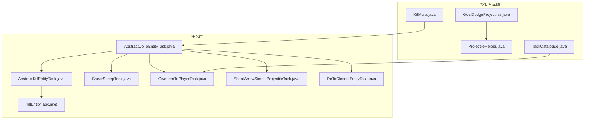
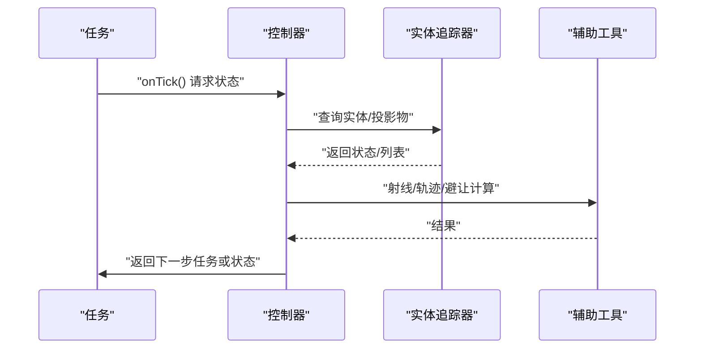
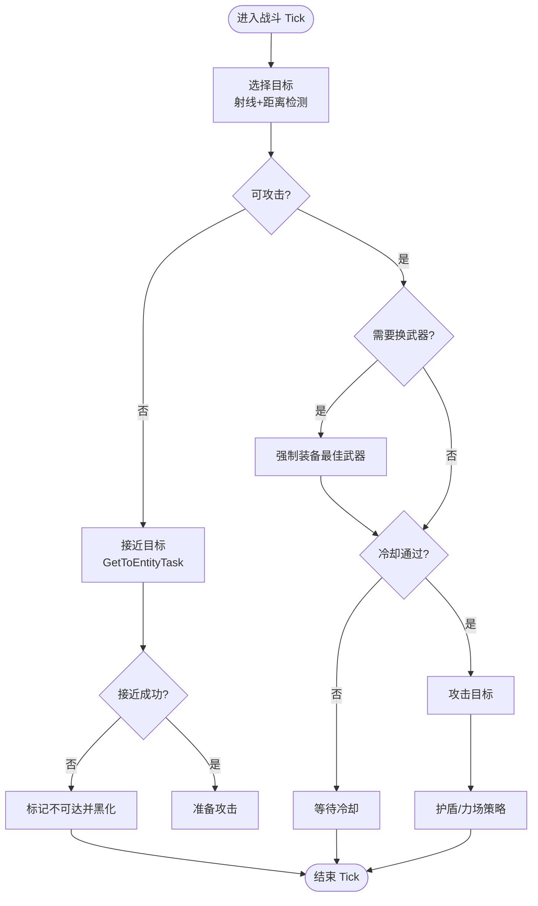
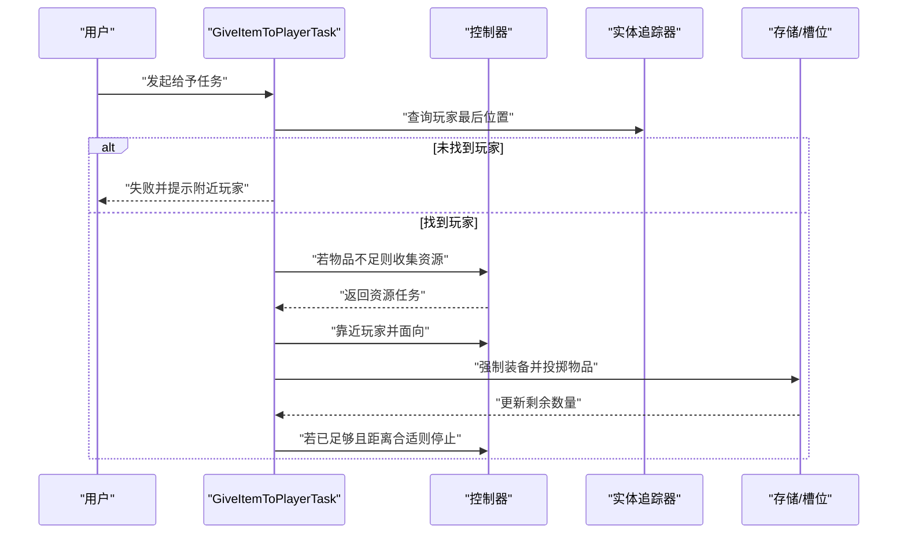
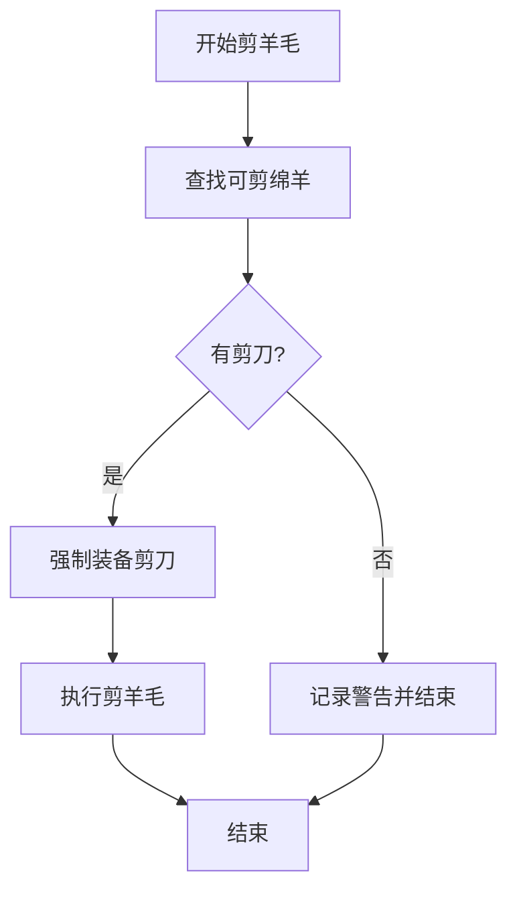
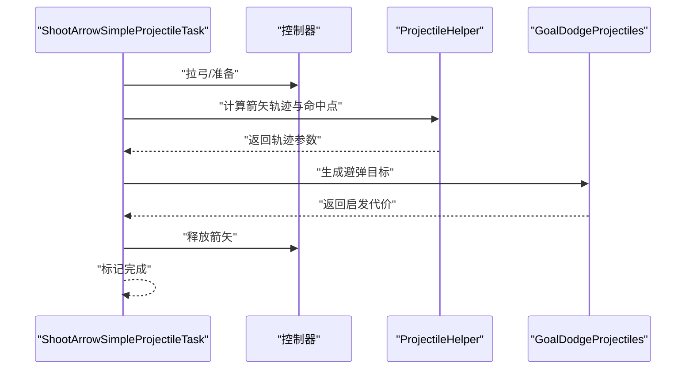
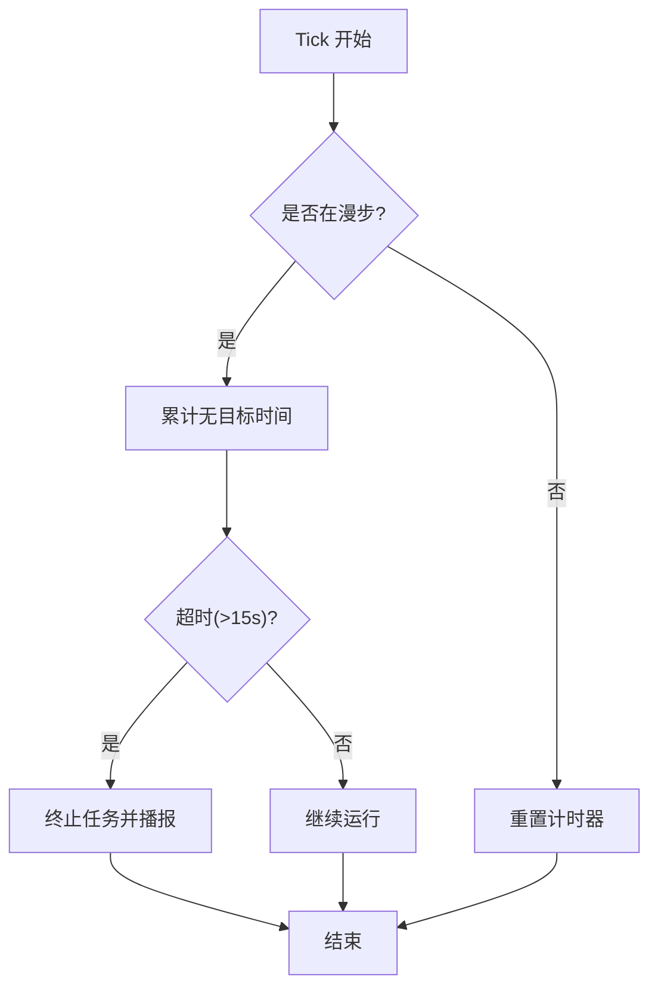
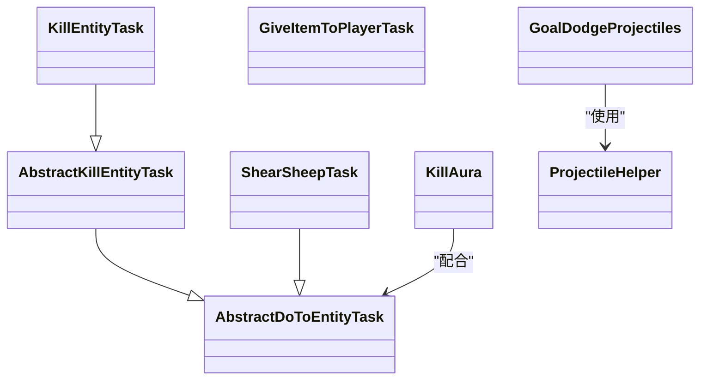

# 实体交互任务

<cite>
**本文引用的文件**
- [AbstractDoToEntityTask.java](file://src/main/java/adris/altoclef/tasks/entity/AbstractDoToEntityTask.java)
- [AbstractKillEntityTask.java](file://src/main/java/adris/altoclef/tasks/entity/AbstractKillEntityTask.java)
- [KillEntityTask.java](file://src/main/java/adris/altoclef/tasks/entity/KillEntityTask.java)
- [ShearSheepTask.java](file://src/main/java/adris/altoclef/tasks/entity/ShearSheepTask.java)
- [GiveItemToPlayerTask.java](file://src/main/java/adris/altoclef/tasks/entity/GiveItemToPlayerTask.java)
- [ShootArrowSimpleProjectileTask.java](file://src/main/java/adris/altoclef/tasks/entity/ShootArrowSimpleProjectileTask.java)
- [DoToClosestEntityTask.java](file://src/main/java/adris/altoclef/tasks/entity/DoToClosestEntityTask.java)
- [KillAura.java](file://src/main/java/adris/altoclef/control/KillAura.java)
- [GoalDodgeProjectiles.java](file://src/main/java/adris/altoclef/util/baritone/GoalDodgeProjectiles.java)
- [ProjectileHelper.java](file://src/main/java/adris/altoclef/util/helpers/ProjectileHelper.java)
- [TaskCatalogue.java](file://src/main/java/adris/altoclef/TaskCatalogue.java)
</cite>

## 目录
1. [简介](#简介)
2. [项目结构](#项目结构)
3. [核心组件](#核心组件)
4. [架构总览](#架构总览)
5. [详细组件分析](#详细组件分析)
6. [依赖分析](#依赖分析)
7. [性能考量](#性能考量)
8. [故障排查指南](#故障排查指南)
9. [结论](#结论)
10. [附录](#附录)

## 简介
本技术文档聚焦于实体交互任务系统，围绕以下主题展开：
- 战斗任务：目标选择、攻击策略与安全防护
- 物品给予任务：玩家识别、物品传递与关系影响
- 剪羊毛等被动交互任务：实现原理与边界条件
- 远程射击任务：轨迹计算与命中控制
- 实体监控任务：状态跟踪与事件响应
- 安全考虑、道德准则与性能优化
- 典型交互示例、冲突处理策略与常见失败问题的调试技巧

## 项目结构
实体交互任务主要位于 tasks/entity 与 control、util 子包中，并通过任务系统 Task 与控制器 AltoClefController 协作完成行为编排。

**图表来源**
- [AbstractDoToEntityTask.java:1-181](file://src/main/java/adris/altoclef/tasks/entity/AbstractDoToEntityTask.java#L1-L181)
- [AbstractKillEntityTask.java:1-97](file://src/main/java/adris/altoclef/tasks/entity/AbstractKillEntityTask.java#L1-L97)
- [KillEntityTask.java:1-35](file://src/main/java/adris/altoclef/tasks/entity/KillEntityTask.java#L1-L35)
- [ShearSheepTask.java:1-50](file://src/main/java/adris/altoclef/tasks/entity/ShearSheepTask.java#L1-L50)
- [GiveItemToPlayerTask.java:1-155](file://src/main/java/adris/altoclef/tasks/entity/GiveItemToPlayerTask.java#L1-L155)
- [ShootArrowSimpleProjectileTask.java:1-126](file://src/main/java/adris/altoclef/tasks/entity/ShootArrowSimpleProjectileTask.java#L1-L126)
- [DoToClosestEntityTask.java:1-132](file://src/main/java/adris/altoclef/tasks/entity/DoToClosestEntityTask.java#L1-L132)
- [KillAura.java:1-253](file://src/main/java/adris/altoclef/control/KillAura.java#L1-L253)
- [GoalDodgeProjectiles.java:1-96](file://src/main/java/adris/altoclef/util/baritone/GoalDodgeProjectiles.java#L1-L96)
- [ProjectileHelper.java:1-90](file://src/main/java/adris/altoclef/util/helpers/ProjectileHelper.java#L1-L90)
- [TaskCatalogue.java:127-168](file://src/main/java/adris/altoclef/TaskCatalogue.java#L127-L168)

**章节来源**
- [AbstractDoToEntityTask.java:1-181](file://src/main/java/adris/altoclef/tasks/entity/AbstractDoToEntityTask.java#L1-L181)
- [KillAura.java:1-253](file://src/main/java/adris/altoclef/control/KillAura.java#L1-L253)
- [GoalDodgeProjectiles.java:1-96](file://src/main/java/adris/altoclef/util/baritone/GoalDodgeProjectiles.java#L1-L96)
- [ProjectileHelper.java:1-90](file://src/main/java/adris/altoclef/util/helpers/ProjectileHelper.java#L1-L90)
- [TaskCatalogue.java:127-168](file://src/main/java/adris/altoclef/TaskCatalogue.java#L127-L168)

## 核心组件
- 抽象实体交互基类：统一处理“接近-瞄准-交互/攻击”的循环，支持距离维持、越障与路径追踪。
- 战斗抽象：在基类之上增加武器装备、冷却控制与强制护盾策略。
- 被动交互：如剪羊毛，直接在交互阶段执行动作。
- 物品给予：基于资源收集任务与跟随玩家的组合流程。
- 远程射击：独立任务，负责拉弓、释放与收尾。
- 实体监控：通过实体追踪器与投影物辅助类进行状态评估与避让规划。

**章节来源**
- [AbstractDoToEntityTask.java:25-181](file://src/main/java/adris/altoclef/tasks/entity/AbstractDoToEntityTask.java#L25-L181)
- [AbstractKillEntityTask.java:17-97](file://src/main/java/adris/altoclef/tasks/entity/AbstractKillEntityTask.java#L17-L97)
- [ShearSheepTask.java:12-50](file://src/main/java/adris/altoclef/tasks/entity/ShearSheepTask.java#L12-L50)
- [GiveItemToPlayerTask.java:24-155](file://src/main/java/adris/altoclef/tasks/entity/GiveItemToPlayerTask.java#L24-L155)
- [ShootArrowSimpleProjectileTask.java:1-126](file://src/main/java/adris/altoclef/tasks/entity/ShootArrowSimpleProjectileTask.java#L1-L126)

## 架构总览
实体交互任务以“任务-控制器-追踪器-辅助工具”分层协作：
- 任务层：定义交互语义（战斗、给予、剪羊毛、射击）
- 控制器层：封装输入、视角、冷却、链式行为（如防御链）
- 追踪器层：提供实体/投影物状态与可达性信息
- 辅助层：射线、抛物线、避弹等算法

**图表来源**
- [AbstractDoToEntityTask.java:66-147](file://src/main/java/adris/altoclef/tasks/entity/AbstractDoToEntityTask.java#L66-L147)
- [GoalDodgeProjectiles.java:57-83](file://src/main/java/adris/altoclef/util/baritone/GoalDodgeProjectiles.java#L57-L83)
- [ProjectileHelper.java:36-48](file://src/main/java/adris/altoclef/util/helpers/ProjectileHelper.java#L36-L48)

## 详细组件分析

### 战斗任务：目标选择、攻击策略与安全防护
- 目标选择与接近
  - 使用射线检测与距离平方判断是否可交互；当处于“维持距离”模式时，使用“远离”目标避免过近。
  - 若无法接近且进度停滞，请求实体不可达并黑化。
- 攻击策略
  - 武器优先：自动选择最佳近战武器并换握。
  - 冷却控制：基于 tick 计数而非客户端字段，避免非玩家实体导致的冷却异常。
  - 视角对准：攻击前锁定目标眼部位置。
- 安全防护
  - 强制护盾：在特定条件下启用偏移手物品与持盾，必要时暂停路径与交互。
  - 强制力场：在近身危险阈值内触发临时保护范围，避免被近战敌人围殴。
  - 高优先级打断：MLG/传送等紧急链路会阻断普通攻击。

**图表来源**
- [AbstractDoToEntityTask.java:99-125](file://src/main/java/adris/altoclef/tasks/entity/AbstractDoToEntityTask.java#L99-L125)
- [AbstractKillEntityTask.java:74-95](file://src/main/java/adris/altoclef/tasks/entity/AbstractKillEntityTask.java#L74-L95)
- [KillAura.java:101-118](file://src/main/java/adris/altoclef/control/KillAura.java#L101-L118)

**章节来源**
- [AbstractDoToEntityTask.java:66-147](file://src/main/java/adris/altoclef/tasks/entity/AbstractDoToEntityTask.java#L66-L147)
- [AbstractKillEntityTask.java:36-96](file://src/main/java/adris/altoclef/tasks/entity/AbstractKillEntityTask.java#L36-L96)
- [KillAura.java:49-118](file://src/main/java/adris/altoclef/control/KillAura.java#L49-L118)

### 物品给予任务：玩家识别、物品传递与关系影响
- 玩家识别
  - 通过实体追踪器最近位置定位玩家；若超出可视范围则失败并提示附近玩家列表。
- 物品传递
  - 使用资源收集任务聚合所需物品；到达指定距离后面向玩家，按批次投掷物品并清理空槽。
  - 投掷后短暂延迟，确保流畅度与拾取延迟设置生效。
- 关系影响
  - 启动时将目标物品加入“受保护物品”，避免在交互期间被误清空或移动。

**图表来源**
- [GiveItemToPlayerTask.java:49-134](file://src/main/java/adris/altoclef/tasks/entity/GiveItemToPlayerTask.java#L49-L134)
- [TaskCatalogue.java:146-148](file://src/main/java/adris/altoclef/TaskCatalogue.java#L146-L148)

**章节来源**
- [GiveItemToPlayerTask.java:24-155](file://src/main/java/adris/altoclef/tasks/entity/GiveItemToPlayerTask.java#L24-L155)
- [TaskCatalogue.java:127-168](file://src/main/java/adris/altoclef/TaskCatalogue.java#L127-L168)

### 剪羊毛等被动交互任务
- 剪羊毛任务
  - 目标筛选：仅选择“可剪且未剪过”的绵羊。
  - 交互前置：检查工具（剪刀）与强制装备，执行剪羊毛并轻微损耗主手耐久。
- 其他被动交互
  - 可复用 AbstractDoToEntityTask 的接近-交互框架，仅在 onEntityInteract 中注入具体动作。

**图表来源**
- [ShearSheepTask.java:23-35](file://src/main/java/adris/altoclef/tasks/entity/ShearSheepTask.java#L23-L35)

**章节来源**
- [ShearSheepTask.java:12-50](file://src/main/java/adris/altoclef/tasks/entity/ShearSheepTask.java#L12-L50)

### 远程射击任务：轨迹计算与命中控制
- 任务职责
  - 拉弓、释放与收尾；在释放后标记完成。
- 轨迹与命中
  - 通过投影物辅助类计算箭矢最近接近点与命中高度，用于避弹目标与路径代价评估。
  - 避弹目标：根据水平/垂直阈值判定命中风险并调整启发代价。

**图表来源**
- [ShootArrowSimpleProjectileTask.java:96-126](file://src/main/java/adris/altoclef/tasks/entity/ShootArrowSimpleProjectileTask.java#L96-L126)
- [ProjectileHelper.java:36-48](file://src/main/java/adris/altoclef/util/helpers/ProjectileHelper.java#L36-L48)
- [GoalDodgeProjectiles.java:38-83](file://src/main/java/adris/altoclef/util/baritone/GoalDodgeProjectiles.java#L38-L83)

**章节来源**
- [ShootArrowSimpleProjectileTask.java:1-126](file://src/main/java/adris/altoclef/tasks/entity/ShootArrowSimpleProjectileTask.java#L1-L126)
- [ProjectileHelper.java:10-90](file://src/main/java/adris/altoclef/util/helpers/ProjectileHelper.java#L10-L90)
- [GoalDodgeProjectiles.java:12-96](file://src/main/java/adris/altoclef/util/baritone/GoalDodgeProjectiles.java#L12-L96)

### 实体监控任务：状态跟踪与事件响应
- 接口与职责
  - 通过“最近实体”与“可达性”接口，结合活动半径限制，动态选择交互对象。
  - 提供“无目标超时”机制：持续游荡超过阈值后主动终止并播报。
- 事件响应
  - 在 Tick 中根据“是否在漫步”状态计时，触发超时逻辑并输出进度反馈。

**图表来源**
- [DoToClosestEntityTask.java:92-112](file://src/main/java/adris/altoclef/tasks/entity/DoToClosestEntityTask.java#L92-L112)

**章节来源**
- [DoToClosestEntityTask.java:17-132](file://src/main/java/adris/altoclef/tasks/entity/DoToClosestEntityTask.java#L17-L132)

## 依赖分析
- 继承与组合
  - AbstractKillEntityTask 继承自 AbstractDoToEntityTask，扩展武器与冷却逻辑。
  - KillEntityTask 为固定目标的战斗任务。
  - ShearSheepTask 作为被动交互任务，直接覆盖交互方法。
  - GiveItemToPlayerTask 依赖资源收集任务与实体追踪器。
  - KillAura 与 GoalDodgeProjectiles/ProjectileHelper 形成“护盾-避弹-轨迹”的协同。
- 外部依赖
  - 控制器提供输入、视角、冷却与链式行为。
  - 追踪器提供实体/投影物状态与可达性。

**图表来源**
- [AbstractDoToEntityTask.java:25-37](file://src/main/java/adris/altoclef/tasks/entity/AbstractDoToEntityTask.java#L25-L37)
- [AbstractKillEntityTask.java:17-34](file://src/main/java/adris/altoclef/tasks/entity/AbstractKillEntityTask.java#L17-L34)
- [KillEntityTask.java:8-18](file://src/main/java/adris/altoclef/tasks/entity/KillEntityTask.java#L8-L18)
- [ShearSheepTask.java:12-15](file://src/main/java/adris/altoclef/tasks/entity/ShearSheepTask.java#L12-L15)
- [KillAura.java:35-47](file://src/main/java/adris/altoclef/control/KillAura.java#L35-L47)
- [GoalDodgeProjectiles.java:12-23](file://src/main/java/adris/altoclef/util/baritone/GoalDodgeProjectiles.java#L12-L23)
- [ProjectileHelper.java:10-16](file://src/main/java/adris/altoclef/util/helpers/ProjectileHelper.java#L10-L16)

**章节来源**
- [AbstractDoToEntityTask.java:25-181](file://src/main/java/adris/altoclef/tasks/entity/AbstractDoToEntityTask.java#L25-L181)
- [AbstractKillEntityTask.java:17-97](file://src/main/java/adris/altoclef/tasks/entity/AbstractKillEntityTask.java#L17-L97)
- [KillEntityTask.java:8-35](file://src/main/java/adris/altoclef/tasks/entity/KillEntityTask.java#L8-L35)
- [ShearSheepTask.java:12-50](file://src/main/java/adris/altoclef/tasks/entity/ShearSheepTask.java#L12-L50)
- [GiveItemToPlayerTask.java:24-155](file://src/main/java/adris/altoclef/tasks/entity/GiveItemToPlayerTask.java#L24-L155)
- [KillAura.java:35-253](file://src/main/java/adris/altoclef/control/KillAura.java#L35-L253)
- [GoalDodgeProjectiles.java:12-96](file://src/main/java/adris/altoclef/util/baritone/GoalDodgeProjectiles.java#L12-L96)
- [ProjectileHelper.java:10-90](file://src/main/java/adris/altoclef/util/helpers/ProjectileHelper.java#L10-L90)

## 性能考量
- 路径与状态
  - 避免在 Tick 中频繁创建临时任务；尽量复用子任务并保持状态缓存。
  - 对“接近失败”采用黑化策略，减少无效路径重算。
- 计算开销
  - 抛物线与避弹启发式计算应限制频率，必要时使用缓存命中判定。
- 输入与渲染
  - 护盾/暂停交互可降低不必要的输入冲突与视觉抖动。

[本节为通用指导，无需列出章节来源]

## 故障排查指南
- 战斗任务
  - 无法接近目标：检查射线与距离判断；查看“接近失败”日志并确认黑化请求。
  - 攻击冷却异常：确认使用 tick 计数而非客户端字段。
  - 护盾/力场不生效：检查高优先级链路（MLG/传送）是否阻断。
- 物品给予任务
  - 玩家不可见：确认实体追踪器是否加载该玩家；核对用户名拼写。
  - 投掷失败：检查主手槽位与投掷数量，确保拾取延迟设置合理。
- 远程射击任务
  - 命中不准：校准轨迹参数与重力常量；检查目标与自身高度差。
  - 避弹目标无效：调整水平/垂直阈值，确保缓存命中判定有效。
- 实体监控任务
  - 无目标超时：适当提高活动半径或缩短超时阈值；检查目标过滤条件。

**章节来源**
- [AbstractDoToEntityTask.java:127-136](file://src/main/java/adris/altoclef/tasks/entity/AbstractDoToEntityTask.java#L127-L136)
- [AbstractKillEntityTask.java:80-92](file://src/main/java/adris/altoclef/tasks/entity/AbstractKillEntityTask.java#L80-L92)
- [KillAura.java:101-118](file://src/main/java/adris/altoclef/control/KillAura.java#L101-L118)
- [GiveItemToPlayerTask.java:55-66](file://src/main/java/adris/altoclef/tasks/entity/GiveItemToPlayerTask.java#L55-L66)
- [GoalDodgeProjectiles.java:85-90](file://src/main/java/adris/altoclef/util/baritone/GoalDodgeProjectiles.java#L85-L90)
- [DoToClosestEntityTask.java:96-112](file://src/main/java/adris/altoclef/tasks/entity/DoToClosestEntityTask.java#L96-L112)

## 结论
该实体交互任务体系以统一的“接近-瞄准-交互/攻击”范式为核心，结合武器冷却、护盾/力场与避弹策略，形成稳健的战斗与交互能力。物品给予与被动交互通过可插拔的任务实现，远程射击与轨迹计算为复杂场景提供精确控制。通过合理的状态跟踪与冲突处理，系统在安全性与性能之间取得平衡。

[本节为总结性内容，无需列出章节来源]

## 附录
- 交互示例
  - 战斗：选择最近敌对生物，维持安全距离，自动换武器并攻击。
  - 给予：收集所需物品，跟随玩家至指定距离，投掷物品并离开。
  - 剪羊毛：寻找可剪绵羊，强制装备剪刀并执行剪羊毛。
  - 射击：计算箭矢轨迹，生成避弹目标，释放箭矢。
- 冲突处理策略
  - 高优先级链路（如 MLG/传送）阻断普通交互。
  - 护盾/暂停交互在危险时刻保证生存。
  - 实体黑化与超时终止防止无效消耗。

[本节为概念性内容，无需列出章节来源]