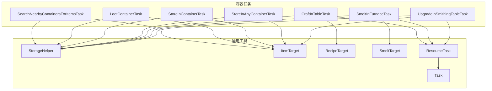
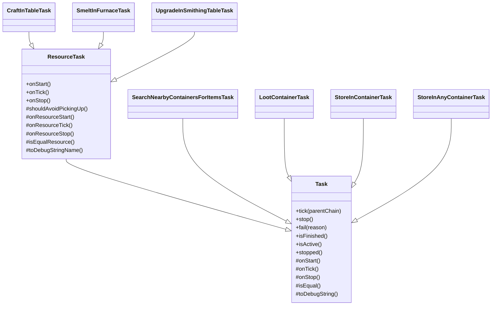
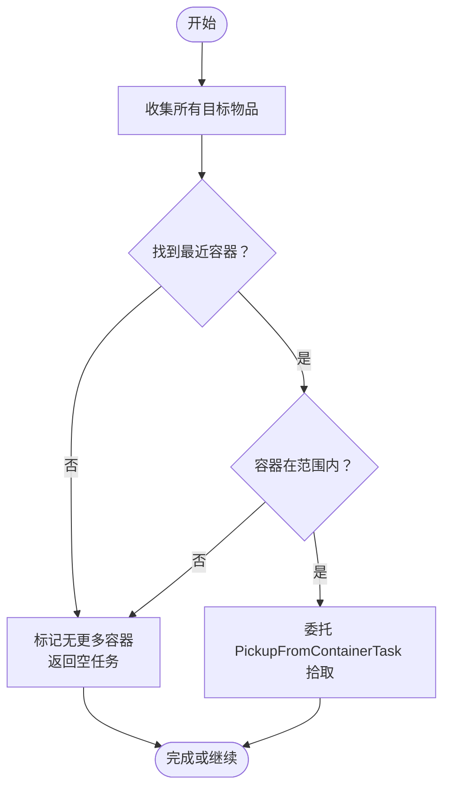
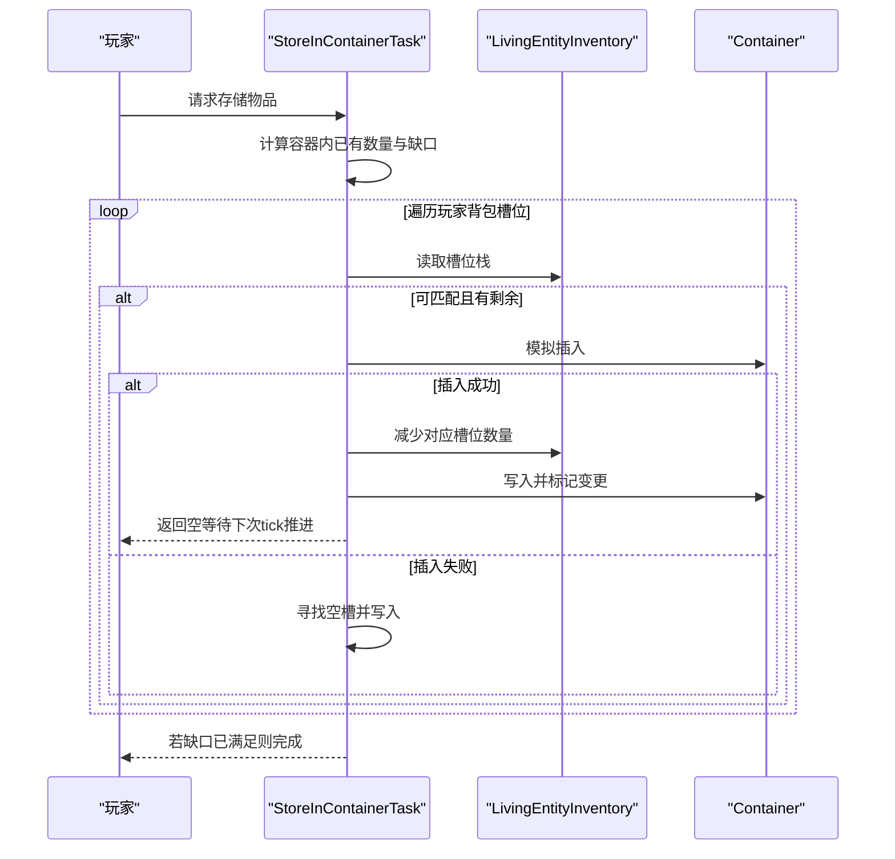
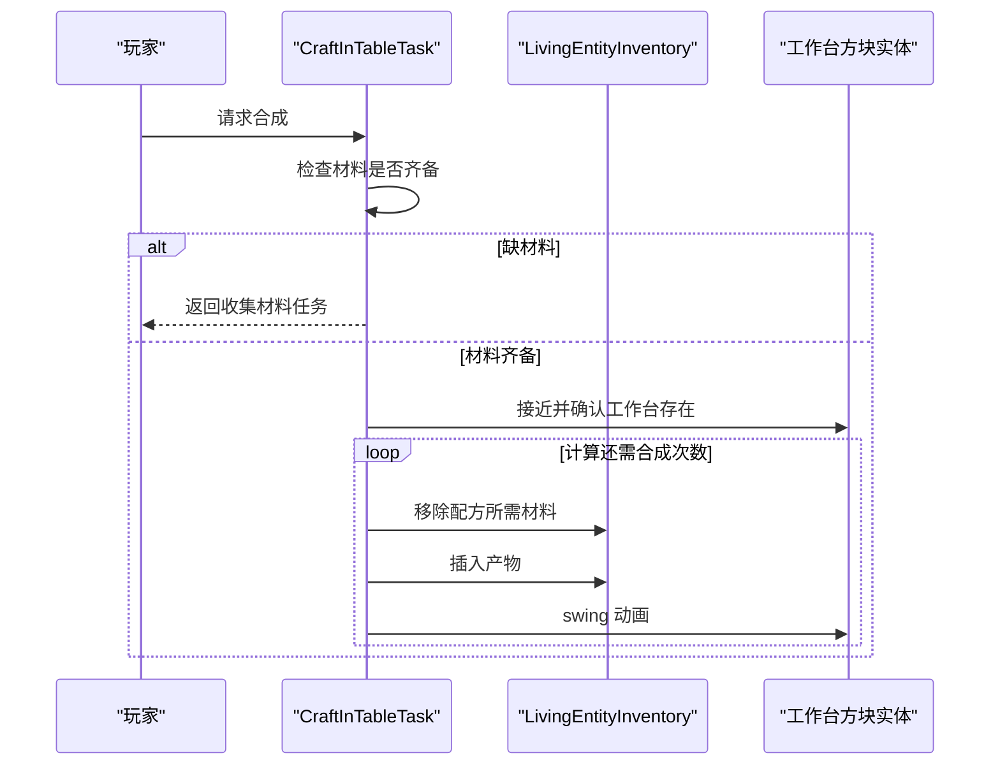
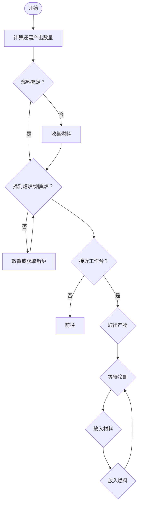
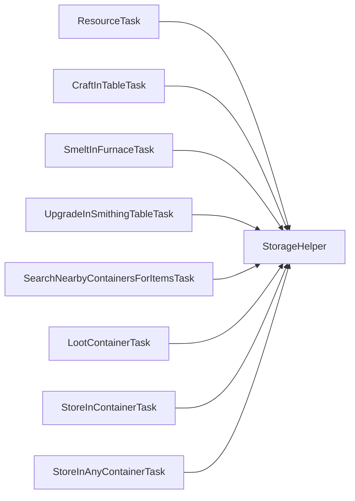

# 容器任务

<cite>
**本文引用的文件**
- [SearchNearbyContainersForItemsTask.java](file://src/main/java/adris/altoclef/tasks/container/SearchNearbyContainersForItemsTask.java)
- [LootContainerTask.java](file://src/main/java/adris/altoclef/tasks/container/LootContainerTask.java)
- [CraftInTableTask.java](file://src/main/java/adris/altoclef/tasks/container/CraftInTableTask.java)
- [SmeltInFurnaceTask.java](file://src/main/java/adris/altoclef/tasks/container/SmeltInFurnaceTask.java)
- [UpgradeInSmithingTableTask.java](file://src/main/java/adris/altoclef/tasks/container/UpgradeInSmithingTableTask.java)
- [StoreInContainerTask.java](file://src/main/java/adris/altoclef/tasks/container/StoreInContainerTask.java)
- [StoreInAnyContainerTask.java](file://src/main/java/adris/altoclef/tasks/container/StoreInAnyContainerTask.java)
- [StorageHelper.java](file://src/main/java/adris/altoclef/util/helpers/StorageHelper.java)
- [ItemTarget.java](file://src/main/java/adris/altoclef/util/ItemTarget.java)
- [RecipeTarget.java](file://src/main/java/adris/altoclef/util/RecipeTarget.java)
- [SmeltTarget.java](file://src/main/java/adris/altoclef/util/SmeltTarget.java)
- [Task.java](file://src/main/java/adris/altoclef/tasksystem/Task.java)
- [ResourceTask.java](file://src/main/java/adris/altoclef/tasks/ResourceTask.java)
</cite>

## 目录
1. [简介](#简介)
2. [项目结构](#项目结构)
3. [核心组件](#核心组件)
4. [架构总览](#架构总览)
5. [详细组件分析](#详细组件分析)
6. [依赖分析](#依赖分析)
7. [性能考虑](#性能考虑)
8. [故障排查指南](#故障排查指南)
9. [结论](#结论)
10. [附录：使用示例与最佳实践](#附录使用示例与最佳实践)

## 简介
本文件面向“容器任务系统”，系统性梳理以下能力：
- 容器搜寻任务：范围限制、优先级排序与存储策略
- 物品存取任务：容器识别、槽位管理与批量操作
- 合成任务：工作台识别、材料匹配与合成流程
- 熔炼任务：燃料管理与产出控制
- 附魔升级任务：材料消耗与成功率计算
- 性能优化、缓存策略与错误处理机制
- 使用示例与最佳实践

## 项目结构
容器任务相关代码主要位于 tasks/container 与 util 以及 tasks/ResourceTask 的派生体系中；任务调度由 tasksystem/Task 提供统一生命周期与中断模型。

图表来源
- [SearchNearbyContainersForItemsTask.java:1-124](file://src/main/java/adris/altoclef/tasks/container/SearchNearbyContainersForItemsTask.java#L1-L124)
- [LootContainerTask.java:1-118](file://src/main/java/adris/altoclef/tasks/container/LootContainerTask.java#L1-L118)
- [CraftInTableTask.java:1-162](file://src/main/java/adris/altoclef/tasks/container/CraftInTableTask.java#L1-L162)
- [SmeltInFurnaceTask.java:1-238](file://src/main/java/adris/altoclef/tasks/container/SmeltInFurnaceTask.java#L1-L238)
- [UpgradeInSmithingTableTask.java:1-131](file://src/main/java/adris/altoclef/tasks/container/UpgradeInSmithingTableTask.java#L1-L131)
- [StoreInContainerTask.java:1-180](file://src/main/java/adris/altoclef/tasks/container/StoreInContainerTask.java#L1-L180)
- [StoreInAnyContainerTask.java:1-121](file://src/main/java/adris/altoclef/tasks/container/StoreInAnyContainerTask.java#L1-L121)
- [StorageHelper.java:1-313](file://src/main/java/adris/altoclef/util/helpers/StorageHelper.java#L1-L313)
- [ItemTarget.java:1-185](file://src/main/java/adris/altoclef/util/ItemTarget.java#L1-L185)
- [RecipeTarget.java:1-51](file://src/main/java/adris/altoclef/util/RecipeTarget.java#L1-L51)
- [SmeltTarget.java:1-47](file://src/main/java/adris/altoclef/util/SmeltTarget.java#L1-L47)
- [Task.java:1-181](file://src/main/java/adris/altoclef/tasksystem/Task.java#L1-L181)
- [ResourceTask.java:1-242](file://src/main/java/adris/altoclef/tasks/ResourceTask.java#L1-L242)

章节来源
- [SearchNearbyContainersForItemsTask.java:1-124](file://src/main/java/adris/altoclef/tasks/container/SearchNearbyContainersForItemsTask.java#L1-L124)
- [ResourceTask.java:1-242](file://src/main/java/adris/altoclef/tasks/ResourceTask.java#L1-L242)

## 核心组件
- 搜寻与拾取：SearchNearbyContainersForItemsTask 负责在限定范围内寻找最近的容器并委托 PickupFromContainerTask 进行拾取。
- 存储与搬运：StoreInContainerTask/StoreInAnyContainerTask 负责将物品放入指定或任意容器，支持批量移动与槽位合并。
- 合成：CraftInTableTask 通过工作台识别、材料匹配与计时器驱动完成合成。
- 熔炼：SmeltInFurnaceTask 动态计算所需燃料与材料，自动选择熔炉或烟熏炉，并处理产出与燃料补充。
- 升级：UpgradeInSmithingTableTask 在铁匠工作台进行附魔升级，管理模板、工具与材料的消耗。
- 工具与目标：ItemTarget/RecipeTarget/SmeltTarget 抽象化目标与配方；StorageHelper 提供库存检查、燃料统计、槽位查询等通用逻辑。

章节来源
- [SearchNearbyContainersForItemsTask.java:1-124](file://src/main/java/adris/altoclef/tasks/container/SearchNearbyContainersForItemsTask.java#L1-L124)
- [StoreInContainerTask.java:1-180](file://src/main/java/adris/altoclef/tasks/container/StoreInContainerTask.java#L1-L180)
- [StoreInAnyContainerTask.java:1-121](file://src/main/java/adris/altoclef/tasks/container/StoreInAnyContainerTask.java#L1-L121)
- [CraftInTableTask.java:1-162](file://src/main/java/adris/altoclef/tasks/container/CraftInTableTask.java#L1-L162)
- [SmeltInFurnaceTask.java:1-238](file://src/main/java/adris/altoclef/tasks/container/SmeltInFurnaceTask.java#L1-L238)
- [UpgradeInSmithingTableTask.java:1-131](file://src/main/java/adris/altoclef/tasks/container/UpgradeInSmithingTableTask.java#L1-L131)
- [StorageHelper.java:1-313](file://src/main/java/adris/altoclef/util/helpers/StorageHelper.java#L1-L313)
- [ItemTarget.java:1-185](file://src/main/java/adris/altoclef/util/ItemTarget.java#L1-L185)
- [RecipeTarget.java:1-51](file://src/main/java/adris/altoclef/util/RecipeTarget.java#L1-L51)
- [SmeltTarget.java:1-47](file://src/main/java/adris/altoclef/util/SmeltTarget.java#L1-L47)

## 架构总览
容器任务系统采用“资源任务 ResourceTask”作为基类，统一处理掉落物拾取、容器优先、挖掘采集与维度切换等横切关注点；具体容器任务（如熔炼、合成、升级）继承 ResourceTask 并在 onResourceTick 中实现领域逻辑。

图表来源
- [Task.java:1-181](file://src/main/java/adris/altoclef/tasksystem/Task.java#L1-L181)
- [ResourceTask.java:1-242](file://src/main/java/adris/altoclef/tasks/ResourceTask.java#L1-L242)
- [SearchNearbyContainersForItemsTask.java:1-124](file://src/main/java/adris/altoclef/tasks/container/SearchNearbyContainersForItemsTask.java#L1-L124)
- [LootContainerTask.java:1-118](file://src/main/java/adris/altoclef/tasks/container/LootContainerTask.java#L1-L118)
- [StoreInContainerTask.java:1-180](file://src/main/java/adris/altoclef/tasks/container/StoreInContainerTask.java#L1-L180)
- [StoreInAnyContainerTask.java:1-121](file://src/main/java/adris/altoclef/tasks/container/StoreInAnyContainerTask.java#L1-L121)
- [CraftInTableTask.java:1-162](file://src/main/java/adris/altoclef/tasks/container/CraftInTableTask.java#L1-L162)
- [SmeltInFurnaceTask.java:1-238](file://src/main/java/adris/altoclef/tasks/container/SmeltInFurnaceTask.java#L1-L238)
- [UpgradeInSmithingTableTask.java:1-131](file://src/main/java/adris/altoclef/tasks/container/UpgradeInSmithingTableTask.java#L1-L131)

## 详细组件分析

### 容器搜寻任务：范围限制、优先级排序与存储策略
- 范围限制：通过设置项中的“资源容器定位范围”限制有效容器距离，避免远距离无效寻路。
- 优先级排序：以“最近且包含目标物品”的容器为优先；若无可用容器则标记“无更多容器”，任务结束。
- 存储策略：先尝试从世界容器中获取，再回退到其他手段（如合成/挖掘），体现“优先利用现有资源”的策略。

图表来源
- [SearchNearbyContainersForItemsTask.java:95-122](file://src/main/java/adris/altoclef/tasks/container/SearchNearbyContainersForItemsTask.java#L95-L122)
- [ResourceTask.java:102-134](file://src/main/java/adris/altoclef/tasks/ResourceTask.java#L102-L134)

章节来源
- [SearchNearbyContainersForItemsTask.java:1-124](file://src/main/java/adris/altoclef/tasks/container/SearchNearbyContainersForItemsTask.java#L1-L124)
- [ResourceTask.java:1-242](file://src/main/java/adris/altoclef/tasks/ResourceTask.java#L1-L242)

### 物品存取任务：容器识别、槽位管理与批量操作
- 容器识别：支持箱子、陷阱箱、桶与潜影盒等容器类型；通过 BlockScanner/WorldHelper 判断是否可放置容器。
- 槽位管理：使用 LivingEntityInventory 与 Container 接口访问玩家背包与容器槽位；插入前模拟，失败后合并至已有堆叠或分配至空槽。
- 批量操作：按需移动指定数量，优先补齐容器内已有目标物品差额，减少多次往返。

图表来源
- [StoreInContainerTask.java:74-104](file://src/main/java/adris/altoclef/tasks/container/StoreInContainerTask.java#L74-L104)
- [StoreInContainerTask.java:147-178](file://src/main/java/adris/altoclef/tasks/container/StoreInContainerTask.java#L147-L178)

章节来源
- [StoreInContainerTask.java:1-180](file://src/main/java/adris/altoclef/tasks/container/StoreInContainerTask.java#L1-L180)
- [StoreInAnyContainerTask.java:1-121](file://src/main/java/adris/altoclef/tasks/container/StoreInAnyContainerTask.java#L1-L121)

### 合成任务：工作台识别、材料匹配与合成流程
- 工作台识别：优先使用附近的工作台；若缺失则请求或放置；接近后进入合成阶段。
- 材料匹配：基于 RecipeTarget/RecipeTarget.getRecipe().getSlots() 进行逐槽匹配与移除。
- 合成流程：计算还需合成次数，循环移除材料并插入产物；使用计时器避免瞬时高频交互。

图表来源
- [CraftInTableTask.java:64-141](file://src/main/java/adris/altoclef/tasks/container/CraftInTableTask.java#L64-L141)

章节来源
- [CraftInTableTask.java:1-162](file://src/main/java/adris/altoclef/tasks/container/CraftInTableTask.java#L1-L162)
- [RecipeTarget.java:1-51](file://src/main/java/adris/altoclef/util/RecipeTarget.java#L1-L51)

### 熔炼任务：燃料管理与产出控制
- 燃料管理：动态计算所需燃料数量（按产出缺口估算），使用库存燃料统计函数判断是否足够。
- 产出控制：优先使用烟熏炉（食物更快），否则使用熔炉；自动取出已产出物品并补充燃料与材料。
- 自动寻址：根据范围设置选择最近的有效熔炉/烟熏炉，若不存在则请求或放置。

图表来源
- [SmeltInFurnaceTask.java:72-221](file://src/main/java/adris/altoclef/tasks/container/SmeltInFurnaceTask.java#L72-L221)
- [StorageHelper.java:219-229](file://src/main/java/adris/altoclef/util/helpers/StorageHelper.java#L219-L229)

章节来源
- [SmeltInFurnaceTask.java:1-238](file://src/main/java/adris/altoclef/tasks/container/SmeltInFurnaceTask.java#L1-L238)
- [SmeltTarget.java:1-47](file://src/main/java/adris/altoclef/util/SmeltTarget.java#L1-L47)

### 附魔升级任务：材料消耗与成功率计算
- 材料消耗：模板、工具与材料各消耗 1 个；确保输出数量达标即完成。
- 成功率：当前实现未显式计算成功率，直接按 1:1 消耗与产出执行。
- 工作台：优先使用铁匠工作台，若缺失则请求或放置。

章节来源
- [UpgradeInSmithingTableTask.java:1-131](file://src/main/java/adris/altoclef/tasks/container/UpgradeInSmithingTableTask.java#L1-L131)

## 依赖分析
- 组件耦合
  - ResourceTask 作为抽象基类，统一了掉落物拾取、容器优先、维度切换等通用逻辑，具体容器任务仅需实现 onResourceTick。
  - StorageHelper 提供跨模块共享的库存检查、燃料统计、槽位查询等工具方法，降低重复实现。
- 外部依赖
  - BlockScanner/WorldHelper：用于容器与工作台的扫描与可达性判断。
  - IInventoryProvider/LivingEntityInventory：统一玩家背包与容器槽位访问接口。
  - MixinAbstractFurnaceBlockEntity：读取熔炉属性委托以判断燃料状态。

图表来源
- [ResourceTask.java:1-242](file://src/main/java/adris/altoclef/tasks/ResourceTask.java#L1-L242)
- [StorageHelper.java:1-313](file://src/main/java/adris/altoclef/util/helpers/StorageHelper.java#L1-L313)
- [CraftInTableTask.java:1-162](file://src/main/java/adris/altoclef/tasks/container/CraftInTableTask.java#L1-L162)
- [SmeltInFurnaceTask.java:1-238](file://src/main/java/adris/altoclef/tasks/container/SmeltInFurnaceTask.java#L1-L238)
- [UpgradeInSmithingTableTask.java:1-131](file://src/main/java/adris/altoclef/tasks/container/UpgradeInSmithingTableTask.java#L1-L131)
- [SearchNearbyContainersForItemsTask.java:1-124](file://src/main/java/adris/altoclef/tasks/container/SearchNearbyContainersForItemsTask.java#L1-L124)
- [LootContainerTask.java:1-118](file://src/main/java/adris/altoclef/tasks/container/LootContainerTask.java#L1-L118)
- [StoreInContainerTask.java:1-180](file://src/main/java/adris/altoclef/tasks/container/StoreInContainerTask.java#L1-L180)
- [StoreInAnyContainerTask.java:1-121](file://src/main/java/adris/altoclef/tasks/container/StoreInAnyContainerTask.java#L1-L121)

## 性能考虑
- 范围限制与短路：通过“资源容器定位范围/资源拾取范围/资源挖掘范围”等设置，避免无效寻路与扫描。
- 增量推进：每个任务在 onTick 中只做一步操作（如移动、取物、放物、合成计时），通过多次 tick 完成完整流程。
- 模拟插入：在 StoreInContainerTask 中先模拟插入，失败后再合并或分配空槽，减少无效写入。
- 材料预检：CraftInTableTask/SmeltInFurnaceTask 在进入工作台前进行材料齐备性检查，避免无效交互。
- 缓存策略：容器缓存（WritableCache）与容器扫描（getNearestBlock）配合，减少重复扫描成本。

章节来源
- [ResourceTask.java:180-182](file://src/main/java/adris/altoclef/tasks/ResourceTask.java#L180-L182)
- [StoreInContainerTask.java:73-104](file://src/main/java/adris/altoclef/tasks/container/StoreInContainerTask.java#L73-L104)
- [CraftInTableTask.java:114-119](file://src/main/java/adris/altoclef/tasks/container/CraftInTableTask.java#L114-L119)
- [SmeltInFurnaceTask.java:96-109](file://src/main/java/adris/altoclef/tasks/container/SmeltInFurnaceTask.java#L96-L109)

## 故障排查指南
- 容器不可用
  - 现象：Block at ... is not a lootable container. Stopping.
  - 处理：确认方块类型为可随机容器；检查容器缓存是否过期。
  - 参考
    - [LootContainerTask.java:87-91](file://src/main/java/adris/altoclef/tasks/container/LootContainerTask.java#L87-L91)
    - [StoreInContainerTask.java:67-70](file://src/main/java/adris/altoclef/tasks/container/StoreInContainerTask.java#L67-L70)
- 熔炉状态异常
  - 现象：Block at furnace position is not a furnace BE. Resetting.
  - 处理：重新扫描最近熔炉；确认方块状态与物品槽位非空。
  - 参考
    - [SmeltInFurnaceTask.java:214-218](file://src/main/java/adris/altoclef/tasks/container/SmeltInFurnaceTask.java#L214-L218)
- 材料不足
  - 现象：Not enough ingredients to craft...
  - 处理：返回收集材料任务；检查配方缺口与库存统计。
  - 参考
    - [CraftInTableTask.java:117-119](file://src/main/java/adris/altoclef/tasks/container/CraftInTableTask.java#L117-L119)
- 无法放置容器
  - 现象：找不到合适空间放置容器。
  - 处理：调整放置条件（上方无障碍、非地牢箱子等）；或直接获取容器。
  - 参考
    - [StoreInAnyContainerTask.java:67-78](file://src/main/java/adris/altoclef/tasks/container/StoreInAnyContainerTask.java#L67-L78)

章节来源
- [LootContainerTask.java:87-91](file://src/main/java/adris/altoclef/tasks/container/LootContainerTask.java#L87-L91)
- [StoreInContainerTask.java:67-70](file://src/main/java/adris/altoclef/tasks/container/StoreInContainerTask.java#L67-L70)
- [SmeltInFurnaceTask.java:214-218](file://src/main/java/adris/altoclef/tasks/container/SmeltInFurnaceTask.java#L214-L218)
- [CraftInTableTask.java:117-119](file://src/main/java/adris/altoclef/tasks/container/CraftInTableTask.java#L117-L119)
- [StoreInAnyContainerTask.java:67-78](file://src/main/java/adris/altoclef/tasks/container/StoreInAnyContainerTask.java#L67-L78)

## 结论
容器任务系统通过 ResourceTask 抽象出通用的资源获取路径，结合 StorageHelper 的库存与燃料工具，实现了从“容器搜寻—物品搬运—工作台合成/熔炼/升级”的闭环。通过范围限制、增量推进与模拟插入等策略，系统在功能完整性与运行效率之间取得平衡。后续可在成功率计算、容器缓存失效策略与批量移动吞吐优化方面进一步增强。

## 附录：使用示例与最佳实践
- 示例一：优先从容器获取资源
  - 步骤：构造 SearchNearbyContainersForItemsTask，传入 ItemTarget；在上层任务链中将其置于合成/挖掘之前。
  - 参考
    - [SearchNearbyContainersForItemsTask.java:95-104](file://src/main/java/adris/altoclef/tasks/container/SearchNearbyContainersForItemsTask.java#L95-L104)
- 示例二：批量存储至任意容器
  - 步骤：构造 StoreInAnyContainerTask，开启“若不足先获取”；系统会自动寻找最近可用容器或放置新容器。
  - 参考
    - [StoreInAnyContainerTask.java:37-79](file://src/main/java/adris/altoclef/tasks/container/StoreInAnyContainerTask.java#L37-L79)
- 示例三：合成指定数量物品
  - 步骤：构造 CraftInTableTask，传入 RecipeTarget 数组；系统会自动收集材料、放置工作台并执行合成。
  - 参考
    - [CraftInTableTask.java:32-43](file://src/main/java/adris/altoclef/tasks/container/CraftInTableTask.java#L32-L43)
- 示例四：熔炼指定数量材料
  - 步骤：构造 SmeltInFurnaceTask，传入 SmeltTarget；系统会根据缺口动态计算燃料与材料需求。
  - 参考
    - [SmeltInFurnaceTask.java:37-54](file://src/main/java/adris/altoclef/tasks/container/SmeltInFurnaceTask.java#L37-L54)
- 示例五：附魔升级
  - 步骤：构造 UpgradeInSmithingTableTask，传入工具、材料与输出 ItemTarget；系统会自动处理模板与装备卸下。
  - 参考
    - [UpgradeInSmithingTableTask.java:29-35](file://src/main/java/adris/altoclef/tasks/container/UpgradeInSmithingTableTask.java#L29-L35)
- 最佳实践
  - 合理设置“资源容器定位范围/资源拾取范围/资源挖掘范围”，避免无效寻路。
  - 在合成/熔炼前先进行材料齐备性检查，减少失败重试。
  - 使用模拟插入与槽位合并策略，提升批量操作吞吐。
  - 对于频繁使用的容器（如箱子），保持其附近可通行与可放置，减少反复扫描。