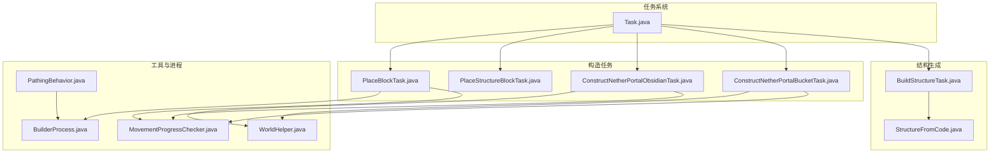
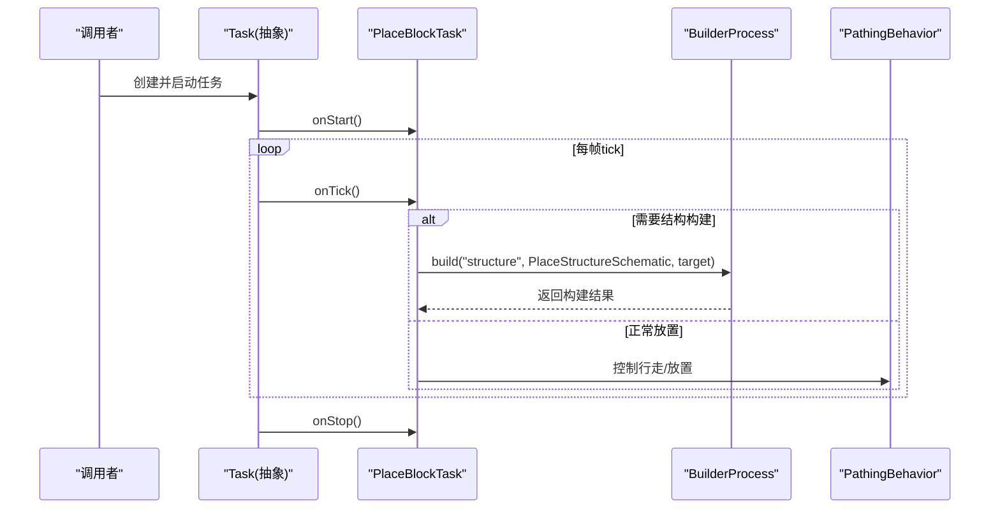
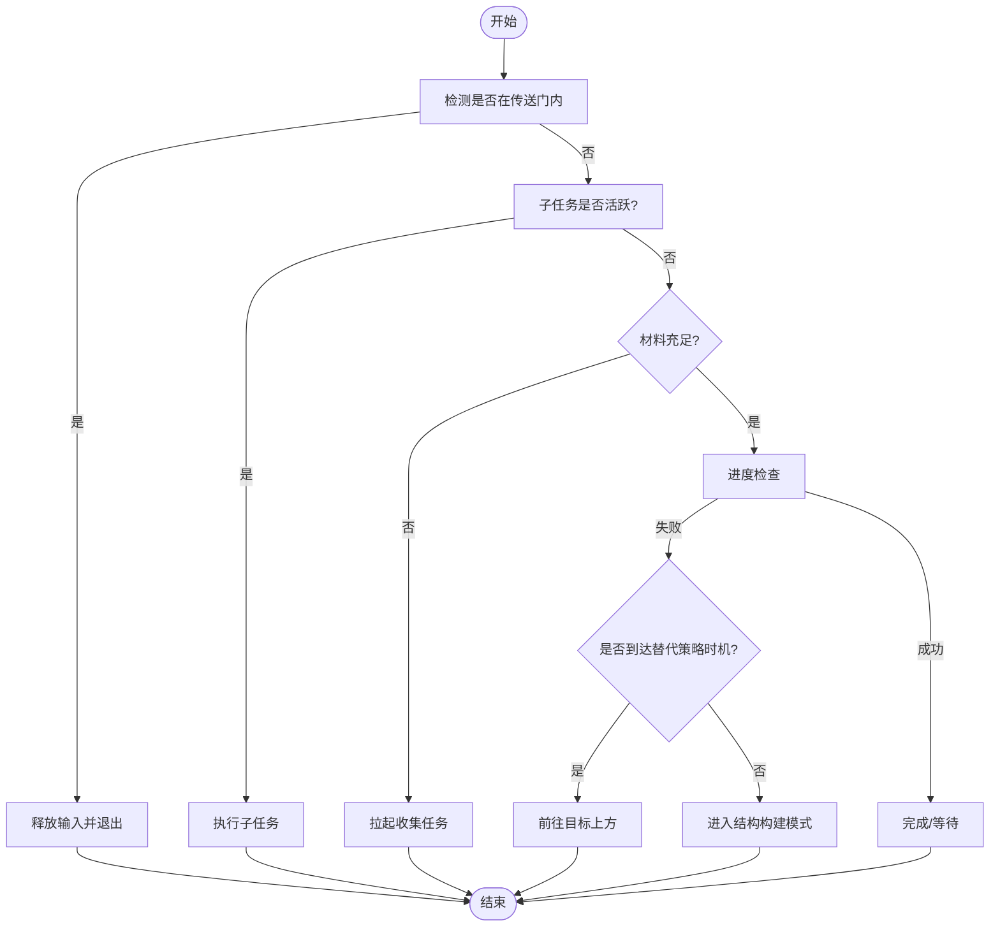
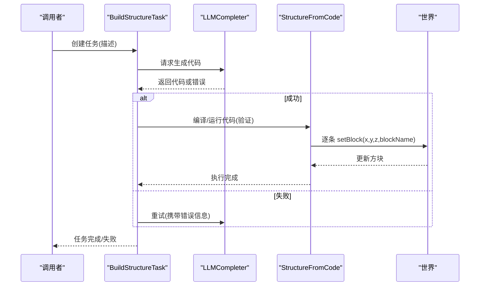
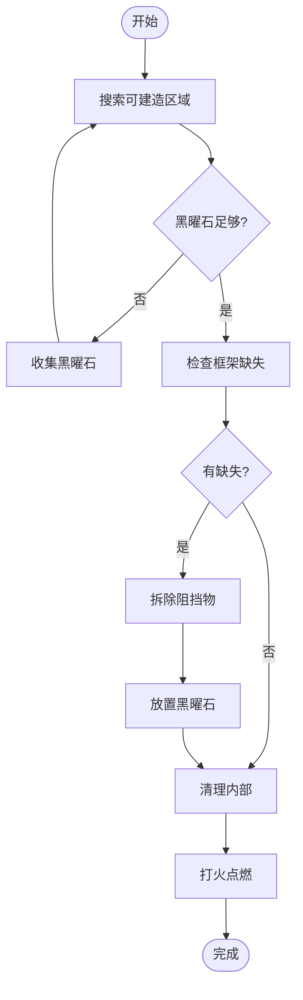
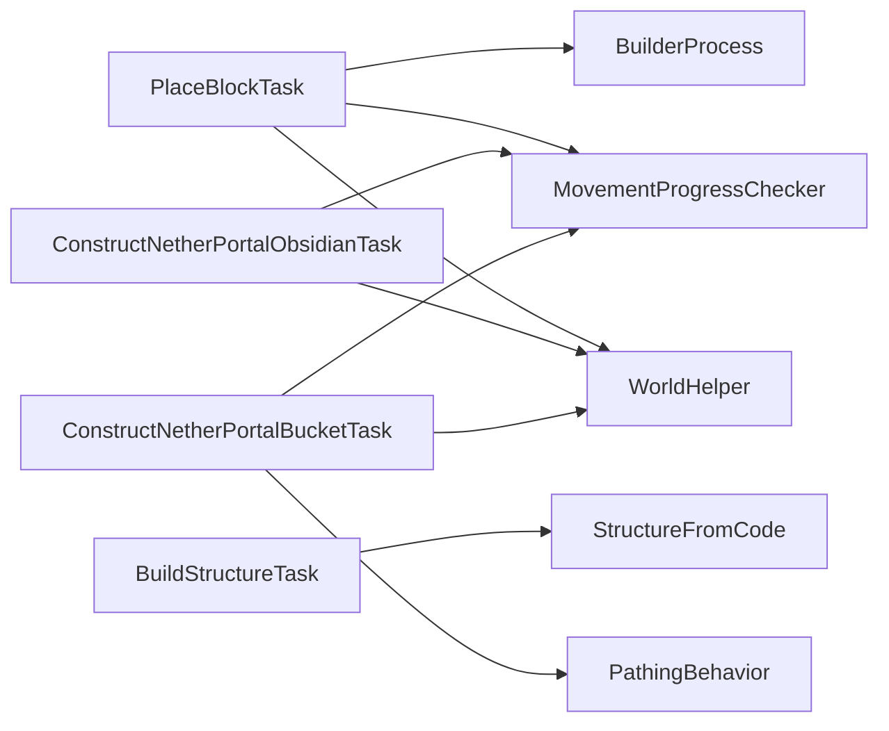

# 建造任务

<cite>
**本文引用的文件**
- [PlaceBlockTask.java](file://src/main/java/adris/altoclef/tasks/construction/PlaceBlockTask.java)
- [PlaceStructureBlockTask.java](file://src/main/java/adris/altoclef/tasks/construction/PlaceStructureBlockTask.java)
- [BuildStructureTask.java](file://src/main/java/adris/altoclef/tasks/construction/build_structure/BuildStructureTask.java)
- [StructureFromCode.java](file://src/main/java/adris/altoclef/tasks/construction/build_structure/StructureFromCode.java)
- [ConstructNetherPortalObsidianTask.java](file://src/main/java/adris/altoclef/tasks/construction/compound/ConstructNetherPortalObsidianTask.java)
- [ConstructNetherPortalBucketTask.java](file://src/main/java/adris/altoclef/tasks/construction/compound/ConstructNetherPortalBucketTask.java)
- [MovementProgressChecker.java](file://src/main/java/adris/altoclef/util/progresscheck/MovementProgressChecker.java)
- [Task.java](file://src/main/java/adris/altoclef/tasksystem/Task.java)
- [WorldHelper.java](file://src/main/java/adris/altoclef/util/helpers/WorldHelper.java)
- [BuilderProcess.java](file://src/main/java/baritone/process/BuilderProcess.java)
- [PathingBehavior.java](file://src/main/java/baritone/behavior/PathingBehavior.java)
</cite>

## 目录
1. [简介](#简介)
2. [项目结构](#项目结构)
3. [核心组件](#核心组件)
4. [架构总览](#架构总览)
5. [详细组件分析](#详细组件分析)
6. [依赖分析](#依赖分析)
7. [性能考量](#性能考量)
8. [故障排查指南](#故障排查指南)
9. [结论](#结论)
10. [附录](#附录)

## 简介
本技术文档围绕“建造任务系统”展开，重点覆盖以下方面：
- 方块放置任务的实现原理：位置计算、物品选择与放置精度控制
- 建筑结构任务的算法设计：结构识别、材料需求与施工顺序
- 复合建造任务的协调机制：多阶段任务组合与依赖管理
- 特殊结构（传送门）的实现细节
- 建造任务的配置参数、安全检查与错误恢复机制
- 具体建造流程示例与质量控制建议
- 常见建造失败问题与调试方法

## 项目结构
建造任务系统主要位于模块路径 tasks/construction 及其子包中，并与任务调度框架、世界辅助工具、路径与建造进程紧密协作。

图示来源
- [Task.java:1-181](file://src/main/java/adris/altoclef/tasksystem/Task.java#L1-L181)
- [PlaceBlockTask.java:1-208](file://src/main/java/adris/altoclef/tasks/construction/PlaceBlockTask.java#L1-L208)
- [PlaceStructureBlockTask.java:1-11](file://src/main/java/adris/altoclef/tasks/construction/PlaceStructureBlockTask.java#L1-L11)
- [BuildStructureTask.java:1-237](file://src/main/java/adris/altoclef/tasks/construction/build_structure/BuildStructureTask.java#L1-L237)
- [StructureFromCode.java:1-800](file://src/main/java/adris/altoclef/tasks/construction/build_structure/StructureFromCode.java#L1-L800)
- [ConstructNetherPortalObsidianTask.java:1-208](file://src/main/java/adris/altoclef/tasks/construction/compound/ConstructNetherPortalObsidianTask.java#L1-L208)
- [ConstructNetherPortalBucketTask.java:1-375](file://src/main/java/adris/altoclef/tasks/construction/compound/ConstructNetherPortalBucketTask.java#L1-L375)
- [MovementProgressChecker.java:1-58](file://src/main/java/adris/altoclef/util/progresscheck/MovementProgressChecker.java#L1-L58)
- [WorldHelper.java:1-200](file://src/main/java/adris/altoclef/util/helpers/WorldHelper.java#L1-L200)
- [BuilderProcess.java:774-788](file://src/main/java/baritone/process/BuilderProcess.java#L774-L788)
- [PathingBehavior.java:116-140](file://src/main/java/baritone/behavior/PathingBehavior.java#L116-L140)

章节来源
- [PlaceBlockTask.java:1-208](file://src/main/java/adris/altoclef/tasks/construction/PlaceBlockTask.java#L1-L208)
- [BuildStructureTask.java:1-237](file://src/main/java/adris/altoclef/tasks/construction/build_structure/BuildStructureTask.java#L1-L237)
- [StructureFromCode.java:1-800](file://src/main/java/adris/altoclef/tasks/construction/build_structure/StructureFromCode.java#L1-L800)
- [ConstructNetherPortalObsidianTask.java:1-208](file://src/main/java/adris/altoclef/tasks/construction/compound/ConstructNetherPortalObsidianTask.java#L1-L208)
- [ConstructNetherPortalBucketTask.java:1-375](file://src/main/java/adris/altoclef/tasks/construction/compound/ConstructNetherPortalBucketTask.java#L1-L375)
- [MovementProgressChecker.java:1-58](file://src/main/java/adris/altoclef/util/progresscheck/MovementProgressChecker.java#L1-L58)
- [Task.java:1-181](file://src/main/java/adris/altoclef/tasksystem/Task.java#L1-L181)
- [WorldHelper.java:1-200](file://src/main/java/adris/altoclef/util/helpers/WorldHelper.java#L1-L200)
- [BuilderProcess.java:774-788](file://src/main/java/baritone/process/BuilderProcess.java#L774-L788)
- [PathingBehavior.java:116-140](file://src/main/java/baritone/behavior/PathingBehavior.java#L116-L140)

## 核心组件
- 方块放置任务（PlaceBlockTask）
  - 负责在目标坐标放置指定方块，支持“可丢弃材料”与自动收集默认材料
  - 使用进度检查器与替代策略避免卡死，必要时切换到结构构建模式
- 结构生成任务（BuildStructureTask + StructureFromCode）
  - 通过提示词驱动 LLM 生成“迷你语言”代码，再由解释器逐步执行 setBlock 指令
  - 提供错误重试与历史对话记录，确保构建稳健性
- 传送门建造（ConstructNetherPortalObsidianTask / ConstructNetherPortalBucketTask）
  - 观察型/水桶法两种路径：前者直接使用黑曜石，后者利用水/熔岩交互生成黑曜石
  - 包含区域搜索、内部清理、点火等多阶段流程
- 进度与安全检查（MovementProgressChecker）
  - 同时监控移动距离与挖掘进度，失败则触发重试或放弃策略
- 任务框架（Task）
  - 统一的任务生命周期、中断与树形子任务管理

章节来源
- [PlaceBlockTask.java:27-168](file://src/main/java/adris/altoclef/tasks/construction/PlaceBlockTask.java#L27-L168)
- [BuildStructureTask.java:36-214](file://src/main/java/adris/altoclef/tasks/construction/build_structure/BuildStructureTask.java#L36-L214)
- [StructureFromCode.java:47-100](file://src/main/java/adris/altoclef/tasks/construction/build_structure/StructureFromCode.java#L47-L100)
- [ConstructNetherPortalObsidianTask.java:25-182](file://src/main/java/adris/altoclef/tasks/construction/compound/ConstructNetherPortalObsidianTask.java#L25-L182)
- [ConstructNetherPortalBucketTask.java:33-255](file://src/main/java/adris/altoclef/tasks/construction/compound/ConstructNetherPortalBucketTask.java#L33-L255)
- [MovementProgressChecker.java:8-57](file://src/main/java/adris/altoclef/util/progresscheck/MovementProgressChecker.java#L8-L57)
- [Task.java:17-96](file://src/main/java/adris/altoclef/tasksystem/Task.java#L17-L96)

## 架构总览
建造任务系统采用“任务编排 + 进程协作”的分层架构：
- 任务层：Task 抽象定义生命周期与子任务管理
- 执行层：PlaceBlockTask、BuildStructureTask、传送门任务等具体任务
- 工具层：WorldHelper 提供世界状态查询；MovementProgressChecker 提供安全检查
- 引擎层：Baritone 的 BuilderProcess 与 PathingBehavior 协同完成路径与建造

图示来源
- [Task.java:17-50](file://src/main/java/adris/altoclef/tasksystem/Task.java#L17-L50)
- [PlaceBlockTask.java:68-139](file://src/main/java/adris/altoclef/tasks/construction/PlaceBlockTask.java#L68-L139)
- [BuilderProcess.java:774-788](file://src/main/java/baritone/process/BuilderProcess.java#L774-L788)
- [PathingBehavior.java:116-140](file://src/main/java/baritone/behavior/PathingBehavior.java#L116-L140)

## 详细组件分析

### 方块放置任务（PlaceBlockTask）
- 位置计算与放置精度
  - 目标坐标 target 作为放置原点，使用 AbstractSchematic.desiredState 在原点处返回期望方块状态
  - 若启用可丢弃材料，则优先从允许的丢弃物品集合中选择匹配项
- 物品选择与库存管理
  - getMaterialCount 统计可用材料数量；当不足时自动拉起收集任务
  - 默认收集 DIRT、COBBLESTONE、NETHERRACK、COBBLED_DEEPSLATE 等基础材料
- 放置精度控制与容错
  - 使用 MovementProgressChecker 监控移动/挖掘进度，失败后尝试替代路径（如先上移再放置）
  - 当处于下界传送门附近时，释放输入以避免卡入传送门
- 完成条件
  - useThrowaways=true：只要目标位置为实体方块即视为完成
  - 否则需目标方块类型属于 toPlace 数组

图示来源
- [PlaceBlockTask.java:68-139](file://src/main/java/adris/altoclef/tasks/construction/PlaceBlockTask.java#L68-L139)
- [MovementProgressChecker.java:30-51](file://src/main/java/adris/altoclef/util/progresscheck/MovementProgressChecker.java#L30-L51)

章节来源
- [PlaceBlockTask.java:27-168](file://src/main/java/adris/altoclef/tasks/construction/PlaceBlockTask.java#L27-L168)
- [MovementProgressChecker.java:8-57](file://src/main/java/adris/altoclef/util/progresscheck/MovementProgressChecker.java#L8-L57)

### 结构生成任务（BuildStructureTask + StructureFromCode）
- 整体流程
  - 初始化对话历史与提示词，请求 LLM 生成代码
  - 代码验证通过后，逐条执行 setBlock 指令，实时在世界中设置方块
  - 若 LLM 或执行阶段出错，记录错误并重试，限制最大错误次数
- 语言与执行器
  - 支持 let/赋值、if/else、while、for、setBlock(x,y,z,blockName) 等语法
  - 解释器按步产出 setBlock 命令，便于与世界交互层解耦
- 错误恢复
  - 最大错误次数阈值保护，超过则终止任务
  - 执行错误时回退到重新请求 LLM 生成代码

图示来源
- [BuildStructureTask.java:36-214](file://src/main/java/adris/altoclef/tasks/construction/build_structure/BuildStructureTask.java#L36-L214)
- [StructureFromCode.java:47-100](file://src/main/java/adris/altoclef/tasks/construction/build_structure/StructureFromCode.java#L47-L100)
- [StructureFromCode.java:1340-1358](file://src/main/java/adris/altoclef/tasks/construction/build_structure/StructureFromCode.java#L1340-L1358)

章节来源
- [BuildStructureTask.java:23-237](file://src/main/java/adris/altoclef/tasks/construction/build_structure/BuildStructureTask.java#L23-L237)
- [StructureFromCode.java:23-100](file://src/main/java/adris/altoclef/tasks/construction/build_structure/StructureFromCode.java#L23-L100)

### 传送门建造（ConstructNetherPortalObsidianTask / ConstructNetherPortalBucketTask）
- 黑曜石法（Obsidian）
  - 寻找可建造区域，按框架与内部区域逐个检查
  - 材料不足时收集黑曜石；内部非空气方块则先拆除
  - 通过广搜找到最近的可放置面，再放置黑曜石；最后使用打火石点燃
- 水桶/熔岩法（Bucket）
  - 搜索熔岩湖，寻找可建造区域
  - 水桶与熔岩桶互补收集，按框架逐格放置
  - 清理水（避免冷却失败），最后打火点燃

图示来源
- [ConstructNetherPortalObsidianTask.java:63-182](file://src/main/java/adris/altoclef/tasks/construction/compound/ConstructNetherPortalObsidianTask.java#L63-L182)
- [ConstructNetherPortalBucketTask.java:167-255](file://src/main/java/adris/altoclef/tasks/construction/compound/ConstructNetherPortalBucketTask.java#L167-L255)

章节来源
- [ConstructNetherPortalObsidianTask.java:25-208](file://src/main/java/adris/altoclef/tasks/construction/compound/ConstructNetherPortalObsidianTask.java#L25-L208)
- [ConstructNetherPortalBucketTask.java:33-375](file://src/main/java/adris/altoclef/tasks/construction/compound/ConstructNetherPortalBucketTask.java#L33-L375)

### 复合建造任务的协调机制
- 任务树与中断
  - Task 维护子任务链，支持根据策略强制中断或平滑切换
  - 通过 canBeInterrupted 判定当前子任务是否可被新任务打断
- 多阶段组合
  - 传送门任务内部串联：收集材料 → 清理区域 → 放置 → 点火
  - 结构生成任务串联：请求代码 → 验证 → 执行 → 错误重试
- 依赖管理
  - 材料任务与放置任务之间存在显式依赖（材料不足则优先收集）
  - 世界状态变化（如方块被破坏）会触发进度检查与重算

章节来源
- [Task.java:152-164](file://src/main/java/adris/altoclef/tasksystem/Task.java#L152-L164)
- [MovementProgressChecker.java:30-51](file://src/main/java/adris/altoclef/util/progresscheck/MovementProgressChecker.java#L30-L51)

## 依赖分析
- PlaceBlockTask 依赖
  - Baritone BuilderProcess：用于结构化放置
  - MovementProgressChecker：安全检查
  - WorldHelper：传送门状态判断
- BuildStructureTask 依赖
  - Player2APIService / LLMCompleter：生成代码
  - StructureFromCode：解释执行 setBlock 指令
- 传送门任务依赖
  - WorldHelper：区域与方块状态检查
  - MovementProgressChecker：路径/破坏进度监控
  - Baritone PathingBehavior：路径行为与取消

图示来源
- [PlaceBlockTask.java:130-136](file://src/main/java/adris/altoclef/tasks/construction/PlaceBlockTask.java#L130-L136)
- [BuildStructureTask.java:36-76](file://src/main/java/adris/altoclef/tasks/construction/build_structure/BuildStructureTask.java#L36-L76)
- [StructureFromCode.java:87-100](file://src/main/java/adris/altoclef/tasks/construction/build_structure/StructureFromCode.java#L87-L100)
- [ConstructNetherPortalObsidianTask.java:63-182](file://src/main/java/adris/altoclef/tasks/construction/compound/ConstructNetherPortalObsidianTask.java#L63-L182)
- [ConstructNetherPortalBucketTask.java:167-255](file://src/main/java/adris/altoclef/tasks/construction/compound/ConstructNetherPortalBucketTask.java#L167-L255)
- [PathingBehavior.java:116-140](file://src/main/java/baritone/behavior/PathingBehavior.java#L116-L140)

章节来源
- [BuilderProcess.java:774-788](file://src/main/java/baritone/process/BuilderProcess.java#L774-L788)
- [PathingBehavior.java:116-140](file://src/main/java/baritone/behavior/PathingBehavior.java#L116-L140)

## 性能考量
- 结构生成
  - 代码验证阶段仅做静态检查，避免实际写入世界，降低开销
  - 解释器按步产出命令，适合与世界交互层解耦，便于异步化
- 放置任务
  - 使用 AbstractSchematic.desiredState 一次性确定目标状态，减少重复计算
  - 进度检查器对移动与挖掘分别评估，避免无效路径重算
- 传送门
  - 水桶法通过广搜快速定位可放置面，减少无效尝试
  - 区域搜索带超时与重置逻辑，防止长时间无效探索

## 故障排查指南
- 常见问题
  - 材料不足：检查 getMaterialCount 与收集任务是否正确触发
  - 无法放置：查看 MovementProgressChecker 是否判定失败，是否需要替代路径
  - 传送门无法点燃：确认打火石/火 charge 是否到位，内部是否清理干净
  - LLM 生成失败：查看 BuildStructureTask 的错误计数与重试逻辑
- 调试方法
  - 使用 Task 的调试状态输出与树形任务展示（getTaskTree）
  - 在关键节点打印 WorldHelper 的状态（如 isAir、isSolidBlock）
  - 观察 Baritone 的路径事件与 Builder 进程状态

章节来源
- [Task.java:98-104](file://src/main/java/adris/altoclef/tasksystem/Task.java#L98-L104)
- [Task.java:166-179](file://src/main/java/adris/altoclef/tasksystem/Task.java#L166-L179)
- [MovementProgressChecker.java:30-51](file://src/main/java/adris/altoclef/util/progresscheck/MovementProgressChecker.java#L30-L51)
- [BuildStructureTask.java:160-214](file://src/main/java/adris/altoclef/tasks/construction/build_structure/BuildStructureTask.java#L160-L214)

## 结论
该建造任务系统通过清晰的任务边界、稳健的错误恢复与多样的实现策略（直接放置、结构生成、传送门两类方案），实现了从简单方块到复杂结构的自动化建造。配合进度检查与路径行为控制，系统在复杂场景下仍保持较高的鲁棒性与可维护性。

## 附录
- 配置参数与要点
  - 放置任务
    - useThrowaways：是否接受可丢弃材料
    - autoCollectStructureBlocks：是否自动收集默认材料
    - 材料阈值：最低材料数量与偏好数量
  - 结构生成
    - 最大错误次数：超过则终止
    - 对话历史：包含提示词与上下文
  - 传送门
    - 区域尺寸与相对原点偏移
    - 水桶/熔岩桶/打火石的收集策略
- 质量控制建议
  - 在关键放置前进行状态预检（空地、非流体、非基岩）
  - 对长序列任务设置阶段性完成检查点
  - 对外部接口（LLM）增加幂等与重试策略