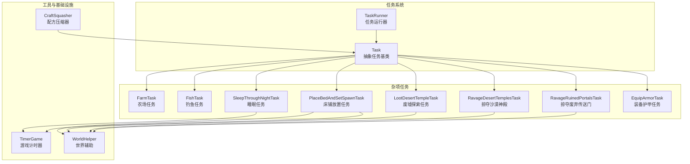
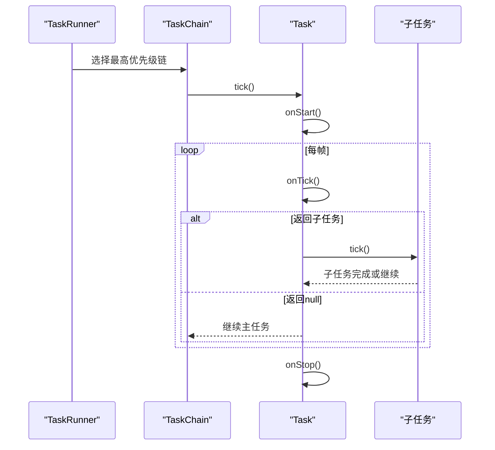
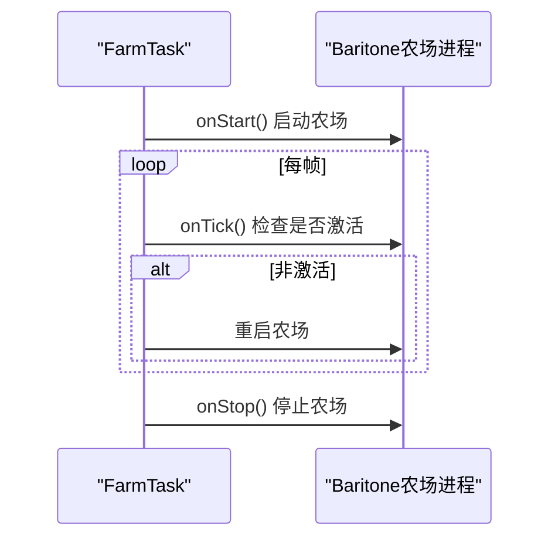
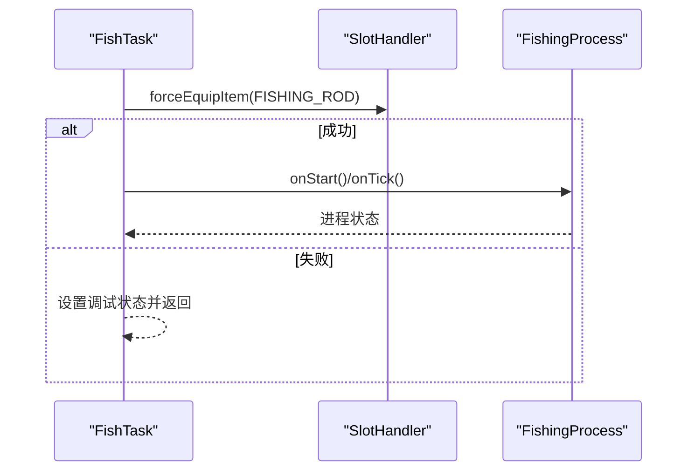
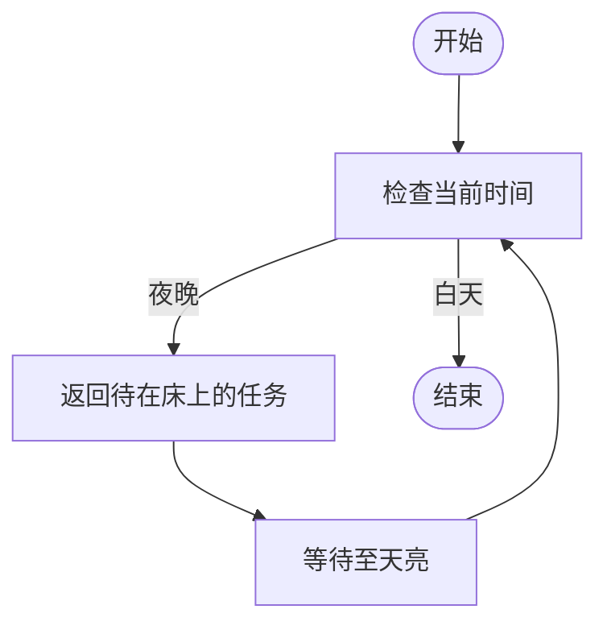
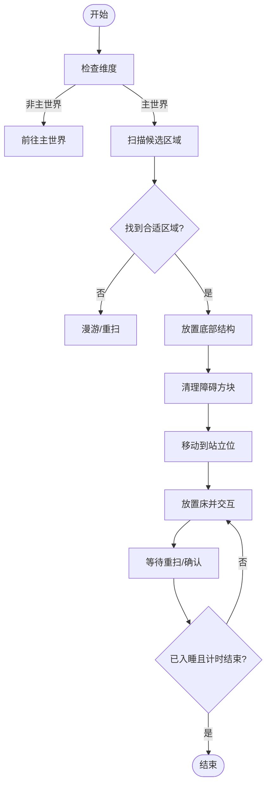
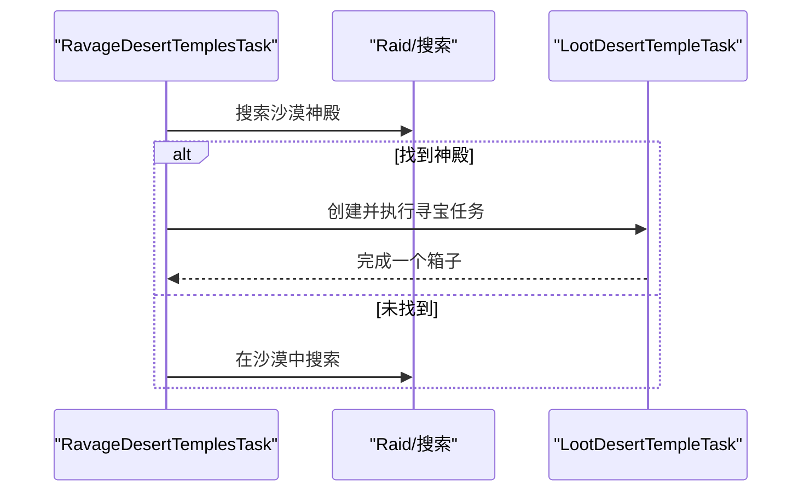
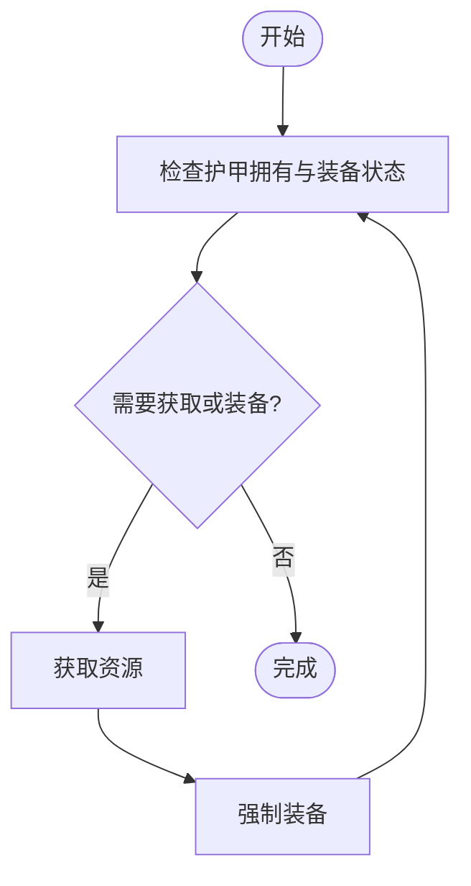
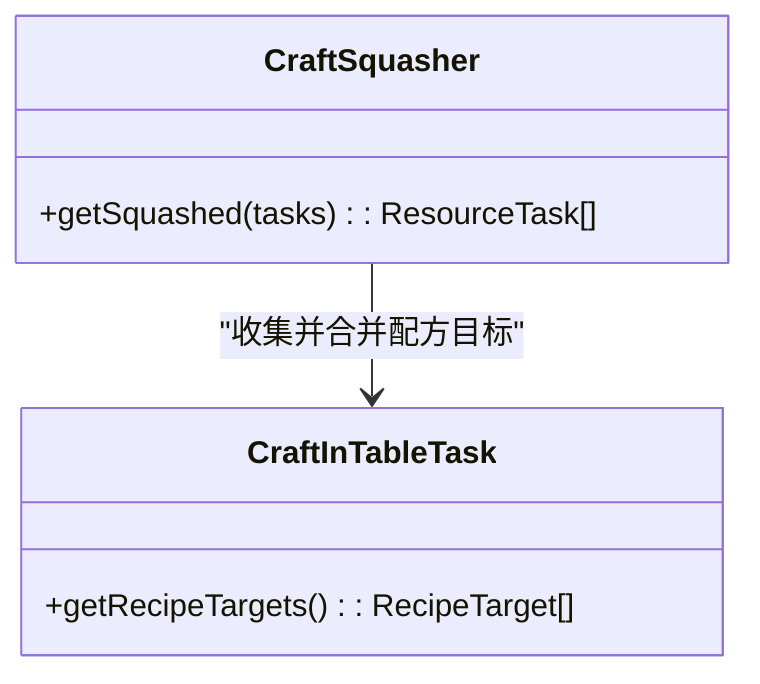
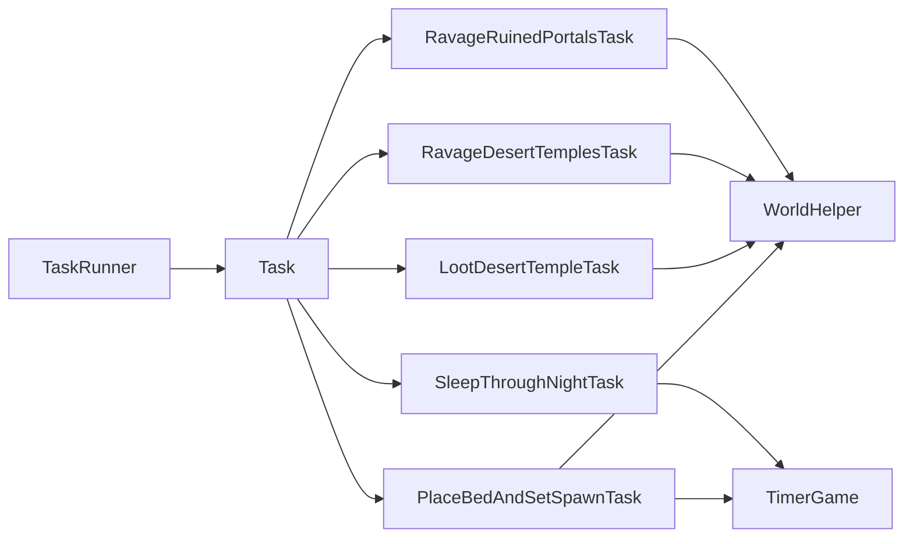

# 杂项任务

<cite>
**本文引用的文件**   
- [FarmTask.java](file://src/main/java/adris/altoclef/tasks/misc/FarmTask.java)
- [FishTask.java](file://src/main/java/adris/altoclef/tasks/misc/FishTask.java)
- [SleepThroughNightTask.java](file://src/main/java/adris/altoclef/tasks/misc/SleepThroughNightTask.java)
- [PlaceBedAndSetSpawnTask.java](file://src/main/java/adris/altoclef/tasks/misc/PlaceBedAndSetSpawnTask.java)
- [LootDesertTempleTask.java](file://src/main/java/adris/altoclef/tasks/misc/LootDesertTempleTask.java)
- [RavageDesertTemplesTask.java](file://src/main/java/adris/altoclef/tasks/misc/RavageDesertTemplesTask.java)
- [RavageRuinedPortalsTask.java](file://src/main/java/adris/altoclef/tasks/misc/RavageRuinedPortalsTask.java)
- [EquipArmorTask.java](file://src/main/java/adris/altoclef/tasks/misc/EquipArmorTask.java)
- [CraftSquasher.java](file://src/main/java/adris/altoclef/tasks/squashed/CraftSquasher.java)
- [Task.java](file://src/main/java/adris/altoclef/tasksystem/Task.java)
- [TaskRunner.java](file://src/main/java/adris/altoclef/tasksystem/TaskRunner.java)
- [WorldHelper.java](file://src/main/java/adris/altoclef/util/helpers/WorldHelper.java)
- [TimerGame.java](file://src/main/java/adris/altoclef/util/time/TimerGame.java)
</cite>

## 目录
1. [简介](#简介)
2. [项目结构](#项目结构)
3. [核心组件](#核心组件)
4. [架构总览](#架构总览)
5. [详细组件分析](#详细组件分析)
6. [依赖分析](#依赖分析)
7. [性能考虑](#性能考虑)
8. [故障排查指南](#故障排查指南)
9. [结论](#结论)
10. [附录](#附录)

## 简介
本技术文档聚焦于“杂项任务”子系统，涵盖农场自动化（种植与收获）、钓鱼（鱼群识别与最佳时机）、睡眠（时间控制与安全保护）、废墟探索（寻宝与风险评估）、床铺放置（位置选择与生存保障）、以及压缩任务（配方合并与批量处理）等能力。文档从系统架构、数据流、处理逻辑、集成点、错误处理与性能特性等方面进行深入解析，并提供可操作的配置建议、性能调优与扩展开发指南。

## 项目结构
杂项任务位于任务系统之下，采用“按功能域分层”的组织方式：tasks/misc 下存放具体任务；squashed 提供任务压缩器以合并同类任务；util 提供世界、时间等通用辅助能力；tasksystem 提供任务生命周期与调度框架。

图示来源
- [TaskRunner.java:1-98](file://src/main/java/adris/altoclef/tasksystem/TaskRunner.java#L1-L98)
- [Task.java:1-181](file://src/main/java/adris/altoclef/tasksystem/Task.java#L1-L181)
- [FarmTask.java:1-67](file://src/main/java/adris/altoclef/tasks/misc/FarmTask.java#L1-L67)
- [FishTask.java:1-53](file://src/main/java/adris/altoclef/tasks/misc/FishTask.java#L1-L53)
- [SleepThroughNightTask.java:1-35](file://src/main/java/adris/altoclef/tasks/misc/SleepThroughNightTask.java#L1-L35)
- [PlaceBedAndSetSpawnTask.java:1-434](file://src/main/java/adris/altoclef/tasks/misc/PlaceBedAndSetSpawnTask.java#L1-L434)
- [LootDesertTempleTask.java:1-77](file://src/main/java/adris/altoclef/tasks/misc/LootDesertTempleTask.java#L1-L77)
- [RavageDesertTemplesTask.java:1-89](file://src/main/java/adris/altoclef/tasks/misc/RavageDesertTemplesTask.java#L1-L89)
- [RavageRuinedPortalsTask.java:1-116](file://src/main/java/adris/altoclef/tasks/misc/RavageRuinedPortalsTask.java#L1-L116)
- [WorldHelper.java:1-200](file://src/main/java/adris/altoclef/util/helpers/WorldHelper.java#L1-L200)
- [TimerGame.java:1-45](file://src/main/java/adris/altoclef/util/time/TimerGame.java#L1-L45)
- [CraftSquasher.java:1-23](file://src/main/java/adris/altoclef/tasks/squashed/CraftSquasher.java#L1-L23)

章节来源
- [TaskRunner.java:1-98](file://src/main/java/adris/altoclef/tasksystem/TaskRunner.java#L1-L98)
- [Task.java:1-181](file://src/main/java/adris/altoclef/tasksystem/Task.java#L1-L181)

## 核心组件
- 任务系统基类与运行器：Task 定义了任务生命周期与中断策略；TaskRunner 负责在多条任务链中择优执行。
- 杂项任务：FarmTask、FishTask、SleepThroughNightTask、PlaceBedAndSetSpawnTask、LootDesertTempleTask、RavageDesertTemplesTask、RavageRuinedPortalsTask、EquipArmorTask。
- 工具与基础设施：WorldHelper 提供世界扫描、维度判断、床铺朝向等；TimerGame 提供基于游戏时间的计时；CraftSquasher 合并同类配方任务。

章节来源
- [Task.java:1-181](file://src/main/java/adris/altoclef/tasksystem/Task.java#L1-L181)
- [TaskRunner.java:1-98](file://src/main/java/adris/altoclef/tasksystem/TaskRunner.java#L1-L98)
- [WorldHelper.java:1-200](file://src/main/java/adris/altoclef/util/helpers/WorldHelper.java#L1-L200)
- [TimerGame.java:1-45](file://src/main/java/adris/altoclef/util/time/TimerGame.java#L1-L45)
- [CraftSquasher.java:1-23](file://src/main/java/adris/altoclef/tasks/squashed/CraftSquasher.java#L1-L23)

## 架构总览
杂项任务通过 TaskRunner 统一调度，每个任务在 onStart/onTick/onStop 生命周期内完成自身职责。复杂任务内部可组合其他子任务，形成任务树。世界与时间辅助模块贯穿多个任务，提供通用能力。

图示来源
- [TaskRunner.java:22-58](file://src/main/java/adris/altoclef/tasksystem/TaskRunner.java#L22-L58)
- [Task.java:17-77](file://src/main/java/adris/altoclef/tasksystem/Task.java#L17-L77)

## 详细组件分析

### 农场任务（自动化种植与收获）
- 功能要点
  - 自动启动 Baritone 的农场进程，支持指定范围与中心点，或默认就近农场。
  - 若进程非活动状态，自动重启农场进程，保持持续运行。
  - 通过调试状态输出当前农场状态，便于监控。
- 数据流与处理逻辑
  - onStart：根据传入参数调用 Baritone 农场进程。
  - onTick：检查进程是否激活，未激活则重启；设置调试状态。
  - onStop：若仍在运行，主动停止农场进程。
- 复杂度与性能
  - 单次启动开销低，主要成本在路径规划与交互；重复重启仅在进程丢失时触发，避免无效开销。
- 配置与扩展
  - 可通过构造函数传入范围与中心点，适配不同规模农场布局。
  - 扩展：可在 FarmTask 中加入作物轮作策略（如按作物成熟度排序），结合资源管理器进行播种与收获批次控制。

图示来源
- [FarmTask.java:21-50](file://src/main/java/adris/altoclef/tasks/misc/FarmTask.java#L21-L50)

章节来源
- [FarmTask.java:1-67](file://src/main/java/adris/altoclef/tasks/misc/FarmTask.java#L1-L67)

### 钓鱼任务（鱼群识别与最佳时机）
- 功能要点
  - 自动启动 Baritone 钓鱼进程，并强制装备钓鱼竿。
  - 若无钓鱼竿，返回空任务并提示无法钓鱼。
  - 进程非激活时自动重启，维持连续钓鱼。
- 数据流与处理逻辑
  - onStart：启动钓鱼进程。
  - onTick：尝试强制装备钓鱼竿；若进程未激活则重启；设置调试状态。
  - onStop：若进程在运行，停止进程。
- 复杂度与性能
  - 强制装备钓鱼竿为轻量操作；重启仅在进程丢失时发生。
- 配置与扩展
  - 可扩展为“鱼群识别”：通过扫描周围水面方块与实体，识别可钓鱼区域，再进入钓鱼进程。
  - 最佳时机：结合水桶与鱼群密度，动态选择最优下钩点与等待时间。

图示来源
- [FishTask.java:10-36](file://src/main/java/adris/altoclef/tasks/misc/FishTask.java#L10-L36)

章节来源
- [FishTask.java:1-53](file://src/main/java/adris/altoclef/tasks/misc/FishTask.java#L1-L53)

### 睡眠任务（时间控制与安全保护）
- 功能要点
  - 在夜晚进入“待在床上”模式，直到天亮（0-13000 刻）。
  - 使用 PlaceBedAndSetSpawnTask 的 stayInBed 方法确保持续睡眠。
- 数据流与处理逻辑
  - onTick：返回“待在床上”的床铺放置任务。
  - isFinished：根据世界时间判断是否结束（天亮后）。
- 复杂度与性能
  - 仅在夜晚切换到床铺放置任务，其余时间不消耗 CPU。
- 配置与扩展
  - 可增加“安全条件”：如附近无敌对生物、床已放置且可用等，再允许进入睡眠。

图示来源
- [SleepThroughNightTask.java:10-33](file://src/main/java/adris/altoclef/tasks/misc/SleepThroughNightTask.java#L10-L33)

章节来源
- [SleepThroughNightTask.java:1-35](file://src/main/java/adris/altoclef/tasks/misc/SleepThroughNightTask.java#L1-L35)

### 床铺放置任务（位置选择与生存保障）
- 功能要点
  - 选择合适区域：扫描周围地形，确保底部平台稳固、上方空间足够。
  - 清理障碍物：遇到不可破坏或不可通行的方块时，记录并跳过。
  - 放置结构与床：先放置底部结构，再清理必要方块，最后放置床并交互。
  - 安全保护：避免在地狱门框内、水中或危险区域放置床；在 Nether 时先回到主世界。
  - 计时与超时：使用 TimerGame 控制交互与等待，防止卡死。
- 数据流与处理逻辑
  - onStart：压栈行为栈，避免在床周围误破坏；初始化状态。
  - onTick：按顺序执行“寻找区域→放置结构→清理→移动到站立位→放置床→交互”；若检测到床已放置则等待重扫。
  - isFinished：在主世界且玩家已入睡并经过一定时间后结束。
- 复杂度与性能
  - 区域扫描为 O(r^3)，r 为扫描半径；通过计时器与进度检查避免重复扫描。
- 配置与扩展
  - 可扩展为“多床策略”：在多个候选区域预设床，减少重复放置成本。
  - 可加入“环境风险评估”：统计附近怪物生成点、光照等级等指标，选择更安全的区域。

图示来源
- [PlaceBedAndSetSpawnTask.java:136-307](file://src/main/java/adris/altoclef/tasks/misc/PlaceBedAndSetSpawnTask.java#L136-L307)
- [TimerGame.java:12-43](file://src/main/java/adris/altoclef/util/time/TimerGame.java#L12-L43)

章节来源
- [PlaceBedAndSetSpawnTask.java:1-434](file://src/main/java/adris/altoclef/tasks/misc/PlaceBedAndSetSpawnTask.java#L1-L434)

### 废墟探索任务（寻宝策略与风险评估）
- 沙漠神殿（LootDesertTempleTask）
  - 寻找压力板触发的神殿入口，依次打开四个箱子（相对坐标偏移）。
  - 对压力板进行破坏以进入房间；完成后移除“避免踩压力板”设置。
- 掠夺沙漠神殿（RavageDesertTemplesTask）
  - 先确保有足够工具（如木镐），再搜索沙漠神殿并执行寻宝。
  - 若无目标，则在沙漠生物群系内搜索。
- 废弃传送门（RavageRuinedPortalsTask）
  - 在主世界扫描未开启的箱子，过滤掉非可掠夺的箱子（如不在熔岩区或海拔过低）。
  - 对可掠取的箱子执行寻宝，否则继续漫游。

图示来源
- [RavageDesertTemplesTask.java:45-66](file://src/main/java/adris/altoclef/tasks/misc/RavageDesertTemplesTask.java#L45-L66)
- [LootDesertTempleTask.java:24-51](file://src/main/java/adris/altoclef/tasks/misc/LootDesertTempleTask.java#L24-L51)
- [RavageRuinedPortalsTask.java:54-66](file://src/main/java/adris/altoclef/tasks/misc/RavageRuinedPortalsTask.java#L54-L66)

章节来源
- [LootDesertTempleTask.java:1-77](file://src/main/java/adris/altoclef/tasks/misc/LootDesertTempleTask.java#L1-L77)
- [RavageDesertTemplesTask.java:1-89](file://src/main/java/adris/altoclef/tasks/misc/RavageDesertTemplesTask.java#L1-L89)
- [RavageRuinedPortalsTask.java:1-116](file://src/main/java/adris/altoclef/tasks/misc/RavageRuinedPortalsTask.java#L1-L116)
- [WorldHelper.java:163-177](file://src/main/java/adris/altoclef/util/helpers/WorldHelper.java#L163-L177)

### 装备护甲任务（资源管理与批量处理）
- 功能要点
  - 检查所需护甲是否已装备或库存存在；若缺失则通过 CataloguedResourceTask 获取。
  - 逐件强制装备，完成后任务结束。
- 数据流与处理逻辑
  - onTick：筛选未装备/未拥有的护甲，优先获取资源，再强制装备。
  - isFinished：所有目标护甲均已装备。
- 复杂度与性能
  - 资源获取与装备为轻量操作；批量处理通过数组遍历实现。
- 配置与扩展
  - 可扩展为“护甲优先级”：按耐久度、属性或套装效果排序，优先补齐关键部位。

图示来源
- [EquipArmorTask.java:25-45](file://src/main/java/adris/altoclef/tasks/misc/EquipArmorTask.java#L25-L45)

章节来源
- [EquipArmorTask.java:1-67](file://src/main/java/adris/altoclef/tasks/misc/EquipArmorTask.java#L1-L67)

### 压缩任务（配方优化与批量处理）
- 功能要点
  - CraftSquasher 将多个合成任务合并为单个任务，统一收集配方目标，减少重复开销。
- 数据流与处理逻辑
  - 遍历输入任务列表，收集所有 RecipeTarget，生成单一合成任务。
- 复杂度与性能
  - 时间复杂度 O(n)（n 为任务数），空间复杂度 O(m)（m 为配方目标总数）。
- 配置与扩展
  - 可扩展为“配方去重与优先级”：合并相同物品的不同配方，选择效率更高者。

图示来源
- [CraftSquasher.java:11-22](file://src/main/java/adris/altoclef/tasks/squashed/CraftSquasher.java#L11-L22)

章节来源
- [CraftSquasher.java:1-23](file://src/main/java/adris/altoclef/tasks/squashed/CraftSquasher.java#L1-L23)

## 依赖分析
- 任务系统耦合
  - TaskRunner 与 Task：运行器负责择优执行，任务负责自身生命周期与子任务管理。
  - TaskRunner 与 TaskChain：多链路并行，按优先级切换。
- 杂项任务与工具模块
  - PlaceBedAndSetSpawnTask、LootDesertTempleTask、RavageDesertTemplesTask、RavageRuinedPortalsTask 依赖 WorldHelper 进行世界扫描与判定。
  - 睡眠与床铺任务依赖 TimerGame 进行计时。
- 任务间组合
  - SleepThroughNightTask 组合 PlaceBedAndSetSpawnTask；RavageDesertTemplesTask 组合 LootDesertTempleTask 与搜索任务。

图示来源
- [TaskRunner.java:22-58](file://src/main/java/adris/altoclef/tasksystem/TaskRunner.java#L22-L58)
- [Task.java:17-77](file://src/main/java/adris/altoclef/tasksystem/Task.java#L17-L77)
- [PlaceBedAndSetSpawnTask.java:136-307](file://src/main/java/adris/altoclef/tasks/misc/PlaceBedAndSetSpawnTask.java#L136-L307)
- [LootDesertTempleTask.java:24-51](file://src/main/java/adris/altoclef/tasks/misc/LootDesertTempleTask.java#L24-L51)
- [RavageDesertTemplesTask.java:45-66](file://src/main/java/adris/altoclef/tasks/misc/RavageDesertTemplesTask.java#L45-L66)
- [RavageRuinedPortalsTask.java:54-66](file://src/main/java/adris/altoclef/tasks/misc/RavageRuinedPortalsTask.java#L54-L66)
- [WorldHelper.java:163-177](file://src/main/java/adris/altoclef/util/helpers/WorldHelper.java#L163-L177)
- [TimerGame.java:12-43](file://src/main/java/adris/altoclef/util/time/TimerGame.java#L12-L43)

章节来源
- [TaskRunner.java:1-98](file://src/main/java/adris/altoclef/tasksystem/TaskRunner.java#L1-L98)
- [Task.java:1-181](file://src/main/java/adris/altoclef/tasksystem/Task.java#L1-L181)

## 性能考虑
- 任务粒度与合并
  - 使用 CraftSquasher 合并同类合成任务，降低重复开销。
- 扫描与重扫
  - PlaceBedAndSetSpawnTask 使用计时器限制扫描频率，避免频繁重扫。
- 进程重启与中断
  - FarmTask、FishTask 在进程丢失时才重启，减少无效调用。
- 资源获取与批量处理
  - EquipArmorTask 一次性检查并批量获取缺失护甲，减少多次往返。

## 故障排查指南
- 钓鱼失败（无钓鱼竿）
  - 现象：任务提示无法钓鱼。
  - 处理：先获取钓鱼竿，再启动钓鱼任务。
  - 参考
    - [FishTask.java:17-20](file://src/main/java/adris/altoclef/tasks/misc/FishTask.java#L17-L20)
- 床铺放置失败
  - 现象：无法放置床或反复重扫。
  - 处理：检查周围方块是否可破坏；确认维度为主世界；确保有床。
  - 参考
    - [PlaceBedAndSetSpawnTask.java:218-230](file://src/main/java/adris/altoclef/tasks/misc/PlaceBedAndSetSpawnTask.java#L218-L230)
    - [WorldHelper.java:110-119](file://src/main/java/adris/altoclef/util/helpers/WorldHelper.java#L110-L119)
- 睡眠未生效
  - 现象：夜晚不进入睡眠。
  - 处理：确认已放置床并处于主世界；检查是否有敌对生物威胁。
  - 参考
    - [SleepThroughNightTask.java:31-33](file://src/main/java/adris/altoclef/tasks/misc/SleepThroughNightTask.java#L31-L33)
    - [PlaceBedAndSetSpawnTask.java:334-347](file://src/main/java/adris/altoclef/tasks/misc/PlaceBedAndSetSpawnTask.java#L334-L347)
- 废墟探索无目标
  - 现象：找不到可掠夺的箱子或神殿。
  - 处理：确认当前维度正确；检查过滤条件（如海拔、熔岩区）。
  - 参考
    - [RavageRuinedPortalsTask.java:104-114](file://src/main/java/adris/altoclef/tasks/misc/RavageRuinedPortalsTask.java#L104-L114)
    - [RavageDesertTemplesTask.java:58-66](file://src/main/java/adris/altoclef/tasks/misc/RavageDesertTemplesTask.java#L58-L66)

章节来源
- [FishTask.java:17-20](file://src/main/java/adris/altoclef/tasks/misc/FishTask.java#L17-L20)
- [PlaceBedAndSetSpawnTask.java:218-230](file://src/main/java/adris/altoclef/tasks/misc/PlaceBedAndSetSpawnTask.java#L218-L230)
- [SleepThroughNightTask.java:31-33](file://src/main/java/adris/altoclef/tasks/misc/SleepThroughNightTask.java#L31-L33)
- [RavageRuinedPortalsTask.java:104-114](file://src/main/java/adris/altoclef/tasks/misc/RavageRuinedPortalsTask.java#L104-L114)
- [RavageDesertTemplesTask.java:58-66](file://src/main/java/adris/altoclef/tasks/misc/RavageDesertTemplesTask.java#L58-L66)

## 结论
杂项任务系统通过清晰的任务边界与可组合的子任务设计，实现了从资源采集到生存保障的完整闭环。借助工具模块与计时器，系统在保证安全性的同时提升了执行效率。未来可在作物轮作、鱼群识别、寻宝策略与配方优化等方面进一步扩展，以适应更复杂的自动化需求。

## 附录
- 使用场景建议
  - 农场：配合资源管理器设定播种与收获批次，结合 CraftSquasher 批量合成工具。
  - 钓鱼：在安全水域设置固定锚点，结合“鱼群识别”策略提升收益。
  - 睡眠：优先在主世界、光照充足、无敌对生物的区域放置床。
  - 废墟探索：先准备工具与食物，再按“压力板→箱子”的顺序执行。
  - 装备：按优先级补齐关键部位护甲，避免频繁更换。
- 扩展开发指南
  - 新增任务：继承 Task，实现 onStart/onTick/onStop/isFinished，并在任务树中组合子任务。
  - 工具模块：在 WorldHelper 中新增扫描与判定方法，供多任务复用。
  - 性能优化：引入缓存与去重策略，减少重复扫描与交互。