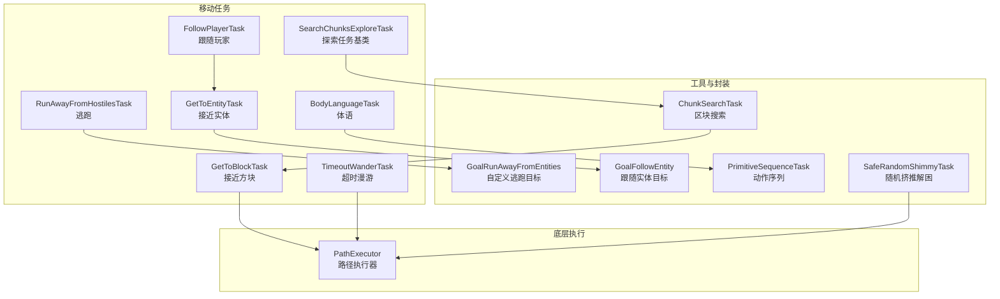
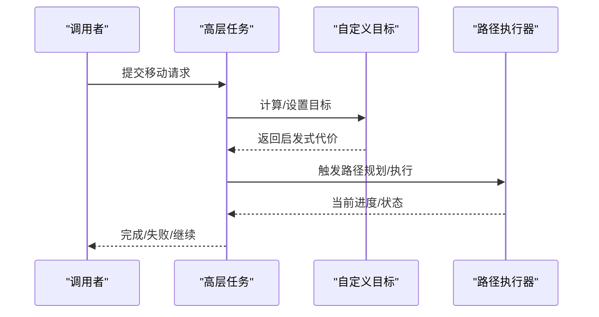
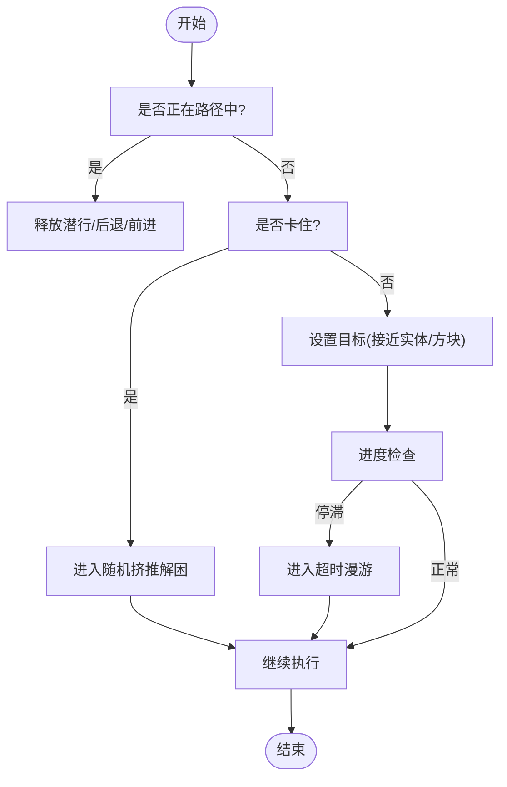
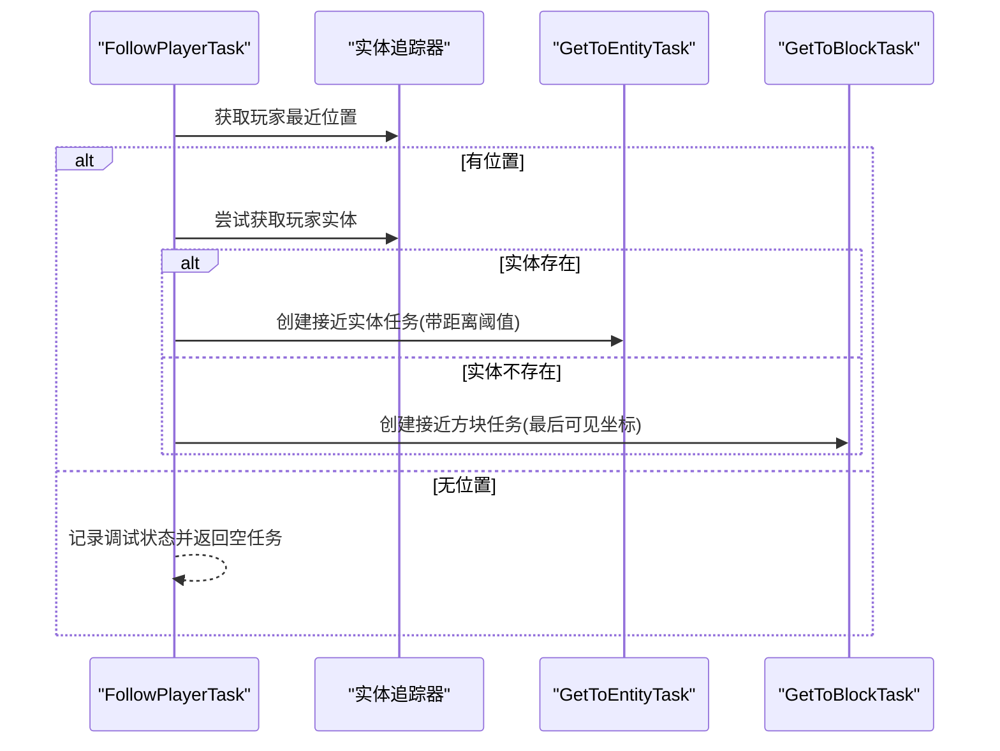
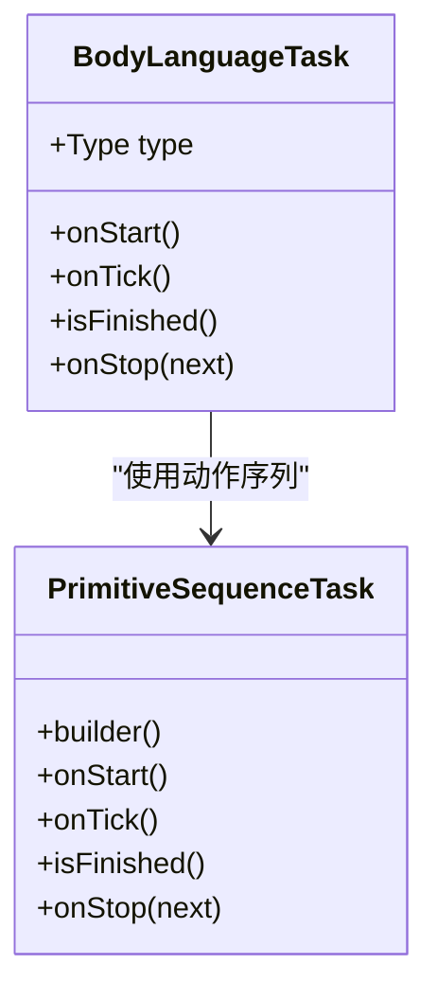
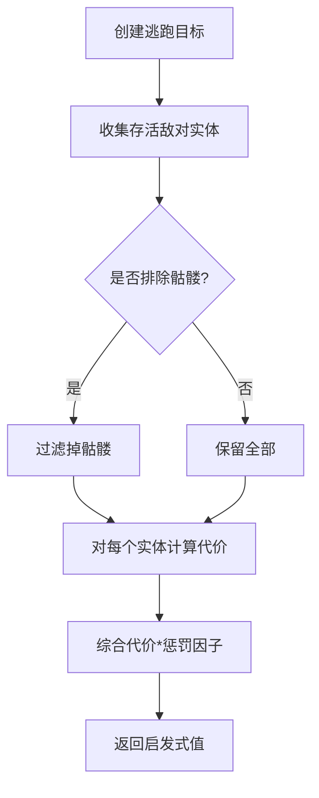
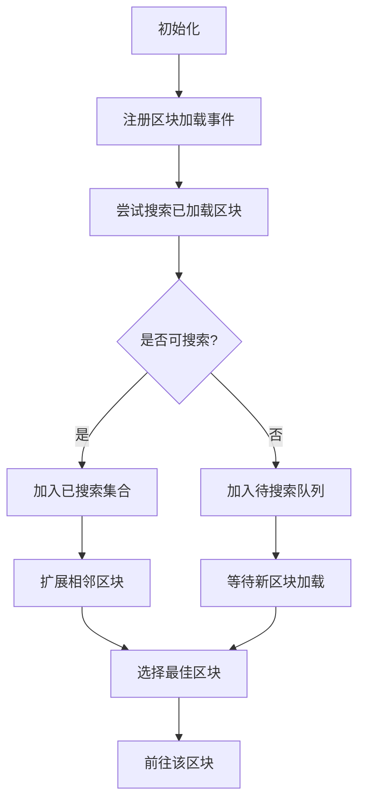
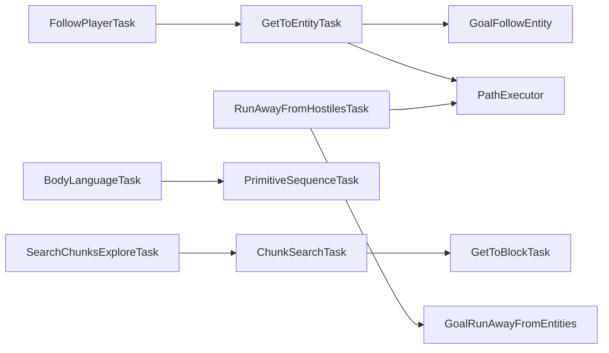

# 移动任务

<cite>
**本文引用的文件**
- [BodyLanguageTask.java](file://src/main/java/adris/altoclef/tasks/movement/BodyLanguageTask.java)
- [PrimitiveSequenceTask.java](file://src/main/java/adris/altoclef/tasks/movement/PrimitiveSequenceTask.java)
- [FollowPlayerTask.java](file://src/main/java/adris/altoclef/tasks/movement/FollowPlayerTask.java)
- [GetToEntityTask.java](file://src/main/java/adris/altoclef/tasks/movement/GetToEntityTask.java)
- [GetToBlockTask.java](file://src/main/java/adris/altoclef/tasks/movement/GetToBlockTask.java)
- [TimeoutWanderTask.java](file://src/main/java/adris/altoclef/tasks/movement/TimeoutWanderTask.java)
- [RunAwayFromHostilesTask.java](file://src/main/java/adris/altoclef/tasks/movement/RunAwayFromHostilesTask.java)
- [GoalRunAwayFromEntities.java](file://src/main/java/adris/altoclef/util/baritone/GoalRunAwayFromEntities.java)
- [GoalFollowEntity.java](file://src/main/java/adris/altoclef/util/baritone/GoalFollowEntity.java)
- [ChunkSearchTask.java](file://src/main/java/adris/altoclef/tasks/movement/ChunkSearchTask.java)
- [SearchChunksExploreTask.java](file://src/main/java/adris/altoclef/tasks/movement/SearchChunksExploreTask.java)
- [SafeRandomShimmyTask.java](file://src/main/java/adris/altoclef/tasks/movement/SafeRandomShimmyTask.java)
- [UnstuckChain.java](file://src/main/java/adris/altoclef/chains/UnstuckChain.java)
- [PathExecutor.java](file://src/main/java/baritone/pathing/path/PathExecutor.java)
</cite>

## 目录
1. [简介](#简介)
2. [项目结构](#项目结构)
3. [核心组件](#核心组件)
4. [架构总览](#架构总览)
5. [详细组件分析](#详细组件分析)
6. [依赖分析](#依赖分析)
7. [性能考量](#性能考量)
8. [故障排查指南](#故障排查指南)
9. [结论](#结论)
10. [附录](#附录)

## 简介
本文件面向“移动任务系统”，围绕以下主题展开：导航类任务（路径规划、目标定位、移动控制）、跟随任务（距离控制、路径预测与动态调整）、体语任务（社交互动与非语言表达）、逃跑任务（触发条件与避险策略）、探索任务（搜索算法与覆盖策略）。同时提供配置参数、性能优化建议与错误处理方案，并给出使用示例与常见问题解决方案。

## 项目结构
移动任务主要位于模块路径：
- tasks/movement：具体移动任务实现（如跟随、接近实体/方块、逃跑、探索等）
- util/baritone：自定义目标与行为封装（如“远离实体”“跟随实体”等）
- chains：行为链（如“解困链”）在更高层调度移动任务
- baritone/pathing/path：底层路径执行器（路径跳步、位置校正）

图示来源
- [FollowPlayerTask.java:11-75](file://src/main/java/adris/altoclef/tasks/movement/FollowPlayerTask.java#L11-L75)
- [GetToEntityTask.java:19-203](file://src/main/java/adris/altoclef/tasks/movement/GetToEntityTask.java#L19-L203)
- [GetToBlockTask.java:14-106](file://src/main/java/adris/altoclef/tasks/movement/GetToBlockTask.java#L14-L106)
- [TimeoutWanderTask.java:30-291](file://src/main/java/adris/altoclef/tasks/movement/TimeoutWanderTask.java#L30-L291)
- [RunAwayFromHostilesTask.java:15-62](file://src/main/java/adris/altoclef/tasks/movement/RunAwayFromHostilesTask.java#L15-L62)
- [BodyLanguageTask.java:10-211](file://src/main/java/adris/altoclef/tasks/movement/BodyLanguageTask.java#L10-L211)
- [SearchChunksExploreTask.java:13-117](file://src/main/java/adris/altoclef/tasks/movement/SearchChunksExploreTask.java#L13-L117)
- [GoalRunAwayFromEntities.java:11-93](file://src/main/java/adris/altoclef/util/baritone/GoalRunAwayFromEntities.java#L11-L93)
- [GoalFollowEntity.java:8-31](file://src/main/java/adris/altoclef/util/baritone/GoalFollowEntity.java#L8-L31)
- [PrimitiveSequenceTask.java:12-321](file://src/main/java/adris/altoclef/tasks/movement/PrimitiveSequenceTask.java#L12-L321)
- [ChunkSearchTask.java:16-159](file://src/main/java/adris/altoclef/tasks/movement/ChunkSearchTask.java#L16-L159)
- [SafeRandomShimmyTask.java:10-58](file://src/main/java/adris/altoclef/tasks/movement/SafeRandomShimmyTask.java#L10-L58)
- [PathExecutor.java:68-91](file://src/main/java/baritone/pathing/path/PathExecutor.java#L68-L91)

章节来源
- [FollowPlayerTask.java:11-75](file://src/main/java/adris/altoclef/tasks/movement/FollowPlayerTask.java#L11-L75)
- [GetToEntityTask.java:19-203](file://src/main/java/adris/altoclef/tasks/movement/GetToEntityTask.java#L19-L203)
- [GetToBlockTask.java:14-106](file://src/main/java/adris/altoclef/tasks/movement/GetToBlockTask.java#L14-L106)
- [TimeoutWanderTask.java:30-291](file://src/main/java/adris/altoclef/tasks/movement/TimeoutWanderTask.java#L30-L291)
- [RunAwayFromHostilesTask.java:15-62](file://src/main/java/adris/altoclef/tasks/movement/RunAwayFromHostilesTask.java#L15-L62)
- [BodyLanguageTask.java:10-211](file://src/main/java/adris/altoclef/tasks/movement/BodyLanguageTask.java#L10-L211)
- [SearchChunksExploreTask.java:13-117](file://src/main/java/adris/altoclef/tasks/movement/SearchChunksExploreTask.java#L13-L117)
- [GoalRunAwayFromEntities.java:11-93](file://src/main/java/adris/altoclef/util/baritone/GoalRunAwayFromEntities.java#L11-L93)
- [GoalFollowEntity.java:8-31](file://src/main/java/adris/altoclef/util/baritone/GoalFollowEntity.java#L8-L31)
- [PrimitiveSequenceTask.java:12-321](file://src/main/java/adris/altoclef/tasks/movement/PrimitiveSequenceTask.java#L12-L321)
- [ChunkSearchTask.java:16-159](file://src/main/java/adris/altoclef/tasks/movement/ChunkSearchTask.java#L16-L159)
- [SafeRandomShimmyTask.java:10-58](file://src/main/java/adris/altoclef/tasks/movement/SafeRandomShimmyTask.java#L10-L58)
- [PathExecutor.java:68-91](file://src/main/java/baritone/pathing/path/PathExecutor.java#L68-L91)

## 核心组件
- 导航与接近
  - 接近实体：通过“跟随实体目标”驱动路径规划，内置卡住检测与随机挤推解困。
  - 接近方块：基于“到达方块目标”，支持维度切换与楼梯偏好。
  - 超时漫游：在给定时间内或范围内探索，失败计数与范围扩展策略。
- 跟随
  - 跟随玩家：根据实体追踪器定位玩家，动态选择接近实体或接近方块目标。
- 逃跑
  - 远离敌对：自定义“远离实体目标”，按距离阈值与惩罚因子计算启发式代价。
- 探索
  - 区块搜索：广度优先扩展已加载区块，优先选择靠近起点且距离玩家较近的区块。
  - 探索任务基类：监听区块加载事件，自动启动子搜索任务并记录已搜索集合。
- 体语
  - 动作序列：通过“动作序列任务”编排输入与视角动作，形成问候、点头、摇头、胜利舞、坐下、挥手、跳舞、鞠躬、旋转等行为。
- 解困与路径执行
  - 随机挤推：强制潜行、前进与攻击按键，配合随机朝向，突破栅栏/藤蔓等卡点。
  - 路径执行器：当当前位置不在有效路径段内时，尝试跳步到后续有效段，提升鲁棒性。

章节来源
- [GetToEntityTask.java:19-203](file://src/main/java/adris/altoclef/tasks/movement/GetToEntityTask.java#L19-L203)
- [GetToBlockTask.java:14-106](file://src/main/java/adris/altoclef/tasks/movement/GetToBlockTask.java#L14-L106)
- [TimeoutWanderTask.java:30-291](file://src/main/java/adris/altoclef/tasks/movement/TimeoutWanderTask.java#L30-L291)
- [FollowPlayerTask.java:11-75](file://src/main/java/adris/altoclef/tasks/movement/FollowPlayerTask.java#L11-L75)
- [RunAwayFromHostilesTask.java:15-62](file://src/main/java/adris/altoclef/tasks/movement/RunAwayFromHostilesTask.java#L15-L62)
- [GoalRunAwayFromEntities.java:11-93](file://src/main/java/adris/altoclef/util/baritone/GoalRunAwayFromEntities.java#L11-L93)
- [SearchChunksExploreTask.java:13-117](file://src/main/java/adris/altoclef/tasks/movement/SearchChunksExploreTask.java#L13-L117)
- [ChunkSearchTask.java:16-159](file://src/main/java/adris/altoclef/tasks/movement/ChunkSearchTask.java#L16-L159)
- [BodyLanguageTask.java:10-211](file://src/main/java/adris/altoclef/tasks/movement/BodyLanguageTask.java#L10-L211)
- [PrimitiveSequenceTask.java:12-321](file://src/main/java/adris/altoclef/tasks/movement/PrimitiveSequenceTask.java#L12-L321)
- [SafeRandomShimmyTask.java:10-58](file://src/main/java/adris/altoclef/tasks/movement/SafeRandomShimmyTask.java#L10-L58)
- [PathExecutor.java:68-91](file://src/main/java/baritone/pathing/path/PathExecutor.java#L68-L91)

## 架构总览
移动任务系统采用“高层任务 + 自定义目标 + 底层执行”的分层设计：
- 任务层：负责状态管理、调试信息、失败重试与组合逻辑（如跟随、逃跑、探索、体语）。
- 目标层：将高层意图转化为可被路径引擎理解的目标（如“接近实体”“远离实体”“到达方块”）。
- 执行层：路径执行器在实际世界中推进角色，遇到异常时进行跳步与位置校正。

图示来源
- [GetToEntityTask.java:122-184](file://src/main/java/adris/altoclef/tasks/movement/GetToEntityTask.java#L122-L184)
- [GoalFollowEntity.java:8-31](file://src/main/java/adris/altoclef/util/baritone/GoalFollowEntity.java#L8-L31)
- [PathExecutor.java:68-91](file://src/main/java/baritone/pathing/path/PathExecutor.java#L68-L91)

## 详细组件分析

### 导航类任务：路径规划、目标定位与移动控制
- 接近实体（GetToEntityTask）
  - 目标定位：使用“跟随实体目标”，以实体为中心生成目标区域；支持关闭足够距离阈值。
  - 路径控制：若正在路径中则释放潜行/后退/前进；在地狱门场景中强制潜行+前进以脱困。
  - 卡住检测：检查玩家是否陷入藤蔓、栅栏、门等方块；若卡住则切换到随机挤推解困任务。
  - 失败处理：进度停滞时进入“超时漫游”作为兜底策略。
- 接近方块（GetToBlockTask）
  - 维度适配：当前维度不符时先切换维度。
  - 目标定位：使用“到达方块目标”，支持楼梯偏好与黑名单标记不可达方块。
  - 结束判定：连续多帧完成时进入短暂漫游以避免重复触发。
- 超时漫游（TimeoutWanderTask）
  - 探索策略：在原点附近按时间/距离阈值探索，失败计数递增；支持强制探索模式。
  - 卡住检测：同上，卡住时进入随机挤推解困。
  - 结束判定：超过设定距离或失败次数过多时结束。

图示来源
- [GetToEntityTask.java:122-184](file://src/main/java/adris/altoclef/tasks/movement/GetToEntityTask.java#L122-L184)
- [TimeoutWanderTask.java:164-246](file://src/main/java/adris/altoclef/tasks/movement/TimeoutWanderTask.java#L164-L246)
- [SafeRandomShimmyTask.java:26-39](file://src/main/java/adris/altoclef/tasks/movement/SafeRandomShimmyTask.java#L26-L39)

章节来源
- [GetToEntityTask.java:19-203](file://src/main/java/adris/altoclef/tasks/movement/GetToEntityTask.java#L19-L203)
- [GetToBlockTask.java:14-106](file://src/main/java/adris/altoclef/tasks/movement/GetToBlockTask.java#L14-L106)
- [TimeoutWanderTask.java:30-291](file://src/main/java/adris/altoclef/tasks/movement/TimeoutWanderTask.java#L30-L291)
- [SafeRandomShimmyTask.java:10-58](file://src/main/java/adris/altoclef/tasks/movement/SafeRandomShimmyTask.java#L10-L58)

### 跟随任务：距离控制、路径预测与动态调整
- 跟随玩家（FollowPlayerTask）
  - 距离控制：默认跟随距离为固定阈值；当目标实体存在时直接使用“接近实体”任务，否则使用“接近方块”任务。
  - 路径预测：从实体追踪器读取最近位置；若追踪不到则回退到世界玩家列表定位。
  - 动态调整：若接近到极近距离但玩家仍未加载，则记录警告并停止任务。

图示来源
- [FollowPlayerTask.java:28-57](file://src/main/java/adris/altoclef/tasks/movement/FollowPlayerTask.java#L28-L57)
- [GetToEntityTask.java:43-50](file://src/main/java/adris/altoclef/tasks/movement/GetToEntityTask.java#L43-L50)
- [GetToBlockTask.java:21-37](file://src/main/java/adris/altoclef/tasks/movement/GetToBlockTask.java#L21-L37)

章节来源
- [FollowPlayerTask.java:11-75](file://src/main/java/adris/altoclef/tasks/movement/FollowPlayerTask.java#L11-L75)
- [GetToEntityTask.java:19-203](file://src/main/java/adris/altoclef/tasks/movement/GetToEntityTask.java#L19-L203)
- [GetToBlockTask.java:14-106](file://src/main/java/adris/altoclef/tasks/movement/GetToBlockTask.java#L14-L106)

### 体语任务：社交互动与非语言表达
- 体语任务（BodyLanguageTask）
  - 行为类型：问候、点头、摇头、胜利舞、坐下、挥手、跳舞、鞠躬、旋转。
  - 动作序列：通过“动作序列任务”构建步骤流，包含输入持有、等待、视角相对/绝对转动。
  - 结束处理：停止时统一释放所有输入，避免残留按键影响后续行为。

图示来源
- [BodyLanguageTask.java:10-211](file://src/main/java/adris/altoclef/tasks/movement/BodyLanguageTask.java#L10-L211)
- [PrimitiveSequenceTask.java:12-321](file://src/main/java/adris/altoclef/tasks/movement/PrimitiveSequenceTask.java#L12-L321)

章节来源
- [BodyLanguageTask.java:10-211](file://src/main/java/adris/altoclef/tasks/movement/BodyLanguageTask.java#L10-L211)
- [PrimitiveSequenceTask.java:12-321](file://src/main/java/adris/altoclef/tasks/movement/PrimitiveSequenceTask.java#L12-L321)

### 逃跑任务：触发条件与避险策略
- 远离敌对（RunAwayFromHostilesTask）
  - 触发条件：传入距离阈值与是否包含骷髅的布尔标志。
  - 避险策略：自定义“远离实体目标”，对每个存活实体计算到当前位置的距离代价，综合得到启发式值；xzOnly模式仅考虑水平距离惩罚。
  - 动态过滤：在锁定保护下筛选敌对实体集合，可排除特定类型（如骷髅）。

图示来源
- [RunAwayFromHostilesTask.java:44-60](file://src/main/java/adris/altoclef/tasks/movement/RunAwayFromHostilesTask.java#L44-L60)
- [GoalRunAwayFromEntities.java:24-80](file://src/main/java/adris/altoclef/util/baritone/GoalRunAwayFromEntities.java#L24-L80)

章节来源
- [RunAwayFromHostilesTask.java:15-62](file://src/main/java/adris/altoclef/tasks/movement/RunAwayFromHostilesTask.java#L15-L62)
- [GoalRunAwayFromEntities.java:11-93](file://src/main/java/adris/altoclef/util/baritone/GoalRunAwayFromEntities.java#L11-L93)

### 探索任务：搜索算法与覆盖策略
- 区块搜索（ChunkSearchTask）
  - 策略：从起点开始，广度优先扩展已加载区块；未加载的区块加入队列等待加载后再尝试。
  - 评分：优先选择距离玩家更近且距离起点中心更近的区块。
- 探索任务基类（SearchChunksExploreTask）
  - 生命周期：注册区块加载事件，记录已探索集合；失败或完成时更新子任务。
  - 兜底：当无可用区块时进入“超时漫游”作为兜底策略。

图示来源
- [ChunkSearchTask.java:64-86](file://src/main/java/adris/altoclef/tasks/movement/ChunkSearchTask.java#L64-L86)
- [SearchChunksExploreTask.java:22-50](file://src/main/java/adris/altoclef/tasks/movement/SearchChunksExploreTask.java#L22-L50)

章节来源
- [ChunkSearchTask.java:16-159](file://src/main/java/adris/altoclef/tasks/movement/ChunkSearchTask.java#L16-L159)
- [SearchChunksExploreTask.java:13-117](file://src/main/java/adris/altoclef/tasks/movement/SearchChunksExploreTask.java#L13-L117)

## 依赖分析
- 低耦合高内聚
  - 任务与目标分离：任务只负责状态与流程，目标封装启发式与可达性判断。
  - 可插拔目标：如“接近实体”“远离实体”“到达方块”等目标可独立替换。
- 关键依赖链
  - 跟随/接近 → 自定义目标 → 路径执行器
  - 解困 → 随机挤推 → 输入覆盖
  - 探索 → 区块搜索 → 前往区块

图示来源
- [FollowPlayerTask.java:28-57](file://src/main/java/adris/altoclef/tasks/movement/FollowPlayerTask.java#L28-L57)
- [GetToEntityTask.java:168-182](file://src/main/java/adris/altoclef/tasks/movement/GetToEntityTask.java#L168-L182)
- [GoalFollowEntity.java:8-31](file://src/main/java/adris/altoclef/util/baritone/GoalFollowEntity.java#L8-L31)
- [RunAwayFromHostilesTask.java:28-32](file://src/main/java/adris/altoclef/tasks/movement/RunAwayFromHostilesTask.java#L28-L32)
- [GoalRunAwayFromEntities.java:11-93](file://src/main/java/adris/altoclef/util/baritone/GoalRunAwayFromEntities.java#L11-L93)
- [BodyLanguageTask.java:10-211](file://src/main/java/adris/altoclef/tasks/movement/BodyLanguageTask.java#L10-L211)
- [PrimitiveSequenceTask.java:12-321](file://src/main/java/adris/altoclef/tasks/movement/PrimitiveSequenceTask.java#L12-L321)
- [SearchChunksExploreTask.java:90-115](file://src/main/java/adris/altoclef/tasks/movement/SearchChunksExploreTask.java#L90-L115)
- [ChunkSearchTask.java:128-153](file://src/main/java/adris/altoclef/tasks/movement/ChunkSearchTask.java#L128-L153)
- [GetToBlockTask.java:96-98](file://src/main/java/adris/altoclef/tasks/movement/GetToBlockTask.java#L96-L98)
- [PathExecutor.java:68-91](file://src/main/java/baritone/pathing/path/PathExecutor.java#L68-L91)

章节来源
- 同上

## 性能考量
- 路径跳步与鲁棒性
  - 路径执行器在当前位置无效时尝试跳步到后续有效段，减少回溯成本。
- 目标启发式裁剪
  - “远离实体”目标仅对有限数量实体求和代价，避免过度计算。
- 失败兜底
  - 接近实体/方块失败时进入“超时漫游”，防止长时间卡死。
- 输入覆盖与解困
  - 随机挤推强制潜行/前进/攻击，提高突破障碍的成功率。

章节来源
- [PathExecutor.java:68-91](file://src/main/java/baritone/pathing/path/PathExecutor.java#L68-L91)
- [GoalRunAwayFromEntities.java:50-80](file://src/main/java/adris/altoclef/util/baritone/GoalRunAwayFromEntities.java#L50-L80)
- [GetToEntityTask.java:168-182](file://src/main/java/adris/altoclef/tasks/movement/GetToEntityTask.java#L168-L182)
- [SafeRandomShimmyTask.java:34-38](file://src/main/java/adris/altoclef/tasks/movement/SafeRandomShimmyTask.java#L34-L38)

## 故障排查指南
- 无法接近目标
  - 检查是否卡在藤蔓/栅栏/门等方块中；系统会自动进入随机挤推解困。
  - 若持续失败，确认实体追踪器是否能获取目标位置；必要时回退到最后可见坐标。
- 维度不匹配
  - 接近方块任务会在维度不符时自动切换；若仍无法到达，检查目标维度参数。
- 逃跑无效
  - 确认敌对实体集合是否为空；若排除了特定类型（如骷髅），可能需要调整构造参数。
- 探索无进展
  - 检查是否所有已加载区块都被扫描过；系统会记录已探索集合并等待新区块加载。
- 体语动作异常
  - 确认动作序列构建正确；停止时会释放所有输入，避免残留按键影响。

章节来源
- [GetToEntityTask.java:146-158](file://src/main/java/adris/altoclef/tasks/movement/GetToEntityTask.java#L146-L158)
- [SafeRandomShimmyTask.java:26-39](file://src/main/java/adris/altoclef/tasks/movement/SafeRandomShimmyTask.java#L26-L39)
- [GetToBlockTask.java:41-58](file://src/main/java/adris/altoclef/tasks/movement/GetToBlockTask.java#L41-L58)
- [RunAwayFromHostilesTask.java:44-60](file://src/main/java/adris/altoclef/tasks/movement/RunAwayFromHostilesTask.java#L44-L60)
- [SearchChunksExploreTask.java:35-44](file://src/main/java/adris/altoclef/tasks/movement/SearchChunksExploreTask.java#L35-L44)
- [BodyLanguageTask.java:91-100](file://src/main/java/adris/altoclef/tasks/movement/BodyLanguageTask.java#L91-L100)

## 结论
移动任务系统通过“任务-目标-执行”三层解耦，结合自定义目标与底层路径跳步机制，实现了稳定高效的导航、跟随、逃跑与探索能力。体语任务以动作序列为载体，提供了丰富的社交与非语言表达方式。针对常见卡顿与失败场景，系统内置了解困与兜底策略，具备良好的鲁棒性与可维护性。

## 附录

### 使用示例
- 跟随玩家
  - 参数：玩家名、跟随距离（默认值见任务构造函数）
  - 流程：提交任务后，系统自动选择接近实体或接近方块路径，直至达到距离阈值。
- 接近实体/方块
  - 参数：实体/方块坐标、距离阈值（接近实体）、是否偏好楼梯（接近方块）
  - 流程：设置目标后由路径执行器推进；若卡住则进入随机挤推解困。
- 逃跑
  - 参数：逃跑距离、是否包含骷髅
  - 流程：创建“远离实体目标”，系统自动计算代价并引导至安全区域。
- 探索
  - 参数：继承“探索任务基类”，实现“是否在搜索空间内”的判断
  - 流程：注册区块加载事件，自动扩展搜索范围并前往最佳区块。
- 体语
  - 参数：行为类型（问候/点头/摇头/胜利舞/坐下/挥手/跳舞/鞠躬/旋转）
  - 流程：构建动作序列并执行，结束后释放所有输入。

章节来源
- [FollowPlayerTask.java:15-22](file://src/main/java/adris/altoclef/tasks/movement/FollowPlayerTask.java#L15-L22)
- [GetToEntityTask.java:43-50](file://src/main/java/adris/altoclef/tasks/movement/GetToEntityTask.java#L43-L50)
- [GetToBlockTask.java:21-33](file://src/main/java/adris/altoclef/tasks/movement/GetToBlockTask.java#L21-L33)
- [RunAwayFromHostilesTask.java:19-26](file://src/main/java/adris/altoclef/tasks/movement/RunAwayFromHostilesTask.java#L19-L26)
- [SearchChunksExploreTask.java:88-88](file://src/main/java/adris/altoclef/tasks/movement/SearchChunksExploreTask.java#L88-L88)
- [BodyLanguageTask.java:31-38](file://src/main/java/adris/altoclef/tasks/movement/BodyLanguageTask.java#L31-L38)