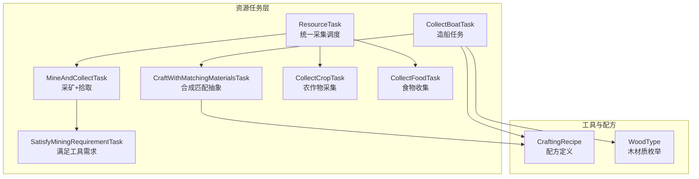
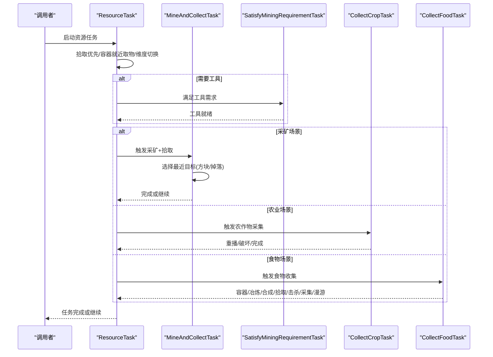
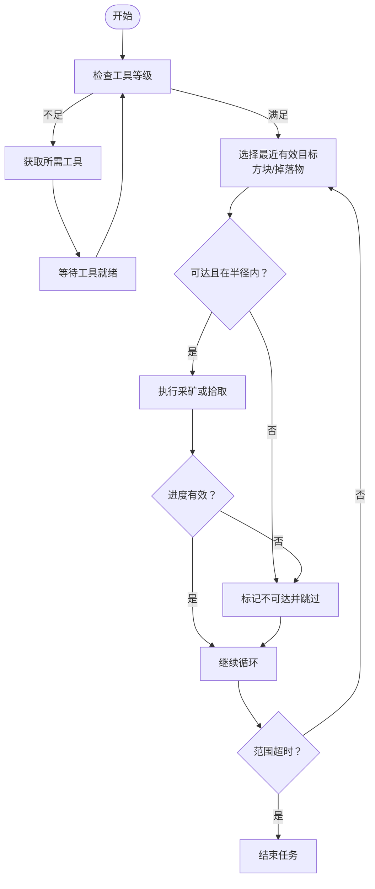
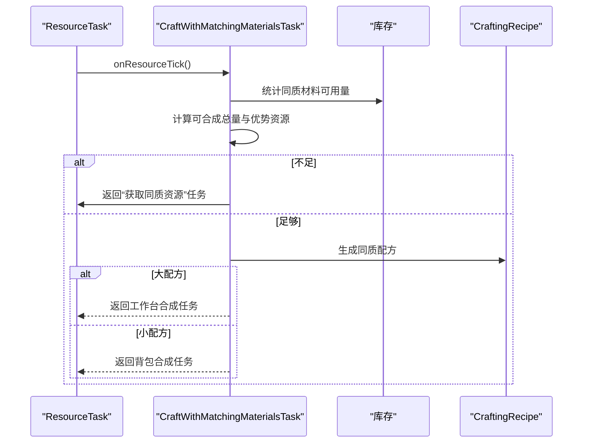
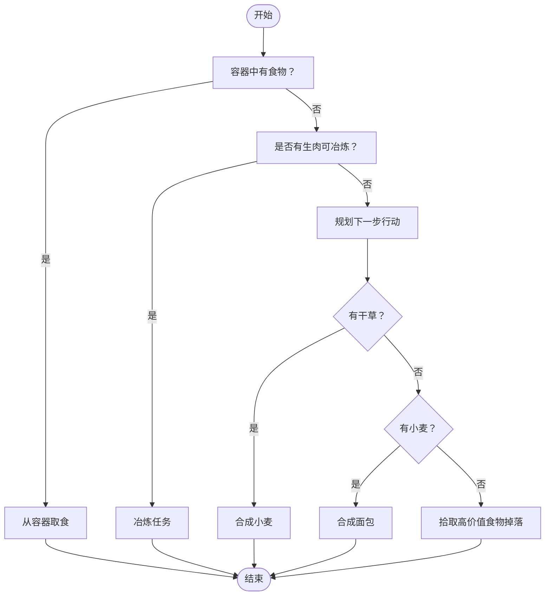
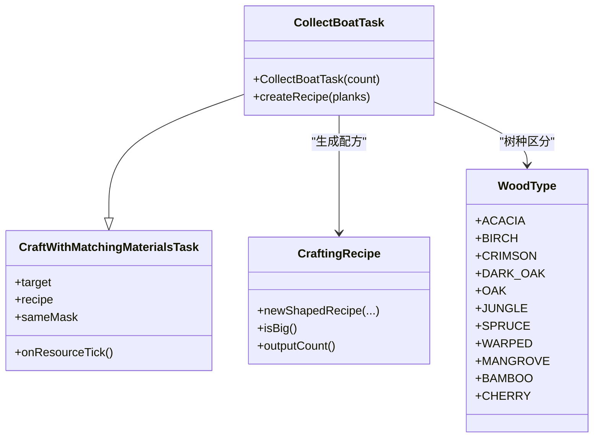
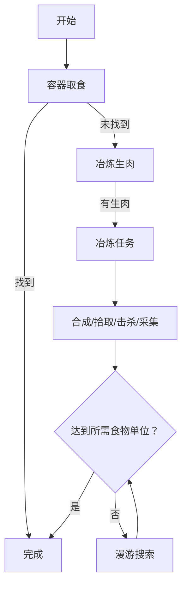
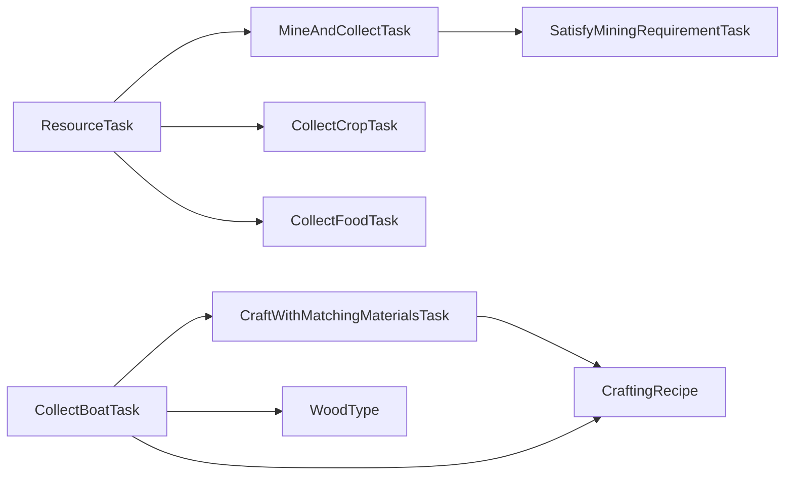

# 资源收集任务

<cite>
**本文引用的文件**
- [ResourceTask.java](file://src/main/java/adris/altoclef/tasks/ResourceTask.java)
- [MineAndCollectTask.java](file://src/main/java/adris/altoclef/tasks/resources/MineAndCollectTask.java)
- [SatisfyMiningRequirementTask.java](file://src/main/java/adris/altoclef/tasks/resources/SatisfyMiningRequirementTask.java)
- [CraftWithMatchingMaterialsTask.java](file://src/main/java/adris/altoclef/tasks/resources/CraftWithMatchingMaterialsTask.java)
- [CollectCropTask.java](file://src/main/java/adris/altoclef/tasks/resources/CollectCropTask.java)
- [CollectFoodTask.java](file://src/main/java/adris/altoclef/tasks/resources/CollectFoodTask.java)
- [CraftingRecipe.java](file://src/main/java/adris/altoclef/util/CraftingRecipe.java)
- [WoodType.java](file://src/main/java/adris/altoclef/util/WoodType.java)
- [CollectBoatTask.java](file://src/main/java/adris/altoclef/tasks/resources/wood/CollectBoatTask.java)
</cite>

## 目录
1. [简介](#简介)
2. [项目结构](#项目结构)
3. [核心组件](#核心组件)
4. [架构总览](#架构总览)
5. [详细组件分析](#详细组件分析)
6. [依赖分析](#依赖分析)
7. [性能考量](#性能考量)
8. [故障排查指南](#故障排查指南)
9. [结论](#结论)
10. [附录](#附录)

## 简介
本技术文档围绕“资源收集任务系统”展开，聚焦以下几类任务的实现与优化：
- 矿物开采任务：工具需求、挖掘策略、材料分类与自动补给
- 合成匹配任务：配方查找、材料匹配与合成流程
- 农业收集任务：作物识别、成熟判断、播种与收获
- 木材收集任务：树种识别与加工（以造船为例）
- 食物收集任务：营养需求评估与保存策略
并提供配置项、效率优化与批量处理机制的实践建议。

## 项目结构
资源收集相关代码主要位于 tasks/resources 及其子包中，并通过通用基类 ResourceTask 统一调度采集、拾取、容器存取与维度切换等行为；同时利用 util 下的工具类（如 CraftingRecipe）描述配方与匹配逻辑。

**图表来源**
- [ResourceTask.java:31-242](file://src/main/java/adris/altoclef/tasks/ResourceTask.java#L31-L242)
- [MineAndCollectTask.java:39-361](file://src/main/java/adris/altoclef/tasks/resources/MineAndCollectTask.java#L39-L361)
- [SatisfyMiningRequirementTask.java:9-56](file://src/main/java/adris/altoclef/tasks/resources/SatisfyMiningRequirementTask.java#L9-L56)
- [CraftWithMatchingMaterialsTask.java:15-127](file://src/main/java/adris/altoclef/tasks/resources/CraftWithMatchingMaterialsTask.java#L15-L127)
- [CollectCropTask.java:28-178](file://src/main/java/adris/altoclef/tasks/resources/CollectCropTask.java#L28-L178)
- [CollectFoodTask.java:41-327](file://src/main/java/adris/altoclef/tasks/resources/CollectFoodTask.java#L41-L327)
- [CraftingRecipe.java:7-145](file://src/main/java/adris/altoclef/util/CraftingRecipe.java#L7-L145)
- [WoodType.java:3-15](file://src/main/java/adris/altoclef/util/WoodType.java#L3-L15)
- [CollectBoatTask.java:10-28](file://src/main/java/adris/altoclef/tasks/resources/wood/CollectBoatTask.java#L10-L28)

**章节来源**
- [ResourceTask.java:31-242](file://src/main/java/adris/altoclef/tasks/ResourceTask.java#L31-L242)
- [MineAndCollectTask.java:39-361](file://src/main/java/adris/altoclef/tasks/resources/MineAndCollectTask.java#L39-L361)
- [CraftWithMatchingMaterialsTask.java:15-127](file://src/main/java/adris/altoclef/tasks/resources/CraftWithMatchingMaterialsTask.java#L15-L127)
- [CollectCropTask.java:28-178](file://src/main/java/adris/altoclef/tasks/resources/CollectCropTask.java#L28-L178)
- [CollectFoodTask.java:41-327](file://src/main/java/adris/altoclef/tasks/resources/CollectFoodTask.java#L41-L327)
- [CraftingRecipe.java:7-145](file://src/main/java/adris/altoclef/util/CraftingRecipe.java#L7-L145)
- [WoodType.java:3-15](file://src/main/java/adris/altoclef/util/WoodType.java#L3-L15)
- [CollectBoatTask.java:10-28](file://src/main/java/adris/altoclef/tasks/resources/wood/CollectBoatTask.java#L10-L28)

## 核心组件
- ResourceTask：所有资源任务的抽象基类，负责统一的完成条件、拾取优先级、容器就近取物、维度切换与调试状态输出。它通过 ItemTarget 描述目标物品集合，并在运行时根据设置决定是否允许从容器取物、是否强制进入特定维度等。
- MineAndCollectTask：面向矿物/方块的采集任务，内部组合“采矿或拾取”的子任务，支持按需装备更高等级工具、范围超时保护与错误块标记。
- SatisfyMiningRequirementTask：当当前工具等级不足时，自动获取所需工具（木石铁钻）。
- CraftWithMatchingMaterialsTask：合成匹配抽象，基于“同质替换掩码”计算可合成数量，优先使用最大优势资源进行合成，并在需要时回采该资源。
- CollectCropTask：农作物采集，支持成熟度判断、空地重播与种子收集。
- CollectFoodTask：食物收集主控，按阶段推进：容器取食→冶炼→合成/配方→拾取高价值掉落→击杀动物→采集浆果/干草→漫游搜索。
- CraftingRecipe：配方数据结构，支持 2x2/3x3 的有/无序合成，记录输出数量与槽位目标。
- WoodType：木材质枚举，用于区分不同原木/木板/木棍等的种类。

**章节来源**
- [ResourceTask.java:31-242](file://src/main/java/adris/altoclef/tasks/ResourceTask.java#L31-L242)
- [MineAndCollectTask.java:39-129](file://src/main/java/adris/altoclef/tasks/resources/MineAndCollectTask.java#L39-L129)
- [SatisfyMiningRequirementTask.java:9-56](file://src/main/java/adris/altoclef/tasks/resources/SatisfyMiningRequirementTask.java#L9-L56)
- [CraftWithMatchingMaterialsTask.java:15-127](file://src/main/java/adris/altoclef/tasks/resources/CraftWithMatchingMaterialsTask.java#L15-L127)
- [CollectCropTask.java:28-178](file://src/main/java/adris/altoclef/tasks/resources/CollectCropTask.java#L28-L178)
- [CollectFoodTask.java:41-327](file://src/main/java/adris/altoclef/tasks/resources/CollectFoodTask.java#L41-L327)
- [CraftingRecipe.java:7-145](file://src/main/java/adris/altoclef/util/CraftingRecipe.java#L7-L145)
- [WoodType.java:3-15](file://src/main/java/adris/altoclef/util/WoodType.java#L3-L15)

## 架构总览
下图展示资源任务系统的高层交互：ResourceTask 作为统一入口，协调拾取、容器取物、维度切换与具体采集任务；MineAndCollectTask 在满足工具等级后，驱动“采矿或拾取”子任务；CraftWithMatchingMaterialsTask 基于配方与掩码进行材料匹配与合成；CollectCropTask 负责农场作业；CollectFoodTask 则是食物收集的编排器。

**图表来源**
- [ResourceTask.java:74-168](file://src/main/java/adris/altoclef/tasks/ResourceTask.java#L74-L168)
- [MineAndCollectTask.java:92-105](file://src/main/java/adris/altoclef/tasks/resources/MineAndCollectTask.java#L92-L105)
- [SatisfyMiningRequirementTask.java:21-35](file://src/main/java/adris/altoclef/tasks/resources/SatisfyMiningRequirementTask.java#L21-L35)
- [CollectCropTask.java:68-113](file://src/main/java/adris/altoclef/tasks/resources/CollectCropTask.java#L68-L113)
- [CollectFoodTask.java:72-173](file://src/main/java/adris/altoclef/tasks/resources/CollectFoodTask.java#L72-L173)

## 详细组件分析

### 矿物开采任务：工具需求、挖掘策略与材料分类
- 工具需求满足
  - 当工具等级不足时，SatisfyMiningRequirementTask 将返回对应工具的任务，直到满足要求为止。
  - MineAndCollectTask 在采矿前检查工具等级，必要时自动装备更高等级工具，避免低效挖掘。
- 挖掘策略
  - MineAndCollectTask 内部的 MineOrCollectTask 子任务会优先选择“最近且在活动半径内”的目标（方块或掉落物），并带有“范围超时”保护，若长时间无目标则主动结束，避免无效漫游。
  - 对不可达方块进行黑名单记录，减少重复尝试。
- 材料分类
  - 通过 ItemTarget 与 Block 映射，将目标物品映射到对应的可采集方块，便于统一调度。

**图表来源**
- [SatisfyMiningRequirementTask.java:21-35](file://src/main/java/adris/altoclef/tasks/resources/SatisfyMiningRequirementTask.java#L21-L35)
- [MineAndCollectTask.java:131-155](file://src/main/java/adris/altoclef/tasks/resources/MineAndCollectTask.java#L131-L155)
- [MineAndCollectTask.java:247-281](file://src/main/java/adris/altoclef/tasks/resources/MineAndCollectTask.java#L247-L281)

**章节来源**
- [SatisfyMiningRequirementTask.java:9-56](file://src/main/java/adris/altoclef/tasks/resources/SatisfyMiningRequirementTask.java#L9-L56)
- [MineAndCollectTask.java:39-129](file://src/main/java/adris/altoclef/tasks/resources/MineAndCollectTask.java#L39-L129)
- [MineAndCollectTask.java:157-361](file://src/main/java/adris/altoclef/tasks/resources/MineAndCollectTask.java#L157-L361)

### 合成匹配任务：配方查找、材料匹配与合成流程
- 配方查找与结构
  - CraftingRecipe 支持 2x2/3x3 的有/无序合成，记录每个槽位的目标 ItemTarget 与输出数量，便于批量合成计算。
- 材料匹配
  - CraftWithMatchingMaterialsTask 通过“同质替换掩码”标识哪些槽位可以由同一类材料填充，从而最大化利用库存中的优势资源。
  - 计算逻辑：先估算全部同质材料可合成总量，若不足则转为“获取特定同质资源”，最终生成对应配方并选择在工作台或背包中合成。
- 合成流程
  - 若配方为大配方（3x3），使用工作台合成；否则在背包中合成，减少移动成本。

**图表来源**
- [CraftWithMatchingMaterialsTask.java:66-105](file://src/main/java/adris/altoclef/tasks/resources/CraftWithMatchingMaterialsTask.java#L66-L105)
- [CraftingRecipe.java:15-47](file://src/main/java/adris/altoclef/util/CraftingRecipe.java#L15-L47)

**章节来源**
- [CraftWithMatchingMaterialsTask.java:15-127](file://src/main/java/adris/altoclef/tasks/resources/CraftWithMatchingMaterialsTask.java#L15-L127)
- [CraftingRecipe.java:7-145](file://src/main/java/adris/altoclef/util/CraftingRecipe.java#L7-L145)

### 农业收集任务：作物识别、收获时机与存储管理
- 作物识别与成熟判断
  - 使用 BlockScanner 与 WorldHelper 判断作物是否成熟；对未加载区块采用“已知成熟点记忆”策略，提升稳定性。
- 收获时机
  - 仅在成熟时破坏；若启用重播，会在空地重播种子。
- 存储管理
  - 优先从容器取食；若无容器，则进行冶炼、合成、拾取高价值掉落、击杀动物、采集浆果/干草等，最后漫游搜索。

**图表来源**
- [CollectFoodTask.java:76-173](file://src/main/java/adris/altoclef/tasks/resources/CollectFoodTask.java#L76-L173)
- [CollectCropTask.java:68-113](file://src/main/java/adris/altoclef/tasks/resources/CollectCropTask.java#L68-L113)

**章节来源**
- [CollectCropTask.java:28-178](file://src/main/java/adris/altoclef/tasks/resources/CollectCropTask.java#L28-L178)
- [CollectFoodTask.java:41-327](file://src/main/java/adris/altoclef/tasks/resources/CollectFoodTask.java#L41-L327)

### 木材收集任务：树种识别与加工流程
- 树种识别
  - 通过 WoodType 枚举区分不同树种，配合 ItemTarget 与配方槽位进行匹配。
- 加工流程
  - 以 CollectBoatTask 为例，使用“同质替换掩码”将任意木板替换到指定槽位，生成对应配方并进行合成；若为大配方则在工作台合成，否则在背包中合成。

**图表来源**
- [WoodType.java:3-15](file://src/main/java/adris/altoclef/util/WoodType.java#L3-L15)
- [CraftWithMatchingMaterialsTask.java:15-127](file://src/main/java/adris/altoclef/tasks/resources/CraftWithMatchingMaterialsTask.java#L15-L127)
- [CollectBoatTask.java:10-28](file://src/main/java/adris/altoclef/tasks/resources/wood/CollectBoatTask.java#L10-L28)
- [CraftingRecipe.java:15-47](file://src/main/java/adris/altoclef/util/CraftingRecipe.java#L15-L47)

**章节来源**
- [CollectBoatTask.java:10-28](file://src/main/java/adris/altoclef/tasks/resources/wood/CollectBoatTask.java#L10-L28)
- [CraftWithMatchingMaterialsTask.java:15-127](file://src/main/java/adris/altoclef/tasks/resources/CraftWithMatchingMaterialsTask.java#L15-L127)
- [WoodType.java:3-15](file://src/main/java/adris/altoclef/util/WoodType.java#L3-L15)

### 食物收集任务：营养需求与保存策略
- 营养需求评估
  - 通过 Inventory 中的食物项与 ItemVer 的 FoodComponent 计算“食物单位”，作为完成条件。
- 保存策略
  - 优先容器取食，避免浪费；若无容器则进行冶炼、合成（如将干草转小麦、将小麦转面包）、拾取高价值掉落、击杀动物、采集浆果/干草，最后漫游搜索。

**图表来源**
- [CollectFoodTask.java:72-173](file://src/main/java/adris/altoclef/tasks/resources/CollectFoodTask.java#L72-L173)

**章节来源**
- [CollectFoodTask.java:41-327](file://src/main/java/adris/altoclef/tasks/resources/CollectFoodTask.java#L41-L327)

## 依赖分析
- ResourceTask 作为上层调度器，被多种具体任务继承或组合使用，耦合度低、内聚性高。
- MineAndCollectTask 依赖 SatisfyMiningRequirementTask 与工具等级判定，内部子任务 MineOrCollectTask 依赖实体/方块扫描与进度检查。
- CraftWithMatchingMaterialsTask 依赖 CraftingRecipe 与库存统计，形成“配方→材料→合成”的清晰链路。
- CollectCropTask 依赖 WorldHelper 与 BlockScanner 的成熟度判断与可达性检查。
- CollectFoodTask 作为编排器，串联多个子任务并进行阶段性决策。

**图表来源**
- [ResourceTask.java:31-242](file://src/main/java/adris/altoclef/tasks/ResourceTask.java#L31-L242)
- [MineAndCollectTask.java:39-129](file://src/main/java/adris/altoclef/tasks/resources/MineAndCollectTask.java#L39-L129)
- [SatisfyMiningRequirementTask.java:9-56](file://src/main/java/adris/altoclef/tasks/resources/SatisfyMiningRequirementTask.java#L9-L56)
- [CraftWithMatchingMaterialsTask.java:15-127](file://src/main/java/adris/altoclef/tasks/resources/CraftWithMatchingMaterialsTask.java#L15-L127)
- [CollectBoatTask.java:10-28](file://src/main/java/adris/altoclef/tasks/resources/wood/CollectBoatTask.java#L10-L28)
- [CraftingRecipe.java:7-145](file://src/main/java/adris/altoclef/util/CraftingRecipe.java#L7-L145)
- [WoodType.java:3-15](file://src/main/java/adris/altoclef/util/WoodType.java#L3-L15)

**章节来源**
- [ResourceTask.java:31-242](file://src/main/java/adris/altoclef/tasks/ResourceTask.java#L31-L242)
- [MineAndCollectTask.java:39-129](file://src/main/java/adris/altoclef/tasks/resources/MineAndCollectTask.java#L39-L129)
- [CraftWithMatchingMaterialsTask.java:15-127](file://src/main/java/adris/altoclef/tasks/resources/CraftWithMatchingMaterialsTask.java#L15-L127)
- [CollectBoatTask.java:10-28](file://src/main/java/adris/altoclef/tasks/resources/wood/CollectBoatTask.java#L10-L28)

## 性能考量
- 范围超时保护：MineAndCollectTask 的 MineOrCollectTask 提供“无目标超时”机制，避免长时间无效漫游，提高整体效率。
- 进度检查与不可达标记：对无法到达的方块进行黑名单记录，减少重复尝试。
- 合成优先级：CraftWithMatchingMaterialsTask 先估算“全部同质材料可合成总量”，再决定是否回采特定资源，降低往返成本。
- 阶段化食物收集：CollectFoodTask 优先容器取食与冶炼，减少不必要的移动与时间消耗。
- 批量处理建议：
  - 使用 ResourceTask 的批量 ItemTarget，统一调度多目标采集。
  - 合成任务中预估可产出数量，避免过度回采。
  - 农业任务中启用“重播种子”与“成熟度优先”，减少无效破坏。

[本节为通用性能建议，不直接分析具体文件]

## 故障排查指南
- 采矿任务长时间无响应
  - 检查是否触发“范围超时”保护；确认工具等级是否满足要求；查看不可达标记是否过多导致路径失败。
  - 参考：[MineAndCollectTask.java:265-281](file://src/main/java/adris/altoclef/tasks/resources/MineAndCollectTask.java#L265-L281)，[SatisfyMiningRequirementTask.java:21-35](file://src/main/java/adris/altoclef/tasks/resources/SatisfyMiningRequirementTask.java#L21-L35)
- 合成任务卡住
  - 检查同质替换掩码与配方槽位是否一致；确认库存中是否存在足够“优势资源”。
  - 参考：[CraftWithMatchingMaterialsTask.java:66-105](file://src/main/java/adris/altoclef/tasks/resources/CraftWithMatchingMaterialsTask.java#L66-L105)
- 农业任务不重播
  - 确认是否启用“重播种子”与种子库存；检查空地集合是否正确维护。
  - 参考：[CollectCropTask.java:83-112](file://src/main/java/adris/altoclef/tasks/resources/CollectCropTask.java#L83-L112)
- 食物收集效率低
  - 检查容器缓存是否命中；确认冶炼与合成分支是否被正确触发。
  - 参考：[CollectFoodTask.java:76-173](file://src/main/java/adris/altoclef/tasks/resources/CollectFoodTask.java#L76-L173)

**章节来源**
- [MineAndCollectTask.java:247-281](file://src/main/java/adris/altoclef/tasks/resources/MineAndCollectTask.java#L247-L281)
- [SatisfyMiningRequirementTask.java:21-35](file://src/main/java/adris/altoclef/tasks/resources/SatisfyMiningRequirementTask.java#L21-L35)
- [CraftWithMatchingMaterialsTask.java:66-105](file://src/main/java/adris/altoclef/tasks/resources/CraftWithMatchingMaterialsTask.java#L66-L105)
- [CollectCropTask.java:83-112](file://src/main/java/adris/altoclef/tasks/resources/CollectCropTask.java#L83-L112)
- [CollectFoodTask.java:76-173](file://src/main/java/adris/altoclef/tasks/resources/CollectFoodTask.java#L76-L173)

## 结论
资源收集任务系统通过 ResourceTask 统一调度，结合工具需求满足、范围超时保护、配方匹配与成熟度判断等机制，实现了高效稳定的自动化采集。针对不同资源类型（矿物、农业、食物、木材），系统提供了清晰的扩展点与优化策略，适合在复杂世界中持续稳定地维持资源供给。

[本节为总结性内容，不直接分析具体文件]

## 附录
- 配置项建议（基于现有设置键名）
  - 采集拾取范围：控制拾取判定距离
  - 采矿范围：控制采矿目标搜索范围
  - 容器检索范围：控制容器就近取物范围
  - 农业重播开关：控制是否在空地重播种子
  - 维度强制：在特定维度执行任务
- 批量处理机制
  - 使用 ResourceTask 的批量 ItemTarget，统一调度多目标采集与合成。
  - 合成任务中按“可合成总量”与“优势资源”分阶段推进，避免过度回采。
- 实现示例路径
  - 矿物采集：[MineAndCollectTask.java:92-105](file://src/main/java/adris/altoclef/tasks/resources/MineAndCollectTask.java#L92-L105)
  - 合成匹配：[CraftWithMatchingMaterialsTask.java:66-105](file://src/main/java/adris/altoclef/tasks/resources/CraftWithMatchingMaterialsTask.java#L66-L105)
  - 农业采集：[CollectCropTask.java:68-113](file://src/main/java/adris/altoclef/tasks/resources/CollectCropTask.java#L68-L113)
  - 食物收集：[CollectFoodTask.java:72-173](file://src/main/java/adris/altoclef/tasks/resources/CollectFoodTask.java#L72-L173)
  - 木材合成（造船）：[CollectBoatTask.java:10-28](file://src/main/java/adris/altoclef/tasks/resources/wood/CollectBoatTask.java#L10-L28)

[本节为补充信息，不直接分析具体文件]