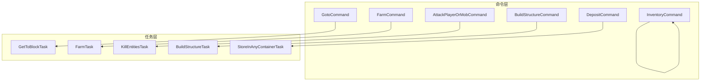
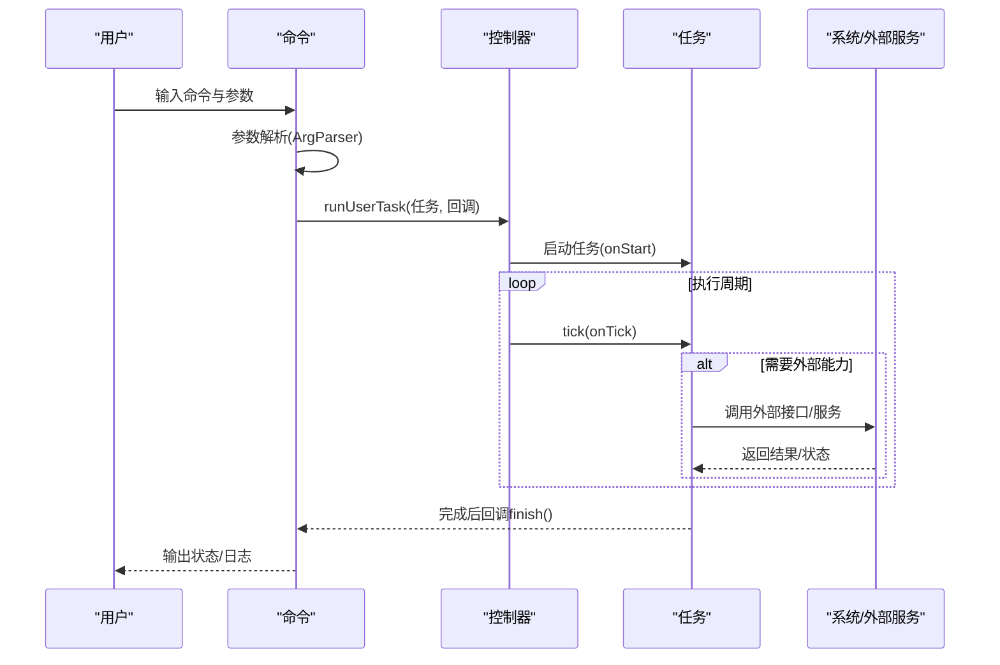
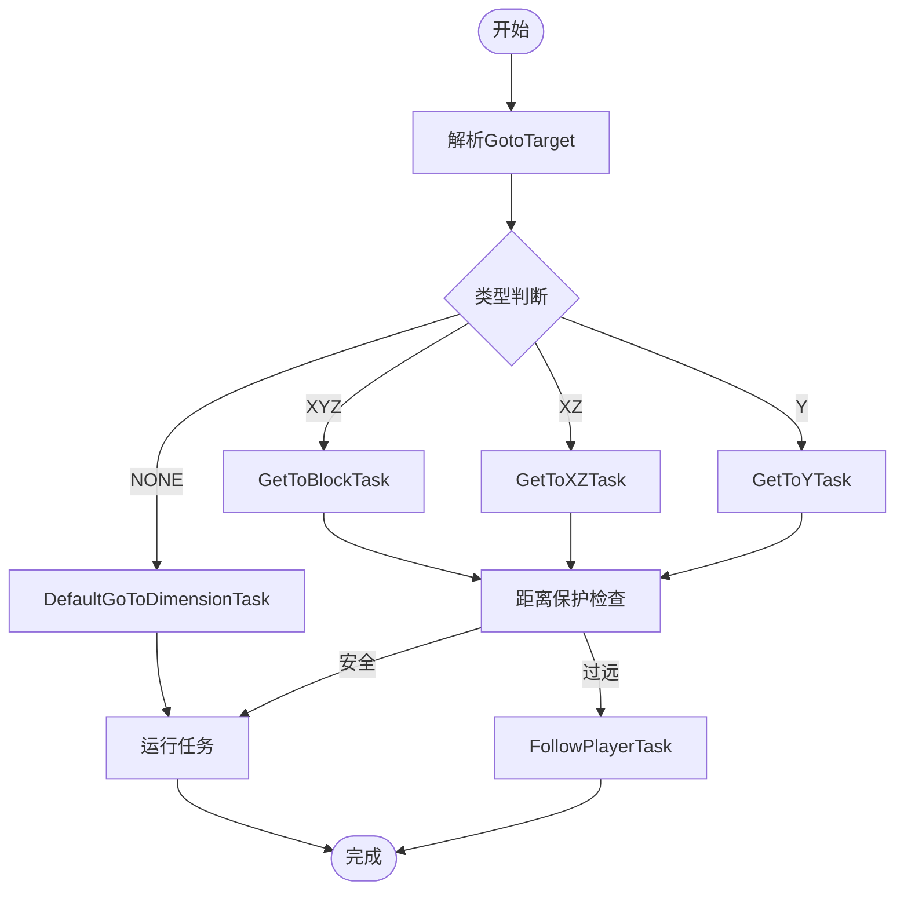
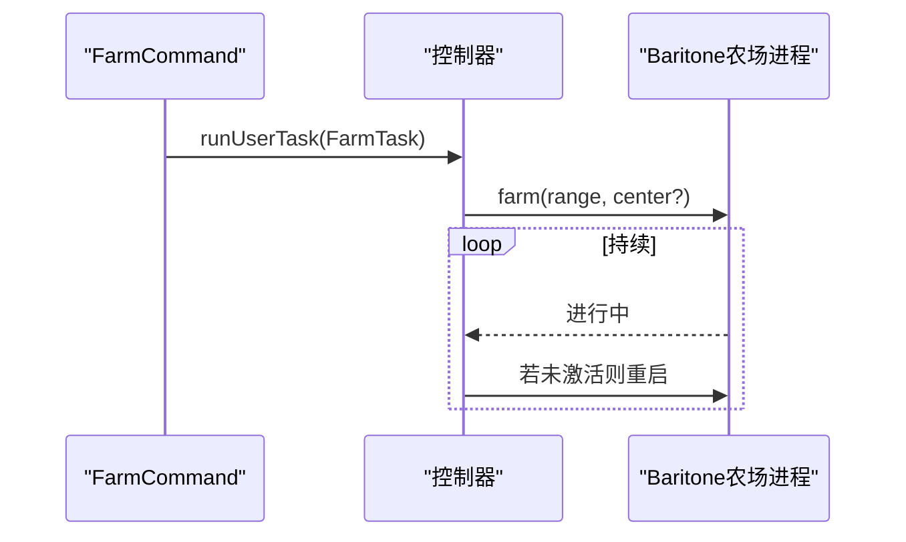
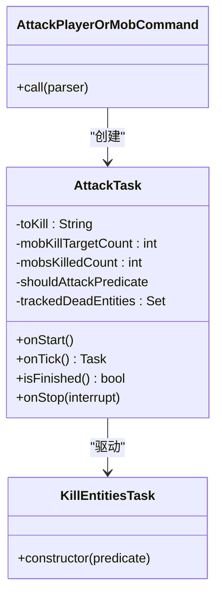
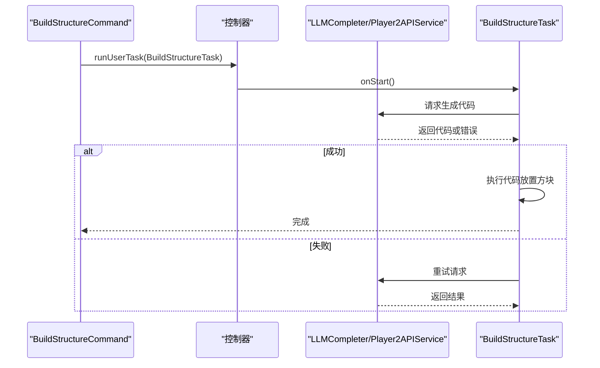
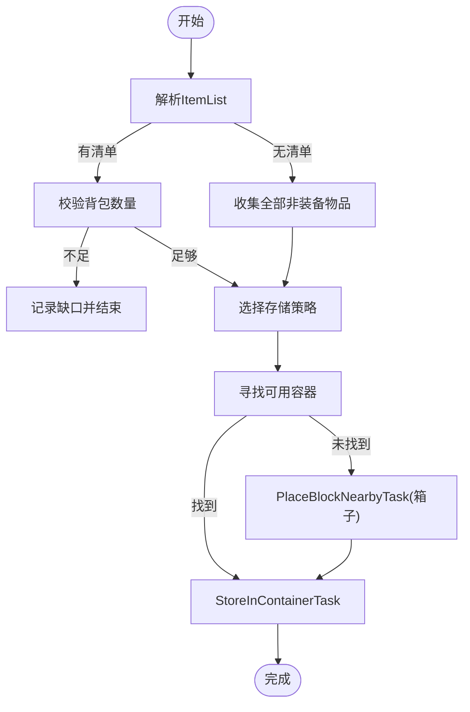

# 具体命令实现

<cite>
**本文引用的文件**
- [GotoCommand.java](file://src/main/java/adris/altoclef/commands/GotoCommand.java)
- [FarmCommand.java](file://src/main/java/adris/altoclef/commands/FarmCommand.java)
- [AttackPlayerOrMobCommand.java](file://src/main/java/adris/altoclef/commands/AttackPlayerOrMobCommand.java)
- [BuildStructureCommand.java](file://src/main/java/adris/altoclef/commands/BuildStructureCommand.java)
- [DepositCommand.java](file://src/main/java/adris/altoclef/commands/DepositCommand.java)
- [InventoryCommand.java](file://src/main/java/adris/altoclef/commands/InventoryCommand.java)
- [GetToBlockTask.java](file://src/main/java/adris/altoclef/tasks/movement/GetToBlockTask.java)
- [FarmTask.java](file://src/main/java/adris/altoclef/tasks/misc/FarmTask.java)
- [KillEntitiesTask.java](file://src/main/java/adris/altoclef/tasks/entity/KillEntitiesTask.java)
- [BuildStructureTask.java](file://src/main/java/adris/altoclef/tasks/construction/build_structure/BuildStructureTask.java)
- [StoreInAnyContainerTask.java](file://src/main/java/adris/altoclef/tasks/container/StoreInAnyContainerTask.java)
</cite>

## 目录
1. [简介](#简介)
2. [项目结构](#项目结构)
3. [核心组件](#核心组件)
4. [架构总览](#架构总览)
5. [详细组件分析](#详细组件分析)
6. [依赖分析](#依赖分析)
7. [性能考虑](#性能考虑)
8. [故障排查指南](#故障排查指南)
9. [结论](#结论)
10. [附录](#附录)

## 简介
本文件面向“具体命令实现”的技术文档，聚焦于以下命令的完整实现细节与使用说明：
- 导航命令（GotoCommand）：坐标定位与路径规划
- 采集命令（FarmCommand）：农业管理与资源收集
- 战斗命令（AttackPlayerOrMobCommand）：敌对目标处理
- 建造命令（BuildStructureCommand）：结构构建
- 物品管理命令（DepositCommand、InventoryCommand）：存储系统操作

内容涵盖参数类型、执行逻辑、错误处理、状态反馈、使用示例、最佳实践、性能优化与扩展开发指南。

## 项目结构
命令层位于 commands 包，围绕命令入口与参数解析；任务层位于 tasks.* 子包，封装具体行为（移动、采集、战斗、建造、存储等）。命令通过调用任务系统完成实际工作，并在完成后回调命令的 finish 方法以结束执行。

图示来源
- [GotoCommand.java:1-66](file://src/main/java/adris/altoclef/commands/GotoCommand.java#L1-L66)
- [FarmCommand.java:1-29](file://src/main/java/adris/altoclef/commands/FarmCommand.java#L1-L29)
- [AttackPlayerOrMobCommand.java:1-177](file://src/main/java/adris/altoclef/commands/AttackPlayerOrMobCommand.java#L1-L177)
- [BuildStructureCommand.java:1-29](file://src/main/java/adris/altoclef/commands/BuildStructureCommand.java#L1-L29)
- [DepositCommand.java:1-97](file://src/main/java/adris/altoclef/commands/DepositCommand.java#L1-L97)
- [InventoryCommand.java:1-63](file://src/main/java/adris/altoclef/commands/InventoryCommand.java#L1-L63)
- [GetToBlockTask.java:1-106](file://src/main/java/adris/altoclef/tasks/movement/GetToBlockTask.java#L1-L106)
- [FarmTask.java:1-67](file://src/main/java/adris/altoclef/tasks/misc/FarmTask.java#L1-L67)
- [KillEntitiesTask.java:1-33](file://src/main/java/adris/altoclef/tasks/entity/KillEntitiesTask.java#L1-L33)
- [BuildStructureTask.java:1-237](file://src/main/java/adris/altoclef/tasks/construction/build_structure/BuildStructureTask.java#L1-L237)
- [StoreInAnyContainerTask.java:1-121](file://src/main/java/adris/altoclef/tasks/container/StoreInAnyContainerTask.java#L1-L121)

章节来源
- [GotoCommand.java:1-66](file://src/main/java/adris/altoclef/commands/GotoCommand.java#L1-L66)
- [FarmCommand.java:1-29](file://src/main/java/adris/altoclef/commands/FarmCommand.java#L1-L29)
- [AttackPlayerOrMobCommand.java:1-177](file://src/main/java/adris/altoclef/commands/AttackPlayerOrMobCommand.java#L1-L177)
- [BuildStructureCommand.java:1-29](file://src/main/java/adris/altoclef/commands/BuildStructureCommand.java#L1-L29)
- [DepositCommand.java:1-97](file://src/main/java/adris/altoclef/commands/DepositCommand.java#L1-L97)
- [InventoryCommand.java:1-63](file://src/main/java/adris/altoclef/commands/InventoryCommand.java#L1-L63)

## 核心组件
- 命令基类与参数系统：命令通过构造函数注册名称、描述与参数列表，使用 ArgParser 解析输入，最终调用控制器运行用户任务并在完成后回调 finish。
- 任务系统：命令将高层意图转化为具体任务，任务负责状态机、路径计算、事件订阅与执行细节。
- 控制器桥接：命令通过 AltoClefController 访问世界、库存、路径、事件总线等能力。

章节来源
- [GotoCommand.java:24-30](file://src/main/java/adris/altoclef/commands/GotoCommand.java#L24-L30)
- [FarmCommand.java:13-19](file://src/main/java/adris/altoclef/commands/FarmCommand.java#L13-L19)
- [AttackPlayerOrMobCommand.java:24-31](file://src/main/java/adris/altoclef/commands/AttackPlayerOrMobCommand.java#L24-L31)
- [BuildStructureCommand.java:11-19](file://src/main/java/adris/altoclef/commands/BuildStructureCommand.java#L11-L19)
- [DepositCommand.java:30-36](file://src/main/java/adris/altoclef/commands/DepositCommand.java#L30-L36)
- [InventoryCommand.java:15-17](file://src/main/java/adris/altoclef/commands/InventoryCommand.java#L15-L17)

## 架构总览
命令到任务的典型执行链路如下：

图示来源
- [GotoCommand.java:42-64](file://src/main/java/adris/altoclef/commands/GotoCommand.java#L42-L64)
- [FarmCommand.java:22-27](file://src/main/java/adris/altoclef/commands/FarmCommand.java#L22-L27)
- [AttackPlayerOrMobCommand.java:34-38](file://src/main/java/adris/altoclef/commands/AttackPlayerOrMobCommand.java#L34-L38)
- [BuildStructureCommand.java:22-27](file://src/main/java/adris/altoclef/commands/BuildStructureCommand.java#L22-L27)
- [DepositCommand.java:54-95](file://src/main/java/adris/altoclef/commands/DepositCommand.java#L54-L95)
- [InventoryCommand.java:19-61](file://src/main/java/adris/altoclef/commands/InventoryCommand.java#L19-L61)

## 详细组件分析

### 导航命令（GotoCommand）
- 功能概述
  - 将 NPC 导航至指定坐标或维度，支持 XYZ、XZ、Y 以及仅维度跳转。
  - 内置距离保护：若目标距离所有者过远，拒绝执行 goto 并改为跟随所有者。
- 参数与类型
  - 单参数：GotoTarget（可解析为 [x y z dimension]、[x z dimension]、[y dimension]、[dimension]、[x y z]、[x z]、[y] 等形式）
- 执行逻辑
  - 解析目标后根据类型选择对应任务：块级到达、XZ平面到达、Y轴到达、维度切换。
  - 若超出最大允许距离，记录警告并改派 FollowPlayerTask。
- 错误处理与状态反馈
  - 日志记录拒绝原因与替代行为。
  - 任务结束后回调命令完成。
- 使用示例
  - 到达坐标：传入 x y z 与维度
  - 仅维度：传入 dimension
  - 仅 XZ：传入 x z 与维度
  - 仅 Y：传入 y 与维度
- 最佳实践
  - 在开放世界中优先使用 XZ/XYZ，避免长距离瞬移导致的异常。
  - 维度切换时确保目标维度可达。
- 性能优化
  - 合理设置最大距离阈值，避免无效路径规划。
  - 在频繁切换维度场景下，尽量合并多次 goto 为一次维度跳转。

图示来源
- [GotoCommand.java:32-39](file://src/main/java/adris/altoclef/commands/GotoCommand.java#L32-L39)
- [GotoCommand.java:46-61](file://src/main/java/adris/altoclef/commands/GotoCommand.java#L46-L61)
- [GetToBlockTask.java:39-59](file://src/main/java/adris/altoclef/tasks/movement/GetToBlockTask.java#L39-L59)

章节来源
- [GotoCommand.java:20-66](file://src/main/java/adris/altoclef/commands/GotoCommand.java#L20-L66)
- [GetToBlockTask.java:14-106](file://src/main/java/adris/altoclef/tasks/movement/GetToBlockTask.java#L14-L106)

### 采集命令（FarmCommand）
- 功能概述
  - 自动农场作物，支持指定范围与中心点。
- 参数与类型
  - 必选：range（整数，表示搜索半径）
- 执行逻辑
  - 以当前实体位置为中心创建 FarmTask，委托给 Baritone 的农场进程持续执行。
- 错误处理与状态反馈
  - 若农场进程停止，自动重启。
  - 任务永不自然完成，由外部中断控制。
- 使用示例
  - farm 10：在半径 10 的范围内自动农场
- 最佳实践
  - 合理设置半径，避免过度扫描。
  - 在资源丰富区域可适当增大半径。
- 性能优化
  - 避免在高负载时段连续启动多个农场任务。
  - 结合库存压力与资源需求动态调整半径。

图示来源
- [FarmCommand.java:21-27](file://src/main/java/adris/altoclef/commands/FarmCommand.java#L21-L27)
- [FarmTask.java:22-42](file://src/main/java/adris/altoclef/tasks/misc/FarmTask.java#L22-L42)

章节来源
- [FarmCommand.java:12-29](file://src/main/java/adris/altoclef/commands/FarmCommand.java#L12-L29)
- [FarmTask.java:8-67](file://src/main/java/adris/altoclef/tasks/misc/FarmTask.java#L8-L67)

### 战斗命令（AttackPlayerOrMobCommand）
- 功能概述
  - 攻击指定玩家或生物，支持按数量击杀、最近敌人、最近敌对生物等模式。
- 参数与类型
  - name（字符串，目标名或特殊关键字 nearest/nearest_hostile）
  - count（整数，目标击杀数量，默认 1）
- 执行逻辑
  - 构建 AttackTask，内部维护击杀计数与事件订阅。
  - 根据目标类型生成谓词，筛选可攻击实体。
  - 使用 KillEntitiesTask 驱动单体击杀任务。
- 错误处理与状态反馈
  - 订阅实体死亡事件，统计击杀数。
  - 任务完成条件为达到目标击杀数。
- 使用示例
  - attack zombie 5：击杀 5 只僵尸
  - attack Player：攻击用户名为 Player 的玩家
  - attack nearest_hostile：保护所有者，追击最近敌对生物
- 最佳实践
  - nearest_hostile 模式会从所有者位置出发，适合守卫型用途。
  - 对于玩家目标，注意区分大小写与全名匹配。
- 性能优化
  - 减少不必要的实体扫描，优先使用谓词过滤。
  - 合理设置目标数量，避免长时间挂起。

图示来源
- [AttackPlayerOrMobCommand.java:34-38](file://src/main/java/adris/altoclef/commands/AttackPlayerOrMobCommand.java#L34-L38)
- [AttackPlayerOrMobCommand.java:40-177](file://src/main/java/adris/altoclef/commands/AttackPlayerOrMobCommand.java#L40-L177)
- [KillEntitiesTask.java:8-33](file://src/main/java/adris/altoclef/tasks/entity/KillEntitiesTask.java#L8-L33)

章节来源
- [AttackPlayerOrMobCommand.java:23-177](file://src/main/java/adris/altoclef/commands/AttackPlayerOrMobCommand.java#L23-L177)
- [KillEntitiesTask.java:1-33](file://src/main/java/adris/altoclef/tasks/entity/KillEntitiesTask.java#L1-L33)

### 建造命令（BuildStructureCommand）
- 功能概述
  - 基于自然语言描述生成并构建结构，内部通过 LLM 生成代码，再由任务执行放置方块。
- 参数与类型
  - description（字符串，需包含坐标信息）
- 执行逻辑
  - 初始化对话历史与提示，请求 LLM 生成代码。
  - 执行代码生成的放置流程，支持错误重试（最多两次）。
- 错误处理与状态反馈
  - LLM 调用失败或执行失败时，记录错误并重试。
  - 达到最大错误次数后终止。
- 使用示例
  - build_structure “一个灰色现代房屋，前面有玫瑰花园。坐标 (-305, 406, 72)”
- 最佳实践
  - 描述必须包含明确坐标，否则无法定位构建位置。
  - 结构复杂度适中，避免一次性生成超大体积结构。
- 性能优化
  - 控制并发 LLM 请求，避免阻塞主线程。
  - 对重复描述进行缓存（如需要可扩展）。

图示来源
- [BuildStructureCommand.java:22-27](file://src/main/java/adris/altoclef/commands/BuildStructureCommand.java#L22-L27)
- [BuildStructureTask.java:154-214](file://src/main/java/adris/altoclef/tasks/construction/build_structure/BuildStructureTask.java#L154-L214)

章节来源
- [BuildStructureCommand.java:10-29](file://src/main/java/adris/altoclef/commands/BuildStructureCommand.java#L10-L29)
- [BuildStructureTask.java:23-237](file://src/main/java/adris/altoclef/tasks/construction/build_structure/BuildStructureTask.java#L23-L237)

### 物品管理命令（DepositCommand）
- 功能概述
  - 将物品存入附近容器，若不存在则就近放置箱子或获取箱子后再存储。
- 参数与类型
  - items（可选，ItemList，为空时表示非装备类全部可存物品）
- 执行逻辑
  - 若传入具体物品清单，先校验背包是否满足数量。
  - 优先寻找可用容器；若需要且容器不足，尝试就近放置箱子或获取箱子。
  - 使用 StoreInAnyContainerTask 执行存储。
- 错误处理与状态反馈
  - 当物品不足时输出剩余缺口并结束。
  - 容器不可用时自动创建或获取。
- 使用示例
  - deposit：存放全部非装备类物品
  - deposit diamond 2：存放 2 个钻石
- 最佳实践
  - 预先清理非必需物品，减少搬运成本。
  - 在危险区域附近建立安全箱区。
- 性能优化
  - 优先使用已知容器缓存，减少扫描范围。
  - 避免在密闭空间反复放置箱子。

图示来源
- [DepositCommand.java:54-95](file://src/main/java/adris/altoclef/commands/DepositCommand.java#L54-L95)
- [StoreInAnyContainerTask.java:32-80](file://src/main/java/adris/altoclef/tasks/container/StoreInAnyContainerTask.java#L32-L80)

章节来源
- [DepositCommand.java:23-97](file://src/main/java/adris/altoclef/commands/DepositCommand.java#L23-L97)
- [StoreInAnyContainerTask.java:18-121](file://src/main/java/adris/altoclef/tasks/container/StoreInAnyContainerTask.java#L18-L121)

### 物品管理命令（InventoryCommand）
- 功能概述
  - 打印当前库存或查询特定物品的数量。
- 参数与类型
  - item（可选，字符串，模糊匹配）
- 执行逻辑
  - 无参数：遍历背包，汇总各物品总数并打印。
  - 有参数：通过目录匹配查找物品，查询库存数量并打印。
- 错误处理与状态反馈
  - 未识别物品时输出警告并结束。
- 使用示例
  - inventory：打印全部物品与数量
  - inventory diamond：查询钻石数量
- 最佳实践
  - 使用简短通用名称，避免歧义。
  - 结合 Deposit/Withdraw 命令形成闭环管理。

章节来源
- [InventoryCommand.java:14-63](file://src/main/java/adris/altoclef/commands/InventoryCommand.java#L14-L63)

## 依赖分析
- 命令与任务的耦合
  - 命令仅负责参数解析与任务调度，任务承担具体执行细节，耦合度低、内聚性强。
- 外部依赖
  - 建造命令依赖 LLM 服务与对话历史，存在网络与执行时延风险。
  - 存储命令依赖容器缓存与世界扫描，受地图规模影响。
- 循环依赖
  - 未发现循环依赖迹象，模块边界清晰。

图示来源
- [BuildStructureTask.java:142-152](file://src/main/java/adris/altoclef/tasks/construction/build_structure/BuildStructureTask.java#L142-L152)
- [StoreInAnyContainerTask.java:62-78](file://src/main/java/adris/altoclef/tasks/container/StoreInAnyContainerTask.java#L62-L78)

章节来源
- [BuildStructureTask.java:1-237](file://src/main/java/adris/altoclef/tasks/construction/build_structure/BuildStructureTask.java#L1-L237)
- [StoreInAnyContainerTask.java:1-121](file://src/main/java/adris/altoclef/tasks/container/StoreInAnyContainerTask.java#L1-L121)

## 性能考虑
- 路径规划
  - goto 命令在维度不一致时会切换维度，应避免频繁跨维导致的卡顿。
- 农业与采集
  - FarmTask 会持续运行，建议结合资源需求与 CPU 占用动态调整半径。
- 战斗
  - AttackTask 会扫描全局实体，建议限制搜索范围或使用更精确的目标名。
- 建造
  - LLM 生成与执行可能阻塞主线程，建议异步化与限流。
- 存储
  - StoreInAnyContainerTask 会进行容器扫描与放置，建议预设常用容器位置。

## 故障排查指南
- goto 命令被拒绝
  - 现象：日志出现“距离过远”警告并改为跟随。
  - 排查：确认目标与所有者距离是否超过阈值；必要时分步移动。
- FarmTask 不生效
  - 现象：农场进程未激活。
  - 排查：确认 Baritone 农场进程可用；检查权限与世界加载状态。
- AttackTask 无法击杀
  - 现象：击杀计数停滞。
  - 排查：确认目标名大小写与别名映射；检查实体存活状态与事件订阅。
- BuildStructureTask 多次失败
  - 现象：达到最大错误次数后终止。
  - 排查：检查 LLM 服务连通性与提示词质量；简化描述并包含坐标。
- DepositCommand 数量不足
  - 现象：输出缺口并结束。
  - 排查：确认物品清单与背包存量；必要时先采集再存储。

章节来源
- [GotoCommand.java:46-61](file://src/main/java/adris/altoclef/commands/GotoCommand.java#L46-L61)
- [FarmTask.java:34-42](file://src/main/java/adris/altoclef/tasks/misc/FarmTask.java#L34-L42)
- [AttackPlayerOrMobCommand.java:118-134](file://src/main/java/adris/altoclef/commands/AttackPlayerOrMobCommand.java#L118-L134)
- [BuildStructureTask.java:161-166](file://src/main/java/adris/altoclef/tasks/construction/build_structure/BuildStructureTask.java#L161-L166)
- [DepositCommand.java:79-84](file://src/main/java/adris/altoclef/commands/DepositCommand.java#L79-L84)

## 结论
上述命令均采用“命令 + 任务”的解耦设计，参数解析与执行分离，便于扩展与维护。建议在生产环境中：
- 明确参数约束与默认值，增强健壮性；
- 对外部依赖（如 LLM）增加降级与重试策略；
- 为高频命令引入缓存与批量处理机制；
- 提供统一的状态上报与日志分级，便于运维与排障。

## 附录
- 命令扩展开发指南
  - 新增命令步骤
    - 在 commands 包新建命令类，继承 Command，构造函数注册名称、描述与参数。
    - 在 call 中解析参数并创建任务，通过控制器 runUserTask 调用。
    - 在任务中实现 onStart/onTick/isFinished 等生命周期方法。
  - 参数类型与解析
    - 使用 Arg<T> 注册参数，T 支持基础类型、ItemList、GotoTarget 等。
    - 自定义解析器可通过 ArgParser 扩展（如新增 ItemList）。
  - 任务实现要点
    - 任务应尽量无副作用，避免直接修改世界状态；通过控制器访问。
    - 使用事件订阅时务必在 onStop 中取消订阅。
  - 最佳实践
    - 任务粒度适中，避免单任务过于复杂。
    - 提供调试字符串 toDebugString，便于日志定位。
    - 对外部调用增加超时与重试，保证稳定性。