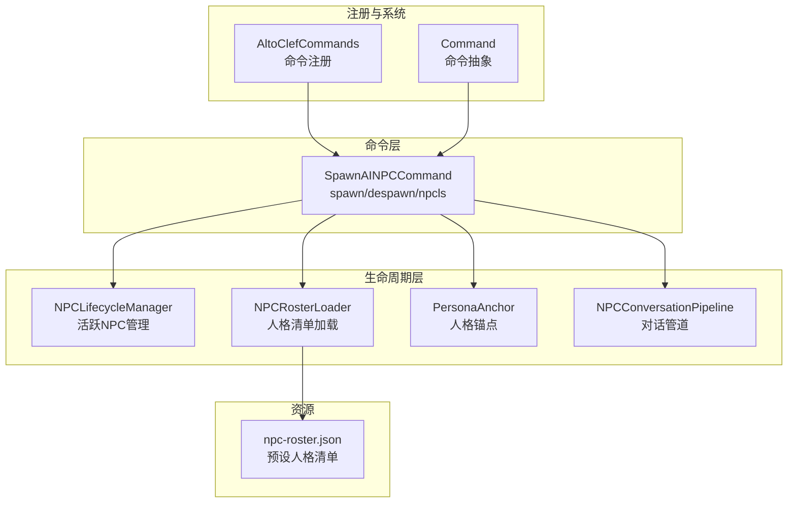
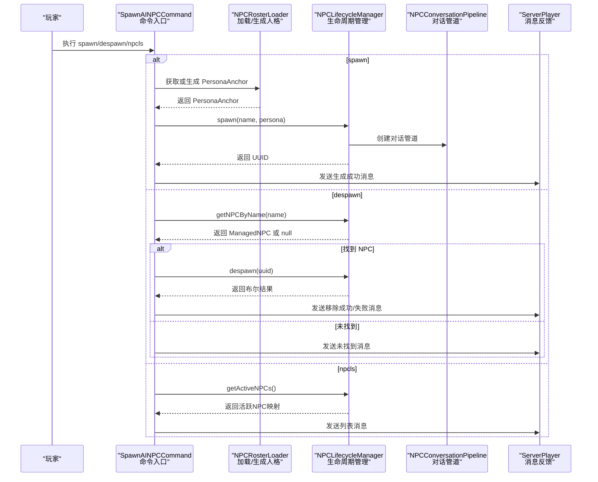
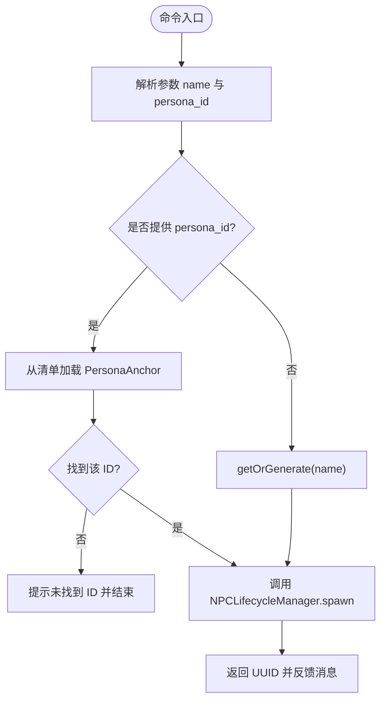
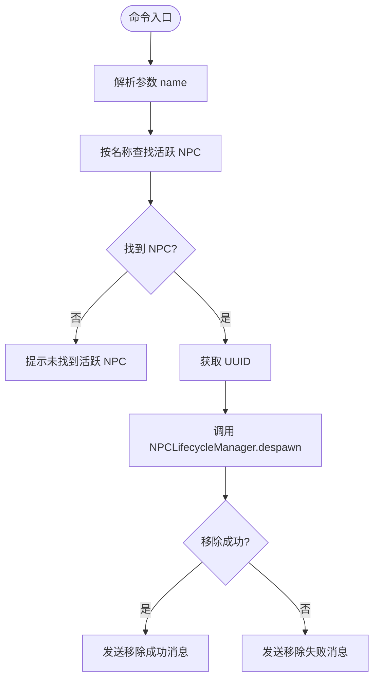
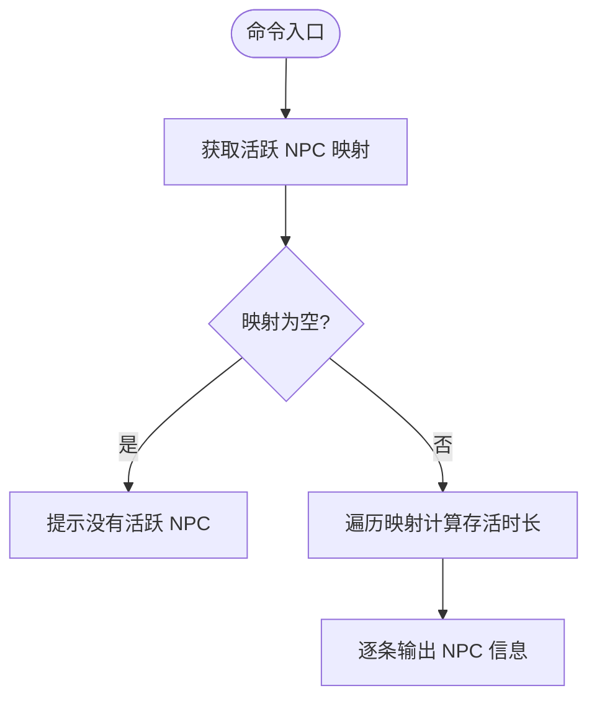
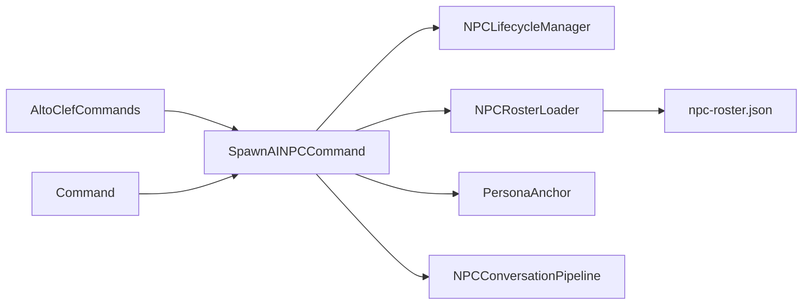

# NPC 管理命令

<cite>
**本文档引用的文件**
- [SpawnAINPCCommand.java](file://src/main/java/adris/altoclef/commands/SpawnAINPCCommand.java)
- [NPCLifecycleManager.java](file://src/main/java/adris/altoclef/player2api/NPCLifecycleManager.java)
- [NPCRosterLoader.java](file://src/main/java/adris/altoclef/player2api/NPCRosterLoader.java)
- [PersonaAnchor.java](file://src/main/java/adris/altoclef/player2api/PersonaAnchor.java)
- [NPCConversationPipeline.java](file://src/main/java/adris/altoclef/player2api/NPCConversationPipeline.java)
- [npc-roster.json](file://src/main/resources/npc-roster.json)
- [Command.java](file://src/main/java/adris/altoclef/commandsystem/Command.java)
- [AltoClefCommands.java](file://src/main/java/adris/altoclef/AltoClefCommands.java)
</cite>

## 目录
1. [简介](#简介)
2. [项目结构](#项目结构)
3. [核心组件](#核心组件)
4. [架构总览](#架构总览)
5. [详细组件分析](#详细组件分析)
6. [依赖关系分析](#依赖关系分析)
7. [性能考虑](#性能考虑)
8. [故障排除指南](#故障排除指南)
9. [结论](#结论)
10. [附录](#附录)

## 简介
本文件面向 NPC 管理命令的使用者与维护者，系统性地介绍并深入解析以下三个核心命令：
- spawn：生成新的 AI NPC，支持通过 persona_id 指定预设人格，或自动生成随机人格
- despawn：按名称查找并移除活跃的 AI NPC
- npcls：列出当前所有活跃的 AI NPC 及其存活时长

文档将详细说明命令语法、参数含义、使用场景、执行效果、错误处理与最佳实践，并提供丰富的使用示例与故障排除建议。

## 项目结构
围绕 NPC 管理命令的相关模块组织如下：
- 命令实现层：位于 commands 包，包含 SpawnAINPCCommand 及其内部的 SpawnCommand、DespawnCommand、NPCListCommand
- 生命周期管理层：位于 player2api 包，包含 NPCLifecycleManager、NPCRosterLoader、PersonaAnchor、NPCConversationPipeline
- 命令注册层：位于根级包，AltoClefCommands 负责将命令注册到命令系统
- 命令系统抽象：位于 commandsystem 包，Command 抽象类定义了命令的基本行为
- 配置资源：npc-roster.json 提供预设 NPC 人格清单

图表来源
- [SpawnAINPCCommand.java:18-105](file://src/main/java/adris/altoclef/commands/SpawnAINPCCommand.java#L18-L105)
- [NPCLifecycleManager.java:20-165](file://src/main/java/adris/altoclef/player2api/NPCLifecycleManager.java#L20-L165)
- [NPCRosterLoader.java:18-85](file://src/main/java/adris/altoclef/player2api/NPCRosterLoader.java#L18-L85)
- [PersonaAnchor.java:14-113](file://src/main/java/adris/altoclef/player2api/PersonaAnchor.java#L14-L113)
- [NPCConversationPipeline.java:14-193](file://src/main/java/adris/altoclef/player2api/NPCConversationPipeline.java#L14-L193)
- [AltoClefCommands.java:31-63](file://src/main/java/adris/altoclef/AltoClefCommands.java#L31-L63)
- [Command.java:6-60](file://src/main/java/adris/altoclef/commandsystem/Command.java#L6-L60)
- [npc-roster.json:1-54](file://src/main/resources/npc-roster.json#L1-L54)

章节来源
- [SpawnAINPCCommand.java:1-105](file://src/main/java/adris/altoclef/commands/SpawnAINPCCommand.java#L1-L105)
- [AltoClefCommands.java:31-63](file://src/main/java/adris/altoclef/AltoClefCommands.java#L31-L63)

## 核心组件
本节概述三个核心命令的功能与职责：
- SpawnCommand：解析参数，选择或生成 PersonaAnchor，调用 NPCLifecycleManager.spawn 创建 NPC，并向玩家反馈结果
- DespawnCommand：根据名称查找活跃 NPC，调用 NPCLifecycleManager.despawn 销毁 NPC，并反馈操作结果
- NPCListCommand：查询活跃 NPC 映射，计算每个 NPC 的存活时长，输出列表

章节来源
- [SpawnAINPCCommand.java:20-98](file://src/main/java/adris/altoclef/commands/SpawnAINPCCommand.java#L20-L98)
- [NPCLifecycleManager.java:72-130](file://src/main/java/adris/altoclef/player2api/NPCLifecycleManager.java#L72-L130)

## 架构总览
下图展示 NPC 管理命令的调用链路与关键对象交互：

图表来源
- [SpawnAINPCCommand.java:20-98](file://src/main/java/adris/altoclef/commands/SpawnAINPCCommand.java#L20-L98)
- [NPCLifecycleManager.java:72-155](file://src/main/java/adris/altoclef/player2api/NPCLifecycleManager.java#L72-L155)
- [NPCRosterLoader.java:66-79](file://src/main/java/adris/altoclef/player2api/NPCRosterLoader.java#L66-L79)
- [NPCConversationPipeline.java:58-61](file://src/main/java/adris/altoclef/player2api/NPCConversationPipeline.java#L58-L61)

## 详细组件分析

### SpawnCommand（spawn 命令）
- 命令语法与参数
  - 语法：spawn <name> [persona_id]
  - 参数说明：
    - name：NPC 名称（必填）
    - persona_id：预设人格 ID（可选）
- 执行流程
  1) 解析参数 name 与 persona_id
  2) 若提供 persona_id，则从 NPCRosterLoader 获取对应 PersonaAnchor；否则调用 getOrGenerate(name) 生成或复用已有同名人格
  3) 调用 NPCLifecycleManager.spawn(name, persona) 创建 NPC，返回 UUID
  4) 向玩家显示生成结果
- 使用场景
  - 快速创建具有固定人格特征的 NPC（如“琪琪”守卫）
  - 自动为新名称生成合理的人格特征
- 执行效果
  - 在活跃 NPC 映射中登记该 NPC
  - 初始化对话管道与灵魂档案
  - 返回唯一 UUID 便于后续管理
- 错误处理
  - 当 persona_id 无效时，提示“未在清单中找到该 ID”
- 典型示例
  - spawn 琪琪 guard_qiqi
  - spawn 瑞瑞 merchant_ruirui
  - spawn 西西 scholar_xixi
  - spawn 小白（未提供 persona_id，将自动生成或复用同名人格）

图表来源
- [SpawnAINPCCommand.java:28-47](file://src/main/java/adris/altoclef/commands/SpawnAINPCCommand.java#L28-L47)
- [NPCRosterLoader.java:66-79](file://src/main/java/adris/altoclef/player2api/NPCRosterLoader.java#L66-L79)
- [NPCLifecycleManager.java:72-84](file://src/main/java/adris/altoclef/player2api/NPCLifecycleManager.java#L72-L84)

章节来源
- [SpawnAINPCCommand.java:20-48](file://src/main/java/adris/altoclef/commands/SpawnAINPCCommand.java#L20-L48)
- [NPCRosterLoader.java:66-79](file://src/main/java/adris/altoclef/player2api/NPCRosterLoader.java#L66-L79)
- [NPCLifecycleManager.java:72-84](file://src/main/java/adris/altoclef/player2api/NPCLifecycleManager.java#L72-L84)

### DespawnCommand（despawn 命令）
- 命令语法与参数
  - 语法：despawn <name>
  - 参数说明：name（必填），按名称查找活跃 NPC
- 执行流程
  1) 解析参数 name
  2) 调用 NPCLifecycleManager.getNPCByName(name) 查找
  3) 若未找到，提示“未找到活跃 NPC”
  4) 若找到，调用 NPCLifecycleManager.despawn(uuid) 执行移除
  5) 反馈成功或失败消息
- 使用场景
  - 清理不再需要的 NPC
  - 批量管理时临时移除某个 NPC
- 执行效果
  - 从活跃映射中移除该 NPC
  - 持久化其灵魂档案
- 错误处理
  - 未找到名称对应的 NPC 时给出明确提示
- 典型示例
  - despawn 琪琪
  - despawn 瑞瑞

图表来源
- [SpawnAINPCCommand.java:56-74](file://src/main/java/adris/altoclef/commands/SpawnAINPCCommand.java#L56-L74)
- [NPCLifecycleManager.java:142-155](file://src/main/java/adris/altoclef/player2api/NPCLifecycleManager.java#L142-L155)

章节来源
- [SpawnAINPCCommand.java:50-75](file://src/main/java/adris/altoclef/commands/SpawnAINPCCommand.java#L50-L75)
- [NPCLifecycleManager.java:92-105](file://src/main/java/adris/altoclef/player2api/NPCLifecycleManager.java#L92-L105)

### NPCListCommand（npcls 命令）
- 命令语法与参数
  - 语法：npcls
  - 参数说明：无
- 执行流程
  1) 调用 NPCLifecycleManager.getActiveNPCs() 获取活跃 NPC 映射
  2) 若为空，提示“当前没有活跃的 AI NPC”
  3) 否则遍历映射，计算每个 NPC 的存活时长（分钟），逐条输出
- 使用场景
  - 监控当前活跃 NPC 的数量与状态
  - 定期检查 NPC 的存活时间，进行资源清理
- 执行效果
  - 输出活跃 NPC 列表及存活时长
- 典型示例
  - npcls

图表来源
- [SpawnAINPCCommand.java:82-97](file://src/main/java/adris/altoclef/commands/SpawnAINPCCommand.java#L82-L97)
- [NPCLifecycleManager.java:128-130](file://src/main/java/adris/altoclef/player2api/NPCLifecycleManager.java#L128-L130)

章节来源
- [SpawnAINPCCommand.java:77-98](file://src/main/java/adris/altoclef/commands/SpawnAINPCCommand.java#L77-L98)
- [NPCLifecycleManager.java:128-130](file://src/main/java/adris/altoclef/player2api/NPCLifecycleManager.java#L128-L130)

## 依赖关系分析
- 命令层依赖生命周期层与资源层
  - SpawnAINPCCommand 依赖 NPCLifecycleManager、NPCRosterLoader、PersonaAnchor、NPCConversationPipeline
  - NPCRosterLoader 依赖 npc-roster.json 资源文件
- 命令注册
  - AltoClefCommands.init 将 spawn、despawn、npcls 注册到命令系统
- 命令系统抽象
  - Command 抽象类统一了命令的解析、执行与收尾逻辑

图表来源
- [SpawnAINPCCommand.java:18-105](file://src/main/java/adris/altoclef/commands/SpawnAINPCCommand.java#L18-L105)
- [NPCLifecycleManager.java:20-165](file://src/main/java/adris/altoclef/player2api/NPCLifecycleManager.java#L20-L165)
- [NPCRosterLoader.java:18-85](file://src/main/java/adris/altoclef/player2api/NPCRosterLoader.java#L18-L85)
- [AltoClefCommands.java:31-63](file://src/main/java/adris/altoclef/AltoClefCommands.java#L31-L63)
- [Command.java:6-60](file://src/main/java/adris/altoclef/commandsystem/Command.java#L6-L60)
- [npc-roster.json:1-54](file://src/main/resources/npc-roster.json#L1-L54)

章节来源
- [AltoClefCommands.java:31-63](file://src/main/java/adris/altoclef/AltoClefCommands.java#L31-L63)
- [Command.java:13-24](file://src/main/java/adris/altoclef/commandsystem/Command.java#L13-L24)

## 性能考虑
- 并发安全
  - 活跃 NPC 映射采用并发容器，保证多线程环境下的安全访问
- 时间复杂度
  - spawn/despawn：O(1)（基于 UUID 的映射操作）
  - getNPCByName：O(n)（遍历活跃 NPC 映射）
  - npcls：O(n)（遍历活跃 NPC 映射并计算存活时长）
- 冷却与锁
  - NPCConversationPipeline 为每个 NPC 维护独立的锁与冷却期，避免全局阻塞
- 建议
  - 大规模批量管理时优先使用 UUID 进行直接定位，减少按名称查找的成本
  - 合理设置命令执行频率，避免频繁触发 npcls 导致不必要的遍历开销

[本节为通用性能讨论，不直接分析具体文件]

## 故障排除指南
- 问题：spawn 时提示“未在清单中找到该 ID”
  - 原因：提供的 persona_id 不存在于 npc-roster.json
  - 处理：确认 persona_id 是否正确，或省略该参数以自动生成人格
- 问题：despawn 时提示“未找到活跃 NPC”
  - 原因：name 与活跃 NPC 不匹配，或 NPC 已被移除
  - 处理：先执行 npcls 确认 NPC 是否仍活跃，再重试
- 问题：despawn 返回失败
  - 原因：UUID 对应的 NPC 已不存在
  - 处理：确认 UUID 或 name 的准确性，必要时重新生成
- 问题：npcls 输出为空
  - 原因：当前没有活跃的 NPC
  - 处理：先使用 spawn 创建 NPC

章节来源
- [SpawnAINPCCommand.java:35-40](file://src/main/java/adris/altoclef/commands/SpawnAINPCCommand.java#L35-L40)
- [SpawnAINPCCommand.java:61-65](file://src/main/java/adris/altoclef/commands/SpawnAINPCCommand.java#L61-L65)
- [SpawnAINPCCommand.java:67-72](file://src/main/java/adris/altoclef/commands/SpawnAINPCCommand.java#L67-L72)
- [NPCLifecycleManager.java:94-96](file://src/main/java/adris/altoclef/player2api/NPCLifecycleManager.java#L94-L96)

## 结论
NPC 管理命令提供了简洁而强大的接口，支持按需创建、精确移除与全局监控。通过预设的人格清单与随机生成机制，用户可以在不同场景下灵活选择 NPC 的性格特征。配合生命周期管理器与对话管道，系统实现了高并发下的稳定运行与良好的用户体验。建议在生产环境中遵循最佳实践，合理规划 NPC 的生命周期，确保资源占用与性能表现的平衡。

[本节为总结性内容，不直接分析具体文件]

## 附录

### 使用示例与最佳实践
- 使用预设 persona_id 创建 NPC
  - 示例：spawn 琪琪 guard_qiqi
  - 说明：使用预设人格“琪琪”，适合需要固定角色设定的场景
- 使用随机人格创建 NPC
  - 示例：spawn 小白
  - 说明：未提供 persona_id 时自动为新名称生成合理的人格
- 批量管理
  - 步骤：先 npcls 查看当前活跃 NPC，再针对特定名称执行 despawn
  - 注意：避免在同一轮次内对同一 NPC 进行重复移除
- 生命周期管理最佳实践
  - 定期清理长时间活跃且无交互的 NPC，释放内存与资源
  - 对重要 NPC 使用稳定的 name，便于后续管理与追踪
  - 在大规模部署时，优先使用 UUID 进行直接定位，减少按名称查找的开销

[本节为概念性内容，不直接分析具体文件]