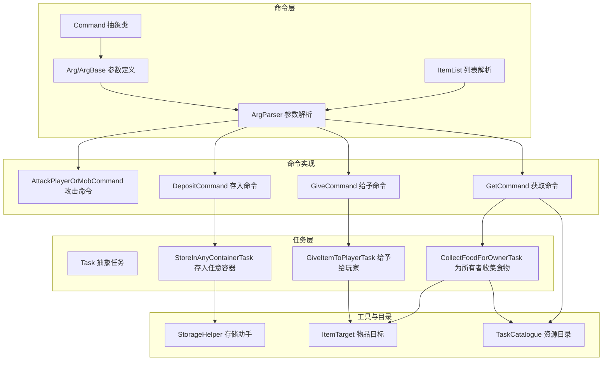
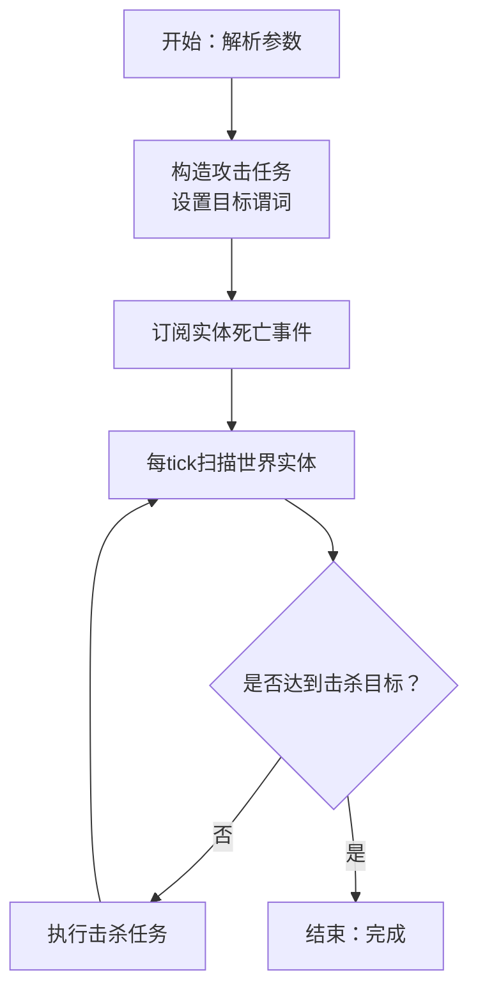
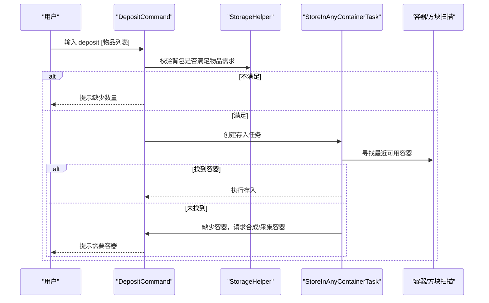
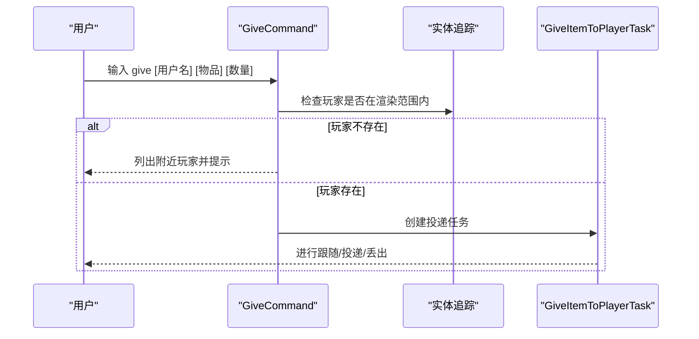
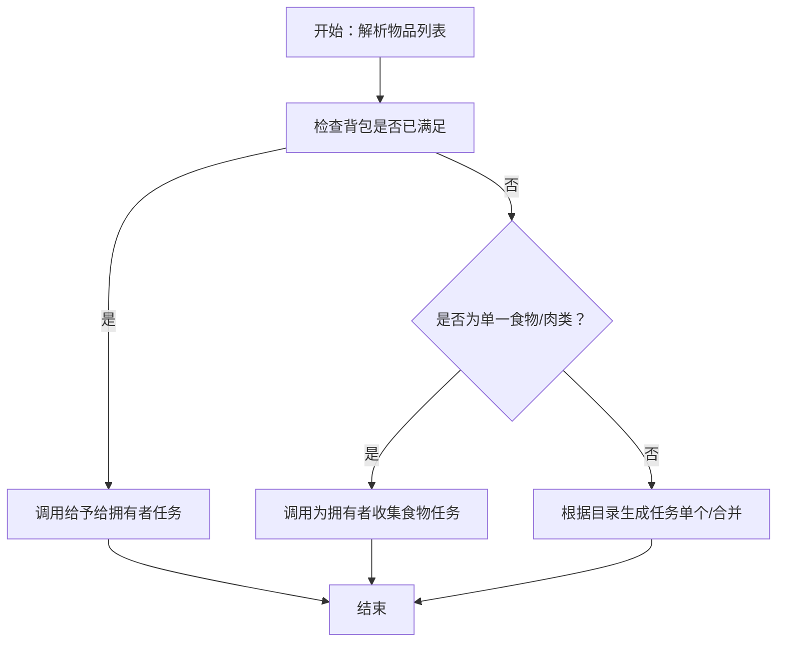
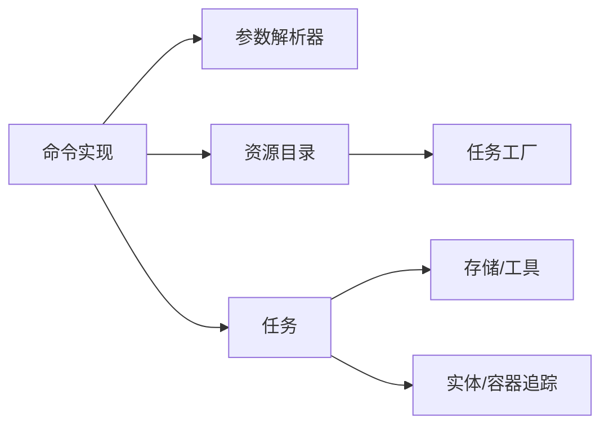

# 交互命令

<cite>
**本文引用的文件**
- [AttackPlayerOrMobCommand.java](file://src/main/java/adris/altoclef/commands/AttackPlayerOrMobCommand.java)
- [DepositCommand.java](file://src/main/java/adris/altoclef/commands/DepositCommand.java)
- [GiveCommand.java](file://src/main/java/adris/altoclef/commands/GiveCommand.java)
- [GetCommand.java](file://src/main/java/adris/altoclef/commands/GetCommand.java)
- [Command.java](file://src/main/java/adris/altoclef/commandsystem/Command.java)
- [ArgParser.java](file://src/main/java/adris/altoclef/commandsystem/ArgParser.java)
- [Arg.java](file://src/main/java/adris/altoclef/commandsystem/Arg.java)
- [ArgBase.java](file://src/main/java/adris/altoclef/commandsystem/ArgBase.java)
- [ItemList.java](file://src/main/java/adris/altoclef/commandsystem/ItemList.java)
- [Task.java](file://src/main/java/adris/altoclef/tasksystem/Task.java)
- [GiveItemToPlayerTask.java](file://src/main/java/adris/altoclef/tasks/entity/GiveItemToPlayerTask.java)
- [StoreInAnyContainerTask.java](file://src/main/java/adris/altoclef/tasks/container/StoreInAnyContainerTask.java)
- [CollectFoodForOwnerTask.java](file://src/main/java/adris/altoclef/tasks/resources/CollectFoodForOwnerTask.java)
- [StorageHelper.java](file://src/main/java/adris/altoclef/util/helpers/StorageHelper.java)
- [ItemTarget.java](file://src/main/java/adris/altoclef/util/ItemTarget.java)
- [TaskCatalogue.java](file://src/main/java/adris/altoclef/TaskCatalogue.java)
</cite>

## 目录
1. [简介](#简介)
2. [项目结构](#项目结构)
3. [核心组件](#核心组件)
4. [架构总览](#架构总览)
5. [详细组件分析](#详细组件分析)
6. [依赖分析](#依赖分析)
7. [性能考量](#性能考量)
8. [故障排查指南](#故障排查指南)
9. [结论](#结论)
10. [附录](#附录)

## 简介
本文件聚焦于“交互命令”子系统，系统性梳理并解释以下命令的行为与实现：攻击（attack）、存入（deposit）、给予（give）、获取（get）。文档从语法、交互对象、执行条件、安全机制、错误处理与性能影响等维度进行深入分析，并结合任务系统与工具类，给出在不同实体与物品类型（敌对生物、友好生物、容器、物品）上的处理方式与典型使用场景。

## 项目结构
交互命令位于命令系统之下，通过命令解析器将用户输入转换为参数，再委派到具体任务（Task）执行。命令与任务之间以“目标资源目录（TaskCatalogue）”衔接，支持按名称或物品匹配自动推导采集/合成路径；同时，存储与容器相关逻辑由存储助手与容器任务负责。



图表来源
- [Command.java:1-61](file://src/main/java/adris/altoclef/commandsystem/Command.java#L1-L61)
- [Arg.java:1-171](file://src/main/java/adris/altoclef/commandsystem/Arg.java#L1-L171)
- [ArgBase.java:1-44](file://src/main/java/adris/altoclef/commandsystem/ArgBase.java#L1-L44)
- [ArgParser.java:1-106](file://src/main/java/adris/altoclef/commandsystem/ArgParser.java#L1-L106)
- [ItemList.java:1-90](file://src/main/java/adris/altoclef/commandsystem/ItemList.java#L1-L90)
- [AttackPlayerOrMobCommand.java:1-177](file://src/main/java/adris/altoclef/commands/AttackPlayerOrMobCommand.java#L1-L177)
- [DepositCommand.java:1-97](file://src/main/java/adris/altoclef/commands/DepositCommand.java#L1-L97)
- [GiveCommand.java:1-92](file://src/main/java/adris/altoclef/commands/GiveCommand.java#L1-L92)
- [GetCommand.java:1-79](file://src/main/java/adris/altoclef/commands/GetCommand.java#L1-L79)
- [Task.java:1-181](file://src/main/java/adris/altoclef/tasksystem/Task.java#L1-L181)
- [GiveItemToPlayerTask.java:1-155](file://src/main/java/adris/altoclef/tasks/entity/GiveItemToPlayerTask.java#L1-L155)
- [StoreInAnyContainerTask.java:1-121](file://src/main/java/adris/altoclef/tasks/container/StoreInAnyContainerTask.java#L1-L121)
- [CollectFoodForOwnerTask.java:1-498](file://src/main/java/adris/altoclef/tasks/resources/CollectFoodForOwnerTask.java#L1-L498)
- [StorageHelper.java:1-313](file://src/main/java/adris/altoclef/util/helpers/StorageHelper.java#L1-L313)
- [ItemTarget.java:1-185](file://src/main/java/adris/altoclef/util/ItemTarget.java#L1-L185)
- [TaskCatalogue.java:1-800](file://src/main/java/adris/altoclef/TaskCatalogue.java#L1-L800)

章节来源
- [Command.java:1-61](file://src/main/java/adris/altoclef/commandsystem/Command.java#L1-L61)
- [ArgParser.java:1-106](file://src/main/java/adris/altoclef/commandsystem/ArgParser.java#L1-L106)
- [Arg.java:1-171](file://src/main/java/adris/altoclef/commandsystem/Arg.java#L1-L171)
- [ItemList.java:1-90](file://src/main/java/adris/altoclef/commandsystem/ItemList.java#L1-L90)

## 核心组件
- 命令抽象与参数系统
  - 命令基类负责解析行输入、调用具体命令实现、完成回调。
  - 参数解析器支持空格分词、引号内空格、注释截断、默认值与数组参数。
  - 参数类型限定为字符串、整数、浮点、长整型、物品列表、目标点等。
- 交互命令
  - 攻击：选择目标实体（玩家、怪物、最近敌人、特定名称），追踪击杀并计数。
  - 存入：在附近容器中存放物品，必要时先合成/采集容器或放置新容器。
  - 给予：向指定玩家投递或丢出物品，若无目标则回退至拥有者。
  - 获取：根据资源目录生成采集/合成链路，优先满足已有库存，否则构建完整任务树。
- 任务系统
  - 任务生命周期：启动、逐tick推进、停止/中断、失败处理。
  - 任务树：当前任务可持有子任务，支持可强制打断策略。
- 工具与目录
  - ItemTarget：统一物品目标描述，支持目录名与具体物品匹配。
  - StorageHelper：库存检查、工具槽位选择、垃圾物品判定等。
  - TaskCatalogue：资源/任务目录，按名称或物品映射到具体任务工厂。

章节来源
- [Task.java:1-181](file://src/main/java/adris/altoclef/tasksystem/Task.java#L1-L181)
- [ItemTarget.java:1-185](file://src/main/java/adris/altoclef/util/ItemTarget.java#L1-L185)
- [StorageHelper.java:1-313](file://src/main/java/adris/altoclef/util/helpers/StorageHelper.java#L1-L313)
- [TaskCatalogue.java:1-800](file://src/main/java/adris/altoclef/TaskCatalogue.java#L1-L800)

## 架构总览
交互命令的执行流程自上而下分为“命令层—任务层—工具层”，命令层负责语义解析与参数校验，任务层负责行为编排与状态机推进，工具层提供存储、匹配与辅助能力。

```mermaid
sequenceDiagram
participant U as "用户"
participant CMD as "命令实现"
participant PAR as "参数解析器"
participant CAT as "资源目录"
participant TSK as "任务"
participant HELPER as "存储/工具"
U->>CMD : 输入命令与参数
CMD->>PAR : 解析参数
alt 攻击/给予/获取
CMD->>CAT : 查找任务/目标
CAT-->>CMD : 返回任务工厂/匹配项
CMD->>TSK : 创建并运行任务
TSK->>HELPER : 查询库存/容器/实体
TSK-->>CMD : 完成/失败
else 存入
CMD->>TSK : 创建存入任务
TSK->>HELPER : 查找/放置容器
TSK-->>CMD : 完成/失败
end
CMD-->>U : 输出结果/日志
```

图表来源
- [AttackPlayerOrMobCommand.java:34-38](file://src/main/java/adris/altoclef/commands/AttackPlayerOrMobCommand.java#L34-L38)
- [DepositCommand.java:54-95](file://src/main/java/adris/altoclef/commands/DepositCommand.java#L54-L95)
- [GiveCommand.java:29-90](file://src/main/java/adris/altoclef/commands/GiveCommand.java#L29-L90)
- [GetCommand.java:25-77](file://src/main/java/adris/altoclef/commands/GetCommand.java#L25-L77)
- [ArgParser.java:57-96](file://src/main/java/adris/altoclef/commandsystem/ArgParser.java#L57-L96)
- [TaskCatalogue.java:146-176](file://src/main/java/adris/altoclef/TaskCatalogue.java#L146-L176)
- [Task.java:17-50](file://src/main/java/adris/altoclef/tasksystem/Task.java#L17-L50)

## 详细组件分析

### 攻击命令（attack）
- 语法与参数
  - 名称：attack
  - 参数：目标名称（字符串），击杀数量（整数，默认1）
  - 示例：attack zombie 5、attack Player
- 交互对象
  - 可选目标：玩家（按用户名）、怪物（按名称映射）、最近敌人（nearest）、最近敌对（nearest_hostile）
  - 中文名称映射：苦力怕、僵尸、骷髅、蜘蛛、末影人、史莱姆、女巫等
- 执行条件与流程
  - 启动后订阅实体死亡事件，统计击杀数；当达到目标数量时结束。
  - nearest_hostile 模式下，以拥有者位置为中心搜索并移动保护。
- 安全机制
  - 仅在未达目标数量前持续执行；避免重复跟踪已死亡实体。
  - 使用事件驱动更新击杀计数，减少轮询开销。
- 典型场景
  - 清理刷怪笼周边：attack nearest_hostile 10
  - 击杀特定怪物：attack slime 3
  - 攻击特定玩家：attack Alex 1



图表来源
- [AttackPlayerOrMobCommand.java:40-177](file://src/main/java/adris/altoclef/commands/AttackPlayerOrMobCommand.java#L40-L177)

章节来源
- [AttackPlayerOrMobCommand.java:23-38](file://src/main/java/adris/altoclef/commands/AttackPlayerOrMobCommand.java#L23-L38)
- [AttackPlayerOrMobCommand.java:40-177](file://src/main/java/adris/altoclef/commands/AttackPlayerOrMobCommand.java#L40-L177)

### 存入命令（deposit）
- 语法与参数
  - 名称：deposit
  - 参数：物品列表（可选，为空表示非装备类全部物品）
  - 示例：deposit、deposit diamond 2
- 交互对象
  - 容器：箱子、陷阱箱、桶、潜影盒等
  - 范围：附近20格内
- 执行条件与流程
  - 若提供物品列表，先检查背包是否足够；不足则提示缺少数量并结束。
  - 选择最近可用容器；若无则尝试先合成/采集容器，再放置。
  - 将目标物品存入容器，支持“缺货前先采集容器”的策略。
- 安全机制
  - 避免将容器放置在不安全位置（上方不可破坏）。
  - 排除已满容器，避免无效寻径。
- 典型场景
  - 整理背包：deposit
  - 存入指定物品：deposit iron_ingot 10



图表来源
- [DepositCommand.java:54-95](file://src/main/java/adris/altoclef/commands/DepositCommand.java#L54-L95)
- [StoreInAnyContainerTask.java:32-80](file://src/main/java/adris/altoclef/tasks/container/StoreInAnyContainerTask.java#L32-L80)
- [StorageHelper.java:231-271](file://src/main/java/adris/altoclef/util/helpers/StorageHelper.java#L231-L271)

章节来源
- [DepositCommand.java:23-36](file://src/main/java/adris/altoclef/commands/DepositCommand.java#L23-L36)
- [DepositCommand.java:54-95](file://src/main/java/adris/altoclef/commands/DepositCommand.java#L54-L95)
- [StoreInAnyContainerTask.java:18-121](file://src/main/java/adris/altoclef/tasks/container/StoreInAnyContainerTask.java#L18-L121)
- [StorageHelper.java:231-271](file://src/main/java/adris/altoclef/util/helpers/StorageHelper.java#L231-L271)

### 给予命令（give）
- 语法与参数
  - 名称：give
  - 参数：用户名（可选，省略时回退到拥有者）、物品名、数量
  - 示例：give Ellie diamond 3
- 交互对象
  - 玩家：按用户名查找，支持模糊匹配相近名称
  - 物品：支持资源目录项或背包内现有物品
- 执行条件与流程
  - 若无用户名且无拥有者，直接结束并提示。
  - 若物品为目录项，按目录目标构造；否则在背包中匹配同名物品。
  - 若找不到玩家，列出附近玩家并提示可能的拼写。
  - 成功后创建“给玩家物品”任务，执行投递/丢出。
- 安全机制
  - 严格检查玩家可见性，若离开视野则失败并提示。
  - 保护物品清单，避免在投递过程中被误用。
- 典型场景
  - 给玩家物品：give Alex apple 5
  - 无参自动给拥有者：give diamond 1



图表来源
- [GiveCommand.java:29-90](file://src/main/java/adris/altoclef/commands/GiveCommand.java#L29-L90)
- [GiveItemToPlayerTask.java:39-134](file://src/main/java/adris/altoclef/tasks/entity/GiveItemToPlayerTask.java#L39-L134)

章节来源
- [GiveCommand.java:18-27](file://src/main/java/adris/altoclef/commands/GiveCommand.java#L18-L27)
- [GiveCommand.java:29-90](file://src/main/java/adris/altoclef/commands/GiveCommand.java#L29-L90)
- [GiveItemToPlayerTask.java:24-155](file://src/main/java/adris/altoclef/tasks/entity/GiveItemToPlayerTask.java#L24-L155)

### 获取命令（get）
- 语法与参数
  - 名称：get
  - 参数：物品列表（至少一个）
  - 示例：get log 20、get diamond_chestplate 1
- 交互对象
  - 物品：支持资源目录项与多物品组合
- 执行条件与流程
  - 若所有目标已在背包中满足，直接调用“给予给拥有者”任务快速交付。
  - 对肉/食物有特殊分支：使用“为拥有者收集食物”任务，覆盖容器、掉落物、烹饪、狩猎与投递全流程。
  - 否则根据单个或多个目标生成对应任务，优先使用目录任务工厂。
- 安全机制
  - 在收集食物流程中，保护食物与生食，避免被误用。
  - 多阶段状态机：容器搜索→掉落物搜索→烹饪→狩猎→投递。
- 典型场景
  - 采集原木：get log 50
  - 合成护甲：get diamond_chestplate 1
  - 为拥有者准备食物：get food 10 或 get meat 10



图表来源
- [GetCommand.java:25-77](file://src/main/java/adris/altoclef/commands/GetCommand.java#L25-L77)
- [CollectFoodForOwnerTask.java:76-322](file://src/main/java/adris/altoclef/tasks/resources/CollectFoodForOwnerTask.java#L76-L322)

章节来源
- [GetCommand.java:16-23](file://src/main/java/adris/altoclef/commands/GetCommand.java#L16-L23)
- [GetCommand.java:25-77](file://src/main/java/adris/altoclef/commands/GetCommand.java#L25-L77)
- [CollectFoodForOwnerTask.java:36-498](file://src/main/java/adris/altoclef/tasks/resources/CollectFoodForOwnerTask.java#L36-L498)

## 依赖分析
- 命令层依赖
  - 命令实现依赖参数解析器与资源目录，用于参数校验与任务生成。
- 任务层依赖
  - 任务实现依赖存储助手与实体追踪，用于库存查询、容器扫描、实体定位。
- 工具与目录
  - ItemTarget统一物品目标；StorageHelper提供库存与工具判断；TaskCatalogue提供任务工厂。



图表来源
- [ArgParser.java:57-96](file://src/main/java/adris/altoclef/commandsystem/ArgParser.java#L57-L96)
- [TaskCatalogue.java:146-176](file://src/main/java/adris/altoclef/TaskCatalogue.java#L146-L176)
- [Task.java:17-50](file://src/main/java/adris/altoclef/tasksystem/Task.java#L17-L50)
- [StorageHelper.java:168-175](file://src/main/java/adris/altoclef/util/helpers/StorageHelper.java#L168-L175)

章节来源
- [ArgParser.java:1-106](file://src/main/java/adris/altoclef/commandsystem/ArgParser.java#L1-L106)
- [TaskCatalogue.java:1-800](file://src/main/java/adris/altoclef/TaskCatalogue.java#L1-L800)
- [Task.java:1-181](file://src/main/java/adris/altoclef/tasksystem/Task.java#L1-L181)
- [StorageHelper.java:1-313](file://src/main/java/adris/altoclef/util/helpers/StorageHelper.java#L1-L313)

## 性能考量
- 参数解析
  - 引号内空格与注释处理避免多余分割，提升解析效率。
  - 数组参数一次性读取剩余片段，减少多次解析成本。
- 任务推进
  - 任务树采用子任务驱动，避免轮询；仅在必要时切换子任务。
  - 任务可强制打断策略降低长时间阻塞风险。
- 存储与容器
  - 容器扫描限制范围与排除已满容器，减少无效寻径。
  - 优先复用现有容器，避免频繁放置/拆除。

## 故障排查指南
- 命令参数错误
  - 参数过多/过少：解析器会抛出异常，检查命令帮助表示法。
  - 类型解析失败：确认数值/字符串格式正确。
- 玩家交互失败
  - 玩家不在渲染范围内：查看附近玩家列表，修正用户名。
  - 无法找到物品：使用资源目录名称或启用模糊匹配建议。
- 存入失败
  - 容器不可用：检查容器上方空间与周围环境。
  - 物品不足：先执行获取命令补齐所需物品。
- 攻击未生效
  - 目标名称映射：确认中文名称是否在映射表中。
  - 计数未达标：检查击杀事件订阅与死亡实体去重逻辑。

章节来源
- [ArgParser.java:69-96](file://src/main/java/adris/altoclef/commandsystem/ArgParser.java#L69-L96)
- [GiveCommand.java:60-89](file://src/main/java/adris/altoclef/commands/GiveCommand.java#L60-L89)
- [StoreInAnyContainerTask.java:46-61](file://src/main/java/adris/altoclef/tasks/container/StoreInAnyContainerTask.java#L46-L61)
- [AttackPlayerOrMobCommand.java:118-162](file://src/main/java/adris/altoclef/commands/AttackPlayerOrMobCommand.java#L118-L162)

## 结论
交互命令体系以命令解析器为核心，将自然语言式输入转化为可执行的任务图谱。通过资源目录与任务工厂，系统能够灵活适配不同实体与物品类型；借助存储助手与容器任务，实现高效稳定的交互行为。在实际使用中，建议优先利用资源目录名称与批量物品列表，配合“先获取后存入/给予”的策略，以获得更稳健的执行体验。

## 附录
- 命令帮助表示法
  - 命令基类提供帮助文本拼接，便于生成命令参考。
- 任务调试
  - 任务内部维护调试状态，便于观察当前阶段与子任务。

章节来源
- [Command.java:32-60](file://src/main/java/adris/altoclef/commandsystem/Command.java#L32-L60)
- [Task.java:98-104](file://src/main/java/adris/altoclef/tasksystem/Task.java#L98-L104)