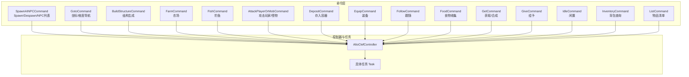
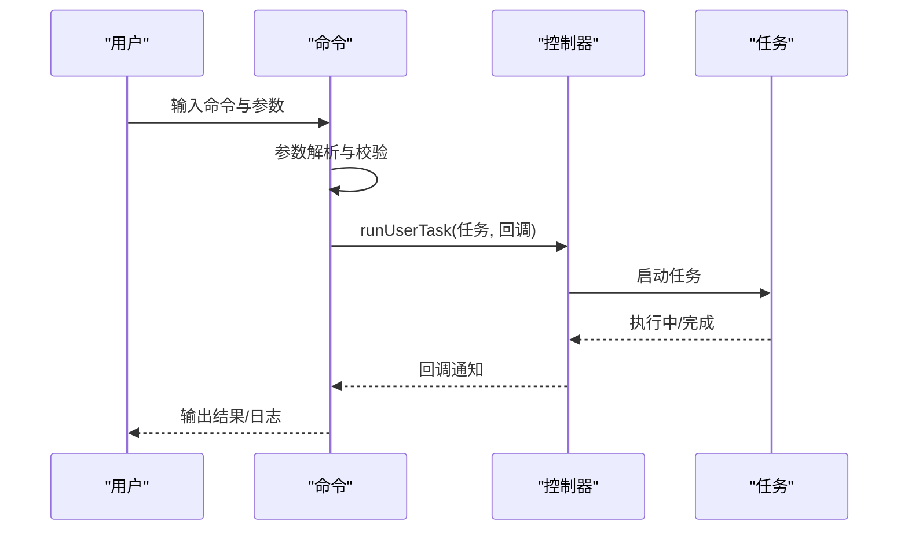
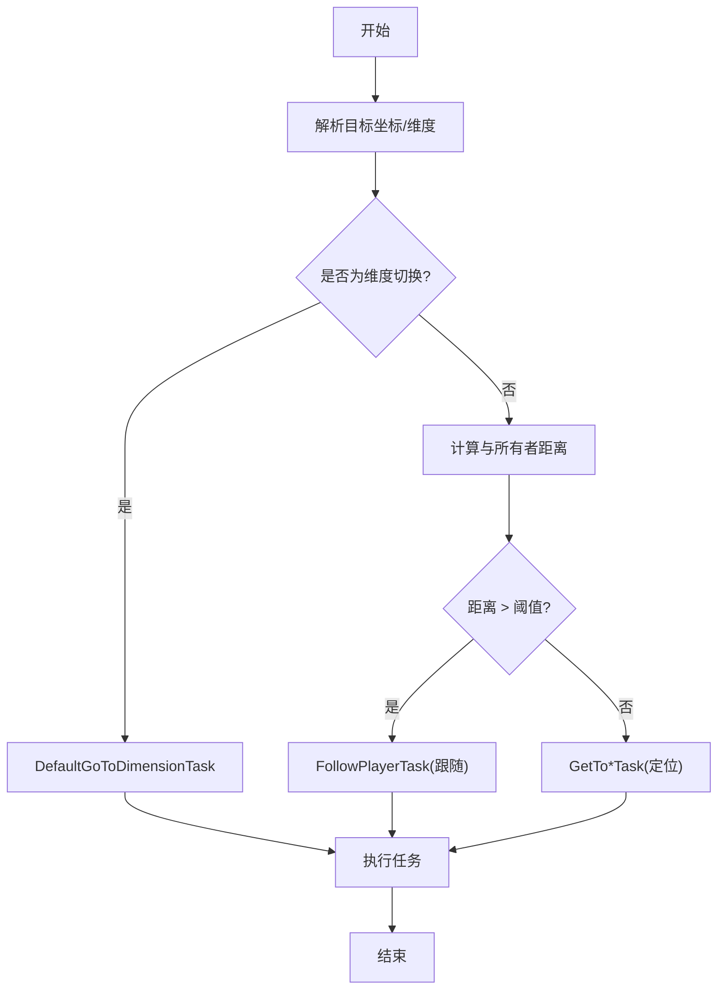
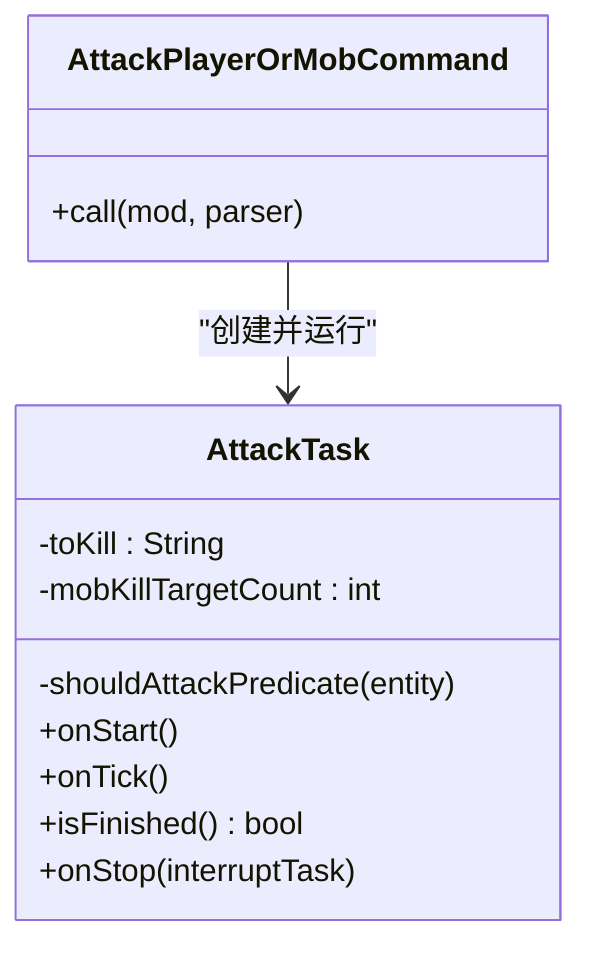

# 内置命令详解

<cite>
**本文引用的文件**
- [SpawnAINPCCommand.java](file://src/main/java/adris/altoclef/commands/SpawnAINPCCommand.java)
- [GotoCommand.java](file://src/main/java/adris/altoclef/commands/GotoCommand.java)
- [BuildStructureCommand.java](file://src/main/java/adris/altoclef/commands/BuildStructureCommand.java)
- [FarmCommand.java](file://src/main/java/adris/altoclef/commands/FarmCommand.java)
- [FishCommand.java](file://src/main/java/adris/altoclef/commands/FishCommand.java)
- [AttackPlayerOrMobCommand.java](file://src/main/java/adris/altoclef/commands/AttackPlayerOrMobCommand.java)
- [DepositCommand.java](file://src/main/java/adris/altoclef/commands/DepositCommand.java)
- [EquipCommand.java](file://src/main/java/adris/altoclef/commands/EquipCommand.java)
- [FollowCommand.java](file://src/main/java/adris/altoclef/commands/FollowCommand.java)
- [FoodCommand.java](file://src/main/java/adris/altoclef/commands/FoodCommand.java)
- [GetCommand.java](file://src/main/java/adris/altoclef/commands/GetCommand.java)
- [GiveCommand.java](file://src/main/java/adris/altoclef/commands/GiveCommand.java)
- [IdleCommand.java](file://src/main/java/adris/altoclef/commands/IdleCommand.java)
- [InventoryCommand.java](file://src/main/java/adris/altoclef/commands/InventoryCommand.java)
- [ListCommand.java](file://src/main/java/adris/altoclef/commands/ListCommand.java)
</cite>

## 目录
1. [简介](#简介)
2. [项目结构与命令体系总览](#项目结构与命令体系总览)
3. [核心命令总览](#核心命令总览)
4. [架构与控制流概览](#架构与控制流概览)
5. [详细命令参考](#详细命令参考)
   - [SpawnAINPCCommand（AI NPC 生产）](#spawnainpccommandai-npc-生产)
   - [GotoCommand（导航）](#gotocommand导航)
   - [BuildStructureCommand（建筑）](#buildstructurecommand建筑)
   - [FarmCommand（农场）](#farmcommand农场)
   - [FishCommand（钓鱼）](#fishcommand钓鱼)
   - [AttackPlayerOrMobCommand（攻击）](#attackplayerormobcommand攻击)
   - [DepositCommand（存入）](#depositcommand存入)
   - [EquipCommand（装备）](#equipcommand装备)
   - [FollowCommand（跟随）](#followcommand跟随)
   - [FoodCommand（食物）](#foodcommand食物)
   - [GetCommand（获取/合成）](#getcommand获取合成)
   - [GiveCommand（给予）](#givecommand给予)
   - [IdleCommand（闲置）](#idlecommand闲置)
   - [InventoryCommand（查看背包）](#inventorycommand查看背包)
   - [ListCommand（列出可获得物品清单）](#listcommand列出可获得物品清单)
6. [命令组合与高级用法](#命令组合与高级用法)
7. [性能与稳定性考量](#性能与稳定性考量)
8. [故障排查指南](#故障排查指南)
9. [结论](#结论)

## 简介
本文件面向使用者与开发者，系统性梳理项目中的“内置命令”体系，重点覆盖以下命令：SpawnAINPCCommand（AI NPC 生产）、GotoCommand（导航）、BuildStructureCommand（建筑）、FarmCommand（农场）、FishCommand（钓鱼），以及与之相关的资源收集、战斗、物流、跟随、闲置等常用命令。文档从“语法与参数”“使用场景与效果”“典型示例”“组合与进阶用法”“最佳实践与注意事项”五个维度展开，帮助快速上手并安全高效地使用这些命令。

## 项目结构与命令体系总览
- 命令统一位于模块路径：adris/altoclef/commands
- 每个命令通常继承自通用命令基类，定义名称、描述与参数，并在调用时将请求转换为具体任务（Task）交由控制器执行
- 控制器负责解析参数、校验前置条件、调度任务链、处理完成回调

图表来源
- [SpawnAINPCCommand.java:18-98](file://src/main/java/adris/altoclef/commands/SpawnAINPCCommand.java#L18-L98)
- [GotoCommand.java:20-64](file://src/main/java/adris/altoclef/commands/GotoCommand.java#L20-L64)
- [BuildStructureCommand.java:10-27](file://src/main/java/adris/altoclef/commands/BuildStructureCommand.java#L10-L27)
- [FarmCommand.java:12-27](file://src/main/java/adris/altoclef/commands/FarmCommand.java#L12-L27)
- [FishCommand.java:9-17](file://src/main/java/adris/altoclef/commands/FishCommand.java#L9-L17)

章节来源
- [SpawnAINPCCommand.java:1-106](file://src/main/java/adris/altoclef/commands/SpawnAINPCCommand.java#L1-L106)
- [GotoCommand.java:1-66](file://src/main/java/adris/altoclef/commands/GotoCommand.java#L1-L66)
- [BuildStructureCommand.java:1-29](file://src/main/java/adris/altoclef/commands/BuildStructureCommand.java#L1-L29)
- [FarmCommand.java:1-29](file://src/main/java/adris/altoclef/commands/FarmCommand.java#L1-L29)
- [FishCommand.java:1-19](file://src/main/java/adris/altoclef/commands/FishCommand.java#L1-L19)

## 核心命令总览
- SpawnAINPCCommand：创建/移除 AI NPC、列出活跃 NPC
- GotoCommand：按坐标/维度移动；对远距离进行守卫限制
- BuildStructureCommand：根据描述与坐标生成结构
- FarmCommand：在指定范围内自动农场
- FishCommand：自动钓鱼
- 其他常用命令：攻击、存入、装备、跟随、食物、获取/合成、给予、闲置、背包查询、物品清单

章节来源
- [AttackPlayerOrMobCommand.java:23-38](file://src/main/java/adris/altoclef/commands/AttackPlayerOrMobCommand.java#L23-L38)
- [DepositCommand.java:23-95](file://src/main/java/adris/altoclef/commands/DepositCommand.java#L23-L95)
- [EquipCommand.java:15-57](file://src/main/java/adris/altoclef/commands/EquipCommand.java#L15-L57)
- [FollowCommand.java:10-31](file://src/main/java/adris/altoclef/commands/FollowCommand.java#L10-L31)
- [FoodCommand.java:11-21](file://src/main/java/adris/altoclef/commands/FoodCommand.java#L11-L21)
- [GetCommand.java:16-76](file://src/main/java/adris/altoclef/commands/GetCommand.java#L16-L76)
- [GiveCommand.java:18-89](file://src/main/java/adris/altoclef/commands/GiveCommand.java#L18-L89)
- [IdleCommand.java:8-16](file://src/main/java/adris/altoclef/commands/IdleCommand.java#L8-L16)
- [InventoryCommand.java:14-61](file://src/main/java/adris/altoclef/commands/InventoryCommand.java#L14-L61)
- [ListCommand.java:10-20](file://src/main/java/adris/altoclef/commands/ListCommand.java#L10-L20)

## 架构与控制流概览
- 参数解析：命令通过 Arg/ArgParser 解析用户输入，支持必选/可选参数、默认值、类型校验
- 任务映射：命令将解析后的参数封装为具体任务（如导航、农场、钓鱼、攻击等）
- 执行与回调：控制器运行任务并在完成后触发命令的 finish 回调
- 守卫与容错：部分命令内置安全检查（如远距离导航守卫）

图表来源
- [GotoCommand.java:42-63](file://src/main/java/adris/altoclef/commands/GotoCommand.java#L42-L63)
- [FarmCommand.java:21-26](file://src/main/java/adris/altoclef/commands/FarmCommand.java#L21-L26)
- [FishCommand.java:14-16](file://src/main/java/adris/altoclef/commands/FishCommand.java#L14-L16)

## 详细命令参考

### SpawnAINPCCommand（AI NPC 生产）
- 命令族
  - spawn：创建新 AI NPC，支持指定“名字”和“人物档案 ID”
  - despawn：按名字移除活跃 NPC
  - npcls：列出当前所有活跃 NPC 及存活时间
- 语法与参数
  - spawn <name> [persona_id]
  - despawn <name>
  - npcls
- 使用场景与效果
  - 创建 NPC 并绑定人物档案，或使用默认档案
  - 移除不再需要的 NPC
  - 查看当前活跃 NPC 列表，便于资源管理
- 典型示例
  - 创建 NPC：spawn 小明
  - 指定档案：spawn 小红 qiqi_soul
  - 移除 NPC：despawn 小明
  - 查看列表：npcls
- 注意事项
  - 若指定档案不存在，会提示未找到
  - 列表输出包含 UUID 与存活分钟数，便于追踪

章节来源
- [SpawnAINPCCommand.java:20-97](file://src/main/java/adris/altoclef/commands/SpawnAINPCCommand.java#L20-L97)

### GotoCommand（导航）
- 语法与参数
  - goto <x y z dimension>|<x z dimension>|<y dimension>|<dimension>|<x y z>|<x z>|<y>
- 使用场景与效果
  - 在多维世界中导航到目标坐标
  - 对于非维度跳转，若距离超过阈值，将改为跟随所有者，避免漂移
- 典型示例
  - 前往坐标：goto 100 64 200
  - 指定维度：goto nether
  - 仅指定 Y：goto y 128
- 远距离守卫机制
  - 当目标坐标与所有者距离超过阈值时，拒绝远距离 goto，改为跟随

图表来源
- [GotoCommand.java:32-63](file://src/main/java/adris/altoclef/commands/GotoCommand.java#L32-L63)

章节来源
- [GotoCommand.java:20-64](file://src/main/java/adris/altoclef/commands/GotoCommand.java#L20-L64)

### BuildStructureCommand（建筑）
- 语法与参数
  - build_structure "<结构描述>"
- 使用场景与效果
  - 根据自然语言描述与坐标生成结构
  - 不需预先收集材料，直接构建
- 典型示例
  - build_structure 一个带玫瑰花园的灰色现代房子，坐标(-305, 406, 72)
- 注意事项
  - 必须在描述中包含坐标信息，否则无法定位
  - 若未知坐标，可使用自身坐标作为参考

章节来源
- [BuildStructureCommand.java:10-27](file://src/main/java/adris/altoclef/commands/BuildStructureCommand.java#L10-L27)

### FarmCommand（农场）
- 语法与参数
  - farm <range>
- 使用场景与效果
  - 在以自身为中心的指定半径内自动农场
- 典型示例
  - farm 10
- 注意事项
  - 起点为当前实体所在方块位置

章节来源
- [FarmCommand.java:12-27](file://src/main/java/adris/altoclef/commands/FarmCommand.java#L12-L27)

### FishCommand（钓鱼）
- 语法与参数
  - fish
- 使用场景与效果
  - 自动钓鱼（需要鱼竿）
- 典型示例
  - fish
- 注意事项
  - 需要持有鱼竿，否则无法执行

章节来源
- [FishCommand.java:9-17](file://src/main/java/adris/altoclef/commands/FishCommand.java#L9-L17)

### AttackPlayerOrMobCommand（攻击）
- 语法与参数
  - attack <name> <count>
- 使用场景与效果
  - 攻击指定玩家或怪物若干只
  - 支持“最近敌人”“最近任意实体”等特殊目标
- 典型示例
  - attack zombie 5
  - attack nearest_hostile 3
  - attack Alice 1
- 实现要点
  - 内置实体名称映射（中文到英文）
  - 订阅实体死亡事件统计击杀数
  - 达到目标数量后任务完成

图表来源
- [AttackPlayerOrMobCommand.java:40-106](file://src/main/java/adris/altoclef/commands/AttackPlayerOrMobCommand.java#L40-L106)

章节来源
- [AttackPlayerOrMobCommand.java:23-176](file://src/main/java/adris/altoclef/commands/AttackPlayerOrMobCommand.java#L23-L176)

### DepositCommand（存入）
- 语法与参数
  - deposit [items...]
- 使用场景与效果
  - 将背包中非工具类物品存入附近箱子/桶/潜影盒等容器
  - 若未提供物品列表，则默认存入全部非装备物品
- 典型示例
  - deposit（存入全部）
  - deposit diamond 2（存入 2 个钻石）
- 行为细节
  - 会先检查背包是否有足够数量，不足则提示缺少
  - 选择容器时优先考虑箱子、桶、潜影盒

章节来源
- [DepositCommand.java:23-95](file://src/main/java/adris/altoclef/commands/DepositCommand.java#L23-L95)

### EquipCommand（装备）
- 语法与参数
  - equip <ItemList>
  - 或使用预设关键词：leather/iron/gold/diamond/netherite
- 使用场景与效果
  - 为 NPC 装备护甲
- 典型示例
  - equip iron_chestplate
  - equip diamond
- 注意事项
  - 仅允许装备护甲类物品，其他物品会抛出异常

章节来源
- [EquipCommand.java:15-57](file://src/main/java/adris/altoclef/commands/EquipCommand.java#L15-L57)

### FollowCommand（跟随）
- 语法与参数
  - follow [username]
- 使用场景与效果
  - 跟随指定玩家；若省略用户名且存在所有者，则跟随所有者
- 典型示例
  - follow Alice
  - follow（在有所有者时自动跟随）
- 注意事项
  - 无所有者时省略用户名将发出警告并终止

章节来源
- [FollowCommand.java:10-31](file://src/main/java/adris/altoclef/commands/FollowCommand.java#L10-L31)

### FoodCommand（食物）
- 语法与参数
  - food <count>
- 使用场景与效果
  - 收集指定数量的食物，并交付给所有者
- 典型示例
  - food 10
- 注意事项
  - 已有食物量会被计入目标总量

章节来源
- [FoodCommand.java:11-21](file://src/main/java/adris/altoclef/commands/FoodCommand.java#L11-L21)

### GetCommand（获取/合成）
- 语法与参数
  - get <ItemList>
- 使用场景与效果
  - 获取资源或合成物品；若已有足够数量，直接交付给所有者
  - 特殊处理肉/食物，走专门的收集与交付流程
- 典型示例
  - get log 20
  - get diamond_chestplate 1
- 注意事项
  - 可直接使用任务名作为参数
  - 若无法识别物品或任务，会提示最接近的候选

章节来源
- [GetCommand.java:16-76](file://src/main/java/adris/altoclef/commands/GetCommand.java#L16-L76)

### GiveCommand（给予）
- 语法与参数
  - give [username] <item> <count>
- 使用场景与效果
  - 给予或丢弃物品给玩家；若找不到玩家，给出附近可选玩家列表与近似匹配建议
- 典型示例
  - give Alice diamond 3
  - give diamond 3（在有所有者时自动给予）
- 注意事项
  - 会尝试从任务目录或背包中匹配物品
  - 若物品名不匹配，会提示最接近的候选

章节来源
- [GiveCommand.java:18-89](file://src/main/java/adris/altoclef/commands/GiveCommand.java#L18-L89)

### IdleCommand（闲置）
- 语法与参数
  - idle
- 使用场景与效果
  - 保持静止不动
- 典型示例
  - idle

章节来源
- [IdleCommand.java:8-16](file://src/main/java/adris/altoclef/commands/IdleCommand.java#L8-L16)

### InventoryCommand（查看背包）
- 语法与参数
  - inventory [item]
- 使用场景与效果
  - 不带参数：打印背包中所有物品及其数量
  - 带参数：返回该物品的数量
- 典型示例
  - inventory
  - inventory diamond

章节来源
- [InventoryCommand.java:14-61](file://src/main/java/adris/altoclef/commands/InventoryCommand.java#L14-L61)

### ListCommand（列出可获得物品清单）
- 语法与参数
  - list
- 使用场景与效果
  - 列出所有可获得的物品名称
- 典型示例
  - list

章节来源
- [ListCommand.java:10-20](file://src/main/java/adris/altoclef/commands/ListCommand.java#L10-L20)

## 命令组合与高级用法
- 串联执行
  - 多条命令可连续发送，控制器按顺序执行；每条命令完成后触发回调
  - 示例思路：先 goto 到地点，再 farm/fish/build_structure，最后 deposit
- 条件判断
  - 通过 inventory/list 等命令先确认资源状态，再决定是否执行 get/attack/deposit 等
- 循环操作
  - 通过重复发送相同命令实现循环（如持续 farm/fish），但需注意任务完成回调与下一次调度的时机
- 安全守卫
  - goto 的远距离守卫可避免 NPC 漂移到过远位置
  - get/give 等命令在找不到目标时会给出提示与建议，便于纠错

章节来源
- [GotoCommand.java:45-60](file://src/main/java/adris/altoclef/commands/GotoCommand.java#L45-L60)
- [GetCommand.java:25-70](file://src/main/java/adris/altoclef/commands/GetCommand.java#L25-L70)
- [GiveCommand.java:60-88](file://src/main/java/adris/altoclef/commands/GiveCommand.java#L60-L88)

## 性能与稳定性考量
- 导航守卫：远距离 goto 会改为跟随，降低无效移动与卡顿
- 任务粒度：将复杂需求拆分为多个小命令，减少单次任务的计算压力
- 资源检查：在执行高开销任务前，先用 inventory/list 等命令确认资源状态
- 日志与反馈：命令执行过程中会输出状态信息，便于监控与排障

## 故障排查指南
- 命令参数错误
  - 检查参数类型与数量，必要时参考命令描述
- 目标不可达/超范围
  - goto 距离过远会被拒绝并改为跟随；适当缩小范围或使用中间点
- 物品/任务名不匹配
  - 使用 list/inventory 确认名称；give/get 会在找不到时给出近似匹配建议
- 缺少前置条件
  - fish 需要鱼竿；attack/food 等可能需要特定资源或玩家在场
- NPC 状态异常
  - 使用 npcls 查看活跃 NPC 列表，必要时使用 despawn 清理

章节来源
- [GotoCommand.java:45-60](file://src/main/java/adris/altoclef/commands/GotoCommand.java#L45-L60)
- [GiveCommand.java:60-88](file://src/main/java/adris/altoclef/commands/GiveCommand.java#L60-L88)
- [SpawnAINPCCommand.java:82-96](file://src/main/java/adris/altoclef/commands/SpawnAINPCCommand.java#L82-L96)

## 结论
内置命令体系以“命令 → 参数解析 → 任务映射 → 控制器执行”的清晰流程组织，既保证了易用性，也提供了足够的扩展空间。围绕 SpawnAINPCCommand、GotoCommand、BuildStructureCommand、FarmCommand、FishCommand 等核心命令，结合 AttackPlayerOrMobCommand、DepositCommand、EquipCommand、FollowCommand、FoodCommand、GetCommand、GiveCommand、IdleCommand、InventoryCommand、ListCommand 等辅助命令，可以构建从探索、建造、采集到战斗、物流的完整自动化工作流。建议在实际使用中遵循“先检查、后执行、再反馈”的原则，并善用守卫与提示信息，确保稳定与高效。