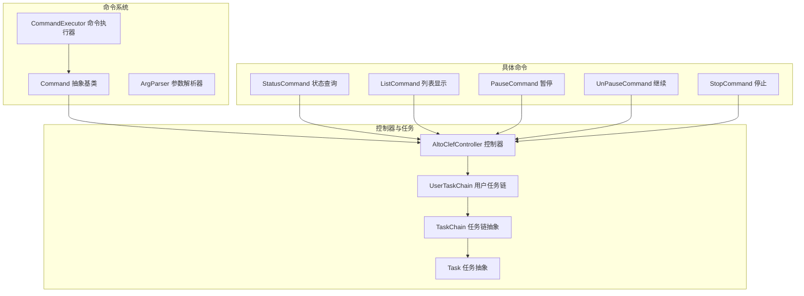
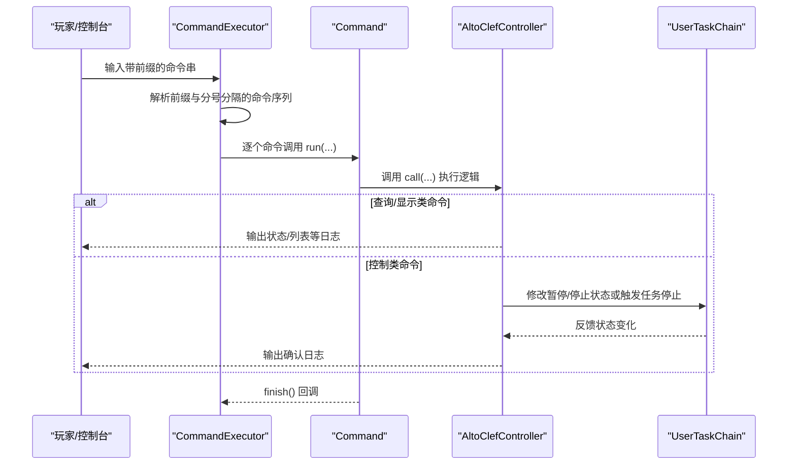
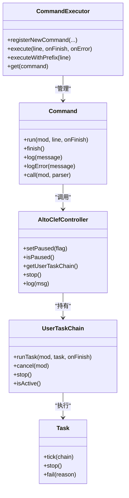

# 实用工具命令

<cite>
**本文引用的文件**
- [StatusCommand.java](file://src/main/java/adris/altoclef/commands/StatusCommand.java)
- [ListCommand.java](file://src/main/java/adris/altoclef/commands/ListCommand.java)
- [PauseCommand.java](file://src/main/java/adris/altoclef/commands/PauseCommand.java)
- [UnPauseCommand.java](file://src/main/java/adris/altoclef/commands/UnPauseCommand.java)
- [StopCommand.java](file://src/main/java/adris/altoclef/commands/StopCommand.java)
- [Command.java](file://src/main/java/adris/altoclef/commandsystem/Command.java)
- [ArgParser.java](file://src/main/java/adris/altoclef/commandsystem/ArgParser.java)
- [CommandExecutor.java](file://src/main/java/adris/altoclef/commandsystem/CommandExecutor.java)
- [AltoClefController.java](file://src/main/java/adris/altoclef/AltoClefController.java)
- [UserTaskChain.java](file://src/main/java/adris/altoclef/chains/UserTaskChain.java)
- [Task.java](file://src/main/java/adris/altoclef/tasksystem/Task.java)
- [TaskChain.java](file://src/main/java/adris/altoclef/tasksystem/TaskChain.java)
- [TaskCatalogue.java](file://src/main/java/adris/altoclef/TaskCatalogue.java)
- [AltoClefCommands.java](file://src/main/java/adris/altoclef/AltoClefCommands.java)
</cite>

## 目录
1. [简介](#简介)
2. [项目结构](#项目结构)
3. [核心组件](#核心组件)
4. [架构总览](#架构总览)
5. [详细组件分析](#详细组件分析)
6. [依赖分析](#依赖分析)
7. [性能考虑](#性能考虑)
8. [故障排查指南](#故障排查指南)
9. [结论](#结论)
10. [附录](#附录)

## 简介
本文件聚焦于实用工具类命令，涵盖状态查询、列表显示、暂停/继续、停止等辅助性命令。这些命令帮助用户监控系统状态、查看可获取资源清单、临时中断自动化流程以及完全停止任务执行，从而在调试、监控与日常管理中提升效率与可控性。

## 项目结构
实用工具命令位于模块的命令系统与控制器层之间，通过统一的命令执行器解析与调度，并与任务链、控制器状态协同工作。

图表来源
- [Command.java:1-61](file://src/main/java/adris/altoclef/commandsystem/Command.java#L1-L61)
- [ArgParser.java:1-106](file://src/main/java/adris/altoclef/commandsystem/ArgParser.java#L1-L106)
- [CommandExecutor.java:1-121](file://src/main/java/adris/altoclef/commandsystem/CommandExecutor.java#L1-L121)
- [AltoClefController.java:1-200](file://src/main/java/adris/altoclef/AltoClefController.java#L1-L200)
- [UserTaskChain.java:1-236](file://src/main/java/adris/altoclef/chains/UserTaskChain.java#L1-L236)
- [TaskChain.java:1-51](file://src/main/java/adris/altoclef/tasksystem/TaskChain.java#L1-L51)
- [Task.java:1-181](file://src/main/java/adris/altoclef/tasksystem/Task.java#L1-L181)
- [StatusCommand.java:1-26](file://src/main/java/adris/altoclef/commands/StatusCommand.java#L1-L26)
- [ListCommand.java:1-22](file://src/main/java/adris/altoclef/commands/ListCommand.java#L1-L22)
- [PauseCommand.java:1-21](file://src/main/java/adris/altoclef/commands/PauseCommand.java#L1-L21)
- [UnPauseCommand.java:1-25](file://src/main/java/adris/altoclef/commands/UnPauseCommand.java#L1-L25)
- [StopCommand.java:1-18](file://src/main/java/adris/altoclef/commands/StopCommand.java#L1-L18)

章节来源
- [AltoClefController.java:101-152](file://src/main/java/adris/altoclef/AltoClefController.java#L101-L152)
- [AltoClefCommands.java:31-64](file://src/main/java/adris/altoclef/AltoClefCommands.java#L31-L64)

## 核心组件
- 命令抽象与执行
  - Command：定义命令名称、描述、参数解析与回调入口；提供日志与完成通知机制。
  - ArgParser：解析命令行参数，支持引号包裹、转义、注释截断与数组参数。
  - CommandExecutor：注册命令、识别前缀、拆分多段命令、递归执行并处理异常。
- 控制器与任务链
  - AltoClefController：持有命令执行器、任务运行器、用户任务链等核心组件；维护暂停/停止状态。
  - UserTaskChain：用户主动下发的任务链，负责任务切换、距离监控、空闲态处理与进度播报。
  - Task/TaskChain：任务与任务链抽象，提供生命周期钩子、优先级与活跃状态。

章节来源
- [Command.java:1-61](file://src/main/java/adris/altoclef/commandsystem/Command.java#L1-L61)
- [ArgParser.java:18-106](file://src/main/java/adris/altoclef/commandsystem/ArgParser.java#L18-L106)
- [CommandExecutor.java:20-121](file://src/main/java/adris/altoclef/commandsystem/CommandExecutor.java#L20-L121)
- [AltoClefController.java:53-152](file://src/main/java/adris/altoclef/AltoClefController.java#L53-L152)
- [UserTaskChain.java:14-236](file://src/main/java/adris/altoclef/chains/UserTaskChain.java#L14-L236)
- [Task.java:8-181](file://src/main/java/adris/altoclef/tasksystem/Task.java#L8-L181)
- [TaskChain.java:7-51](file://src/main/java/adris/altoclef/tasksystem/TaskChain.java#L7-L51)

## 架构总览
实用工具命令的调用路径从命令执行器开始，经由命令基类进入控制器，再由控制器与用户任务链协作完成状态变更或日志输出。

图表来源
- [CommandExecutor.java:58-92](file://src/main/java/adris/altoclef/commandsystem/CommandExecutor.java#L58-L92)
- [Command.java:19-30](file://src/main/java/adris/altoclef/commandsystem/Command.java#L19-L30)
- [AltoClefController.java:78-81](file://src/main/java/adris/altoclef/AltoClefController.java#L78-L81)
- [UserTaskChain.java:117-123](file://src/main/java/adris/altoclef/chains/UserTaskChain.java#L117-L123)

## 详细组件分析

### 状态查询命令：status
- 命令作用
  - 查询当前正在执行的用户任务链中的首个任务，用于快速了解NPC当前处于何种高层任务。
- 语法格式
  - 无参数。直接输入命令即可。
- 查询范围
  - 仅限用户任务链（UserTaskChain）当前队列首项。
- 显示格式
  - 若无任务运行：输出“无任务运行”的提示。
  - 若存在任务：输出“当前任务”及其字符串表示。
- 控制效果
  - 不改变任务状态，仅读取并打印。
- 使用示例
  - 在控制台输入命令后，查看当前NPC正在执行的高层任务名称与简要状态。
- 适用场景
  - 调试：定位NPC卡顿或长时间未推进的原因。
  - 监控：配合日志观察任务切换频率与持续时间。
- 注意事项
  - 该命令依赖控制器持有的用户任务链实例；若任务链为空，则不会输出任何任务信息。

章节来源
- [StatusCommand.java:9-25](file://src/main/java/adris/altoclef/commands/StatusCommand.java#L9-L25)
- [UserTaskChain.java:38-44](file://src/main/java/adris/altoclef/chains/UserTaskChain.java#L38-L44)

### 列表显示命令：list
- 命令作用
  - 列出所有可获取的资源项名称，便于核对资源目录与规划采集/合成任务。
- 语法格式
  - 无参数。直接输入命令即可。
- 查询范围
  - 基于资源目录（TaskCatalogue）中的可获取资源集合。
- 显示格式
  - 输出“所有可获取物品的列表”标题与结束标记，中间列出资源名集合。
- 控制效果
  - 不影响任务执行，仅输出资源清单。
- 使用示例
  - 在控制台输入命令后，复制列表中的名称用于构造采集/合成目标。
- 适用场景
  - 规划：根据清单制定采集计划。
  - 故障诊断：确认某物品是否在资源目录中，排除配方/目标错误。
- 注意事项
  - 列表来源于资源目录的静态集合；如配置重载后需重新加载以更新内容。

章节来源
- [ListCommand.java:10-21](file://src/main/java/adris/altoclef/commands/ListCommand.java#L10-L21)
- [TaskCatalogue.java:186-188](file://src/main/java/adris/altoclef/TaskCatalogue.java#L186-L188)

### 暂停命令：pause
- 命令作用
  - 暂停当前正在运行的任务，保存当前任务以便后续恢复；同时停止用户任务链的执行。
- 语法格式
  - 无参数。直接输入命令即可。
- 查询范围
  - 针对当前用户任务链中的“当前任务”进行保存与暂停。
- 显示格式
  - 输出“暂停机器人与时间”的提示。
- 控制效果
  - 设置控制器的暂停标志位为真；保存当前任务；停止用户任务链；记录日志。
- 使用示例
  - 在执行高风险任务（如深渊/熔岩边缘）时，临时暂停以避免误操作。
- 适用场景
  - 调试：临时阻断自动化，检查环境后再继续。
  - 管理：在需要人工干预时，保留现场状态。
- 注意事项
  - 暂停后需使用继续命令恢复；继续命令会基于保存的任务重建执行。

章节来源
- [PauseCommand.java:7-19](file://src/main/java/adris/altoclef/commands/PauseCommand.java#L7-L19)
- [AltoClefController.java:78-81](file://src/main/java/adris/altoclef/AltoClefController.java#L78-L81)
- [UserTaskChain.java:117-123](file://src/main/java/adris/altoclef/chains/UserTaskChain.java#L117-L123)

### 继续命令：unpause
- 命令作用
  - 恢复之前暂停保存的任务，清除暂停标志位并重新启动用户任务链。
- 语法格式
  - 无参数。直接输入命令即可。
- 查询范围
  - 仅在控制器处于暂停状态时生效。
- 显示格式
  - 若未暂停：输出“机器人未暂停”的提示。
  - 若已暂停：输出“继续机器人与时间”的提示。
- 控制效果
  - 若未暂停：不做任何动作并提示。
  - 若已暂停：恢复保存的任务、清除暂停标志、输出确认日志。
- 使用示例
  - 在完成检查或人工干预后，输入命令恢复自动化。
- 适用场景
  - 调试：暂停后修复问题再继续。
  - 日常管理：临时中断后恢复执行。
- 注意事项
  - 仅能恢复最后一次暂停时保存的任务；若期间有新的任务覆盖，可能无法恢复到预期状态。

章节来源
- [UnPauseCommand.java:7-23](file://src/main/java/adris/altoclef/commands/UnPauseCommand.java#L7-L23)
- [AltoClefController.java:78-81](file://src/main/java/adris/altoclef/AltoClefController.java#L78-L81)

### 停止命令：stop
- 命令作用
  - 停止任务运行器（停止所有自动化），同时停止空闲任务，直至新任务被重新启动。
- 语法格式
  - 无参数。直接输入命令即可。
- 查询范围
  - 影响整个任务运行器与用户任务链的状态。
- 显示格式
  - 无显式输出；通过控制器内部停止逻辑完成。
- 控制效果
  - 调用控制器的停止方法，使任务运行器与用户任务链进入停止状态；若设置允许空闲命令，会在无活动任务时自动执行空闲命令。
- 使用示例
  - 在需要完全终止自动化时使用，例如切换地图或进行大规模重载。
- 适用场景
  - 紧急停止：避免自动化造成进一步损失。
  - 维护：在配置或世界状态发生重大变化时，确保安全停止。
- 注意事项
  - 停止后需要重新下发任务才能恢复自动化；若设置了空闲命令，系统会在无任务时自动进入空闲态。

章节来源
- [StopCommand.java:7-16](file://src/main/java/adris/altoclef/commands/StopCommand.java#L7-L16)
- [AltoClefController.java:136-140](file://src/main/java/adris/altoclef/AltoClefController.java#L136-L140)
- [UserTaskChain.java:187-214](file://src/main/java/adris/altoclef/chains/UserTaskChain.java#L187-L214)

### 命令组合与批量操作
- 多段命令
  - 命令执行器支持以分号分隔的多段命令串，按顺序依次执行。适合将“查询—暂停—继续—停止”等操作串联起来。
- 批量操作建议
  - 先 status 查看当前任务，再 pause 保存现场，随后进行检查或调整，最后 unpause 或 stop 完成恢复或彻底停止。
- 注意事项
  - 异常处理：任一命令抛出异常都会中断后续命令的执行；请确保命令拼写正确且参数合法。

章节来源
- [CommandExecutor.java:58-76](file://src/main/java/adris/altoclef/commandsystem/CommandExecutor.java#L58-L76)
- [ArgParser.java:57-96](file://src/main/java/adris/altoclef/commandsystem/ArgParser.java#L57-L96)

## 依赖分析
- 命令与控制器
  - 所有实用工具命令均依赖控制器提供的状态与任务链接口；控制器持有命令执行器与用户任务链，形成命令到执行的桥接。
- 任务链与任务
  - 用户任务链负责任务的设置、停止与空闲态处理；任务抽象提供生命周期钩子与可中断能力，支撑暂停/继续/停止的语义一致性。
- 资源目录
  - 列表命令依赖资源目录的静态集合，确保输出的资源名完整且一致。

图表来源
- [Command.java:6-61](file://src/main/java/adris/altoclef/commandsystem/Command.java#L6-L61)
- [CommandExecutor.java:11-121](file://src/main/java/adris/altoclef/commandsystem/CommandExecutor.java#L11-L121)
- [AltoClefController.java:53-152](file://src/main/java/adris/altoclef/AltoClefController.java#L53-L152)
- [UserTaskChain.java:14-236](file://src/main/java/adris/altoclef/chains/UserTaskChain.java#L14-L236)
- [Task.java:8-181](file://src/main/java/adris/altoclef/tasksystem/Task.java#L8-L181)

章节来源
- [AltoClefController.java:101-152](file://src/main/java/adris/altoclef/AltoClefController.java#L101-L152)
- [UserTaskChain.java:144-214](file://src/main/java/adris/altoclef/chains/UserTaskChain.java#L144-L214)

## 性能考虑
- 命令执行开销
  - 实用工具命令均为轻量级操作，主要消耗在日志输出与状态读取上，对实时性能影响极小。
- 任务链切换成本
  - 暂停/继续/停止涉及任务链的停止与重启，通常在毫秒级内完成；频繁切换可能带来状态抖动，建议在必要时才进行。
- 日志输出
  - 建议在调试阶段适度开启日志，生产环境中可减少冗余输出以降低I/O压力。

## 故障排查指南
- 命令无效或报错
  - 检查命令前缀与大小写；确认命令名称正确且已被注册。
  - 若出现参数不足或过多，检查 ArgParser 的参数解析规则与默认值。
- 无法恢复暂停状态
  - 确认控制器仍处于暂停状态；若期间有新的任务覆盖，保存的任务可能已失效。
- 列表为空或不完整
  - 确认资源目录已正确初始化；必要时执行重载设置命令以刷新资源集合。
- 停止后无法继续
  - 确认是否设置了空闲命令；若未设置，停止后需手动下发新任务。

章节来源
- [CommandExecutor.java:94-111](file://src/main/java/adris/altoclef/commandsystem/CommandExecutor.java#L94-L111)
- [ArgParser.java:69-96](file://src/main/java/adris/altoclef/commandsystem/ArgParser.java#L69-L96)
- [AltoClefController.java:131-144](file://src/main/java/adris/altoclef/AltoClefController.java#L131-L144)

## 结论
实用工具命令提供了对系统状态的快速观测与对执行流程的可控干预。通过 status、list、pause、unpause、stop 这些命令，用户可以在调试、监控与日常管理中高效地掌握NPC的运行状况并灵活调整自动化行为。建议结合命令组合与批量操作策略，在保证安全的前提下最大化提升运维效率。

## 附录
- 命令注册入口
  - 命令在控制器初始化时集中注册，确保命令可用性与一致性。
- 相关实现参考
  - 命令基类与执行器的设计为扩展更多工具命令提供了清晰的接口与规范。

章节来源
- [AltoClefCommands.java:31-64](file://src/main/java/adris/altoclef/AltoClefCommands.java#L31-L64)
- [AltoClefController.java:130-131](file://src/main/java/adris/altoclef/AltoClefController.java#L130-L131)