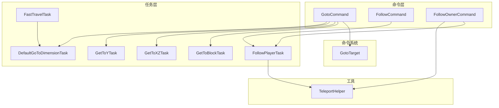
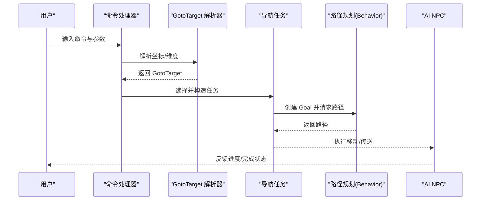
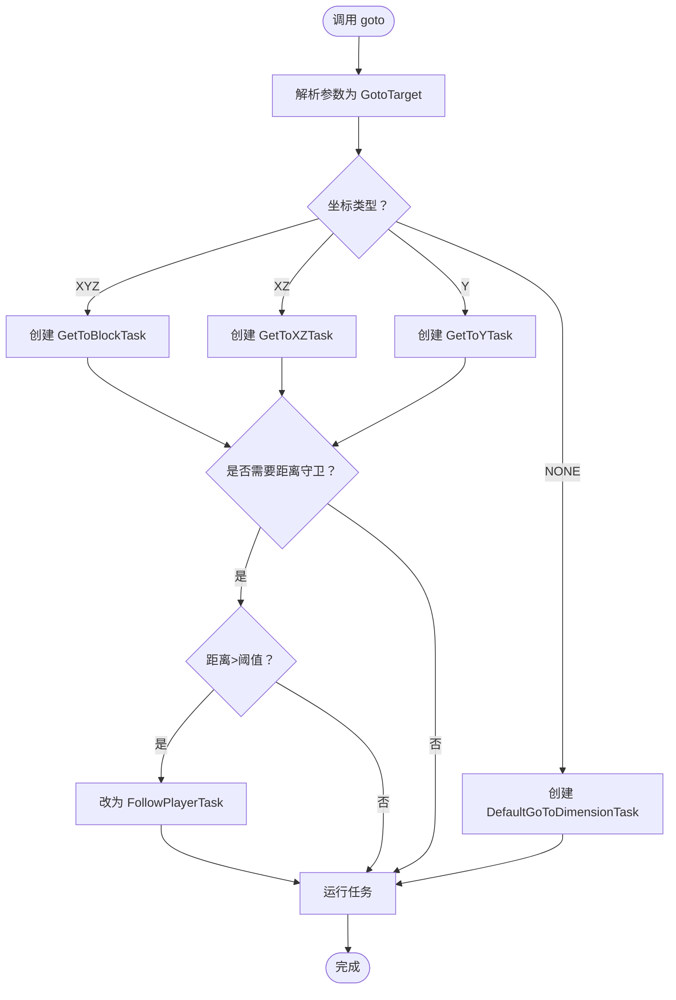
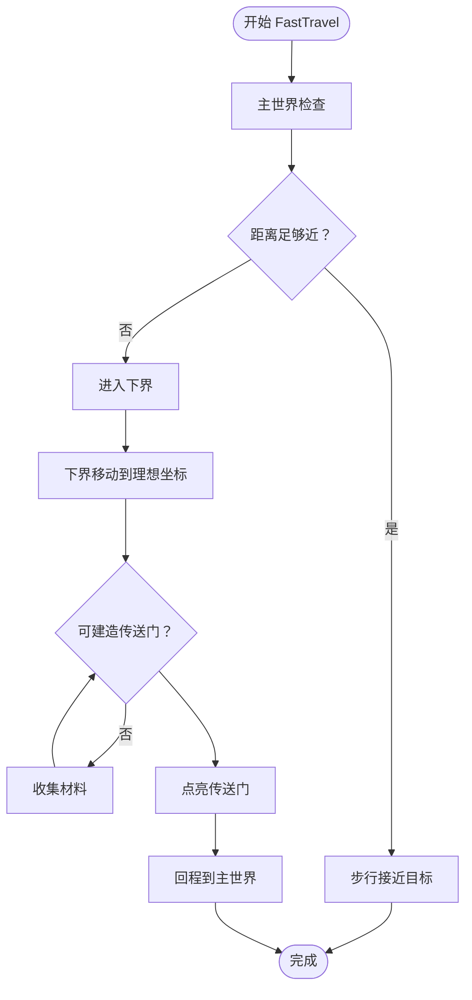
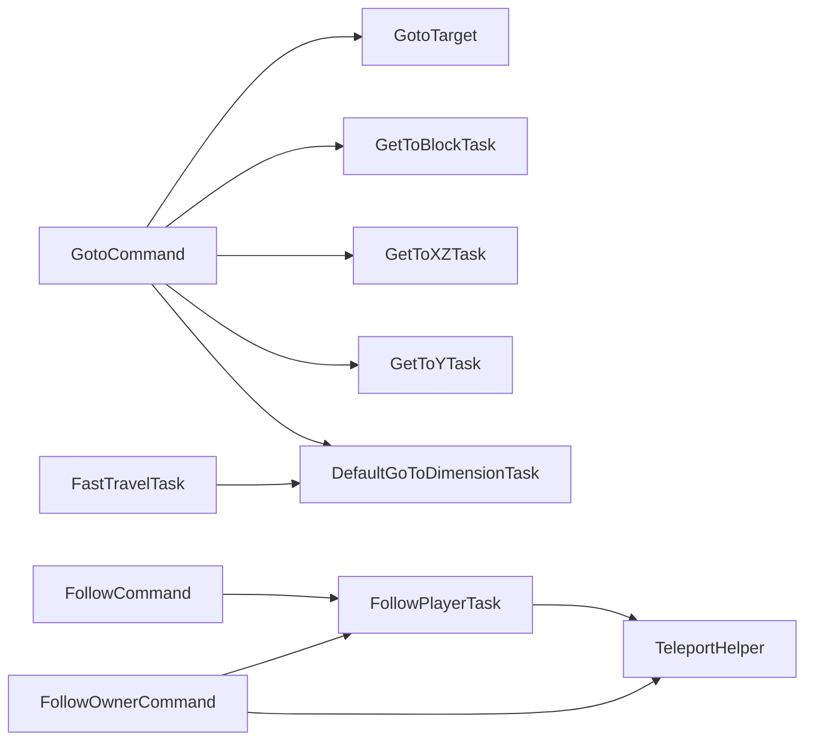

# 导航命令

<cite>
**本文引用的文件**
- [GotoCommand.java](file://src/main/java/adris/altoclef/commands/GotoCommand.java)
- [FollowCommand.java](file://src/main/java/adris/altoclef/commands/FollowCommand.java)
- [FollowOwnerCommand.java](file://src/main/java/adris/altoclef/commands/FollowOwnerCommand.java)
- [GotoTarget.java](file://src/main/java/adris/altoclef/commandsystem/GotoTarget.java)
- [FastTravelTask.java](file://src/main/java/adris/altoclef/tasks/movement/FastTravelTask.java)
- [FollowPlayerTask.java](file://src/main/java/adris/altoclef/tasks/movement/FollowPlayerTask.java)
- [GetToBlockTask.java](file://src/main/java/adris/altoclef/tasks/movement/GetToBlockTask.java)
- [GetToXZTask.java](file://src/main/java/adris/altoclef/tasks/movement/GetToXZTask.java)
- [GetToYTask.java](file://src/main/java/adris/altoclef/tasks/movement/GetToYTask.java)
- [DefaultGoToDimensionTask.java](file://src/main/java/adris/altoclef/tasks/movement/DefaultGoToDimensionTask.java)
- [TeleportHelper.java](file://src/main/java/adris/altoclef/util/TeleportHelper.java)
</cite>

## 目录
1. [简介](#简介)
2. [项目结构](#项目结构)
3. [核心组件](#核心组件)
4. [架构总览](#架构总览)
5. [详细组件分析](#详细组件分析)
6. [依赖分析](#依赖分析)
7. [性能考虑](#性能考虑)
8. [故障排除指南](#故障排除指南)
9. [结论](#结论)
10. [附录](#附录)

## 简介
本章节面向希望使用 AI NPC 进行位置导航与跟随的用户，系统性地介绍“导航命令”体系，包括：
- GotoCommand 的位置导航能力：支持 XYZ、XZ、Y 与维度级目标，自动进行距离守卫与路径规划。
- FollowCommand 的跟随命令：跟随当前所有者或指定用户名的目标玩家。
- FollowOwnerCommand 的“就近传送+持续跟随”策略：在超远距离时优先传送，随后进入精细化跟随。
- 快速旅行（Fast Travel）：基于主世界的坐标换算到下界的理想坐标，并在维度间自动构建/使用传送门。
- 路径规划集成：导航命令通过任务系统与 Baritone 目标接口对接，结合障碍规避、路径缓存与实时更新。

本章将提供语法格式、目标参数、路径规划机制、执行效果与使用示例，并给出性能优化与故障排除建议。

## 项目结构
导航命令与路径规划相关的核心代码分布如下：
- commands 层：命令入口与解析
  - GotoCommand：位置导航命令
  - FollowCommand：跟随命令
  - FollowOwnerCommand：跟随所有者命令
- commandsystem 层：命令参数解析与目标建模
  - GotoTarget：解析 goto 参数并抽象为坐标类型与维度
- tasks/movement 层：具体导航任务
  - GetToBlockTask、GetToXZTask、GetToYTask：针对 XYZ/XZ/Y 的精确路径目标
  - FollowPlayerTask：动态跟随与传送兜底
  - FastTravelTask：跨维度快速旅行（主世界↔下界）
  - DefaultGoToDimensionTask：维度切换任务
- util 层：辅助工具
  - TeleportHelper：安全传送与朝向调整

图表来源
- [GotoCommand.java:1-66](file://src/main/java/adris/altoclef/commands/GotoCommand.java#L1-L66)
- [FollowCommand.java:1-33](file://src/main/java/adris/altoclef/commands/FollowCommand.java#L1-L33)
- [FollowOwnerCommand.java:1-46](file://src/main/java/adris/altoclef/commands/FollowOwnerCommand.java#L1-L46)
- [GotoTarget.java:1-102](file://src/main/java/adris/altoclef/commandsystem/GotoTarget.java#L1-L102)
- [GetToBlockTask.java:1-106](file://src/main/java/adris/altoclef/tasks/movement/GetToBlockTask.java#L1-L106)
- [GetToXZTask.java:1-54](file://src/main/java/adris/altoclef/tasks/movement/GetToXZTask.java#L1-L54)
- [GetToYTask.java:1-45](file://src/main/java/adris/altoclef/tasks/movement/GetToYTask.java#L1-L45)
- [FollowPlayerTask.java:1-107](file://src/main/java/adris/altoclef/tasks/movement/FollowPlayerTask.java#L1-L107)
- [FastTravelTask.java:1-152](file://src/main/java/adris/altoclef/tasks/movement/FastTravelTask.java#L1-L152)
- [DefaultGoToDimensionTask.java](file://src/main/java/adris/altoclef/tasks/movement/DefaultGoToDimensionTask.java)
- [TeleportHelper.java:1-239](file://src/main/java/adris/altoclef/util/TeleportHelper.java#L1-L239)

章节来源
- [GotoCommand.java:1-66](file://src/main/java/adris/altoclef/commands/GotoCommand.java#L1-L66)
- [FollowCommand.java:1-33](file://src/main/java/adris/altoclef/commands/FollowCommand.java#L1-L33)
- [FollowOwnerCommand.java:1-46](file://src/main/java/adris/altoclef/commands/FollowOwnerCommand.java#L1-L46)
- [GotoTarget.java:1-102](file://src/main/java/adris/altoclef/commandsystem/GotoTarget.java#L1-L102)

## 核心组件
- GotoCommand：解析 goto 目标参数，根据坐标类型选择对应任务；当目标与所有者距离过大时触发“跟随所有者”的保护逻辑。
- FollowCommand：跟随当前所有者或指定用户名玩家；若无所有者且未提供用户名，则提示无法执行。
- FollowOwnerCommand：先判断距离阈值，超过阈值则传送至所有者附近，随后进入 FollowPlayerTask 精细化跟随。
- GotoTarget：解析字符串参数，容忍逗号分隔与多余空格，自动识别维度关键字，输出 XYZ/XZ/Y/NONE 四种坐标类型。
- 导航任务族：
  - GetToBlockTask：以目标方块为中心的精确到达
  - GetToXZTask：仅在 XZ 平面移动到目标坐标
  - GetToYTask：移动到指定 Y 坐标
  - FollowPlayerTask：动态跟随，支持“不可见时传送兜底”
  - FastTravelTask：主世界坐标换算至下界理想坐标，自动处理传送门材料与回程
  - DefaultGoToDimensionTask：维度切换任务（如 Overworld/Nether/End）

章节来源
- [GotoCommand.java:20-66](file://src/main/java/adris/altoclef/commands/GotoCommand.java#L20-L66)
- [FollowCommand.java:10-33](file://src/main/java/adris/altoclef/commands/FollowCommand.java#L10-L33)
- [FollowOwnerCommand.java:12-46](file://src/main/java/adris/altoclef/commands/FollowOwnerCommand.java#L12-L46)
- [GotoTarget.java:7-102](file://src/main/java/adris/altoclef/commandsystem/GotoTarget.java#L7-L102)
- [GetToBlockTask.java:14-106](file://src/main/java/adris/altoclef/tasks/movement/GetToBlockTask.java#L14-L106)
- [GetToXZTask.java:11-54](file://src/main/java/adris/altoclef/tasks/movement/GetToXZTask.java#L11-L54)
- [GetToYTask.java:10-45](file://src/main/java/adris/altoclef/tasks/movement/GetToYTask.java#L10-L45)
- [FollowPlayerTask.java:14-107](file://src/main/java/adris/altoclef/tasks/movement/FollowPlayerTask.java#L14-L107)
- [FastTravelTask.java:19-152](file://src/main/java/adris/altoclef/tasks/movement/FastTravelTask.java#L19-L152)
- [DefaultGoToDimensionTask.java](file://src/main/java/adris/altoclef/tasks/movement/DefaultGoToDimensionTask.java)
- [TeleportHelper.java:15-239](file://src/main/java/adris/altoclef/util/TeleportHelper.java#L15-L239)

## 架构总览
导航命令的执行链路如下：
- 命令解析：GotoCommand/FollowCommand/FollowOwnerCommand 接收用户输入，解析参数。
- 目标建模：GotoTarget 将字符串参数标准化为坐标类型与维度。
- 任务选择：根据坐标类型选择 GetToBlockTask/GetToXZTask/GetToYTask 或 FollowPlayerTask/FastTravelTask。
- 路径规划：任务内部封装 Baritone Goal（GoalBlock/GoalXZ/GoalYLevel），交由路径模块计算路径。
- 执行与兜底：在极端情况下（如目标不可见、距离过远）采用 TeleportHelper 进行安全传送。

图表来源
- [GotoCommand.java:41-64](file://src/main/java/adris/altoclef/commands/GotoCommand.java#L41-L64)
- [GotoTarget.java:22-69](file://src/main/java/adris/altoclef/commandsystem/GotoTarget.java#L22-L69)
- [GetToBlockTask.java:96-98](file://src/main/java/adris/altoclef/tasks/movement/GetToBlockTask.java#L96-L98)
- [GetToXZTask.java:34-35](file://src/main/java/adris/altoclef/tasks/movement/GetToXZTask.java#L34-L35)
- [GetToYTask.java:31-32](file://src/main/java/adris/altoclef/tasks/movement/GetToYTask.java#L31-L32)
- [FollowPlayerTask.java:37-89](file://src/main/java/adris/altoclef/tasks/movement/FollowPlayerTask.java#L37-L89)
- [TeleportHelper.java:33-79](file://src/main/java/adris/altoclef/util/TeleportHelper.java#L33-L79)

## 详细组件分析

### GotoCommand：位置导航命令
- 语法与参数
  - 基本形式：goto [x y z dimension]/[x z dimension]/[y dimension]/[dimension]/[x y z]/[x z]/[y]
  - 支持维度关键字（由 GotoTarget 解析）
  - 容忍逗号分隔与多余空格
- 行为机制
  - 根据坐标类型映射到：
    - XYZ → GetToBlockTask（目标方块）
    - XZ → GetToXZTask（平面到达）
    - Y → GetToYTask（高度到达）
    - NONE → DefaultGoToDimensionTask（仅维度切换）
  - 距离守卫：当目标不在维度内且与所有者距离超过阈值（约 100 格）时，改为执行 FollowPlayerTask（跟随所有者），避免长时间无效寻路
- 执行效果
  - 精确到达目标位置或维度
  - 自动处理维度切换
  - 超远距离自动改走“跟随”以节省资源

图表来源
- [GotoCommand.java:32-64](file://src/main/java/adris/altoclef/commands/GotoCommand.java#L32-L64)
- [GotoTarget.java:50-69](file://src/main/java/adris/altoclef/commandsystem/GotoTarget.java#L50-L69)
- [GetToBlockTask.java:21-37](file://src/main/java/adris/altoclef/tasks/movement/GetToBlockTask.java#L21-L37)
- [GetToXZTask.java:16-24](file://src/main/java/adris/altoclef/tasks/movement/GetToXZTask.java#L16-L24)
- [GetToYTask.java:14-21](file://src/main/java/adris/altoclef/tasks/movement/GetToYTask.java#L14-L21)
- [DefaultGoToDimensionTask.java](file://src/main/java/adris/altoclef/tasks/movement/DefaultGoToDimensionTask.java)

章节来源
- [GotoCommand.java:20-66](file://src/main/java/adris/altoclef/commands/GotoCommand.java#L20-L66)
- [GotoTarget.java:22-69](file://src/main/java/adris/altoclef/commandsystem/GotoTarget.java#L22-L69)

### FollowCommand：跟随命令
- 语法与参数
  - follow [username]：跟随指定用户名玩家；若省略则默认跟随当前所有者
  - 若无所有者且未提供用户名，命令将警告并结束
- 行为机制
  - 构造 FollowPlayerTask 并运行
  - 动态跟踪目标位置，必要时使用 TeleportHelper 进行传送兜底
- 执行效果
  - 紧跟目标玩家，保持指定距离
  - 目标不可见时尝试传送至所有者位置，避免长时间停滞

章节来源
- [FollowCommand.java:10-33](file://src/main/java/adris/altoclef/commands/FollowCommand.java#L10-L33)
- [FollowPlayerTask.java:37-89](file://src/main/java/adris/altoclef/tasks/movement/FollowPlayerTask.java#L37-L89)
- [TeleportHelper.java:33-79](file://src/main/java/adris/altoclef/util/TeleportHelper.java#L33-L79)

### FollowOwnerCommand：跟随所有者命令
- 语法与参数
  - follow_owner：无需参数，自动跟随当前所有者
- 行为机制
  - 计算与所有者的距离，若超过阈值（约 16 格）则使用 TeleportHelper 传送至附近安全位置
  - 随后运行 FollowPlayerTask，进行精细化跟随
- 执行效果
  - 快速靠近所有者，随后稳定跟随

章节来源
- [FollowOwnerCommand.java:12-46](file://src/main/java/adris/altoclef/commands/FollowOwnerCommand.java#L12-L46)
- [TeleportHelper.java:33-79](file://src/main/java/adris/altoclef/util/TeleportHelper.java#L33-L79)
- [FollowPlayerTask.java:37-89](file://src/main/java/adris/altoclef/tasks/movement/FollowPlayerTask.java#L37-L89)

### 快速旅行（FastTravelTask）：长距离跨维度传送
- 适用场景
  - 主世界长距离旅行，自动换算至下界理想坐标，减少步行时间
- 行为机制
  - 主世界：若距离目标足够近则步行，否则进入下界
  - 下界：移动到理想坐标（x/8, z/8），准备回程
  - 自动收集/拾取传送门材料，确保可建造与点亮
- 执行效果
  - 显著缩短长距离旅行时间
  - 自动处理维度切换与传送门流程

图表来源
- [FastTravelTask.java:47-120](file://src/main/java/adris/altoclef/tasks/movement/FastTravelTask.java#L47-L120)

章节来源
- [FastTravelTask.java:19-152](file://src/main/java/adris/altoclef/tasks/movement/FastTravelTask.java#L19-L152)

### 导航任务与路径规划集成
- 目标封装
  - GetToBlockTask：GoalBlock（精确方块）
  - GetToXZTask：GoalXZ（平面坐标）
  - GetToYTask：GoalYLevel（高度）
- 维度处理
  - 当目标维度与当前不一致时，自动切换维度
- 阻塞与缓存
  - 任务在路径不可达时请求阻塞标记，避免重复尝试
  - 超时完成但仍在被调用时会触发漫游以释放占用

章节来源
- [GetToBlockTask.java:96-105](file://src/main/java/adris/altoclef/tasks/movement/GetToBlockTask.java#L96-L105)
- [GetToXZTask.java:34-47](file://src/main/java/adris/altoclef/tasks/movement/GetToXZTask.java#L34-L47)
- [GetToYTask.java:31-43](file://src/main/java/adris/altoclef/tasks/movement/GetToYTask.java#L31-L43)
- [DefaultGoToDimensionTask.java](file://src/main/java/adris/altoclef/tasks/movement/DefaultGoToDimensionTask.java)

## 依赖分析
- 命令到任务
  - GotoCommand → GotoTarget → GetToBlock/GetToXZ/GetToY/DefaultGoToDimension
  - FollowCommand/FollowOwnerCommand → FollowPlayerTask
  - FastTravelTask → DefaultGoToDimension（维度切换）
- 工具依赖
  - FollowPlayerTask → TeleportHelper（传送兜底）
  - FastTravelTask → 物品收集任务（材料不足时自动补齐）

图表来源
- [GotoCommand.java:32-64](file://src/main/java/adris/altoclef/commands/GotoCommand.java#L32-L64)
- [GotoTarget.java:50-69](file://src/main/java/adris/altoclef/commandsystem/GotoTarget.java#L50-L69)
- [FollowCommand.java:30](file://src/main/java/adris/altoclef/commands/FollowCommand.java#L30)
- [FollowOwnerCommand.java:43](file://src/main/java/adris/altoclef/commands/FollowOwnerCommand.java#L43)
- [FollowPlayerTask.java:84-86](file://src/main/java/adris/altoclef/tasks/movement/FollowPlayerTask.java#L84-L86)
- [FastTravelTask.java:72](file://src/main/java/adris/altoclef/tasks/movement/FastTravelTask.java#L72)
- [DefaultGoToDimensionTask.java](file://src/main/java/adris/altoclef/tasks/movement/DefaultGoToDimensionTask.java)
- [TeleportHelper.java:33-79](file://src/main/java/adris/altoclef/util/TeleportHelper.java#L33-L79)

章节来源
- [GotoCommand.java:32-64](file://src/main/java/adris/altoclef/commands/GotoCommand.java#L32-L64)
- [FollowCommand.java:30](file://src/main/java/adris/altoclef/commands/FollowCommand.java#L30)
- [FollowOwnerCommand.java:43](file://src/main/java/adris/altoclef/commands/FollowOwnerCommand.java#L43)
- [FollowPlayerTask.java:84-86](file://src/main/java/adris/altoclef/tasks/movement/FollowPlayerTask.java#L84-L86)
- [FastTravelTask.java:72](file://src/main/java/adris/altoclef/tasks/movement/FastTravelTask.java#L72)
- [TeleportHelper.java:33-79](file://src/main/java/adris/altoclef/util/TeleportHelper.java#L33-L79)

## 性能考虑
- 距离守卫与任务选择
  - goto 对超远目标自动改为跟随，避免无效寻路与卡顿
- 路径缓存与阻塞
  - 任务在不可达时请求阻塞标记，减少重复尝试
  - 超时完成后的漫游可释放占用，避免长期挂起
- 维度切换与快速旅行
  - FastTravelTask 在主世界接近目标时才进入下界，减少不必要的维度跳跃
  - 下界移动到理想坐标后再回程，提高效率
- 传送兜底
  - FollowPlayerTask 与 FollowOwnerCommand 在极端距离时使用 TeleportHelper，显著降低路径计算压力

章节来源
- [GotoCommand.java:45-61](file://src/main/java/adris/altoclef/commands/GotoCommand.java#L45-L61)
- [GetToBlockTask.java:50-58](file://src/main/java/adris/altoclef/tasks/movement/GetToBlockTask.java#L50-L58)
- [FastTravelTask.java:55-82](file://src/main/java/adris/altoclef/tasks/movement/FastTravelTask.java#L55-L82)
- [FollowPlayerTask.java:65-74](file://src/main/java/adris/altoclef/tasks/movement/FollowPlayerTask.java#L65-L74)
- [FollowOwnerCommand.java:36-40](file://src/main/java/adris/altoclef/commands/FollowOwnerCommand.java#L36-L40)

## 故障排除指南
- goto 命令无效或卡住
  - 检查目标是否超出距离守卫阈值（约 100 格），此时会改为跟随
  - 确认目标维度与当前维度一致，否则会先切换维度
  - 若路径长时间完成但仍在被调用，任务会触发漫游以释放占用
- 跟随命令无响应
  - 确认已设置所有者或明确提供用户名
  - 目标玩家不可见时会尝试传送兜底，若仍不可见则等待其加载进渲染距离
- 快速旅行失败
  - 检查是否具备传送门材料（黑曜石、打火石/火球），任务会在材料不足时自动收集
  - 确保目标坐标在下界范围内（x/8, z/8），并在理想坐标附近等待回程
- 传送兜底异常
  - TeleportHelper 会在目标周围搜索安全落点，若未找到会记录警告日志
  - 确保目标实体与世界实例有效

章节来源
- [GotoCommand.java:45-61](file://src/main/java/adris/altoclef/commands/GotoCommand.java#L45-L61)
- [FollowCommand.java:20-28](file://src/main/java/adris/altoclef/commands/FollowCommand.java#L20-L28)
- [FollowPlayerTask.java:49-61](file://src/main/java/adris/altoclef/tasks/movement/FollowPlayerTask.java#L49-L61)
- [FastTravelTask.java:96-113](file://src/main/java/adris/altoclef/tasks/movement/FastTravelTask.java#L96-L113)
- [TeleportHelper.java:48-58](file://src/main/java/adris/altoclef/util/TeleportHelper.java#L48-L58)

## 结论
导航命令体系通过命令层、目标建模、任务层与工具层的协同，实现了从“精确到达”到“动态跟随”再到“长距离快速旅行”的完整覆盖。其核心特性包括：
- 灵活的参数解析与容错（逗号分隔、空格折叠、维度关键字）
- 智能的任务选择与维度切换
- 距离守卫与传送兜底，保障在极端情况下的可用性
- 与路径规划系统的深度集成，支持障碍规避与路径缓存

建议在复杂场景中优先使用 follow/follow_owner 以获得更稳定的跟随体验，使用 goto 进行精确到达，使用 fast_travel 处理长距离跨维度旅行。

## 附录

### 使用示例（命令与场景）
- 精确到达 XYZ
  - 示例：goto 100 64 200
  - 场景：前往主世界某建筑精确位置
- 平面到达 XZ
  - 示例：goto 100 200 overworld
  - 场景：在主世界平面移动到目标区域
- 高度到达 Y
  - 示例：goto y 128
  - 场景：飞到指定海拔高度
- 仅维度切换
  - 示例：goto nether
  - 场景：快速切换到下界
- 跟随当前所有者
  - 示例：follow
  - 场景：跟随当前所有者
- 跟随指定玩家
  - 示例：follow Steve
  - 场景：跟随服务器中的特定玩家
- 跟随所有者（超远传送）
  - 示例：follow_owner
  - 场景：所有者在远处，先传送再跟随
- 长距离快速旅行
  - 示例：fast_travel 1000 0
  - 场景：主世界长距离旅行，自动换算至下界理想坐标

章节来源
- [GotoCommand.java:24-30](file://src/main/java/adris/altoclef/commands/GotoCommand.java#L24-L30)
- [FollowCommand.java:11-15](file://src/main/java/adris/altoclef/commands/FollowCommand.java#L11-L15)
- [FollowOwnerCommand.java:17-19](file://src/main/java/adris/altoclef/commands/FollowOwnerCommand.java#L17-L19)
- [FastTravelTask.java:28-36](file://src/main/java/adris/altoclef/tasks/movement/FastTravelTask.java#L28-L36)