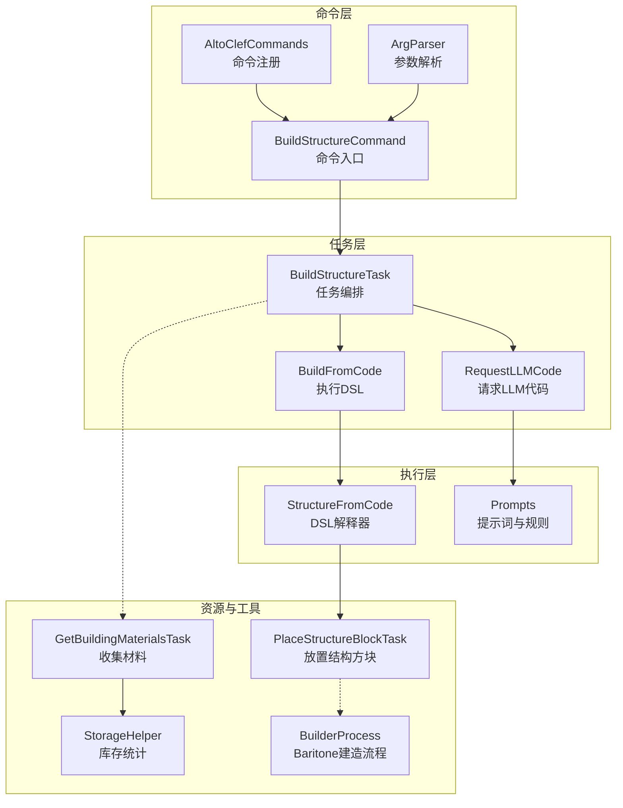
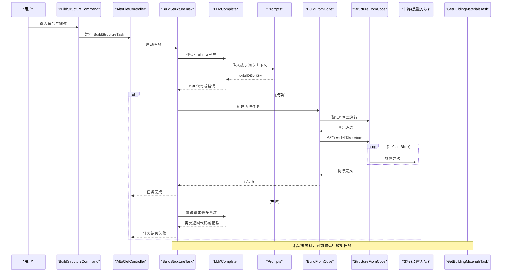
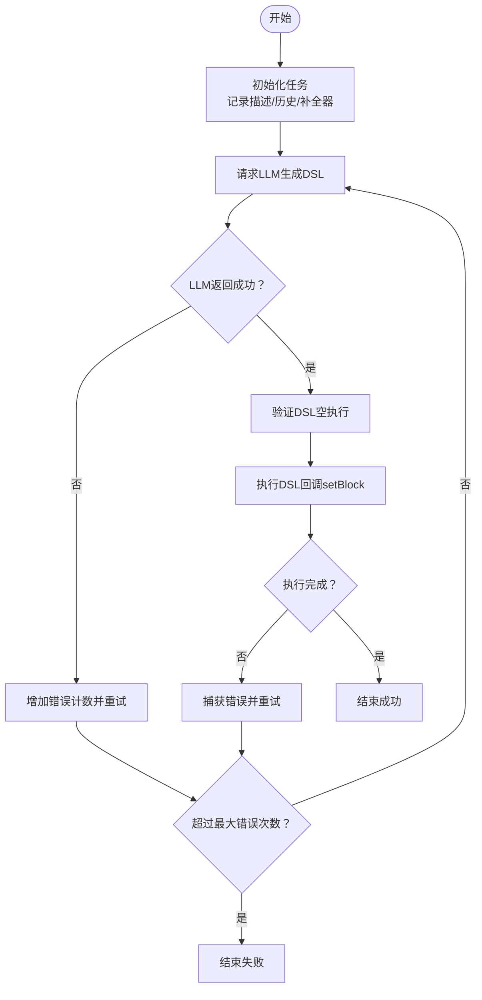
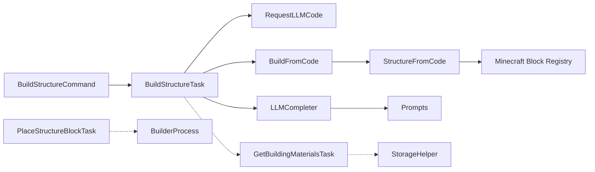

# 建筑命令

<cite>
**本文引用的文件**
- [BuildStructureCommand.java](file://src/main/java/adris/altoclef/commands/BuildStructureCommand.java)
- [BuildStructureTask.java](file://src/main/java/adris/altoclef/tasks/construction/build_structure/BuildStructureTask.java)
- [StructureFromCode.java](file://src/main/java/adris/altoclef/tasks/construction/build_structure/StructureFromCode.java)
- [Prompts.java](file://src/main/java/adris/altoclef/player2api/Prompts.java)
- [AltoClefCommands.java](file://src/main/java/adris/altoclef/AltoClefCommands.java)
- [Command.java](file://src/main/java/adris/altoclef/commandsystem/Command.java)
- [ArgParser.java](file://src/main/java/adris/altoclef/commandsystem/ArgParser.java)
- [GetBuildingMaterialsTask.java](file://src/main/java/adris/altoclef/tasks/resources/GetBuildingMaterialsTask.java)
- [StorageHelper.java](file://src/main/java/adris/altoclef/util/helpers/StorageHelper.java)
- [PlaceStructureBlockTask.java](file://src/main/java/adris/altoclef/tasks/construction/PlaceStructureBlockTask.java)
- [BuilderProcess.java](file://src/main/java/baritone/process/BuilderProcess.java)
</cite>

## 目录
1. [简介](#简介)
2. [项目结构](#项目结构)
3. [核心组件](#核心组件)
4. [架构总览](#架构总览)
5. [详细组件分析](#详细组件分析)
6. [依赖分析](#依赖分析)
7. [性能考量](#性能考量)
8. [故障排查指南](#故障排查指南)
9. [结论](#结论)
10. [附录：使用示例与最佳实践](#附录使用示例与最佳实践)

## 简介
本文件面向“建筑命令”功能，系统性阐述 BuildStructureCommand 的建筑构建能力，包括：
- 结构定义与描述语言（DSL）规范
- 材料需求与匹配机制
- 构建流程与错误重试策略
- 与资源收集、工具使用、安全防护的集成方式
- 使用示例与最佳实践（简单结构、复杂建筑、自动化构建）

该命令通过自然语言描述触发，由内置提示词驱动的 LLM 生成可执行的“构造 DSL”，再由本地解释器逐条执行放置方块操作，最终完成建筑。

## 项目结构
围绕建筑命令的关键模块分布如下：
- 命令入口：BuildStructureCommand（注册于 AltoClefCommands）
- 任务编排：BuildStructureTask（请求 LLM → 执行 DSL → 反馈结果）
- DSL 解释与执行：StructureFromCode（验证并执行 setBlock 指令）
- 提示词与规则：Prompts（定义 DSL、材料命名、结构指导）
- 资源与存储辅助：GetBuildingMaterialsTask、StorageHelper
- 方块放置任务：PlaceStructureBlockTask
- 工程化集成：Command/ArgParser（命令解析）、AltoClefCommands（命令注册）

图表来源
- [BuildStructureCommand.java:10-29](file://src/main/java/adris/altoclef/commands/BuildStructureCommand.java#L10-L29)
- [AltoClefCommands.java:31-64](file://src/main/java/adris/altoclef/AltoClefCommands.java#L31-L64)
- [ArgParser.java:1-105](file://src/main/java/adris/altoclef/commandsystem/ArgParser.java#L1-L105)
- [BuildStructureTask.java:23-152](file://src/main/java/adris/altoclef/tasks/construction/build_structure/BuildStructureTask.java#L23-L152)
- [StructureFromCode.java:23-44](file://src/main/java/adris/altoclef/tasks/construction/build_structure/StructureFromCode.java#L23-L44)
- [Prompts.java:168-452](file://src/main/java/adris/altoclef/player2api/Prompts.java#L168-L452)
- [GetBuildingMaterialsTask.java:9-44](file://src/main/java/adris/altoclef/tasks/resources/GetBuildingMaterialsTask.java#L9-L44)
- [StorageHelper.java:159-175](file://src/main/java/adris/altoclef/util/helpers/StorageHelper.java#L159-L175)
- [PlaceStructureBlockTask.java:6-10](file://src/main/java/adris/altoclef/tasks/construction/PlaceStructureBlockTask.java#L6-L10)
- [BuilderProcess.java:639-653](file://src/main/java/baritone/process/BuilderProcess.java#L639-L653)

章节来源
- [BuildStructureCommand.java:10-29](file://src/main/java/adris/altoclef/commands/BuildStructureCommand.java#L10-L29)
- [AltoClefCommands.java:31-64](file://src/main/java/adris/altoclef/AltoClefCommands.java#L31-L64)
- [ArgParser.java:1-105](file://src/main/java/adris/altoclef/commandsystem/ArgParser.java#L1-L105)

## 核心组件
- 命令入口 BuildStructureCommand
  - 定义命令名、帮助文本与参数（字符串描述）
  - 将用户输入的描述转为 BuildStructureTask 并交由控制器运行
- 任务编排 BuildStructureTask
  - 维护对话历史与 LLM 完成器
  - 分阶段执行：请求 LLM 代码 → 验证并执行 DSL → 失败重试（最多两次）
- DSL 解释器 StructureFromCode
  - 验证阶段：先以“空执行”校验语法与逻辑
  - 执行阶段：逐条回调 setBlock(x,y,z,blockName)，在世界中放置方块
- 提示词 Prompts
  - 明确 DSL 语法、禁止项、材料命名、结构指导与输出规则
- 资源与存储辅助
  - GetBuildingMaterialsTask：按需收集建筑所需材料
  - StorageHelper：统计可用建筑方块数量，判断是否满足目标

章节来源
- [BuildStructureCommand.java:10-29](file://src/main/java/adris/altoclef/commands/BuildStructureCommand.java#L10-L29)
- [BuildStructureTask.java:23-152](file://src/main/java/adris/altoclef/tasks/construction/build_structure/BuildStructureTask.java#L23-L152)
- [StructureFromCode.java:1340-1358](file://src/main/java/adris/altoclef/tasks/construction/build_structure/StructureFromCode.java#L1340-L1358)
- [Prompts.java:168-452](file://src/main/java/adris/altoclef/player2api/Prompts.java#L168-L452)
- [GetBuildingMaterialsTask.java:9-44](file://src/main/java/adris/altoclef/tasks/resources/GetBuildingMaterialsTask.java#L9-L44)
- [StorageHelper.java:159-175](file://src/main/java/adris/altoclef/util/helpers/StorageHelper.java#L159-L175)

## 架构总览
下图展示了从命令到执行的端到端流程，以及与资源收集、放置任务、Baritone建造过程的衔接点。

图表来源
- [BuildStructureCommand.java:21-27](file://src/main/java/adris/altoclef/commands/BuildStructureCommand.java#L21-L27)
- [BuildStructureTask.java:154-214](file://src/main/java/adris/altoclef/tasks/construction/build_structure/BuildStructureTask.java#L154-L214)
- [StructureFromCode.java:1340-1358](file://src/main/java/adris/altoclef/tasks/construction/build_structure/StructureFromCode.java#L1340-L1358)
- [Prompts.java:168-452](file://src/main/java/adris/altoclef/player2api/Prompts.java#L168-L452)
- [GetBuildingMaterialsTask.java:21-24](file://src/main/java/adris/altoclef/tasks/resources/GetBuildingMaterialsTask.java#L21-L24)

## 详细组件分析

### 命令语法与参数
- 命令名：build_structure
- 参数：description（字符串，必填）
- 重要约束：
  - 必须在描述中包含坐标位置信息；若未知玩家位置，则使用自身位置
  - 描述应清晰、简洁地表达结构外观、尺寸、房间布局、装饰等
- 示例调用（路径参考）：
  - [BuildStructureCommand.java:12-18](file://src/main/java/adris/altoclef/commands/BuildStructureCommand.java#L12-L18)

章节来源
- [BuildStructureCommand.java:12-18](file://src/main/java/adris/altoclef/commands/BuildStructureCommand.java#L12-L18)

### 任务生命周期与控制流
- 初始化：记录描述、初始化对话历史、创建 LLMCompleter
- 执行阶段：
  - RequestLLMCode：异步请求 LLM 生成 DSL
  - BuildFromCode：先验证后执行，逐条回调 setBlock
- 错误处理：最多允许两次失败重试；超过阈值则终止
- 完成条件：执行成功或达到最大错误次数

图表来源
- [BuildStructureTask.java:154-214](file://src/main/java/adris/altoclef/tasks/construction/build_structure/BuildStructureTask.java#L154-L214)
- [StructureFromCode.java:1340-1358](file://src/main/java/adris/altoclef/tasks/construction/build_structure/StructureFromCode.java#L1340-L1358)

章节来源
- [BuildStructureTask.java:154-214](file://src/main/java/adris/altoclef/tasks/construction/build_structure/BuildStructureTask.java#L154-L214)

### DSL 规范与材料匹配机制
- DSL 能力
  - 变量声明与赋值（整型/字符串/布尔）
  - 算术与比较、逻辑运算
  - 控制流：for 循环、if/else
  - 唯一副作用：setBlock(x, y, z, blockName)
  - 禁止：自定义函数、导入、while/foreach、浮点数、外部调用
- 材料命名
  - 优先使用描述中出现的材料名称（如 oak_planks、stone_bricks、glass、cobblestone、spruce_log、lantern、torch、water、lava）
  - 未知时回退到 stone
- 结构指导
  - 几何化表达（地板、墙体、屋顶、柱子、拱门、穹顶等）
  - 合理房间划分与家具布置
  - 确保火把等光源放置在实体块上
- 输出规则
  - 仅输出最终的纯文本 DSL 程序，每行一条语句，末尾分号或大括号

章节来源
- [Prompts.java:168-452](file://src/main/java/adris/altoclef/player2api/Prompts.java#L168-L452)

### 代码执行与方块放置
- 验证阶段：StructureFromCode.runCode(code, 空回调, mod) 先行校验
- 执行阶段：再次调用 StructureFromCode.runCode(code, 回调, mod)，逐条回调 setBlock(x,y,z,blockName)
- 回调落地：根据 blockName 获取对应 Block，调用世界接口放置方块
- 安全更新标志：采用合适的更新掩码，避免不必要的红石/邻接更新

```mermaid
classDiagram
class StructureFromCode {
+buildStructureFromCode(code, onSetBlock, onErr, onFinish, mod)
+runCode(code, callback, mod)
}
class BuildFromCode {
+code : String
+result : Optional~Optional~String~~
+ExecutorService buildThread
}
class SetBlockCommand {
+int x
+int y
+int z
+String blockName
}
BuildFromCode --> StructureFromCode : "调用验证与执行"
StructureFromCode --> SetBlockCommand : "产生setBlock命令"
```

图表来源
- [StructureFromCode.java:28-44](file://src/main/java/adris/altoclef/tasks/construction/build_structure/StructureFromCode.java#L28-L44)
- [StructureFromCode.java:1340-1358](file://src/main/java/adris/altoclef/tasks/construction/build_structure/StructureFromCode.java#L1340-L1358)
- [BuildStructureTask.java:78-140](file://src/main/java/adris/altoclef/tasks/construction/build_structure/BuildStructureTask.java#L78-L140)

章节来源
- [StructureFromCode.java:1340-1358](file://src/main/java/adris/altoclef/tasks/construction/build_structure/StructureFromCode.java#L1340-L1358)
- [BuildStructureTask.java:78-140](file://src/main/java/adris/altoclef/tasks/construction/build_structure/BuildStructureTask.java#L78-L140)

### 与资源收集、工具使用、安全防护的集成
- 资源收集
  - 可在建筑前运行 GetBuildingMaterialsTask，按需收集指定数量的建筑方块
  - StorageHelper 提供库存统计，便于判断是否满足目标
- 工具使用
  - 建造流程可与 Baritone 的 BuilderProcess 协同，自动处理可破坏/可放置目标
- 安全防护
  - DSL 中的光源必须放置在实体块上，避免漂浮
  - 建议在危险区域（如熔岩、高处）预留安全通道与照明

章节来源
- [GetBuildingMaterialsTask.java:9-44](file://src/main/java/adris/altoclef/tasks/resources/GetBuildingMaterialsTask.java#L9-L44)
- [StorageHelper.java:159-175](file://src/main/java/adris/altoclef/util/helpers/StorageHelper.java#L159-L175)
- [BuilderProcess.java:639-653](file://src/main/java/baritone/process/BuilderProcess.java#L639-L653)
- [Prompts.java:186-192](file://src/main/java/adris/altoclef/player2api/Prompts.java#L186-L192)

## 依赖分析
- 命令层依赖
  - BuildStructureCommand 依赖命令系统基类与参数解析器
  - 注册于 AltoClefCommands，统一暴露给控制器执行
- 任务层依赖
  - BuildStructureTask 依赖 Player2APIService、ConversationHistory、LLMCompleter
  - 内部嵌套 RequestLLMCode 与 BuildFromCode 两个子任务
- 执行层依赖
  - StructureFromCode 依赖解释器框架与回调接口
  - 与 Minecraft Block 注册表交互，确保 blockName 有效
- 资源层依赖
  - GetBuildingMaterialsTask 依赖 MiningRequirement 与 ItemTarget
  - StorageHelper 依赖 ItemStorage 与 ModSettings

图表来源
- [BuildStructureCommand.java:3-8](file://src/main/java/adris/altoclef/commands/BuildStructureCommand.java#L3-L8)
- [BuildStructureTask.java:12-34](file://src/main/java/adris/altoclef/tasks/construction/build_structure/BuildStructureTask.java#L12-L34)
- [StructureFromCode.java:9-21](file://src/main/java/adris/altoclef/tasks/construction/build_structure/StructureFromCode.java#L9-L21)
- [Prompts.java:168-183](file://src/main/java/adris/altoclef/player2api/Prompts.java#L168-L183)
- [GetBuildingMaterialsTask.java:3-7](file://src/main/java/adris/altoclef/tasks/resources/GetBuildingMaterialsTask.java#L3-L7)
- [StorageHelper.java:160-165](file://src/main/java/adris/altoclef/util/helpers/StorageHelper.java#L160-L165)
- [PlaceStructureBlockTask.java:6-9](file://src/main/java/adris/altoclef/tasks/construction/PlaceStructureBlockTask.java#L6-L9)
- [BuilderProcess.java:639-653](file://src/main/java/baritone/process/BuilderProcess.java#L639-L653)

章节来源
- [Command.java:1-60](file://src/main/java/adris/altoclef/commandsystem/Command.java#L1-L60)
- [ArgParser.java:69-96](file://src/main/java/adris/altoclef/commandsystem/ArgParser.java#L69-L96)

## 性能考量
- 代码验证与执行分离：先验证再执行，减少无效放置带来的世界更新开销
- 单线程执行：BuildFromCode 使用单线程执行器，保证顺序一致性与可预测性
- 最大错误次数限制：防止无限重试导致资源浪费
- 材料预收集：提前收集所需材料，避免构建过程中频繁中断
- 与 Baritone 协作：利用 BuilderProcess 自动识别可放置/可破坏目标，提升整体效率

## 故障排查指南
- LLM 传输错误
  - 现象：RequestLLMCode 返回右侧错误
  - 处理：增加错误计数并重试；超过阈值终止
- DSL 执行错误
  - 现象：BuildFromCode.result 返回错误字符串
  - 处理：记录代码与错误，重新请求 LLM 并携带相同描述
- 材料不足
  - 现象：库存统计不满足目标
  - 处理：运行 GetBuildingMaterialsTask 收集材料，或扩大收集数量
- 结构不合理
  - 现象：光源漂浮、空间过小、布局不兼容玩家尺寸
  - 处理：调整提示词中的结构指导，确保光源放置在实体块上，合理规划尺寸

章节来源
- [BuildStructureTask.java:160-214](file://src/main/java/adris/altoclef/tasks/construction/build_structure/BuildStructureTask.java#L160-L214)
- [StructureFromCode.java:1340-1358](file://src/main/java/adris/altoclef/tasks/construction/build_structure/StructureFromCode.java#L1340-L1358)
- [GetBuildingMaterialsTask.java:36-38](file://src/main/java/adris/altoclef/tasks/resources/GetBuildingMaterialsTask.java#L36-L38)
- [Prompts.java:186-192](file://src/main/java/adris/altoclef/player2api/Prompts.java#L186-L192)

## 结论
建筑命令通过“自然语言描述 + DSL 代码 + 本地解释执行”的模式，实现了从概念到实体的高效转化。其关键优势在于：
- 强约束的提示词与 DSL，确保生成代码可执行且符合游戏规则
- 严谨的验证与重试机制，提升鲁棒性
- 与资源收集、放置任务、Baritone 流程的无缝衔接，形成完整的建造闭环

## 附录：使用示例与最佳实践
- 简单结构
  - 示例思路：描述一个简单的石墙或小屋，明确尺寸与材料
  - 关键点：使用提示词中的材料命名；确保光源放置在实体块上
  - 参考路径：
    - [Prompts.java:184-185](file://src/main/java/adris/altoclef/player2api/Prompts.java#L184-L185)
    - [Prompts.java:191-192](file://src/main/java/adris/altoclef/player2api/Prompts.java#L191-L192)
- 复杂建筑
  - 示例思路：多房间、多段落、家具与装饰（如壁炉、书架、火把）
  - 关键点：利用循环与条件表达几何与布局；遵循结构指导
  - 参考路径：
    - [Prompts.java:189-191](file://src/main/java/adris/altoclef/player2api/Prompts.java#L189-L191)
    - [Prompts.java:200-296](file://src/main/java/adris/altoclef/player2api/Prompts.java#L200-L296)
- 自动化构建
  - 示例思路：预先运行 GetBuildingMaterialsTask 收集材料，再执行建筑命令
  - 关键点：结合 StorageHelper 判断库存；必要时扩大收集数量
  - 参考路径：
    - [GetBuildingMaterialsTask.java:9-44](file://src/main/java/adris/altoclef/tasks/resources/GetBuildingMaterialsTask.java#L9-L44)
    - [StorageHelper.java:159-175](file://src/main/java/adris/altoclef/util/helpers/StorageHelper.java#L159-L175)
- 安全性考虑
  - 示例思路：在高风险区域添加照明与安全通道
  - 关键点：光源必须放置在实体块上；避免漂浮光源
  - 参考路径：
    - [Prompts.java:192-192](file://src/main/java/adris/altoclef/player2api/Prompts.java#L192-L192)