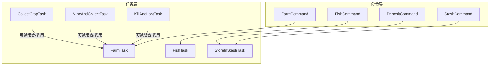
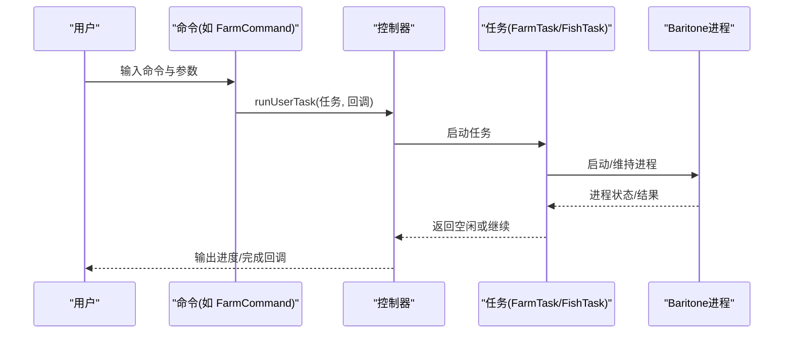
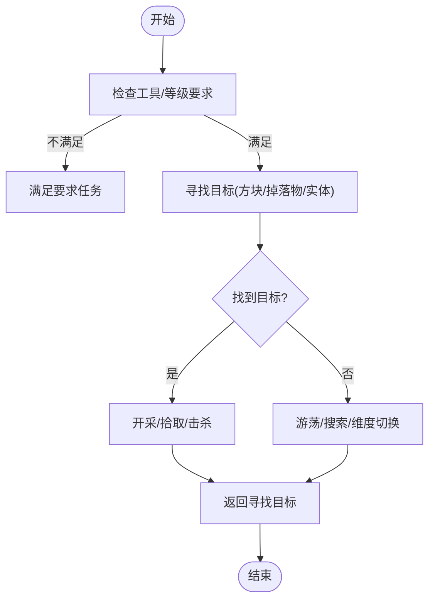
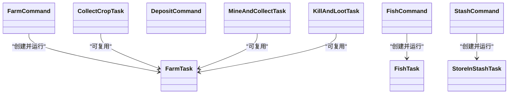

# 资源收集命令

<cite>
**本文引用的文件**
- [FarmCommand.java](file://src/main/java/adris/altoclef/commands/FarmCommand.java)
- [FishCommand.java](file://src/main/java/adris/altoclef/commands/FishCommand.java)
- [FarmTask.java](file://src/main/java/adris/altoclef/tasks/misc/FarmTask.java)
- [FishTask.java](file://src/main/java/adris/altoclef/tasks/misc/FishTask.java)
- [DepositCommand.java](file://src/main/java/adris/altoclef/commands/DepositCommand.java)
- [StashCommand.java](file://src/main/java/adris/altoclef/commands/StashCommand.java)
- [StoreInStashTask.java](file://src/main/java/adris/altoclef/tasks/container/StoreInStashTask.java)
- [CollectCropTask.java](file://src/main/java/adris/altoclef/tasks/resources/CollectCropTask.java)
- [MineAndCollectTask.java](file://src/main/java/adris/altoclef/tasks/resources/MineAndCollectTask.java)
- [KillAndLootTask.java](file://src/main/java/adris/altoclef/tasks/resources/KillAndLootTask.java)
</cite>

## 目录
1. [简介](#简介)
2. [项目结构](#项目结构)
3. [核心组件](#核心组件)
4. [架构总览](#架构总览)
5. [详细组件分析](#详细组件分析)
6. [依赖关系分析](#依赖关系分析)
7. [性能考量](#性能考量)
8. [故障排查指南](#故障排查指南)
9. [结论](#结论)
10. [附录](#附录)

## 简介
本文件面向“资源收集命令”的使用与扩展，系统性梳理 FarmCommand（农场管理）、FishCommand（钓鱼）以及与之配套的资源收集任务与仓储命令（Deposit、Stash）。内容涵盖：
- 命令语法与参数说明
- 资源类型与收集策略
- 自动化程度与控制流
- 与任务系统的集成方式（作物种植、动物饲养、矿物开采、海洋捕捞）
- 使用示例与最佳实践（单次收集、批量作业、循环管理、存储策略、效率优化）

## 项目结构
围绕资源收集的相关模块主要分布在以下路径：
- commands：命令入口层，负责解析参数并调度任务
- tasks/misc：通用任务（如农场、钓鱼）
- tasks/resources：资源采集任务族（作物、矿物、动物掉落）
- tasks/container：仓储任务（存入容器/保险箱）
- commands/DepositCommand.java、StashCommand.java：物品存取命令

图表来源
- [FarmCommand.java:12-28](file://src/main/java/adris/altoclef/commands/FarmCommand.java#L12-L28)
- [FishCommand.java:9-18](file://src/main/java/adris/altoclef/commands/FishCommand.java#L9-L18)
- [FarmTask.java:8-66](file://src/main/java/adris/altoclef/tasks/misc/FarmTask.java#L8-L66)
- [FishTask.java:8-52](file://src/main/java/adris/altoclef/tasks/misc/FishTask.java#L8-L52)
- [StoreInStashTask.java:15-93](file://src/main/java/adris/altoclef/tasks/container/StoreInStashTask.java#L15-L93)
- [CollectCropTask.java:28-178](file://src/main/java/adris/altoclef/tasks/resources/CollectCropTask.java#L28-L178)
- [MineAndCollectTask.java:39-361](file://src/main/java/adris/altoclef/tasks/resources/MineAndCollectTask.java#L39-L361)
- [KillAndLootTask.java:16-103](file://src/main/java/adris/altoclef/tasks/resources/KillAndLootTask.java#L16-L103)

章节来源
- [FarmCommand.java:12-28](file://src/main/java/adris/altoclef/commands/FarmCommand.java#L12-L28)
- [FishCommand.java:9-18](file://src/main/java/adris/altoclef/commands/FishCommand.java#L9-L18)
- [FarmTask.java:8-66](file://src/main/java/adris/altoclef/tasks/misc/FarmTask.java#L8-L66)
- [FishTask.java:8-52](file://src/main/java/adris/altoclef/tasks/misc/FishTask.java#L8-L52)
- [StoreInStashTask.java:15-93](file://src/main/java/adris/altoclef/tasks/container/StoreInStashTask.java#L15-L93)
- [CollectCropTask.java:28-178](file://src/main/java/adris/altoclef/tasks/resources/CollectCropTask.java#L28-L178)
- [MineAndCollectTask.java:39-361](file://src/main/java/adris/altoclef/tasks/resources/MineAndCollectTask.java#L39-L361)
- [KillAndLootTask.java:16-103](file://src/main/java/adris/altoclef/tasks/resources/KillAndLootTask.java#L16-L103)

## 核心组件
- FarmCommand：启动农场自动化，支持指定范围与中心点
- FishCommand：启动自动钓鱼，需具备钓鱼竿
- FarmTask：封装 Baritone 农场进程，持续维护状态
- FishTask：封装 Baritone 钓鱼进程，确保装备钓鱼竿
- DepositCommand：就近存入容器（箱子/桶/鞘翅箱），可按物品清单或全量
- StashCommand：在指定三维区域范围内存入物品，支持全量或指定清单
- StoreInStashTask：在给定区域内寻找非满容器进行存储，必要时先去收集所需材料再存储
- CollectCropTask：采集成熟作物，支持自动播种与循环
- MineAndCollectTask：矿物开采与拾取，自动满足工具等级要求并按活动半径限制
- KillAndLootTask：击杀实体并拾取掉落物，带超时与维度切换逻辑

章节来源
- [FarmCommand.java:12-28](file://src/main/java/adris/altoclef/commands/FarmCommand.java#L12-L28)
- [FishCommand.java:9-18](file://src/main/java/adris/altoclef/commands/FishCommand.java#L9-L18)
- [FarmTask.java:8-66](file://src/main/java/adris/altoclef/tasks/misc/FarmTask.java#L8-L66)
- [FishTask.java:8-52](file://src/main/java/adris/altoclef/tasks/misc/FishTask.java#L8-L52)
- [DepositCommand.java:23-97](file://src/main/java/adris/altoclef/commands/DepositCommand.java#L23-L97)
- [StashCommand.java:15-45](file://src/main/java/adris/altoclef/commands/StashCommand.java#L15-L45)
- [StoreInStashTask.java:15-93](file://src/main/java/adris/altoclef/tasks/container/StoreInStashTask.java#L15-L93)
- [CollectCropTask.java:28-178](file://src/main/java/adris/altoclef/tasks/resources/CollectCropTask.java#L28-L178)
- [MineAndCollectTask.java:39-361](file://src/main/java/adris/altoclef/tasks/resources/MineAndCollectTask.java#L39-L361)
- [KillAndLootTask.java:16-103](file://src/main/java/adris/altoclef/tasks/resources/KillAndLootTask.java#L16-L103)

## 架构总览
命令层通过解析用户输入，构造对应任务并交由控制器运行；任务层以 FarmTask/FishTask 为核心，其他资源任务（作物、矿物、动物）作为子任务或可组合单元参与流程。

图表来源
- [FarmCommand.java:21-27](file://src/main/java/adris/altoclef/commands/FarmCommand.java#L21-L27)
- [FarmTask.java:21-42](file://src/main/java/adris/altoclef/tasks/misc/FarmTask.java#L21-L42)
- [FishCommand.java:14-17](file://src/main/java/adris/altoclef/commands/FishCommand.java#L14-L17)
- [FishTask.java:10-27](file://src/main/java/adris/altoclef/tasks/misc/FishTask.java#L10-L27)

## 详细组件分析

### FarmCommand（农场管理）
- 语法与参数
  - 命令名：farm
  - 参数：range（整数，范围半径）
  - 示例：farm 10
- 资源类型与策略
  - 自动识别并采集成熟作物
  - 可选指定中心点与范围，否则在附近范围内自动扫描
- 自动化程度
  - 通过 FarmTask 封装 Baritone 农场进程，保持长期运行
  - 若进程停止则自动重启
- 与任务系统集成
  - 由 FarmTask 调用 Baritone 的农场进程，持续维护状态
- 使用示例
  - 单次：farm 10
  - 循环：farm（不带参数，持续农场）
- 最佳实践
  - 在有种子且允许自动播种时，优先开启自动播种以形成可持续循环
  - 合理设置范围，避免过度扫描

章节来源
- [FarmCommand.java:12-28](file://src/main/java/adris/altoclef/commands/FarmCommand.java#L12-L28)
- [FarmTask.java:8-66](file://src/main/java/adris/altoclef/tasks/misc/FarmTask.java#L8-L66)

### FishCommand（钓鱼）
- 语法与参数
  - 命令名：fish
  - 参数：无
  - 示例：fish
- 资源类型与策略
  - 自动钓鱼，自动装备钓鱼竿
- 自动化程度
  - 通过 FishTask 封装 Baritone 钓鱼进程
  - 若无钓鱼竿则提示无法钓鱼
- 与任务系统集成
  - 由 FishTask 维持钓鱼进程，持续运行
- 使用示例
  - 单次：fish
  - 循环：fish（持续钓鱼）
- 最佳实践
  - 确保背包中有钓鱼竿
  - 在安全水域附近使用，避免危险生物干扰

章节来源
- [FishCommand.java:9-18](file://src/main/java/adris/altoclef/commands/FishCommand.java#L9-L18)
- [FishTask.java:8-52](file://src/main/java/adris/altoclef/tasks/misc/FishTask.java#L8-L52)

### DepositCommand（就近存仓）
- 语法与参数
  - 命令名：deposit
  - 参数：items（可选，物品清单）
  - 示例：deposit、deposit diamond 2
- 资源类型与策略
  - 在附近范围内寻找箱子/桶/鞘翅箱等容器
  - 支持全量存入或按清单存入
  - 若缺少物品会提示不足
- 自动化程度
  - 通过 StoreInAnyContainerTask 执行存入动作
- 使用示例
  - 存入全部非工具类物品：deposit
  - 存入指定数量钻石：deposit diamond 2
- 最佳实践
  - 定期执行 deposit，避免背包溢出
  - 与 StashCommand 结合，先到 stash 区域再就近存入

章节来源
- [DepositCommand.java:23-97](file://src/main/java/adris/altoclef/commands/DepositCommand.java#L23-L97)

### StashCommand（区域存仓）
- 语法与参数
  - 命令名：stash
  - 参数：x_start, y_start, z_start, x_end, y_end, z_end, items（可选）
  - 示例：stash 0 0 0 10 64 10（定义一个三维区域）
- 资源类型与策略
  - 在指定三维区域内寻找非满容器进行存储
  - 若物品不足，可先去收集所需材料再存储
- 自动化程度
  - 通过 StoreInStashTask 实现区域化存取
- 使用示例
  - 在区域(0,0,0)-(10,64,10)内存入全部非装备物品：stash 0 0 0 10 64 10
- 最佳实践
  - 将 stash 区域设在安全且易达的位置
  - 与 DepositCommand 搭配，先就近存入，再集中到 stash 区域

章节来源
- [StashCommand.java:15-45](file://src/main/java/adris/altoclef/commands/StashCommand.java#L15-L45)
- [StoreInStashTask.java:15-93](file://src/main/java/adris/altoclef/tasks/container/StoreInStashTask.java#L15-L93)

### 资源采集任务（作物/矿物/动物）
- CollectCropTask（作物）
  - 功能：采集成熟作物，支持自动播种与循环
  - 关键点：检测成熟度、自动播种、处理掉落种子
  - 适用场景：小麦、胡萝卜、马铃薯等
- MineAndCollectTask（矿物）
  - 功能：矿物开采与拾取，自动满足工具等级要求
  - 关键点：活动半径限制、工具升级、范围超时
  - 适用场景：各种矿石与方块
- KillAndLootTask（动物）
  - 功能：击杀实体并拾取掉落物
  - 关键点：实体搜索超时、维度切换、范围超时
  - 适用场景：动物饲养/狩猎

图表来源
- [MineAndCollectTask.java:93-105](file://src/main/java/adris/altoclef/tasks/resources/MineAndCollectTask.java#L93-L105)
- [KillAndLootTask.java:51-75](file://src/main/java/adris/altoclef/tasks/resources/KillAndLootTask.java#L51-L75)

章节来源
- [CollectCropTask.java:28-178](file://src/main/java/adris/altoclef/tasks/resources/CollectCropTask.java#L28-L178)
- [MineAndCollectTask.java:39-361](file://src/main/java/adris/altoclef/tasks/resources/MineAndCollectTask.java#L39-L361)
- [KillAndLootTask.java:16-103](file://src/main/java/adris/altoclef/tasks/resources/KillAndLootTask.java#L16-L103)

## 依赖关系分析
- 命令到任务
  - FarmCommand → FarmTask
  - FishCommand → FishTask
  - DepositCommand → StoreInAnyContainerTask（间接通过控制器）
  - StashCommand → StoreInStashTask
- 任务到子任务
  - CollectCropTask、MineAndCollectTask、KillAndLootTask 均继承自 ResourceTask，可作为资源类任务复用
- 外部依赖
  - FarmTask/FishTask 依赖 Baritone 进程
  - StoreInStashTask 依赖容器扫描与存储查询

图表来源
- [FarmCommand.java:21-27](file://src/main/java/adris/altoclef/commands/FarmCommand.java#L21-L27)
- [FishCommand.java:14-17](file://src/main/java/adris/altoclef/commands/FishCommand.java#L14-L17)
- [StashCommand.java:30-43](file://src/main/java/adris/altoclef/commands/StashCommand.java#L30-L43)
- [FarmTask.java:21-42](file://src/main/java/adris/altoclef/tasks/misc/FarmTask.java#L21-L42)
- [FishTask.java:10-27](file://src/main/java/adris/altoclef/tasks/misc/FishTask.java#L10-L27)
- [StoreInStashTask.java:31-64](file://src/main/java/adris/altoclef/tasks/container/StoreInStashTask.java#L31-L64)
- [CollectCropTask.java:68-113](file://src/main/java/adris/altoclef/tasks/resources/CollectCropTask.java#L68-L113)
- [MineAndCollectTask.java:93-105](file://src/main/java/adris/altoclef/tasks/resources/MineAndCollectTask.java#L93-L105)
- [KillAndLootTask.java:51-75](file://src/main/java/adris/altoclef/tasks/resources/KillAndLootTask.java#L51-L75)

## 性能考量
- 活动半径与超时
  - 矿物与动物任务内置活动半径与“无目标”超时机制，避免无限游荡
- 工具与等级
  - 矿物任务会优先满足工具等级要求，减少无效尝试
- 存储路径优化
  - 先判断是否需要收集材料再前往 stash 区域，减少往返成本
- 资源循环
  - 农作物自动播种与循环，降低人工干预频率

章节来源
- [MineAndCollectTask.java:165-281](file://src/main/java/adris/altoclef/tasks/resources/MineAndCollectTask.java#L165-L281)
- [MineAndCollectTask.java:131-155](file://src/main/java/adris/altoclef/tasks/resources/MineAndCollectTask.java#L131-L155)
- [StoreInStashTask.java:36-64](file://src/main/java/adris/altoclef/tasks/container/StoreInStashTask.java#L36-L64)
- [CollectCropTask.java:83-112](file://src/main/java/adris/altoclef/tasks/resources/CollectCropTask.java#L83-L112)

## 故障排查指南
- 无法钓鱼
  - 现象：提示无法钓鱼
  - 原因：未装备钓鱼竿
  - 处理：确保背包中有钓鱼竿
- 农场无响应
  - 现象：农场进程停止
  - 原因：外部中断或异常
  - 处理：重新执行 farm 命令，FarmTask 会在启动时自动重启进程
- 仓库区无可用容器
  - 现象：提示区域内无非满容器
  - 原因：stash 区域内所有容器已满
  - 处理：扩大 stash 区域或清理容器
- 物品不足导致 deposit 失败
  - 现象：提示库存不足
  - 原因：请求存入的物品数量不足
  - 处理：先执行相应采集任务，再执行 deposit

章节来源
- [FishTask.java:17-20](file://src/main/java/adris/altoclef/tasks/misc/FishTask.java#L17-L20)
- [FarmTask.java:34-42](file://src/main/java/adris/altoclef/tasks/misc/FarmTask.java#L34-L42)
- [StoreInStashTask.java:56-63](file://src/main/java/adris/altoclef/tasks/container/StoreInStashTask.java#L56-L63)
- [DepositCommand.java:79-84](file://src/main/java/adris/altoclef/commands/DepositCommand.java#L79-L84)

## 结论
- FarmCommand 与 FishCommand 提供了开箱即用的自动化资源收集能力
- 通过 FarmTask/FishTask 与资源采集任务的组合，可覆盖作物、矿物、动物三大类资源
- Deposit/StoreInStash 体系提供了从就近存入到区域化存仓的完整链路
- 建议结合活动半径、工具等级与循环播种策略，构建稳定高效的资源收集流水线

## 附录
- 使用示例（概念性说明）
  - 单次收集：直接执行对应命令（如 farm 10 或 fish）
  - 批量作业：先执行采集任务，再统一 deposit/stash
  - 循环管理：farm 命令不带参数即可持续农场；矿物/动物任务在无目标时自动游荡并超时退出
- 最佳实践
  - 合理规划 stash 区域，靠近常用采集点
  - 定期执行 deposit，避免背包溢出
  - 在矿物任务中优先满足工具等级，减少失败重试
  - 利用自动播种与循环，降低人工干预