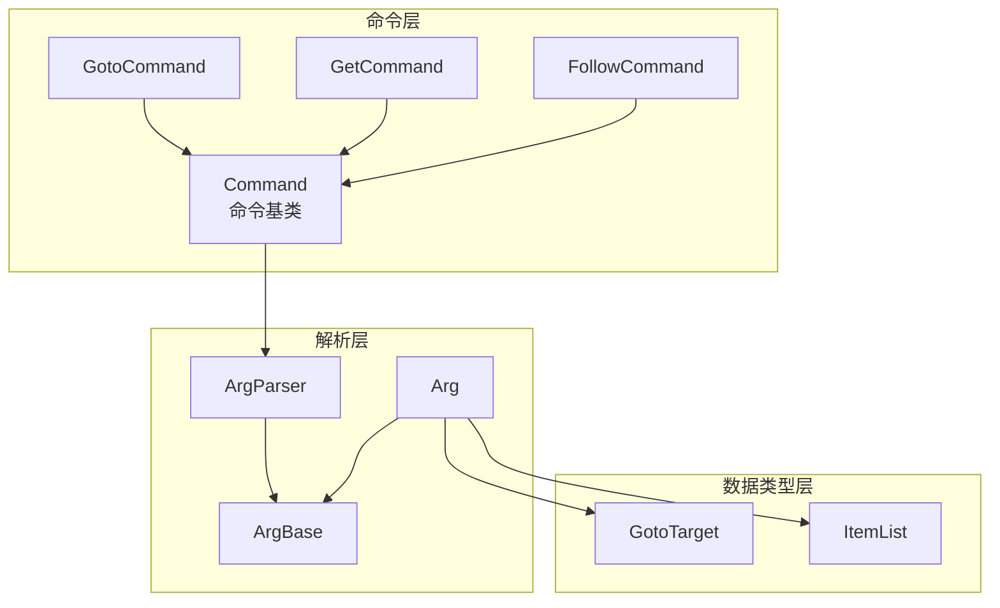
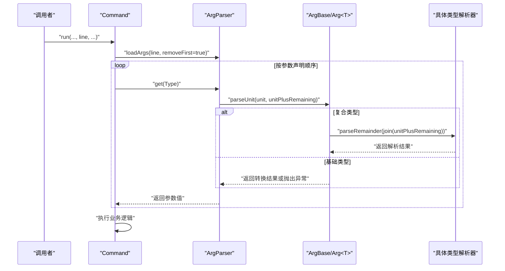
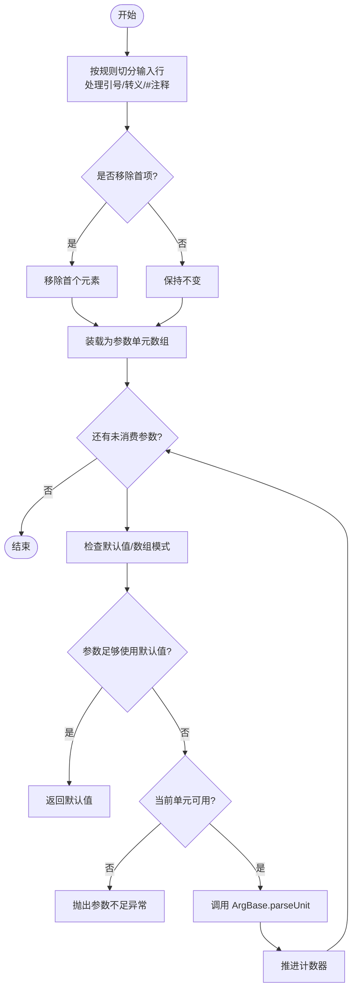
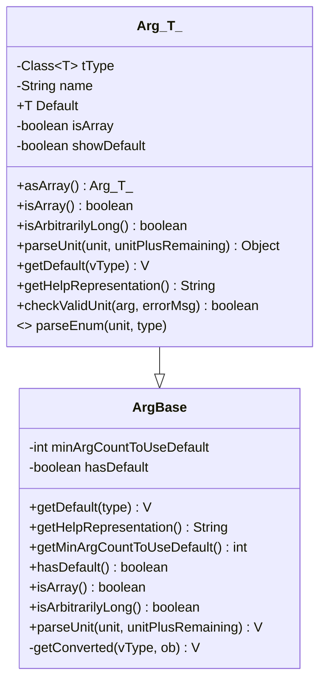
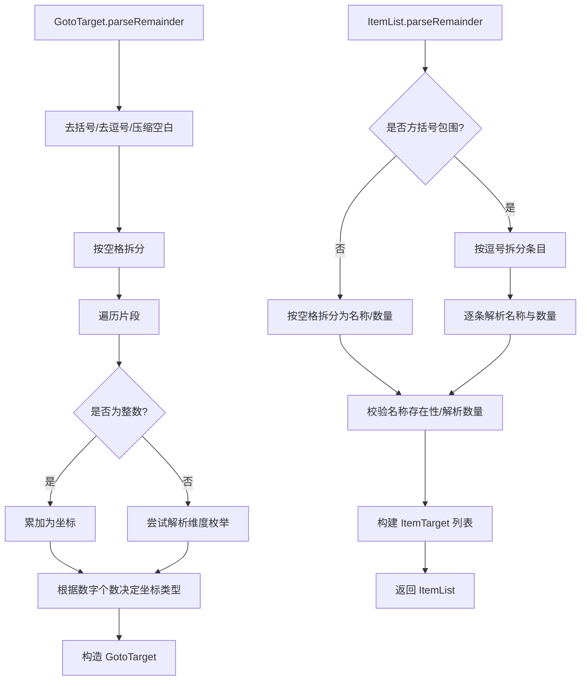
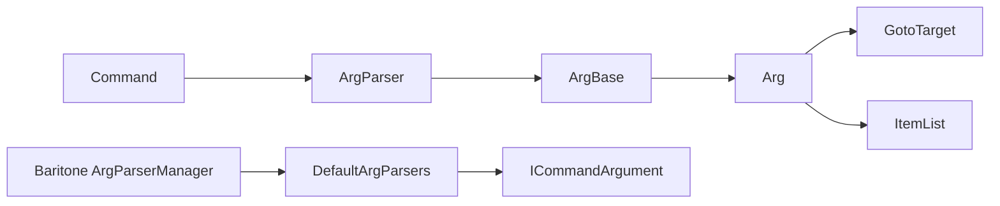

# 参数解析系统

<cite>
**本文引用的文件**
- [ArgParser.java](file://src/main/java/adris/altoclef/commandsystem/ArgParser.java)
- [ArgBase.java](file://src/main/java/adris/altoclef/commandsystem/ArgBase.java)
- [Arg.java](file://src/main/java/adris/altoclef/commandsystem/Arg.java)
- [Command.java](file://src/main/java/adris/altoclef/commandsystem/Command.java)
- [CommandException.java](file://src/main/java/adris/altoclef/commandsystem/CommandException.java)
- [ItemList.java](file://src/main/java/adris/altoclef/commandsystem/ItemList.java)
- [GotoTarget.java](file://src/main/java/adris/altoclef/commandsystem/GotoTarget.java)
- [GotoCommand.java](file://src/main/java/adris/altoclef/commands/GotoCommand.java)
- [GetCommand.java](file://src/main/java/adris/altoclef/commands/GetCommand.java)
- [FollowCommand.java](file://src/main/java/adris/altoclef/commands/FollowCommand.java)
- [ArgParserManager.java](file://src/main/java/baritone/command/argparser/ArgParserManager.java)
- [DefaultArgParsers.java](file://src/main/java/baritone/command/argparser/DefaultArgParsers.java)
- [ICommandArgument.java](file://src/main/java/baritone/api/command/argument/ICommandArgument.java)
</cite>

## 目录
1. [引言](#引言)
2. [项目结构](#项目结构)
3. [核心组件](#核心组件)
4. [架构总览](#架构总览)
5. [详细组件分析](#详细组件分析)
6. [依赖分析](#依赖分析)
7. [性能考虑](#性能考虑)
8. [故障排查指南](#故障排查指南)
9. [结论](#结论)
10. [附录：最佳实践与示例路径](#附录最佳实践与示例路径)

## 引言
本文件面向“参数解析系统”的技术文档，聚焦于命令参数的解析机制，包括参数类型识别、参数验证、参数转换与默认值策略。文档从 ArgParser 的解析流程入手，深入剖析 Arg 与 ArgBase 抽象类的设计理念与实现细节，并结合 GotoTarget、ItemList 等具体参数类型，说明其使用场景与扩展方式。同时给出最佳实践与性能优化建议，帮助开发者在不破坏现有契约的前提下，安全地新增参数类型与增强解析能力。

## 项目结构
参数解析系统位于模块的命令子系统中，核心由三部分组成：
- 命令层：Command 及其子类负责组织参数、触发解析与执行业务逻辑。
- 解析层：ArgParser 负责将输入行拆分为参数单元并按顺序消费；ArgBase/Arg 定义了参数类型抽象与具体解析行为。
- 数据类型层：GotoTarget、ItemList 等承载复杂参数语义，提供“剩余参数拼接”解析入口。

图表来源
- [Command.java:1-61](file://src/main/java/adris/altoclef/commandsystem/Command.java#L1-L61)
- [ArgParser.java:1-106](file://src/main/java/adris/altoclef/commandsystem/ArgParser.java#L1-L106)
- [ArgBase.java:1-44](file://src/main/java/adris/altoclef/commandsystem/ArgBase.java#L1-L44)
- [Arg.java:1-171](file://src/main/java/adris/altoclef/commandsystem/Arg.java#L1-L171)
- [GotoTarget.java:1-102](file://src/main/java/adris/altoclef/commandsystem/GotoTarget.java#L1-L102)
- [ItemList.java:1-90](file://src/main/java/adris/altoclef/commandsystem/ItemList.java#L1-L90)

章节来源
- [Command.java:1-61](file://src/main/java/adris/altoclef/commandsystem/Command.java#L1-L61)
- [ArgParser.java:1-106](file://src/main/java/adris/altoclef/commandsystem/ArgParser.java#L1-L106)
- [ArgBase.java:1-44](file://src/main/java/adris/altoclef/commandsystem/ArgBase.java#L1-L44)
- [Arg.java:1-171](file://src/main/java/adris/altoclef/commandsystem/Arg.java#L1-L171)
- [GotoTarget.java:1-102](file://src/main/java/adris/altoclef/commandsystem/GotoTarget.java#L1-L102)
- [ItemList.java:1-90](file://src/main/java/adris/altoclef/commandsystem/ItemList.java#L1-L90)

## 核心组件
- ArgParser：负责将输入行按空格与引号规则切分为参数单元，维护参数与单元计数器，按顺序调用 ArgBase 的解析方法，并支持默认值与数组模式。
- ArgBase：参数类型的抽象基类，提供默认值、帮助表示、数组/任意长度标记，以及统一的泛型解析入口。
- Arg<T>：具体参数类型实现，内置对基础类型（字符串、整数、浮点、长整型）与枚举的支持，以及对复合类型（ItemList、GotoTarget）的“剩余参数拼接”解析。
- Command：命令封装，持有 ArgParser 并在运行时加载参数、调用解析与执行业务任务。
- CommandException：命令解析与执行过程中的异常类型，用于向调用方反馈错误信息。
- GotoTarget、ItemList：复合参数类型，分别用于解析坐标目标与物品清单，均通过“剩余参数拼接”完成多字段解析。

章节来源
- [ArgParser.java:1-106](file://src/main/java/adris/altoclef/commandsystem/ArgParser.java#L1-L106)
- [ArgBase.java:1-44](file://src/main/java/adris/altoclef/commandsystem/ArgBase.java#L1-L44)
- [Arg.java:1-171](file://src/main/java/adris/altoclef/commandsystem/Arg.java#L1-L171)
- [Command.java:1-61](file://src/main/java/adris/altoclef/commandsystem/Command.java#L1-L61)
- [CommandException.java:1-12](file://src/main/java/adris/altoclef/commandsystem/CommandException.java#L1-L12)
- [GotoTarget.java:1-102](file://src/main/java/adris/altoclef/commandsystem/GotoTarget.java#L1-L102)
- [ItemList.java:1-90](file://src/main/java/adris/altoclef/commandsystem/ItemList.java#L1-L90)

## 架构总览
下图展示了命令执行到参数解析的关键交互：

图表来源
- [Command.java:19-24](file://src/main/java/adris/altoclef/commandsystem/Command.java#L19-L24)
- [ArgParser.java:57-96](file://src/main/java/adris/altoclef/commandsystem/ArgParser.java#L57-L96)
- [ArgBase.java:19-22](file://src/main/java/adris/altoclef/commandsystem/ArgBase.java#L19-L22)
- [Arg.java:151-154](file://src/main/java/adris/altoclef/commandsystem/Arg.java#L151-L154)
- [GotoTarget.java:22-69](file://src/main/java/adris/altoclef/commandsystem/GotoTarget.java#L22-L69)
- [ItemList.java:16-88](file://src/main/java/adris/altoclef/commandsystem/ItemList.java#L16-L88)

## 详细组件分析

### ArgParser 解析机制
- 关键职责
  - 输入行切分：支持双引号包裹、反斜杠转义、注释截断（# 后忽略），并按空白分割关键字。
  - 参数消费：维护参数计数器与单元计数器，按 ArgBase 的声明顺序消费参数。
  - 默认值与数组模式：当满足最小参数阈值时返回默认值；数组模式下一次性消耗剩余所有参数。
  - 错误控制：在参数数量不匹配、单元不足、过多时抛出 CommandException。

- 解析流程要点
  - 单元切分后移除第一个元素（通常是命令名），然后逐个参数调用 ArgBase.parseUnit。
  - 对于复合类型，ArgBase 将“剩余参数”拼接传入具体类型的 parseRemainder 方法，以支持多字段解析。

图表来源
- [ArgParser.java:18-96](file://src/main/java/adris/altoclef/commandsystem/ArgParser.java#L18-L96)

章节来源
- [ArgParser.java:1-106](file://src/main/java/adris/altoclef/commandsystem/ArgParser.java#L1-L106)

### ArgBase 与 Arg<T> 设计
- ArgBase
  - 提供默认值、帮助表示、数组/任意长度标记。
  - 统一泛型解析入口 parseUnit，内部通过反射获取实际类型参数，再委托 getConverted 进行类型转换。
  - getConverted 在类型不兼容时抛出非法参数异常，提示这是内部问题。

- Arg<T>
  - 类型约束：仅允许枚举、字符串、整数、浮点、长整型、ItemList、GotoTarget 等已知类型。
  - 枚举解析：统一小写与修剪后比对枚举常量，生成可读的可选值列表。
  - 基础类型解析：针对不同包装类型进行 parseXXX，失败时抛出带类型信息的异常。
  - 字符串解析：自动去除首尾引号。
  - 复合类型解析：ItemList.parseRemainder、GotoTarget.parseRemainder 通过“剩余参数拼接”完成多字段解析。
  - 数组模式：asArray 标记后，该参数会一次性消耗剩余全部参数。
  - 任意长度：当类型为 ItemList 或 GotoTarget 时，isArbitrarilyLong 返回真，允许超过声明参数个数。

图表来源
- [ArgBase.java:1-44](file://src/main/java/adris/altoclef/commandsystem/ArgBase.java#L1-L44)
- [Arg.java:1-171](file://src/main/java/adris/altoclef/commandsystem/Arg.java#L1-L171)

章节来源
- [ArgBase.java:1-44](file://src/main/java/adris/altoclef/commandsystem/ArgBase.java#L1-L44)
- [Arg.java:1-171](file://src/main/java/adris/altoclef/commandsystem/Arg.java#L1-L171)

### 复合参数类型：GotoTarget 与 ItemList
- GotoTarget
  - 支持多种坐标形式：仅 Y、XZ、XYZ 或仅维度，以及“剩余参数拼接”解析。
  - 容错处理：容忍逗号分隔与多余空白，自动识别维度枚举。
  - 结果类型：根据解析到的数字个数确定坐标类型，便于上层任务选择合适的移动策略。

- ItemList
  - 支持单个条目“名称 [数量]”或方括号包裹的列表“[item1 count1, item2 count2, ...]”。
  - 名称校验：通过任务目录进行存在性检查，提供模糊匹配建议。
  - 计数解析：对每个条目的数量进行解析，支持缺失则默认 1。
  - 结果类型：返回 ItemTarget 数组，便于后续任务装配。

图表来源
- [GotoTarget.java:22-69](file://src/main/java/adris/altoclef/commandsystem/GotoTarget.java#L22-L69)
- [ItemList.java:16-88](file://src/main/java/adris/altoclef/commandsystem/ItemList.java#L16-L88)

章节来源
- [GotoTarget.java:1-102](file://src/main/java/adris/altoclef/commandsystem/GotoTarget.java#L1-L102)
- [ItemList.java:1-90](file://src/main/java/adris/altoclef/commandsystem/ItemList.java#L1-L90)

### 典型命令使用示例
- GotoCommand：解析 GotoTarget，依据坐标类型选择不同的移动任务，并加入距离守卫逻辑。
- GetCommand：解析 ItemList，优先判断库存是否已满足，否则委派给任务目录生成对应任务。
- FollowCommand：解析字符串用户名，若缺省则回退到拥有者用户名。

章节来源
- [GotoCommand.java:1-66](file://src/main/java/adris/altoclef/commands/GotoCommand.java#L1-L66)
- [GetCommand.java:1-79](file://src/main/java/adris/altoclef/commands/GetCommand.java#L1-L79)
- [FollowCommand.java:1-33](file://src/main/java/adris/altoclef/commands/FollowCommand.java#L1-L33)

### 与 Baritone 参数解析的对比
- 本项目采用“命令参数声明 + 自定义解析器”的模式，ArgParser 与 ArgBase/Arg 提供强类型与默认值控制。
- Baritone 侧提供独立的参数解析管理器与一组默认解析器（整数、浮点、布尔等），并通过接口隔离解析器注册与查找。
- 两者互补：可在命令层复用 Baritone 的默认解析器，或在自定义参数类型中沿用本项目的复合解析模式。

章节来源
- [ArgParserManager.java:1-76](file://src/main/java/baritone/command/argparser/ArgParserManager.java#L1-L76)
- [DefaultArgParsers.java:1-102](file://src/main/java/baritone/command/argparser/DefaultArgParsers.java#L1-L102)
- [ICommandArgument.java:1-22](file://src/main/java/baritone/api/command/argument/ICommandArgument.java#L1-L22)

## 依赖分析
- 内部依赖
  - Command 依赖 ArgParser 与 ArgBase/Arg。
  - Arg<T> 依赖 GotoTarget、ItemList 以实现复合类型解析。
  - GotoTarget、ItemList 依赖命令系统异常类型与工具类（如模糊匹配辅助）。
- 外部依赖
  - Baritone 提供独立的参数解析体系，可作为默认解析器注册与查找的参考实现。

图表来源
- [Command.java:1-61](file://src/main/java/adris/altoclef/commandsystem/Command.java#L1-L61)
- [ArgParser.java:1-106](file://src/main/java/adris/altoclef/commandsystem/ArgParser.java#L1-L106)
- [ArgBase.java:1-44](file://src/main/java/adris/altoclef/commandsystem/ArgBase.java#L1-L44)
- [Arg.java:1-171](file://src/main/java/adris/altoclef/commandsystem/Arg.java#L1-L171)
- [GotoTarget.java:1-102](file://src/main/java/adris/altoclef/commandsystem/GotoTarget.java#L1-L102)
- [ItemList.java:1-90](file://src/main/java/adris/altoclef/commandsystem/ItemList.java#L1-L90)
- [ArgParserManager.java:1-76](file://src/main/java/baritone/command/argparser/ArgParserManager.java#L1-L76)
- [DefaultArgParsers.java:1-102](file://src/main/java/baritone/command/argparser/DefaultArgParsers.java#L1-L102)
- [ICommandArgument.java:1-22](file://src/main/java/baritone/api/command/argument/ICommandArgument.java#L1-L22)

## 性能考虑
- 预分配与拷贝
  - ArgParser 在装载参数单元时预分配数组并进行一次数组拷贝，避免频繁扩容与重复切分。
- 解析路径优化
  - Arg<T> 使用类型判定分支快速分流，减少不必要的异常开销；对枚举与字符串解析采用短路策略。
- 复合类型解析
  - GotoTarget、ItemList 通过“剩余参数拼接”集中解析，避免多次遍历输入行。
- 建议
  - 控制参数数量与嵌套深度，避免过长的“剩余参数”链导致解析成本上升。
  - 对高频命令尽量使用基础类型参数，减少复合类型解析次数。

[本节为通用性能讨论，无需列出具体文件来源]

## 故障排查指南
- 参数不足
  - 现象：解析阶段抛出“参数不足”异常。
  - 排查：确认命令帮助输出与参数声明，检查输入行是否遗漏必要参数。
- 参数过多
  - 现象：解析阶段抛出“参数过多”异常。
  - 排查：确认非数组/非任意长度参数是否被意外传入多余参数。
- 类型转换失败
  - 现象：解析基础类型时抛出带类型信息的异常。
  - 排查：核对输入格式（如整数/浮点/布尔），确保符合预期格式。
- 枚举值无效
  - 现象：枚举解析抛出异常并列出可接受值。
  - 排查：检查大小写与拼写，使用可读的枚举名称。
- 复合类型解析失败
  - GotoTarget：检查坐标数量与维度枚举是否正确。
  - ItemList：检查名称是否存在、数量是否为整数、列表格式是否规范。
- 默认值未生效
  - 现象：未达到最小参数阈值，默认值未被使用。
  - 排查：调整命令声明中的最小参数阈值，或显式传入参数。

章节来源
- [ArgParser.java:69-96](file://src/main/java/adris/altoclef/commandsystem/ArgParser.java#L69-L96)
- [Arg.java:37-52](file://src/main/java/adris/altoclef/commandsystem/Arg.java#L37-L52)
- [GotoTarget.java:22-69](file://src/main/java/adris/altoclef/commandsystem/GotoTarget.java#L22-L69)
- [ItemList.java:16-88](file://src/main/java/adris/altoclef/commandsystem/ItemList.java#L16-L88)

## 结论
本参数解析系统通过“命令声明 + 自定义解析器”的方式，实现了强类型、可扩展、可验证的参数解析能力。ArgBase/Arg<T> 提供了统一的类型抽象与转换入口，ArgParser 则负责参数消费与默认值策略。复合类型（GotoTarget、ItemList）通过“剩余参数拼接”实现了灵活的多字段解析。配合命令层的任务调度，系统能够稳定地将自然语言指令转化为可执行的任务序列。

[本节为总结性内容，无需列出具体文件来源]

## 附录：最佳实践与示例路径
- 新增参数类型
  - 步骤
    - 在 ArgBase/Arg 体系中，为新类型添加类型判定与解析分支。
    - 若为复合类型，提供 parseRemainder 并在 Arg<T> 中接入。
    - 为该类型提供合理的默认值与帮助表示。
  - 示例路径
    - [Arg.java:15-23](file://src/main/java/adris/altoclef/commandsystem/Arg.java#L15-L23)
    - [Arg.java:97-149](file://src/main/java/adris/altoclef/commandsystem/Arg.java#L97-L149)
- 实现参数验证
  - 在 Arg<T> 中扩展 checkValidUnit，或在具体类型解析中提前校验范围与约束。
  - 示例路径
    - [Arg.java:156-159](file://src/main/java/adris/altoclef/commandsystem/Arg.java#L156-L159)
    - [ItemList.java:42-50](file://src/main/java/adris/altoclef/commandsystem/ItemList.java#L42-L50)
- 处理参数转换错误
  - 在解析失败处抛出带明确类型的 CommandException，便于上层统一捕获与提示。
  - 示例路径
    - [Arg.java:91-95](file://src/main/java/adris/altoclef/commandsystem/Arg.java#L91-L95)
    - [GotoTarget.java:67-68](file://src/main/java/adris/altoclef/commandsystem/GotoTarget.java#L67-L68)
- 使用场景与示例
  - 字符串参数：FollowCommand
    - [FollowCommand.java:11-15](file://src/main/java/adris/altoclef/commands/FollowCommand.java#L11-L15)
  - 数字参数：命令中直接使用基础类型解析
    - 参考 Arg<T> 对整数/浮点/长整型的解析分支
    - [Arg.java:101-131](file://src/main/java/adris/altoclef/commandsystem/Arg.java#L101-L131)
  - 坐标参数：GotoTarget
    - [GotoCommand.java:24-30](file://src/main/java/adris/altoclef/commands/GotoCommand.java#L24-L30)
    - [GotoTarget.java:22-69](file://src/main/java/adris/altoclef/commandsystem/GotoTarget.java#L22-L69)
  - 物品参数：ItemList
    - [GetCommand.java:17-23](file://src/main/java/adris/altoclef/commands/GetCommand.java#L17-L23)
    - [ItemList.java:16-88](file://src/main/java/adris/altoclef/commandsystem/ItemList.java#L16-L88)

[本节为实践指导与示例路径汇总，无需额外列出具体文件来源]