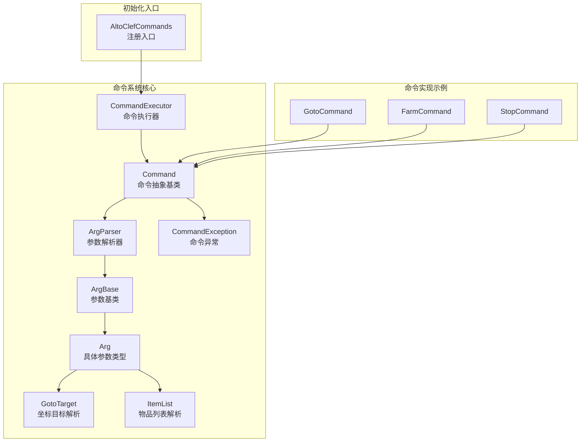
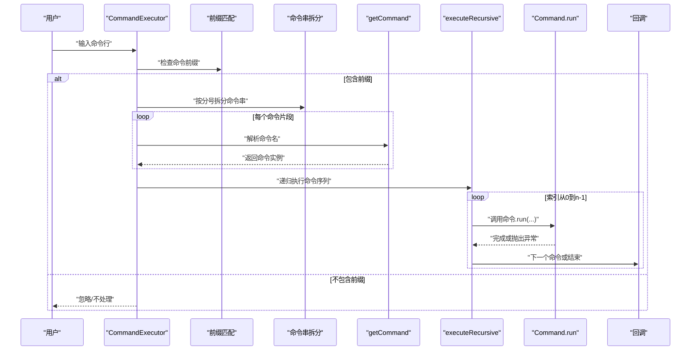
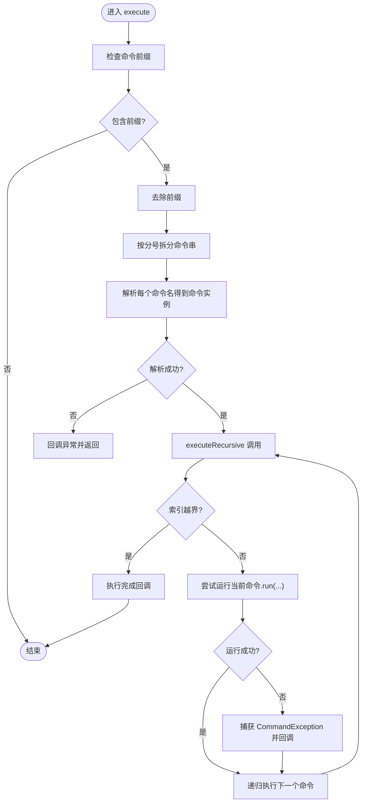
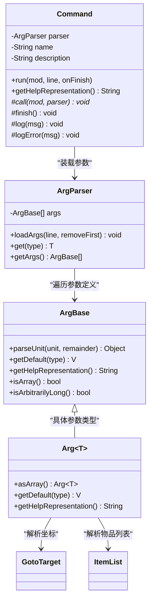
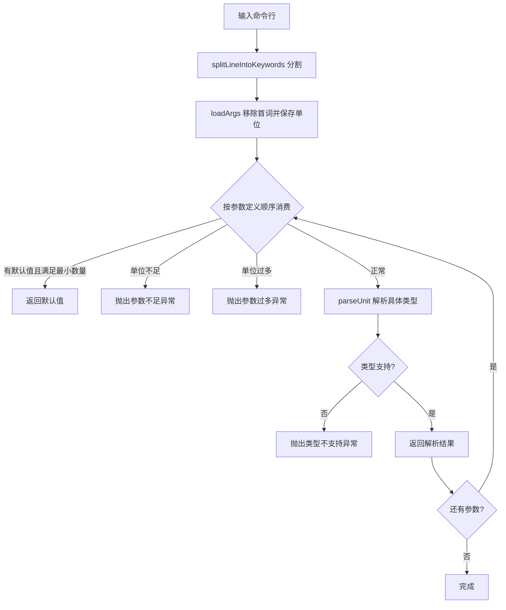
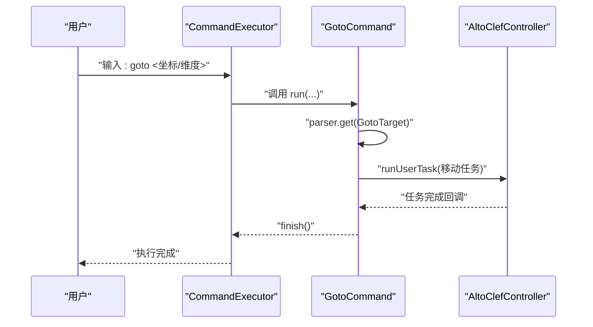
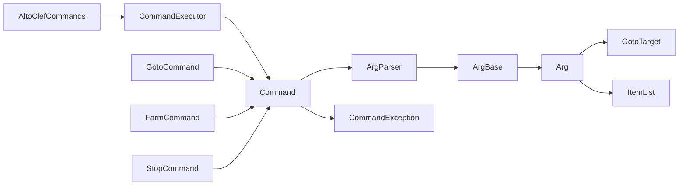

# 命令架构设计

<cite>
**本文引用的文件**
- [CommandExecutor.java](file://src/main/java/adris/altoclef/commandsystem/CommandExecutor.java)
- [Command.java](file://src/main/java/adris/altoclef/commandsystem/Command.java)
- [Arg.java](file://src/main/java/adris/altoclef/commandsystem/Arg.java)
- [ArgParser.java](file://src/main/java/adris/altoclef/commandsystem/ArgParser.java)
- [ArgBase.java](file://src/main/java/adris/altoclef/commandsystem/ArgBase.java)
- [CommandException.java](file://src/main/java/adris/altoclef/commandsystem/CommandException.java)
- [GotoTarget.java](file://src/main/java/adris/altoclef/commandsystem/GotoTarget.java)
- [ItemList.java](file://src/main/java/adris/altoclef/commandsystem/ItemList.java)
- [GotoCommand.java](file://src/main/java/adris/altoclef/commands/GotoCommand.java)
- [FarmCommand.java](file://src/main/java/adris/altoclef/commands/FarmCommand.java)
- [StopCommand.java](file://src/main/java/adris/altoclef/commands/StopCommand.java)
- [AltoClefCommands.java](file://src/main/java/adris/altoclef/AltoClefCommands.java)
</cite>

## 目录
1. [引言](#引言)
2. [项目结构](#项目结构)
3. [核心组件](#核心组件)
4. [架构总览](#架构总览)
5. [详细组件分析](#详细组件分析)
6. [依赖分析](#依赖分析)
7. [性能考量](#性能考量)
8. [故障排查指南](#故障排查指南)
9. [结论](#结论)
10. [附录](#附录)

## 引言
本技术文档围绕命令架构设计展开，重点阐释 CommandExecutor 的核心理念与实现方式，包括命令注册机制、命令分发流程、递归执行策略；同时深入分析 Command 抽象基类的设计模式（run 方法规范、参数传递机制、异常处理策略），并解释命令系统的前缀匹配、命令解析与多命令串联执行原理。文档提供可追溯的源码路径与可视化图示，帮助读者快速理解并扩展该命令系统。

## 项目结构
命令系统位于模块“adris.altoclef.commandsystem”，核心类包括命令执行器、命令抽象基类、参数解析器与参数类型定义；典型命令位于“adris.altoclef.commands”包中，并通过“AltoClefCommands”集中注册到执行器。

图表来源
- [CommandExecutor.java:11-121](file://src/main/java/adris/altoclef/commandsystem/CommandExecutor.java#L11-L121)
- [Command.java:6-61](file://src/main/java/adris/altoclef/commandsystem/Command.java#L6-L61)
- [ArgParser.java:6-106](file://src/main/java/adris/altoclef/commandsystem/ArgParser.java#L6-L106)
- [ArgBase.java:5-44](file://src/main/java/adris/altoclef/commandsystem/ArgBase.java#L5-L44)
- [Arg.java:3-171](file://src/main/java/adris/altoclef/commandsystem/Arg.java#L3-L171)
- [GotoTarget.java:7-102](file://src/main/java/adris/altoclef/commandsystem/GotoTarget.java#L7-L102)
- [ItemList.java:9-90](file://src/main/java/adris/altoclef/commandsystem/ItemList.java#L9-L90)
- [CommandException.java:3-12](file://src/main/java/adris/altoclef/commandsystem/CommandException.java#L3-L12)
- [GotoCommand.java:20-66](file://src/main/java/adris/altoclef/commands/GotoCommand.java#L20-L66)
- [FarmCommand.java:12-29](file://src/main/java/adris/altoclef/commands/FarmCommand.java#L12-L29)
- [StopCommand.java:7-18](file://src/main/java/adris/altoclef/commands/StopCommand.java#L7-L18)
- [AltoClefCommands.java:31-65](file://src/main/java/adris/altoclef/AltoClefCommands.java#L31-L65)

章节来源
- [CommandExecutor.java:11-121](file://src/main/java/adris/altoclef/commandsystem/CommandExecutor.java#L11-L121)
- [AltoClefCommands.java:31-65](file://src/main/java/adris/altoclef/AltoClefCommands.java#L31-L65)

## 核心组件
- 命令执行器：负责命令注册、前缀识别、命令串拆分、递归执行与异常回调。
- 命令抽象基类：统一 run 生命周期、参数装载、帮助信息生成、日志输出与完成回调。
- 参数解析器：支持空格/引号/注释分割、默认值策略、数组参数、类型转换与错误报告。
- 参数类型：内置字符串、数值、枚举、坐标目标、物品列表等解析逻辑。
- 典型命令：以 GotoCommand、FarmCommand、StopCommand 为例，展示如何继承 Command 并使用 ArgParser 获取参数。

章节来源
- [CommandExecutor.java:11-121](file://src/main/java/adris/altoclef/commandsystem/CommandExecutor.java#L11-L121)
- [Command.java:6-61](file://src/main/java/adris/altoclef/commandsystem/Command.java#L6-L61)
- [ArgParser.java:57-106](file://src/main/java/adris/altoclef/commandsystem/ArgParser.java#L57-L106)
- [Arg.java:10-171](file://src/main/java/adris/altoclef/commandsystem/Arg.java#L10-L171)
- [GotoTarget.java:22-94](file://src/main/java/adris/altoclef/commandsystem/GotoTarget.java#L22-L94)
- [ItemList.java:16-90](file://src/main/java/adris/altoclef/commandsystem/ItemList.java#L16-L90)
- [GotoCommand.java:24-66](file://src/main/java/adris/altoclef/commands/GotoCommand.java#L24-L66)
- [FarmCommand.java:13-29](file://src/main/java/adris/altoclef/commands/FarmCommand.java#L13-L29)
- [StopCommand.java:8-18](file://src/main/java/adris/altoclef/commands/StopCommand.java#L8-L18)

## 架构总览
命令系统采用“执行器 + 抽象命令 + 参数解析”的分层设计。执行器负责输入预处理与多命令串联执行；命令对象封装业务逻辑并通过参数解析器获取强类型参数；参数类型支持常见数据与复合类型（如坐标、物品列表）。

图表来源
- [CommandExecutor.java:34-111](file://src/main/java/adris/altoclef/commandsystem/CommandExecutor.java#L34-L111)

## 详细组件分析

### 命令执行器（CommandExecutor）
- 设计要点
  - 命令注册：以名称为键存储命令实例，避免重复注册。
  - 前缀匹配：读取配置前缀，判断是否为客户端命令。
  - 命令串拆分：以分号分隔多个命令，逐个解析。
  - 递归执行：顺序执行命令，异常时收集并继续后续命令。
  - 多重执行入口：支持带/不带前缀、仅回调、默认日志等变体。
- 关键方法
  - registerNewCommand(...)：批量注册命令。
  - isClientCommand(String)：基于前缀判断。
  - execute(String, ...)：主执行入口，包含拆分与递归调度。
  - executeRecursive(...)：递归执行命令序列。
  - getCommand(String)：根据首词查找命令。
- 错误处理
  - 命令不存在、参数解析失败、非法命令等均包装为 CommandException 并回调。

图表来源
- [CommandExecutor.java:58-111](file://src/main/java/adris/altoclef/commandsystem/CommandExecutor.java#L58-L111)

章节来源
- [CommandExecutor.java:11-121](file://src/main/java/adris/altoclef/commandsystem/CommandExecutor.java#L11-L121)

### 命令抽象基类（Command）
- 设计模式
  - 模板方法：run(...) 统一装载参数、调用受保护的 call(...) 执行业务逻辑。
  - 参数化接口：通过 ArgParser 与 ArgBase/Arg<T> 提供强类型参数访问。
  - 回调机制：finish() 触发上层完成回调，便于链式任务衔接。
- 关键行为
  - run(AltoClefController, String, Runnable)：装载参数并调用 call(...)。
  - getHelpRepresentation()：生成命令+参数的帮助文本。
  - 日志工具：log/logError 输出调试信息。
- 子类实现范式
  - 在构造函数中声明参数（Arg<T>...），在 call(...) 中通过 parser.get(Type) 获取参数。
  - 通过 mod.runUserTask(...) 启动任务，完成后调用 finish()。

图表来源
- [Command.java:6-61](file://src/main/java/adris/altoclef/commandsystem/Command.java#L6-L61)
- [ArgParser.java:6-106](file://src/main/java/adris/altoclef/commandsystem/ArgParser.java#L6-L106)
- [ArgBase.java:5-44](file://src/main/java/adris/altoclef/commandsystem/ArgBase.java#L5-L44)
- [Arg.java:3-171](file://src/main/java/adris/altoclef/commandsystem/Arg.java#L3-L171)
- [GotoTarget.java:7-102](file://src/main/java/adris/altoclef/commandsystem/GotoTarget.java#L7-L102)
- [ItemList.java:9-90](file://src/main/java/adris/altoclef/commandsystem/ItemList.java#L9-L90)

章节来源
- [Command.java:6-61](file://src/main/java/adris/altoclef/commandsystem/Command.java#L6-L61)

### 参数解析器与参数类型（ArgParser、ArgBase、Arg）
- 参数解析器
  - splitLineIntoKeywords：支持引号包裹、反斜杠转义、注释截断、空白分割。
  - loadArgs：移除首词后将剩余单位保存为数组。
  - get：按参数定义顺序消费单位，支持默认值、数组参数、过少/过多参数检测。
- 参数基类与具体类型
  - ArgBase：定义泛型转换、默认值、帮助表示、数组/任意长度标记。
  - Arg<T>：实现具体类型解析（字符串、数值、枚举、ItemList、GotoTarget），并校验类型支持范围。
- 类型解析要点
  - 字符串：支持引号去壳。
  - 数值：整数/长整型/浮点/双精度解析。
  - 枚举：大小写不敏感匹配，提供可用值列表。
  - 复合类型：GotoTarget 支持坐标与维度组合；ItemList 支持单个或数组形式解析。

图表来源
- [ArgParser.java:18-106](file://src/main/java/adris/altoclef/commandsystem/ArgParser.java#L18-L106)
- [ArgBase.java:19-43](file://src/main/java/adris/altoclef/commandsystem/ArgBase.java#L19-L43)
- [Arg.java:97-154](file://src/main/java/adris/altoclef/commandsystem/Arg.java#L97-L154)

章节来源
- [ArgParser.java:57-106](file://src/main/java/adris/altoclef/commandsystem/ArgParser.java#L57-L106)
- [ArgBase.java:5-44](file://src/main/java/adris/altoclef/commandsystem/ArgBase.java#L5-L44)
- [Arg.java:10-171](file://src/main/java/adris/altoclef/commandsystem/Arg.java#L10-L171)

### 命令注册与初始化（AltoClefCommands）
- 注册入口：AltoClefCommands.init(...) 将大量命令实例一次性注册到 CommandExecutor。
- 扩展建议：新增命令时只需在该方法中添加实例化语句，遵循“单一职责”与“集中管理”。

章节来源
- [AltoClefCommands.java:31-65](file://src/main/java/adris/altoclef/AltoClefCommands.java#L31-L65)

### 典型命令实现示例
- GotoCommand：解析 GotoTarget，进行距离守卫判断，选择对应移动任务并启动。
- FarmCommand：解析半径参数，构建农场任务并启动。
- StopCommand：直接调用控制器停止逻辑并完成回调。

图表来源
- [GotoCommand.java:41-66](file://src/main/java/adris/altoclef/commands/GotoCommand.java#L41-L66)
- [CommandExecutor.java:38-56](file://src/main/java/adris/altoclef/commandsystem/CommandExecutor.java#L38-L56)

章节来源
- [GotoCommand.java:24-66](file://src/main/java/adris/altoclef/commands/GotoCommand.java#L24-L66)
- [FarmCommand.java:13-29](file://src/main/java/adris/altoclef/commands/FarmCommand.java#L13-L29)
- [StopCommand.java:8-18](file://src/main/java/adris/altoclef/commands/StopCommand.java#L8-L18)

## 依赖分析
- 内聚性：命令执行器与命令抽象基类内聚于“命令生命周期”；参数解析器与参数类型内聚于“参数装载与类型转换”。
- 耦合度：命令实现依赖 Command 抽象与 ArgParser；执行器依赖命令集合与控制器；解析器依赖参数类型定义。
- 可能的循环依赖：未发现直接循环依赖；若自定义命令中引入对执行器的直接耦合需谨慎。
- 外部依赖：日志框架用于记录解析与执行过程；控制器用于启动任务。

图表来源
- [CommandExecutor.java:11-121](file://src/main/java/adris/altoclef/commandsystem/CommandExecutor.java#L11-L121)
- [Command.java:6-61](file://src/main/java/adris/altoclef/commandsystem/Command.java#L6-L61)
- [ArgParser.java:6-106](file://src/main/java/adris/altoclef/commandsystem/ArgParser.java#L6-L106)
- [ArgBase.java:5-44](file://src/main/java/adris/altoclef/commandsystem/ArgBase.java#L5-L44)
- [Arg.java:3-171](file://src/main/java/adris/altoclef/commandsystem/Arg.java#L3-L171)
- [GotoTarget.java:7-102](file://src/main/java/adris/altoclef/commandsystem/GotoTarget.java#L7-L102)
- [ItemList.java:9-90](file://src/main/java/adris/altoclef/commandsystem/ItemList.java#L9-L90)
- [CommandException.java:3-12](file://src/main/java/adris/altoclef/commandsystem/CommandException.java#L3-L12)
- [AltoClefCommands.java:31-65](file://src/main/java/adris/altoclef/AltoClefCommands.java#L31-L65)
- [GotoCommand.java:20-66](file://src/main/java/adris/altoclef/commands/GotoCommand.java#L20-L66)
- [FarmCommand.java:12-29](file://src/main/java/adris/altoclef/commands/FarmCommand.java#L12-L29)
- [StopCommand.java:7-18](file://src/main/java/adris/altoclef/commands/StopCommand.java#L7-L18)

章节来源
- [CommandExecutor.java:11-121](file://src/main/java/adris/altoclef/commandsystem/CommandExecutor.java#L11-L121)
- [Command.java:6-61](file://src/main/java/adris/altoclef/commandsystem/Command.java#L6-L61)
- [ArgParser.java:6-106](file://src/main/java/adris/altoclef/commandsystem/ArgParser.java#L6-L106)
- [ArgBase.java:5-44](file://src/main/java/adris/altoclef/commandsystem/ArgBase.java#L5-L44)
- [Arg.java:3-171](file://src/main/java/adris/altoclef/commandsystem/Arg.java#L3-L171)
- [GotoTarget.java:7-102](file://src/main/java/adris/altoclef/commandsystem/GotoTarget.java#L7-L102)
- [ItemList.java:9-90](file://src/main/java/adris/altoclef/commandsystem/ItemList.java#L9-L90)
- [CommandException.java:3-12](file://src/main/java/adris/altoclef/commandsystem/CommandException.java#L3-L12)
- [AltoClefCommands.java:31-65](file://src/main/java/adris/altoclef/AltoClefCommands.java#L31-L65)
- [GotoCommand.java:20-66](file://src/main/java/adris/altoclef/commands/GotoCommand.java#L20-L66)
- [FarmCommand.java:12-29](file://src/main/java/adris/altoclef/commands/FarmCommand.java#L12-L29)
- [StopCommand.java:7-18](file://src/main/java/adris/altoclef/commands/StopCommand.java#L7-L18)

## 性能考量
- 解析开销：参数解析采用线性扫描与简单类型转换，复杂度 O(n_units)；建议减少不必要的命令串长度与嵌套。
- 递归深度：多命令串联为线性递归，深度由命令数量决定；建议控制单次命令串长度，避免过深递归栈。
- 类型转换：数值与枚举解析为常数时间；复合类型（坐标、物品列表）解析为线性时间，注意输入规模。
- 日志与异常：日志输出与异常包装会带来额外开销，建议在生产环境适当降低日志级别。

## 故障排查指南
- 命令不存在：检查命令名称拼写与注册入口是否包含该命令。
- 参数不足/过多：根据提示调整参数数量，必要时使用默认值或减少数组参数长度。
- 类型解析失败：确认参数类型与格式（如数值、枚举大小写、字符串引号、坐标维度）。
- 坐标/物品解析错误：核对 GotoTarget 与 ItemList 的输入格式，确保维度枚举正确、物品名称存在。
- 递归执行中断：异常会被收集并传递给回调，后续命令仍会尝试执行；可通过回调日志定位问题。

章节来源
- [CommandExecutor.java:42-56](file://src/main/java/adris/altoclef/commandsystem/CommandExecutor.java#L42-L56)
- [ArgParser.java:69-96](file://src/main/java/adris/altoclef/commandsystem/ArgParser.java#L69-L96)
- [Arg.java:97-154](file://src/main/java/adris/altoclef/commandsystem/Arg.java#L97-L154)
- [GotoTarget.java:22-69](file://src/main/java/adris/altoclef/commandsystem/GotoTarget.java#L22-L69)
- [ItemList.java:16-90](file://src/main/java/adris/altoclef/commandsystem/ItemList.java#L16-L90)

## 结论
该命令架构以 CommandExecutor 为核心，结合 Command 抽象基类与 ArgParser/Arg 系列类型，实现了高内聚、低耦合的命令系统。其特性包括：
- 命令注册集中、扩展便捷；
- 前缀匹配与多命令串联提升易用性；
- 参数解析器提供强类型与默认值支持；
- 异常处理与完成回调保证执行流程可控。

最佳实践与扩展建议：
- 新增命令时遵循“构造函数声明参数 → call 中解析参数 → 启动任务 → finish 回调”的模板；
- 使用 getHelpRepresentation 辅助生成帮助信息；
- 对复杂命令拆分为多个简单命令并通过分号串联；
- 避免在命令内部直接耦合执行器，保持职责单一。

## 附录
- 常用代码路径参考
  - 命令注册入口：[AltoClefCommands.init:32-62](file://src/main/java/adris/altoclef/AltoClefCommands.java#L32-L62)
  - 命令执行入口：[CommandExecutor.execute:58-76](file://src/main/java/adris/altoclef/commandsystem/CommandExecutor.java#L58-L76)
  - 命令模板实现：[Command.run:19-24](file://src/main/java/adris/altoclef/commandsystem/Command.java#L19-L24)
  - 参数解析示例：[ArgParser.get:69-96](file://src/main/java/adris/altoclef/commandsystem/ArgParser.java#L69-L96)
  - 复合类型解析：[GotoTarget.parseRemainder:22-69](file://src/main/java/adris/altoclef/commandsystem/GotoTarget.java#L22-L69)、[ItemList.parseRemainder:16-90](file://src/main/java/adris/altoclef/commandsystem/ItemList.java#L16-L90)
  - 典型命令示例：[GotoCommand:41-66](file://src/main/java/adris/altoclef/commands/GotoCommand.java#L41-L66)、[FarmCommand:21-27](file://src/main/java/adris/altoclef/commands/FarmCommand.java#L21-L27)、[StopCommand:12-16](file://src/main/java/adris/altoclef/commands/StopCommand.java#L12-L16)