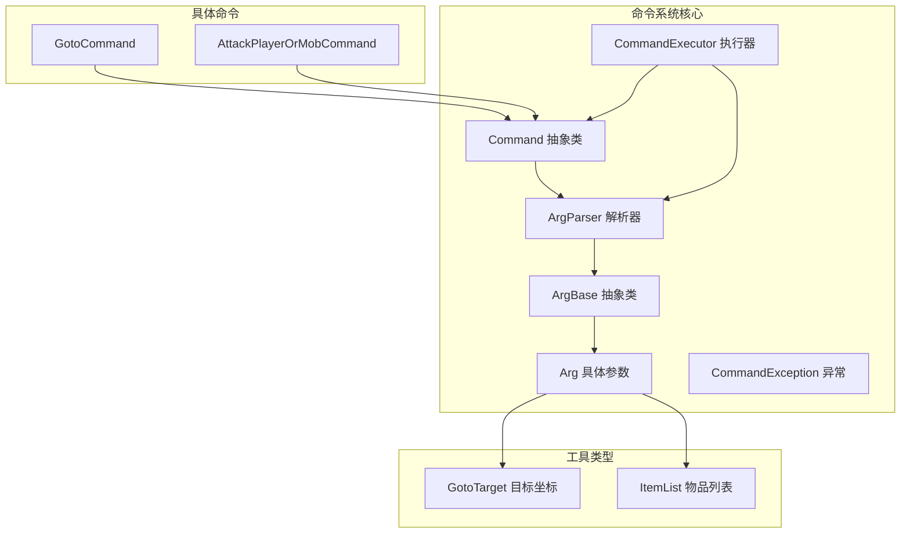
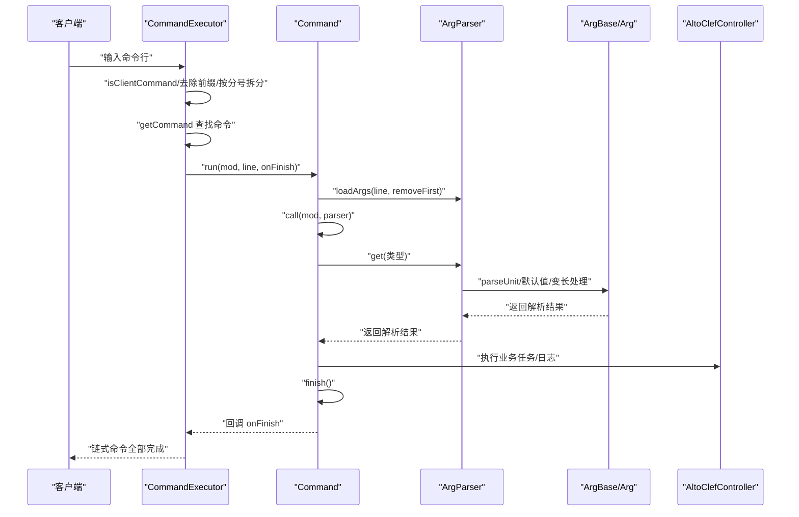
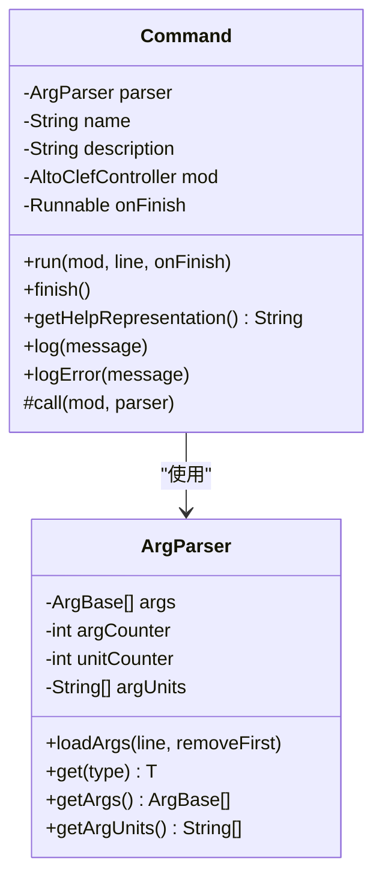
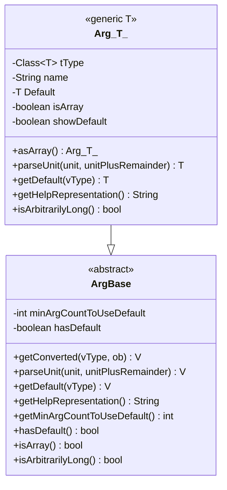
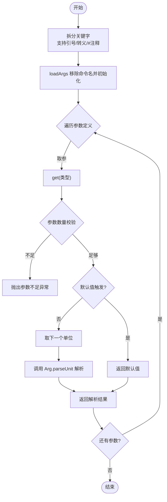
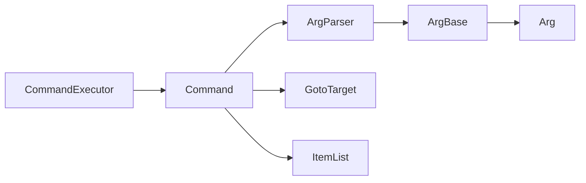

# 命令框架

<cite>
**本文引用的文件**
- [Command.java](file://src/main/java/adris/altoclef/commandsystem/Command.java)
- [ArgBase.java](file://src/main/java/adris/altoclef/commandsystem/ArgBase.java)
- [Arg.java](file://src/main/java/adris/altoclef/commandsystem/Arg.java)
- [ArgParser.java](file://src/main/java/adris/altoclef/commandsystem/ArgParser.java)
- [CommandExecutor.java](file://src/main/java/adris/altoclef/commandsystem/CommandExecutor.java)
- [CommandException.java](file://src/main/java/adris/altoclef/commandsystem/CommandException.java)
- [GotoTarget.java](file://src/main/java/adris/altoclef/commandsystem/GotoTarget.java)
- [ItemList.java](file://src/main/java/adris/altoclef/commandsystem/ItemList.java)
- [GotoCommand.java](file://src/main/java/adris/altoclef/commands/GotoCommand.java)
- [AttackPlayerOrMobCommand.java](file://src/main/java/adris/altoclef/commands/AttackPlayerOrMobCommand.java)
</cite>

## 目录
1. [简介](#简介)
2. [项目结构](#项目结构)
3. [核心组件](#核心组件)
4. [架构总览](#架构总览)
5. [详细组件分析](#详细组件分析)
6. [依赖分析](#依赖分析)
7. [性能考虑](#性能考虑)
8. [故障排查指南](#故障排查指南)
9. [结论](#结论)
10. [附录：扩展与最佳实践](#附录扩展与最佳实践)

## 简介
本文件面向“命令框架”的技术文档，系统性阐述以下主题：
- Command 基类的设计模式与抽象方法实现
- ArgParser 参数解析器的工作原理与参数验证机制
- CommandExecutor 执行器的命令调度与生命周期管理
- ArgBase 参数基类的扩展机制与具体参数类型的实现方式
- 核心接口设计、异常处理机制与日志记录系统
- 命令注册流程、命令查找算法与命令权限控制（概念性说明）
- 命令框架的扩展开发指南、自定义参数类型实现与命令执行优化技巧

## 项目结构
命令框架位于模块路径 adris/altoclef/commandsystem 下，围绕 Command、ArgBase/Arg、ArgParser、CommandExecutor 以及若干工具类型（如 GotoTarget、ItemList）构建。命令的实际业务逻辑由 commands 包中的具体命令类实现。



图示来源
- [Command.java:1-61](file://src/main/java/adris/altoclef/commandsystem/Command.java#L1-L61)
- [ArgBase.java:1-44](file://src/main/java/adris/altoclef/commandsystem/ArgBase.java#L1-L44)
- [Arg.java:1-171](file://src/main/java/adris/altoclef/commandsystem/Arg.java#L1-L171)
- [ArgParser.java:1-106](file://src/main/java/adris/altoclef/commandsystem/ArgParser.java#L1-L106)
- [CommandExecutor.java:1-121](file://src/main/java/adris/altoclef/commandsystem/CommandExecutor.java#L1-L121)
- [GotoTarget.java:1-102](file://src/main/java/adris/altoclef/commandsystem/GotoTarget.java#L1-L102)
- [ItemList.java:1-90](file://src/main/java/adris/altoclef/commandsystem/ItemList.java#L1-L90)
- [GotoCommand.java:1-66](file://src/main/java/adris/altoclef/commands/GotoCommand.java#L1-L66)
- [AttackPlayerOrMobCommand.java:1-177](file://src/main/java/adris/altoclef/commands/AttackPlayerOrMobCommand.java#L1-L177)

章节来源
- [Command.java:1-61](file://src/main/java/adris/altoclef/commandsystem/Command.java#L1-L61)
- [ArgBase.java:1-44](file://src/main/java/adris/altoclef/commandsystem/ArgBase.java#L1-L44)
- [Arg.java:1-171](file://src/main/java/adris/altoclef/commandsystem/Arg.java#L1-L171)
- [ArgParser.java:1-106](file://src/main/java/adris/altoclef/commandsystem/ArgParser.java#L1-L106)
- [CommandExecutor.java:1-121](file://src/main/java/adris/altoclef/commandsystem/CommandExecutor.java#L1-L121)
- [GotoTarget.java:1-102](file://src/main/java/adris/altoclef/commandsystem/GotoTarget.java#L1-L102)
- [ItemList.java:1-90](file://src/main/java/adris/altoclef/commandsystem/ItemList.java#L1-L90)
- [GotoCommand.java:1-66](file://src/main/java/adris/altoclef/commands/GotoCommand.java#L1-L66)
- [AttackPlayerOrMobCommand.java:1-177](file://src/main/java/adris/altoclef/commands/AttackPlayerOrMobCommand.java#L1-L177)

## 核心组件
本节对命令框架的关键类进行深入剖析，涵盖职责、数据结构、调用链路与边界条件。

- Command 抽象类
  - 职责：封装命令名称、描述、参数解析器；统一执行入口与生命周期回调；提供日志接口。
  - 关键点：构造时组合 ArgParser；run 方法负责加载参数并调用抽象方法；finish 回调用于链式命令串行结束通知。
  - 复杂度：单次执行 O(N)（N 为参数个数），解析阶段按单位线性扫描。
  - 错误处理：通过 CommandException 向上传递；日志通过 Debug 组件输出。

- ArgBase/Arg 参数体系
  - ArgBase：定义泛型转换、默认值、帮助表示、数组/可变长语义等抽象接口。
  - Arg<T>：实现具体解析逻辑，支持枚举、数值、字符串、ItemList、GotoTarget 等类型；支持默认值与最小参数阈值；支持 asArray 变长参数。
  - 复杂度：单单位解析 O(1)，整体解析 O(U)（U 为单位数）。

- ArgParser 参数解析器
  - 职责：将输入行拆分为关键字序列；按顺序从命令参数定义中取出 ArgBase 并解析；处理默认值与变长参数；维护内部指针与计数。
  - 关键点：splitLineIntoKeywords 支持引号包裹与注释截断；get 方法在越界或数量不匹配时抛出异常。
  - 复杂度：拆分 O(L)（L 为字符长度），解析 O(U)。

- CommandExecutor 执行器
  - 职责：注册命令、解析命令前缀、拆分多段命令、串行执行、异常收集与日志记录。
  - 关键点：execute 接受三种重载；executeRecursive 实现链式命令的顺序执行；getCommand 查找命令名；isClientCommand 判定是否以命令前缀开头。
  - 复杂度：注册 O(C)（C 为命令数），查找 O(1)，执行 O(S+ΣU_i)（S 为分段数，ΣU_i 为各段解析单位数之和）。

- 工具类型
  - GotoTarget：解析坐标与维度，支持 XYZ/XZ/Y/NONE 多种形态。
  - ItemList：解析物品清单，支持“名称 数量”与数组形式，并进行任务名校验与模糊匹配提示。

章节来源
- [Command.java:1-61](file://src/main/java/adris/altoclef/commandsystem/Command.java#L1-L61)
- [ArgBase.java:1-44](file://src/main/java/adris/altoclef/commandsystem/ArgBase.java#L1-L44)
- [Arg.java:1-171](file://src/main/java/adris/altoclef/commandsystem/Arg.java#L1-L171)
- [ArgParser.java:1-106](file://src/main/java/adris/altoclef/commandsystem/ArgParser.java#L1-L106)
- [CommandExecutor.java:1-121](file://src/main/java/adris/altoclef/commandsystem/CommandExecutor.java#L1-L121)
- [GotoTarget.java:1-102](file://src/main/java/adris/altoclef/commandsystem/GotoTarget.java#L1-L102)
- [ItemList.java:1-90](file://src/main/java/adris/altoclef/commandsystem/ItemList.java#L1-L90)

## 架构总览
下图展示命令框架的整体交互：客户端输入经 CommandExecutor 拆分与查找，逐条委派给 Command.run，Command.run 再委托 ArgParser 进行参数解析，最终调用命令的抽象方法完成业务处理。



图示来源
- [CommandExecutor.java:58-76](file://src/main/java/adris/altoclef/commandsystem/CommandExecutor.java#L58-L76)
- [Command.java:19-24](file://src/main/java/adris/altoclef/commandsystem/Command.java#L19-L24)
- [ArgParser.java:69-96](file://src/main/java/adris/altoclef/commandsystem/ArgParser.java#L69-L96)
- [Arg.java:151-154](file://src/main/java/adris/altoclef/commandsystem/Arg.java#L151-L154)

## 详细组件分析

### Command 类：命令生命周期与日志
- 设计要点
  - 组合 ArgParser：在构造时注入参数定义，在 run 中加载输入行。
  - 生命周期：run 设置 mod 与 onFinish，随后调用抽象方法 call 完成业务；finish 触发链式命令的下一步。
  - 日志：log/logError 通过 Debug 输出，便于统一管理。
- 边界与错误
  - 若参数不足或过多，由 ArgParser 在 get 阶段抛出 CommandException。
  - 子类通过抛出 CommandException 提供用户可读的错误信息。
- 复杂度与性能
  - 单次 run 开销主要来自解析与一次抽象调用，整体 O(N)。



图示来源
- [Command.java:6-61](file://src/main/java/adris/altoclef/commandsystem/Command.java#L6-L61)
- [ArgParser.java:6-106](file://src/main/java/adris/altoclef/commandsystem/ArgParser.java#L6-L106)

章节来源
- [Command.java:1-61](file://src/main/java/adris/altoclef/commandsystem/Command.java#L1-L61)

### ArgBase/Arg：参数基类与具体类型
- ArgBase
  - 泛型转换：getConverted 提供类型转换入口；parseUnit 通过反射获取实际类型参数后调用具体解析。
  - 默认值与帮助：getDefault、getHelpRepresentation；minArgCountToUseDefault 控制何时启用默认值。
  - 可变长：isArray/isArbitrarilyLong 标识数组与可变长参数。
- Arg<T>
  - 类型支持：枚举、数值、字符串、ItemList、GotoTarget。
  - 默认值：构造时设置 hasDefault/Default/minArgCountToUseDefault/showDefault。
  - 变长：asArray 标记数组参数，影响解析器的指针推进策略。
  - 解析：parseUnitUtil 针对不同类型进行解析；parseEnum 支持大小写不敏感的枚举匹配。
  - 校验：对非法输入抛出 CommandException，提供清晰的错误消息。



图示来源
- [ArgBase.java:5-44](file://src/main/java/adris/altoclef/commandsystem/ArgBase.java#L5-L44)
- [Arg.java:3-35](file://src/main/java/adris/altoclef/commandsystem/Arg.java#L3-L35)
- [Arg.java:54-171](file://src/main/java/adris/altoclef/commandsystem/Arg.java#L54-L171)

章节来源
- [ArgBase.java:1-44](file://src/main/java/adris/altoclef/commandsystem/ArgBase.java#L1-L44)
- [Arg.java:1-171](file://src/main/java/adris/altoclef/commandsystem/Arg.java#L1-L171)

### ArgParser：解析流程与验证
- 关键流程
  - splitLineIntoKeywords：支持引号包裹、反斜杠转义、注释截断（#）。
  - loadArgs：移除首词（命令名）、转为单位数组、重置计数器。
  - get：按序取参，检查参数个数、默认值触发、单位计数越界、变长参数推进策略。
- 验证与错误
  - 参数过多/过少、单位缺失、类型解析失败均抛出 CommandException。
  - 变长参数（如 ItemList/GotoTarget）允许剩余文本参与解析。



图示来源
- [ArgParser.java:18-55](file://src/main/java/adris/altoclef/commandsystem/ArgParser.java#L18-L55)
- [ArgParser.java:57-67](file://src/main/java/adris/altoclef/commandsystem/ArgParser.java#L57-L67)
- [ArgParser.java:69-96](file://src/main/java/adris/altoclef/commandsystem/ArgParser.java#L69-L96)

章节来源
- [ArgParser.java:1-106](file://src/main/java/adris/altoclef/commandsystem/ArgParser.java#L1-L106)

### CommandExecutor：注册、查找与执行
- 注册
  - registerNewCommand：去重注册，重复名会记录内部警告。
- 查找与前缀
  - getCommandPrefix：从 mod 设置中读取命令前缀；isClientCommand 判断输入是否以该前缀开头。
- 执行
  - execute：拆分“;”分隔的多段命令，逐段 getCommand，然后 executeRecursive 串行执行。
  - executeRecursive：递归执行，捕获 CommandException 并追加帮助信息；支持 onFinish 回调。
  - 日志：使用 Log4j 记录解析后的命令片段。

```mermaid
sequenceDiagram
participant Exec as "CommandExecutor"
participant Reg as "命令注册表"
participant Parser as "ArgParser"
participant Cmd as "Command"
Exec->>Reg : "registerNewCommand(...)"
Exec->>Exec : "execute(line)"
Exec->>Exec : "isClientCommand/getCommandPrefix"
Exec->>Exec : "split(';')"
loop 每一段
Exec->>Exec : "getCommand(命令名)"
Exec->>Cmd : "run(mod, part, 回调)"
Cmd->>Parser : "loadArgs/解析"
Cmd-->>Exec : "finish() 回调"
end
Exec-->>Exec : "全部完成/异常收集"
```

图示来源
- [CommandExecutor.java:20-28](file://src/main/java/adris/altoclef/commandsystem/CommandExecutor.java#L20-L28)
- [CommandExecutor.java:38-56](file://src/main/java/adris/altoclef/commandsystem/CommandExecutor.java#L38-L56)
- [CommandExecutor.java:58-76](file://src/main/java/adris/altoclef/commandsystem/CommandExecutor.java#L58-L76)
- [CommandExecutor.java:94-111](file://src/main/java/adris/altoclef/commandsystem/CommandExecutor.java#L94-L111)

章节来源
- [CommandExecutor.java:1-121](file://src/main/java/adris/altoclef/commandsystem/CommandExecutor.java#L1-L121)

### 工具类型：GotoTarget 与 ItemList
- GotoTarget
  - 支持“(x,y,z dim)”或“x y z dim”等多种输入格式；自动容错逗号与多余空格；枚举维度。
  - 返回坐标类型（XYZ/XZ/Y/NONE）以驱动不同移动任务。
- ItemList
  - 支持“名称 数量”与“[名称 数量, ...]”两种形式；对不存在的任务名进行模糊匹配提示。
  - 解析失败时抛出 CommandException，包含明确的错误信息。

章节来源
- [GotoTarget.java:1-102](file://src/main/java/adris/altoclef/commandsystem/GotoTarget.java#L1-L102)
- [ItemList.java:1-90](file://src/main/java/adris/altoclef/commandsystem/ItemList.java#L1-L90)

### 具体命令示例：GotoCommand 与 AttackPlayerOrMobCommand
- GotoCommand
  - 参数：一个 GotoTarget；根据目标类型选择不同移动任务；对超远距离进行安全保护，必要时改为跟随所有者。
  - 执行：调用 mod.runUserTask 执行任务，完成后 finish。
- AttackPlayerOrMobCommand
  - 参数：字符串（目标名）与整数（数量）；内部实现 AttackTask，订阅实体死亡事件统计击杀数。
  - 执行：构造并运行 AttackTask，完成后 finish。

章节来源
- [GotoCommand.java:1-66](file://src/main/java/adris/altoclef/commands/GotoCommand.java#L1-L66)
- [AttackPlayerOrMobCommand.java:1-177](file://src/main/java/adris/altoclef/commands/AttackPlayerOrMobCommand.java#L1-L177)

## 依赖分析
- 组件耦合
  - Command 依赖 ArgParser；ArgParser 依赖 ArgBase/Arg；CommandExecutor 依赖 Command 与 ArgParser。
  - 具体命令依赖 Command 与工具类型（GotoTarget、ItemList）。
- 外部依赖
  - 日志：Log4j（CommandExecutor 使用 Logger；部分命令使用 Logger 记录）。
  - 异常：CommandException 作为统一异常类型向上抛出。
- 循环依赖
  - 未发现循环依赖：CommandExecutor -> Command -> ArgParser -> ArgBase/Arg；工具类型独立。



图示来源
- [CommandExecutor.java:1-121](file://src/main/java/adris/altoclef/commandsystem/CommandExecutor.java#L1-L121)
- [Command.java:1-61](file://src/main/java/adris/altoclef/commandsystem/Command.java#L1-L61)
- [ArgParser.java:1-106](file://src/main/java/adris/altoclef/commandsystem/ArgParser.java#L1-L106)
- [ArgBase.java:1-44](file://src/main/java/adris/altoclef/commandsystem/ArgBase.java#L1-L44)
- [Arg.java:1-171](file://src/main/java/adris/altoclef/commandsystem/Arg.java#L1-L171)
- [GotoTarget.java:1-102](file://src/main/java/adris/altoclef/commandsystem/GotoTarget.java#L1-L102)
- [ItemList.java:1-90](file://src/main/java/adris/altoclef/commandsystem/ItemList.java#L1-L90)

章节来源
- [CommandExecutor.java:1-121](file://src/main/java/adris/altoclef/commandsystem/CommandExecutor.java#L1-L121)
- [Command.java:1-61](file://src/main/java/adris/altoclef/commandsystem/Command.java#L1-L61)
- [ArgParser.java:1-106](file://src/main/java/adris/altoclef/commandsystem/ArgParser.java#L1-L106)
- [ArgBase.java:1-44](file://src/main/java/adris/altoclef/commandsystem/ArgBase.java#L1-L44)
- [Arg.java:1-171](file://src/main/java/adris/altoclef/commandsystem/Arg.java#L1-L171)
- [GotoTarget.java:1-102](file://src/main/java/adris/altoclef/commandsystem/GotoTarget.java#L1-L102)
- [ItemList.java:1-90](file://src/main/java/adris/altoclef/commandsystem/ItemList.java#L1-L90)

## 性能考虑
- 解析复杂度
  - 输入拆分与解析均为线性复杂度，适合大多数命令场景。
- 变长参数
  - ItemList/GotoTarget 的 isArbitrarilyLong 使解析器能够消费剩余文本，避免额外分隔符，提升易用性。
- 执行链路
  - executeRecursive 串行执行，避免并发竞争；若需并行，可在上层业务中自行组织任务队列。
- 日志开销
  - 建议仅在关键节点记录日志，避免高频微日志影响性能。

## 故障排查指南
- 常见异常与定位
  - 参数不足/过多：检查命令帮助表示与输入；确认默认值与最小参数阈值配置。
  - 类型解析失败：核对输入格式与类型支持范围；枚举大小写不敏感但需确保拼写正确。
  - 命令不存在：确认命令已注册且名称一致；检查前缀配置。
- 日志与调试
  - CommandExecutor 使用 Log4j 记录解析片段；命令内部可使用 Logger 输出详细状态。
  - Command 提供 log/logError 接口，便于统一输出。

章节来源
- [CommandException.java:1-12](file://src/main/java/adris/altoclef/commandsystem/CommandException.java#L1-L12)
- [ArgParser.java:69-96](file://src/main/java/adris/altoclef/commandsystem/ArgParser.java#L69-L96)
- [CommandExecutor.java:73-75](file://src/main/java/adris/altoclef/commandsystem/CommandExecutor.java#L73-L75)
- [Command.java:43-49](file://src/main/java/adris/altoclef/commandsystem/Command.java#L43-L49)

## 结论
命令框架通过 Command/Arg/ArgParser/CommandExecutor 的清晰分层，实现了高内聚、低耦合的参数化命令系统。其参数解析与默认值机制、变长参数支持与严格的错误传播，使得命令易于扩展与维护。结合日志与异常机制，能够在复杂场景下保持良好的可观测性与可诊断性。

## 附录：扩展与最佳实践

### 命令注册流程
- 在控制器初始化阶段调用 CommandExecutor.registerNewCommand 注册命令。
- 命令名不可重复；重复注册会记录内部警告。

章节来源
- [CommandExecutor.java:20-28](file://src/main/java/adris/altoclef/commandsystem/CommandExecutor.java#L20-L28)

### 命令查找算法
- getCommand：按空格分割取第一个词作为命令名；若不存在则抛出异常。
- 建议：命令名应唯一且简洁；可通过 getHelpRepresentation 生成帮助信息辅助用户。

章节来源
- [CommandExecutor.java:94-111](file://src/main/java/adris/altoclef/commandsystem/CommandExecutor.java#L94-L111)

### 命令权限控制（概念性说明）
- 当前实现未内置权限控制。建议在 CommandExecutor.getCommand 或 Command.run 之前增加权限校验逻辑，例如基于玩家 UUID/角色/白名单的判定。
- 可通过 mod 层提供的上下文信息（如所有者、在线玩家列表）实现细粒度权限。

### 自定义参数类型实现步骤
- 新建类型（如 MyTarget）并实现 parseRemainder 静态解析方法。
- 在 Arg 构造时声明类型支持（若非内置类型，需在 Arg 构造中显式支持）。
- 在命令中通过 parser.get(MyTarget.class) 获取实例。
- 如需变长解析，参考 ItemList/GotoTarget 的实现方式。

章节来源
- [Arg.java:10-31](file://src/main/java/adris/altoclef/commandsystem/Arg.java#L10-L31)
- [Arg.java:151-154](file://src/main/java/adris/altoclef/commandsystem/Arg.java#L151-L154)
- [GotoTarget.java:22-69](file://src/main/java/adris/altoclef/commandsystem/GotoTarget.java#L22-L69)
- [ItemList.java:16-88](file://src/main/java/adris/altoclef/commandsystem/ItemList.java#L16-L88)

### 命令执行优化技巧
- 合理使用默认值与最小参数阈值，减少冗余输入。
- 对于需要大量资源的命令，提前进行存在性校验与容错提示，避免无效执行。
- 将长耗时任务拆分为多个短任务，利用 Command.finish 回调实现链式执行与进度反馈。
- 使用日志记录关键节点，便于问题定位与性能分析。