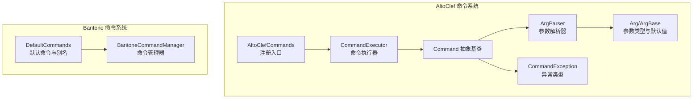
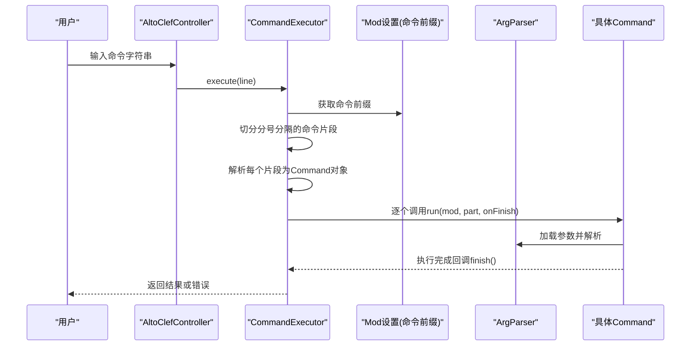
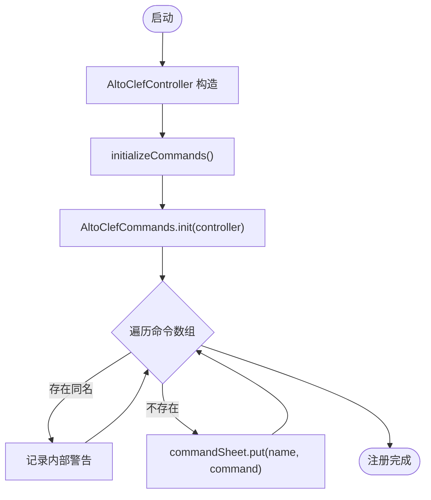
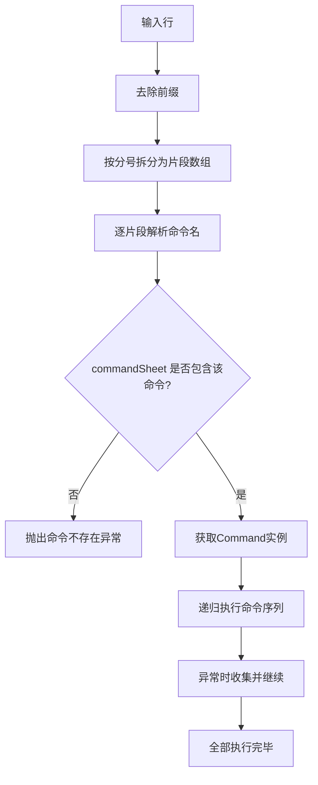
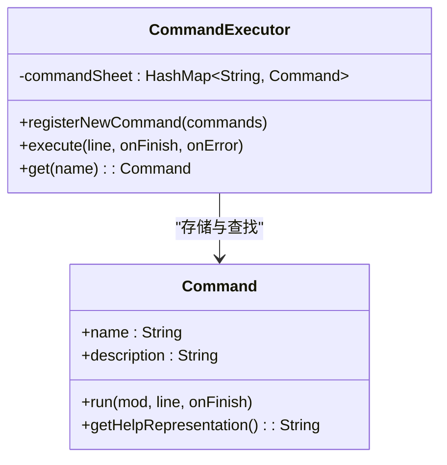
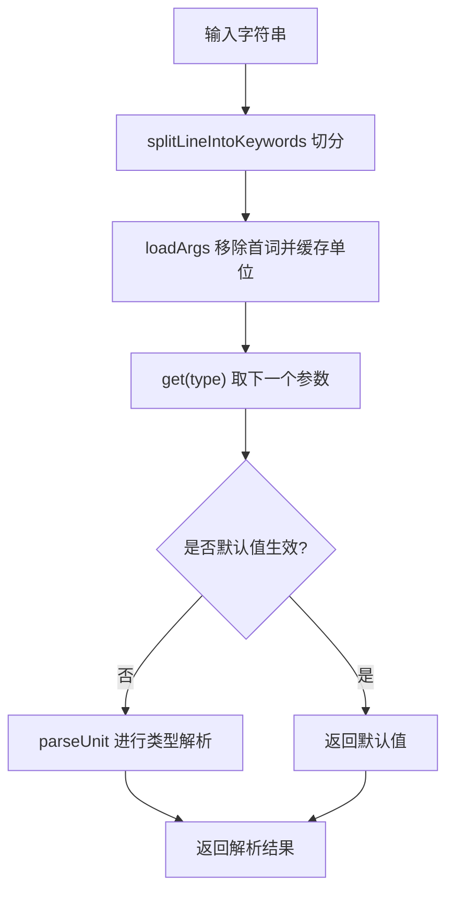
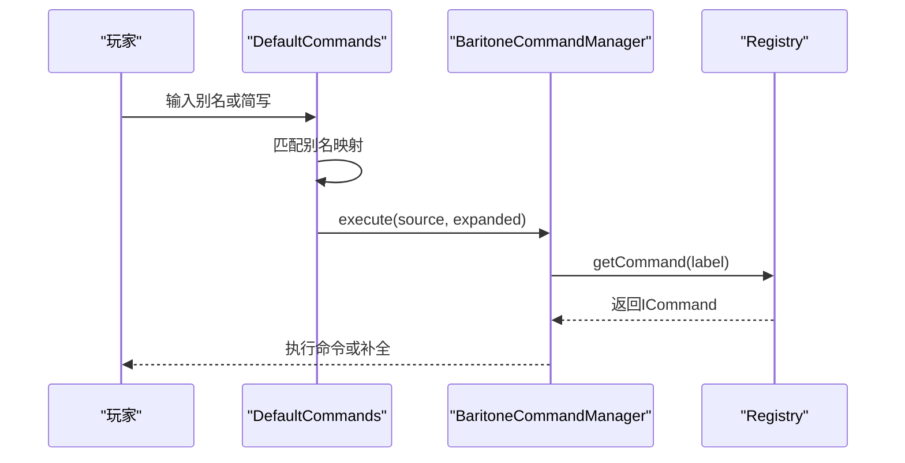
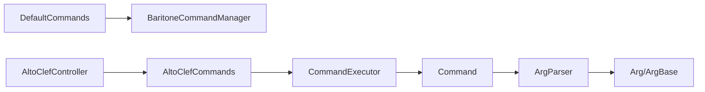

# 命令注册与管理

<cite>
**本文引用的文件**
- [AltoClefCommands.java](file://src/main/java/adris/altoclef/AltoClefCommands.java)
- [CommandExecutor.java](file://src/main/java/adris/altoclef/commandsystem/CommandExecutor.java)
- [Command.java](file://src/main/java/adris/altoclef/commandsystem/Command.java)
- [ArgParser.java](file://src/main/java/adris/altoclef/commandsystem/ArgParser.java)
- [Arg.java](file://src/main/java/adris/altoclef/commandsystem/Arg.java)
- [ArgBase.java](file://src/main/java/adris/altoclef/commandsystem/ArgBase.java)
- [CommandException.java](file://src/main/java/adris/altoclef/commandsystem/CommandException.java)
- [AltoClefController.java](file://src/main/java/adris/altoclef/AltoClefController.java)
- [GetCommand.java](file://src/main/java/adris/altoclef/commands/GetCommand.java)
- [ReloadSettingsCommand.java](file://src/main/java/adris/altoclef/commands/ReloadSettingsCommand.java)
- [BaritoneCommandManager.java](file://src/main/java/baritone/command/manager/BaritoneCommandManager.java)
- [DefaultCommands.java](file://src/main/java/baritone/command/defaults/DefaultCommands.java)
</cite>

## 目录
1. [简介](#简介)
2. [项目结构](#项目结构)
3. [核心组件](#核心组件)
4. [架构总览](#架构总览)
5. [详细组件分析](#详细组件分析)
6. [依赖分析](#依赖分析)
7. [性能考虑](#性能考虑)
8. [故障排查指南](#故障排查指南)
9. [结论](#结论)
10. [附录](#附录)

## 简介
本技术文档围绕 AltoClef 的命令注册与管理子系统展开，重点解析命令注册中心的实现机制、命令注册流程、命令查找算法、命令表数据结构、命令索引机制、冲突处理策略，以及命令权限系统、别名支持与帮助系统。同时覆盖命令动态加载、热重载与版本管理的技术细节，并提供最佳实践、性能优化建议与调试方法，帮助开发者高效地扩展与维护命令体系。

## 项目结构
AltoClef 的命令系统由两部分组成：
- 自定义命令注册中心：位于 AltoClef 命名空间下，负责注册与执行自定义命令。
- 第三方命令系统（Baritone）：通过 Fabric 命令注册回调接入，提供默认命令与别名支持。

图表来源
- [AltoClefCommands.java:29-58](file://src/main/java/adris/altoclef/AltoClefCommands.java#L29-L58)
- [CommandExecutor.java:11-121](file://src/main/java/adris/altoclef/commandsystem/CommandExecutor.java#L11-L121)
- [Command.java:6-61](file://src/main/java/adris/altoclef/commandsystem/Command.java#L6-L61)
- [ArgParser.java:6-106](file://src/main/java/adris/altoclef/commandsystem/ArgParser.java#L6-L106)
- [Arg.java:3-171](file://src/main/java/adris/altoclef/commandsystem/Arg.java#L3-L171)
- [ArgBase.java:5-44](file://src/main/java/adris/altoclef/commandsystem/ArgBase.java#L5-L44)
- [CommandException.java:3-11](file://src/main/java/adris/altoclef/commandsystem/CommandException.java#L3-L11)
- [BaritoneCommandManager.java:23-129](file://src/main/java/baritone/command/manager/BaritoneCommandManager.java#L23-L129)
- [DefaultCommands.java:40-197](file://src/main/java/baritone/command/defaults/DefaultCommands.java#L40-L197)

章节来源
- [AltoClefCommands.java:29-58](file://src/main/java/adris/altoclef/AltoClefCommands.java#L29-L58)
- [CommandExecutor.java:11-121](file://src/main/java/adris/altoclef/commandsystem/CommandExecutor.java#L11-L121)
- [BaritoneCommandManager.java:23-129](file://src/main/java/baritone/command/manager/BaritoneCommandManager.java#L23-L129)
- [DefaultCommands.java:40-197](file://src/main/java/baritone/command/defaults/DefaultCommands.java#L40-L197)

## 核心组件
- 命令注册中心：AltoClefCommands 负责在启动时集中注册所有自定义命令到 CommandExecutor。
- 命令执行器：CommandExecutor 维护命令表（HashMap），提供注册、前缀识别、命令拆分、递归执行与错误处理。
- 命令抽象：Command 定义命令名称、描述、参数解析器与执行流程；派生类实现具体业务逻辑。
- 参数系统：ArgParser 将输入按空格与引号规则切分为“关键字单元”，Arg/ArgBase 提供类型转换、默认值与帮助表示。
- 异常模型：CommandException 统一承载命令执行期错误，便于上抛与提示。
- 控制器集成：AltoClefController 在初始化阶段调用注册入口，并持有 CommandExecutor 实例。
- 第三方命令：BaritoneCommandManager 与 DefaultCommands 提供权限控制、别名与 Fabric 命令注册。

章节来源
- [AltoClefCommands.java:29-58](file://src/main/java/adris/altoclef/AltoClefCommands.java#L29-L58)
- [CommandExecutor.java:11-121](file://src/main/java/adris/altoclef/commandsystem/CommandExecutor.java#L11-L121)
- [Command.java:6-61](file://src/main/java/adris/altoclef/commandsystem/Command.java#L6-L61)
- [ArgParser.java:6-106](file://src/main/java/adris/altoclef/commandsystem/ArgParser.java#L6-L106)
- [Arg.java:3-171](file://src/main/java/adris/altoclef/commandsystem/Arg.java#L3-L171)
- [ArgBase.java:5-44](file://src/main/java/adris/altoclef/commandsystem/ArgBase.java#L5-L44)
- [CommandException.java:3-11](file://src/main/java/adris/altoclef/commandsystem/CommandException.java#L3-L11)
- [AltoClefController.java:53-134](file://src/main/java/adris/altoclef/AltoClefController.java#L53-L134)
- [BaritoneCommandManager.java:23-129](file://src/main/java/baritone/command/manager/BaritoneCommandManager.java#L23-L129)
- [DefaultCommands.java:40-197](file://src/main/java/baritone/command/defaults/DefaultCommands.java#L40-L197)

## 架构总览
命令从输入到执行的关键路径如下：

图表来源
- [CommandExecutor.java:58-111](file://src/main/java/adris/altoclef/commandsystem/CommandExecutor.java#L58-L111)
- [Command.java:19-31](file://src/main/java/adris/altoclef/commandsystem/Command.java#L19-L31)
- [ArgParser.java:57-96](file://src/main/java/adris/altoclef/commandsystem/ArgParser.java#L57-L96)

章节来源
- [CommandExecutor.java:58-111](file://src/main/java/adris/altoclef/commandsystem/CommandExecutor.java#L58-L111)
- [Command.java:19-31](file://src/main/java/adris/altoclef/commandsystem/Command.java#L19-L31)
- [ArgParser.java:57-96](file://src/main/java/adris/altoclef/commandsystem/ArgParser.java#L57-L96)

## 详细组件分析

### 命令注册中心与注册流程
- 注册入口：AltoClefCommands.init 接收控制器实例，调用 CommandExecutor.registerNewCommand 注册一组命令。
- 注册行为：CommandExecutor 对传入命令逐一检查是否已存在同名命令，若重复则记录内部日志，避免覆盖。
- 初始化时机：AltoClefController 在构造函数中调用 initializeCommands，进而触发 AltoClefCommands.init。

图表来源
- [AltoClefCommands.java:30-56](file://src/main/java/adris/altoclef/AltoClefCommands.java#L30-L56)
- [CommandExecutor.java:20-28](file://src/main/java/adris/altoclef/commandsystem/CommandExecutor.java#L20-L28)
- [AltoClefController.java:195-200](file://src/main/java/adris/altoclef/AltoClefController.java#L195-L200)

章节来源
- [AltoClefCommands.java:30-56](file://src/main/java/adris/altoclef/AltoClefCommands.java#L30-L56)
- [CommandExecutor.java:20-28](file://src/main/java/adris/altoclef/commandsystem/CommandExecutor.java#L20-L28)
- [AltoClefController.java:195-200](file://src/main/java/adris/altoclef/AltoClefController.java#L195-L200)

### 命令查找与执行算法
- 前缀识别：CommandExecutor.isClientCommand 依据 Mod 设置中的命令前缀判断是否为客户端命令。
- 命令拆分：以分号分隔多段命令，每段独立解析。
- 查找策略：对每段命令，提取首词作为命令名，从 commandSheet 中查找对应 Command 实例。
- 递归执行：executeRecursive 顺序执行各段命令，异常时收集错误并继续后续命令。
- 错误处理：捕获 CommandException 并拼接帮助信息后上抛。

图表来源
- [CommandExecutor.java:58-111](file://src/main/java/adris/altoclef/commandsystem/CommandExecutor.java#L58-L111)

章节来源
- [CommandExecutor.java:58-111](file://src/main/java/adris/altoclef/commandsystem/CommandExecutor.java#L58-L111)

### 命令表数据结构与索引机制
- 数据结构：commandSheet 使用 HashMap<String, Command> 存储命令名到命令对象的映射。
- 时间复杂度：查找、插入平均 O(1)，冲突场景下退化为 O(n)。
- 冲突处理：注册阶段检测重复键，记录内部警告并跳过重复注册，保证唯一性。

图表来源
- [CommandExecutor.java:11-121](file://src/main/java/adris/altoclef/commandsystem/CommandExecutor.java#L11-L121)
- [Command.java:6-61](file://src/main/java/adris/altoclef/commandsystem/Command.java#L6-L61)

章节来源
- [CommandExecutor.java:11-121](file://src/main/java/adris/altoclef/commandsystem/CommandExecutor.java#L11-L121)
- [Command.java:6-61](file://src/main/java/adris/altoclef/commandsystem/Command.java#L6-L61)

### 命令参数解析与帮助系统
- 关键字切分：ArgParser.splitLineIntoKeywords 支持引号包裹与转义字符，遇到“#”停止解析。
- 参数消费：ArgParser.get 逐个消费参数，支持默认值、数组参数与最小参数阈值。
- 类型转换：Arg/ArgBase 提供枚举、数值、字符串、ItemList、GotoTarget 等类型解析与校验。
- 帮助表示：Command.getHelpRepresentation 拼接命令名与参数占位符，用于错误提示与帮助展示。

图表来源
- [ArgParser.java:18-96](file://src/main/java/adris/altoclef/commandsystem/ArgParser.java#L18-L96)
- [Arg.java:97-154](file://src/main/java/adris/altoclef/commandsystem/Arg.java#L97-L154)
- [ArgBase.java:9-22](file://src/main/java/adris/altoclef/commandsystem/ArgBase.java#L9-L22)
- [Command.java:32-41](file://src/main/java/adris/altoclef/commandsystem/Command.java#L32-L41)

章节来源
- [ArgParser.java:18-96](file://src/main/java/adris/altoclef/commandsystem/ArgParser.java#L18-L96)
- [Arg.java:97-154](file://src/main/java/adris/altoclef/commandsystem/Arg.java#L97-L154)
- [ArgBase.java:9-22](file://src/main/java/adris/altoclef/commandsystem/ArgBase.java#L9-L22)
- [Command.java:32-41](file://src/main/java/adris/altoclef/commandsystem/Command.java#L32-L41)

### 权限系统与命令别名支持
- 权限控制：DefaultCommands 在注册根命令时要求最低权限等级，确保仅具备权限的玩家可使用。
- 别名支持：DefaultCommands 提供 CommandAlias，将简短命令映射到完整命令序列，提升易用性。
- 命令前缀：AltoClef 的命令通过 CommandExecutor.getCommandPrefix 读取 Mod 设置中的前缀，统一识别与执行。

图表来源
- [DefaultCommands.java:40-197](file://src/main/java/baritone/command/defaults/DefaultCommands.java#L40-L197)
- [BaritoneCommandManager.java:40-74](file://src/main/java/baritone/command/manager/BaritoneCommandManager.java#L40-L74)

章节来源
- [DefaultCommands.java:40-197](file://src/main/java/baritone/command/defaults/DefaultCommands.java#L40-L197)
- [BaritoneCommandManager.java:40-74](file://src/main/java/baritone/command/manager/BaritoneCommandManager.java#L40-L74)

### 命令帮助系统实现
- 帮助生成：Command.getHelpRepresentation 基于参数定义生成命令帮助文本，包含必填/可选参数与默认值展示。
- 错误提示：CommandExecutor 在捕获 CommandException 后，拼接当前命令的帮助信息，便于用户修正。

章节来源
- [Command.java:32-41](file://src/main/java/adris/altoclef/commandsystem/Command.java#L32-L41)
- [CommandExecutor.java:52-54](file://src/main/java/adris/altoclef/commandsystem/CommandExecutor.java#L52-L54)

### 动态加载、热重载与版本管理
- 动态加载：通过注册入口集中注册命令，可在运行时新增命令类并重新调用注册入口。
- 热重载：ReloadSettingsCommand 提供设置重载能力，结合控制器的设置变更回调，可实现部分状态的即时更新。
- 版本管理：建议在注册入口处引入版本标记与兼容性检查，避免跨版本命令不兼容导致的崩溃。

章节来源
- [AltoClefCommands.java:30-56](file://src/main/java/adris/altoclef/AltoClefCommands.java#L30-L56)
- [ReloadSettingsCommand.java:8-19](file://src/main/java/adris/altoclef/commands/ReloadSettingsCommand.java#L8-L19)
- [AltoClefController.java:113-127](file://src/main/java/adris/altoclef/AltoClefController.java#L113-L127)

### 典型命令实现示例
- GetCommand：演示了参数解析、库存检查、任务调度与完成回调的典型流程。
- ReloadSettingsCommand：展示了设置重载与日志输出的最小实现。

章节来源
- [GetCommand.java:15-68](file://src/main/java/adris/altoclef/commands/GetCommand.java#L15-L68)
- [ReloadSettingsCommand.java:8-19](file://src/main/java/adris/altoclef/commands/ReloadSettingsCommand.java#L8-L19)

## 依赖分析
- 组件耦合：CommandExecutor 与 Command 之间为松耦合，通过接口式命令对象进行交互；ArgParser 与 Arg/ArgBase 形成参数解析层。
- 外部依赖：BaritoneCommandManager 依赖第三方命令框架与 Fabric 命令注册回调；DefaultCommands 依赖全局设置与命令注册表。
- 循环依赖：未发现直接循环依赖；命令注册与执行链路清晰。

图表来源
- [CommandExecutor.java:11-121](file://src/main/java/adris/altoclef/commandsystem/CommandExecutor.java#L11-L121)
- [Command.java:6-61](file://src/main/java/adris/altoclef/commandsystem/Command.java#L6-L61)
- [ArgParser.java:6-106](file://src/main/java/adris/altoclef/commandsystem/ArgParser.java#L6-L106)
- [Arg.java:3-171](file://src/main/java/adris/altoclef/commandsystem/Arg.java#L3-L171)
- [ArgBase.java:5-44](file://src/main/java/adris/altoclef/commandsystem/ArgBase.java#L5-L44)
- [DefaultCommands.java:40-197](file://src/main/java/baritone/command/defaults/DefaultCommands.java#L40-L197)
- [BaritoneCommandManager.java:23-129](file://src/main/java/baritone/command/manager/BaritoneCommandManager.java#L23-L129)
- [AltoClefCommands.java:29-58](file://src/main/java/adris/altoclef/AltoClefCommands.java#L29-L58)
- [AltoClefController.java:53-134](file://src/main/java/adris/altoclef/AltoClefController.java#L53-L134)

章节来源
- [CommandExecutor.java:11-121](file://src/main/java/adris/altoclef/commandsystem/CommandExecutor.java#L11-L121)
- [Command.java:6-61](file://src/main/java/adris/altoclef/commandsystem/Command.java#L6-L61)
- [ArgParser.java:6-106](file://src/main/java/adris/altoclef/commandsystem/ArgParser.java#L6-L106)
- [Arg.java:3-171](file://src/main/java/adris/altoclef/commandsystem/Arg.java#L3-L171)
- [ArgBase.java:5-44](file://src/main/java/adris/altoclef/commandsystem/ArgBase.java#L5-L44)
- [DefaultCommands.java:40-197](file://src/main/java/baritone/command/defaults/DefaultCommands.java#L40-L197)
- [BaritoneCommandManager.java:23-129](file://src/main/java/baritone/command/manager/BaritoneCommandManager.java#L23-L129)
- [AltoClefCommands.java:29-58](file://src/main/java/adris/altoclef/AltoClefCommands.java#L29-L58)
- [AltoClefController.java:53-134](file://src/main/java/adris/altoclef/AltoClefController.java#L53-L134)

## 性能考虑
- 命令表查询：HashMap 查找为 O(1)，建议避免命令名过长或频繁注册/注销导致的内存抖动。
- 参数解析：ArgParser 的 splitLineIntoKeywords 为线性扫描，注意大量引号与转义字符时的开销。
- 递归执行：executeRecursive 顺序串行执行，若需并行可引入任务队列与并发控制（需谨慎处理副作用）。
- 日志与异常：CommandExecutor 记录解析日志与错误堆栈，生产环境建议降低日志级别或按需输出。

## 故障排查指南
- 命令不存在：当命令名不在 commandSheet 中时会抛出 CommandException，检查命令名大小写与拼写。
- 参数不足：ArgParser.get 抛出“参数不足”异常，确认命令帮助信息与实际输入一致。
- 类型解析失败：Arg.parseUnit 针对不同类型进行解析，检查输入格式与类型约束。
- 冲突覆盖：重复注册同名命令会被忽略并记录内部警告，避免覆盖已有命令。
- 权限不足：第三方命令需要满足最低权限等级，检查玩家权限与命令前缀设置。

章节来源
- [CommandExecutor.java:103-107](file://src/main/java/adris/altoclef/commandsystem/CommandExecutor.java#L103-L107)
- [ArgParser.java:69-96](file://src/main/java/adris/altoclef/commandsystem/ArgParser.java#L69-L96)
- [Arg.java:97-154](file://src/main/java/adris/altoclef/commandsystem/Arg.java#L97-L154)
- [CommandExecutor.java:22-27](file://src/main/java/adris/altoclef/commandsystem/CommandExecutor.java#L22-L27)
- [DefaultCommands.java:163-177](file://src/main/java/baritone/command/defaults/DefaultCommands.java#L163-L177)

## 结论
AltoClef 的命令注册与管理子系统以简洁的 HashMap 命令表为核心，配合 CommandExecutor 的前缀识别、命令拆分与递归执行，实现了稳定高效的命令处理流程。参数解析器与帮助系统提供了良好的用户体验与可维护性。通过与 Baritone 的命令系统集成，进一步增强了权限控制与别名支持。建议在扩展新命令时遵循统一的注册模式、完善的参数定义与错误处理，以保障系统的稳定性与可演进性。

## 附录
- 最佳实践
  - 命令命名：保持命令名简洁、语义明确，避免与第三方命令冲突。
  - 参数设计：优先使用 Arg 的默认值与最小参数阈值，减少用户输入负担。
  - 错误处理：在命令实现中捕获并包装 CommandException，提供上下文帮助信息。
  - 动态扩展：通过注册入口集中管理命令生命周期，便于热重载与版本升级。
- 调试方法
  - 启用内部日志：关注命令重复注册与解析失败的日志提示。
  - 使用帮助输出：通过 getHelpRepresentation 快速核对命令签名。
  - 分步执行：利用分号分隔的复合命令定位问题片段。