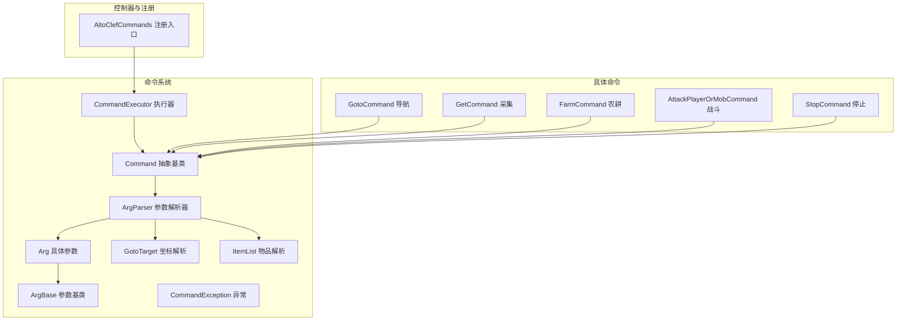
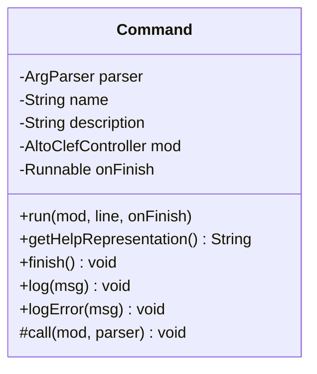
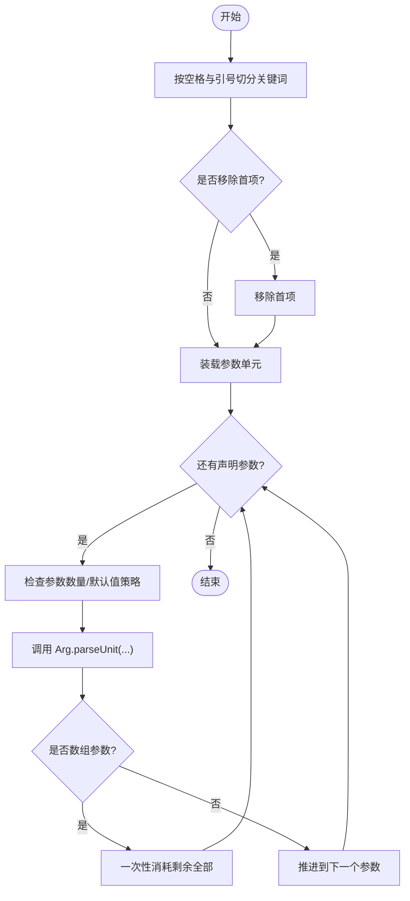
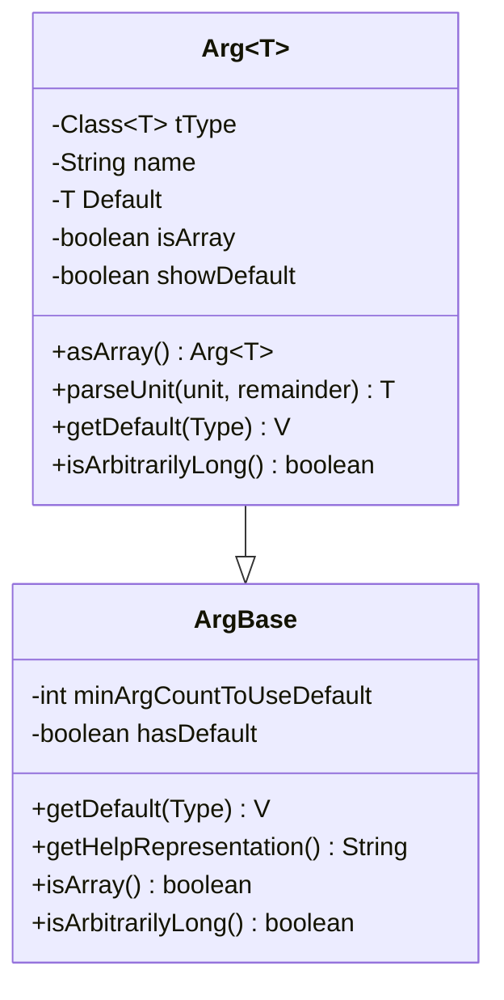
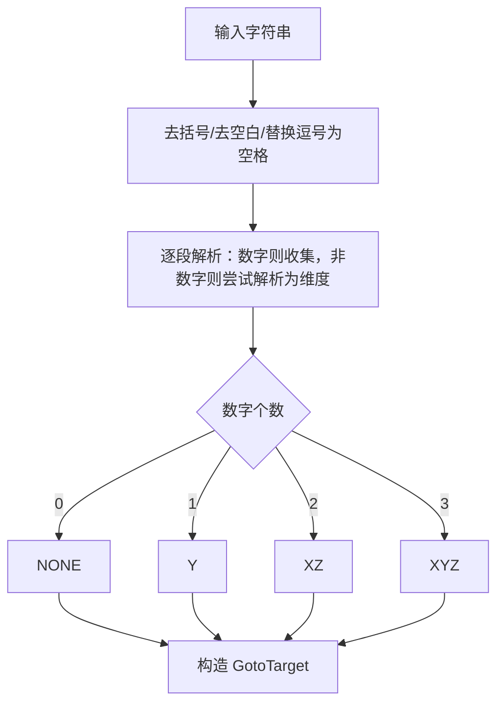
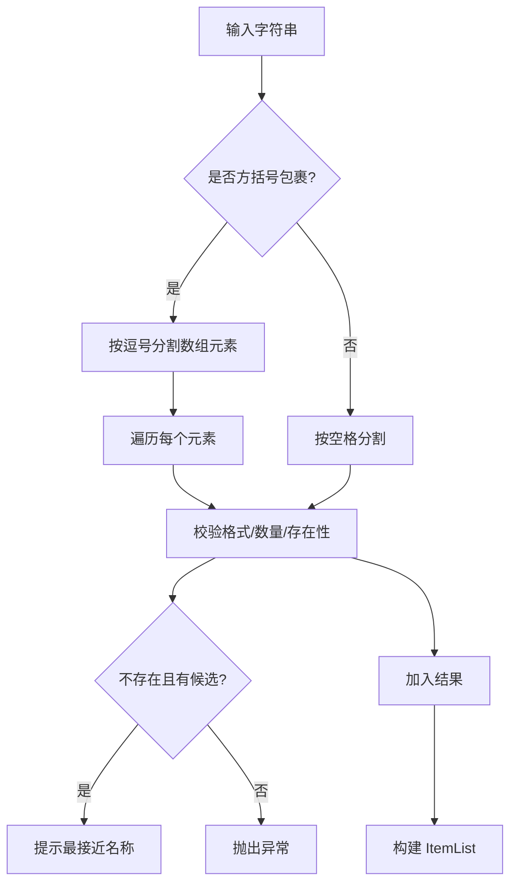
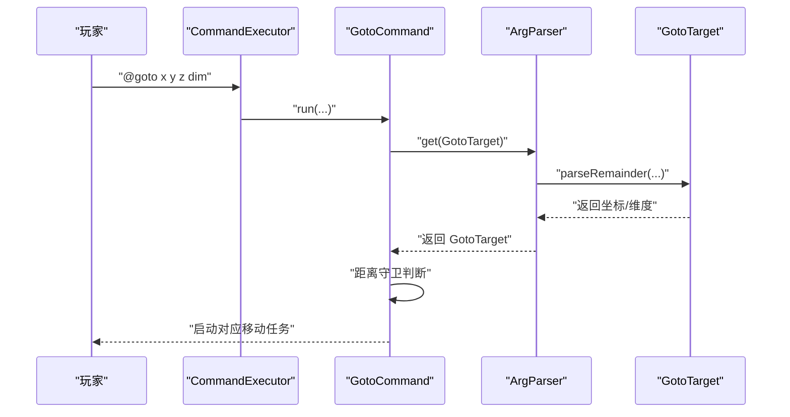
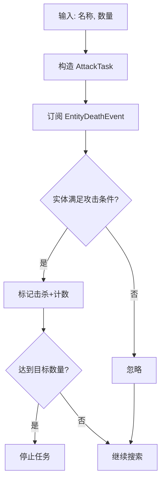
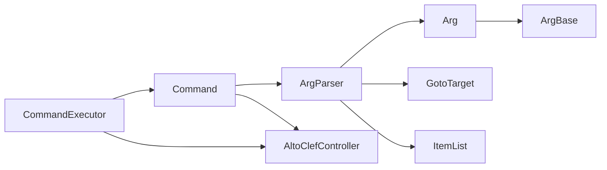

# 命令系统

<cite>
**本文引用的文件**
- [Command.java](file://src/main/java/adris/altoclef/commandsystem/Command.java)
- [ArgParser.java](file://src/main/java/adris/altoclef/commandsystem/ArgParser.java)
- [CommandExecutor.java](file://src/main/java/adris/altoclef/commandsystem/CommandExecutor.java)
- [ArgBase.java](file://src/main/java/adris/altoclef/commandsystem/ArgBase.java)
- [Arg.java](file://src/main/java/adris/altoclef/commandsystem/Arg.java)
- [GotoTarget.java](file://src/main/java/adris/altoclef/commandsystem/GotoTarget.java)
- [ItemList.java](file://src/main/java/adris/altoclef/commandsystem/ItemList.java)
- [CommandException.java](file://src/main/java/adris/altoclef/commandsystem/CommandException.java)
- [AltoClefCommands.java](file://src/main/java/adris/altoclef/AltoClefCommands.java)
- [GotoCommand.java](file://src/main/java/adris/altoclef/commands/GotoCommand.java)
- [FarmCommand.java](file://src/main/java/adris/altoclef/commands/FarmCommand.java)
- [AttackPlayerOrMobCommand.java](file://src/main/java/adris/altoclef/commands/AttackPlayerOrMobCommand.java)
- [GetCommand.java](file://src/main/java/adris/altoclef/commands/GetCommand.java)
- [StopCommand.java](file://src/main/java/adris/altoclef/commands/StopCommand.java)
</cite>

## 目录
1. [简介](#简介)
2. [项目结构](#项目结构)
3. [核心组件](#核心组件)
4. [架构总览](#架构总览)
5. [详细组件分析](#详细组件分析)
6. [依赖分析](#依赖分析)
7. [性能考虑](#性能考虑)
8. [故障排查指南](#故障排查指南)
9. [结论](#结论)
10. [附录](#附录)

## 简介
本文件面向命令系统的技术文档，系统性阐述命令基类设计模式、参数解析器工作机制与命令执行器实现机制，并结合导航、采集、战斗等具体命令示例，给出参数解析规则、命令注册机制、扩展开发方式、权限控制建议、调试技巧、错误处理与性能优化建议。

## 项目结构
命令系统位于模块内独立的命令子系统中，核心由命令基类、参数解析器、参数基类、目标坐标与物品列表解析器、以及命令执行器组成；同时在控制器层集中注册并对外暴露命令入口。



图表来源
- [Command.java:1-61](file://src/main/java/adris/altoclef/commandsystem/Command.java#L1-L61)
- [ArgBase.java:1-44](file://src/main/java/adris/altoclef/commandsystem/ArgBase.java#L1-L44)
- [Arg.java:1-171](file://src/main/java/adris/altoclef/commandsystem/Arg.java#L1-L171)
- [ArgParser.java:1-106](file://src/main/java/adris/altoclef/commandsystem/ArgParser.java#L1-L106)
- [CommandExecutor.java:1-121](file://src/main/java/adris/altoclef/commandsystem/CommandExecutor.java#L1-L121)
- [GotoTarget.java:1-102](file://src/main/java/adris/altoclef/commandsystem/GotoTarget.java#L1-L102)
- [ItemList.java:1-90](file://src/main/java/adris/altoclef/commandsystem/ItemList.java#L1-L90)
- [AltoClefCommands.java:1-59](file://src/main/java/adris/altoclef/AltoClefCommands.java#L1-L59)
- [GotoCommand.java:1-66](file://src/main/java/adris/altoclef/commands/GotoCommand.java#L1-L66)
- [GetCommand.java:1-81](file://src/main/java/adris/altoclef/commands/GetCommand.java#L1-L81)
- [FarmCommand.java:1-29](file://src/main/java/adris/altoclef/commands/FarmCommand.java#L1-L29)
- [AttackPlayerOrMobCommand.java:1-177](file://src/main/java/adris/altoclef/commands/AttackPlayerOrMobCommand.java#L1-L177)
- [StopCommand.java:1-18](file://src/main/java/adris/altoclef/commands/StopCommand.java#L1-L18)

章节来源
- [AltoClefCommands.java:29-58](file://src/main/java/adris/altoclef/AltoClefCommands.java#L29-L58)

## 核心组件
- 命令基类 Command：定义命令生命周期（初始化、参数装载、回调执行）、帮助信息生成、日志输出与完成回调。
- 参数解析器 ArgParser：负责将原始字符串按空格与引号切分为“关键字单元”，并按声明顺序从左到右消费参数，支持默认值、数组参数、越界检查与错误提示。
- 参数基类 ArgBase 与具体参数 Arg<T>：定义参数的类型约束、默认值策略、帮助表示、任意长度参数（如坐标、物品列表）与类型转换。
- 目标坐标解析器 GotoTarget：解析形如“(x y z)”或“x y z dim”的坐标串，自动容错逗号分隔与多余空白。
- 物品列表解析器 ItemList：解析单个物品或物品数组，支持数量指定与模糊匹配提示。
- 命令执行器 CommandExecutor：注册命令、识别前缀、拆分多段命令、串行执行、异常包装与统一处理。
- 命令异常 CommandException：统一的命令错误类型，便于上抛与日志记录。

章节来源
- [Command.java:6-61](file://src/main/java/adris/altoclef/commandsystem/Command.java#L6-L61)
- [ArgParser.java:6-106](file://src/main/java/adris/altoclef/commandsystem/ArgParser.java#L6-L106)
- [ArgBase.java:5-44](file://src/main/java/adris/altoclef/commandsystem/ArgBase.java#L5-L44)
- [Arg.java:3-171](file://src/main/java/adris/altoclef/commandsystem/Arg.java#L3-L171)
- [GotoTarget.java:7-102](file://src/main/java/adris/altoclef/commandsystem/GotoTarget.java#L7-L102)
- [ItemList.java:9-90](file://src/main/java/adris/altoclef/commandsystem/ItemList.java#L9-L90)
- [CommandExecutor.java:11-121](file://src/main/java/adris/altoclef/commandsystem/CommandExecutor.java#L11-L121)
- [CommandException.java:3-12](file://src/main/java/adris/altoclef/commandsystem/CommandException.java#L3-L12)

## 架构总览
命令系统采用“命令基类 + 参数解析器 + 执行器”的分层设计，命令通过注册入口集中注册，执行时按前缀识别、按分号拆分多段、逐条串行执行，每条命令内部再按参数声明顺序解析。

```mermaid
sequenceDiagram
participant U as "调用方"
participant CE as "CommandExecutor"
participant C as "Command"
participant P as "ArgParser"
participant A as "Arg/ArgBase"
U->>CE : "execute(line)"
CE->>CE : "isClientCommand()/getCommandPrefix()"
CE->>CE : "split(';')"
loop 多段命令
CE->>CE : "getCommand(name)"
CE->>C : "run(mod, part, onFinish)"
C->>P : "loadArgs(line, removeFirst)"
C->>C : "call(mod, parser)"
C->>P : "get(Type)"
P->>A : "parseUnit(...)"
A-->>P : "解析结果"
P-->>C : "返回参数"
C-->>U : "finish() 回调"
end
```

图表来源
- [CommandExecutor.java:58-76](file://src/main/java/adris/altoclef/commandsystem/CommandExecutor.java#L58-L76)
- [Command.java:19-24](file://src/main/java/adris/altoclef/commandsystem/Command.java#L19-L24)
- [ArgParser.java:57-96](file://src/main/java/adris/altoclef/commandsystem/ArgParser.java#L57-L96)
- [Arg.java:151-154](file://src/main/java/adris/altoclef/commandsystem/Arg.java#L151-L154)

## 详细组件分析

### 命令基类 Command 的设计模式
- 生命周期管理：run(...) 负责装载参数并触发抽象回调 call(...)，完成后通过 finish() 回调通知执行器继续下一段命令。
- 帮助信息：getHelpRepresentation() 将命令名与各参数的“帮助表示”拼接，用于错误提示与帮助展示。
- 日志与错误：log/logError 统一输出消息与错误，便于调试与用户反馈。
- 设计要点：将“参数装载”与“业务执行”解耦，便于复用与测试。



图表来源
- [Command.java:6-61](file://src/main/java/adris/altoclef/commandsystem/Command.java#L6-L61)

章节来源
- [Command.java:13-24](file://src/main/java/adris/altoclef/commandsystem/Command.java#L13-L24)
- [Command.java:32-41](file://src/main/java/adris/altoclef/commandsystem/Command.java#L32-L41)
- [Command.java:43-49](file://src/main/java/adris/altoclef/commandsystem/Command.java#L43-L49)

### 参数解析器 ArgParser 的工作原理
- 关键词切分：支持双引号包裹与反斜杠转义，注释以“#”开头终止，避免误解析。
- 参数消费：按声明顺序从左到右消费，支持“数组参数”一次性消耗剩余所有单位，以及“默认值策略”在参数不足时回退。
- 错误处理：参数过多/过少、类型解析失败、枚举值不合法均抛出 CommandException，便于上层包装与提示。



图表来源
- [ArgParser.java:18-55](file://src/main/java/adris/altoclef/commandsystem/ArgParser.java#L18-L55)
- [ArgParser.java:57-96](file://src/main/java/adris/altoclef/commandsystem/ArgParser.java#L57-L96)
- [Arg.java:97-149](file://src/main/java/adris/altoclef/commandsystem/Arg.java#L97-L149)

章节来源
- [ArgParser.java:57-96](file://src/main/java/adris/altoclef/commandsystem/ArgParser.java#L57-L96)
- [Arg.java:25-35](file://src/main/java/adris/altoclef/commandsystem/Arg.java#L25-L35)

### 参数基类与具体参数 Arg<T>
- 类型约束：仅允许 String、数值类型、枚举、ItemList、GotoTarget 等已实现的类型；其他类型会直接抛出异常，防止未定义解析路径。
- 默认值策略：可设置最小参数数量阈值，在参数不足时自动使用默认值；help 表示可选择是否显示默认值。
- 数组参数：asArray() 标记后一次性消耗剩余全部参数，适用于“坐标、物品列表”等可变长输入。
- 任意长度参数：GotoTarget、ItemList 标记为“任意长度”，允许传入更灵活的表达式。



图表来源
- [ArgBase.java:5-44](file://src/main/java/adris/altoclef/commandsystem/ArgBase.java#L5-L44)
- [Arg.java:3-171](file://src/main/java/adris/altoclef/commandsystem/Arg.java#L3-L171)

章节来源
- [ArgBase.java:19-22](file://src/main/java/adris/altoclef/commandsystem/ArgBase.java#L19-L22)
- [Arg.java:54-75](file://src/main/java/adris/altoclef/commandsystem/Arg.java#L54-L75)
- [Arg.java:167-169](file://src/main/java/adris/altoclef/commandsystem/Arg.java#L167-L169)

### 目标坐标解析器 GotoTarget
- 支持多种输入形式：括号包裹、空格分隔、逗号分隔；自动去除多余空白。
- 解析维度：最后一个非数字片段被解析为维度枚举；否则视为仅坐标。
- 坐标类型：根据解析到的数字个数推断 XYZ/XZ/Y/NONE，分别映射到不同移动任务。



图表来源
- [GotoTarget.java:22-69](file://src/main/java/adris/altoclef/commandsystem/GotoTarget.java#L22-L69)

章节来源
- [GotoTarget.java:22-69](file://src/main/java/adris/altoclef/commandsystem/GotoTarget.java#L22-L69)

### 物品列表解析器 ItemList
- 单物品：名称与可选数量；数量解析失败将报错。
- 物品数组：支持“[item1 count1, item2 count2, ...]”或空格分隔；每个元素校验格式与存在性。
- 模糊匹配：当名称不在目录中时，尝试基于有效名称集合进行模糊匹配并提示最接近的名称。



图表来源
- [ItemList.java:16-88](file://src/main/java/adris/altoclef/commandsystem/ItemList.java#L16-L88)

章节来源
- [ItemList.java:16-88](file://src/main/java/adris/altoclef/commandsystem/ItemList.java#L16-L88)

### 命令执行器 CommandExecutor 的实现机制
- 命令注册：注册时检查重名并记录；提供查询与遍历接口。
- 前缀识别：读取配置前缀，识别客户端命令。
- 多段执行：以分号拆分命令，逐条查找命令并串行执行；异常包装并在每段失败时继续后续命令。
- 统一处理：提供多种 execute(...) 重载，支持回调与异常消费者。

```mermaid
sequenceDiagram
participant CE as "CommandExecutor"
participant M as "Mod(控制器)"
participant MAP as "命令表"
participant C as "Command"
CE->>CE : "isClientCommand(line)"
CE->>CE : "prefix + split(';')"
loop 遍历命令片段
CE->>MAP : "getCommand(name)"
alt 找到命令
CE->>C : "run(mod, part, onFinish)"
C-->>CE : "finish() 回调"
else 未找到命令
CE-->>CE : "抛出异常并继续"
end
end
```

图表来源
- [CommandExecutor.java:38-56](file://src/main/java/adris/altoclef/commandsystem/CommandExecutor.java#L38-L56)
- [CommandExecutor.java:94-111](file://src/main/java/adris/altoclef/commandsystem/CommandExecutor.java#L94-L111)

章节来源
- [CommandExecutor.java:20-28](file://src/main/java/adris/altoclef/commandsystem/CommandExecutor.java#L20-L28)
- [CommandExecutor.java:58-76](file://src/main/java/adris/altoclef/commandsystem/CommandExecutor.java#L58-L76)

### 具体命令实现示例

#### 导航命令 GotoCommand
- 参数：GotoTarget（支持多种坐标/维度组合）
- 逻辑：距离守卫（超过阈值时改为跟随），随后根据坐标类型映射到不同移动任务。
- 示例路径：[GotoCommand.java:42-64](file://src/main/java/adris/altoclef/commands/GotoCommand.java#L42-L64)



图表来源
- [GotoCommand.java:42-64](file://src/main/java/adris/altoclef/commands/GotoCommand.java#L42-L64)
- [GotoTarget.java:22-69](file://src/main/java/adris/altoclef/commandsystem/GotoTarget.java#L22-L69)

章节来源
- [GotoCommand.java:24-30](file://src/main/java/adris/altoclef/commands/GotoCommand.java#L24-L30)
- [GotoCommand.java:42-64](file://src/main/java/adris/altoclef/commands/GotoCommand.java#L42-L64)

#### 采集命令 GetCommand
- 参数：ItemList（支持单个物品或数组）
- 逻辑：优先检查库存满足度与附近容器，再决定直接给与或启动资源链。
- 示例路径：[GetCommand.java:25-73](file://src/main/java/adris/altoclef/commands/GetCommand.java#L25-L73)

章节来源
- [GetCommand.java:17-23](file://src/main/java/adris/altoclef/commands/GetCommand.java#L17-L23)
- [GetCommand.java:75-79](file://src/main/java/adris/altoclef/commands/GetCommand.java#L75-L79)

#### 农耕命令 FarmCommand
- 参数：整数范围
- 逻辑：围绕玩家位置创建农场任务。
- 示例路径：[FarmCommand.java:21-27](file://src/main/java/adris/altoclef/commands/FarmCommand.java#L21-L27)

章节来源
- [FarmCommand.java:13-19](file://src/main/java/adris/altoclef/commands/FarmCommand.java#L13-L19)
- [FarmCommand.java:21-27](file://src/main/java/adris/altoclef/commands/FarmCommand.java#L21-L27)

#### 战斗命令 AttackPlayerOrMobCommand
- 参数：字符串名称 + 可选数量（默认1）
- 逻辑：根据名称映射实体，订阅死亡事件统计击杀数，直至达到目标数量。
- 示例路径：[AttackPlayerOrMobCommand.java:34-38](file://src/main/java/adris/altoclef/commands/AttackPlayerOrMobCommand.java#L34-L38)



图表来源
- [AttackPlayerOrMobCommand.java:118-154](file://src/main/java/adris/altoclef/commands/AttackPlayerOrMobCommand.java#L118-L154)

章节来源
- [AttackPlayerOrMobCommand.java:24-31](file://src/main/java/adris/altoclef/commands/AttackPlayerOrMobCommand.java#L24-L31)
- [AttackPlayerOrMobCommand.java:34-38](file://src/main/java/adris/altoclef/commands/AttackPlayerOrMobCommand.java#L34-L38)

#### 停止命令 StopCommand
- 逻辑：调用控制器停止一切自动化流程。
- 示例路径：[StopCommand.java:12-16](file://src/main/java/adris/altoclef/commands/StopCommand.java#L12-L16)

章节来源
- [StopCommand.java:8-10](file://src/main/java/adris/altoclef/commands/StopCommand.java#L8-L10)
- [StopCommand.java:12-16](file://src/main/java/adris/altoclef/commands/StopCommand.java#L12-L16)

### 命令注册机制
- 注册入口：在控制器初始化阶段调用注册方法，批量注册命令实例。
- 命令表：执行器内部维护命令名到命令实例的映射，重复注册会被拒绝并记录警告。

章节来源
- [AltoClefCommands.java:30-56](file://src/main/java/adris/altoclef/AltoClefCommands.java#L30-L56)
- [CommandExecutor.java:20-28](file://src/main/java/adris/altoclef/commandsystem/CommandExecutor.java#L20-L28)

### 自定义命令实现步骤
- 定义命令类：继承 Command，构造函数中声明命令名、描述与参数列表（Arg 实例）。
- 实现 call(...)：从 ArgParser 中按声明顺序获取参数，执行业务逻辑并最终调用 finish()。
- 注册命令：在注册入口中添加新命令实例。
- 参数设计：优先使用已有的解析器（如 GotoTarget、ItemList），必要时扩展 Arg<T> 或新增解析器。

章节来源
- [Command.java:13-24](file://src/main/java/adris/altoclef/commandsystem/Command.java#L13-L24)
- [Arg.java:10-35](file://src/main/java/adris/altoclef/commandsystem/Arg.java#L10-L35)
- [AltoClefCommands.java:30-56](file://src/main/java/adris/altoclef/AltoClefCommands.java#L30-L56)

### 权限控制建议
- 前缀与白名单：通过命令前缀与白名单过滤非法来源。
- 参数校验：在 call(...) 中对关键参数（如坐标范围、数量上限）进行二次校验。
- 任务级限制：在任务启动前检查当前状态（如是否处于危险区域），必要时拒绝或降级执行。
- 异常隔离：确保命令内部异常被捕获并包装为用户可读消息，避免泄露内部细节。

## 依赖分析
- 组件内聚：命令基类与参数解析器低耦合，参数解析器与具体参数高内聚。
- 外部依赖：执行器依赖控制器上下文与日志框架；命令依赖任务系统与工具类。
- 循环依赖：未发现循环导入；解析器与命令通过接口（抽象方法）交互。



图表来源
- [CommandExecutor.java:11-18](file://src/main/java/adris/altoclef/commandsystem/CommandExecutor.java#L11-L18)
- [Command.java:6-11](file://src/main/java/adris/altoclef/commandsystem/Command.java#L6-L11)
- [ArgParser.java:6-16](file://src/main/java/adris/altoclef/commandsystem/ArgParser.java#L6-L16)
- [Arg.java:3-23](file://src/main/java/adris/altoclef/commandsystem/Arg.java#L3-L23)
- [GotoTarget.java:7-20](file://src/main/java/adris/altoclef/commandsystem/GotoTarget.java#L7-L20)
- [ItemList.java:9-14](file://src/main/java/adris/altoclef/commandsystem/ItemList.java#L9-L14)

章节来源
- [CommandExecutor.java:11-18](file://src/main/java/adris/altoclef/commandsystem/CommandExecutor.java#L11-L18)
- [Command.java:6-11](file://src/main/java/adris/altoclef/commandsystem/Command.java#L6-L11)
- [ArgParser.java:6-16](file://src/main/java/adris/altoclef/commandsystem/ArgParser.java#L6-L16)

## 性能考虑
- 参数解析：避免在 call(...) 中重复解析相同参数；尽量一次性获取所需参数。
- 任务调度：短命令快速返回，长任务分步执行并及时 finish()，减少阻塞。
- 日志开销：在高频路径中降低日志级别或关闭冗余日志。
- 模糊匹配：物品解析中的模糊匹配成本较高，建议在必要时才启用或缓存候选集。

## 故障排查指南
- 参数过多/过少：检查命令帮助信息与参数声明顺序，确认是否误用了数组参数。
- 类型解析失败：核对输入类型（整数/浮点/枚举），注意大小写与枚举值集合。
- 坐标解析错误：确认括号、逗号与空格格式，维度名称需在枚举范围内。
- 物品不存在：查看模糊匹配建议，修正名称；或确认目录中是否存在该物品。
- 命令未找到：检查前缀与命令名大小写，确认已在注册入口中注册。

章节来源
- [ArgParser.java:69-96](file://src/main/java/adris/altoclef/commandsystem/ArgParser.java#L69-L96)
- [Arg.java:37-52](file://src/main/java/adris/altoclef/commandsystem/Arg.java#L37-L52)
- [GotoTarget.java:40-44](file://src/main/java/adris/altoclef/commandsystem/GotoTarget.java#L40-L44)
- [ItemList.java:42-50](file://src/main/java/adris/altoclef/commandsystem/ItemList.java#L42-L50)
- [CommandExecutor.java:94-111](file://src/main/java/adris/altoclef/commandsystem/CommandExecutor.java#L94-L111)

## 结论
命令系统通过清晰的职责分离与强约束的参数解析，提供了稳定、可扩展、易调试的命令执行框架。遵循本文的参数解析规则、注册流程与扩展建议，可高效实现新的命令并保障运行稳定性。

## 附录
- 常用命令帮助表示：命令名 + 各参数的帮助表示（含默认值显示与否）。
- 调试技巧：利用日志输出与异常消息定位问题；在复杂命令中分步验证参数解析结果。
- 性能优化：减少不必要的日志与模糊匹配；合理使用数组参数与默认值策略。