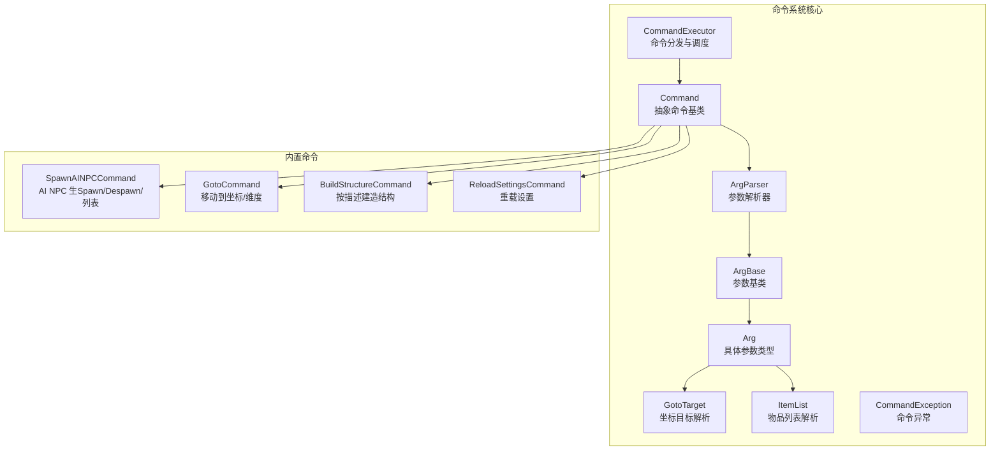
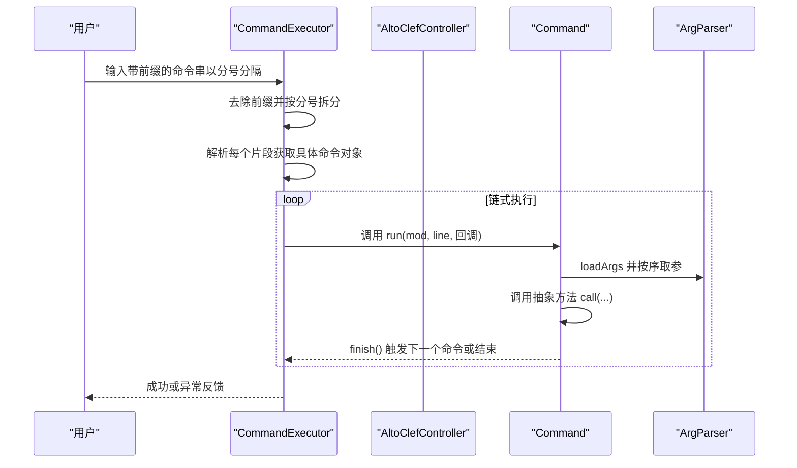
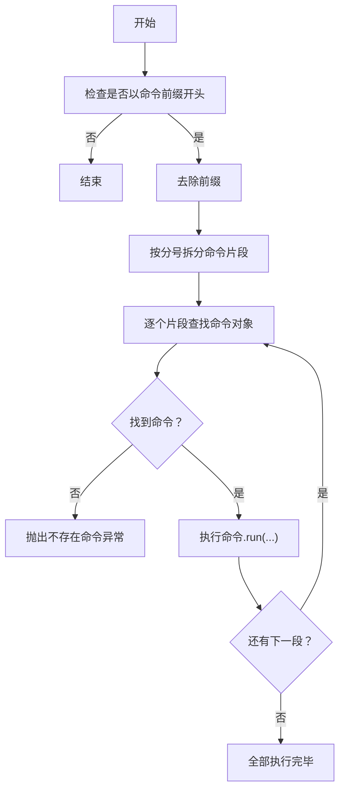
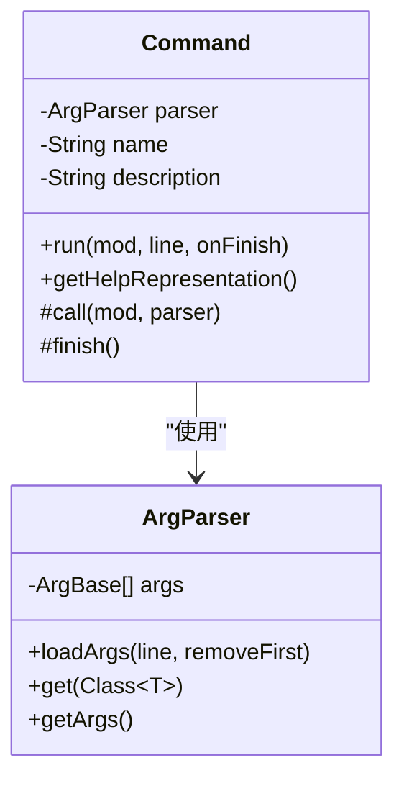
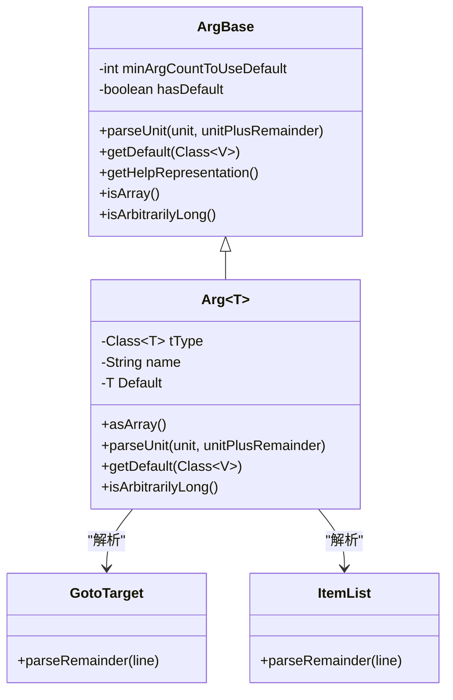
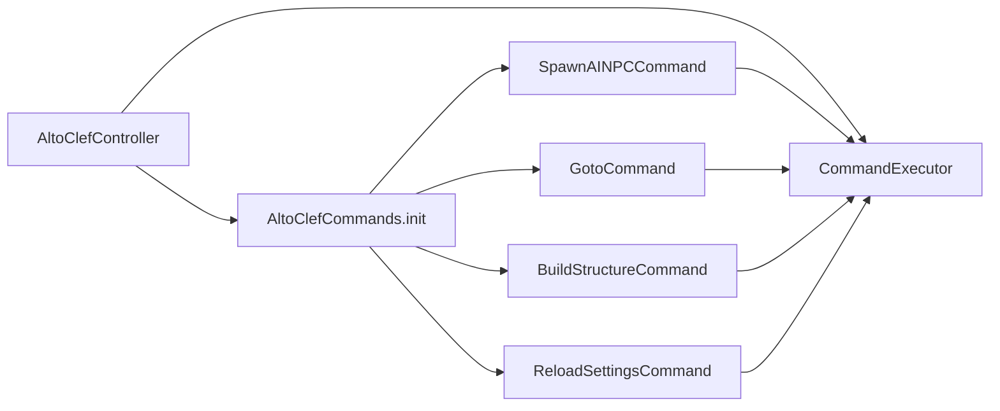

# 命令系统

<cite>
**本文引用的文件**
- [CommandExecutor.java](file://src/main/java/adris/altoclef/commandsystem/CommandExecutor.java)
- [Command.java](file://src/main/java/adris/altoclef/commandsystem/Command.java)
- [ArgParser.java](file://src/main/java/adris/altoclef/commandsystem/ArgParser.java)
- [ArgBase.java](file://src/main/java/adris/altoclef/commandsystem/ArgBase.java)
- [Arg.java](file://src/main/java/adris/altoclef/commandsystem/Arg.java)
- [GotoTarget.java](file://src/main/java/adris/altoclef/commandsystem/GotoTarget.java)
- [ItemList.java](file://src/main/java/adris/altoclef/commandsystem/ItemList.java)
- [CommandException.java](file://src/main/java/adris/altoclef/commandsystem/CommandException.java)
- [AltoClefCommands.java](file://src/main/java/adris/altoclef/AltoClefCommands.java)
- [AltoClefController.java](file://src/main/java/adris/altoclef/AltoClefController.java)
- [SpawnAINPCCommand.java](file://src/main/java/adris/altoclef/commands/SpawnAINPCCommand.java)
- [GotoCommand.java](file://src/main/java/adris/altoclef/commands/GotoCommand.java)
- [BuildStructureCommand.java](file://src/main/java/adris/altoclef/commands/BuildStructureCommand.java)
- [ReloadSettingsCommand.java](file://src/main/java/adris/altoclef/commands/ReloadSettingsCommand.java)
</cite>

## 目录
1. [简介](#简介)
2. [项目结构](#项目结构)
3. [核心组件](#核心组件)
4. [架构总览](#架构总览)
5. [详细组件分析](#详细组件分析)
6. [依赖分析](#依赖分析)
7. [性能考量](#性能考量)
8. [故障排查指南](#故障排查指南)
9. [结论](#结论)
10. [附录：扩展与最佳实践](#附录扩展与最佳实践)

## 简介
本文件面向“命令系统”的技术文档，聚焦于聊天命令的架构设计与实现细节，涵盖命令分发器 CommandExecutor 的命令解析与调度、参数解析器 ArgParser 的参数提取与类型转换、抽象命令基类 Command 的统一入口与帮助生成等核心模块。同时，文档深入讲解命令系统的扩展机制（自定义命令创建、参数类型定义、权限控制策略），并结合内置命令如 SpawnAINPCCommand、GotoCommand、BuildStructureCommand 等进行功能说明与使用指引。最后提供可操作的代码示例路径、最佳实践与安全注意事项。

## 项目结构
命令系统位于模块路径 adris.altoclef.commandsystem 下，围绕 CommandExecutor、Command、ArgParser 及其参数类型展开；内置命令集中在 adris.altoclef.commands 包中，并通过 AltoClefCommands 进行集中注册。

图表来源
- [CommandExecutor.java:11-120](file://src/main/java/adris/altoclef/commandsystem/CommandExecutor.java#L11-L120)
- [Command.java:6-60](file://src/main/java/adris/altoclef/commandsystem/Command.java#L6-L60)
- [ArgParser.java:6-105](file://src/main/java/adris/altoclef/commandsystem/ArgParser.java#L6-L105)
- [ArgBase.java:5-43](file://src/main/java/adris/altoclef/commandsystem/ArgBase.java#L5-L43)
- [Arg.java:3-170](file://src/main/java/adris/altoclef/commandsystem/Arg.java#L3-L170)
- [GotoTarget.java:7-101](file://src/main/java/adris/altoclef/commandsystem/GotoTarget.java#L7-L101)
- [ItemList.java:9-89](file://src/main/java/adris/altoclef/commandsystem/ItemList.java#L9-L89)
- [SpawnAINPCCommand.java:18-105](file://src/main/java/adris/altoclef/commands/SpawnAINPCCommand.java#L18-L105)
- [GotoCommand.java:20-65](file://src/main/java/adris/altoclef/commands/GotoCommand.java#L20-L65)
- [BuildStructureCommand.java:10-29](file://src/main/java/adris/altoclef/commands/BuildStructureCommand.java#L10-L29)
- [ReloadSettingsCommand.java:8-18](file://src/main/java/adris/altoclef/commands/ReloadSettingsCommand.java#L8-L18)

章节来源
- [AltoClefController.java:101-130](file://src/main/java/adris/altoclef/AltoClefController.java#L101-L130)
- [AltoClefCommands.java:31-63](file://src/main/java/adris/altoclef/AltoClefCommands.java#L31-L63)

## 核心组件
- CommandExecutor：负责命令注册、前缀识别、命令拆分与链式执行、异常收集与提示。
- Command：抽象命令基类，封装参数解析器、帮助信息生成、日志输出、完成回调。
- ArgParser：将输入行切分为关键字单元，按顺序从 ArgBase 列表中取出参数并进行类型转换。
- ArgBase/Arg<T>：参数基类与泛型参数实现，支持默认值、数组参数、任意长度参数、枚举解析等。
- GotoTarget/ItemList：内置参数类型，分别用于解析坐标/维度目标与物品清单。
- CommandException：命令系统统一异常类型，便于上层捕获与友好提示。

章节来源
- [CommandExecutor.java:11-120](file://src/main/java/adris/altoclef/commandsystem/CommandExecutor.java#L11-L120)
- [Command.java:6-60](file://src/main/java/adris/altoclef/commandsystem/Command.java#L6-L60)
- [ArgParser.java:6-105](file://src/main/java/adris/altoclef/commandsystem/ArgParser.java#L6-L105)
- [ArgBase.java:5-43](file://src/main/java/adris/altoclef/commandsystem/ArgBase.java#L5-L43)
- [Arg.java:3-170](file://src/main/java/adris/altoclef/commandsystem/Arg.java#L3-L170)
- [GotoTarget.java:7-101](file://src/main/java/adris/altoclef/commandsystem/GotoTarget.java#L7-L101)
- [ItemList.java:9-89](file://src/main/java/adris/altoclef/commandsystem/ItemList.java#L9-L89)
- [CommandException.java:3-10](file://src/main/java/adris/altoclef/commandsystem/CommandException.java#L3-L10)

## 架构总览
命令从聊天输入进入，由 CommandExecutor 识别命令前缀并拆分为多段命令，逐个查找已注册命令，调用 Command.run 完成参数解析与业务执行，最终通过完成回调推进下一个命令或结束链式执行。

图表来源
- [CommandExecutor.java:58-76](file://src/main/java/adris/altoclef/commandsystem/CommandExecutor.java#L58-L76)
- [Command.java:19-24](file://src/main/java/adris/altoclef/commandsystem/Command.java#L19-L24)
- [ArgParser.java:57-96](file://src/main/java/adris/altoclef/commandsystem/ArgParser.java#L57-L96)

## 详细组件分析

### CommandExecutor：命令分发与链式执行
- 注册与查询：通过名称注册命令，支持批量注册与按名检索。
- 前缀与拆分：根据配置前缀判断是否客户端命令；去除前缀后按分号拆分为多个命令片段。
- 递归执行：对每个片段查找对应命令对象，依次执行；若出现异常，拼接帮助信息并传递给回调。
- 日志与调试：记录解析结果，便于问题定位。

图表来源
- [CommandExecutor.java:58-76](file://src/main/java/adris/altoclef/commandsystem/CommandExecutor.java#L58-L76)
- [CommandExecutor.java:94-111](file://src/main/java/adris/altoclef/commandsystem/CommandExecutor.java#L94-L111)

章节来源
- [CommandExecutor.java:11-120](file://src/main/java/adris/altoclef/commandsystem/CommandExecutor.java#L11-L120)

### Command：抽象命令基类与帮助生成
- 统一入口：run 接受 mod、原始行与完成回调，内部加载参数并调用抽象 call 方法。
- 参数解析：委托 ArgParser 完成参数提取与类型转换。
- 帮助信息：getHelpRepresentation 拼接命令名与各参数占位符，便于错误提示。
- 日志与完成：提供日志输出与 finish 回调触发。

图表来源
- [Command.java:6-60](file://src/main/java/adris/altoclef/commandsystem/Command.java#L6-L60)
- [ArgParser.java:6-105](file://src/main/java/adris/altoclef/commandsystem/ArgParser.java#L6-L105)

章节来源
- [Command.java:6-60](file://src/main/java/adris/altoclef/commandsystem/Command.java#L6-L60)

### ArgParser 与参数类型体系
- 关键字切分：支持引号包裹与转义字符，注释符号截断，空格分隔关键字。
- 参数消费：按 ArgBase 列表顺序消费单位，支持默认值、数组参数、任意长度参数。
- 类型转换：Arg<T> 支持枚举、数值、字符串、ItemList、GotoTarget 等类型解析。

图表来源
- [ArgBase.java:5-43](file://src/main/java/adris/altoclef/commandsystem/ArgBase.java#L5-L43)
- [Arg.java:3-170](file://src/main/java/adris/altoclef/commandsystem/Arg.java#L3-L170)
- [GotoTarget.java:22-68](file://src/main/java/adris/altoclef/commandsystem/GotoTarget.java#L22-L68)
- [ItemList.java:16-88](file://src/main/java/adris/altoclef/commandsystem/ItemList.java#L16-L88)

章节来源
- [ArgParser.java:18-105](file://src/main/java/adris/altoclef/commandsystem/ArgParser.java#L18-L105)
- [ArgBase.java:5-43](file://src/main/java/adris/altoclef/commandsystem/ArgBase.java#L5-L43)
- [Arg.java:3-170](file://src/main/java/adris/altoclef/commandsystem/Arg.java#L3-L170)
- [GotoTarget.java:22-68](file://src/main/java/adris/altoclef/commandsystem/GotoTarget.java#L22-L68)
- [ItemList.java:16-88](file://src/main/java/adris/altoclef/commandsystem/ItemList.java#L16-L88)

### 内置命令详解

#### SpawnAINPCCommand：AI NPC 生命周期管理
- 子命令：
  - spawn：按名称与可选 persona_id 生成 NPC，失败时提示找不到 persona。
  - despawn：按名称反注册 NPC，返回成功/失败状态。
  - npcls：列出所有活跃 NPC 及存活时间。
- 业务要点：与 NPC 生命周期管理器协作，消息通过服务器玩家显示。

章节来源
- [SpawnAINPCCommand.java:20-98](file://src/main/java/adris/altoclef/commands/SpawnAINPCCommand.java#L20-L98)

#### GotoCommand：移动到目标位置/维度
- 参数：GotoTarget 支持 XYZ、XZ、Y、NONE 四种模式，自动解析坐标与维度。
- 安全守卫：当目标距离超过阈值时拒绝远距离传送，改为跟随拥有者。
- 任务映射：根据目标类型映射到不同移动任务。

章节来源
- [GotoCommand.java:24-64](file://src/main/java/adris/altoclef/commands/GotoCommand.java#L24-L64)
- [GotoTarget.java:22-68](file://src/main/java/adris/altoclef/commandsystem/GotoTarget.java#L22-L68)

#### BuildStructureCommand：按描述建造结构
- 参数：接受一个结构描述字符串，内部构造建造任务并交由控制器执行。
- 使用建议：必须在描述中包含明确的坐标信息，否则无法定位构建位置。

章节来源
- [BuildStructureCommand.java:10-29](file://src/main/java/adris/altoclef/commands/BuildStructureCommand.java#L10-L29)

#### ReloadSettingsCommand：重载配置
- 行为：调用配置重载工具并输出成功日志。

章节来源
- [ReloadSettingsCommand.java:8-18](file://src/main/java/adris/altoclef/commands/ReloadSettingsCommand.java#L8-L18)

## 依赖分析
- 注册与初始化：AltoClefController 在构造阶段创建 CommandExecutor，并在 initializeCommands 中调用 AltoClefCommands.init 完成命令注册。
- 执行入口：CommandExecutor.execute 接收原始命令串，按前缀与分号进行拆分与执行。
- 参数类型：Arg<T> 依赖 GotoTarget 与 ItemList 的解析能力；GotoTarget 依赖维度枚举解析。

图表来源
- [AltoClefController.java:101-130](file://src/main/java/adris/altoclef/AltoClefController.java#L101-L130)
- [AltoClefCommands.java:31-63](file://src/main/java/adris/altoclef/AltoClefCommands.java#L31-L63)
- [CommandExecutor.java:11-120](file://src/main/java/adris/altoclef/commandsystem/CommandExecutor.java#L11-L120)

章节来源
- [AltoClefController.java:101-130](file://src/main/java/adris/altoclef/AltoClefController.java#L101-L130)
- [AltoClefCommands.java:31-63](file://src/main/java/adris/altoclef/AltoClefCommands.java#L31-L63)

## 性能考量
- 命令链式执行：分号分隔的多命令串会逐个执行，注意避免过长链导致延迟累积。
- 参数解析成本：复杂参数（如 ItemList）涉及模糊匹配与目录校验，建议在高频命令中减少不必要的解析开销。
- 日志与异常：异常时会拼接帮助信息，频繁报错可能带来额外字符串处理成本，建议在生产环境适当降低日志级别。

## 故障排查指南
- 常见异常来源：
  - 命令不存在：CommandExecutor.getCommand 抛出异常。
  - 参数不足/过多：ArgParser.get 抛出异常。
  - 类型解析失败：Arg<T> 对应类型解析失败。
- 建议排查步骤：
  - 检查命令前缀与大小写。
  - 查看 help 提示，确认参数顺序与数量。
  - 分段执行命令串，定位具体失败片段。
  - 查看日志中的“Usage”提示，核对参数格式。

章节来源
- [CommandExecutor.java:94-111](file://src/main/java/adris/altoclef/commandsystem/CommandExecutor.java#L94-L111)
- [ArgParser.java:69-96](file://src/main/java/adris/altoclef/commandsystem/ArgParser.java#L69-L96)
- [Arg.java:97-149](file://src/main/java/adris/altoclef/commandsystem/Arg.java#L97-L149)

## 结论
该命令系统以 CommandExecutor 为核心，结合 Command 抽象与 ArgParser 类型化参数解析，形成清晰的命令生命周期与扩展点。内置命令覆盖 AI NPC 生命周期、移动导航与结构建造等关键场景。通过合理的参数类型与帮助信息生成，系统在易用性与可维护性之间取得平衡。后续扩展可通过新增命令与参数类型来增强能力。

## 附录：扩展与最佳实践

### 如何创建一个新的聊天命令
- 步骤
  - 新建类继承 Command，在构造函数中声明命令名、描述与参数列表（Arg<T>）。
  - 实现抽象方法 call，使用 parser.get 获取参数并执行业务逻辑。
  - 在 AltoClefCommands.init 中注册新命令实例。
  - 如需默认值或数组参数，使用 Arg 的默认构造或 asArray。
- 示例参考路径
  - [新建命令模板:13-24](file://src/main/java/adris/altoclef/commandsystem/Command.java#L13-L24)
  - [参数定义与默认值:25-35](file://src/main/java/adris/altoclef/commandsystem/Arg.java#L25-L35)
  - [注册命令:32-62](file://src/main/java/adris/altoclef/AltoClefCommands.java#L32-L62)

章节来源
- [Command.java:13-24](file://src/main/java/adris/altoclef/commandsystem/Command.java#L13-L24)
- [Arg.java:25-35](file://src/main/java/adris/altoclef/commandsystem/Arg.java#L25-L35)
- [AltoClefCommands.java:32-62](file://src/main/java/adris/altoclef/AltoClefCommands.java#L32-L62)

### 如何定义命令参数类型
- 内置类型
  - 数值：Integer、Long、Float、Double。
  - 字符串：String（支持引号包裹与转义）。
  - 枚举：自动小写匹配与可用值提示。
  - 特殊类型：GotoTarget（坐标/维度）、ItemList（物品清单）。
- 自定义参数类型
  - 继承 ArgBase，实现 parseUnit 与 getDefault，必要时覆写 isArbitrarilyLong/array。
- 示例参考路径
  - [参数类型解析实现:97-149](file://src/main/java/adris/altoclef/commandsystem/Arg.java#L97-L149)
  - [GotoTarget 解析:22-68](file://src/main/java/adris/altoclef/commandsystem/GotoTarget.java#L22-L68)
  - [ItemList 解析:16-88](file://src/main/java/adris/altoclef/commandsystem/ItemList.java#L16-L88)

章节来源
- [Arg.java:97-149](file://src/main/java/adris/altoclef/commandsystem/Arg.java#L97-L149)
- [GotoTarget.java:22-68](file://src/main/java/adris/altoclef/commandsystem/GotoTarget.java#L22-L68)
- [ItemList.java:16-88](file://src/main/java/adris/altoclef/commandsystem/ItemList.java#L16-L88)

### 命令权限与安全控制
- 前缀与白名单：通过命令前缀过滤非预期输入，避免误触发。
- 异常与帮助：统一异常包装并在错误时附带 Usage 提示，减少误用。
- 业务守卫：如 GotoCommand 的距离守卫，防止滥用造成体验问题。
- 最佳实践
  - 为高风险命令（如远程传送、大规模建造）增加额外守卫条件。
  - 对外部输入进行严格校验与最小化授权，避免越权操作。
  - 记录命令执行日志，便于审计与回溯。

章节来源
- [CommandExecutor.java:30-36](file://src/main/java/adris/altoclef/commandsystem/CommandExecutor.java#L30-L36)
- [GotoCommand.java:46-61](file://src/main/java/adris/altoclef/commands/GotoCommand.java#L46-L61)